# [MS-WSRVCAT]: WS-AtomicTransaction (WS-AT) Version 1.0 Protocol Extensions

Table of Contents

1 Introduction

- [1 Introduction](#Section_1)
  - [1.1 Glossary](#Section_1.1)
  - [1.2 References](#Section_1.2)
    - [1.2.1 Normative References](#Section_1.2.1)
    - [1.2.2 Informative References](#Section_1.2.2)
  - [1.3 Overview](#Section_1.3)
    - [1.3.1 Scenario 1: Flowing a Transaction from an Initiator to a Server Application](#Section_1.3.1)
    - [1.3.2 Scenario 2: Flowing a Transaction from a Client Application to a Participant](#Section_1.3.2)
      - [1.3.2.1 Scenario 2a: Flowing a WS-AtomicTransaction CoordinationContext from a Client Application to a Participant](#Section_1.3.2.1)
      - [1.3.2.2 Scenario 2b: Flowing a Transaction from a Client Application to a Participant Using WS-AtomicTransaction](#Section_1.3.2.2)
    - [1.3.3 Scenario 3: Flowing a Transaction from Client Application to a Server Application](#Section_1.3.3)
      - [1.3.3.1 Scenario 3a: Server Application Uses Pull Propagation](#Section_1.3.3.1)
      - [1.3.3.2 Scenario 3b: Server Application Requests Activation Using an Existing CoordinationContext](#Section_1.3.3.2)
  - [1.4 Relationship to Other Protocols](#Section_1.4)
  - [1.5 Prerequisites/Preconditions](#Section_1.5)
  - [1.6 Applicability Statement](#Section_1.6)
  - [1.7 Versioning and Capability Negotiation](#Section_1.7)
  - [1.8 Vendor-Extensible Fields](#Section_1.8)
  - [1.9 Standards Assignments](#Section_1.9)

2 Messages

- [2 Messages](#Section_2)
  - [2.1 Transport](#Section_2.1)
  - [2.2 Message Syntax](#Section_2.2)
    - [2.2.1 Protocol Versioning](#Section_2.2.1)
    - [2.2.2 Data Types Used When Discovering Coordinator Activation and Registration Service URIs](#Section_2.2.2)
      - [2.2.2.1 Enumerations](#Section_2.2.2.1)
        - [2.2.2.1.1 ControlProtocol](#Section_2.2.2.1.1)
        - [2.2.2.1.2 IsolationLevel](#Section_2.2.2.1.2)
      - [2.2.2.2 Structures](#Section_2.2.2.2)
        - [2.2.2.2.1 ProtocolInformationFlags](#Section_2.2.2.2.1)
        - [2.2.2.2.2 SupportedProtocolsFlags](#Section_2.2.2.2.2)
        - [2.2.2.2.3 VariableCharArray](#Section_2.2.2.2.3)
        - [2.2.2.2.4 WSAT_ProtocolGuid](#Section_2.2.2.2.4)
        - [2.2.2.2.5 ExtendedWhereabouts](#Section_2.2.2.2.5)
      - [2.2.2.3 Coordinator Activation Service URIs](#Section_2.2.2.3)
        - [2.2.2.3.1 HTTPS Activation Service Version 1.0 X.509 URI](#Section_2.2.2.3.1)
        - [2.2.2.3.2 HTTPS Activation Service Version 1.1 X.509 URI](#Section_2.2.2.3.2)
        - [2.2.2.3.3 HTTPS Activation Service Version 1.0 SPNEGO URI](#Section_2.2.2.3.3)
        - [2.2.2.3.4 HTTPS Activation Service Version 1.1 SPNEGO URI](#Section_2.2.2.3.4)
      - [2.2.2.4 Coordinator Registration Service URIs](#Section_2.2.2.4)
        - [2.2.2.4.1 HTTPS Registration Service Version 1.0 X.509 URI](#Section_2.2.2.4.1)
        - [2.2.2.4.2 HTTPS Registration Service Version 1.1 X.509 URI](#Section_2.2.2.4.2)
    - [2.2.3 Data Types Used to Extend WS-AtomicTransaction](#Section_2.2.3)
      - [2.2.3.1 Common Data Types](#Section_2.2.3.1)
        - [2.2.3.1.1 GuidStringType Complex Type](#Section_2.2.3.1.1)
        - [2.2.3.1.2 UrnUuidStringType Complex Type](#Section_2.2.3.1.2)
        - [2.2.3.1.3 Enlistment Element](#Section_2.2.3.1.3)
        - [2.2.3.1.4 Loopback Element](#Section_2.2.3.1.4)
        - [2.2.3.1.5 LocalTransactionId Element](#Section_2.2.3.1.5)
        - [2.2.3.1.6 RegisterInfo Element](#Section_2.2.3.1.6)
        - [2.2.3.1.7 PropagationToken Element](#Section_2.2.3.1.7)
        - [2.2.3.1.8 CoordinationContextAnyElementType Complex Type](#Section_2.2.3.1.8)
        - [2.2.3.1.9 OleTxTransaction Element](#Section_2.2.3.1.9)
        - [2.2.3.1.10 WS-AtomicTransaction (WS-AT) Protocol Extensions Error Codes](#Section_2.2.3.1.10)
      - [2.2.3.2 Extended WS-AtomicTransaction Elements and Messages](#Section_2.2.3.2)
        - [2.2.3.2.1 CoordinationContext Element](#Section_2.2.3.2.1)
        - [2.2.3.2.2 Register Element](#Section_2.2.3.2.2)
        - [2.2.3.2.3 RegisterResponse Message](#Section_2.2.3.2.3)
        - [2.2.3.2.4 FlowTransaction Message](#Section_2.2.3.2.4)

3 Protocol Details

- [3 Protocol Details](#Section_3)
  - [3.1 AppClient Role Details](#Section_3.1)
    - [3.1.1 Abstract Data Model](#Section_3.1.1)
    - [3.1.2 Timers](#Section_3.1.2)
    - [3.1.3 Initialization](#Section_3.1.3)
    - [3.1.4 Higher-Layer Triggered Events](#Section_3.1.4)
      - [3.1.4.1 BUILD_COORDINATION_CONTEXT](#Section_3.1.4.1)
      - [3.1.4.2 FORMAT_FLOW_TRANSACTION](#Section_3.1.4.2)
    - [3.1.5 Message Processing Events and Sequencing Rules](#Section_3.1.5)
    - [3.1.6 Timer Events](#Section_3.1.6)
    - [3.1.7 Other Local Events](#Section_3.1.7)
  - [3.2 AppServer Role Details](#Section_3.2)
    - [3.2.1 Abstract Data Model](#Section_3.2.1)
    - [3.2.2 Timers](#Section_3.2.2)
    - [3.2.3 Initialization](#Section_3.2.3)
    - [3.2.4 Higher-Layer Triggered Events](#Section_3.2.4)
      - [3.2.4.1 PARSE_FLOW_TRANSACTION](#Section_3.2.4.1)
    - [3.2.5 Message Processing Events and Sequencing Rules](#Section_3.2.5)
    - [3.2.6 Timer Events](#Section_3.2.6)
    - [3.2.7 Other Local Events](#Section_3.2.7)

4 Protocol Examples

- [4 Protocol Examples](#Section_4)
  - [4.1 Locating the Activation Service Endpoints](#Section_4.1)
    - [4.1.1 Obtaining an Array of SExtendedEndpointInfo Structures](#Section_4.1.1)
    - [4.1.2 Obtaining the WS-AtomicTransaction Activation Service Endpoints of the Transaction Coordinator](#Section_4.1.2)
  - [4.2 Propagating and Committing a Transaction Example](#Section_4.2)
    - [4.2.1 Creating a CoordinationContext](#Section_4.2.1)
    - [4.2.2 Registering for Completion](#Section_4.2.2)
    - [4.2.3 Propagating the Transaction](#Section_4.2.3)
    - [4.2.4 Completing the Transaction](#Section_4.2.4)

5 Security

- [5 Security](#Section_5)
  - [5.1 Security Considerations for Implementers](#Section_5.1)
  - [5.2 Index of Security Parameters](#Section_5.2)

6 Appendix A: Product Behavior

- [6 Appendix A: Product Behavior](#Section_6)

7 Change Tracking

- [7 Change Tracking](#Section_7)

For the legal notice and IP terms, see [LEGAL.md](../LEGAL.md).
Last updated: 3/13/2019.
See [Revision History](#revision-history) for full version history.

# 1 Introduction

The protocol specified in this document extends the WS-AtomicTransaction protocol specified in [[WSAT10]](https://go.microsoft.com/fwlink/?LinkId=113066) and [[WSAT11]](https://go.microsoft.com/fwlink/?LinkId=113067), by enabling software entities that use the WS-AtomicTransaction protocol to participate in transactions coordinated by OleTx transaction managers, as specified in [MS-DTCO](../MS-DTCO/MS-DTCO.md).

Sections 1.5, 1.8, 1.9, 2, and 3 of this specification are normative. All other sections and examples in this specification are informative.

## 1.1 Glossary

This document uses the following terms:

**base64 encoding**: A binary-to-text encoding scheme whereby an arbitrary sequence of bytes is converted to a sequence of printable ASCII characters, as described in [[RFC4648]](https://go.microsoft.com/fwlink/?LinkId=90487).

**client application**: A WS-AtomicTransaction [**initiator**](#gt_initiator) that also implements the Application Role Abstract Data Model, as specified in [MS-DTCO](../MS-DTCO/MS-DTCO.md), and the AppClient Role, as specified in section 1.3.

**coordinator**: A coordinator as specified in [[WSAT10]](https://go.microsoft.com/fwlink/?LinkId=113066) and [[WSAT11]](https://go.microsoft.com/fwlink/?LinkId=113067).

**fully qualified domain name (FQDN)**: An unambiguous domain name that gives an absolute location in the Domain Name System's (DNS) hierarchy tree, as defined in [[RFC1035]](https://go.microsoft.com/fwlink/?LinkId=90264) section 3.1 and [[RFC2181]](https://go.microsoft.com/fwlink/?LinkId=127732) section 11.

**globally unique identifier (GUID)**: A term used interchangeably with universally unique identifier (UUID) in Microsoft protocol technical documents (TDs). Interchanging the usage of these terms does not imply or require a specific algorithm or mechanism to generate the value. Specifically, the use of this term does not imply or require that the algorithms described in [[RFC4122]](https://go.microsoft.com/fwlink/?LinkId=90460) or [[C706]](https://go.microsoft.com/fwlink/?LinkId=89824) must be used for generating the [**GUID**](#gt_globally-unique-identifier-guid). See also universally unique identifier (UUID).

**GUIDString**: A [**GUID**](#gt_globally-unique-identifier-guid) in the form of an ASCII or Unicode string, consisting of one group of 8 hexadecimal digits, followed by three groups of 4 hexadecimal digits each, followed by one group of 12 hexadecimal digits. It is the standard representation of a GUID, as described in [RFC4122] section 3. For example, "6B29FC40-CA47-1067-B31D-00DD010662DA". Unlike a curly braced GUID string, a GUIDString is not enclosed in braces.

**initiator**: An initiator as specified [WSAT10] and [WSAT11].

**NULL GUID**: A [**GUID**](#gt_globally-unique-identifier-guid) of all zeros.

**OleTx**: A comprehensive distributed transaction manager processing protocol that uses the protocols specified in the following document(s): [MS-CMPO](#Section_2.1), [MS-CMP](../MS-CMP/MS-CMP.md), [MS-DTCLU](../MS-DTCLU/MS-DTCLU.md), [MS-DTCM](../MS-DTCM/MS-DTCM.md), [MS-DTCO], [MC-DTCXA](../MC-DTCXA/MC-DTCXA.md), [MS-TIPP](../MS-TIPP/MS-TIPP.md), and [MS-CMOM](../MS-CMOM/MS-CMOM.md).

**participant**: Any of the parties that are involved in an atomic transaction and that have a stake in the operations that are performed under the [**transaction**](#gt_transaction) or in the outcome of the [**transaction**](#gt_transaction) ([WSAT10], [WSAT11]).

**server application**: A WS-AtomicTransaction [**participant**](#gt_participant) that also implements the Application Role, as specified in [MS-DTCO] section 1.3.3.1, and the AppServer Role, as specified in this document.

**transaction**: In OleTx, an atomic transaction.

**transaction coordinator**: A service that provides concrete mechanisms for beginning, propagating, and completing atomic transactions. A transaction coordinator also provides mechanisms for coordinating agreement on a single atomic outcome for each [**transaction**](#gt_transaction) and for reliably distributing that outcome to all participants in the [**transactions**](#gt_transaction). For more information, see [MS-DTCO].

**transaction identifier**: The [**GUID**](#gt_globally-unique-identifier-guid) that uniquely identifies an atomic transaction.

**transaction manager**: The party that is responsible for managing and distributing the outcome of atomic transactions. A transaction manager is either a root transaction manager or a subordinate transaction manager for a specified transaction.

**two-phase commit**: An agreement protocol that is used to resolve the outcome of an atomic transaction in response to a commit request from the root application. Phase One and Phase Two are the distinct phases of the Two-Phase Commit Protocol.

**MAY, SHOULD, MUST, SHOULD NOT, MUST NOT:** These terms (in all caps) are used as defined in [[RFC2119]](https://go.microsoft.com/fwlink/?LinkId=90317). All statements of optional behavior use either MAY, SHOULD, or SHOULD NOT.

## 1.2 References

Links to a document in the Microsoft Open Specifications library point to the correct section in the most recently published version of the referenced document. However, because individual documents in the library are not updated at the same time, the section numbers in the documents may not match. You can confirm the correct section numbering by checking the [Errata](https://go.microsoft.com/fwlink/?linkid=850906).

### 1.2.1 Normative References

We conduct frequent surveys of the normative references to assure their continued availability. If you have any issue with finding a normative reference, please contact [dochelp@microsoft.com](mailto:dochelp@microsoft.com). We will assist you in finding the relevant information.

[MS-CMPO] Microsoft Corporation, "[MSDTC Connection Manager: OleTx Transports Protocol](#Section_2.1)".

[MS-CMP] Microsoft Corporation, "[MSDTC Connection Manager: OleTx Multiplexing Protocol](../MS-CMP/MS-CMP.md)".

[MS-DTCO] Microsoft Corporation, "[MSDTC Connection Manager: OleTx Transaction Protocol](../MS-DTCO/MS-DTCO.md)".

[MS-DTYP] Microsoft Corporation, "[Windows Data Types](../MS-DTYP/MS-DTYP.md)".

[RFC2119] Bradner, S., "Key words for use in RFCs to Indicate Requirement Levels", BCP 14, RFC 2119, March 1997, [http://www.rfc-editor.org/rfc/rfc2119.txt](https://go.microsoft.com/fwlink/?LinkId=90317)

[RFC2234] Crocker, D. and Overell, P., "Augmented BNF for Syntax Specifications: ABNF", RFC 2234, November 1997, [http://www.ietf.org/rfc/rfc2234.txt](https://go.microsoft.com/fwlink/?LinkId=90323)

[RFC2396] Berners-Lee, T., Fielding, R., and Masinter, L., "Uniform Resource Identifiers (URI): Generic Syntax", RFC 2396, August 1998, [http://www.rfc-editor.org/rfc/rfc2396.txt](https://go.microsoft.com/fwlink/?LinkId=90339)

[RFC2616] Fielding, R., Gettys, J., Mogul, J., et al., "Hypertext Transfer Protocol -- HTTP/1.1", RFC 2616, June 1999, [http://www.rfc-editor.org/rfc/rfc2616.txt](https://go.microsoft.com/fwlink/?LinkId=90372)

[RFC2818] Rescorla, E., "HTTP Over TLS", RFC 2818, May 2000, [http://www.rfc-editor.org/rfc/rfc2818.txt](https://go.microsoft.com/fwlink/?LinkId=90383)

[SOAP1.1] Box, D., Ehnebuske, D., Kakivaya, G., et al., "Simple Object Access Protocol (SOAP) 1.1", W3C Note, May 2000, [http://www.w3.org/TR/2000/NOTE-SOAP-20000508/](https://go.microsoft.com/fwlink/?LinkId=90520)

[SOAP1.2-1/2003] Gudgin, M., Hadley, M., Mendelsohn, N., et al., "SOAP Version 1.2 Part 1: Messaging Framework", W3C Recommendation, June 2003, [http://www.w3.org/TR/2003/REC-soap12-part1-20030624](https://go.microsoft.com/fwlink/?LinkId=90521)

[WSADDR] Gudgin, M., Hadley, M., and Rogers, T., "Web Services Addressing (WS-Addressing) 1.0", W3C Recommendation, May 2006, [http://www.w3.org/2005/08/addressing](https://go.microsoft.com/fwlink/?LinkId=113065)

[WSAT10] Arjuna Technologies Ltd., BEA Systems, Hitachi Ltd., IBM, IONA Technologies and Microsoft, "Web Services Atomic Transaction (WS-AtomicTransaction)", August 2005, [http://schemas.xmlsoap.org/ws/2004/10/wsat/](https://go.microsoft.com/fwlink/?LinkId=113066)

[WSAT11] OASIS, "Web Services Atomic Transaction (WS-AtomicTransaction) Version 1.1", July 2007, [http://docs.oasis-open.org/ws-tx/wsat/2006/06](https://go.microsoft.com/fwlink/?LinkId=113067)

[WSC10] Arjuna Technologies Ltd., BEA Systems, Hitachi Ltd., IBM, IONA Technologies and Microsoft, "Web Services Coordination (WS-Coordination)", August 2005, [http://schemas.xmlsoap.org/ws/2004/10/wscoor/](https://go.microsoft.com/fwlink/?LinkId=113068)

[WSC11] OASIS, "Web Services Coordination (WS-Coordination) 1.1", March 2006, [http://docs.oasis-open.org/ws-tx/wscoor/2006/06](https://go.microsoft.com/fwlink/?LinkId=113069)

[WSSC] OpenNetwork, Layer7, Netegrity, Microsoft, Reactivity, IBM, VeriSign, BEA Systems, Oblix, RSA Security, Ping Identity, Westbridge, Computer Associates, "Web Services Secure Conversation Language (WS-SecureConversation)", February 2005, [http://schemas.xmlsoap.org/ws/2005/02/sc](https://go.microsoft.com/fwlink/?LinkId=113070)

[XML10/4] W3C Recommendation, "Extensible Markup Language (XML) 1.0 (Fourth Edition)", August 16, 2006, [http://www.w3.org/TR/2006/REC-xml-20060816](https://go.microsoft.com/fwlink/?LinkId=113071)

[XMLSCHEMA1.1/1] Thompson, H.S., Sperberg-McQueen, C.M., Mendelsohn, N., et al., Eds., "XML Schema 1.1 Part 1: Structures", W3C Working Draft, March 2006, [http://www.w3.org/TR/2006/WD-xmlschema11-1-20060330/](https://go.microsoft.com/fwlink/?LinkId=90605)

[XMLSCHEMA1.1/2:2008] Peterson, D., Biron, P.V., Malhotra, A., et al., Eds., "W3C XML Schema Definition Language (XSD) 1.1 Part 2: Datatypes", W3C Working Draft, June 2008, [http://www.w3.org/TR/2008/WD-xmlschema11-2-20080620/](https://go.microsoft.com/fwlink/?LinkId=90606)

### 1.2.2 Informative References

[COM+] Microsoft Corporation, "Availability of Windows Server 2003 Post-Service Pack 1 COM+ 1.5 Hotfix Rollup Package 8", Version 5.8, December 2007, [http://support.microsoft.com/?kbid=912818](https://go.microsoft.com/fwlink/?LinkId=121482)

[MC-NMF] Microsoft Corporation, "[.NET Message Framing Protocol](../MC-NMF/MC-NMF.md)".

[MS-NETOD] Microsoft Corporation, "[Microsoft .NET Framework Protocols Overview](#Section_1.3)".

[RFC2560] Myers, M., Ankney, R., Malpani, A., Glaperin, S., and Adams, C., "X.509 Internet Public Key Infrastructure Online Certificate Status Protocol - OCSP", RFC 2560, June 1999, [http://www.ietf.org/rfc/rfc2560.txt](https://go.microsoft.com/fwlink/?LinkId=90369)

[RFC4178] Zhu, L., Leach, P., Jaganathan, K., and Ingersoll, W., "The Simple and Protected Generic Security Service Application Program Interface (GSS-API) Negotiation Mechanism", RFC 4178, October 2005, [https://www.rfc-editor.org/rfc/rfc4178.txt](https://go.microsoft.com/fwlink/?LinkId=90461)

[XPCOM+] Microsoft Corporation, "Availability of Windows XP COM+ Hotfix Rollup Package 13", Version 2.5, December 2007, [http://support.microsoft.com/?kbid=912817](https://go.microsoft.com/fwlink/?LinkId=121481)

## 1.3 Overview

WS-AtomicTransaction, as specified in [[WSAT10]](https://go.microsoft.com/fwlink/?LinkId=113066) and [[WSAT11]](https://go.microsoft.com/fwlink/?LinkId=113067), defines three software entities that participate in Atomic Transactions:

- [**Initiator**](#gt_initiator): A software component that creates a CoordinationContext (that is, [**transaction**](#gt_transaction)) and registers for the Completion Protocol.
- [**Participant**](#gt_participant): A software component that requests activation of an existing CoordinationContext and registers for the [**Two-Phase Commit**](#gt_two-phase-commit) Protocol.
- [**Coordinator**](#gt_coordinator): A software component that manages the state of transactions and ensures a consistent outcome among the initiator and all participants in a given transaction. Coordinators, like participants, can also register for the Two-Phase Commit Protocol.
The protocol specified in this document extends the WS-AtomicTransaction protocol by enabling WS-AtomicTransaction initiators, participants, and coordinators to participate in transactions coordinated by [**OleTx**](#gt_oletx) [**transaction managers**](#gt_transaction-manager), as specified in [MS-DTCO](../MS-DTCO/MS-DTCO.md).

This protocol defines two roles:

- **AppClient Role**: This role is responsible for performing the following tasks:
- Building a [CoordinationContext Element](#Section_2.2.3.2.1), as specified in [[WSC10]](https://go.microsoft.com/fwlink/?LinkId=113068) and [[WSC11]](https://go.microsoft.com/fwlink/?LinkId=113069), from an OleTx transaction.
- Formatting a [FlowTransaction Message (section 2.2.3.2.4)](#Section_2.2.3.2.4).
- **AppServer Role**: This role is responsible for parsing a FlowTransaction Message (section 2.2.3.2.4).
This protocol defines the following software entities:

- [**Client Application**](#gt_client-application): A WS-AtomicTransaction initiator that also implements the Application Role Abstract Data Model, as specified in [MS-DTCO], and the AppClient Role, as specified in this document.
- [**Server Application**](#gt_server-application): A WS-AtomicTransaction participant that also implements the Application Role, as specified in [MS-DTCO] (section 1.3.3.1), and the AppServer Role, as specified in this document.
- [**Transaction Coordinator**](#gt_transaction-coordinator): A WS-AtomicTransaction coordinator that is also an implementation of the OleTx transaction manager, as specified in [MS-DTCO].
This protocol defines the extended data types and information used during WS-AtomicTransaction activation, registration and protocol processing, and application-to-application SOAP messaging (that is, initiator-to-participant messaging).

This protocol is applicable in the following three scenarios:

- A transaction is initiated by a WS-AtomicTransaction initiator and its coordinator. It is subsequently flowed to a server application and its transaction coordinator.
- A transaction is initiated by a client application and its transaction coordinator. It is subsequently flowed to a WS-AtomicTransaction participant and its coordinator.
- A transaction is initiated by a client application and its transaction coordinator. It is subsequently flowed to a server application and its transaction coordinator.

### 1.3.1 Scenario 1: Flowing a Transaction from an Initiator to a Server Application

In this scenario, a WS-AtomicTransaction [**initiator**](#gt_initiator) creates a [CoordinationContext (CC) Element](#Section_2.2.3.2.1) and flows the [**transaction**](#gt_transaction) to a [**server application**](#gt_server-application) as a header in an implementation-specific SOAP message (App-App).

The server application parses the message through the AppServer Role and locates a CoordinationContext Element, but does not locate a Propagation_Token. The server application then uses protocols specified in [MS-DTCO](../MS-DTCO/MS-DTCO.md) and data types specified in this document to obtain the Uniform Resource Identifier (URI) of the Activation Service of a [**transaction coordinator**](#gt_transaction-coordinator). The server application propagates the transaction by sending a CreateCoordinationContext containing the flowed CoordinationContext to the Activation Service URI using the protocols specified in [[WSAT10]](https://go.microsoft.com/fwlink/?LinkId=113066) and [[WSAT11]](https://go.microsoft.com/fwlink/?LinkId=113067), as shown in the following figure.

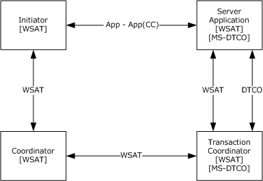

Figure 1: Flowing a transaction from an initiator to a server application

### 1.3.2 Scenario 2: Flowing a Transaction from a Client Application to a Participant

In this scenario, a [**client application**](#gt_client-application) creates a WS-AtomicTransaction [CoordinationContext (CC) Element](#Section_2.2.3.2.1) to flow to a WS-AtomicTransaction [**participant**](#gt_participant). Because the client application also supports [MS-DTCO](../MS-DTCO/MS-DTCO.md), it can create a CoordinationContext Element using one of two methods.

#### 1.3.2.1 Scenario 2a: Flowing a WS-AtomicTransaction CoordinationContext from a Client Application to a Participant

The [**client application**](#gt_client-application) uses protocols specified in [MS-DTCO](../MS-DTCO/MS-DTCO.md) and data types specified in this document to obtain the URI of the Activation Service of a [**transaction coordinator**](#gt_transaction-coordinator). The client application then requests a new CoordinationContext (that is, [**transaction**](#gt_transaction)) through the Activation Service URI by using the protocols specified in [[WSAT10]](https://go.microsoft.com/fwlink/?LinkId=113066) or [[WSAT11]](https://go.microsoft.com/fwlink/?LinkId=113067), depending on the implementation of the transaction coordinator.

In this scenario, the client application also creates a Propagation_Token (PT) from the transaction, as specified in [MS-DTCO] (section 2.2.5.4). The client application then inserts the Propagation_Token in the [CoordinationContext Element](#Section_2.2.3.2.1) by using the AppClient Role, and then flows the CoordinationContext Element in the header of an implementation-specific SOAP message (App-App) to a WS-AtomicTransaction [**participant**](#gt_participant).

The participant, which does not support the protocols specified in [MS-DTCO], locates the CoordinationContext Element in the header of the SOAP message and requests activation using the flowed CoordinationContext Element, as shown in the following figure.

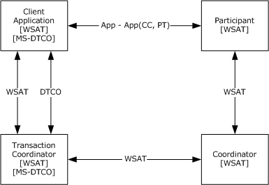

Figure 2: Flowing a WS-AtomicTransaction CoordinationContext from a client application to a participant

#### 1.3.2.2 Scenario 2b: Flowing a Transaction from a Client Application to a Participant Using WS-AtomicTransaction

The [**client application**](#gt_client-application) begins a new [**OleTx**](#gt_oletx) [**transaction**](#gt_transaction) using protocols specified in [MS-DTCO](../MS-DTCO/MS-DTCO.md). The client application also obtains the URI of the Registration Service of a [**transaction coordinator**](#gt_transaction-coordinator) using protocols specified in [MS-DTCO] and data types specified in this document. The client application then builds a [CoordinationContext Element](#Section_2.2.3.2.1) by using the Registration Service URI and the OleTx transaction through the AppClient Role.

In this scenario, the client application also creates a Propagation_Token (PT) from the transaction, as specified in [MS-DTCO] (section 2.2.5.4). The client application then inserts the Propagation_Token in the CoordinationContext Element by using the AppClient Role, and then it flows the CoordinationContext Element in the header of an implementation-specific SOAP message (App-App) to a WS-AtomicTransaction [**participant**](#gt_participant).

The participant, which does not support the protocols specified in [MS-DTCO], locates the CoordinationContext Element in the header of the SOAP message and requests activation using the flowed CoordinationContext Element, as shown in the following figure.

Figure 3: Flowing a transaction from a client application to a participant using WS-AtomicTransaction

### 1.3.3 Scenario 3: Flowing a Transaction from Client Application to a Server Application

In this scenario, a [**client application**](#gt_client-application) creates a [CoordinationContext (CC) Element](#Section_2.2.3.2.1) and [Propagation_Token (PT)](#Section_2.2.3.1.7) by using either of the two methods discussed in section [1.3.2](#Section_1.3.2). The client application flows the CoordinationContext Element (including the Propagation_Token) in the header of an implementation-specific SOAP message (App-App) to a [**server application**](#gt_server-application).

The server application parses the message through the AppServer Role and locates a CoordinationContext Element and a Propagation_Token. The server application then has the choice of either requesting activation using the flowed CoordinationContext Element or propagating the [**transaction**](#gt_transaction) using pull propagation, as specified in [MS-DTCO](../MS-DTCO/MS-DTCO.md) (section 3.3.5.2.1).

#### 1.3.3.1 Scenario 3a: Server Application Uses Pull Propagation

In this scenario, the [**server application**](#gt_server-application) uses pull propagation to propagate the [**transaction**](#gt_transaction), as shown in the following figure.

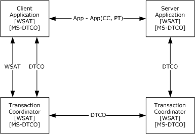

Figure 4: Server Application Using Pull Propagation

#### 1.3.3.2 Scenario 3b: Server Application Requests Activation Using an Existing CoordinationContext

If the [**server application**](#gt_server-application) does not use pull propagation (or if propagation of the [**transaction**](#gt_transaction) using pull propagation failed), then the server application propagates the transaction by sending a CreateCoordinationContext containing the flowed [CoordinationContext Element](#Section_2.2.3.2.1) to the Activation Service URI by using the protocols specified in [[WSAT10]](https://go.microsoft.com/fwlink/?LinkId=113066) and [[WSAT11]](https://go.microsoft.com/fwlink/?LinkId=113067), as shown in the following figure.

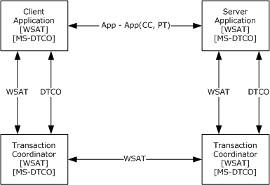

Figure 5: Server application requesting activation using an existing CoordinationContext

## 1.4 Relationship to Other Protocols

This protocol depends on WS-AtomicTransaction and the transaction protocol described in [MS-DTCO](../MS-DTCO/MS-DTCO.md), as shown in the following figure.

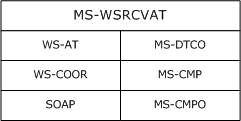

Figure 6: Relationship to other protocols

## 1.5 Prerequisites/Preconditions

This protocol requires the following:

- An implementation of a [**transaction coordinator**](#gt_transaction-coordinator), which supports the Abstract Data Model (as specified in [MS-DTCO](../MS-DTCO/MS-DTCO.md)) and also supports the coordination of WS-AtomicTransaction [**transactions**](#gt_transaction) (as specified in [[WSAT10]](https://go.microsoft.com/fwlink/?LinkId=113066) and [[WSAT11]](https://go.microsoft.com/fwlink/?LinkId=113067)), is present and running.
- The DTCO implementation SHOULD support CONNTYPE_TXUSER_EXTENDEDWHEREABOUTS as specified in [MS-DTCO] section 3.3.5.2.2.1.
- Either the implementation of a [**client application**](#gt_client-application) or a [**server application**](#gt_server-application) is present and running.

## 1.6 Applicability Statement

This protocol is applicable to scenarios that require the processing of WS-AtomicTransaction messages, as specified in [[WSAT10]](https://go.microsoft.com/fwlink/?LinkId=113066) and [[WSAT11]](https://go.microsoft.com/fwlink/?LinkId=113067), when one or more of the [**coordinators**](#gt_coordinator) involved are implemented as an [**OleTx**](#gt_oletx) [**transaction manager**](#gt_transaction-manager), as described in [MS-DTCO](../MS-DTCO/MS-DTCO.md).

This protocol requires network topologies where the transports protocol described in [MS-CMPO](#Section_2.1), the multiplexing protocol described in [MS-CMP](../MS-CMP/MS-CMP.md), and the SOAP protocols [[SOAP1.1]](https://go.microsoft.com/fwlink/?LinkId=90520) and [[SOAP1.2-1/2003]](https://go.microsoft.com/fwlink/?LinkId=90521) create a viable network transport for establishing many short-lived connection exchanges that accomplish specific tasks.<1>

## 1.7 Versioning and Capability Negotiation

This document covers versioning issues in the following areas:

- **Supported Transports**: This protocol is implemented using transports that support sending SOAP messages as discussed in section [2.1](#Section_2.1).
- **Protocol Versions**: This protocol is not versioned.
- **Capability Negotiation**: This protocol does not support version negotiation.

## 1.8 Vendor-Extensible Fields

None.

## 1.9 Standards Assignments

None.

# 2 Messages

## 2.1 Transport

The WS-AtomicTransaction (WS-AT) Protocol can be used over any transport protocol that supports transmitting messages specified by the following protocols:

- SOAP 1.1 [[SOAP1.1]](https://go.microsoft.com/fwlink/?LinkId=90520)
- SOAP 1.2 [[SOAP1.2-1/2003]](https://go.microsoft.com/fwlink/?LinkId=90521)
This specification uses the term SOAP to mean either SOAP 1.1 or SOAP 1.2. Where the differences between the two versions of the SOAP protocol are significant, either SOAP 1.1 or SOAP 1.2 is referenced.

The WS-AtomicTransaction (WS-AT) Protocol Extension software entities, Client Application, Server Application, and Transaction Coordinator, defined in section [1.3](#Section_1.3), use the following protocols as well:

- MSDTC Connection Manager: OleTx Multiplexing Protocol as specified in [MS-CMP](../MS-CMP/MS-CMP.md).
- MSDTC Connection Manager: OleTx Transports Protocol as specified in [MS-CMPO](#Section_2.1).

## 2.2 Message Syntax

This document specifies data types that are used by [**client applications**](#gt_client-application) and [**server applications**](#gt_server-application) when discovering the Activation and Registration Service URIs of a [**transaction coordinator**](#gt_transaction-coordinator), as specified in section [2.2.2](#Section_2.2.2). It also defines elements and an attribute that are used to extend the WS-AtomicTransaction ([[WSAT10]](https://go.microsoft.com/fwlink/?LinkId=113066) and [[WSAT11]](https://go.microsoft.com/fwlink/?LinkId=113067)) and WS-Coordination ([[WSC10]](https://go.microsoft.com/fwlink/?LinkId=113068) and [[WSC11]](https://go.microsoft.com/fwlink/?LinkId=113069)) specifications, as specified in section [2.2.3](#Section_2.2.3). This protocol also references commonly used data types as defined in [MS-DTYP](../MS-DTYP/MS-DTYP.md).

This specification uses the term WS-AtomicTransaction to mean either WS-AtomicTransaction Version 1.0 or WS-AtomicTransaction Version 1.1. Where the differences between the two versions of the WS-AtomicTransaction protocol are significant, either WS-AtomicTransaction Version 1.0 or WS-AtomicTransaction Version 1.1 is referenced.

This specification uses the term WS-Coordination to mean either WS-Coordination Version 1.0 or WS-Coordination Version 1.1. Where the differences between the two versions of the WS-Coordination protocol are significant, either WS-Coordination Version 1.0 or WS-Coordination Version 1.1 is referenced.

### 2.2.1 Protocol Versioning

This protocol extension is not versioned.

### 2.2.2 Data Types Used When Discovering Coordinator Activation and Registration Service URIs

These data types are used by [**client applications**](#gt_client-application) and [**server applications**](#gt_server-application) when discovering a [**transaction coordinator's**](#gt_transaction-coordinator) Activation and Registration Service URIs using **SExtendedEndpointInfo** information obtained through protocols as specified in [MS-DTCO](../MS-DTCO/MS-DTCO.md) (section 2.2.5.8).

#### 2.2.2.1 Enumerations

##### 2.2.2.1.1 ControlProtocol

The ControlProtocol enumeration values identify the three WS-AtomicTransaction protocols, as specified in [[WSAT10]](https://go.microsoft.com/fwlink/?LinkId=113066) and [[WSAT11]](https://go.microsoft.com/fwlink/?LinkId=113067).

typedef enum ControlProtocol

{

Completion = 1,

Volatile2PC = 2,

Durable2PC = 3

} ControlProtocol;

**Completion:** The Completion Protocol, as specified in [WSAT10] section 3.2 and [WSAT11] section 3.2.

**Volatile2PC:** The Volatile [**Two-Phase Commit**](#gt_two-phase-commit) Protocol, as specified in [WSAT10] section 3.3.1 and [WSAT11] section 3.3.1.

**Durable2PC:** The Durable Two-Phase Commit Protocol, as specified in [WSAT10] section 3.3.2 and [WSAT11] section 3.3.2.

##### 2.2.2.1.2 IsolationLevel

The IsolationLevel enumeration is a one-to-one mapping of the **OLETX_ISOLATION_LEVEL** enumeration, as specified in [MS-DTCO](../MS-DTCO/MS-DTCO.md) (section 2.2.6.9).

typedef enum IsolationLevel

{

Serializable = 0,

RepeatableRead = 1,

ReadCommitted = 2,

ReadUncommitted = 3,

Chaos = 5,

Unspecified = 6

} IsolationLevel;

**Serializable:** Equivalent to ISOLATIONLEVEL_SERIALIZABLE.

**RepeatableRead:** Equivalent to ISOLATIONLEVEL_REPEATABLEREAD.

**ReadCommitted:** Equivalent to ISOLATIONLEVEL_READCOMMITTED.

**ReadUncommitted:** Equivalent to ISOLATIONLEVEL_READUNCOMMITTED.

**Chaos:** Equivalent to ISOLATIONLEVEL_CHAOS.

**Unspecified:** Equivalent to ISOLATIONLEVEL_UPSPECIFIED.

#### 2.2.2.2 Structures

##### 2.2.2.2.1 ProtocolInformationFlags

The ProtocolInformationFlags is a byte field specifying network and security settings of the [**transaction coordinator**](#gt_transaction-coordinator) endpoint.

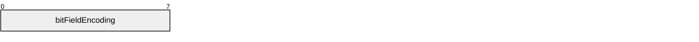

**bitFieldEncoding (1 byte):** The bits of this field MUST be encoded as follows.

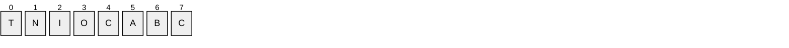

**T (1 bit):** A flag indicating whether the transaction coordinator supports the use of security context tokens, as specified in [[WSSC]](https://go.microsoft.com/fwlink/?LinkId=113070) and [[WSAT11]](https://go.microsoft.com/fwlink/?LinkId=113067). If the value is 1, then security context tokens are supported; otherwise, they are not.

**N (1 bit):** A flag indicating whether the Activation Service SPNEGO endpoints are available, as specified in sections [2.2.2.3.3](#Section_2.2.2.3.3) and [2.2.2.3.4](#Section_2.2.2.3.4). If the value is 1, then endpoints are enabled; otherwise, they are not.

**I (1 bit):** A flag indicating whether or not the transaction coordinator supports registration requests for [**Two-Phase Commit**](#gt_two-phase-commit) Protocol. If the value is 1, then registration requests for Two-Phase Commit Protocol are supported; otherwise, they are not. If the value of this flag is not 1, then the value of the "O" flag MUST be 1.

**O (1 bit):** A flag indicating whether or not the transaction coordinator supports requesting registration for Two-Phase Commit Protocol. If the value is 1, then requesting registration for Two-Phase Commit Protocol is supported; otherwise, it is not. If the value of this flag is not 1, then the value of the "I" flag MUST be 1.

**C (1 bit):** The flag and its value MUST be ignored.

**F - bit5 (1 bit):** Not used; set to 0 and ignored.

**G - bit6 (1 bit):** Not used; set to 0 and ignored.

**H - bit7 (1 bit):** Not used; set to 0 and ignored.

##### 2.2.2.2.2 SupportedProtocolsFlags

The SupportedProtocolsFlags is a 2-byte field consisting of bits that specify the WS-AtomicTransactions protocols supported by the [**Transaction Coordinator**](#gt_transaction-coordinator) endpoint.

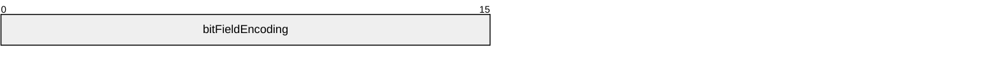

**bitFieldEncoding (2 bytes):** The bits of this data type MUST be encoded as follows.

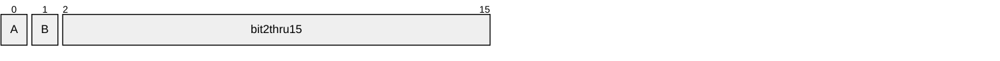

**A - V1.0 (1 bit):** A flag indicating whether WS-AtomicTransactions version 1.0 is supported by the endpoint. If the value is 1, then WS-AtomicTransactions version 1.0 is supported; otherwise, it is not.

| Value | Meaning |
| --- | --- |
| 0 | WS-AtomicTransactions version 1.0 is not supported. |
| 1 | WS-AtomicTransactions 1.0 is supported. |

**B - V1.1 (1 bit):** A flag indicating whether WS-AtomicTransactions version 1.1 is supported by the endpoint. If the value is 1, then WS-AtomicTransactions version 1.1 is supported; otherwise, it is not.

| Value | Meaning |
| --- | --- |
| 0 | WS-AtomicTransactions version 1.1 is not supported. |
| 1 | WS-AtomicTransactions version 1.1 is supported. |

**bit2thru15 (14 bits):** Not used.

##### 2.2.2.2.3 VariableCharArray

The VariableCharArray structure contains a variable-length array of Latin-1 ANSI characters.

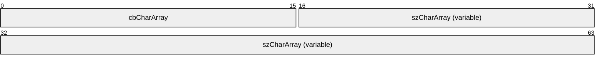

**cbCharArray (2 bytes):** A 2-byte, unsigned integer value specifying the length of the **szCharArray** field in bytes.

**szCharArray (variable):** A variable-length byte array that contains a nonterminated string of Latin-1 ANSI characters. The length of the array MUST be equal to the value of the **cbCharArray** field.

##### 2.2.2.2.4 WSAT_ProtocolGuid

The WSAT_ProtocolGuid is the binary representation of the [**GUID**](#gt_globally-unique-identifier-guid), (cc228cf4-a9c8-43fc-8281-8565eb5889f2), as defined in [MS-DTYP](../MS-DTYP/MS-DTYP.md) section 2.3.4.

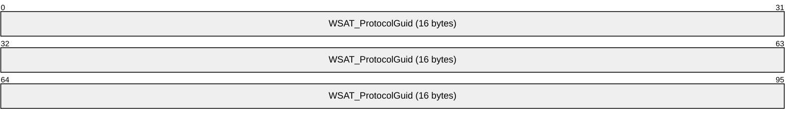

**WSAT_ProtocolGuid (16 bytes):** Binary representation of the GUID, cc228cf4-a9c8-43fc-8281-8565eb5889f2.

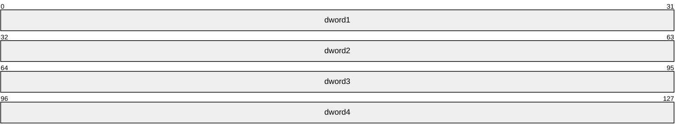

**dword1 (4 bytes):** MUST be set to 0xCC228CF4.

**dword2 (4 bytes):** MUST be set to 0x43FCA9C8.

**dword3 (4 bytes):** MUST be set to 0x65858182.

**dword4 (4 bytes):** MUST be set to 0xF28958EB.

##### 2.2.2.2.5 ExtendedWhereabouts

The ExtendedWhereabouts structure specifies the network location and security configuration of the [**transaction coordinator's**](#gt_transaction-coordinator) WS-AtomicTransactions endpoint.

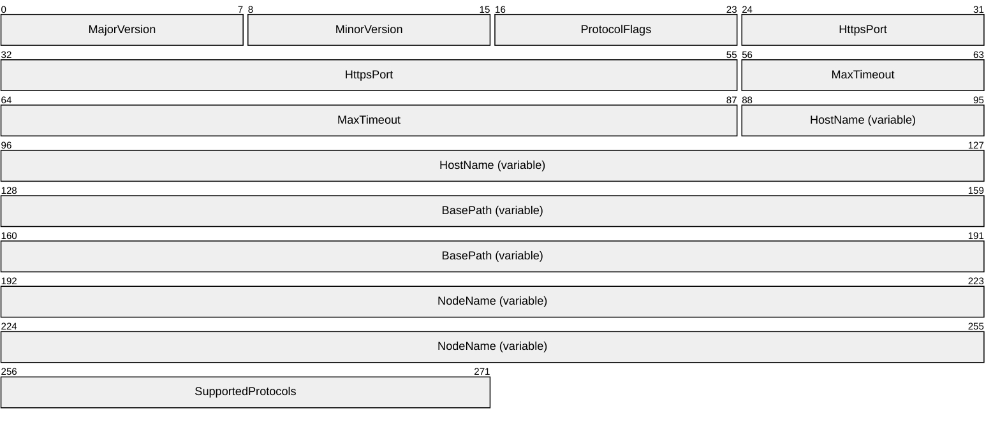

**MajorVersion (1 byte):** A 1-byte, unsigned integer value specifying the major version of the ExtendedWhereabouts structure. This value MUST be set to 0x01.

**MinorVersion (1 byte):** A 1-byte, unsigned integer value specifying the minor version of the ExtendedWhereabouts structure. This value MUST be set to one of the following values.

| Value | Meaning |
| --- | --- |
| 0x01 | MinorVersion_1 |
| 0x02 | MinorVersion_2 |

**ProtocolFlags (1 byte):** A 1-byte, [ProtocolInformationFlags](#Section_2.2.2.2.1) bit field.

**HttpsPort (4 bytes):** A 4-byte, unsigned integer specifying the HTTPS port number of the transaction coordinator WS-AtomicTransaction endpoints. This value MUST be between 1 and 65535, inclusively.

**MaxTimeout (4 bytes):** A 4-byte, unsigned integer specifying the maximum timeout in seconds allowed by the transaction coordinator. This value MUST be between 0 and 3600, inclusively.

**HostName (variable):** A [VariableCharArray](#Section_2.2.2.2.3) structure specifying the [**fully qualified domain name (FQDN)**](#gt_fully-qualified-domain-name-fqdn) of the transaction coordinator's WS-AtomicTransaction endpoints.

**BasePath (variable):** A VariableCharArray structure specifying the base path segment [[RFC2396]](https://go.microsoft.com/fwlink/?LinkId=90339) of the transaction coordinator's WS-AtomicTransaction endpoints.

**NodeName (variable):** A VariableCharArray structure specifying the NetBIOS name of the transaction coordinator's WS-AtomicTransaction endpoints.

**SupportedProtocols (2 bytes):** A [SupportedProtocolsFlags](#Section_2.2.2.2.2) bit field.

#### 2.2.2.3 Coordinator Activation Service URIs

##### 2.2.2.3.1 HTTPS Activation Service Version 1.0 X.509 URI

The HTTPS Activation Service Version 1.0 X.509 URI is an HTTP/TLS URI, as specified in [[RFC2616]](https://go.microsoft.com/fwlink/?LinkId=90372) and [[RFC2818]](https://go.microsoft.com/fwlink/?LinkId=90383), which results from resolving the following **ActSvc10_X509_URI Augmented Backus-Naur Form (ABNF)** rule [[RFC2234]](https://go.microsoft.com/fwlink/?LinkId=90323).

ActSvc10_X509_URI = "https:" "//" host ":" port abs_path

abs_path = "/" segment "/Activation/Coordinator/"

The ABNF tokens "host", "port", and "segment", specified in [[RFC2396]](https://go.microsoft.com/fwlink/?LinkId=90339), are used to construct HTTPS URIs as specified in [RFC2818]. The specific values for these tokens are derived from an [ExtendedWhereabouts](#Section_2.2.2.2.5) structure as follows.

**host:** MUST be the szCharArray field of the HostName field.

**port:** MUST be the HttpsPort field.

**segment:** MUST be the **szCharArray** field of the **BasePath** field.

If the "V1.0" **SupportedProtocolFlag** in the **SupportedProtocols** field of the ExtendedWhereabouts structure is 1, then the [**Coordinator**](#gt_coordinator) MUST implement the HTTPS Activation Service Version 1.0 X.509 endpoint at this URI.

##### 2.2.2.3.2 HTTPS Activation Service Version 1.1 X.509 URI

The HTTPS Activation Service Version 1.1 X.509 URI is an HTTP/TLS URI, as specified in [[RFC2616]](https://go.microsoft.com/fwlink/?LinkId=90372) and [[RFC2818]](https://go.microsoft.com/fwlink/?LinkId=90383), which results from resolving the following **ActSvc11_X509_URI ABNF** rule [[RFC2234]](https://go.microsoft.com/fwlink/?LinkId=90323).

ActSvc11_X509_URI = "https:" "//" host ":" port abs_path

abs_path = "/" segment "/Activation/Coordinator11/"

The ABNF tokens "host", "port", and "segment", specified in [[RFC2396]](https://go.microsoft.com/fwlink/?LinkId=90339), are used to construct HTTPS URIs as specified in [RFC2818]. The specific values for these tokens are derived from an [ExtendedWhereabouts](#Section_2.2.2.2.5) structure as follows.

**host:** MUST be the **szCharArray** field of the **HostName** field.

**port:** MUST be the **HttpsPort** field.

**segment:** MUST be the **szCharArray** field of the **BasePath** field.

If the "V1.1" **SupportedProtocolFlag** in the **SupportedProtocols** field of the ExtendedWhereabouts structure is 1, then the [**Coordinator**](#gt_coordinator) MUST implement the HTTPS Activation Service Version 1.1 X.509 endpoint at this URI.

##### 2.2.2.3.3 HTTPS Activation Service Version 1.0 SPNEGO URI

The HTTPS Activation Service Version 1.0 SPNEGO URI is an HTTP/TLS URI, as specified in [[RFC2616]](https://go.microsoft.com/fwlink/?LinkId=90372) and [[RFC2818]](https://go.microsoft.com/fwlink/?LinkId=90383), which results from resolving the following **ActSvc10_WinA_URI ABNF** rule [[RFC2234]](https://go.microsoft.com/fwlink/?LinkId=90323).

ActSvc10_WinA_URI = "https:" "//" host ":" port abs_path

abs_path = "/" segment "/Activation/Coordinator/Remote/"

The ABNF tokens "host", "port", and "segment", specified in [[RFC2396]](https://go.microsoft.com/fwlink/?LinkId=90339), are used to construct HTTPS URIs as specified in [RFC2818]. The specific values for these tokens are derived from an [ExtendedWhereabouts](#Section_2.2.2.2.5) structure as follows.

**host:** MUST be the **szCharArray** field of the **HostName** field.

**port:** MUST be the **HttpsPort** field.

**segment:** MUST be the **szCharArray** field of the **BasePath** field.

If the "V1.0" **SupportedProtocolFlag** in the **SupportedProtocols** field of the ExtendedWhereabouts structure is 1 and the "N" **ProtocolInformationFlags** in the **ProtocolFlags** field of the ExtendedWhereabouts structure is 1, then the [**Coordinator**](#gt_coordinator) MUST implement the HTTPS Activation Service Version 1.0 SPNEGO endpoint at this URI.

##### 2.2.2.3.4 HTTPS Activation Service Version 1.1 SPNEGO URI

The HTTPS Activation Service Version 1.1 SPNEGO URI is an HTTP/TLS URI, as specified in [[RFC2616]](https://go.microsoft.com/fwlink/?LinkId=90372) and [[RFC2818]](https://go.microsoft.com/fwlink/?LinkId=90383), which results from resolving the following **ActSvc11_WinA_URI ABNF** rule [[RFC2234]](https://go.microsoft.com/fwlink/?LinkId=90323).

ActSvc11_WinA_URI = "https:" "//" host ":" port abs_path

abs_path = "/" segment "/Activation/Coordinator11/Remote/"

The ABNF tokens "host", "port", and "segment", specified in [[RFC2396]](https://go.microsoft.com/fwlink/?LinkId=90339), are used to construct HTTPS URIs as specified in [RFC2818]. The specific values for these tokens are derived from an [ExtendedWhereabouts](#Section_2.2.2.2.5) structure as follows.

**host:** MUST be the **szCharArray** field of the **HostName** field.

**port:** MUST be the **HttpsPort** field.

**segment:** MUST be the **szCharArray** field of the **BasePath** field.

If the "V1.1" **SupportedProtocolFlag** in the **SupportedProtocols** field of the ExtendedWhereabouts structure is 1 and the "N" **ProtocolInformationFlags** in the **ProtocolFlags** field of the ExtendedWhereabouts structure is 1, then the [**Coordinator**](#gt_coordinator) MUST implement the HTTPS Activation Service Version 1.1 SPNEGO endpoint at this URI.

#### 2.2.2.4 Coordinator Registration Service URIs

##### 2.2.2.4.1 HTTPS Registration Service Version 1.0 X.509 URI

The HTTPS Registration Service Version 1.0 X.509 URI is an HTTP/TLS URI, as specified in [[RFC2616]](https://go.microsoft.com/fwlink/?LinkId=90372) and [[RFC2818]](https://go.microsoft.com/fwlink/?LinkId=90383), which results from resolving the following **ActSvc10_X509_URI ABNF** rule [[RFC2234]](https://go.microsoft.com/fwlink/?LinkId=90323).

ActSvc10_X509_URI = "https:" "//" host ":" port abs_path

abs_path = "/" segment "/Registration/Coordinator/"

The ABNF tokens "host", "port", and "segment", specified in [[RFC2396]](https://go.microsoft.com/fwlink/?LinkId=90339), are used to construct HTTPS URIs as specified in [RFC2818]. The specific values for these tokens are derived from an [ExtendedWhereabouts](#Section_2.2.2.2.5) structure as follows.

**host:** MUST be the **szCharArray** field of the **HostName** field.

**port:** MUST be the **HttpsPort** field.

**segment:** MUST be the **szCharArray** field of the **BasePath** field.

If the "V1.0" **SupportedProtocolFlag** in the **SupportedProtocols** field of the ExtendedWhereabouts structure is 1, then the [**Coordinator**](#gt_coordinator) MUST implement the HTTPS Registration Service Version 1.0 X.509 endpoint at this URI.

##### 2.2.2.4.2 HTTPS Registration Service Version 1.1 X.509 URI

The HTTPS Registration Service Version 1.1 X.509 URI is an HTTP/TLS URI, as specified in [[RFC2616]](https://go.microsoft.com/fwlink/?LinkId=90372) and [[RFC2818]](https://go.microsoft.com/fwlink/?LinkId=90383), which results from resolving the following **ActSvc11_X509_URI ABNF** rule [[RFC2234]](https://go.microsoft.com/fwlink/?LinkId=90323).

ActSvc11_X509_URI = "https:" "//" host ":" port abs_path

abs_path = "/" segment "/Registration/Coordinator11/"

The ABNF tokens "host", "port", and "segment", specified in [[RFC2396]](https://go.microsoft.com/fwlink/?LinkId=90339), are used to construct HTTPS URIs as specified in [RFC2818]. The specific values for these tokens are derived from an [ExtendedWhereabouts](#Section_2.2.2.2.5) structure as follows.

**host:** MUST be the **szCharArray** field of the **HostName** field.

**port:** MUST be the **HttpsPort** field.

**segment:** MUST be the **szCharArray** field of the **BasePath** field.

If the "V1.1" **SupportedProtocolFlag** in the **SupportedProtocols** field of the ExtendedWhereabouts structure is 1, then the [**Coordinator**](#gt_coordinator) MUST implement the HTTPS Registration Service Version 1.1 X.509 endpoint at this URI.

### 2.2.3 Data Types Used to Extend WS-AtomicTransaction

This section defines XML data types ([[XML10/4]](https://go.microsoft.com/fwlink/?LinkId=113071) and [[XMLSCHEMA1.1/2:2008]](https://go.microsoft.com/fwlink/?LinkId=90606)) used to communicate using the WS-AtomicTransaction protocol between [**participants**](#gt_participant) and [**coordinators**](#gt_coordinator), and to propagate a [**transaction**](#gt_transaction) from an [**initiator**](#gt_initiator) to a participant or from one participant to another.

#### 2.2.3.1 Common Data Types

##### 2.2.3.1.1 GuidStringType Complex Type

The GuidStringType Complex Type [[XMLSCHEMA1.1/1]](https://go.microsoft.com/fwlink/?LinkId=90605) is used to represent a [**GUIDString**](#gt_guidstring).

<xs:schema targetNamespace="http://schemas.microsoft.com/ws/2006/02/transactions"

xmlns:mstx="http://schemas.microsoft.com/ws/2006/02/transactions"

xmlns:xs="http://www.w3.org/2001/XMLSchema"

elementFormDefault="qualified">

<xs:complexType name="GuidStringType">

<xs:simpleContent>

<xs:extension base="xs:string">

<xsd:pattern value="[a-fA-F0-9]{8}-[a-fA-F0-9]{4}-[a-fA-F0-9]{4}-[a-fA-F0-9]{4}-[a-fA-F0-9]{12}"/>

</xs:extension>

</xs:simpleContent>

</xs:complexType>

</xs:schema>

##### 2.2.3.1.2 UrnUuidStringType Complex Type

The UrnUuidStringType Complex Type [[XMLSCHEMA1.1/1]](https://go.microsoft.com/fwlink/?LinkId=90605) is used to represent a [**GUIDString**](#gt_guidstring) prepended with the string "urn:uuid:".

<xs:schema targetNamespace="http://schemas.microsoft.com/ws/2006/02/transactions"

xmlns:mstx="http://schemas.microsoft.com/ws/2006/02/transactions"

xmlns:xs="http://www.w3.org/2001/XMLSchema"

elementFormDefault="qualified">

<xs:complexType name="UrnUuidStringType">

<xs:simpleContent>

<xs:extension base="xs:string">

<xsd:pattern value="urn:uuid:[a-fA-F0-9]{8}-[a-fA-F0-9]{4}-[a-fA-F0-9]{4}-[a-fA-F0-9]{4}-[a-fA-F0-9]{12}"/>

</xs:extension>

</xs:simpleContent>

</xs:complexType>

</xs:schema>

##### 2.2.3.1.3 Enlistment Element

The Enlistment Element [[XMLSCHEMA1.1/1]](https://go.microsoft.com/fwlink/?LinkId=90605) is used to uniquely identify registration (or enlistment) instances during the lifetime of a WS-AtomicTransaction [**transaction**](#gt_transaction).

<xs:schema targetNamespace="http://schemas.microsoft.com/ws/2006/02/transactions"

xmlns:mstx="http://schemas.microsoft.com/ws/2006/02/transactions"

xmlns:xs="http://www.w3.org/2001/XMLSchema"

elementFormDefault="qualified">

<xs:element name="Enlistment">

<xs:complexType>

<xs:simpleContent>

<xs:extension base="mstx:GuidStringType">

<xs:attribute name="protocol" type="xs:unsignedInt" use="optional" />

</xs:extension>

</xs:simpleContent>

</xs:complexType>

</xs:element>

</xs:schema>

**protocol:** If present, the value of this attribute MUST be set to one of the [ControlProtocol](#Section_2.2.2.1.1) values specified in section 2.2.2.1.1.

##### 2.2.3.1.4 Loopback Element

The Loopback Element [[XMLSCHEMA1.1/1]](https://go.microsoft.com/fwlink/?LinkId=90605) is used to uniquely identify [**coordinators**](#gt_coordinator) during registration to prevent coordinators from self-registering.

<xs:schema targetNamespace="http://schemas.microsoft.com/ws/2006/02/transactions"

xmlns:mstx="http://schemas.microsoft.com/ws/2006/02/transactions"

xmlns:xs="http://www.w3.org/2001/XMLSchema"

elementFormDefault="qualified">

<xs:element name="Loopback" type="mstx:GuidStringType" />

</xs:schema>

##### 2.2.3.1.5 LocalTransactionId Element

The LocalTransactionId element [[XMLSCHEMA1.1/1]](https://go.microsoft.com/fwlink/?LinkId=90605) is used to uniquely identify the [**transaction**](#gt_transaction) represented by a [CoordinationContext Element](#Section_2.2.3.2.1).

<xs:schema targetNamespace="http://schemas.microsoft.com/ws/2006/02/transactions"

xmlns:mstx="http://schemas.microsoft.com/ws/2006/02/transactions"

xmlns:xs="http://www.w3.org/2001/XMLSchema"

elementFormDefault="qualified">

<xs:element name="LocalTransactionId" type="mstx:GuidStringType" />

</xs:schema>

##### 2.2.3.1.6 RegisterInfo Element

The RegisterInfo Element [[XMLSCHEMA1.1/1]](https://go.microsoft.com/fwlink/?LinkId=90605) is a container for other elements that uniquely identify a [CoordinationContext Element](#Section_2.2.3.2.1).

<xs:schema targetNamespace="http://schemas.microsoft.com/ws/2006/02/transactions"

xmlns:mstx="http://schemas.microsoft.com/ws/2006/02/transactions"

xmlns:xs="http://www.w3.org/2001/XMLSchema"

elementFormDefault="qualified">

<xs:element name="RegisterInfo">

<xs:complexType>

<xs:sequence>

<xs:element ref="mstx:LocalTransactionId" minOccurs="1" maxOccurs="1" />

<xs:element name="ContextId" type="mstx:UrnUuidStringType" minOccurs="0" maxOccurs="1" />

<xs:element name="TokenId" type="mstx:UrnUuidStringType" minOccurs="0" maxOccurs="1" />

</xs:sequence>

</xs:complexType>

</xs:element>

</xs:schema>

**LocalTransactionId:** This element MUST be a [LocalTransactionId Element (section 2.2.3.1.5)](#Section_2.2.3.1.5).

**ContextId:** If present, the value of this element is implementation-specific and MUST be ignored.

**TokenId:** If present, the value of the element MUST be the identifier of the security context token identifier used in the construction of the SOAP message, as specified in [[WSSC]](https://go.microsoft.com/fwlink/?LinkId=113070).

##### 2.2.3.1.7 PropagationToken Element

The PropagationToken Element [[XMLSCHEMA1.1/1]](https://go.microsoft.com/fwlink/?LinkId=90605) is used when propagating a [**transaction**](#gt_transaction) using pull propagation, as specified in [MS-DTCO](../MS-DTCO/MS-DTCO.md) (section 3.3.5.2.1).

<xs:schema targetNamespace="http://schemas.microsoft.com/ws/2006/02/tx/oletx"

xmlns:oletx="http://schemas.microsoft.com/ws/2006/02/tx/oletx"

xmlns:xs="http://www.w3.org/2001/XMLSchema" elementFormDefault="qualified">

<xs:element name="PropagationToken">

<xs:complexType>

<xs:simpleContent>

<xs:extension base="xs:string" />

</xs:simpleContent>

</xs:complexType>

</xs:element>

</xs:schema>

**PropagationToken:** The value of the element MUST be a [**base64**](#gt_179b9392-9019-45a3-880b-26f6890522b7) encoding of a Propagation_Token, as specified in [MS-DTCO] (section 2.2.5.4).<2>

##### 2.2.3.1.8 CoordinationContextAnyElementType Complex Type

The CoordinationContextAnyElementType Complex Type [[XMLSCHEMA1.1/1]](https://go.microsoft.com/fwlink/?LinkId=90605) is a container for other elements that is used to provide additional information about the [**transaction**](#gt_transaction) represented by a [CoordinationContext Element](#Section_2.2.3.2.1).

<xs:schema targetNamespace="http://schemas.microsoft.com/ws/2006/02/transactions"

xmlns:mstx="http://schemas.microsoft.com/ws/2006/02/transactions"

xmlns:oletx=http://schemas.microsoft.com/ws/2006/02/tx/oletx

xmlns:xs="http://www.w3.org/2001/XMLSchema"

elementFormDefault="qualified">

<xs:complexType name="CoordinationContextAnyElementsType">

<xs:sequence>

<xs:element name="IsolationLevel" type="xs:unsignedInt" minOccurs="0" maxOccurs="1" />

<xs:element name="IsolationFlags" type="xs:unsignedInt" minOccurs="0" maxOccurs="1" />

<xs:element name="Description" type="xs:string" minOccurs="0" maxOccurs="1" />

<xs:element ref="mstx:LocalTransactionId" minOccurs="0" maxOccurs="1" />

<xs:element ref="oletx:PropagationToken" minOccurs="0" maxOccurs="1" />

</xs:sequence>

</xs:complexType>

</xs:schema>

**IsolationLevel:** The value of this element MUST be set to one of the values as specified [2.2.2.1.2](#Section_2.2.2.1.2).

**IsolationFlags:** The value of the element MUST be set to one of the OLETX_ISOLATION_FLAGS values specified in [MS-DTCO](../MS-DTCO/MS-DTCO.md) (section 2.2.6.8).

**Description:** The value of the element MUST be set to an implementation-specific string.

**LocalTransactionId:** This element MUST be a [LocalTransactionId Element](#Section_2.2.3.1.5) as specified in section 2.2.3.1.5.

**PropagationToken:** This element MUST be a [PropagationToken Element](#Section_2.2.3.1.7) as specified in section 2.2.3.1.7.

##### 2.2.3.1.9 OleTxTransaction Element

The OleTxTransaction Element [[XMLSCHEMA1.1/1]](https://go.microsoft.com/fwlink/?LinkId=90605) is a container for the [PropagationToken Element](#Section_2.2.3.1.7) and is used when propagating an [**OleTx**](#gt_oletx) [**transaction**](#gt_transaction).

<xs:schema targetNamespace="http://schemas.microsoft.com/ws/2006/02/tx/oletx"

xmlns:oletx="http://schemas.microsoft.com/ws/2006/02/tx/oletx"

xmlns:wscoor="http://docs.oasis-open.org/ws-tx/wscoor/2006/06"

xmlns:xs="http://www.w3.org/2001/XMLSchema"

elementFormDefault="qualified">

<xs:element name="OleTxTransaction">

<xs:complexType>

<xs:attribute ref="wscoor:Expires" />

<xs:sequence>

<xs:element ref="PropagationToken" minOccurs="1" maxOccurs="1" />

</xs:sequence>

</xs:complexType>

</xs:element>

</xs:schema>

**PropagationToken:** This element MUST be a PropagationToken Element (section 2.2.3.1.7).

##### 2.2.3.1.10 WS-AtomicTransaction (WS-AT) Protocol Extensions Error Codes

The WS-AtomicTransaction (WS-AT) Protocol Extensions Error Codes are used to communicate implementation-specific SOAP faults.<3>

#### 2.2.3.2 Extended WS-AtomicTransaction Elements and Messages

##### 2.2.3.2.1 CoordinationContext Element

The CoordinationContext Element is a **CoordinationContext**, as specified in [[WSC10]](https://go.microsoft.com/fwlink/?LinkId=113068) and [[WSC11]](https://go.microsoft.com/fwlink/?LinkId=113069), with the additional constraints listed in the following figure.

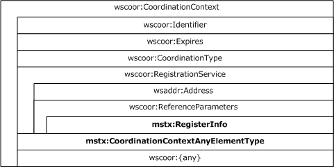

Figure 7: CoordinationContext Element constraints

The [RegisterInfo Element (section 2.2.3.1.6)](#Section_2.2.3.1.6) MUST be the only element in the WS-Addressing **ReferenceParameters** element [[WSADDR]](https://go.microsoft.com/fwlink/?LinkId=113065) in the WS-Coordination **RegistrationService** element in the CoordinationContext Element.

The [CoordinationContextAnyElementType Complex Type (section 2.2.3.1.8)](#Section_2.2.3.1.8) MUST be the first **Any** element in the CoordinationContext Element.

##### 2.2.3.2.2 Register Element

The Register Element is a **Register** element, as specified in [[WSC10]](https://go.microsoft.com/fwlink/?LinkId=113068) and [[WSC11]](https://go.microsoft.com/fwlink/?LinkId=113069), with the additional constraints listed in the following figure.

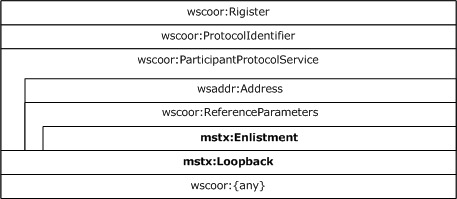

Figure 8: Register Element constraints

The [Enlistment Element (section 2.2.3.1.3)](#Section_2.2.3.1.3) MUST be the only element in the WS-Addressing **ReferenceParameters** element [[WSADDR]](https://go.microsoft.com/fwlink/?LinkId=113065) in the WS-Coordination **ParticipantProtocolService** element in the Register Element.

The [Loopback Element (section 2.2.3.1.4)](#Section_2.2.3.1.4) MUST be the first **Any** element in the WS-Coordination **ParticipantProtocolService** element in the Register Element.

##### 2.2.3.2.3 RegisterResponse Message

The RegisterResponse Message is a **RegisterResponse** element, as specified in [[WSC10]](https://go.microsoft.com/fwlink/?LinkId=113068) and [[WSC11]](https://go.microsoft.com/fwlink/?LinkId=113069), with the additional constraints listed in the following figure.

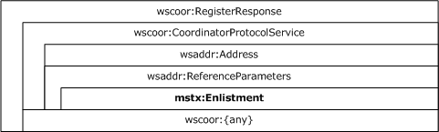

Figure 9: RegisterResponse Element constraints

The [Enlistment Element (section 2.2.3.1.3)](#Section_2.2.3.1.3) MUST be the only element in the WS-Addressing **ReferenceParameters** element [[WSADDR]](https://go.microsoft.com/fwlink/?LinkId=113065) in the WS-Coordination **CoordinatorProtocolService** element in the **RegisterResponse** element.

##### 2.2.3.2.4 FlowTransaction Message

The FlowTransaction Message is a SOAP Request/Reply message containing either a [CoordinationContext Element](#Section_2.2.3.2.1) or an [OleTxTransaction Element](#Section_2.2.3.1.9) as a SOAP header, but not both.

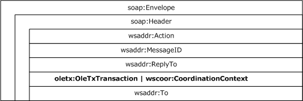

Figure 10: FlowTransaction Message

If present, the OleTxTransaction Element (section 2.2.3.1.9) MUST be a header in a SOAP message. The **mustUnderstand** attribute, as specified in [[SOAP1.2-1/2003]](https://go.microsoft.com/fwlink/?LinkId=90521) section 5.2.3, MUST be present, and its value MUST be set to TRUE.

If present, the CoordinationContext Element (section 2.2.3.2.1) MUST be a header in a SOAP message. The **mustUnderstand** attribute MUST be present, and its value MUST be set to TRUE.

# 3 Protocol Details

## 3.1 AppClient Role Details

### 3.1.1 Abstract Data Model

None.

### 3.1.2 Timers

None.

### 3.1.3 Initialization

None.

### 3.1.4 Higher-Layer Triggered Events

Two higher-layer triggered events are specified for the AppClient Role:

- [BUILD_COORDINATION_CONTEXT](#Section_3.1.4.1) event.
- [FORMAT_FLOW_TRANSACTION](#Section_3.1.4.2) event.

#### 3.1.4.1 BUILD_COORDINATION_CONTEXT

The BUILD_COORDINATION_CONTEXT event MUST be signaled by the higher-layer business logic with the following required arguments:

- A [**transaction identifier**](#gt_transaction-identifier) which contains a [**GUID**](#gt_globally-unique-identifier-guid)
- A [**transaction**](#gt_transaction) object that contains the following data fields, as specified in [MS-DTCO](../MS-DTCO/MS-DTCO.md) (section 2.2.8.1.1.2):
- The **isoLevel** field
- The **dwTimeout** field
- The **szDesc** field
- The **isoFlags** field
- The [**transaction coordinator's**](#gt_transaction-coordinator) Registration Service URI
- A [SupportedProtocolsFlags (section 2.2.2.2.2)](#Section_2.2.2.2.2) field
If the BUILD_COORDINATION_CONTEXT event is signaled, the AppClient Role MUST perform the following actions:

- If both the transaction object and the Registration Service URI arguments are provided:
- Create a [CoordinationContextAnyElementType Complex Type (section 2.2.3.1.8)](#Section_2.2.3.1.8) containing the following elements:
- If the **isoLevel** field value is not ISOLATIONLEVEL_UNSPECIFIED (0xFFFFFFFF), create an **IsolationLevel** element, as specified in section 2.2.3.1.8, setting the value to the corresponding [IsolationLevel (section 2.2.2.1.2)](#Section_2.2.2.1.2) value.
- If the **isoFlags** field value is not ISOFLAG_RETAIN_DEFAULT (0x00000000, as specified in [MS-DTCO] section 2.2.6.8), create an CoordinationContextAnyElementType Complex Type (section 2.2.3.1.8) element, setting the value to the **isoFlags** value.
- If the **szDesc** field is not an empty string, create a CoordinationContextAnyElementType Complex Type (section 2.2.3.1.8) element, setting the value to the **szDesc** value.
- If the transaction identifier is not the [**NULL GUID**](#gt_null-guid), create a [LocalTransactionId Element (section 2.2.3.1.5)](#Section_2.2.3.1.5), setting the value to a string representation of the transaction identifier.
- Create a WS-Addressing **Address** element, as specified in [[WSADDR]](https://go.microsoft.com/fwlink/?LinkId=113065), setting the value to the Registration Service URI argument.
- Create a LocalTransactionId Element (section 2.2.3.1.5) setting the value to a string representation of the transaction identifier.
- Create a [RegisterInfo Element (section 2.2.3.1.6)](#Section_2.2.3.1.6) containing the previously created LocalTransactionId Element.
- Create a WS-Addressing **ReferenceParameters** element, as specified in [WSADDR], containing the previously created RegisterInfo Element.
- Create a WS-Coordination **RegistrationService** element, as specified in [[WSC10]](https://go.microsoft.com/fwlink/?LinkId=113068) and [[WSC11]](https://go.microsoft.com/fwlink/?LinkId=113069), containing the following ordered elements:
- The previously created WS-Addressing **Address** element
- The previously created WS-Addressing **ReferenceParameters** element
- Create a WS-Coordination **Identifier** element, as specified in [WSC10] and [WSC11], setting the value to a string representation of the transaction identifier pre-pended with the string "urn:uuid:".
- Create a WS-Coordination **Expires** element, as specified in [WSC10] and [WSC11], setting the value to the value of the **dwTimeout** field.
- If the V1.1 flag in the SupportedProtocolsFlags field is set to 1, create a WS-Coordination **CoordinationType** element, as specified in [WSC11], setting the value as specified in [WSC11].
- Otherwise if the V1.0 flag in the SupportedProtocolsFlags field is set to 1, create a WS-Coordination **CoordinationType** element, as specified in [WSC10], setting the value as specified in [WSC10].
- Otherwise, return an implementation-specific failure result to the higher-layer business logic.
- Create a WS-Coordination **CoordinationContext** element, as specified in [WSC10] and [WSC11], containing the following ordered elements:
- The previously created WS-Coordination **Identifier** element
- The previously created WS-Coordination **Expires** element
- The previously created WS-Coordination **CoordinationType** element
- The previously created WS-Coordination **RegistrationService** element
- The CoordinationContextAnyElementType Complex Type created earlier
- Return the WS-Coordination **CoordinationContext** element to the higher-layer business logic.
- Otherwise, return an implementation-specific failure result to the higher-layer business logic.

#### 3.1.4.2 FORMAT_FLOW_TRANSACTION

The FORMAT_FLOW_TRANSACTION event MUST be signaled by the higher-layer business logic with the following required argument:

- A [FlowTransaction Message (section 2.2.3.2.4)](#Section_2.2.3.2.4).
And one or both of the following optional arguments:

- A Propagation_Token representing an existing [**transaction**](#gt_transaction), as specified in [MS-DTCO](../MS-DTCO/MS-DTCO.md) (section 2.2.5.4).
- A [CoordinationContext Element (section 2.2.3.2.1)](#Section_2.2.3.2.1) representing the same transaction.
If the FORMAT_FLOW_TRANSACTION event is signaled, the AppClient Role MUST perform the following actions:

- If only a Propagation_Token argument is provided:
- Encode the Propagation_Token using [**base64**](#gt_179b9392-9019-45a3-880b-26f6890522b7) and create a [PropagationToken Element (section 2.2.3.1.7)](#Section_2.2.3.1.7), setting the value to the base64 encoded Propagation_Token.
- Create an [OleTxTransaction Element (section 2.2.3.1.9)](#Section_2.2.3.1.9) and insert the PropagationToken Element as the only child element.<4>
- Insert the OleTxTransaction Element as a SOAP header in the FlowTransaction Message.
- Return the FlowTransaction Message to the higher-layer business logic.
- Otherwise, if only a CoordinationContext Element argument is included:
- Insert the CoordinationContext Element as a SOAP header in the FlowTransaction Message.
- Return the FlowTransaction Message to the higher-layer business logic.
- Otherwise, if both a Propagation_Token argument and a CoordinationContext Element argument are included:
- Encode the Propagation_Token using base64, and create a PropagationToken Element (section 2.2.3.1.7), setting the value to the base64 encoded Propagation_Token.
- Insert (or replace if already present) the PropagationToken Element in the [CoordinationContextAnyElementType Complex Type](#Section_2.2.3.1.8) of the CoordinationContext Element (section 2.2.3.2.1).
- Insert the CoordinationContext Element as a SOAP header in the FlowTransaction Message.
- Return the FlowTransaction Message to the higher-layer business logic.
- Otherwise, return an implementation-specific failure result to the higher-layer business logic.

### 3.1.5 Message Processing Events and Sequencing Rules

None.

### 3.1.6 Timer Events

None.

### 3.1.7 Other Local Events

None.

## 3.2 AppServer Role Details

### 3.2.1 Abstract Data Model

None.

### 3.2.2 Timers

None.

### 3.2.3 Initialization

None.

### 3.2.4 Higher-Layer Triggered Events

One higher-layer triggered event, the [PARSE_FLOW_TRANSACTION](#Section_3.2.4.1) event, is specified for the AppServer Role.

#### 3.2.4.1 PARSE_FLOW_TRANSACTION

The PARSE_FLOW_TRANSACTION event MUST be signaled by the higher-layer business logic with the following required argument:

- A [FlowTransaction Message (section 2.2.3.2.4)](#Section_2.2.3.2.4).
If the PARSE_FLOW_TRANSACTION event is signaled, the AppServer Role MUST perform the following actions:

- If the SOAP message contains a [OleTxTransaction Element](#Section_2.2.3.1.9) SOAP header:
- Extract and decode the [**base64**](#gt_179b9392-9019-45a3-880b-26f6890522b7) encoded Propagation_Token from the value of the [PropagationToken Element](#Section_2.2.3.1.7) in the OleTxTransaction Element.
- Return the decoded Propagation_Token to the higher-layer business logic.
- Otherwise if the SOAP message contains a [CoordinationContext Element](#Section_2.2.3.2.1) SOAP header:
- Extract the CoordinationContext Element from the SOAP header of the FlowTransaction Message.
- If the CoordinationContext Element contains a PropagationToken Element in its [CoordinationContextAnyElementType Complex Type (section 2.2.3.1.8)](#Section_2.2.3.1.8):
- Extract and decode the Base64 encoded Propagation_Token from the value of the PropagationToken Element.
- Return the decoded Propagation_Token and the CoordinationContext Element to the higher-layer business logic.
- Otherwise, return the CoordinationContext Element to the higher-layer business logic.
- Otherwise, return an implementation-specific failure result to the higher-layer business logic.

### 3.2.5 Message Processing Events and Sequencing Rules

None.

### 3.2.6 Timer Events

None.

### 3.2.7 Other Local Events

None.

# 4 Protocol Examples

## 4.1 Locating the Activation Service Endpoints

This example shows how an application, either a [**client application**](#gt_client-application) (as described in sections [1.3.2](#Section_1.3.2) and [1.3.3](#Section_1.3.3)) or a [**server application**](#gt_server-application) (as described in section [1.3.1](#Section_1.3.1)), obtains the WS-AtomicTransaction Activation Service Endpoint of a [**transaction coordinator**](#gt_transaction-coordinator) by performing the following two tasks:

- The application first obtains an array of **SExtendedEndpointInfo** structures via an Application Role Implementation, as specified in [MS-DTCO](../MS-DTCO/MS-DTCO.md) (section 3.3.5.2.2.1).
- The application then translates the array of **SExtendedEndpointInfo** structures into the transaction coordinator's Activation Service Endpoints, as specified in [2.2.2.3](#Section_2.2.2.3).

### 4.1.1 Obtaining an Array of SExtendedEndpointInfo Structures

An Application Role Implementation, as specified in [MS-DTCO](../MS-DTCO/MS-DTCO.md) (section 3.3), communicates with a [**transaction coordinator**](#gt_transaction-coordinator) using an [**OleTx**](#gt_oletx) multiplexing connection, as specified in [MS-CMP](../MS-CMP/MS-CMP.md), which is in turn layered on top of the OleTx transports infrastructure, as specified in [MS-CMPO](#Section_2.1). In this example, it is assumed that an [MS-CMPO] session has been established between the Application Role Implementation and its transaction coordinator. Messages are sent from the Application Role Implementation to the transaction coordinator and vice versa by submitting a MESSAGE_PACKET ([MS-DTCO] (section 2.2.4.1)) to the underlying OleTx multiplexing layer, as specified in [MS-CMP].

This packet sequence is initiated by starting a connection on a transport session between an Application Role Implementation and a transaction coordinator.

**CONNTYPE_TXUSER_EXTENDEDWHEREABOUTS:** The packet sequence starts when the Application Role Implementation initiates a connection with its transaction coordinator using CONNTYPE_TXUSER_EXTENDEDWHEREABOUTS.

| Bit Range | Field | Description |
| --- | --- | --- |
| Variable | **MsgTag** | 0x00000005 MTAG_CONNECTION_REQ |
| Variable | **fIsMaster** | 0x00000001 1 |
| Variable | **dwConnectionId** | 0x00000001 1 |
| Variable | **dwUserMsgType** | 0x0000003D CONNTYPE_TXUSER_EXTENDEDWHEREABOUTS |
| Variable | **dwcbVarLenData** | 0x00000000 0 |
| dwReserved1: 0xcd64cd64 | **dwReserved1** | 0xCD64CD64 |

The Application Role Implementation then sends a TXUSER_EXTENDEDWHEREABOUTS_MTAG_GET user message to the transaction coordinator.

| Bit Range | Field | Description |
| --- | --- | --- |
| Variable | **MsgTag** | 0x00000FFF MTAG_USER_MESSAGE |
| Variable | **fIsMaster** | 0x00000001 1 |
| Variable | **dwConnectionId** | 0x00000001 1 |
| Variable | **dwUserMsgType** | 0x00005A01 TXUSER_EXTENDEDWHEREABOUTS_MTAG_GET |
| Variable | **dwcbVarLenData** | 0x00000000 0 |
| dwReserved1: 0xcd64cd64 | **dwReserved1** | 0xCD64CD64 |

When the transaction coordinator receives the TXUSER_EXTENDEDWHEREABOUTS_MTAG_GET message from the Application Role Implementation, the transaction coordinator will send a TXUSER_EXTENDEDWHEREABOUTS_MTAG_GOT user message to the Application Role Implementation containing an array of **SExtendedEndpointInfo** structures, as described in [MS-DTCO] sections 2.2.5.8 and 2.2.5.9.

| Bit Range | Field | Description |
| --- | --- | --- |
| Variable | **MsgTag** | 0x00000FFF MTAG_USER_MESSAGE |
| Variable | **fIsMaster** | 0x00000000 0 |
| Variable | **dwConnectionId** | 0x00000001 1 |
| Variable | **dwUserMsgType** | 0x00005A02 TXUSER_EXTENDEDWHEREABOUTS_MTAG_GOT |
| Variable | **dwcbVarLenData** | 0x00000058 88 |
| dwReserved1: 0xcd64cd64 | **dwReserved1** | 0xCD64CD64 |
| Variable | **dwProtocolCount** | 0x00000001 1 |
| Variable | **tmprotDescribed** | 0x00000004 TmProtocolExtended |
| Variable | **cbTmProtocolData** | 0x0000004C 76 |
| {cc228cf4-a9c8-43fc-8281-8565eb5889f2} | **guidProtocolExtension** | 0xCC228CF4 0x43FCA9C8 0x65858182 0xF28958EB |
| Variable | **rgbProtocolExtensionData** | 0xA00E0201 0x1000000F 0x1500000E 0x63616D00 0x656E6968 0x742E315F 0x75706D65 0x6F2E6972 0x000B6772 0x74617357 0x76726553 0x09656369 0x43414D00 0x454E4948 0x0003315F - |

When the Application Role Implementation gets the TXUSER_EXTENDEDWHEREABOUTS_MTAG_GOT response from the transaction coordinator, no more user messages can be sent on this connection and the Application Role Implementation initiates the disconnect sequence.

### 4.1.2 Obtaining the WS-AtomicTransaction Activation Service Endpoints of the Transaction Coordinator

After obtaining an array of **SExtendedEndpointInfo** structures, the application then iterates through the array of structures. If the guidProtocolExtension is equal to the [WSAT_ProtocolGuid](#Section_2.2.2.2.4) (cc228cf4-a9c8-43fc-8281-8565eb5889f2), then the associated **rgbProtocolExtensionData** is an [ExtendedWhereabouts](#Section_2.2.2.2.5) structure. The application decodes the ExtendedWhereabouts structure as follows.

| Bit Range | Field | Description |
| --- | --- | --- |
| Variable | **MajorVersion** | 0x01 1 |
| Variable | **MinorVersion** | 0x02 Minor Version 2 |
| Variable | **ProtocolFlags** | 0x0E 14 |
| Variable | **HttpsPort** | 0x00000FA0 4000 |
| Variable | **MaxTimeout** | 0x00000E10 3600 |
| Variable | **HostName.cbCharArray** | 0x0015 21 |
| Variable | **HostName.szCharArray** | 0x6863616D 0x5F656E69 0x65742E31 0x7275706D 0x726F2E69 0x67 machine_1.tempuri.org |
| Variable | **BasePath.cbCharArray** | 0x000B 11 |
| Variable | **BasePath.szCharArray** | 0x74617357 0x76726553 0x656369 WsatService |
| Variable | **NodeName.cbCharArray** | 0x0009 9 |
| Variable | **NodeName.szCharArray** | 0x4843414D 0x5F454E49 0x31 MACHINE_1 |
| Variable | **SupportedProtocols** | 0x0003 V1.0 \ V1.1 |

The application then translates the ExtendedWhereabouts structure into a list of Activation Service Endpoints, as specified in section [2.2.2.3](#Section_2.2.2.3):

HTTPS Activation Service Version 1.0 X.509 URI: https://machine_1.tempuri.org:4000/WsatService/Activation/Coordinator/

HTTPS Activation Service Version 1.1 X.509 URI: https://machine_1.tempuri.org:4000/WsatService/Activation/Coordinator11/

HTTPS Activation Service Version 1.0 SPNEGO URI: https://machine_1.tempuri.org:4000/WsatService/Activation/Coordinator/Remote/

HTTPS Activation Service Version 1.1 SPNEGO URI: https://machine_1.tempuri.org:4000/WsatService/Activation/Coordinator11/Remote/

## 4.2 Propagating and Committing a Transaction Example

In this example, a [**client application**](#gt_client-application) propagates and commits a [**transaction**](#gt_transaction) with a [**server application**](#gt_server-application) using the WS-AtomicTransaction protocol, as described in section [1.3.3.2](#Section_1.3.3.2).

In this example, it is assumed that a client application has obtained the HTTPS Activation Service Version 1.1 X.509 URI for its [**transaction coordinator**](#gt_transaction-coordinator), as shown in section [4.1](#Section_4.1). It is also assumed that a server application has similarly obtained the HTTPS Activation Service Version 1.1 X.509 URI for its transaction coordinator.

### 4.2.1 Creating a CoordinationContext

The [**client application**](#gt_client-application) obtains a [CoordinationContext Element](#Section_2.2.3.2.1) for a [**transaction**](#gt_transaction) from its [**transaction coordinator**](#gt_transaction-coordinator) by sending the following CreateCoordinationContext SOAP message to the transaction coordinator's Activation Service URI. Because the message contains no CurrentCoordinationContext, the transaction coordinator will be the root transaction coordinator of a new transaction.

<s:Envelope xmlns:s="http://schemas.xmlsoap.org/soap/envelope/" xmlns:a="http://www.w3.org/2005/08/addressing">

<s:Header>

<a:Action s:mustUnderstand="1">http://docs.oasis-open.org/ws-tx/wscoor/2006/06/CreateCoordinationContext</a:Action>

<a:MessageID>urn:uuid:1a7acc0e-7e98-45bf-80ce-8053edc1368f</a:MessageID>

<a:ReplyTo>

<a:Address>https://machine_1.tempuri.org:4000/ClientApp/</a:Address>

</a:ReplyTo>

<a:To s:mustUnderstand="1">https://machine_1.tempuri.org:5555/WsatService/Activation/Coordinator11/</a:To>

</s:Header>

<s:Body>

<wscoor:CreateCoordinationContext xmlns:wscoor="http://docs.oasis-open.org/ws-tx/wscoor/2006/06">

<wscoor:CoordinationType>http://docs.oasis-open.org/ws-tx/wsat/2006/06</wscoor:CoordinationType>

</wscoor:CreateCoordinationContext>

</s:Body>

</s:Envelope>

When the client application's transaction coordinator receives the CreateCoordinationContext SOAP message, it creates a CoordinationContext Element for a new transaction. The new transaction contains its **RegistrationService** URI, a [RegisterInfo Element](#Section_2.2.3.1.6) reference parameter, and a [CoordinationContextAnyElementType](#Section_2.2.3.1.8). The transaction coordinator then returns the CoordinationContext Element in the body of a CreateCoordinationContextResponse SOAP message and sends the message to the client application's **ReplyTo** URI.

<s:Envelope xmlns:s="http://schemas.xmlsoap.org/soap/envelope/" xmlns:a="http://www.w3.org/2005/08/addressing">

<s:Header>

<a:Action s:mustUnderstand="1">http://docs.oasis-open.org/ws-tx/wscoor/2006/06/CreateCoordinationContextResponse</a:Action>

<a:RelatesTo>urn:uuid:1a7acc0e-7e98-45bf-80ce-8053edc1368f</a:RelatesTo>

<a:To s:mustUnderstand="1">https://machine_1.tempuri.org:4000/ClientApp/</a:To>

</s:Header>

<s:Body>

<wscoor:CreateCoordinationContextResponse xmlns:wscoor="http://docs.oasis-open.org/ws-tx/wscoor/2006/06">

<wscoor:CoordinationContext xmlns:mstx="http://schemas.microsoft.com/ws/2006/02/transactions">

<wscoor:Identifier>urn:uuid:4413663a-b7f1-4001-8956-7af04265103b</wscoor:Identifier>

<wscoor:Expires>60000</wscoor:Expires>

<wscoor:CoordinationType>http://docs.oasis-open.org/ws-tx/wsat/2006/06</wscoor:CoordinationType>

<wscoor:RegistrationService>

<a:Address>https://machine_1.tempuri.org:5555/WsatService/Registration/Coordinator11/</a:Address>

<a:ReferenceParameters>

<mstx:RegisterInfo>

<mstx:LocalTransactionId>4413663a-b7f1-4001-8956-7af04265103b</mstx:LocalTransactionId>

</mstx:RegisterInfo>

</a:ReferenceParameters>

</wscoor:RegistrationService>

<mstx:IsolationLevel>0</mstx:IsolationLevel>

<mstx:LocalTransactionId>4413663a-b7f1-4001-8956-7af04265103b</mstx:LocalTransactionId>

</wscoor:CoordinationContext>

</wscoor:CreateCoordinationContextResponse>

</s:Body>

</s:Envelope>

### 4.2.2 Registering for Completion

After the [**client application**](#gt_client-application) obtains a [CoordinationContext Element](#Section_2.2.3.2.1) for a [**transaction**](#gt_transaction), it then registers for Completion Protocol by sending a Register SOAP message to the [**transaction coordinator's**](#gt_transaction-coordinator) Registration Service URI contained in the CoordinationContext Element returned by its transaction coordinator. The client application specifies the Protocol Identifier and its Participant Protocol Service URI in the [Register Element](#Section_2.2.3.2.2) contained in the body of the SOAP message.

<s:Envelope xmlns:s="http://schemas.xmlsoap.org/soap/envelope/" xmlns:a="http://www.w3.org/2005/08/addressing">

<s:Header>

<a:Action s:mustUnderstand="1">http://docs.oasis-open.org/ws-tx/wscoor/2006/06/Register</a:Action>

<a:MessageID>urn:uuid:2defe157-59a5-4d38-9495-3b1a3696f2d9</a:MessageID>

<a:ReplyTo>

<a:Address>https://machine_1.tempuri.org:4000/ClientApp/</a:Address>

</a:ReplyTo>

<a:To s:mustUnderstand="1">https://machine_1.tempuri.org:5555/WsatService/Registration/Coordinator11/</a:To>

<mstx:RegisterInfo xmlns:mstx="http://schemas.microsoft.com/ws/2006/02/transactions">

<mstx:LocalTransactionId>4413663a-b7f1-4001-8956-7af04265103b</mstx:LocalTransactionId>

</mstx:RegisterInfo>

</s:Header>

<s:Body>

<wscoor:Register xmlns:wscoor="http://docs.oasis-open.org/ws-tx/wscoor/2006/06">

<wscoor:ProtocolIdentifier>http://docs.oasis-open.org/ws-tx/wsat/2006/06/Completion</wscoor:ProtocolIdentifier>

<wscoor:ParticipantProtocolService>

<a:Address>https://machine_1.tempuri.org:4000/ClientApp/</a:Address>

</wscoor:ParticipantProtocolService>

</wscoor:Register>

</s:Body>

</s:Envelope>

When the client application's transaction coordinator receives the Register SOAP message, the transaction coordinator creates a [RegisterResponse Message](#Section_2.2.3.2.3) SOAP message, specifying its Completion Protocol Coordinator Protocol Service URI with an [Enlistment Element](#Section_2.2.3.1.3) as a reference parameter and sends the message to the client application.

<s:Envelope xmlns:s="http://schemas.xmlsoap.org/soap/envelope/" xmlns:a="http://www.w3.org/2005/08/addressing">

<s:Header>

<a:Action s:mustUnderstand="1">http://docs.oasis-open.org/ws-tx/wscoor/2006/06/RegisterResponse</a:Action>

<a:RelatesTo>urn:uuid:2defe157-59a5-4d38-9495-3b1a3696f2d9</a:RelatesTo>

<a:To s:mustUnderstand="1">https://machine_1.tempuri.org:4000/ClientApp/</a:To>

</s:Header>

<s:Body>

<wscoor:RegisterResponse xmlns:wscoor="http://docs.oasis-open.org/ws-tx/wscoor/2006/06">

<wscoor:CoordinatorProtocolService>

<a:Address>https://machine_1.tempuri.org:5555/WsatService/Completion/Coordinator11/</a:Address>

<a:ReferenceParameters>

<mstx:Enlistment xmlns:mstx="http://schemas.microsoft.com/ws/2006/02/transactions">4413663a-b7f1-4001-8956-7af04265103b</mstx:Enlistment>

</a:ReferenceParameters>

</wscoor:CoordinatorProtocolService>

</wscoor:RegisterResponse>

</s:Body>

</s:Envelope>

### 4.2.3 Propagating the Transaction

After registering for completion ([4.2.2](#Section_4.2.2)), the [**client application**](#gt_client-application) sends a [FlowTransaction Message](#Section_2.2.3.2.4) to the [**server application**](#gt_server-application) containing the [CoordinationContext Element](#Section_2.2.3.2.1) (returned as shown in section [4.2.1](#Section_4.2.1)) as a SOAP header in the message.

<s:Envelope xmlns:s="http://www.w3.org/2003/05/soap-envelope" xmlns:a="http://www.w3.org/2005/08/addressing">

<s:Header>

<a:Action s:mustUnderstand="1">http://tempuri.org/FlowTransaction</a:Action>

<a:MessageID>urn:uuid:5973043c-0ed7-4c2a-aad9-700e446a8dbf</a:MessageID>

<a:ReplyTo>

<a:Address>http://www.w3.org/2005/08/addressing/none</a:Address>

</a:ReplyTo>

<wscoor:CoordinationContext s:mustUnderstand="1" xmlns:wscoor="http://docs.oasis-open.org/ws-tx/wscoor/2006/06" xmlns:mstx="http://schemas.microsoft.com/ws/2006/02/transactions">

<wscoor:Identifier>urn:uuid:4413663a-b7f1-4001-8956-7af04265103b</wscoor:Identifier>

<wscoor:Expires>59904</wscoor:Expires>

<wscoor:CoordinationType>http://docs.oasis-open.org/ws-tx/wsat/2006/06</wscoor:CoordinationType>

<wscoor:RegistrationService>

<a:Address>https://machine_1.tempuri.org:5555/WsatService/Registration/Coordinator11/</a:Address>

<a:ReferenceParameters>

<mstx:RegisterInfo>

<mstx:LocalTransactionId>4413663a-b7f1-4001-8956-7af04265103b</mstx:LocalTransactionId>

</mstx:RegisterInfo>

</a:ReferenceParameters>

</wscoor:RegistrationService>

<mstx:IsolationLevel>0</mstx:IsolationLevel>

<mstx:LocalTransactionId>4413663a-b7f1-4001-8956-7af04265103b</mstx:LocalTransactionId>

</wscoor:CoordinationContext>

<a:To s:mustUnderstand="1">https://machine_2.tempuri.org:8000/AppServer/</a:To>

</s:Header>

<s:Body>

<FlowTransaction xmlns="http://tempuri.org/"></FlowTransaction>

</s:Body>

</s:Envelope>

When the server application receives the FlowTransaction Message, it creates a CreateCoordinationContext SOAP message and inserts the CoordinationContext Element from the client application's FlowTransaction Message. The server application then sends the CreateCoordinationContext message to its [**transaction coordinator's**](#gt_transaction-coordinator) Activation Service URI.

<s:Envelope xmlns:s="http://www.w3.org/2003/05/soap-envelope" xmlns:a="http://www.w3.org/2005/08/addressing">

<s:Header>

<a:Action s:mustUnderstand="1">http://docs.oasis-open.org/ws-tx/wscoor/2006/06/CreateCoordinationContext</a:Action>

<a:To s:mustUnderstand="1">https://machine_2.tempuri.org:5432/WsatService/Activation/Coordinator11/</a:To>

<a:MessageID>urn:uuid:2e946e0a-e0cd-48c9-a065-79b43a70c4fb</a:MessageID>

<a:ReplyTo>

<a:Address>https://machine_2.tempuri.org:8000/AppServer/</a:Address>

</a:ReplyTo>

</s:Header>

<s:Body>

<wscoor:CreateCoordinationContext xmlns:wscoor="http://docs.oasis-open.org/ws-tx/wscoor/2006/06">

<wscoor:CurrentContext xmlns:mstx="http://schemas.microsoft.com/ws/2006/02/transactions">

<wscoor:Identifier>urn:uuid:4413663a-b7f1-4001-8956-7af04265103b</wscoor:Identifier>

<wscoor:Expires>59904</wscoor:Expires>

<wscoor:CoordinationType>http://docs.oasis-open.org/ws-tx/wsat/2006/06</wscoor:CoordinationType>

<wscoor:RegistrationService>

<a:Address>https://machine_1.tempuri.org:5555/WsatService/Registration/Coordinator11/</a:Address>

<a:ReferenceParameters>

<mstx:RegisterInfo>

<mstx:LocalTransactionId>4413663a-b7f1-4001-8956-7af04265103b</mstx:LocalTransactionId>

</mstx:RegisterInfo>

</a:ReferenceParameters>

</wscoor:RegistrationService>

<mstx:IsolationLevel>0</mstx:IsolationLevel>

<mstx:LocalTransactionId>4413663a-b7f1-4001-8956-7af04265103b</mstx:LocalTransactionId>

</wscoor:CurrentContext>

<wscoor:CoordinationType>http://docs.oasis-open.org/ws-tx/wsat/2006/06</wscoor:CoordinationType>

</wscoor:CreateCoordinationContext>

</s:Body>

</s:Envelope>

When the server application's transaction coordinator receives the CreateCoordinationContext SOAP message from the server application, the transaction coordinator creates a Register SOAP message specifying the **ProtocolIdentifier** (Durable2PC), its Participant Protocol Service URI with an [Enlistment Element](#Section_2.2.3.1.3) reference parameter, and a [Loopback Element](#Section_2.2.3.1.4) in the [Register Element](#Section_2.2.3.2.2) contained in the body of the SOAP message. The Activation Service's transaction coordinator then sends the Register SOAP message to the **RegistrationService** URI contained in the CoordinationContext Element.

<s:Envelope xmlns:s="http://schemas.xmlsoap.org/soap/envelope/" xmlns:a="http://www.w3.org/2005/08/addressing">

<s:Header>

<a:Action s:mustUnderstand="1">http://docs.oasis-open.org/ws-tx/wscoor/2006/06/Register</a:Action>

<a:To s:mustUnderstand="1">https://machine_1.tempuri.org:5555/WsatService/Registration/Coordinator11/</a:To>

<mstx:RegisterInfo a:IsReferenceParameter="true" xmlns:mstx="http://schemas.microsoft.com/ws/2006/02/transactions">

<mstx:LocalTransactionId>4413663a-b7f1-4001-8956-7af04265103b</mstx:LocalTransactionId>

</mstx:RegisterInfo>

<a:MessageID>urn:uuid:27d5656b-6ea7-4094-8294-116e264ffae2</a:MessageID>

<a:ReplyTo>

<a:Address>https://machine_2.tempuri.org:5432/WsatService/67b7e957-913c-4604-8d68-d5319cbeaa6c</a:Address>

</a:ReplyTo>

</s:Header>

<s:Body>

<wscoor:Register xmlns:wscoor="http://docs.oasis-open.org/ws-tx/wscoor/2006/06">

<wscoor:ProtocolIdentifier>http://docs.oasis-open.org/ws-tx/wsat/2006/06/Durable2PC</wscoor:ProtocolIdentifier>

<wscoor:ParticipantProtocolService>

<a:Address>https://machine_2.tempuri.org:5432/WsatService/TwoPhaseCommit/Participant11/</a:Address>

<a:ReferenceParameters>

<mstx:Enlistment xmlns:mstx="http://schemas.microsoft.com/ws/2006/02/transactions">1aea41b1-ebc8-42ac-9232-bf56b47479ca</mstx:Enlistment>

</a:ReferenceParameters>

</wscoor:ParticipantProtocolService>

<mstx:Loopback xmlns:mstx="http://schemas.microsoft.com/ws/2006/02/transactions">f30ea6e8-8cf7-4ac7-9281-ca8b5c5341a5</mstx:Loopback>

</wscoor:Register>

</s:Body>

</s:Envelope>

When the root transaction coordinator receives the Register SOAP message from the Activation Service's transaction coordinator, the root transaction coordinator creates a [RegisterResponse Message](#Section_2.2.3.2.3) SOAP message, specifying its Completion Protocol Coordinator Protocol Service URI with an Enlistment Element as a reference parameter and sends the message to the Activation Service's transaction coordinator **ReplyTo** URI.

<s:Envelope xmlns:s="http://schemas.xmlsoap.org/soap/envelope/" xmlns:a="http://www.w3.org/2005/08/addressing">

<s:Header>

<a:Action s:mustUnderstand="1">http://docs.oasis-open.org/ws-tx/wscoor/2006/06/RegisterResponse</a:Action>

<a:RelatesTo>urn:uuid:27d5656b-6ea7-4094-8294-116e264ffae2</a:RelatesTo>

<a:To s:mustUnderstand="1">https://machine_2.tempuri.org:5432/WsatService/67b7e957-913c-4604-8d68-d5319cbeaa6c</a:To>

</s:Header>

<s:Body>

<wscoor:RegisterResponse xmlns:wscoor="http://docs.oasis-open.org/ws-tx/wscoor/2006/06">

<wscoor:CoordinatorProtocolService>

<a:Address>https://machine_1.tempuri.org:5555/WsatService/TwoPhaseCommit/Coordinator11/</a:Address>

<a:ReferenceParameters>

<mstx:Enlistment mstx:protocol="3" xmlns:mstx="http://schemas.microsoft.com/ws/2006/02/transactions">fcec4cc9-94dd-4376-9ba1-12efafd7d1e5</mstx:Enlistment>

</a:ReferenceParameters>

</wscoor:CoordinatorProtocolService>

</wscoor:RegisterResponse>

</s:Body>

</s:Envelope>

When the Activation Service's transaction coordinator receives the RegisterResponse Message SOAP message from the root transaction coordinator, the Activation Service's transaction coordinator creates a new CoordinationContext Element for the CoordinationContext Element sent to it by the Activation Service. The new CoordinationContext Element specifies its **RegistrationService** URI with a [RegisterInfo Element](#Section_2.2.3.1.6) reference parameter and a [CoordinationContextAnyElementType Complex Type](#Section_2.2.3.1.8). The Activation Service's transaction coordinator then inserts the CoordinationContext Element in the body of a CreateCoordinationContextResponse SOAP message and sends the message to the server application's **ReplyTo** URI.

<s:Envelope xmlns:s="http://www.w3.org/2003/05/soap-envelope" xmlns:a="http://www.w3.org/2005/08/addressing">

<s:Header>

<a:Action s:mustUnderstand="1">http://docs.oasis-open.org/ws-tx/wscoor/2006/06/CreateCoordinationContextResponse</a:Action>

<a:RelatesTo>urn:uuid:2e946e0a-e0cd-48c9-a065-79b43a70c4fb</a:RelatesTo>

<a:To s:mustUnderstand="1">https://machine_2.tempuri.org:8000/AppServer/</a:To>

</s:Header>

<s:Body>

<wscoor:CreateCoordinationContextResponse xmlns:wscoor="http://docs.oasis-open.org/ws-tx/wscoor/2006/06">

<wscoor:CoordinationContext xmlns:mstx="http://schemas.microsoft.com/ws/2006/02/transactions">

<wscoor:Identifier>urn:uuid:4413663a-b7f1-4001-8956-7af04265103b</wscoor:Identifier>

<wscoor:Expires>59904</wscoor:Expires>

<wscoor:CoordinationType>http://docs.oasis-open.org/ws-tx/wsat/2006/06</wscoor:CoordinationType>

<wscoor:RegistrationService>

<a:Address>https://machine_2.tempuri.org:5432/WsatService/Registration/Coordinator11/</a:Address>

<a:ReferenceParameters>

<mstx:RegisterInfo>

<mstx:LocalTransactionId>4413663a-b7f1-4001-8956-7af04265103b</mstx:LocalTransactionId>

</mstx:RegisterInfo>

</a:ReferenceParameters>

</wscoor:RegistrationService>

<mstx:IsolationLevel>0</mstx:IsolationLevel>

<mstx:LocalTransactionId>4413663a-b7f1-4001-8956-7af04265103b</mstx:LocalTransactionId>

</wscoor:CoordinationContext>

</wscoor:CreateCoordinationContextResponse>

</s:Body>

</s:Envelope>

When the server application receives the CreateCoordinationContextResponse SOAP message from its transaction coordinator, the server application is enabled to register for Volatile2PC or Durable2PC Protocol or to flow the [**transaction**](#gt_transaction) to another Activation Service.

### 4.2.4 Completing the Transaction

In this example, the [**client application**](#gt_client-application) commits the [**transaction**](#gt_transaction). The client application creates a Completion Protocol Commit SOAP message and sends the message to its [**transaction coordinator's**](#gt_transaction-coordinator) Completion Protocol Service URI.

<s:Envelope xmlns:s="http://schemas.xmlsoap.org/soap/envelope/" xmlns:a="http://www.w3.org/2005/08/addressing">

<s:Header>

<a:Action s:mustUnderstand="1">http://docs.oasis-open.org/ws-tx/wsat/2006/06/Commit</a:Action>

<a:ReplyTo>

<a:Address>https://machine_1.tempuri.org:4000/ClientApp/</a:Address>

</a:ReplyTo>

<a:To s:mustUnderstand="1">https://machine_1.tempuri.org:5555/WsatService/Completion/Coordinator11/</a:To>

<mstx:Enlistment xmlns:mstx="http://schemas.microsoft.com/ws/2006/02/transactions">4413663a-b7f1-4001-8956-7af04265103b</mstx:Enlistment>

</s:Header>

<s:Body>

<wsat:Commit xmlns:wsat="http://docs.oasis-open.org/ws-tx/wsat/2006/06"></wsat:Commit>

</s:Body>

</s:Envelope>

When the root transaction coordinator receives the Commit SOAP message, the transaction coordinator begins [**Two-Phase Commit**](#gt_two-phase-commit) Protocol processing. In this example, there are no [**Participants**](#gt_participant) registered for the Volatile Two-Phase Commit Protocol, therefore the transaction coordinator begins Durable Two-Phase Commit Protocol processing.

In this example, the root transaction coordinator has one registered participant for the Durable Two-Phase Commit Protocol: the [**server application's**](#gt_server-application) transaction coordinator. The root transaction coordinator creates a Durable Two-Phase Commit Protocol Prepare SOAP message and sends the message to the subordinate transaction coordinator's Two-Phase Commit Participant Protocol Service URI.

<s:Envelope xmlns:s="http://schemas.xmlsoap.org/soap/envelope/" xmlns:a="http://www.w3.org/2005/08/addressing">

<s:Header>

<a:Action s:mustUnderstand="1">http://docs.oasis-open.org/ws-tx/wsat/2006/06/Prepare</a:Action>

<a:From>

<a:Address>https://machine_1.tempuri.org:5555/WsatService/TwoPhaseCommit/Coordinator11/</a:Address>

<a:ReferenceParameters>

<mst<a:ReferenceParameters>:Enlistment mstx:protocol="3" xmlns:mstx="http://schemas.microsoft.com/ws/2006/02/transactions">fcec4cc9-94dd-4376-9ba1-12efafd7d1e5</mstx:Enlistment>

</a:ReferenceParameters>

</a:From>

<a:ReplyTo>

<a:Address>http://www.w3.org/2005/08/addressing/none</a:Address>

</a:ReplyTo>

<a:To s:mustUnderstand="1">https://machine_2.tempuri.org:5432/WsatService/TwoPhaseCommit/Participant11/</a:To>

<mstx:Enlistment a:IsReferenceParameter="true" xmlns:mstx="http://schemas.microsoft.com/ws/2006/02/transactions">1aea41b1-ebc8-42ac-9232-bf56b47479ca</mstx:Enlistment>

</s:Header>

<s:Body>

<wsat:Prepare xmlns:wsat="http://docs.oasis-open.org/ws-tx/wsat/2006/06"></wsat:Prepare>

</s:Body>

</s:Envelope>

When the server application's transaction coordinator receives the Prepare SOAP message from the root transaction coordinator, the server application creates a Durable Two-Phase Commit Protocol Prepared SOAP message and sends the message to the root transaction coordinator's Two-Phase Commit Coordinator Protocol Service URI.

<s:Envelope xmlns:s="http://schemas.xmlsoap.org/soap/envelope/" xmlns:a="http://www.w3.org/2005/08/addressing">

<s:Header>

<a:Action s:mustUnderstand="1">http://docs.oasis-open.org/ws-tx/wsat/2006/06/Prepared</a:Action>

<a:From>

<a:Address>https://machine_2.tempuri.org:5432/WsatService/TwoPhaseCommit/Participant11/</a:Address>

<a:ReferenceParameters>

<mstx:Enlistment xmlns:mstx="http://schemas.microsoft.com/ws/2006/02/transactions">1aea41b1-ebc8-42ac-9232-bf56b47479ca</mstx:Enlistment>

</a:ReferenceParameters>

</a:From>

<a:ReplyTo>

<a:Address>http://www.w3.org/2005/08/addressing/none</a:Address>

</a:ReplyTo>

<a:To s:mustUnderstand="1">https://machine_1.tempuri.org:5555/WsatService/TwoPhaseCommit/Coordinator11/</a:To>

<mstx:Enlistment mstx:protocol="3" a:IsReferenceParameter="true" xmlns:mstx="http://schemas.microsoft.com/ws/2006/02/transactions">fcec4cc9-94dd-4376-9ba1-12efafd7d1e5</mstx:Enlistment>

</s:Header>

<s:Body>

<wsat:Prepared xmlns:wsat="http://docs.oasis-open.org/ws-tx/wsat/2006/06"></wsat:Prepared>

</s:Body>

</s:Envelope>

When the root transaction coordinator receives the Prepared SOAP message from the server application's transaction coordinator, the root transaction coordinator decides to commit the transaction.

The root transaction coordinator then creates a Completion Protocol Committed SOAP message and sends the message to the client application's [Participant](#Section_1.3.2.2) Completion Protocol Service URI.

<s:Envelope xmlns:s="http://schemas.xmlsoap.org/soap/envelope/" xmlns:a="http://www.w3.org/2005/08/addressing">

<s:Header>

<a:Action s:mustUnderstand="1">http://docs.oasis-open.org/ws-tx/wsat/2006/06/Committed</a:Action>

<a:To s:mustUnderstand="1">https://machine_1.tempuri.org:4000/ClientApp/</a:To>

</s:Header>

<s:Body>

<wsat:Committed xmlns:wsat="http://docs.oasis-open.org/ws-tx/wsat/2006/06"></wsat:Committed>

</s:Body>

</s:Envelope>

The root transaction coordinator then creates a Durable Two-Phase Commit Protocol Commit SOAP message and sends the message to the subordinate transaction coordinator's Two-Phase Commit Participant Protocol Service URI.

<s:Envelope xmlns:s="http://schemas.xmlsoap.org/soap/envelope/" xmlns:a="http://www.w3.org/2005/08/addressing">

<s:Header>

<a:Action s:mustUnderstand="1">http://docs.oasis-open.org/ws-tx/wsat/2006/06/Commit</a:Action>

<a:From>

<a:Address>https://machine_1.tempuri.org:5555/WsatService/TwoPhaseCommit/Coordinator11/</a:Address>

<a:ReferenceParameters>

<mstx:Enlistment mstx:protocol="3" xmlns:mstx="http://schemas.microsoft.com/ws/2006/02/transactions">fcec4cc9-94dd-4376-9ba1-12efafd7d1e5</mstx:Enlistment>

</a:ReferenceParameters>

</a:From>

<a:ReplyTo>

<a:Address>http://www.w3.org/2005/08/addressing/none</a:Address>

</a:ReplyTo>

<a:To s:mustUnderstand="1">https://machine_2.tempuri.org:5432/WsatService/TwoPhaseCommit/Participant11/</a:To>

<mstx:Enlistment a:IsReferenceParameter="true" xmlns:mstx="http://schemas.microsoft.com/ws/2006/02/transactions">1aea41b1-ebc8-42ac-9232-bf56b47479ca</mstx:Enlistment>

</s:Header>

<s:Body>

<wsat:Commit xmlns:wsat="http://docs.oasis-open.org/ws-tx/wsat/2006/06"></wsat:Commit>

</s:Body>

</s:Envelope>

When the server application's transaction coordinator receives the Commit SOAP message from the root transaction coordinator, the subordinate transaction coordinator creates a Durable Two-Phase Commit Protocol Committed SOAP message and sends the message to the root transaction coordinator's Two-Phase Commit Coordinator Protocol Service URI.

<s:Envelope xmlns:s="http://schemas.xmlsoap.org/soap/envelope/" xmlns:a="http://www.w3.org/2005/08/addressing">

<s:Header>

<a:Action s:mustUnderstand="1">http://docs.oasis-open.org/ws-tx/wsat/2006/06/Committed</a:Action>

<a:From>

<a:Address>https://machine_2.tempuri.org:5432/WsatService/TwoPhaseCommit/Participant11/</a:Address>

<a:ReferenceParameters>

<mstx:Enlistment xmlns:mstx="http://schemas.microsoft.com/ws/2006/02/transactions">1aea41b1-ebc8-42ac-9232-bf56b47479ca</mstx:Enlistment>

</a:ReferenceParameters>

</a:From>

<a:ReplyTo>

<a:Address>http://www.w3.org/2005/08/addressing/none</a:Address>

</a:ReplyTo>

<a:To s:mustUnderstand="1">https://machine_1.tempuri.org:5555/WsatService/TwoPhaseCommit/Coordinator11/</a:To>

<mstx:Enlistment mstx:protocol="3" a:IsReferenceParameter="true" xmlns:mstx="http://schemas.microsoft.com/ws/2006/02/transactions">fcec4cc9-94dd-4376-9ba1-12efafd7d1e5</mstx:Enlistment>

</s:Header>

<s:Body>

<wsat:Committed xmlns:wsat="http://docs.oasis-open.org/ws-tx/wsat/2006/06"></wsat:Committed>

</s:Body>

</s:Envelope>

When the root transaction coordinator receives the Committed SOAP message from the server application's transaction coordinator, Two-Phase Commit Protocol processing is complete and the root transaction coordinator forgets the transaction.

# 5 Security

## 5.1 Security Considerations for Implementers

This protocol has no security considerations for implementers. For security considerations with respect to:

- WS-AtomicTransaction, see [[WSAT10]](https://go.microsoft.com/fwlink/?LinkId=113066) and [[WSAT11]](https://go.microsoft.com/fwlink/?LinkId=113067).
- WS-Coordination, see [[WSC10]](https://go.microsoft.com/fwlink/?LinkId=113068) and [[WSC11]](https://go.microsoft.com/fwlink/?LinkId=113069).
- HTTPS, see [[RFC2818]](https://go.microsoft.com/fwlink/?LinkId=90383).
- X.509 certificates, see [[RFC2560]](https://go.microsoft.com/fwlink/?LinkId=90369).
- Simple and Protected GSS-API Negotiation (SPNEGO), see [[RFC4178]](https://go.microsoft.com/fwlink/?LinkId=90461).
- MSDTC Communication Manager: OleTx Transaction Protocol, see [MS-DTCO](../MS-DTCO/MS-DTCO.md).

## 5.2 Index of Security Parameters

This protocol has no security parameters.

# 6 Appendix A: Product Behavior

The information in this specification is applicable to the following Microsoft products or supplemental software. References to product versions include updates to those products.

This document specifies version-specific details in the Microsoft .NET Framework. For information about which versions of .NET Framework are available in each released Windows product or as supplemental software, see [MS-NETOD](#Section_1.3) section 4.

- Microsoft .NET Framework 3.0
- Microsoft .NET Framework 3.5
- Microsoft .NET Framework 4.0
- Microsoft .NET Framework 4.5
- Microsoft .NET Framework 4.6
- Microsoft .NET Framework 4.7
- Microsoft .NET Framework 4.8
Exceptions, if any, are noted in this section. If an update version, service pack or Knowledge Base (KB) number appears with a product name, the behavior changed in that update. The new behavior also applies to subsequent updates unless otherwise specified. If a product edition appears with the product version, behavior is different in that product edition.

Unless otherwise specified, any statement of optional behavior in this specification that is prescribed using the terms "SHOULD" or "SHOULD NOT" implies product behavior in accordance with the SHOULD or SHOULD NOT prescription. Unless otherwise specified, the term "MAY" implies that the product does not follow the prescription.

<1> Section 1.6: Windows XP operating system Service Pack 2 (SP2) requires [[XPCOM+]](https://go.microsoft.com/fwlink/?LinkId=121481)

Windows Server 2003 operating system with Service Pack 1 (SP1) requires [[COM+]](https://go.microsoft.com/fwlink/?LinkId=121482) and Windows Server 2003 operating system with Service Pack 2 (SP2)

<2> Section 2.2.3.1.7: In Windows implementation, the **dwVersionMax** field of the Propagation_Token, as specified in [MS-DTCO](../MS-DTCO/MS-DTCO.md) (section 2.2.5.4), is set to 3.

<3> Section 2.2.3.1.10: In Windows implementations, the following implementation-specific SOAP faults are generated.

<xs:schema targetNamespace="http://schemas.microsoft.com/ws/2006/02/transactions"

xmlns:mstx="http://schemas.microsoft.com/ws/2006/02/transactions"

xmlns:xs="http://www.w3.org/2001/XMLSchema"

elementFormDefault="qualified">

<xs:simpleType name="ErrorCodes">

<xs:restriction base="xs:QName">

<xs:enumeration value="mstx:InvalidPolicy" />

<xs:enumeration value="mstx:CoordinatorRegistrationFailed" />

<xs:enumeration value="mstx:TooManyEnlistments" />

<xs:enumeration value="mstx:Disabled" />

</xs:restriction>

</xs:simpleType>

</xs:schema>

**InvalidPolicy:** This error code is returned as a WS-AtomicTransaction Fault during [**two-phase commit**](#gt_two-phase-commit) processing.

**CoordinatorRegistrationFailed:** This error code SHOULD be returned as a WS-AtomicTransaction Fault to a WS-Coordination Register SOAP message, if registration failed for an unspecified reason.

**TooManyEnlistments:** This error code is returned as a WS-AtomicTransaction Fault to a WS-Coordination Register SOAP message, if the registration would have exceeded an implementation-specific maximum number of registered [**participants**](#gt_participant).

**Disabled:** This error code is returned as a WS-AtomicTransaction Fault to a WS-Coordination Register SOAP message, if the registration failed due to network [**transaction**](#gt_transaction) inbound/outbound restrictions.

<4> Section 3.1.4.2: In Windows, implementations, the OleTxTransactionHeader can be used if and only if an implementation of communication Mode value 0x01 (Singleton-Unsized) or Mode value 0x02 (Duplex) as specified by [MC-NMF](../MC-NMF/MC-NMF.md) is used and the implementation is provided by NetFx versions 3.0 or 3.5.

# 7 Change Tracking

This section identifies changes that were made to this document since the last release. Changes are classified as Major, Minor, or None.

The revision class **Major** means that the technical content in the document was significantly revised. Major changes affect protocol interoperability or implementation. Examples of major changes are:

- A document revision that incorporates changes to interoperability requirements.
- A document revision that captures changes to protocol functionality.
The revision class **Minor** means that the meaning of the technical content was clarified. Minor changes do not affect protocol interoperability or implementation. Examples of minor changes are updates to clarify ambiguity at the sentence, paragraph, or table level.

The revision class **None** means that no new technical changes were introduced. Minor editorial and formatting changes may have been made, but the relevant technical content is identical to the last released version.

The changes made to this document are listed in the following table. For more information, please contact [dochelp@microsoft.com](mailto:dochelp@microsoft.com).

| Section | Description | Revision class |
| --- | --- | --- |
| [6](#Section_6) Appendix A: Product Behavior | Added .NET 4.8 to the list of applicable products. | Major |

## Revision History

| Date | Version | Revision Class | Comments |
| --- | --- | --- | --- |
| 4/8/2008 | 0.1 | New | Version 0.1 release |
| 6/20/2008 | 0.2 | Minor | Clarified the meaning of the technical content. |
| 7/25/2008 | 0.2.1 | Editorial | Changed language and formatting in the technical content. |
| 8/29/2008 | 0.3 | Minor | Clarified the meaning of the technical content. |
| 10/24/2008 | 0.3.1 | Editorial | Changed language and formatting in the technical content. |
| 12/5/2008 | 0.3.2 | Editorial | Changed language and formatting in the technical content. |
| 1/16/2009 | 0.3.3 | Editorial | Changed language and formatting in the technical content. |
| 2/27/2009 | 0.3.4 | Editorial | Changed language and formatting in the technical content. |
| 4/10/2009 | 0.3.5 | Editorial | Changed language and formatting in the technical content. |
| 5/22/2009 | 0.3.6 | Editorial | Changed language and formatting in the technical content. |
| 7/2/2009 | 0.3.7 | Editorial | Changed language and formatting in the technical content. |
| 8/14/2009 | 0.3.8 | Editorial | Changed language and formatting in the technical content. |
| 9/25/2009 | 0.4 | Minor | Clarified the meaning of the technical content. |
| 11/6/2009 | 0.4.1 | Editorial | Changed language and formatting in the technical content. |
| 12/18/2009 | 0.4.2 | Editorial | Changed language and formatting in the technical content. |
| 1/29/2010 | 1.0 | Major | Updated and revised the technical content. |
| 3/12/2010 | 2.0 | Major | Updated and revised the technical content. |
| 4/23/2010 | 2.0.1 | Editorial | Changed language and formatting in the technical content. |
| 6/4/2010 | 2.0.2 | Editorial | Changed language and formatting in the technical content. |
| 7/16/2010 | 3.0 | Major | Updated and revised the technical content. |
| 8/27/2010 | 3.0 | None | No changes to the meaning, language, or formatting of the technical content. |
| 10/8/2010 | 3.0 | None | No changes to the meaning, language, or formatting of the technical content. |
| 11/19/2010 | 4.0 | Major | Updated and revised the technical content. |
| 1/7/2011 | 4.0 | None | No changes to the meaning, language, or formatting of the technical content. |
| 2/11/2011 | 4.0 | None | No changes to the meaning, language, or formatting of the technical content. |
| 3/25/2011 | 4.0 | None | No changes to the meaning, language, or formatting of the technical content. |
| 5/6/2011 | 4.0 | None | No changes to the meaning, language, or formatting of the technical content. |
| 6/17/2011 | 4.1 | Minor | Clarified the meaning of the technical content. |
| 9/23/2011 | 4.1 | None | No changes to the meaning, language, or formatting of the technical content. |
| 12/16/2011 | 5.0 | Major | Updated and revised the technical content. |
| 3/30/2012 | 5.0 | None | No changes to the meaning, language, or formatting of the technical content. |
| 7/12/2012 | 5.0 | None | No changes to the meaning, language, or formatting of the technical content. |
| 10/25/2012 | 5.0 | None | No changes to the meaning, language, or formatting of the technical content. |
| 1/31/2013 | 5.0 | None | No changes to the meaning, language, or formatting of the technical content. |
| 8/8/2013 | 5.1 | Minor | Clarified the meaning of the technical content. |
| 11/14/2013 | 5.1 | None | No changes to the meaning, language, or formatting of the technical content. |
| 2/13/2014 | 5.1 | None | No changes to the meaning, language, or formatting of the technical content. |
| 5/15/2014 | 5.1 | None | No changes to the meaning, language, or formatting of the technical content. |
| 6/30/2015 | 6.0 | Major | Significantly changed the technical content. |
| 10/16/2015 | 6.0 | None | No changes to the meaning, language, or formatting of the technical content. |
| 7/14/2016 | 6.0 | None | No changes to the meaning, language, or formatting of the technical content. |
| 3/16/2017 | 7.0 | Major | Significantly changed the technical content. |
| 6/1/2017 | 7.0 | None | No changes to the meaning, language, or formatting of the technical content. |
| 3/13/2019 | 8.0 | Major | Significantly changed the technical content. |
