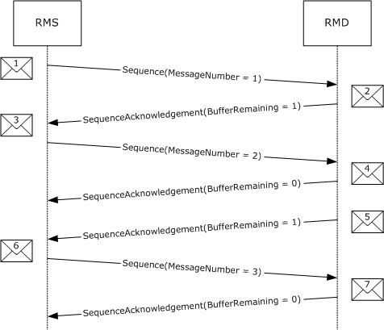
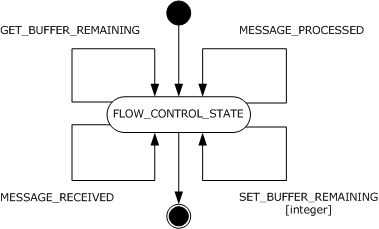
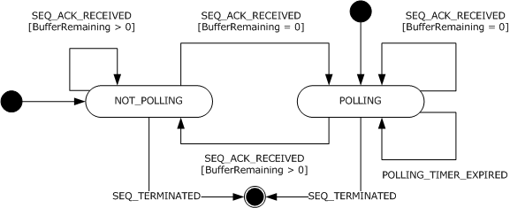
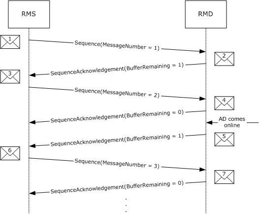

# [MS-WSRVCRM]: WS-ReliableMessaging Protocol: Advanced Flow Control Extension

Table of Contents

1 Introduction

- [1 Introduction](#Section_1)
  - [1.1 Glossary](#Section_1.1)
  - [1.2 References](#Section_1.2)
    - [1.2.1 Normative References](#Section_1.2.1)
    - [1.2.2 Informative References](#Section_1.2.2)
  - [1.3 Overview](#Section_1.3)
  - [1.4 Relationship to Other Protocols](#Section_1.4)
  - [1.5 Prerequisites/Preconditions](#Section_1.5)
  - [1.6 Applicability Statement](#Section_1.6)
  - [1.7 Versioning and Capability Negotiation](#Section_1.7)
  - [1.8 Vendor-Extensible Fields](#Section_1.8)
  - [1.9 Standards Assignments](#Section_1.9)

2 Messages

- [2 Messages](#Section_2)
  - [2.1 Transport](#Section_2.1)
  - [2.2 Message Syntax](#Section_2.2)
    - [2.2.1 SequenceAcknowledgement Header Block](#Section_2.2.1)
    - [2.2.2 AckRequested Header Block](#Section_2.2.2)
    - [2.2.3 BufferRemaining Element Syntax](#Section_2.2.3)

3 Protocol Details

- [3 Protocol Details](#Section_3)
  - [3.1 RMD Role Details](#Section_3.1)
    - [3.1.1 Abstract Data Model](#Section_3.1.1)
      - [3.1.1.1 FLOW_CONTROL_STATE](#Section_3.1.1.1)
    - [3.1.2 Timers](#Section_3.1.2)
    - [3.1.3 Initialization](#Section_3.1.3)
    - [3.1.4 Higher-Layer Triggered Events](#Section_3.1.4)
    - [3.1.5 Message Processing Events and Sequencing Rules](#Section_3.1.5)
    - [3.1.6 Timer Events](#Section_3.1.6)
    - [3.1.7 Other Local Events](#Section_3.1.7)
      - [3.1.7.1 GET_BUFFER_REMAINING](#Section_3.1.7.1)
      - [3.1.7.2 MESSAGE_PROCESSED](#Section_3.1.7.2)
      - [3.1.7.3 MESSAGE_RECEIVED](#Section_3.1.7.3)
      - [3.1.7.4 SET_BUFFER_REMAINING](#Section_3.1.7.4)
  - [3.2 RMS Role Details](#Section_3.2)
    - [3.2.1 Abstract Data Model](#Section_3.2.1)
      - [3.2.1.1 NOT_POLLING](#Section_3.2.1.1)
      - [3.2.1.2 POLLING](#Section_3.2.1.2)
    - [3.2.2 Timers](#Section_3.2.2)
      - [3.2.2.1 POLLING_TIMER](#Section_3.2.2.1)
    - [3.2.3 Initialization](#Section_3.2.3)
    - [3.2.4 Higher-Layer Triggered Events](#Section_3.2.4)
    - [3.2.5 Message Processing Events and Sequencing Rules](#Section_3.2.5)
    - [3.2.6 Timer Events](#Section_3.2.6)
      - [3.2.6.1 POLLING_TIMER_EXPIRED](#Section_3.2.6.1)
    - [3.2.7 Other Local Events](#Section_3.2.7)
      - [3.2.7.1 SEQ_ACK_RECEIVED](#Section_3.2.7.1)
      - [3.2.7.2 SEQ_TERMINATED](#Section_3.2.7.2)

4 Protocol Examples

- [4 Protocol Examples](#Section_4)
  - [4.1 Message Examples](#Section_4.1)
    - [4.1.1 Message 1: Sequence(MessageNumber = 1)](#Section_4.1.1)
    - [4.1.2 Message 2: SequenceAcknowledgement(BufferRemaining = 1)](#Section_4.1.2)
    - [4.1.3 Message 3: Sequence(MessageNumber = 2)](#Section_4.1.3)
    - [4.1.4 Message 4: SequenceAcknowledgement(BufferRemaining = 0)](#Section_4.1.4)
    - [4.1.5 Message 5: SequenceAcknowledgement(BufferRemaining = 1)](#Section_4.1.5)
    - [4.1.6 Message 6: Sequence(MessageNumber = 3)](#Section_4.1.6)
    - [4.1.7 Message 7: SequenceAcknowledgement(BufferRemaining = 0)](#Section_4.1.7)

5 Security

- [5 Security](#Section_5)
  - [5.1 Security Considerations for Implementers](#Section_5.1)
  - [5.2 Index of Security Parameters](#Section_5.2)

6 Appendix A: Product Behavior

- [6 Appendix A: Product Behavior](#Section_6)

7 Change Tracking

- [7 Change Tracking](#Section_7)

For the legal notice and IP terms, see [LEGAL.md](../LEGAL.md).
Last updated: 3/13/2019.
See [Revision History](#revision-history) for full version history.

# 1 Introduction

This document specifies an advanced message flow control extension to the Web Services Reliable Messaging Protocol [[WSRM1-0]](https://go.microsoft.com/fwlink/?LinkId=117285), [[WSRM1-1]](https://go.microsoft.com/fwlink/?LinkId=117286), and [[WSRM1-2]](https://go.microsoft.com/fwlink/?LinkId=192440).

Sections 1.5, 1.8, 1.9, 2, and 3 of this specification are normative. All other sections and examples in this specification are informative.

## 1.1 Glossary

This document uses the following terms:

**advanced flow-control extension (AFCE)**: An extension to the Web Services Reliable Messaging Protocol [[WSRM1-0]](https://go.microsoft.com/fwlink/?LinkId=117285), [[WSRM1-1]](https://go.microsoft.com/fwlink/?LinkId=117286), and [[WSRM1-2]](https://go.microsoft.com/fwlink/?LinkId=192440) that attempts to minimize the number of dropped messages by synchronizing the rate at which the [**reliable messaging source (RMS)**](#gt_reliable-messaging-source-rms) sends messages with the rate at which the [**reliable messaging destination (RMD)**](#gt_reliable-messaging-destination-rmd) can receive them.

**advanced flow-control object (AFCO)**: The abstract construct used to demonstrate an implementation of the [**advanced flow-control extension (AFCE)**](#gt_advanced-flow-control-extension-afce) on the [**reliable messaging destination (RMD)**](#gt_reliable-messaging-destination-rmd)).

**Application Destination (AD)**: The endpoint to which a message is delivered. For fuller information, see [WSRM1-0], [WSRM1-1], and [WSRM1-2].

**reliable messaging destination (RMD)**: An endpoint that receives a message. For more information, see [WSRM1-0], [WSRM1-1], and [WSRM1-2].

**reliable messaging source (RMS)**: An endpoint that sends a message. For more information, see [WSRM1-0], [WSRM1-1], and [WSRM1-2].

**sequence**: A one-way, uniquely identifiable batch of messages between an [**RMS**](#gt_reliable-messaging-source-rms) and an [**RMD**](#gt_reliable-messaging-destination-rmd).

**SOAP**: A lightweight protocol for exchanging structured information in a decentralized, distributed environment. [**SOAP**](#gt_soap) uses XML technologies to define an extensible messaging framework, which provides a message construct that can be exchanged over a variety of underlying protocols. The framework has been designed to be independent of any particular programming model and other implementation-specific semantics. SOAP 1.2 supersedes SOAP 1.1. See [[SOAP1.2-1/2003]](https://go.microsoft.com/fwlink/?LinkId=90521).

**Web Services Reliable Messaging (WSRM) Protocol**: A protocol that defines mechanisms that enable web services to ensure delivery of messages over unreliable communication networks. The WSRM Protocol allows different operating and middleware systems to reliably exchange these messages.

**MAY, SHOULD, MUST, SHOULD NOT, MUST NOT:** These terms (in all caps) are used as defined in [[RFC2119]](https://go.microsoft.com/fwlink/?LinkId=90317). All statements of optional behavior use either MAY, SHOULD, or SHOULD NOT.

## 1.2 References

Links to a document in the Microsoft Open Specifications library point to the correct section in the most recently published version of the referenced document. However, because individual documents in the library are not updated at the same time, the section numbers in the documents may not match. You can confirm the correct section numbering by checking the [Errata](https://go.microsoft.com/fwlink/?linkid=850906).

### 1.2.1 Normative References

We conduct frequent surveys of the normative references to assure their continued availability. If you have any issue with finding a normative reference, please contact [dochelp@microsoft.com](mailto:dochelp@microsoft.com). We will assist you in finding the relevant information.

[RFC2119] Bradner, S., "Key words for use in RFCs to Indicate Requirement Levels", BCP 14, RFC 2119, March 1997, [http://www.rfc-editor.org/rfc/rfc2119.txt](https://go.microsoft.com/fwlink/?LinkId=90317)

[WSRM1-0] Bilorusets, R., "Web Services Reliable Messaging Protocol (WS-ReliableMessaging)", February 2005, [http://specs.xmlsoap.org/ws/2005/02/rm/](https://go.microsoft.com/fwlink/?LinkId=117285)

[WSRM1-1] Fremantle, P., Patil, S., Davis, D., et al., "Web Services Reliable Messaging (WS-ReliableMessaging) Version 1.1", January 2008, [http://docs.oasis-open.org/ws-rx/wsrm/200702/wsrm-1.1-spec-os-01-e1.html](https://go.microsoft.com/fwlink/?LinkId=117286)

[WSRM1-2] Fremantle, P., Patil, S., Davis, D., et al., "Web Services Reliable Messaging (WS-ReliableMessaging) Version 1.2", February 2009, [http://docs.oasis-open.org/ws-rx/wsrm/200702/wsrm-1.2-spec-os.html](https://go.microsoft.com/fwlink/?LinkId=192440)

### 1.2.2 Informative References

[MS-NETOD] Microsoft Corporation, "[Microsoft .NET Framework Protocols Overview](#Section_1.3)".

## 1.3 Overview

The [**advanced flow-control extension (AFCE)**](#gt_advanced-flow-control-extension-afce) to [**web services reliable messaging protocol (WSRM)**](#gt_53cb509b-61f6-4d10-97e7-f94888da4a0c) attempts to minimize the number of dropped messages by synchronizing the rate at which the [**reliable messaging source (RMS)**](#gt_reliable-messaging-source-rms) sends messages with the rate at which the [**reliable messaging destination (RMD)**](#gt_reliable-messaging-destination-rmd) can receive them. This minimization is achieved via the introduction of the [BufferRemaining](#Section_4.1.5) element in the WSRM protocol's [SequenceAcknowledgement header block](#Section_2.2.1). This element is used to inform the RMS of the number of messages that the RMD is capable of receiving before messages start being dropped.

The RMS uses the BufferRemaining element's value to adjust the rate at which messages are sent. The RMS will not send new messages if the BufferRemaining element's value in a SequenceAcknowledgement header block is 0.

While the BufferRemaining element value is reported as 0, the RMS will periodically request for acknowledgements from the RMD until one is received containing a BufferRemaining element value greater than 0.

The example in the following figure shows an already-established reliable [**sequence**](#gt_sequence) between an RMS and an RMD. The RMS sends 2 messages (message 1 and 3), after which it is informed via the SequenceAcknowledgement header block (message 4) that the RMD can no longer receive any new messages (BufferRemaining is 0). Sometime later, the RMD informs the RMS that it can once again receive messages by changing the BufferRemaining value to 1 in a SequenceAcknowledgement header block (message 5). The RMS then proceeds to send the third message (message 6).

Figure 1: Example message flow diagram between an RMS and an RMD with AFCE to WSRM

## 1.4 Relationship to Other Protocols

The [**advanced flow-control extension (AFCE)**](#gt_advanced-flow-control-extension-afce) to [**web services reliable messaging protocol (WSRM)**](#gt_53cb509b-61f6-4d10-97e7-f94888da4a0c) relies on the WSRM protocol, to which it is an extension.

## 1.5 Prerequisites/Preconditions

The following prerequisites are necessary for using the [**AFCE**](#gt_advanced-flow-control-extension-afce) to [**WSRM**](#gt_53cb509b-61f6-4d10-97e7-f94888da4a0c):

- An implementation of WSRM is available.
- A reliable [**sequence**](#gt_sequence) has been established.

## 1.6 Applicability Statement

The [**AFCE**](#gt_advanced-flow-control-extension-afce) to [**WSRM**](#gt_53cb509b-61f6-4d10-97e7-f94888da4a0c) is applicable under all conditions where the WSRM protocol is applicable.

## 1.7 Versioning and Capability Negotiation

There is a single version of the [**AFCE**](#gt_advanced-flow-control-extension-afce) to [**WSRM**](#gt_53cb509b-61f6-4d10-97e7-f94888da4a0c) protocol.

## 1.8 Vendor-Extensible Fields

None.

## 1.9 Standards Assignments

None.

# 2 Messages

## 2.1 Transport

The [**advanced flow-control extension (AFCE)**](#gt_advanced-flow-control-extension-afce) to [**web services reliable messaging protocol (WSRM)**](#gt_53cb509b-61f6-4d10-97e7-f94888da4a0c) does not impose any restrictions on the use of any specific [**Simple Object Access Protocol (SOAP)**](#gt_soap) transport protocol.

## 2.2 Message Syntax

### 2.2.1 SequenceAcknowledgement Header Block

The SequenceAcknowledgement header block is the SequenceAcknowledgement header block specified in [**WSRM**](#gt_53cb509b-61f6-4d10-97e7-f94888da4a0c) with the following extension:

- The extensibility element of the SequenceAcknowledgement header block, as specified by the WSRM specifications [[WSRM1-0]](https://go.microsoft.com/fwlink/?LinkId=117285), [[WSRM1-1]](https://go.microsoft.com/fwlink/?LinkId=117286), and [[WSRM1-2]](https://go.microsoft.com/fwlink/?LinkId=192440) MUST contain a [BufferRemaining](#Section_4.1.5) element.

### 2.2.2 AckRequested Header Block

The AckRequested header block is the AckRequested header block specified in [**WSRM**](#gt_53cb509b-61f6-4d10-97e7-f94888da4a0c).

### 2.2.3 BufferRemaining Element Syntax

The following is the element's schema.

<xs:schema

targetNamespace="http://schemas.microsoft.com/ws/2006/05/rm"

xmlns:xs="http://www.w3.org/2001/XMLSchema"

>

<xs:element name="BufferRemaining">

<xs:simpleType>

<xs:restriction base="xs:int">

<xs:minInclusive value="0"/>

<xs:maxInclusive value="2147483647"/>

</xs:restriction>

</xs:simpleType>

</xs:element>

</xs:schema>

# 3 Protocol Details

## 3.1 RMD Role Details

### 3.1.1 Abstract Data Model

This section describes a conceptual model of possible data organization that an implementation maintains to participate in this protocol. The described organization is provided to facilitate the explanation of how the protocol behaves. This document does not mandate that implementations adhere to this model as long as their external behavior is consistent with that described in this document.

An abstract construct referred to as the [**advanced flow-control object (AFCO)**](#gt_advanced-flow-control-object-afco) is used in this section to describe the [**advanced flow-control extension (AFCE)**](#gt_advanced-flow-control-extension-afce) to [**web services reliable messaging protocol (WSRM)**](#gt_53cb509b-61f6-4d10-97e7-f94888da4a0c) on the [**reliable messaging destination (RMD)**](#gt_reliable-messaging-destination-rmd).

The AFCO maintains the following data elements:

- **Buffer Remaining**: A 32-bit integer value that indicates the number of messages the RMD can to receive. The value of Buffer Remaining is non-negative.
The following figure shows a hypothetical implementation of the AFCO and the events that control its state on a hypothetical implementation-specific RMD.

Figure 2: State diagram of the AFCO on the RMD

#### 3.1.1.1 FLOW_CONTROL_STATE

The [**AFCO**](#gt_advanced-flow-control-object-afco) has a single state called FLOW_CONTROL_STATE.

The following local events are processed by this state:

- GET_BUFFER_REMAINING
- MESSAGE_RECEIVED
- MESSAGE_PROCESSED
- SET_BUFFER_REMAINING

### 3.1.2 Timers

None.

### 3.1.3 Initialization

When the [**RMD**](#gt_reliable-messaging-destination-rmd) is initialized:

- The [**AFCO**](#gt_advanced-flow-control-object-afco) MUST start in the FLOW_CONTROL_STATE state.
- The **Buffer Remaining** field MUST be set to a value obtained from the RMD. <1>
- The **Buffer Remaining** field's maximum value MUST be specified by the RMD. <2>

### 3.1.4 Higher-Layer Triggered Events

None.

### 3.1.5 Message Processing Events and Sequencing Rules

None.

### 3.1.6 Timer Events

None.

### 3.1.7 Other Local Events

None.

#### 3.1.7.1 GET_BUFFER_REMAINING

The [**reliable messaging destination (RMD)**](#gt_reliable-messaging-destination-rmd) MUST trigger the GET_BUFFER_REMAINING event when adding a [SequenceAcknowledgement header block](#Section_2.2.1) to a message.

If the GET_BUFFER_REMAINING event is signaled, the following actions MUST be performed:

- The GET_BUFFER_REMAINING event MUST return the value of the [**advanced flow-control object's (AFCO)**](#gt_advanced-flow-control-object-afco) **Buffer Remaining** field.
- The RMD MUST use the return value to set the value of the [BufferRemaining](#Section_4.1.5) element in the SequenceAcknowledgement header block.

#### 3.1.7.2 MESSAGE_PROCESSED

The MESSAGE_PROCESSED event SHOULD be triggered by the [**RMD**](#gt_reliable-messaging-destination-rmd) when a message is processed by the [**application destination (AD)**](#gt_application-destination-ad).

If the MESSAGE_PROCESSED event is signaled, the following actions MUST be performed:

- If the [**AFCO**](#gt_advanced-flow-control-object-afco) **Buffer Remaining** value is less than the maximum allowed by the RMD:
- The AFCO's **Buffer Remaining** value SHOULD be incremented by 1 by having the RMD trigger the SET_BUFFER_REMAINING event (see section [3.1.7.4](#Section_3.1.7.4)).
- Otherwise:
- The AFCO SHOULD NOT change its **Buffer Remaining** value.

#### 3.1.7.3 MESSAGE_RECEIVED

The [**RMD**](#gt_reliable-messaging-destination-rmd) SHOULD trigger the MESSAGE_RECEIVED event when a message is received.

If the MESSAGE_RECEIVED event is signaled, the following actions MUST be performed:

- If the [**AFCO's**](#gt_advanced-flow-control-object-afco) **Buffer Remaining** has a value greater than 0:
- The AFCO's **Buffer Remaining** value SHOULD be decremented by 1 by having the RMD trigger the SET_BUFFER_REMAINING event (see section [3.1.7.4](#Section_3.1.7.4)).
- Otherwise:
- The AFCO SHOULD NOT change its **Buffer Remaining** value.

#### 3.1.7.4 SET_BUFFER_REMAINING

The [**RMD**](#gt_reliable-messaging-destination-rmd) MAY trigger the SET_BUFFER_REMAINING event to control higher-layer implementation-specific flow control.

The SET_BUFFER_REMAINING event MUST be signaled by the higher-layer business logic containing the following arguments:

- The New **Buffer Remaining** argument
If the SET_BUFFER_REMAINING event is signaled, the [**AFCO**](#gt_advanced-flow-control-object-afco) MUST perform the following actions:

- The AFCO MUST set the value of its **Buffer Remaining** field to the New **Buffer Remaining** value.

## 3.2 RMS Role Details

### 3.2.1 Abstract Data Model

This section describes a conceptual model of possible data organization that an implementation maintains to participate in this protocol. The described organization is provided to facilitate the explanation of how the protocol behaves. This document does not mandate that implementations adhere to this model as long as their external behavior is consistent with that described in this document.

The following figure shows the [**advanced flow-control extension (AFCE)**](#gt_advanced-flow-control-extension-afce) to [**web services reliable messaging protocol (WSRM)**](#gt_53cb509b-61f6-4d10-97e7-f94888da4a0c) state diagram for a hypothetical [**reliable messaging source (RMS)**](#gt_reliable-messaging-source-rms) and the events that control its state.

Figure 3: State diagram of the AFCE to WSRM on the RMS

#### 3.2.1.1 NOT_POLLING

The following local events are processed by this state:

- SEQ_ACK_RECEIVED
- SEQ_TERMINATED

#### 3.2.1.2 POLLING

The following local events are processed by this state:

- SEQ_ACK_RECEIVED
- SEQ_TERMINATED
The following timer events are processed by this state:

- POLLING_TIMER_EXPIRED
If the [**reliable messaging source (RMS)**](#gt_reliable-messaging-source-rms) is in the POLLING state, the following actions MUST be taken:

- New messages SHOULD NOT be sent to the [**reliable messaging destination (RMD)**](#gt_reliable-messaging-destination-rmd).

### 3.2.2 Timers

#### 3.2.2.1 POLLING_TIMER

The [**RMS**](#gt_reliable-messaging-source-rms) MUST have a POLLING_TIMER. The POLLING_TIMER specifies the interval used by the RMS to poll the [**RMD**](#gt_reliable-messaging-destination-rmd) for the [SequenceAcknowledgement header block](#Section_2.2.1).

The POLLING_TIMER raises the POLLING_TIMER_EXPIRED event whenever it expires.

### 3.2.3 Initialization

When the [**reliable messaging source (RMS)**](#gt_reliable-messaging-source-rms) is initialized:

- The RMS MUST be in the NOT_POLLING state.
- The expiration timeout of the POLLING_TIMER MUST be set to an RMS implementation-specific value. <3>
- The POLLING_TIMER MUST NOT be started.

### 3.2.4 Higher-Layer Triggered Events

There are no [**RMS**](#gt_reliable-messaging-source-rms) specific higher-layer triggered events.

### 3.2.5 Message Processing Events and Sequencing Rules

There are no [**RMS**](#gt_reliable-messaging-source-rms) specific message processing events or sequencing rules.

### 3.2.6 Timer Events

#### 3.2.6.1 POLLING_TIMER_EXPIRED

The POLLING_TIMER_EXPIRED event MUST be triggered by the [**RMS**](#gt_reliable-messaging-source-rms) every time the POLLING_TIMER expires. The POLLING_TIMER_EXPIRED event is processed by the POLLING state.

If the POLLING_TIMER_EXPIRED event is signaled, the RMS MUST perform the following actions:

- Include an [AckRequested header block](#Section_2.2.2) in a message to the [**RMD**](#gt_reliable-messaging-destination-rmd).
- Reset the POLLING_TIMER timer.
- Restart the POLLING_TIMER timer.

### 3.2.7 Other Local Events

#### 3.2.7.1 SEQ_ACK_RECEIVED

The SEQ_ACK_RECEIVED event MUST be triggered by the [**reliable messaging source (RMS)**](#gt_reliable-messaging-source-rms) when a [SequenceAcknowledgement header block](#Section_2.2.1) is received.

The SEQ_ACK_RECEIVED event MUST be signaled with the following arguments:

- The [BufferRemaining](#Section_4.1.5) argument corresponding to the value of the BufferRemaining element in the SequenceAcknowledgement header block.
- If the BufferRemaining element is missing from the SequenceAcknowledgement header block, the BufferRemaining argument MUST be set to -1.
If the SEQ_ACK_RECEIVED event is signaled, the RMS MUST perform the following actions:

- If the RMS is in the POLLING state:
- If the BufferRemaining value is greater than 0:
- The RMS MUST move to the NOT_POLLING state.
- The RMS MUST cancel the POLLING_TIMER timer.
- If the BufferRemaining value is equal to 0:
- The RMS MUST remain in the POLLING state.
- If the BufferRemaining value is equal to -1:
- The RMS MUST remain in the POLLING state.
- If the RMS is in the NOT_POLLING state:
- If the BufferRemaining value is greater than 0:
- The RMS MUST remain in the NOT_POLLING state.
- If the BufferRemaining value is equal to 0:
- The RMS MUST move to the POLLING state.
- The RMS MUST reset the POLLING_TIMER timer.
- The RMS MUST start the POLLING_TIMER timer.
- If the BufferRemaining value is equal to -1:
- The RMS MUST remain in the NOT_POLLING state.

#### 3.2.7.2 SEQ_TERMINATED

The SEQ_TERMINATED event MUST be triggered by the [**RMS**](#gt_reliable-messaging-source-rms) when the [**sequence**](#gt_sequence) is terminated (as specified in [**web services reliable messaging protocol (WSRM)**](#gt_53cb509b-61f6-4d10-97e7-f94888da4a0c)).

If the SEQ_TERMINATED event is signaled, the RMS MUST perform the following actions:

- If the RMS is in the POLLING state:
- The RMS MUST stop the POLLING_TIMER timer.
- If the RMS is in the NOT_POLLING state:
- No action is needed.

# 4 Protocol Examples

The following is an example of a [**reliable messaging source (RMS)**](#gt_reliable-messaging-source-rms) sending 3 messages to a [**reliable messaging destination (RMD)**](#gt_reliable-messaging-destination-rmd). The RMD is capable of storing a maximum of 2 messages at a time. Once stored, the messages are passed to the [**application destination (AD)**](#gt_application-destination-ad) for processing. In this example, the AD is offline when the RMD starts receiving messages. The RMD uses [SequenceAcknowledgement header blocks](#Section_2.2.1) to acknowledge every message received. The [BufferRemaining](#Section_4.1.5) element is included in all SequenceAcknowledgement header blocks and the RMS adjusts the rate at which it sends new messages accordingly.

The following figure shows the diagram of the message flow between the RMS and the RMD.

Figure 4: Example message flow diagram between an RMS and an RMD with AFCE to WSRM

## 4.1 Message Examples

The following are the actual messages, as shown in Figure 4, sent between the [**RMS**](#gt_reliable-messaging-source-rms) and the [**RMD**](#gt_reliable-messaging-destination-rmd). The body of each message is not shown as it is not relevant to the [**advanced flow-control extension (AFCE)**](#gt_advanced-flow-control-extension-afce) to the [**web services reliable messaging protocol (WSRM)**](#gt_53cb509b-61f6-4d10-97e7-f94888da4a0c). The purpose of each message is not included in this example. See the WSRM specification [[WSRM1-0]](https://go.microsoft.com/fwlink/?LinkId=117285), [[WSRM1-1]](https://go.microsoft.com/fwlink/?LinkId=117286), and [[WSRM1-2]](https://go.microsoft.com/fwlink/?LinkId=192440) for details on each message type.

### 4.1.1 Message 1: Sequence(MessageNumber = 1)

Message 1 in Figure 4 is the first message in the [**Sequence**](#gt_sequence) sent by the [**RMS**](#gt_reliable-messaging-source-rms).

Line numbers 1-19 in Table 1 are the SOAP envelope of message 1. Line 11 shows this to be the first message in the Sequence.

**Table 1**

| 1 2 3 4 5 6 7 8 9 10 11 12 13 14 15 16 17 18 19 | <s:Envelope xmlns:s="http://www.w3.org/2003/05/soap-envelope" xmlns:r="http://schemas.xmlsoap.org/ws/2005/02/rm" xmlns:a="http://www.w3.org/2005/08/addressing" > <s:Header> <r:Sequence s:mustUnderstand="1"> <r:Identifier> urn:uuid:0b162747-99cf-479c-972f-95b776e141c3 </r:Identifier> <r:MessageNumber>1</r:MessageNumber> </r:Sequence> <a:Action s:mustUnderstand="1"> http://tempuri.org/IAFCEExampleContract/Operation1 </a:Action> <a:To s:mustUnderstand="1">http://localhost/AFCEExample</a:To> </s:Header> <s:Body>...</s:Body> </s:Envelope> |
| --- | --- |

### 4.1.2 Message 2: SequenceAcknowledgement(BufferRemaining = 1)

Message 2 in Figure 4 contains the [SequenceAcknowledgement header block](#Section_2.2.1) sent by the RMD in response to message 1.

Line numbers 1-24 in Table 2 are the SOAP envelope of message 2. Line 11 shows that the [**RMD**](#gt_reliable-messaging-destination-rmd) has received the first message in the [**Sequence**](#gt_sequence). Lines 13-17 show the [BufferRemaining](#Section_4.1.5) element with a value of 1. This means the RMD is capable of receiving one more message.

**Table 2**

| 1 2 3 4 5 6 7 8 9 10 11 12 13 14 15 16 17 18 19 20 21 22 23 24 | <s:Envelope xmlns:s="http://www.w3.org/2003/05/soap-envelope" xmlns:r="http://schemas.xmlsoap.org/ws/2005/02/rm" xmlns:a="http://www.w3.org/2005/08/addressing" > <s:Header> <r:SequenceAcknowledgement> <r:Identifier> urn:uuid:0b162747-99cf-479c-972f-95b776e141c3 </r:Identifier> <r:AcknowledgementRange Lower="1" Upper="1"> </r:AcknowledgementRange> <netrm:BufferRemaining xmlns:netrm=http://schemas.microsoft.com/ws/2006/05/rm > 1 </netrm:BufferRemaining> </r:SequenceAcknowledgement> <a:Action s:mustUnderstand="1"> http://schemas.xmlsoap.org/ws/2005/02/rm/SequenceAcknowledgement </a:Action> </s:Header> <s:Body></s:Body> </s:Envelope> |
| --- | --- |

### 4.1.3 Message 3: Sequence(MessageNumber = 2)

Message 3 in Figure 4 is the second message in the [**Sequence**](#gt_sequence) sent by the [**RMS**](#gt_reliable-messaging-source-rms).

Line numbers 1-19 in Table 3 are the SOAP envelope of message 3. Line 11 shows this to be the second message in the Sequence.

**Table 3**

| 1 2 3 4 5 6 7 8 9 10 11 12 13 14 15 16 17 18 19 | <s:Envelope xmlns:s="http://www.w3.org/2003/05/soap-envelope" xmlns:r="http://schemas.xmlsoap.org/ws/2005/02/rm" xmlns:a="http://www.w3.org/2005/08/addressing" > <s:Header> <r:Sequence s:mustUnderstand="1"> <r:Identifier> urn:uuid:0b162747-99cf-479c-972f-95b776e141c3 </r:Identifier> <r:MessageNumber>2</r:MessageNumber> </r:Sequence> <a:Action s:mustUnderstand="1"> http://tempuri.org/IAFCEExampleContract/Operation1 </a:Action> <a:To s:mustUnderstand="1">http://localhost/AFCEExample</a:To> </s:Header> <s:Body>...</s:Body> </s:Envelope> |
| --- | --- |

### 4.1.4 Message 4: SequenceAcknowledgement(BufferRemaining = 0)

Message 4 in Figure 4 contains the [SequenceAcknowledgement header block](#Section_2.2.1) sent by the [**RMD**](#gt_reliable-messaging-destination-rmd) in response to message 2.

Line numbers 1-24 in Table 4 are the SOAP envelope of message 4. Line 11 shows that the RMD has received the first and second messages in the [**Sequence**](#gt_sequence). Lines 13-17 show the [BufferRemaining](#Section_4.1.5) element with a value of 0. This means the RMD is not capable of receiving more messages until the AD comes online and starts processing the ones already received.

**Table 4**

| 1 2 3 4 5 6 7 8 9 10 11 12 13 14 15 16 17 18 19 20 21 22 23 24 | <s:Envelope xmlns:s="http://www.w3.org/2003/05/soap-envelope" xmlns:r="http://schemas.xmlsoap.org/ws/2005/02/rm" xmlns:a="http://www.w3.org/2005/08/addressing" > <s:Header> <r:SequenceAcknowledgement> <r:Identifier> urn:uuid:0b162747-99cf-479c-972f-95b776e141c3 </r:Identifier> <r:AcknowledgementRange Lower="1" Upper="2"> </r:AcknowledgementRange> <netrm:BufferRemaining xmlns:netrm=http://schemas.microsoft.com/ws/2006/05/rm > 0 </netrm:BufferRemaining> </r:SequenceAcknowledgement> <a:Action s:mustUnderstand="1"> http://schemas.xmlsoap.org/ws/2005/02/rm/SequenceAcknowledgement </a:Action> </s:Header> <s:Body></s:Body> </s:Envelope> |
| --- | --- |

### 4.1.5 Message 5: SequenceAcknowledgement(BufferRemaining = 1)

Message 5 in Figure 4 contains the [SequenceAcknowledgement header block](#Section_2.2.1) sent by the [**RMD**](#gt_reliable-messaging-destination-rmd) in response to the AD coming online and processing message 1. The RMD removed message 1 from its store once it was processed, allowing the RMD to receive a new message in message 1's stead.

Line numbers 1-24 in Table 5 are the SOAP envelope of message 5. Line 11 shows that the RMD has received the first and second messages in the [**Sequence**](#gt_sequence), which has not changed since message 4. Lines 13-17 show the [BufferRemaining](#Section_4.1.5) element with a value of 1. This means the RMD is now once again capable of receiving a message.

**Table 5**

| 1 2 3 4 5 6 7 8 9 10 11 12 13 14 15 16 17 18 19 20 21 22 23 24 | <s:Envelope xmlns:s="http://www.w3.org/2003/05/soap-envelope" xmlns:r="http://schemas.xmlsoap.org/ws/2005/02/rm" xmlns:a="http://www.w3.org/2005/08/addressing" > <s:Header> <r:SequenceAcknowledgement> <r:Identifier> urn:uuid:0b162747-99cf-479c-972f-95b776e141c3 </r:Identifier> <r:AcknowledgementRange Lower="1" Upper="2"> </r:AcknowledgementRange> <netrm:BufferRemaining xmlns:netrm=http://schemas.microsoft.com/ws/2006/05/rm > 1 </netrm:BufferRemaining> </r:SequenceAcknowledgement> <a:Action s:mustUnderstand="1"> http://schemas.xmlsoap.org/ws/2005/02/rm/SequenceAcknowledgement </a:Action> </s:Header> <s:Body></s:Body> </s:Envelope> |
| --- | --- |

### 4.1.6 Message 6: Sequence(MessageNumber = 3)

Message 6 in Figure 4 is the third message in the [**Sequence**](#gt_sequence) sent by the [**RMS**](#gt_reliable-messaging-source-rms) in response to processing the [BufferRemaining](#Section_4.1.5) element in the [SequenceAcknowledgement header block](#Section_2.2.1) of message 5. The BufferRemaining element, with a value of 1, informed the RMS of the [**RMD**](#gt_reliable-messaging-destination-rmd)'s capability of receiving a new message.

Line numbers 1-19 in Table 6 are the SOAP envelope of message 6. Line 11 shows this to be the third message in the Sequence.

**Table 6**

| 1 2 3 4 5 6 7 8 9 10 11 12 13 14 15 16 17 18 19 | <s:Envelope xmlns:s="http://www.w3.org/2003/05/soap-envelope" xmlns:r="http://schemas.xmlsoap.org/ws/2005/02/rm" xmlns:a="http://www.w3.org/2005/08/addressing" > <s:Header> <r:Sequence s:mustUnderstand="1"> <r:Identifier> urn:uuid:0b162747-99cf-479c-972f-95b776e141c3 </r:Identifier> <r:MessageNumber>3</r:MessageNumber> </r:Sequence> <a:Action s:mustUnderstand="1"> http://tempuri.org/IAFCEExampleContract/Operation1 </a:Action> <a:To s:mustUnderstand="1">http://localhost/AFCEExample</a:To> </s:Header> <s:Body>...</s:Body> </s:Envelope> |
| --- | --- |

### 4.1.7 Message 7: SequenceAcknowledgement(BufferRemaining = 0)

Message 7 in Figure 4 contains the [SequenceAcknowledgement header block](#Section_2.2.1) sent by the [**RMD**](#gt_reliable-messaging-destination-rmd) in response to message 6.

Line numbers 1-24 in Table 7 are the SOAP envelope of message 7. Line 11 shows that the RMD has received the first, second, and third messages in the [**Sequence**](#gt_sequence). Lines 13-17 show the [BufferRemaining](#Section_4.1.5) element with a value of 0. This 0 value means that the RMD is once again incapable of receiving more messages.

**Table 7**

| 1 2 3 4 5 6 7 8 9 10 11 12 13 14 15 16 17 18 19 20 21 22 23 24 | <s:Envelope xmlns:s="http://www.w3.org/2003/05/soap-envelope" xmlns:r="http://schemas.xmlsoap.org/ws/2005/02/rm" xmlns:a="http://www.w3.org/2005/08/addressing" > <s:Header> <r:SequenceAcknowledgement> <r:Identifier> urn:uuid:0b162747-99cf-479c-972f-95b776e141c3 </r:Identifier> <r:AcknowledgementRange Lower="1" Upper="3"> </r:AcknowledgementRange> <netrm:BufferRemaining xmlns:netrm=http://schemas.microsoft.com/ws/2006/05/rm > 0 </netrm:BufferRemaining> </r:SequenceAcknowledgement> <a:Action s:mustUnderstand="1"> http://schemas.xmlsoap.org/ws/2005/02/rm/SequenceAcknowledgement </a:Action> </s:Header> <s:Body></s:Body> </s:Envelope> |
| --- | --- |

# 5 Security

## 5.1 Security Considerations for Implementers

The [BufferRemaining](#Section_4.1.5) element is secured with the entire [SequenceAcknowledgement header block](#Section_2.2.1) containing it.

For information about securing a reliable session, including the SequenceAcknowledgement header block, see section 5 of [[WSRM1-0]](https://go.microsoft.com/fwlink/?LinkId=117285), [[WSRM1-1]](https://go.microsoft.com/fwlink/?LinkId=117286), and [[WSRM1-2]](https://go.microsoft.com/fwlink/?LinkId=192440).

## 5.2 Index of Security Parameters

None.

# 6 Appendix A: Product Behavior

The information in this specification is applicable to the following Microsoft products or supplemental software. References to product versions include updates to those products.

This document specifies version-specific details in the Microsoft .NET Framework. For information about which versions of .NET Framework are available in each released Windows product or as supplemental software, see [MS-NETOD](#Section_1.3) section 4.

- Microsoft .NET Framework 3.0
- Microsoft .NET Framework 3.5
- Microsoft .NET Framework 4.0
- Microsoft .NET Framework 4.5
- Microsoft .NET Framework 4.6
- Microsoft .NET Framework 4.7
- Microsoft .NET Framework 4.8
Exceptions, if any, are noted in this section. If an update version, service pack or Knowledge Base (KB) number appears with a product name, the behavior changed in that update. The new behavior also applies to subsequent updates unless otherwise specified. If a product edition appears with the product version, behavior is different in that product edition.

Unless otherwise specified, any statement of optional behavior in this specification that is prescribed using the terms "SHOULD" or "SHOULD NOT" implies product behavior in accordance with the SHOULD or SHOULD NOT prescription. Unless otherwise specified, the term "MAY" implies that the product does not follow the prescription.

<1> Section 3.1.3: The Microsoft .NET Framework implementation sets this value to 8.

<2> Section 3.1.3: The Microsoft .NET Framework implementation sets this value to 4096.

<3> Section 3.2.3: The Microsoft .NET Framework implementation sets this value to 30 seconds.

# 7 Change Tracking

This section identifies changes that were made to this document since the last release. Changes are classified as Major, Minor, or None.

The revision class **Major** means that the technical content in the document was significantly revised. Major changes affect protocol interoperability or implementation. Examples of major changes are:

- A document revision that incorporates changes to interoperability requirements.
- A document revision that captures changes to protocol functionality.
The revision class **Minor** means that the meaning of the technical content was clarified. Minor changes do not affect protocol interoperability or implementation. Examples of minor changes are updates to clarify ambiguity at the sentence, paragraph, or table level.

The revision class **None** means that no new technical changes were introduced. Minor editorial and formatting changes may have been made, but the relevant technical content is identical to the last released version.

The changes made to this document are listed in the following table. For more information, please contact [dochelp@microsoft.com](mailto:dochelp@microsoft.com).

| Section | Description | Revision class |
| --- | --- | --- |
| [6](#Section_6) Appendix A: Product Behavior | Added .NET 4.8 to the list of applicable products. | Major |

## Revision History

| Date | Version | Revision Class | Comments |
| --- | --- | --- | --- |
| 4/8/2008 | 0.1 | New | Version 0.1 release |
| 6/20/2008 | 0.2 | Minor | Clarified the meaning of the technical content. |
| 7/25/2008 | 1.0 | Major | Updated and revised the technical content. |
| 8/29/2008 | 1.0.1 | Editorial | Changed language and formatting in the technical content. |
| 10/24/2008 | 1.0.2 | Editorial | Changed language and formatting in the technical content. |
| 12/5/2008 | 2.0 | Major | Updated and revised the technical content. |
| 1/16/2009 | 2.0.1 | Editorial | Changed language and formatting in the technical content. |
| 2/27/2009 | 2.0.2 | Editorial | Changed language and formatting in the technical content. |
| 4/10/2009 | 2.0.3 | Editorial | Changed language and formatting in the technical content. |
| 5/22/2009 | 2.0.4 | Editorial | Changed language and formatting in the technical content. |
| 7/2/2009 | 2.0.5 | Editorial | Changed language and formatting in the technical content. |
| 8/14/2009 | 2.0.6 | Editorial | Changed language and formatting in the technical content. |
| 9/25/2009 | 2.0.7 | Editorial | Changed language and formatting in the technical content. |
| 11/6/2009 | 2.0.8 | Editorial | Changed language and formatting in the technical content. |
| 12/18/2009 | 2.1 | Minor | Clarified the meaning of the technical content. |
| 1/29/2010 | 2.1.1 | Editorial | Changed language and formatting in the technical content. |
| 3/12/2010 | 3.0 | Major | Updated and revised the technical content. |
| 4/23/2010 | 3.0.1 | Editorial | Changed language and formatting in the technical content. |
| 6/4/2010 | 3.0.2 | Editorial | Changed language and formatting in the technical content. |
| 7/16/2010 | 4.0 | Major | Updated and revised the technical content. |
| 8/27/2010 | 4.0 | None | No changes to the meaning, language, or formatting of the technical content. |
| 10/8/2010 | 4.0 | None | No changes to the meaning, language, or formatting of the technical content. |
| 11/19/2010 | 4.0 | None | No changes to the meaning, language, or formatting of the technical content. |
| 1/7/2011 | 4.0 | None | No changes to the meaning, language, or formatting of the technical content. |
| 2/11/2011 | 4.0 | None | No changes to the meaning, language, or formatting of the technical content. |
| 3/25/2011 | 4.0 | None | No changes to the meaning, language, or formatting of the technical content. |
| 5/6/2011 | 4.0 | None | No changes to the meaning, language, or formatting of the technical content. |
| 6/17/2011 | 4.1 | Minor | Clarified the meaning of the technical content. |
| 9/23/2011 | 4.1 | None | No changes to the meaning, language, or formatting of the technical content. |
| 12/16/2011 | 5.0 | Major | Updated and revised the technical content. |
| 3/30/2012 | 5.0 | None | No changes to the meaning, language, or formatting of the technical content. |
| 7/12/2012 | 5.0 | None | No changes to the meaning, language, or formatting of the technical content. |
| 10/25/2012 | 5.0 | None | No changes to the meaning, language, or formatting of the technical content. |
| 1/31/2013 | 5.0 | None | No changes to the meaning, language, or formatting of the technical content. |
| 8/8/2013 | 5.0 | None | No changes to the meaning, language, or formatting of the technical content. |
| 11/14/2013 | 5.0 | None | No changes to the meaning, language, or formatting of the technical content. |
| 2/13/2014 | 5.0 | None | No changes to the meaning, language, or formatting of the technical content. |
| 5/15/2014 | 5.0 | None | No changes to the meaning, language, or formatting of the technical content. |
| 6/30/2015 | 6.0 | Major | Significantly changed the technical content. |
| 10/16/2015 | 6.0 | None | No changes to the meaning, language, or formatting of the technical content. |
| 7/14/2016 | 6.0 | None | No changes to the meaning, language, or formatting of the technical content. |
| 3/16/2017 | 7.0 | Major | Significantly changed the technical content. |
| 6/1/2017 | 7.0 | None | No changes to the meaning, language, or formatting of the technical content. |
| 3/13/2019 | 8.0 | Major | Significantly changed the technical content. |
