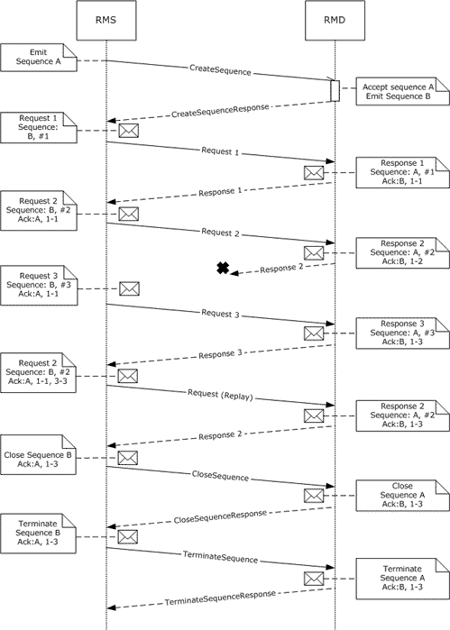
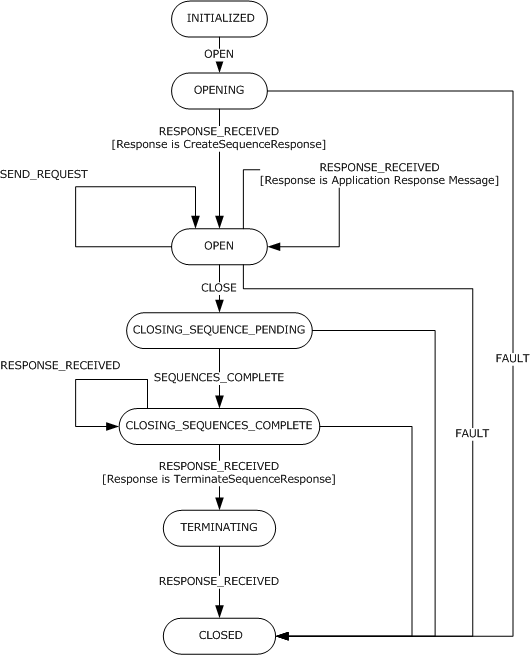
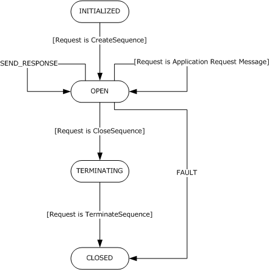

# [MS-WSRVCRR]: WS-ReliableMessaging Protocol: Reliable Request-Reply Extension

Table of Contents

1 Introduction

- [1 Introduction](#Section_1)
  - [1.1 Glossary](#Section_1.1)
  - [1.2 References](#Section_1.2)
    - [1.2.1 Normative References](#Section_1.2.1)
    - [1.2.2 Informative References](#Section_1.2.2)
  - [1.3 Overview](#Section_1.3)
  - [1.4 Relationship to Other Protocols](#Section_1.4)
  - [1.5 Prerequisites/Preconditions](#Section_1.5)
  - [1.6 Applicability Statement](#Section_1.6)
  - [1.7 Versioning and Capability Negotiation](#Section_1.7)
  - [1.8 Vendor-Extensible Fields](#Section_1.8)
  - [1.9 Standards Assignments](#Section_1.9)

2 Messages

- [2 Messages](#Section_2)
  - [2.1 Transport](#Section_2.1)
  - [2.2 Message Syntax](#Section_2.2)
    - [2.2.1 Request Message](#Section_2.2.1)
    - [2.2.2 Response Message](#Section_2.2.2)
    - [2.2.3 CreateSequence Message](#Section_2.2.3)
    - [2.2.4 CreateSequenceResponse Message](#Section_2.2.4)
    - [2.2.5 CloseSequence Message](#Section_2.2.5)
    - [2.2.6 CloseSequenceResponse Message](#Section_2.2.6)
    - [2.2.7 TerminateSequence Message](#Section_2.2.7)
    - [2.2.8 TerminateSequenceResponse Message](#Section_2.2.8)
    - [2.2.9 Application Request Message](#Section_2.2.9)
    - [2.2.10 Application Response Message](#Section_2.2.10)
    - [2.2.11 Empty Response Message](#Section_2.2.11)
    - [2.2.12 Null Response Message](#Section_2.2.12)

3 Protocol Details

- [3 Protocol Details](#Section_3)
  - [3.1 Reliable Messaging Source Role Details](#Section_3.1)
    - [3.1.1 Abstract Data Model](#Section_3.1.1)
      - [3.1.1.1 INITIALIZED State](#Section_3.1.1.1)
      - [3.1.1.2 OPENING State](#Section_3.1.1.2)
      - [3.1.1.3 OPEN State](#Section_3.1.1.3)
      - [3.1.1.4 CLOSING_SEQUENCES_PENDING State](#Section_3.1.1.4)
      - [3.1.1.5 CLOSING_SEQUENCES_COMPLETE State](#Section_3.1.1.5)
      - [3.1.1.6 TERMINATING State](#Section_3.1.1.6)
      - [3.1.1.7 CLOSED State](#Section_3.1.1.7)
    - [3.1.2 Timers](#Section_3.1.2)
    - [3.1.3 Initialization](#Section_3.1.3)
    - [3.1.4 Higher-Layer Triggered Events](#Section_3.1.4)
      - [3.1.4.1 OPEN Event](#Section_3.1.4.1)
      - [3.1.4.2 SEND_REQUEST Event](#Section_3.1.4.2)
      - [3.1.4.3 CLOSE Event](#Section_3.1.4.3)
    - [3.1.5 Message Processing Events and Sequencing Rules](#Section_3.1.5)
      - [3.1.5.1 RESPONSE_RECEIVED Event](#Section_3.1.5.1)
    - [3.1.6 Timer Events](#Section_3.1.6)
    - [3.1.7 Other Local Events](#Section_3.1.7)
      - [3.1.7.1 FAULT Event](#Section_3.1.7.1)
      - [3.1.7.2 SEQUENCES_COMPLETE Event](#Section_3.1.7.2)
      - [3.1.7.3 PREPARE_ACKNOWLEDGEMENT Event](#Section_3.1.7.3)
  - [3.2 Reliable Messaging Destination Details](#Section_3.2)
    - [3.2.1 Abstract Data Model](#Section_3.2.1)
      - [3.2.1.1 INITIALIZED State](#Section_3.2.1.1)
      - [3.2.1.2 OPEN State](#Section_3.2.1.2)
      - [3.2.1.3 TERMINATING State](#Section_3.2.1.3)
      - [3.2.1.4 CLOSED State](#Section_3.2.1.4)
    - [3.2.2 Timers](#Section_3.2.2)
    - [3.2.3 Initialization](#Section_3.2.3)
    - [3.2.4 Higher-Layer Triggered Events](#Section_3.2.4)
      - [3.2.4.1 SEND_RESPONSE Event](#Section_3.2.4.1)
    - [3.2.5 Message Processing Events and Sequencing Rules](#Section_3.2.5)
      - [3.2.5.1 REQUEST_RECEIVED](#Section_3.2.5.1)
    - [3.2.6 Timer Events](#Section_3.2.6)
    - [3.2.7 Other Local Events](#Section_3.2.7)
      - [3.2.7.1 FAULT Event](#Section_3.2.7.1)
      - [3.2.7.2 ACKNOWLEDGEMENT_RECEIVED Event](#Section_3.2.7.2)
      - [3.2.7.3 PREPARE_ACKNOWLEDGEMENT Event](#Section_3.2.7.3)

4 Protocol Examples

- [4 Protocol Examples](#Section_4)
  - [4.1 WS-ReliableMessaging 1.0](#Section_4.1)
    - [4.1.1 Establish the Sequences](#Section_4.1.1)
    - [4.1.2 Reliable Request-Response Exchange](#Section_4.1.2)
    - [4.1.3 Close and Terminate the Sequences](#Section_4.1.3)
  - [4.2 WS-ReliableMessaging 1.1](#Section_4.2)
    - [4.2.1 Establish the Sequences](#Section_4.2.1)
    - [4.2.2 Reliable Request-Response Exchange](#Section_4.2.2)
    - [4.2.3 Close and Terminate the Sequences](#Section_4.2.3)

5 Security

- [5 Security](#Section_5)
  - [5.1 Security Considerations for Implementers](#Section_5.1)
  - [5.2 Index of Security Parameters](#Section_5.2)

6 Appendix A: Product Behavior

- [6 Appendix A: Product Behavior](#Section_6)

7 Change Tracking

- [7 Change Tracking](#Section_7)

For the legal notice and IP terms, see [LEGAL.md](../LEGAL.md).
Last updated: 3/13/2019.
See [Revision History](#revision-history) for full version history.

# 1 Introduction

The WS-ReliableMessaging Protocol: Reliable Request-Reply Extension, as specified in [[WSRM1-0]](https://go.microsoft.com/fwlink/?LinkId=117285) and [[WSRM1-1]](https://go.microsoft.com/fwlink/?LinkId=117286), assumes the use of duplex underlying protocols in order to provide support for applications that want to interact using a request-response message exchange pattern. The WS-ReliableMessaging Protocol: Reliable Request-Reply Extension enables these applications to communicate reliably over transfer protocols that support only [**SOAP Request-Response**](#gt_soap-request-response).

Sections 1.5, 1.8, 1.9, 2, and 3 of this specification are normative. All other sections and examples in this specification are informative.

## 1.1 Glossary

This document uses the following terms:

**anonymous IRI**: The anonymous Internationalized Resource Identifier as specified in section 3.2.1 of [[WSA]](https://go.microsoft.com/fwlink/?LinkId=120448).

**endpoint**: An entity, processor, or resource that can be referenced where Web service messages are originated or targeted.

**endpoint reference (EPR)**: As specified in section 2 of [WSA].

**Reliable Messaging (RM)**: The transfer of [**SOAP**](#gt_soap) messages between distributed applications in the presence of software component, system, or network failures.

**reliable messaging destination (RMD)**: An endpoint that receives a message. For more information, see [[WSRM1-0]](https://go.microsoft.com/fwlink/?LinkId=117285), [[WSRM1-1]](https://go.microsoft.com/fwlink/?LinkId=117286), and [[WSRM1-2]](https://go.microsoft.com/fwlink/?LinkId=192440).

**reliable messaging source (RMS)**: An endpoint that sends a message. For more information, see [WSRM1-0], [WSRM1-1], and [WSRM1-2].

**replay**: A rule of usage defined in the replay model, as specified in [[WSO2-Replay]](https://go.microsoft.com/fwlink/?LinkId=119322).

**request**: A [**SOAP**](#gt_soap) message with additional constraints as specified in [MS-WSRVCRR] section 2.2.1.

**request message**: A [**SOAP**](#gt_soap) message with additional constraints as specified in Request Message (section 2.2.1).

**response**: A [**SOAP**](#gt_soap) message with additional constraints as specified in [MS-WSRVCRR] section 2.2.2.

**response message**: A [**SOAP**](#gt_soap) message with additional constraints as specified in Response Message (section 2.2.2).

**sequence**: A one-way, uniquely identifiable batch of messages between an [**RMS**](#gt_reliable-messaging-source-rms) and an [**RMD**](#gt_reliable-messaging-destination-rmd).

**SOAP**: A lightweight protocol for exchanging structured information in a decentralized, distributed environment. [**SOAP**](#gt_soap) uses XML technologies to define an extensible messaging framework, which provides a message construct that can be exchanged over a variety of underlying protocols. The framework has been designed to be independent of any particular programming model and other implementation-specific semantics. SOAP 1.2 supersedes SOAP 1.1. See [[SOAP1.2-1/2003]](https://go.microsoft.com/fwlink/?LinkId=90521).

**SOAP Request-Response**: The SOAP Request-Response Message Exchange Pattern as specified in [[SOAP1.2-2/2007]](https://go.microsoft.com/fwlink/?LinkId=119124) section 6 or SOAP over HTTP as specified in [[SOAP1.1]](https://go.microsoft.com/fwlink/?LinkId=90520) section 6.

**Uniform Resource Identifier (URI)**: A string that identifies a resource. The URI is an addressing mechanism defined in Internet Engineering Task Force (IETF) Uniform Resource Identifier (URI): Generic Syntax [[RFC3986]](https://go.microsoft.com/fwlink/?LinkId=90453).

**Web Services Reliable Messaging (WSRM) Protocol**: A protocol that defines mechanisms that enable web services to ensure delivery of messages over unreliable communication networks. The WSRM Protocol allows different operating and middleware systems to reliably exchange these messages.

**WSRM Protocol**: The Web Services Reliable Messaging Protocol (WS-ReliableMessaging) as specified in [WSRM1-0] and [WSRM1-1].

**MAY, SHOULD, MUST, SHOULD NOT, MUST NOT:** These terms (in all caps) are used as defined in [[RFC2119]](https://go.microsoft.com/fwlink/?LinkId=90317). All statements of optional behavior use either MAY, SHOULD, or SHOULD NOT.

## 1.2 References

Links to a document in the Microsoft Open Specifications library point to the correct section in the most recently published version of the referenced document. However, because individual documents in the library are not updated at the same time, the section numbers in the documents may not match. You can confirm the correct section numbering by checking the [Errata](https://go.microsoft.com/fwlink/?linkid=850906).

### 1.2.1 Normative References

We conduct frequent surveys of the normative references to assure their continued availability. If you have any issue with finding a normative reference, please contact [dochelp@microsoft.com](mailto:dochelp@microsoft.com). We will assist you in finding the relevant information.

[RFC2119] Bradner, S., "Key words for use in RFCs to Indicate Requirement Levels", BCP 14, RFC 2119, March 1997, [http://www.rfc-editor.org/rfc/rfc2119.txt](https://go.microsoft.com/fwlink/?LinkId=90317)

[SOAP1.1] Box, D., Ehnebuske, D., Kakivaya, G., et al., "Simple Object Access Protocol (SOAP) 1.1", W3C Note, May 2000, [http://www.w3.org/TR/2000/NOTE-SOAP-20000508/](https://go.microsoft.com/fwlink/?LinkId=90520)

[SOAP1.2-1/2007] Gudgin, M., Hadley, M., Mendelsohn, N., et al., "SOAP Version 1.2 Part 1: Messaging Framework (Second Edition)", W3C Recommendation, April 2007, [http://www.w3.org/TR/2007/REC-soap12-part1-20070427/](https://go.microsoft.com/fwlink/?LinkId=94664)

[SOAP1.2-2/2007] Gudgin, M., Hadley, M., Mendelsohn, N., et al., "SOAP Version 1.2 Part 2: Adjuncts (Second Edition)", W3C Recommendation, April 2007, [http://www.w3.org/TR/2007/REC-soap12-part2-20070427](https://go.microsoft.com/fwlink/?LinkId=119124)

[WSASB] Gudgin, M., Hadley, M., and Rogers, T., Eds., "Web Services Addressing 1.0 - SOAP Binding", W3C Recommendation, May 2006, [http://www.w3.org/TR/2006/REC-ws-addr-soap-20060509/](https://go.microsoft.com/fwlink/?LinkId=120449)

[WSA] Gudgin, M., Hadley, M., and Rogers, T., "Web Services Addressing 1.0 - Core", W3C Recommendation, May 2006, [http://www.w3.org/TR/2006/REC-ws-addr-core-20060509/](https://go.microsoft.com/fwlink/?LinkId=120448)

[WSRM1-0] Bilorusets, R., "Web Services Reliable Messaging Protocol (WS-ReliableMessaging)", February 2005, [http://specs.xmlsoap.org/ws/2005/02/rm/](https://go.microsoft.com/fwlink/?LinkId=117285)

[WSRM1-1] Fremantle, P., Patil, S., Davis, D., et al., "Web Services Reliable Messaging (WS-ReliableMessaging) Version 1.1", January 2008, [http://docs.oasis-open.org/ws-rx/wsrm/200702/wsrm-1.1-spec-os-01-e1.html](https://go.microsoft.com/fwlink/?LinkId=117286)

[WSRM1-2] Fremantle, P., Patil, S., Davis, D., et al., "Web Services Reliable Messaging (WS-ReliableMessaging) Version 1.2", February 2009, [http://docs.oasis-open.org/ws-rx/wsrm/200702/wsrm-1.2-spec-os.html](https://go.microsoft.com/fwlink/?LinkId=192440)

### 1.2.2 Informative References

[MS-NETOD] Microsoft Corporation, "[Microsoft .NET Framework Protocols Overview](#Section_1.3)".

[RFC4346] Dierks, T., and Rescorla, E., "The Transport Layer Security (TLS) Protocol Version 1.1", RFC 4346, April 2006, [http://www.ietf.org/rfc/rfc4346.txt](https://go.microsoft.com/fwlink/?LinkId=90474)

[WSO2-Replay] Fremantle, P., and Goodner, M., "Replay Model", [http://wso2.org/library/2792](https://go.microsoft.com/fwlink/?LinkId=119322)

[WSSP1.3] OASIS Standard, "WS-SecurityPolicy 1.3", February 2009, [http://docs.oasis-open.org/ws-sx/ws-securitypolicy/v1.3/os/ws-securitypolicy-1.3-spec-os.doc](https://go.microsoft.com/fwlink/?LinkId=160806)

## 1.3 Overview

The WS-ReliableMessaging Protocol: Reliable Request-Reply Extension specifies a composition of the [**WSRM Protocol**](#gt_wsrm-protocol) with the [**SOAP Request-Response**](#gt_soap-request-response) specified in [[SOAP1.2-2/2007]](https://go.microsoft.com/fwlink/?LinkId=119124) section 6 or SOAP over HTTP as specified in [[SOAP1.1]](https://go.microsoft.com/fwlink/?LinkId=90520) section 6. The composition is achieved by restricting the use of the WSRM Protocol. A key restriction is a rule of usage known as [**replay**](#gt_replay) [[WSO2-Replay]](https://go.microsoft.com/fwlink/?LinkId=119322). Replay stipulates that a [**Reliable Messaging Source (RMS)**](#gt_reliable-messaging-source-rms) is to continue to retransmit a [**request**](#gt_request) until a [**response**](#gt_response) is received that includes an acknowledgment header block that acknowledges the request. These replays provide a mechanism for the [**RMD**](#gt_reliable-messaging-destination-rmd) to retransmit unacknowledged responses.

The following figure illustrates part of a message exchange between an RM Source (RMS) and an RMD, where the RMS is anonymous and the message exchange pattern is request-response. The RMS establishes a pair of [**sequences**](#gt_sequence) and attempts to send three [**request messages**](#gt_request-message): request 1, request 2, and request 3. The responses that the RMD sends are response 1, response 2, and response 3, respectively. Response 2 is lost and the RMS replays request 2, even though response 3 acknowledged request 2 in order to provide the RMD with an opportunity to replay response 2. After the RMS receives response 2, the RMS closes the sequences (acknowledging all the responses) and then terminates the sequences.

Figure 1: Message flow with replay

## 1.4 Relationship to Other Protocols

The WS-ReliableMessaging Protocol: Reliable Request-Reply Extension requires the use of [[WSRM1-0]](https://go.microsoft.com/fwlink/?LinkId=117285), [[WSRM1-1]](https://go.microsoft.com/fwlink/?LinkId=117286) or [[WSRM1-2]](https://go.microsoft.com/fwlink/?LinkId=192440). There is no preferred WSRM Protocol to be used with the WS-ReliableMessaging Protocol: Reliable Request-Reply Extension.

## 1.5 Prerequisites/Preconditions

The WS-ReliableMessaging Protocol: Reliable Request-Reply Extension has the following preconditions:

- The underlying protocol supports [**SOAP Request-Response**](#gt_soap-request-response).
- An implementation of the [**WSRM Protocol**](#gt_wsrm-protocol) is available.

## 1.6 Applicability Statement

The WS-ReliableMessaging Protocol: Reliable Request-Reply Extension is applicable when it is required, when an application request-response message exchange pattern is to be used, and when uncorrelated two-way [**SOAP**](#gt_soap) messaging is not possible.

## 1.7 Versioning and Capability Negotiation

This specification covers versioning issues in the following areas:

- **Supported Transports:** This protocol can be implemented by using [transports](#Section_2.1) that support the [**SOAP Request-Response**](#gt_soap-request-response) as described in section 2.1.
- **Protocol Versions:** This protocol requires [[WSRM1-0]](https://go.microsoft.com/fwlink/?LinkId=117285) and [[WSRM1-1]](https://go.microsoft.com/fwlink/?LinkId=117286).<1>
- **Capability Negotiation:** This protocol does not support negotiation of the version to use. Instead, configure an implementation to process only messages as described in section 2.1.

## 1.8 Vendor-Extensible Fields

This protocol has no vendor-extensible fields.

## 1.9 Standards Assignments

There are no standards assignments for this protocol.

# 2 Messages

## 2.1 Transport

The underlying protocol MUST support the [**SOAP Request-Response**](#gt_soap-request-response) as specified in [[SOAP1.2-2/2007]](https://go.microsoft.com/fwlink/?LinkId=119124) section 6 or SOAP over HTTP as specified in [[SOAP1.1]](https://go.microsoft.com/fwlink/?LinkId=90520) section 6.

## 2.2 Message Syntax

This section describes the messages used by the WS-ReliableMessaging Protocol: Reliable Request-Reply Extension. The messages specified in this section are [**SOAP**](#gt_soap) messages as specified in [[SOAP1.1]](https://go.microsoft.com/fwlink/?LinkId=90520) section 4 or [[SOAP1.2-1/2007]](https://go.microsoft.com/fwlink/?LinkId=94664) section 5 and they make use of the addressing properties defined in [[WSA]](https://go.microsoft.com/fwlink/?LinkId=120448) section 3. Addressing properties MUST be rendered into SOAP as specified in [[WSASB]](https://go.microsoft.com/fwlink/?LinkId=120449).

The messages use elements that are specified by the [**WSRM Protocol**](#gt_wsrm-protocol) and place additional constraints on their syntax. Except where noted, these constraints are the same for [[WSRM1-0]](https://go.microsoft.com/fwlink/?LinkId=117285) and [[WSRM1-1]](https://go.microsoft.com/fwlink/?LinkId=117286) elements.

### 2.2.1 Request Message

[**Request messages**](#gt_request-message) are [**SOAP**](#gt_soap) messages with the following additional constraints:

- Request messages MUST use the [**anonymous IRI**](#gt_anonymous-iri) address as the address of the reply [**endpoint**](#gt_endpoint) and [fault endpoint] addressing properties.
- Request messages MUST include the [action], [destination], and [reference parameters] addressing properties as specified in [[WSA]](https://go.microsoft.com/fwlink/?LinkId=120448) section 3.3.
- Request messages MUST include a [message id] addressing property.

### 2.2.2 Response Message

[**Response messages**](#gt_response-message) are [**SOAP**](#gt_soap) messages with the following additional constraints:

- Response messages MUST include the [action], [destination], [relationship], and [reference parameters] addressing properties as specified in [[WSA]](https://go.microsoft.com/fwlink/?LinkId=120448) section 3.4.
- Response messages MUST follow the rules for use of the [**anonymous IRI**](#gt_anonymous-iri) address specified in [[WSASB]](https://go.microsoft.com/fwlink/?LinkId=120449) section 5.1.

### 2.2.3 CreateSequence Message

The CreateSequence message is a [**request message**](#gt_request-message) used for establishing a pair of [**sequences**](#gt_sequence).

- The [**SOAP**](#gt_soap) body MUST be the CreateSequence element as specified in [[WSRM1-0]](https://go.microsoft.com/fwlink/?LinkId=117285) section 3.4 or [[WSRM1-1]](https://go.microsoft.com/fwlink/?LinkId=117286) section 3.4 with the following additional constraints:
- The CreateSequence element MUST include an Offer element.
- For [WSRM1-1]:
- The Address element of the Endpoint Reference element in the Endpoint element in the Offer element MUST be the [**anonymous IRI**](#gt_anonymous-iri).
- The Address element of the [**endpoint reference**](#gt_endpoint-reference-epr) element in the AcksTo element MUST be the anonymous IRI.

### 2.2.4 CreateSequenceResponse Message

The CreateSequenceResponse message is a [**response message**](#gt_response-message) used for establishing a pair of [**sequences**](#gt_sequence).

- For [[WSRM1-1]](https://go.microsoft.com/fwlink/?LinkId=117286):
- The [**SOAP**](#gt_soap) body MUST be the CreateSequenceResponse element, as specified in [WSRM1-1] section 3.4, with the following additional constraints:
- The Accept element MUST be present.
- For [[WSRM1-0]](https://go.microsoft.com/fwlink/?LinkId=117285):
- The SOAP body MUST be the CreateSequenceResponse element, as specified in [WSRM1-0] section 3.4.

### 2.2.5 CloseSequence Message

The CloseSequence message is a [**request message**](#gt_request-message) used for closing a pair of [**sequences**](#gt_sequence).

- For [[WSRM1-0]](https://go.microsoft.com/fwlink/?LinkId=117285):
- The [**SOAP**](#gt_soap) body MUST be empty.
- The SOAP header element MUST include a sequence header block.
- The sequence header block MUST include a LastMessage element.
- The SOAP header element MUST include a SequenceAcknowledgement header block.
- For [[WSRM1-1]](https://go.microsoft.com/fwlink/?LinkId=117286):
- The SOAP body MUST be the CloseSequence element, as specified in [WSRM1-1] section 3.5, with the following additional constraints:
- A LastMsgNumber element MUST be present.
- The SOAP header element MUST include a SequenceAcknowledgement header block.

### 2.2.6 CloseSequenceResponse Message

The CloseSequenceResponse message is a [**response message**](#gt_response-message) used for closing a pair or [**sequences**](#gt_sequence):

- For [[WSRM1-0]](https://go.microsoft.com/fwlink/?LinkId=117285):
- The [**SOAP**](#gt_soap) body MUST be empty.
- The SOAP header element MUST include a Sequence header block, which MUST include a LastMessage element.
- The SOAP header element MUST include a SequenceAcknowledgement header block.
- For [[WSRM1-1]](https://go.microsoft.com/fwlink/?LinkId=117286):
- The SOAP body MUST be the CloseSequenceResponse element as specified in [WSRM1-1] section 3.5.
- The SOAP header element MUST include a SequenceAcknowledgement header block.
- A LastMsgNumber element MUST be present.

### 2.2.7 TerminateSequence Message

The TerminateSequence message is a [**request message**](#gt_request-message) used for terminating a pair of [**sequences**](#gt_sequence):

- The [**SOAP**](#gt_soap) body MUST be the TerminateSequence element as specified in [[WSRM1-0]](https://go.microsoft.com/fwlink/?LinkId=117285) section 3.5 and [[WSRM1-1]](https://go.microsoft.com/fwlink/?LinkId=117286) section 3.6.
- The SOAP header element MUST contain a SequenceAcknowledgement header block.

### 2.2.8 TerminateSequenceResponse Message

The TerminateSequenceResponse message is a [**response message**](#gt_response-message) used for terminating a pair of [**sequences**](#gt_sequence):

- For [[WSRM1-0]](https://go.microsoft.com/fwlink/?LinkId=117285):
- The [**SOAP**](#gt_soap) body MUST be the TerminateSequence element as specified in [WSRM1-0] section 3.5.
- The SOAP header element MUST contain a SequenceAcknowledgement header block.
- For [[WSRM1-1]](https://go.microsoft.com/fwlink/?LinkId=117286):
- The SOAP body MUST be the TerminateSequenceResponse element as specified in [WSRM1-1] section 3.6.
- The SOAP header element MUST contain a SequenceAcknowledgement header block.

### 2.2.9 Application Request Message

The Application Request message is a [**request message**](#gt_request-message) with the following additional constraints:

- The [**SOAP**](#gt_soap) header element MUST contain a [**Sequence**](#gt_sequence) header block.

### 2.2.10 Application Response Message

The Application Response message is a [**response message**](#gt_response-message) with the following additional constraints:

- The [**SOAP**](#gt_soap) header element MUST contain a SequenceAcknowledgement header block.
- For [[WSRM1-1]](https://go.microsoft.com/fwlink/?LinkId=117286):
- The SequenceAcknowledgement header block MUST NOT contain the Final element.
- The SOAP header element MUST contain a [**Sequence**](#gt_sequence) header block.

### 2.2.11 Empty Response Message

The Empty Response message is a [**response message**](#gt_response-message) with the following additional constraints:

- The [**SOAP**](#gt_soap) header element MUST contain a SequenceAcknowledgement header block.
- For [[WSRM1-1]](https://go.microsoft.com/fwlink/?LinkId=117286):
- The SequenceAcknowledgement header block MUST NOT contain the Final element.
- The value of the action addressing information element MUST be:
- For [[WSRM1-0]](https://go.microsoft.com/fwlink/?LinkId=117285) SequenceAcknowledgement
- For [WSRM1-1] SequenceAcknowledgement

### 2.2.12 Null Response Message

The Null Response message represents the [**response**](#gt_response) to a [**request message**](#gt_request-message) for which there is no response, as specified in [[SOAP1.2-2/2007]](https://go.microsoft.com/fwlink/?LinkId=119124) section 6.2 and [[SOAP1.1]](https://go.microsoft.com/fwlink/?LinkId=90520) section 6.2.

# 3 Protocol Details

This section describes the WS-ReliableMessaging Protocol: Reliable Request-Reply Extension from the perspective of two distinct roles. The [**RMS**](#gt_reliable-messaging-source-rms) role describes behaviors and requirements relevant to a pair of [**sequences**](#gt_sequence) that an RMS manages. The [**RMD**](#gt_reliable-messaging-destination-rmd) role describes behaviors and requirements relevant to a pair of sequences that an RMD manages. These requirements and behaviors are described in section [3.1](#Section_3.1) for the RMS role and in section [3.2](#Section_3.2) for the RMD role.

## 3.1 Reliable Messaging Source Role Details

### 3.1.1 Abstract Data Model

This section describes a conceptual model of possible data organization that an implementation maintains to participate in this protocol. The described organization is provided to facilitate the explanation of how the protocol behaves. This document does not mandate that implementations adhere to this model as long as their external behavior is consistent with that described in this document.

An [**RMS**](#gt_reliable-messaging-source-rms) MUST maintain the following data elements:

- **State:** An enumeration with the following possible values:
- INITIALIZED
- OPENING
- OPEN
- CLOSING_SEQUENCES_PENDING
- CLOSING_SEQUENCES_COMPLETE
- TERMINATING
- CLOSED
- FAULTED
- **Next Sequence Number:** A nonnegative integer value. This value is the [**sequence**](#gt_sequence) number for the next [Application Request message](#Section_2.2.9).
- **Maximum Replay Count:** A nonnegative integer value: the maximum number of times a given [**request**](#gt_request) can be [**replayed**](#gt_replay).
- **Transmission Timeout:** A nonnegative time span. This value is the amount of time to wait for [**response messages**](#gt_response-message).
- **Request List:** A list of Request Holder objects. A Request Holder object MUST include the following data elements about a single request:
- **Request Identifier:** A unique identifier used for finding a Request Holder when a protocol request finishes.
- **Request Message:** An Application Request message.
- **Replay Count:** A nonnegative integer value, the number of times a [**request message**](#gt_request-message) has been replayed.
- **Response Sequence Number List:** A list of nonnegative integer values that contains the sequence numbers of all [Application Response messages](#Section_2.2.2) received.
- **Inbound Sequence Identifier:** The unique [**Uniform Resource Identifier (URI)**](#gt_uniform-resource-identifier-uri) of the sequence used for [**reliable**](#gt_7b45e8d4-93c5-4cef-aaa9-958243ff864a) transfer of messages from the [**RMD**](#gt_reliable-messaging-destination-rmd) to the RMS.
- **Outbound Sequence Identifier:** The unique URI of the sequence used for reliable transfer of messages from the RMS to the RMD.
- For the **WSRM Version:** An enumeration with the following possible values:
- WSRM10
- WSRM11
- WSRM12
- The following figure shows the relationship among the RMS role states.

Figure 2: State diagram for the RMS role

#### 3.1.1.1 INITIALIZED State

The following Higher-Layer event is processed in this state:

- OPEN

#### 3.1.1.2 OPENING State

The following Message Processing event is processed in this state:

- RESPONSE_RECEIVED
The following Local event is processed in this state:

- FAULT

#### 3.1.1.3 OPEN State

The following Higher-Layer events are processed in this state:

- SEND_REQUEST
- CLOSE
The following Message Processing event is processed in this state:

- RESPONSE_RECEIVED
The following Local event is processed in this state:

- FAULT

#### 3.1.1.4 CLOSING_SEQUENCES_PENDING State

The following Message Processing event is processed in this state:

- RESPONSE_RECEIVED
The following Local events are processed in this state:

- SEQUENCES_COMPLETE
- FAULT

#### 3.1.1.5 CLOSING_SEQUENCES_COMPLETE State

The following Message Processing event is processed in this state:

- RESPONSE_RECEIVED
The following Local event is processed in this state:

- FAULT

#### 3.1.1.6 TERMINATING State

The following Message Processing event is processed in this state:

- RESPONSE_RECEIVED

#### 3.1.1.7 CLOSED State

No events are signaled in this state.

### 3.1.2 Timers

No timers are defined for the [**RMS**](#gt_reliable-messaging-source-rms) role.

### 3.1.3 Initialization

During initialization of the [**RMS**](#gt_reliable-messaging-source-rms) role:

- The **State** field MUST be set to INITIALIZED.
- The **Next Sequence Number** field MUST be set to 1.
- The **Request List** list MUST be created and empty.
- The **Maximum Replay Count** field MUST be set to an implementation-specific value.
- The **Transmission Timeout** field MUST be set to an implementation-specific value.
- The **Response Sequence Number List** MUST be created and empty.
- The value of the **Inbound Sequence Identifier** field MUST be empty.
- The value of the **Outbound Sequence Identifier** field MUST be empty.
- The value of the **WSRM Version** field MUST be set according to the version of the [**WSRM**](#gt_53cb509b-61f6-4d10-97e7-f94888da4a0c) that the RMS wants to use: WSRM10 for [[WSRM1-0]](https://go.microsoft.com/fwlink/?LinkId=117285) or WSRM11 for [[WSRM1-1]](https://go.microsoft.com/fwlink/?LinkId=117286).

### 3.1.4 Higher-Layer Triggered Events

#### 3.1.4.1 OPEN Event

If the OPEN event is signaled, the [**RMS**](#gt_reliable-messaging-source-rms) role MUST perform the following actions:

- Set the value of the **State** field to OPENING.
- Create a new [CreateSequence message](#Section_2.2.3).
- Set **Inbound Sequence Identifier** to the value of a new unique [**URI**](#gt_uniform-resource-identifier-uri).
- Set the Identifier element in the Offer element in the CreateSequence element in the body of the CreateSequence message to the value of **Inbound Sequence Identifier**.
- Send the CreateSequence message on the underlying protocol.

#### 3.1.4.2 SEND_REQUEST Event

This event MUST be signaled with the following argument:

- Request: A [**request message**](#gt_request-message)
If the SEND_REQUEST event is signaled, the [**RMS**](#gt_reliable-messaging-source-rms) role MUST perform the following actions:

- Add a Sequence header block to [**request**](#gt_request).
- Set the value of the Identifier element in the Sequence header block to the value of the **Outbound Sequence Identifier** field.
- Set the value of the MessageNumber element in the Sequence header block to the value of the **Next Sequence Number** field.
- Increment the value of the **Next Sequence Number** field by 1.
- If **Response Sequence Number List** is not empty:
- Add a SequenceAcknowledgement header block to the Header element of the request.
- Set the value of the Identifier element in the SequenceAcknowledgement block in the Header element of the request to the value of the **Inbound Sequence Identifier** field.
- Add the [**sequence**](#gt_sequence) numbers in **Response Sequence Number List** to the SequenceAcknowledgement header block in the Header element of request by adding Acknowledgement Range elements as specified in [[WSRM1-0]](https://go.microsoft.com/fwlink/?LinkId=117285) section 3.2 or [[WSRM1-1]](https://go.microsoft.com/fwlink/?LinkId=117286) section 3.9.
- Create a new Request Holder.
- Create a new Unique Identifier.
- Set the value of the **Request Identifier** field of the Request Holder to the value of the Unique Identifier.
- Set the **Request Message** field of the Request Holder to request.
- Set the **Replay Count** field of the Request Holder to 0.
- Add the Request Holder to the **Request List**.
- Send the request on the underlying protocol passing **Transmission Timeout** and the Unique Identifier.

#### 3.1.4.3 CLOSE Event

If the CLOSE event is signaled, the [**RMS**](#gt_reliable-messaging-source-rms) role MUST perform the following actions:

- Set the value of the **State** field to CLOSING_SEQUENCES_PENDING.
- If the **Request List** is empty:
- Signal the SEQUENCES_COMPLETE event.

### 3.1.5 Message Processing Events and Sequencing Rules

#### 3.1.5.1 RESPONSE_RECEIVED Event

This event is signaled by the underlying protocol when a [**response message**](#gt_response-message) is received. This event MUST be signaled with the following arguments:

- **Response:** A response message.
- **Request Identifier:** A unique identifier previously used when sending a [**request message**](#gt_request-message) on the underlying protocol.
- **Timeout Expired:** A BOOLEAN value; true if the underlying protocol [**request**](#gt_request) time-out expired, false otherwise.
If RESPONSE_RECEIVED is signaled, the [**RMS**](#gt_reliable-messaging-source-rms) role MUST perform the following actions:

- If the value of the **State** field is OPENING:
- If Response is a [CreateSequenceResponse message](#Section_2.2.4):
- Set the value of the **Outbound Sequence Identifier** field to the value of the Identifier element in the CreateSequenceResponse element in the body of Response.
- Set the value of the **State** field to OPEN.
- Otherwise:
- Signal the FAULT event.
- Otherwise, if the value of the **State** field is OPEN or CLOSING_SEQUENCES_PENDING:
- Look up a Request Holder in the **Request List** where the value of the **Request Identifier** field is equal to the value of **Request Identifier**.
- If the lookup is successful:
- If Timeout Expired is true or Response is a [Null Response message](#Section_2.2.12):
- Increment the value of the **Replay Count** field of the Request Holder by 1.
- If the value of the **Replay Count** field of the Request Holder is greater than the value of the **Maximum Replay Count** field:
- Signal the FAULT event.
- Otherwise:
- Send the **Request Message** field of the Request Holder on the underlying protocol passing **Transmission Timeout** and **Request Identifier**.
- Otherwise, if Response is an [Application Response message](#Section_2.2.2):
- If the SequenceAcknowledgement header block in the Header element of Response does not acknowledge the [**sequence**](#gt_sequence) number in the Sequence header block in the Header element of the **Request** field of Holder:
- Signal the FAULT event.
- Remove the Request Holder from the **Request List**.
- For each Sequence Number acknowledged in the Acknowledgement Range elements in the SequenceAcknowledgement header block in the Header element of Response:
- Look up the Sequence Number in the **Response Sequence Number List**.
- If the lookup is not successful:
- Add the Sequence Number to the **Response Sequence Number List**.
- If the **Request List** is empty and the value of the **State** field is CLOSING_SEQUENCES_PENDING:
- Signal the SEQUENCES_COMPLETE event.
- Otherwise:
- Signal the FAULT event.
- Otherwise, if the value of the **State** field is CLOSING_SEQUENCES_COMPLETE:
- If Response is a [CloseSequenceResponse message](#Section_2.2.6):
- Set the value of the **State** field to TERMINATING.
- Create a new [TerminateSequence message](#Section_2.2.7).
- Set the value of the Identifier element in the TerminateSequence element in the body of the TerminateSequence message to the value of the **Outbound Sequence Identifier** field.
- Signal the PREPARE_ACKNOWELDGEMENT event passing the TerminateSequence message.
- Send the TerminateSequence message on the underlying protocol.
- Otherwise:
- Signal the FAULT event.
- Otherwise, if the value of the **State** field is TERMINATING:
- Set the value of the **State** field to CLOSED.
- Otherwise:
- Do nothing.

### 3.1.6 Timer Events

No timer events are defined for the [**RMS**](#gt_reliable-messaging-source-rms) role.

### 3.1.7 Other Local Events

#### 3.1.7.1 FAULT Event

If the FAULT event is signaled, the [**RMS**](#gt_reliable-messaging-source-rms) role MUST perform the following actions:

- Set the value of the **State** field to CLOSED.
- Return an implementation-specific error to the higher-layer logic.

#### 3.1.7.2 SEQUENCES_COMPLETE Event

If the SEQUENCES_COMPLETE event is signaled, the [**RMS**](#gt_reliable-messaging-source-rms) role MUST perform the following actions:

- Set the value of the **State** field to CLOSING_SEQUENCES_COMPLETE.
- Create a new [CloseSequence message](#Section_2.2.5).
- If the value of the [**WSRM**](#gt_53cb509b-61f6-4d10-97e7-f94888da4a0c) Version field is WSRM10:
- Set the value of the Identifier element in the Sequence header block in the Header element of the CloseSequence message to the value of the **Outbound Sequence Identifier** field.
- Set the value of the MessageNumber element in the Sequence header block in the Header element of the CloseSequence message to the value of the **Next Sequence Number** field.
- Otherwise:
- Set the value of the Identifier element in the CloseSequence element in the body of the CloseSequence message to the value of the **Outbound Sequence Identifier** field.
- Set the value of the LastMsgNumber element in the CloseSequence element in the body of the CloseSequence message to the value of the **Next Sequence Number** field.
- Signal the PREPARE_ACKNOWLEDGEMENT event passing the CloseSequence message.
- Send the CloseSequence message on the underlying protocol.

#### 3.1.7.3 PREPARE_ACKNOWLEDGEMENT Event

This event MUST be signaled with the following argument:

- **Request:** A [**request message**](#gt_request-message).
If PREPARE_ACKNOWLEDGEMENT is signaled, the [**RMS**](#gt_reliable-messaging-source-rms) role MUST perform the following actions:

- Set the value of the Identifier element in the SequenceAcknowledgement block in the headers element of the [**request**](#gt_request) to the value of the **Inbound Sequence Identifier** field.
- Add the [**sequence**](#gt_sequence) numbers in the **Response Sequence Number List** to the SequenceAcknowledgement header block in the Header element of the Response by adding Acknowledgement Range elements as specified in [[WSRM1-0]](https://go.microsoft.com/fwlink/?LinkId=117285) section 3.2 or [[WSRM1-1]](https://go.microsoft.com/fwlink/?LinkId=117286) section 3.9.

## 3.2 Reliable Messaging Destination Details

### 3.2.1 Abstract Data Model

This section describes a conceptual model of possible data organization that an implementation maintains to participate in this protocol. The described organization is provided to facilitate the explanation of how the protocol behaves. This document does not mandate that implementations adhere to this model so long as their external behavior is consistent with that described in this document.

An [**RMD**](#gt_reliable-messaging-destination-rmd) MUST maintain the following data elements:

- **State:** An enumeration with the following possible values:
- INITIALIZED
- OPENING
- OPEN
- TERMINATING
- CLOSED
- FAULTED
- **Next Sequence Number**: A nonnegative integer value, this value is the [**sequence**](#gt_sequence) number for the next [Application Response message](#Section_2.2.2).
- **Response List:** A list of Response Holder objects. A Response Holder object MUST include the following data elements about a single [**request**](#gt_request):
- **Request Identifier**: A unique identifier used for finding a Response Holder when the higher-layer logic finishes processing of a [**request message**](#gt_request-message).
- **State:** An enumeration with the following possible values:
- RESPONSE_UNKNOWN
- RESPONSE_KNOWN
- RESPONSE_ACKNOWLEDGED
- **Response Message**: An Application Response message, this field is the Application Response message related to an [Application Request message](#Section_2.2.9).
- **Request Sequence Number:** The sequence number of the Application Request message related to a [**response message**](#gt_response-message).
- **Response Sequence Number**: The sequence number of a Response message.
- **Inbound Sequence Identifier**: The unique [**URI**](#gt_uniform-resource-identifier-uri) of the sequence used for [**reliable**](#gt_7b45e8d4-93c5-4cef-aaa9-958243ff864a) transfer of messages from the [**RMS**](#gt_reliable-messaging-source-rms) to the RMD.
- **Outbound Sequence Identifier:** The unique URI of the sequence used for reliable transfer of messages from the RMD to the RMS.
- **WSRM Version:** An enumeration with the following possible values:
- WSRM10
- WSRM11
- WSRM12
The following figure shows the relationship among the RMD role states.

Figure 3: State diagram for the RMD role

#### 3.2.1.1 INITIALIZED State

The following Message Processing event is processed in this state:

- REQUEST_RECEIVED

#### 3.2.1.2 OPEN State

The following Higher-Layer event is processed in this state:

- SEND_RESPONSE
The following Message Processing event is processed in this state:

- REQUEST_RECEIVED
The following Local event is processed in this state:

- FAULT

#### 3.2.1.3 TERMINATING State

The following Message Processing event is processed in this state:

- REQUEST_RECEIVED

#### 3.2.1.4 CLOSED State

No events are processed in this state.

### 3.2.2 Timers

No timers are defined for the [**RMD**](#gt_reliable-messaging-destination-rmd) role.

### 3.2.3 Initialization

During initialization of the [**RMD**](#gt_reliable-messaging-destination-rmd) role:

- The **State** field MUST be set to INITIALIZED.
- The **Next Sequence Number** field MUST be set to 1.
- The **Response List** MUST be created and empty.
- The value of the **Inbound Sequence Identifier** field MUST be empty.
- The value of the **Outbound Sequence Identifier** field MUST be empty.
- The value of the **WSRM Version** field MUST be set according to the version of the [**WSRM Protocol**](#gt_wsrm-protocol) that the [**RMS**](#gt_reliable-messaging-source-rms) uses: WSRM10 for [[WSRM1-0]](https://go.microsoft.com/fwlink/?LinkId=117285) and WSRM11 for [[WSRM1-1]](https://go.microsoft.com/fwlink/?LinkId=117286).

### 3.2.4 Higher-Layer Triggered Events

#### 3.2.4.1 SEND_RESPONSE Event

This event is signaled by the higher-layer logic to send a [**response message**](#gt_response-message) related to a [**request message**](#gt_request-message) previously provided by the [**RMS**](#gt_reliable-messaging-source-rms) role. This event MUST be signaled with the following arguments:

- **Response:** A response message.
- **Request Identifier:** A unique identifier provided by the RMS role with the request message related to Response
If SEND_RESPONSE is signaled, the [**RMD**](#gt_reliable-messaging-destination-rmd) role MUST perform the following actions:

- Look up a Response Holder in the Response List where the value of the **Request Identifier** field is equal to the value of **Request Identifier**.
- If the lookup is successful:
- If the value of the [action] addressing property is not empty:
- Add a Sequence header block to the header element of Response.
- Set the value of the Identifier element in the Sequence header block in the header element of Response to the value of the **Outbound Sequence Identifier** field.
- Set the value of the MessageNumber element in the Sequence header block in the header element of Response to **Next Sequence Number**.
- Increment the value of **Next Sequence Number** by 1.
- Otherwise:
- If the value of the **WSRM Version** field is equal to WSRM10:
- Set the value of the [action] addressing property of Response to SequenceAcknowledgement.
- Otherwise:
- Set the value of the [action] addressing property of Response to SequenceAcknowledgement.
- Signal the PREPARE_ACKNOWLEDGEMENT event passing Response.
- Set the Response message of the Response Holder to Response.
- Set the value of the **State** field of the Response Holder to RESPONSE_KNOWN.
- Send Response by using the underlying protocol passing **Request Identifier**.
- Otherwise:
- Raise the FAULT event.

### 3.2.5 Message Processing Events and Sequencing Rules

#### 3.2.5.1 REQUEST_RECEIVED

This event is signaled by the underlying protocol when a [**request message**](#gt_request-message) is received. This event MUST be signaled with the following arguments:

- **Request:** A request message.
- **Request Identifier:** A unique identifier used to identify a [**response message**](#gt_response-message) related to the [**request**](#gt_request).
If REQUEST_RECEIVED is signaled, the [**RMD**](#gt_reliable-messaging-destination-rmd) role MUST perform the following actions:

- If the value of the **State** field is INITIALIZED:
- If the request is a [CreateSequence message](#Section_2.2.3):
- Set the value of **Outbound Sequence Identifier** to the value of the Identifier element in the Offer element in the CreateSequence element in the body of request.
- Create a new [CreateSequenceResponse message](#Section_2.2.4).
- Set **Inbound Sequence Identifier** to the value of a new unique [**URI**](#gt_uniform-resource-identifier-uri).
- Set the Identifier element in the CreateSequenceResponse element in the body of the SequenceResponse message to the value of the Inbound **Sequence Identifier field**.
- Set the value of the **State** field to OPEN.
- Send Response on the underlying protocol passing **Request Identifier**.
- Otherwise:
- Signal the FAULT event.
- Otherwise, if the value of the **State** field is OPEN:
- If the request is an [Application Request message](#Section_2.2.9):
- If the header element in the request has a SequenceAcknowledgement header block:
- Signal ACKNOWLEDGEMENT_RECEIVED passing the request.
- Let Request Sequence Number be equal to the value of the Sequence Number element in the Sequence header block in the header element of the request.
- Look up a Response Holder in the Response List where the value of the **Request Sequence Number** field is equal to the value of Request Sequence Number.
- If the lookup is successful:
- If the value of the **State** field of the Response Holder is RESPONSE_UNKNOWN:
- Send a [Null Response message](#Section_2.2.12) by using the underlying protocol passing **Request Identifier**.
- Otherwise, if the value of the **State** field of the Response Holder is RESPONSE_KNOWN:
- Send the **Response Message** field of the Response Holder on the underlying protocol passing **Request Identifier**.
- Otherwise:
- Create a new [Empty Response message](#Section_2.2.11).
- Signal the PREPARE_ACKNOWLEDGEMENT event passing the Empty Response message.
- Send the Empty Response message by using the underlying protocol passing **Request Identifier**.
- Otherwise:
- Create a new Response Holder.
- Set the value of the **Request Identifier** field of the Response Holder to **Request Identifier**.
- Set the value of the **State** field of the Response Holder to RESPONSE_UNKNOWN.
- Set the value of the **Request Sequence Number** field of the Response Holder to the value of Request Sequence Number.
- Add the Response Holder to the Response List.
- Provide a request to the higher-layer logic passing **Request Identifier**.
- Otherwise, if the request is a [CloseSequence message](#Section_2.2.5):
- Signal the ACKNOWLEDGEMENT_RECEIVED event passing the request.
- Create a new CreateSequenceResponse message.
- If the value of the [**WSRM**](#gt_53cb509b-61f6-4d10-97e7-f94888da4a0c) field is WSRM10:
- Set the value of the Identifier element in the Sequence header block in the body of the CreateSequenceResponse message to the value of the **Output Sequence Identifier** field.
- Set the value of the MessageNumber element in the Sequence header block in the body of the CreateSequenceResponse message to the value of the **Next Sequence Number** field.
- Otherwise:
- Set the value of the Identifier element in the CloseSequenceResponse element in the body of the CreateSequenceResponse message to the value of the **Outbound Sequence Identifier** field.
- Set the value of the LastMsgNumber element in the SequenceAcknowledgement header block in the headers element of the CreateSequenceResponse message to the value of the **Next Sequence Number** field.
- Signal the PREPARE_ACKNOWLEDGEMENT event passing the CreateSequenceResponse message.
- Set the value of the **State** field to TERMINATING.
- Send the CreateSequenceResponse message by using the underlying protocol passing **Request Identifier**.
- Otherwise:
- Signal the FAULT event.
- Otherwise, if the value of the **State** field is TERMINATING and the request is a [TerminateSequence message](#Section_2.2.7):
- Create a new [TerminateSequenceResponse message](#Section_2.2.8).
- If the value of the WSRM field is WSRM10:
- Set the value of the Identifier element in the TerminateSequence element in the body of the TerminateSequenceResponse message to the value of the **Outbound Sequence Identifier** field.
- Otherwise:
- Set the value of the Identifier element in the TerminateSequenceResponse element in the body of the TerminateSequenceResponse message to the value of the **Outbound Sequence Identifier** field.
- Signal the PREPARE_ACKNOWLEDGEMENT event passing the TerminateSequenceResponse message.
- Send the TerminateSequenceResponse message by using the underlying protocol passing **Request Identifier**.
- Otherwise:
- Do nothing.

### 3.2.6 Timer Events

No timer events are defined for the [**RMD**](#gt_reliable-messaging-destination-rmd) role.

### 3.2.7 Other Local Events

#### 3.2.7.1 FAULT Event

If the FAULT event is signaled, the [**RMD**](#gt_reliable-messaging-destination-rmd) role MUST perform the following actions:

- Set the value of the **State** field to CLOSED.
- Return an implementation-specific error to the higher-layer logic.

#### 3.2.7.2 ACKNOWLEDGEMENT_RECEIVED Event

This event MUST be signaled with the following argument:

- **Request:** A [**request message**](#gt_request-message)
If ACKNOWLEDGEMENT_RECEIVED is signaled, the [**RMD**](#gt_reliable-messaging-destination-rmd) role MUST perform the following actions:

- For each Sequence Number acknowledged in the Acknowledgement Range elements in the SequenceAcknowledgement header block in the headers element of the [**request**](#gt_request):
- Look up a Holder in Response List where the value of the **Response Sequence Number** field is equal to the value of Sequence Number.
- If the lookup is successful:
- Set the value of the **State** field of Holder to RESPONSE_ACKNOWLEDGED.

#### 3.2.7.3 PREPARE_ACKNOWLEDGEMENT Event

This event MUST be signaled with the following argument:

- **Response:** A [**Response message**](#gt_response-message)
If PREPARE_ACKNOWLEDGEMENT is signaled, the [**RMD**](#gt_reliable-messaging-destination-rmd) role MUST perform the following actions:

- Set the value of the Identifier element in the SequenceAcknowledgement block in the header element of Response to the value of the **Inbound Sequence Identifier** field.
- For each Holder in Response List:
- Add the value of the **Request Sequence Number** field to an Acknowledgement Range element in the SequenceAcknowledgement header block in the header element of Response as specified in [[WSRM1-0]](https://go.microsoft.com/fwlink/?LinkId=117285) section 3.2 or [[WSRM1-1]](https://go.microsoft.com/fwlink/?LinkId=117286) section 3.9.

# 4 Protocol Examples

## 4.1 WS-ReliableMessaging 1.0

### 4.1.1 Establish the Sequences

The [**RMS**](#gt_reliable-messaging-source-rms) emits a new [**sequence**](#gt_sequence) identifier and sends it to the [**RMD**](#gt_reliable-messaging-destination-rmd) on a [CreateSequence message](#Section_2.2.3) that includes an Offer element (lines 15-17). The CreateSequence message indicates the RMS is anonymous (an empty projection of the [reply endpoint] addressing property implies an anonymous reply [**endpoint**](#gt_endpoint), as specified in [[WSASB]](https://go.microsoft.com/fwlink/?LinkId=120449)) and carries an anonymous address in the AcksTo Endpoint (lines 12-14).

1 <?xml version="1.0" encoding="utf-8"?>

2 <s:Envelope xmlns:s="http://www.w3.org/2003/05/soap-envelope"

3 xmlns:a="http://www.w3.org/2005/08/addressing">

4 <s:Header>

5 <a:Action s:mustUnderstand="1">

6 http://schemas.xmlsoap.org/ws/2005/02/rm

/CreateSequence</a:Action>

7 <a:MessageID>urn:uuid:20c29d59-2f5d-401a-80c7

-55a6f57ffd52</a:MessageID>

8 <a:To s:mustUnderstand="1">http://localhost/RMD</a:To>

9 </s:Header>

10 <s:Body>

11 <CreateSequence xmlns="http://schemas.xmlsoap.org/ws

/2005/02/rm">

12 <AcksTo>

13 <a:Address>http://www.w3.org/2005/08

/addressing/anonymous</a:Address>

14 </AcksTo>

15 <Offer>

16 <Identifier>urn:uuid:f29e9c52-5b2e-4fc4-821f

-85abe541d973</Identifier>

17 </Offer>

18 </CreateSequence>

19 </s:Body>

20 </s:Envelope>

The RMD responds by emitting a new sequence identifier and sending it to the RMS on a [CreateSequenceResponse message](#Section_2.2.4) (line 11). The CreateSequenceResponse message indicates acceptance of the offered sequence (lines 12-16).

1 <?xml version="1.0" encoding="utf-8"?>

2 <s:Envelope xmlns:s="http://www.w3.org/2003/05/soap-envelope"

3 xmlns:a="http://www.w3.org/2005/08/addressing">

4 <s:Header>

5 <a:Action s:mustUnderstand="1">

6 http://schemas.xmlsoap.org/ws/2005/02/rm

/CreateSequenceResponse</a:Action>

7 <a:RelatesTo>urn:uuid:20c29d59-2f5d-401a-80c7

-55a6f57ffd52</a:RelatesTo>

8 </s:Header>

9 <s:Body>

10 <CreateSequenceResponse

xmlns="http://schemas.xmlsoap.org/ws/2005/02/rm">

11 <Identifier>urn:uuid:57c7d4a2-2b43-4621-bc78

-38c78f2defbd</Identifier>

12 <Accept>

13 <AcksTo>

14 <a:Address>http://localhost/RMD</a:Address>

15 </AcksTo>

16 </Accept>

17 </CreateSequenceResponse>

18 </s:Body>

19 </s:Envelope>

### 4.1.2 Reliable Request-Response Exchange

The [**RMS**](#gt_reliable-messaging-source-rms) sends the first [**reliable**](#gt_7b45e8d4-93c5-4cef-aaa9-958243ff864a) [**request message**](#gt_request-message) on the [**sequence**](#gt_sequence) that is provided by the [**RMD**](#gt_reliable-messaging-destination-rmd) (lines 6-9) and that indicates an anonymous reply [**endpoint**](#gt_endpoint) (lines 11-13).

1 <?xml version="1.0" encoding="utf-8"?>

2 <s:Envelope xmlns:s="http://www.w3.org/2003/05/soap-envelope"

3 xmlns:r="http://schemas.xmlsoap.org/ws/2005/02/rm"

4 xmlns:a="http://www.w3.org/2005/08/addressing">

5 <s:Header>

6 <r:Sequence s:mustUnderstand="1">

7 <r:Identifier>urn:uuid:57c7d4a2-2b43-4621-bc78

-38c78f2defbd</r:Identifier>

8 <r:MessageNumber>1</r:MessageNumber>

9 </r:Sequence>

10 <a:Action s:mustUnderstand="1">http://tempuri.org/RMD

/Operation</a:Action>

11 <a:ReplyTo>

12 <a:Address>http://www.w3.org/2005/08/addressing

/anonymous</a:Address>

13 </a:ReplyTo>

14 <a:To s:mustUnderstand="1">http://localhost/RMD</a:To>

15 </s:Header>

16 <s:Body>

17 <!-- Application Data -->

18 </s:Body>

19 </s:Envelope>

The RMD delivers the first reliable [**request**](#gt_request) and, after the higher-layer logic provides a [**response**](#gt_response), sends a reliable [**Response message**](#gt_response-message) by using the sequence provided by the RMS (lines 6-9) and acknowledges receipt of the related reliable request (lines 10-13).

1 <?xml version="1.0" encoding="utf-8"?>

2 <s:Envelope xmlns:s="http://www.w3.org/2003/05/soap-envelope"

3 xmlns:r="http://schemas.xmlsoap.org/ws/2005/02/rm"

4 xmlns:a="http://www.w3.org/2005/08/addressing">

5 <s:Header>

6 <r:Sequence s:mustUnderstand="1">

7 <r:Identifier>urn:uuid:57c7d4a2-2b43-4621-bc78

-38c78f2defbd</r:Identifier>

8 <r:MessageNumber>1</r:MessageNumber>

9 </r:Sequence>

10 <a:Action s:mustUnderstand="1">http://tempuri.org/RMD

/Operation</a:Action>

11 <a:ReplyTo>

12 <a:Address>http://www.w3.org/2005/08/addressing

/anonymous</a:Address>

13 </a:ReplyTo>

14 <a:To s:mustUnderstand="1">http://localhost/RMD</a:To>

15 </s:Header>

16 <s:Body>

17 <!-- Application Data -->

18 </s:Body>

19 </s:Envelope>

The RMS sends the second reliable request message on the sequence provided by the RMD (lines 10-13), indicating an anonymous reply endpoint (lines 15-17) and acknowledging all the responses received (lines 6-9).

1 <?xml version="1.0" encoding="utf-8"?>

2 <s:Envelope xmlns:s="http://www.w3.org/2003/05/soap-envelope"

3 xmlns:r="http://schemas.xmlsoap.org/ws/2005/02/rm"

4 xmlns:a="http://www.w3.org/2005/08/addressing">

5 <s:Header>

6 <r:SequenceAcknowledgement>

7 <r:Identifier>urn:uuid:f29e9c52-5b2e-4fc4-821f

-85abe541d973</r:Identifier>

8 <r:AcknowledgementRange Lower="1" Upper="1">

</r:AcknowledgementRange>

9 </r:SequenceAcknowledgement>

10 <r:Sequence s:mustUnderstand="1">

11 <r:Identifier>urn:uuid:57c7d4a2-2b43-4621-bc78

-38c78f2defbd</r:Identifier>

12 <r:MessageNumber>2</r:MessageNumber>

13 </r:Sequence>

14 <a:Action s:mustUnderstand="1">http://tempuri.org/RMD

/Operation</a:Action>

15 <a:ReplyTo>

16 <a:Address>http://www.w3.org/2005/08/addressing

/anonymous</a:Address>

17 </a:ReplyTo>

18 <a:To s:mustUnderstand="1">http://localhost/RMD</a:To>

19 </s:Header>

20 <s:Body>

21 <!-- Application Data -->

22 </s:Body>

23 </s:Envelope>

The RMD delivers the second reliable request and, after the higher-layer logic provides a response, sends a reliable response message using the sequence provided by the RMS (lines 6-9) and acknowledges receipt of the related reliable request (lines 10-13).

1 <?xml version="1.0" encoding="utf-8"?>

2 <s:Envelope xmlns:s="http://www.w3.org/2003/05/soap-envelope"

3 xmlns:r="http://schemas.xmlsoap.org/ws/2005/02/rm"

4 xmlns:a="http://www.w3.org/2005/08/addressing">

5 <s:Header>

6 <r:Sequence s:mustUnderstand="1">

7 <r:Identifier>urn:uuid:f29e9c52-5b2e-4fc4-821f

-85abe541d973</r:Identifier>

8 <r:MessageNumber>2</r:MessageNumber>

9 </r:Sequence>

10 <r:SequenceAcknowledgement>

11 <r:Identifier>urn:uuid:57c7d4a2-2b43-4621-bc78

-38c78f2defbd</r:Identifier>

12 <r:AcknowledgementRange Lower="1" Upper="2">

</r:AcknowledgementRange>

13 </r:SequenceAcknowledgement>

14 <a:Action s:mustUnderstand="1">

15 http://tempuri.org/RMS/OperationResponse

16 </a:Action>

17 </s:Header>

18 <s:Body>

19 <!-- Application Data -->

20 </s:Body>

21 </s:Envelope>

### 4.1.3 Close and Terminate the Sequences

The [**RMS**](#gt_reliable-messaging-source-rms) completes the exchange by sending a [[WSRM1-0]](https://go.microsoft.com/fwlink/?LinkId=117285) [CloseSequence message](#Section_2.2.5), ending the [**sequence**](#gt_sequence) provided by the [**RMD**](#gt_reliable-messaging-destination-rmd) (line 13) and acknowledging all the responses received (lines 6-9).

1 <?xml version="1.0" encoding="utf-8"?>

2 <s:Envelope xmlns:s="http://www.w3.org/2003/05/soap-envelope"

3 xmlns:r="http://schemas.xmlsoap.org/ws/2005/02/rm"

4 xmlns:a="http://www.w3.org/2005/08/addressing">

5 <s:Header>

6 <r:SequenceAcknowledgement>

7 <r:Identifier>urn:uuid:c107badb-a401-4d57-b74d-72be

4451b2c5</r:Identifier>

8 <r:AcknowledgementRange Lower="1" Upper="2">

</r:AcknowledgementRange>

9 </r:SequenceAcknowledgement>

10 <r:Sequence s:mustUnderstand="1">

11 <r:Identifier>urn:uuid:1f5ce322-c000-4e66-8f73

-6dbd5ab8d21d</r:Identifier>

12 <r:MessageNumber>3</r:MessageNumber>

13 <r:LastMessage></r:LastMessage>

14 </r:Sequence>

15 <a:Action s:mustUnderstand="1">

16 http://schemas.xmlsoap.org/ws/2005/02/rm

/LastMessage</a:Action>

17 <a:To s:mustUnderstand="1">http://localhost/RMD</a:To>

18 </s:Header>

19 <s:Body></s:Body>

20 </s:Envelope>

The RMD responds by sending a [WSRM1-0] [CloseSequenceResponse message](#Section_2.2.6), ending the sequence provided by the RMS (line 9) and acknowledging all the [**requests**](#gt_request) received (lines 11-14).

1 <?xml version="1.0" encoding="utf-8"?>

2 <s:Envelope xmlns:s="http://www.w3.org/2003/05/soap-envelope"

3 xmlns:r="http://schemas.xmlsoap.org/ws/2005/02/rm"

4 xmlns:a="http://www.w3.org/2005/08/addressing">

5 <s:Header>

6 <r:Sequence s:mustUnderstand="1">

7 <r:Identifier>urn:uuid:c107badb-a401-4d57-b74d-72be

4451b2c5</r:Identifier>

8 <r:MessageNumber>3</r:MessageNumber>

9 <r:LastMessage></r:LastMessage>

10 </r:Sequence>

11 <r:SequenceAcknowledgement>

12 <r:Identifier>urn:uuid:1f5ce322-c000-4e66-8f73-6dbd

5ab8d21d</r:Identifier>

13 <r:AcknowledgementRange Lower="1" Upper="3">

</r:AcknowledgementRange>

14 </r:SequenceAcknowledgement>

15 <a:Action s:mustUnderstand="1">

16 http://schemas.xmlsoap.org/ws/2005/02/rm

/LastMessage</a:Action>

17 </s:Header>

18 <s:Body></s:Body>

19 </s:Envelope>

The RMS sends a [WSRM1-0] [TerminateSequence message](#Section_2.2.7), terminating the sequence provided by the RMD (line 17) and acknowledging all the responses received (lines 6-9).

1 <?xml version="1.0" encoding="utf-8"?>

2 <s:Envelope xmlns:s="http://www.w3.org/2003/05/soap-envelope"

3 xmlns:r="http://schemas.xmlsoap.org/ws/2005/02/rm"

4 xmlns:a="http://www.w3.org/2005/08/addressing">

5 <s:Header>

6 <r:SequenceAcknowledgement>

7 <r:Identifier>urn:uuid:c107badb-a401-4d57-b74d-72be

4451b2c5</r:Identifier>

8 <r:AcknowledgementRange Lower="1" Upper="3">

</r:AcknowledgementRange>

9 </r:SequenceAcknowledgement>

10 <a:Action s:mustUnderstand="1">

11 http://schemas.xmlsoap.org/ws/2005/02/rm

/TerminateSequence</a:Action>

12 <a:MessageID>urn:uuid:ac81c6c7-bdd8-4d9e-bb64-6d5098aca

2ee</a:MessageID>

13 <a:To s:mustUnderstand="1">http://localhost/RMD</a:To>

14 </s:Header>

15 <s:Body>

16 <r:TerminateSequence>

17 <r:Identifier>urn:uuid:1f5ce322-c000-4e66-8f73-6dbd

5ab8d21d</r:Identifier>

18 </r:TerminateSequence>

19 </s:Body>

20 </s:Envelope>

The RMD responds by sending a [WSRM1-0] [TerminateSequenceResponse message](#Section_2.2.8), terminating the sequence provided by the RMS (line 15) and acknowledging all the requests received (lines 6-9).

1 <?xml version="1.0" encoding="utf-8"?>

2 <s:Envelope xmlns:s="http://www.w3.org/2003/05/soap-envelope"

3 xmlns:r="http://schemas.xmlsoap.org/ws/2005/02/rm"

4 xmlns:a="http://www.w3.org/2005/08/addressing">

5 <s:Header>

6 <r:SequenceAcknowledgement>

7 <r:Identifier>urn:uuid:1f5ce322-c000-4e66-8f73-6dbd

5ab8d21d</r:Identifier>

8 <r:AcknowledgementRange Lower="1" Upper="3">

</r:AcknowledgementRange>

9 </r:SequenceAcknowledgement>

10 <a:Action s:mustUnderstand="1">

11 http://schemas.xmlsoap.org/ws/2005/02/rm

/TerminateSequence</a:Action>

12 </s:Header>

13 <s:Body>

14 <r:TerminateSequence>

15 <r:Identifier>urn:uuid:c107badb-a401-4d57-b74d-72be

4451b2c5</r:Identifier>

16 </r:TerminateSequence>

17 </s:Body>

18 </s:Envelope>

## 4.2 WS-ReliableMessaging 1.1

### 4.2.1 Establish the Sequences

The [**RMS**](#gt_reliable-messaging-source-rms) emits a new [**sequence**](#gt_sequence) identifier and sends it to the [**RMD**](#gt_reliable-messaging-destination-rmd) on a [CreateSequence message](#Section_2.2.3) that includes an Offer element (lines 16-24). The CreateSequence message indicates the RMS is anonymous by using the [reply endpoint] addressing property (an empty projection of the [reply endpoint] information property implies an anonymous reply [**endpoint**](#gt_endpoint) as specified in [[WSASB]](https://go.microsoft.com/fwlink/?LinkId=120449)) and by using the anonymous address in the Endpoint element of the Offer element (lines 18-20). The CreateSequence message carries an anonymous address in the AcksTo Endpoint (lines 13-15).

1 <?xml version="1.0" encoding="utf-8"?>

2 <s:Envelope xmlns:s="http://www.w3.org/2003/05/soap-envelope"

3 xmlns:a="http://www.w3.org/2005/08/addressing">

4 <s:Header>

5 <a:Action s:mustUnderstand="1">

6 http://docs.oasis-open.org/ws-rx/wsrm/200702

/CreateSequence

7 </a:Action>

8 <a:MessageID>urn:uuid:c961f2ab-a5f5-4450-9c57-5e54471ac

24d</a:MessageID>

9 <a:To s:mustUnderstand="1">http://localhost/RMD</a:To>

10 </s:Header>

11 <s:Body>

12 <CreateSequence xmlns="http://docs.oasis-open.org

/ws-rx/wsrm/200702">

13 <AcksTo>

14 <a:Address>http://www.w3.org/2005/08/addressing

/anonymous</a:Address>

15 </AcksTo>

16 <Offer>

17 <Identifier>urn:uuid:533a5de9-b2a8-41dd-b587-

704e104eb350</Identifier>

18 <Endpoint>

19 <a:Address>http://www.w3.org/2005/08

/addressing/anonymous</a:Address>

20 </Endpoint>

21 <IncompleteSequenceBehavior>

22 DiscardFollowingFirstGap

23 </IncompleteSequenceBehavior>

24 </Offer>

25 </CreateSequence>

26 </s:Body>

27 </s:Envelope>

The RMD responds by emitting a new sequence identifier and sending it to the RMS on a [CreateSequenceResponse message](#Section_2.2.4) (line 13). The CreateSequenceResponse message indicates acceptance of the offered sequence (lines 17-21).

1 <?xml version="1.0" encoding="utf-8"?>

2 <s:Envelope xmlns:s="http://www.w3.org/2003/05/soap-envelope"

3 xmlns:a="http://www.w3.org/2005/08/addressing"

4 xmlns:r="http://docs.oasis-open.org/ws-rx/wsrm

/200702">

5 <s:Header>

6 <a:Action s:mustUnderstand="1">

7 http://docs.oasis-open.org/ws-rx/wsrm/200702

/CreateSequenceResponse

8 </a:Action>

9 <a:RelatesTo>urn:uuid:c961f2ab-a5f5-4450-9c57-

5e54471ac24d</a:RelatesTo>

10 </s:Header>

11 <s:Body>

12 <r:CreateSequenceResponse>

13 <Identifier>urn:uuid:74a45cb6-6ddb-40cf-ae30-

0e3f1b1542f6</Identifier>

14 <IncompleteSequenceBehavior>

15 DiscardFollowingFirstGap

16 </IncompleteSequenceBehavior>

17 <Accept>

18 <AcksTo>

19 <a:Address>http://localhost/RMD</a:Address>

20 </AcksTo>

21 </Accept>

22 </r:CreateSequenceResponse>

23 </s:Body>

24 </s:Envelope>

### 4.2.2 Reliable Request-Response Exchange

The [**RMS**](#gt_reliable-messaging-source-rms) sends the first [**reliable**](#gt_7b45e8d4-93c5-4cef-aaa9-958243ff864a) [**request**](#gt_request) on the [**sequence**](#gt_sequence) provided by the [**RMD**](#gt_reliable-messaging-destination-rmd) (lines 6-9) and indicating an anonymous reply [**endpoint**](#gt_endpoint) (lines 11-13).

1 <?xml version="1.0" encoding="utf-8"?>

2 <s:Envelope xmlns:s="http://www.w3.org/2003/05/soap-envelope"

3 xmlns:r="http://docs.oasis-open.org/ws-rx/wsrm

/200702"

4 xmlns:a="http://www.w3.org/2005/08/addressing">

5 <s:Header>

6 <r:Sequence s:mustUnderstand="1">

7 <r:Identifier>urn:uuid:74a45cb6-6ddb-40cf-ae30-0e

3f1b1542f6</r:Identifier>

8 <r:MessageNumber>1</r:MessageNumber>

9 </r:Sequence>

10 <a:Action s:mustUnderstand="1">http://tempuri.org/RMD

/Operation</a:Action>

11 <a:ReplyTo>

12 <a:Address>http://www.w3.org/2005/08/addressing

/anonymous</a:Address>

13 </a:ReplyTo>

14 <a:To s:mustUnderstand="1">http://localhost/RMD</a:To>

15 </s:Header>

16 <s:Body>

17 <!-- Application Data -->

18 </s:Body>

19 </s:Envelope>

The RMD delivers the first reliable request and, after the higher layer logic provides a [**response**](#gt_response), sends a reliable [**Response message**](#gt_response-message) using the sequence provided by the RMS (lines 6-9) and acknowledges receipt of the related reliable request (lines 10-14).

1 <?xml version="1.0" encoding="utf-8"?>

2 <s:Envelope xmlns:s="http://www.w3.org/2003/05/soap-envelope"

3 xmlns:r="http://docs.oasis-open.org

/ws-rx/wsrm/200702"

4 xmlns:a="http://www.w3.org/2005/08/addressing">

5 <s:Header>

6 <r:Sequence s:mustUnderstand="1">

7 <r:Identifier>urn:uuid:533a5de9-b2a8-41dd-b587

-704e104eb350</r:Identifier>

8 <r:MessageNumber>1</r:MessageNumber>

9 </r:Sequence>

10 <r:SequenceAcknowledgement>

11 <r:Identifier>urn:uuid:74a45cb6-6ddb-40cf-ae30

-0e3f1b1542f6</r:Identifier>

12 <r:AcknowledgementRange Lower="1" Upper="1">

13 </r:AcknowledgementRange>

14 </r:SequenceAcknowledgement>

15 <a:Action s:mustUnderstand="1">

16 http://tempuri.org/RMS/OperationResponse

17 </a:Action>

18 </s:Header>

19 <s:Body>

20 <!-- Application Data -->

21 </s:Body>

22 </s:Envelope>

The RMS sends the second reliable [**request message**](#gt_request-message) on the sequence provided by the RMD (lines 10-13), indicating an anonymous reply endpoint (lines 15-17) and acknowledging all the responses received (lines 6-9).

1 <?xml version="1.0" encoding="utf-8"?>

2 <s:Envelope xmlns:s="http://www.w3.org/2003/05/soap-envelope"

3 xmlns:r="http://docs.oasis-open.org/ws-rx/wsrm

/200702"

4 xmlns:a="http://www.w3.org/2005/08/addressing">

5 <s:Header>

6 <r:SequenceAcknowledgement>

7 <r:Identifier>urn:uuid:533a5de9-b2a8-41dd-b587-

704e104eb350</r:Identifier>

8 <r:AcknowledgementRange Lower="1" Upper="1">

</r:AcknowledgementRange>

9 </r:SequenceAcknowledgement>

10 <r:Sequence s:mustUnderstand="1">

11 <r:Identifier>urn:uuid:74a45cb6-6ddb-40cf-ae30-

0e3f1b1542f6</r:Identifier>

12 <r:MessageNumber>2</r:MessageNumber>

13 </r:Sequence>

14 <a:Action s:mustUnderstand="1">http://tempuri.org/RMD

/Operation</a:Action>

15 <a:ReplyTo>

16 <a:Address>http://www.w3.org/2005/08/addressing

/anonymous</a:Address>

17 </a:ReplyTo>

18 <a:To s:mustUnderstand="1">http://localhost/RMD</a:To>

19 </s:Header>

20 <s:Body>

21 <!-- Application Data -->

22 </s:Body>

23 </s:Envelope>

The RMD delivers the second reliable request and, after the higher-layer logic provides a response, sends a reliable Response message using the sequence provided by the RMS (lines 6-9) and acknowledges receipt of the related reliable request (lines 10-13).

1 <?xml version="1.0" encoding="utf-8"?>

2 <s:Envelope xmlns:s="http://www.w3.org/2003/05/soap-envelope"

3 xmlns:r="http://docs.oasis-open.org/ws-rx/wsrm

/200702"

4 xmlns:a="http://www.w3.org/2005/08/addressing">

5 <s:Header>

6 <r:Sequence s:mustUnderstand="1">

7 <r:Identifier>urn:uuid:533a5de9-b2a8-41dd-b587-

704e104eb350</r:Identifier>

8 <r:MessageNumber>2</r:MessageNumber>

9 </r:Sequence>

10 <r:SequenceAcknowledgement>

11 <r:Identifier>urn:uuid:74a45cb6-6ddb-40cf-ae30-

0e3f1b1542f6</r:Identifier>

12 <r:AcknowledgementRange Lower="1" Upper="2">

</r:AcknowledgementRange>

13 </r:SequenceAcknowledgement>

14 <a:Action s:mustUnderstand="1">

15 http://tempuri.org/RMS/OperationResponse

16 </a:Action>

17 </s:Header>

18 <s:Body>

19 <!-- Application Data -->

20 </s:Body>

21 </s:Envelope>

### 4.2.3 Close and Terminate the Sequences

The [**RMS**](#gt_reliable-messaging-source-rms) completes the exchange by sending a [[WSRM1-1]](https://go.microsoft.com/fwlink/?LinkId=117286) [CloseSequence message](#Section_2.2.5), ending the [**sequence**](#gt_sequence) provided by the [**RMD**](#gt_reliable-messaging-destination-rmd) (line 19) and acknowledging all the responses received (lines 6-10) as final (line 9).

1 <?xml version="1.0" encoding="utf-8"?>

2 <s:Envelope xmlns:s="http://www.w3.org/2003/05/soap-envelope"

3 xmlns:r="http://docs.oasis-open.org/ws-

rx/wsrm/200702"

4 xmlns:a="http://www.w3.org/2005/08/addressing">

5 <s:Header>

6 <r:SequenceAcknowledgement>

7 <r:Identifier>urn:uuid:533a5de9-b2a8-41dd-b587-

704e104eb350</r:Identifier>

8 <r:AcknowledgementRange Lower="1" Upper="2">

</r:AcknowledgementRange>

9 <r:Final></r:Final>

10 </r:SequenceAcknowledgement>

11 <a:Action s:mustUnderstand="1">

12 http://docs.oasis-open.org/ws-

rx/wsrm/200702/CloseSequence

13 </a:Action>

14 <a:MessageID>urn:uuid:fb74ba73-ac42-4780-bc88-

0de5a8c5f27f</a:MessageID>

15 <a:To s:mustUnderstand="1">http://localhost/RMD</a:To>

16 </s:Header>

17 <s:Body>

18 <r:CloseSequence>

19 <r:Identifier>urn:uuid:74a45cb6-6ddb-40cf-ae30-

0e3f1b1542f6</r:Identifier>

20 <r:LastMsgNumber>2</r:LastMsgNumber>

21 </r:CloseSequence>

22 </s:Body>

23 </s:Envelope>

The RMD responds with a [CloseSequenceResponse message](#Section_2.2.6), ending the sequence provided by the RMS (line 18) and acknowledging all the [**requests**](#gt_request) (lines 6-11) as final (line 9).

1 <?xml version="1.0" encoding="utf-8"?>

2 <s:Envelope xmlns:s="http://www.w3.org/2003/05/soap-envelope"

3 xmlns:r="http://docs.oasis-open.org/ws-

rx/wsrm/200702"

4 xmlns:a="http://www.w3.org/2005/08/addressing">

5 <s:Header>

6 <r:SequenceAcknowledgement>

7 <r:Identifier>urn:uuid:74a45cb6-6ddb-40cf-ae30-

0e3f1b1542f6</r:Identifier>

8 <r:AcknowledgementRange Lower="1" Upper="2">

</r:AcknowledgementRange>

9 <r:Final></r:Final>

10 </r:SequenceAcknowledgement>

11 <a:Action s:mustUnderstand="1">

12 http://docs.oasis-open.org/ws-

rx/wsrm/200702/CloseSequenceResponse

13 </a:Action>

14 <a:RelatesTo>urn:uuid:fb74ba73-ac42-4780-bc88-

0de5a8c5f27f</a:RelatesTo>

15 </s:Header>

16 <s:Body>

17 <r:CloseSequenceResponse>

18 <r:Identifier>urn:uuid:74a45cb6-6ddb-40cf-ae30-

0e3f1b1542f6</r:Identifier>

19 </r:CloseSequenceResponse>

20 </s:Body>

21 </s:Envelope>

The RMS sends a [WSRM1-1] [TerminateSequence message](#Section_2.2.7), terminating the sequence provided by the RMD (line 19) and acknowledging all the responses received (lines 6-10).

1 <?xml version="1.0" encoding="utf-8"?>

2 <s:Envelope xmlns:s="http://www.w3.org/2003/05/soap-envelope"

3 xmlns:r="http://docs.oasis-open.org/ws-

rx/wsrm/200702"

4 xmlns:a="http://www.w3.org/2005/08/addressing">

5 < s:Header>

6 <r:SequenceAcknowledgement>

7 <r:Identifier>urn:uuid:533a5de9-b2a8-41dd-b587-

704e104eb350</r:Identifier>

8 <r:AcknowledgementRange Lower="1" Upper="2">

</r:AcknowledgementRange>

9 <r:Final></r:Final>

10 </r:SequenceAcknowledgement>

11 <a:Action s:mustUnderstand="1">

12 http://docs.oasis-open.org/ws-

rx/wsrm/200702/TerminateSequence

13 </a:Action>

14 <a:MessageID>urn:uuid:03e0dbb1-1508-4af7-83ee-

5d63725c7a4a</a:MessageID>

15 <a:To s:mustUnderstand="1">http://localhost/RMD</a:To>

16 </s:Header>

17 <s:Body>

18 <r:TerminateSequence>

19 <r:Identifier>urn:uuid:74a45cb6-6ddb-40cf-ae30-

0e3f1b1542f6</r:Identifier>

20 <r:LastMsgNumber>2</r:LastMsgNumber>

21 </r:TerminateSequence>

22 </s:Body>

23 </s:Envelope>

The RMD responds by sending a [WSRM1-1] [TerminateSequenceResponse message](#Section_2.2.8), terminating the sequence provided by the RMS (line 18) and acknowledging all the requests received (lines 6-10).

1 <?xml version="1.0" encoding="utf-8"?>

2 <s:Envelope xmlns:s="http://www.w3.org/2003/05/soap-envelope"

3 xmlns:r="http://docs.oasis-open.org/ws-

rx/wsrm/200702"

4 xmlns:a="http://www.w3.org/2005/08/addressing">

5 <s:Header>

6 <r:SequenceAcknowledgement>

7 <r:Identifier>urn:uuid:74a45cb6-6ddb-40cf-ae30-

0e3f1b1542f6</r:Identifier>

8 <r:AcknowledgementRange Lower="1" Upper="2">

</r:AcknowledgementRange>

9 <r:Final></r:Final>

10 </r:SequenceAcknowledgement>

11 <a:Action s:mustUnderstand="1">

12 http://docs.oasis-open.org/ws-

rx/wsrm/200702/TerminateSequenceResponse

13 </a:Action>

14 <a:RelatesTo>urn:uuid:03e0dbb1-1508-4af7-83ee-

5d63725c7a4a</a:RelatesTo>

15 </s:Header>

16 <s:Body>

17 <r:TerminateSequenceResponse>

18 <r:Identifier>urn:uuid:74a45cb6-6ddb-40cf-ae30-

0e3f1b1542f6</r:Identifier>

19 </r:TerminateSequenceResponse>

20 </s:Body>

21 </s:Envelope>

# 5 Security

## 5.1 Security Considerations for Implementers

The WS-ReliableMessaging Protocol: Reliable Request-Reply Extension is a restricted use of [[WSRM1-0]](https://go.microsoft.com/fwlink/?LinkId=117285), [[WSRM1-1]](https://go.microsoft.com/fwlink/?LinkId=117286), or [[WSRM1-2]](https://go.microsoft.com/fwlink/?LinkId=192440) and therefore the same security considerations of [WSRM1-0], [WSRM1-1], or [WSRM1-2] apply.

For information about securing a reliable session, see section 5 of [WSRM1-0], [WSRM1-1], or [WSRM1-2].

- Note: Section 5.2.1 of [WSRM1-2] identifies that mechanisms described by [[WSSP1.3]](https://go.microsoft.com/fwlink/?LinkId=160806) can be used by services to describe the requirements and constraints of the use of SSL/TLS [[RFC4346]](https://go.microsoft.com/fwlink/?LinkId=90474). The WS-ReliableMessaging Protocol: Reliable Request-Reply Extension only supports security policy elements in namespace http://docs.oasis-open.org/ws-sx/ws-securitypolicy/200702 as described in [WSSP1.3].

## 5.2 Index of Security Parameters

The WS-ReliableMessaging Protocol: Reliable Request-Reply Extension has no security parameters.

# 6 Appendix A: Product Behavior

The information in this specification is applicable to the following Microsoft products or supplemental software. References to product versions include updates to those products.

This document specifies version-specific details in the Microsoft .NET Framework. For information about which versions of .NET Framework are available in each released Windows product or as supplemental software, see [MS-NETOD](#Section_1.3) section 4.

The terms "earlier" and "later", when used with a product version, refer to either all preceding versions or all subsequent versions, respectively. The term "through" refers to the inclusive range of versions. Applicable Microsoft products are listed chronologically in this section.

- Microsoft .NET Framework 3.0
- Microsoft .NET Framework 3.5
- Microsoft .NET Framework 4.0
- Microsoft .NET Framework 4.5
- Microsoft .NET Framework 4.6
- Microsoft .NET Framework 4.7
- Microsoft .NET Framework 4.8
Exceptions, if any, are noted in this section. If an update version, service pack or Knowledge Base (KB) number appears with a product name, the behavior changed in that update. The new behavior also applies to subsequent updates unless otherwise specified. If a product edition appears with the product version, behavior is different in that product edition.

Unless otherwise specified, any statement of optional behavior in this specification that is prescribed using the terms "SHOULD" or "SHOULD NOT" implies product behavior in accordance with the SHOULD or SHOULD NOT prescription. Unless otherwise specified, the term "MAY" implies that the product does not follow the prescription.

<1> Section 1.7: In .NET Framework 3.0, the WS-ReliableMessaging Protocol: Reliable Request-Reply Extension is supported using [[WSRM1-0]](https://go.microsoft.com/fwlink/?LinkId=117285). In .NET Framework 3.5 and later, the WS-ReliableMessaging Protocol: Reliable Request-Reply Extension is supported using [WSRM1-0] and [[WSRM1-1]](https://go.microsoft.com/fwlink/?LinkId=117286).

# 7 Change Tracking

This section identifies changes that were made to this document since the last release. Changes are classified as Major, Minor, or None.

The revision class **Major** means that the technical content in the document was significantly revised. Major changes affect protocol interoperability or implementation. Examples of major changes are:

- A document revision that incorporates changes to interoperability requirements.
- A document revision that captures changes to protocol functionality.
The revision class **Minor** means that the meaning of the technical content was clarified. Minor changes do not affect protocol interoperability or implementation. Examples of minor changes are updates to clarify ambiguity at the sentence, paragraph, or table level.

The revision class **None** means that no new technical changes were introduced. Minor editorial and formatting changes may have been made, but the relevant technical content is identical to the last released version.

The changes made to this document are listed in the following table. For more information, please contact [dochelp@microsoft.com](mailto:dochelp@microsoft.com).

| Section | Description | Revision class |
| --- | --- | --- |
| [6](#Section_6) Appendix A: Product Behavior | Added .NET 4.8 to the list of applicable products. | Major |

## Revision History

| Date | Version | Revision Class | Comments |
| --- | --- | --- | --- |
| 4/8/2008 | 0.1 | New | Version 0.1 release |
| 6/20/2008 | 0.1.1 | Editorial | Changed language and formatting in the technical content. |
| 7/25/2008 | 0.1.2 | Editorial | Changed language and formatting in the technical content. |
| 8/29/2008 | 0.1.3 | Editorial | Changed language and formatting in the technical content. |
| 10/24/2008 | 0.1.4 | Editorial | Changed language and formatting in the technical content. |
| 12/5/2008 | 0.1.5 | Editorial | Changed language and formatting in the technical content. |
| 1/16/2009 | 0.1.6 | Editorial | Changed language and formatting in the technical content. |
| 2/27/2009 | 0.1.7 | Editorial | Changed language and formatting in the technical content. |
| 4/10/2009 | 0.1.8 | Editorial | Changed language and formatting in the technical content. |
| 5/22/2009 | 0.1.9 | Editorial | Changed language and formatting in the technical content. |
| 7/2/2009 | 0.1.10 | Editorial | Changed language and formatting in the technical content. |
| 8/14/2009 | 0.1.11 | Editorial | Changed language and formatting in the technical content. |
| 9/25/2009 | 0.2 | Minor | Clarified the meaning of the technical content. |
| 11/6/2009 | 0.2.1 | Editorial | Changed language and formatting in the technical content. |
| 12/18/2009 | 1.0 | Major | Updated and revised the technical content. |
| 1/29/2010 | 1.0.1 | Editorial | Changed language and formatting in the technical content. |
| 3/12/2010 | 2.0 | Major | Updated and revised the technical content. |
| 4/23/2010 | 2.0.1 | Editorial | Changed language and formatting in the technical content. |
| 6/4/2010 | 2.0.2 | Editorial | Changed language and formatting in the technical content. |
| 7/16/2010 | 3.0 | Major | Updated and revised the technical content. |
| 8/27/2010 | 4.0 | Major | Updated and revised the technical content. |
| 10/8/2010 | 4.0 | None | No changes to the meaning, language, or formatting of the technical content. |
| 11/19/2010 | 4.0 | None | No changes to the meaning, language, or formatting of the technical content. |
| 1/7/2011 | 4.0 | None | No changes to the meaning, language, or formatting of the technical content. |
| 2/11/2011 | 4.0 | None | No changes to the meaning, language, or formatting of the technical content. |
| 3/25/2011 | 4.0 | None | No changes to the meaning, language, or formatting of the technical content. |
| 5/6/2011 | 4.0 | None | No changes to the meaning, language, or formatting of the technical content. |
| 6/17/2011 | 4.1 | Minor | Clarified the meaning of the technical content. |
| 9/23/2011 | 4.1 | None | No changes to the meaning, language, or formatting of the technical content. |
| 12/16/2011 | 5.0 | Major | Updated and revised the technical content. |
| 3/30/2012 | 5.0 | None | No changes to the meaning, language, or formatting of the technical content. |
| 7/12/2012 | 5.0 | None | No changes to the meaning, language, or formatting of the technical content. |
| 10/25/2012 | 5.0 | None | No changes to the meaning, language, or formatting of the technical content. |
| 1/31/2013 | 5.1 | Minor | Clarified the meaning of the technical content. |
| 8/8/2013 | 5.1 | None | No changes to the meaning, language, or formatting of the technical content. |
| 11/14/2013 | 5.1 | None | No changes to the meaning, language, or formatting of the technical content. |
| 2/13/2014 | 6.0 | Major | Updated and revised the technical content. |
| 5/15/2014 | 7.0 | Major | Updated and revised the technical content. |
| 6/30/2015 | 8.0 | Major | Significantly changed the technical content. |
| 10/16/2015 | 8.0 | None | No changes to the meaning, language, or formatting of the technical content. |
| 7/14/2016 | 8.0 | None | No changes to the meaning, language, or formatting of the technical content. |
| 3/16/2017 | 9.0 | Major | Significantly changed the technical content. |
| 6/1/2017 | 9.0 | None | No changes to the meaning, language, or formatting of the technical content. |
| 3/13/2019 | 10.0 | Major | Significantly changed the technical content. |
