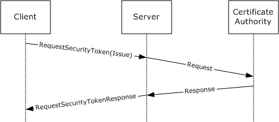
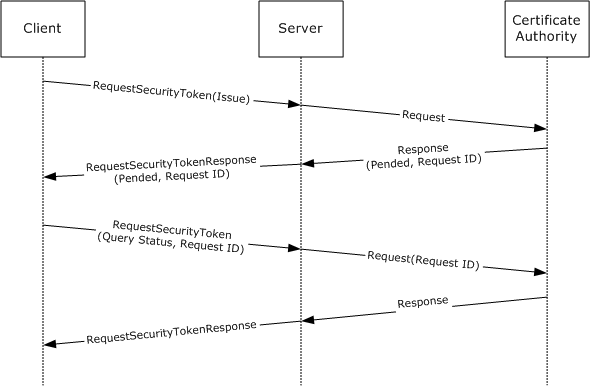
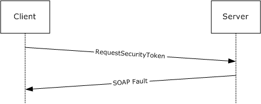
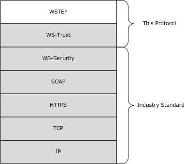
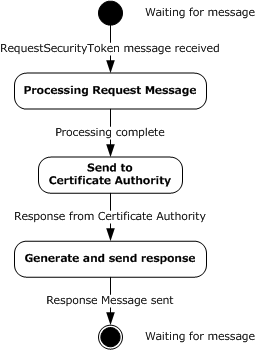

# [MS-WSTEP]: WS-Trust X.509v3 Token Enrollment Extensions

Table of Contents

1 Introduction

- [1 Introduction](#Section_1)
  - [1.1 Glossary](#Section_1.1)
  - [1.2 References](#Section_1.2)
    - [1.2.1 Normative References](#Section_1.2.1)
    - [1.2.2 Informative References](#Section_1.2.2)
  - [1.3 Overview](#Section_1.3)
  - [1.4 Relationship to Other Protocols](#Section_1.4)
  - [1.5 Prerequisites/Preconditions](#Section_1.5)
  - [1.6 Applicability Statement](#Section_1.6)
  - [1.7 Versioning and Capability Negotiation](#Section_1.7)
  - [1.8 Vendor-Extensible Fields](#Section_1.8)
  - [1.9 Standards Assignments](#Section_1.9)

2 Messages

- [2 Messages](#Section_2)
  - [2.1 Transport](#Section_2.1)
  - [2.2 Common Message Syntax](#Section_2.2)
    - [2.2.1 Namespaces](#Section_2.2.1)
    - [2.2.2 Messages](#Section_2.2.2)
    - [2.2.3 Elements](#Section_2.2.3)
    - [2.2.4 Complex Types](#Section_2.2.4)
    - [2.2.5 Simple Types](#Section_2.2.5)
    - [2.2.6 Attributes](#Section_2.2.6)
    - [2.2.7 Groups](#Section_2.2.7)
    - [2.2.8 Attribute Groups](#Section_2.2.8)

3 Protocol Details

- [3 Protocol Details](#Section_3)
  - [3.1 SecurityTokenService Server Details](#Section_3.1)
    - [3.1.1 Abstract Data Model](#Section_3.1.1)
      - [3.1.1.1 Authentication](#Section_3.1.1.1)
        - [3.1.1.1.1 Kerberos Authentication](#Section_3.1.1.1.1)
        - [3.1.1.1.2 X.509v3 Certificate Authentication](#Section_3.1.1.1.2)
        - [3.1.1.1.3 Username and Password Authentication](#Section_3.1.1.1.3)
        - [3.1.1.1.4 No (Anonymous) Authentication](#Section_3.1.1.1.4)
    - [3.1.2 Timers](#Section_3.1.2)
    - [3.1.3 Initialization](#Section_3.1.3)
    - [3.1.4 Message Processing Events and Sequencing Rules](#Section_3.1.4)
      - [3.1.4.1 wst:RequestSecurityToken2](#Section_3.1.4.1)
        - [3.1.4.1.1 Messages](#Section_3.1.4.1.1)
          - [3.1.4.1.1.1 wst:RequestSecurityTokenMsg](#Section_3.1.4.1.1.1)
          - [3.1.4.1.1.2 wst:RequestSecurityTokenResponseCollectionMsg](#Section_3.1.4.1.1.2)
        - [3.1.4.1.2 Elements](#Section_3.1.4.1.2)
          - [3.1.4.1.2.1 wstep:CertificateEnrollmentWSDetail](#Section_3.1.4.1.2.1)
          - [3.1.4.1.2.2 DispositionMessage](#Section_3.1.4.1.2.2)
          - [3.1.4.1.2.3 wst:KeyExchangeToken](#Section_3.1.4.1.2.3)
          - [3.1.4.1.2.4 RequestID](#Section_3.1.4.1.2.4)
          - [3.1.4.1.2.5 wst:RequestSecurityToken](#Section_3.1.4.1.2.5)
          - [3.1.4.1.2.6 RequestSecurityTokenResponseCollection](#Section_3.1.4.1.2.6)
          - [3.1.4.1.2.7 wst:RequestType](#Section_3.1.4.1.2.7)
          - [3.1.4.1.2.8 wst:TokenType](#Section_3.1.4.1.2.8)
        - [3.1.4.1.3 Complex Types](#Section_3.1.4.1.3)
          - [3.1.4.1.3.1 DispositionMessageType](#Section_3.1.4.1.3.1)
          - [3.1.4.1.3.2 wst:RequestedSecurityTokenType](#Section_3.1.4.1.3.2)
          - [3.1.4.1.3.3 wst:RequestSecurityTokenType](#Section_3.1.4.1.3.3)
          - [3.1.4.1.3.4 wst:RequestSecurityTokenResponseType](#Section_3.1.4.1.3.4)
          - [3.1.4.1.3.5 wst:RequestSecurityTokenResponseCollectionType](#Section_3.1.4.1.3.5)
          - [3.1.4.1.3.6 wst:RequestTypeEnum](#Section_3.1.4.1.3.6)
          - [3.1.4.1.3.7 wstep:CertificateEnrollmentWSDetailType](#Section_3.1.4.1.3.7)
        - [3.1.4.1.4 Attributes](#Section_3.1.4.1.4)
      - [3.1.4.2 Processing Rules](#Section_3.1.4.2)
        - [3.1.4.2.1 WSTEP Action: Request Security Token Processing Rules](#Section_3.1.4.2.1)
          - [3.1.4.2.1.1 New and Renewal Request Processing](#Section_3.1.4.2.1.1)
          - [3.1.4.2.1.2 QueryTokenStatus Request Processing](#Section_3.1.4.2.1.2)
        - [3.1.4.2.2 KET Action: Request Security Token Processing Rules](#Section_3.1.4.2.2)
          - [3.1.4.2.2.1 Key Exchange Token Request Processing](#Section_3.1.4.2.2.1)
    - [3.1.5 Timer Events](#Section_3.1.5)
    - [3.1.6 Other Local Events](#Section_3.1.6)

4 Protocol Examples

- [4 Protocol Examples](#Section_4)
  - [4.1 RequestSecurityToken Request/Response Message Sequence](#Section_4.1)
    - [4.1.1 Standard Certificate Request](#Section_4.1.1)
      - [4.1.1.1 RequestSecurityToken Message (Issue Request)](#Section_4.1.1.1)
      - [4.1.1.2 Server RequestSecurityToken Response](#Section_4.1.1.2)
    - [4.1.2 Key Exchange Token Request](#Section_4.1.2)
      - [4.1.2.1 Client Exchange Token Request](#Section_4.1.2.1)
      - [4.1.2.2 Server Key Exchange Token Response](#Section_4.1.2.2)
    - [4.1.3 Retrieval of a previously pended certificate request with Query Token Status](#Section_4.1.3)
      - [4.1.3.1 Client Request](#Section_4.1.3.1)
    - [4.1.4 Message exchange with a server fault](#Section_4.1.4)
      - [4.1.4.1 Client Request](#Section_4.1.4.1)
      - [4.1.4.2 Server Fault Response](#Section_4.1.4.2)
    - [4.1.5 Certificate Renewal](#Section_4.1.5)
      - [4.1.5.1 Client Renewal Request](#Section_4.1.5.1)
      - [4.1.5.2 Server Request Security Token Response](#Section_4.1.5.2)

5 Security

- [5 Security](#Section_5)
  - [5.1 Security Considerations for Implementers](#Section_5.1)
  - [5.2 Index of Security Parameters](#Section_5.2)

6 Appendix A: Full WSDL

- [6 Appendix A: Full WSDL](#Section_6)

7 Appendix B: Product Behavior

- [7 Appendix B: Product Behavior](#Section_7)

8 Change Tracking

- [8 Change Tracking](#Section_8)

For the legal notice and IP terms, see [LEGAL.md](../LEGAL.md).
Last updated: 4/23/2024.
See [Revision History](#revision-history) for full version history.

# 1 Introduction

The WS-Trust X.509v3 Token Enrollment Extensions are extensions of WS-Trust that are used by a system to request that a [**certificate**](#gt_certificate) be issued.

The communication is initiated by a requesting client who requests a new certificate, retrieval of an issued certificate, or retrieval of a server certificate. The server processes the request and generates a response based on the request type.

Sections 1.5, 1.8, 1.9, 2, and 3 of this specification are normative. All other sections and examples in this specification are informative.

## 1.1 Glossary

This document uses the following terms:

**Abstract Syntax Notation One (ASN.1)**: A notation to define complex data types to carry a message, without concern for their binary representation, across a network. ASN.1 defines an encoding to specify the data types with a notation that does not necessarily determine the representation of each value. ASN.1 encoding rules are sets of rules used to transform data that is specified in the ASN.1 language into a standard format that can be decoded on any system that has a decoder based on the same set of rules. ASN.1 and its encoding rules were once part of the same standard. They have since been separated, but it is still common for the terms ASN.1 and Basic Encoding Rules (BER) to be used to mean the same thing, though this is not the case. Different encoding rules can be applied to a given ASN.1 definition. The choice of encoding rules used is an option of the protocol designer. ASN.1 is described in the following specifications: [[ITUX660]](https://go.microsoft.com/fwlink/?LinkId=89922) for general procedures; [[ITUX680]](https://go.microsoft.com/fwlink/?LinkId=89923) for syntax specification; [[ITUX690]](https://go.microsoft.com/fwlink/?LinkId=89924) for the Basic Encoding Rules (BER), Canonical Encoding Rules (CER), and Distinguished Encoding Rules (DER) encoding rules; and [[ITUX691]](https://go.microsoft.com/fwlink/?LinkId=192078) for the Packed Encoding Rules (PER). Further background information on ASN.1 is also available in [DUBUISSON].

**certificate**: When referring to X.509v3 certificates, that information consists of a public key, a distinguished name (DN) of some entity assumed to have control over the private key corresponding to the public key in the certificate, and some number of other attributes and extensions assumed to relate to the entity thus referenced. Other forms of certificates can bind other pieces of information.

**Certificate Management Messages over CMS (CMC)**: An internet standard for transport mechanisms for CMS [[RFC2797]](https://go.microsoft.com/fwlink/?LinkId=90382).

**certification authority (CA)**: A third party that issues public key certificates. Certificates serve to bind public keys to a user identity. Each user and certification authority (CA) can decide whether to trust another user or CA for a specific purpose, and whether this trust is to be transitive. For more information, see [[RFC3280]](https://go.microsoft.com/fwlink/?LinkId=90414).

**Hypertext Transfer Protocol Secure (HTTPS)**: An extension of HTTP that securely encrypts and decrypts web page requests. In some older protocols, "Hypertext Transfer Protocol over Secure Sockets Layer" is still used (Secure Sockets Layer has been deprecated). For more information, see [[SSL3]](https://go.microsoft.com/fwlink/?LinkId=90534) and [[RFC5246]](https://go.microsoft.com/fwlink/?LinkId=129803).

**Public Key Cryptography Standards (PKCS)**: A group of Public Key Cryptography Standards published by RSA Laboratories.

**security token service (STS)**: A special type of server defined in WS-Trust [[WSTrust1.3]](https://go.microsoft.com/fwlink/?LinkId=131548).

**SOAP action**: The HTTP request header field used to indicate the intent of the SOAP request, using a URI value. See [[SOAP1.1]](https://go.microsoft.com/fwlink/?LinkId=90520) section 6.1.1 for more information.

**SOAP fault**: A container for error and status information within a [**SOAP message**](#gt_soap-message). See [[SOAP1.2-1/2007]](https://go.microsoft.com/fwlink/?LinkId=94664) section 5.4 for more information.

**SOAP message**: An [**XML**](#gt_xml) document consisting of a mandatory SOAP envelope, an optional SOAP header, and a mandatory SOAP body. See [SOAP1.2-1/2007] section 5 for more information.

**Unicode**: A character encoding standard developed by the Unicode Consortium that represents almost all of the written languages of the world. The [**Unicode**](#gt_unicode) standard [[UNICODE5.0.0/2007]](https://go.microsoft.com/fwlink/?LinkId=154659) provides three forms (UTF-8, UTF-16, and UTF-32) and seven schemes (UTF-8, UTF-16, UTF-16 BE, UTF-16 LE, UTF-32, UTF-32 LE, and UTF-32 BE).

**Web Services Description Language (WSDL)**: An XML format for describing network services as a set of endpoints that operate on messages that contain either document-oriented or procedure-oriented information. The operations and messages are described abstractly and are bound to a concrete network protocol and message format in order to define an endpoint. Related concrete endpoints are combined into abstract endpoints, which describe a network service. WSDL is extensible, which allows the description of endpoints and their messages regardless of the message formats or network protocols that are used.

**X.509**: An ITU-T standard for public key infrastructure subsequently adapted by the IETF, as specified in [RFC3280].

**XML**: The Extensible Markup Language, as described in [[XML1.0]](https://go.microsoft.com/fwlink/?LinkId=90599).

**XML namespace**: A collection of names that is used to identify elements, types, and attributes in XML documents identified in a URI reference [[RFC3986]](https://go.microsoft.com/fwlink/?LinkId=90453). A combination of XML namespace and local name allows XML documents to use elements, types, and attributes that have the same names but come from different sources. For more information, see [[XMLNS-2ED]](https://go.microsoft.com/fwlink/?LinkId=90602).

**XML Schema (XSD)**: A language that defines the elements, attributes, namespaces, and data types for [**XML**](#gt_xml) documents as defined by [[XMLSCHEMA1/2]](https://go.microsoft.com/fwlink/?LinkId=90607) and [[XMLSCHEMA2/2]](https://go.microsoft.com/fwlink/?LinkId=90609) standards. An XML schema uses [**XML**](#gt_xml) syntax for its language.

**MAY, SHOULD, MUST, SHOULD NOT, MUST NOT:** These terms (in all caps) are used as defined in [[RFC2119]](https://go.microsoft.com/fwlink/?LinkId=90317). All statements of optional behavior use either MAY, SHOULD, or SHOULD NOT.

## 1.2 References

Links to a document in the Microsoft Open Specifications library point to the correct section in the most recently published version of the referenced document. However, because individual documents in the library are not updated at the same time, the section numbers in the documents may not match. You can confirm the correct section numbering by checking the [Errata](https://go.microsoft.com/fwlink/?linkid=850906).

### 1.2.1 Normative References

We conduct frequent surveys of the normative references to assure their continued availability. If you have any issue with finding a normative reference, please contact [dochelp@microsoft.com](mailto:dochelp@microsoft.com). We will assist you in finding the relevant information.

[MS-WCCE] Microsoft Corporation, "[Windows Client Certificate Enrollment Protocol](../MS-WCCE/MS-WCCE.md)".

[RFC2119] Bradner, S., "Key words for use in RFCs to Indicate Requirement Levels", BCP 14, RFC 2119, March 1997, [https://www.rfc-editor.org/info/rfc2119](https://go.microsoft.com/fwlink/?LinkId=90317)

[RFC2797] Myers, M., Liu, X., Schaad, J., and Weinstein, J., "Certificate Management Messages Over CMS", RFC 2797, April 2000, [http://www.rfc-editor.org/info/rfc2797](https://go.microsoft.com/fwlink/?LinkId=90382)

[RFC2986] Nystrom, M. and Kaliski, B., "PKCS#10: Certificate Request Syntax Specification", RFC 2986, November 2000, [http://www.rfc-editor.org/info/rfc2986](https://go.microsoft.com/fwlink/?LinkId=90401)

[RFC3066] Alvestrand, H., "Tags for the Identification of Languages", BCP 47, RFC 3066, January 2001, [https://www.rfc-editor.org/info/rfc3066](https://go.microsoft.com/fwlink/?LinkId=90404)

[RFC3852] Housley, R., "Cryptographic Message Syntax (CMS)", RFC 3852, July 2004, [https://www.rfc-editor.org/info/rfc3852](https://go.microsoft.com/fwlink/?LinkId=90445)

[RFC5246] Dierks, T., and Rescorla, E., "The Transport Layer Security (TLS) Protocol Version 1.2", RFC 5246, August 2008, [https://www.rfc-editor.org/info/rfc5246](https://go.microsoft.com/fwlink/?LinkId=129803)

[RFC5280] Cooper, D., Santesson, S., Farrell, S., et al., "Internet X.509 Public Key Infrastructure Certificate and Certificate Revocation List (CRL) Profile", RFC 5280, May 2008, [https://www.rfc-editor.org/info/rfc5280](https://go.microsoft.com/fwlink/?LinkId=131034)

[WSDL] Christensen, E., Curbera, F., Meredith, G., and Weerawarana, S., "Web Services Description Language (WSDL) 1.1", W3C Note, March 2001, [https://www.w3.org/TR/2001/NOTE-wsdl-20010315](https://go.microsoft.com/fwlink/?LinkId=90577)

[WSSUTP] OASIS, "Web Services Security UsernameToken Profile 1.0", OASIS Standard, March 2004, [http://docs.oasis-open.org/wss/2004/01/oasis-200401-wss-username-token-profile-1.0.pdf](https://go.microsoft.com/fwlink/?LinkId=130733)

[WSS] OASIS, "Web Services Security: SOAP Message Security 1.1 (WS-Security 2004)", February 2006, [https://www.oasis-open.org/committees/download.php/16790/wss-v1.1-spec-os-SOAPMessageSecurity.pdf](https://go.microsoft.com/fwlink/?LinkId=130727)

[WSTrust1.3Schema] OASIS Standard, "WS-Trust 1.3", [http://docs.oasis-open.org/ws-sx/ws-trust/200512/ws-trust-1.3.xsd](https://go.microsoft.com/fwlink/?LinkId=177976)

[WSTrust1.3] Lawrence, K., Kaler, C., Nadalin, A., et al., "WS-Trust 1.3", OASIS Standard March 2007, [https://docs.oasis-open.org/ws-sx/ws-trust/200512/ws-trust-1.3-os.html](https://go.microsoft.com/fwlink/?LinkId=131548)

[XMLNS] Bray, T., Hollander, D., Layman, A., et al., Eds., "Namespaces in XML 1.0 (Third Edition)", W3C Recommendation, December 2009, [https://www.w3.org/TR/2009/REC-xml-names-20091208/](https://go.microsoft.com/fwlink/?LinkId=191840)

[XMLSCHEMA1] Thompson, H., Beech, D., Maloney, M., and Mendelsohn, N., Eds., "XML Schema Part 1: Structures", W3C Recommendation, May 2001, [https://www.w3.org/TR/2001/REC-xmlschema-1-20010502/](https://go.microsoft.com/fwlink/?LinkId=90608)

[XMLSCHEMA2] Biron, P.V., Ed. and Malhotra, A., Ed., "XML Schema Part 2: Datatypes", W3C Recommendation, May 2001, [https://www.w3.org/TR/2001/REC-xmlschema-2-20010502/](https://go.microsoft.com/fwlink/?LinkId=90610)

### 1.2.2 Informative References

[DUBUISSON] Dubuisson, O., "ASN.1 Communication between Heterogeneous Systems", Morgan Kaufmann, October 2000, ISBN: 0126333610.

[SCEP] Nourse, A., and Vilhuber, J. Ed., "Cisco Systems' Simple Certificate Enrollment Protocol", April 2009, [http://tools.ietf.org/html/draft-nourse-scep-19](https://go.microsoft.com/fwlink/?LinkId=166315)

## 1.3 Overview

The WS-Trust X.509v3 Token Enrollment Extensions (WSTEP) defines the token enrollment profile for WS-Trust [[WSTrust1.3]](https://go.microsoft.com/fwlink/?LinkId=131548) to allow a client to request [**X.509v3**](#gt_2069b65d-b546-4198-abfd-768badc2258e) [**certificates**](#gt_certificate).

Existing [**certificate authorities (CAs)**](#gt_c925d5d7-a442-4ba4-9586-5f94ccec847a) support [**Abstract Syntax Notation One (ASN.1)**](#gt_abstract-syntax-notation-one-asn1) formats such as [**PKCS**](#gt_public-key-cryptography-standards-pkcs)#10 ([[RFC2986]](https://go.microsoft.com/fwlink/?LinkId=90401)), PKCS#7 ([[RFC3852]](https://go.microsoft.com/fwlink/?LinkId=90445)), or [**CMC**](#gt_certificate-management-messages-over-cms-cmc) ([[RFC2797]](https://go.microsoft.com/fwlink/?LinkId=90382)) to encode a certificate request, and those requests are carried in an existing protocol, such as Windows Client Certificate Enrollment Protocol [MS-WCCE](../MS-WCCE/MS-WCCE.md) or Cisco's SCEP ([[SCEP]](https://go.microsoft.com/fwlink/?LinkId=166315)). WSTEP also carries those requests from the client to the issuer.

WSTEP provides for issuance, renewal, and delayed-issuance scenarios for X.509v3 digital certificates. The server is known in WS-Trust [WSTrust1.3] terminology as a [**Security Token Service (STS)**](#gt_security-token-service-sts).

The WS-Trust protocol [WSTrust1.3] definition provides the framework for the STS and for enrollment profile extensions. A typical client interacts with a STS with a request security token (RST) message. The STS responds to a client request security token message with a request security token response (RSTR) or a [**SOAP fault**](#gt_soap-fault).

Figure 1: Typical sequence for certificate enrollment

The following figure shows a scenario in which a request cannot be satisfied immediately. In this scenario, the client makes a request, and the server reply indicates that the request is pending some other action. The client then queries the request at a later time, presumably after any conditions for its satisfaction have been met, and receives a reply that the request was issued, rejected, or is still pending.

Figure 2: Typical sequence for a pended certificate enrollment request

In some circumstances, the client request could be rejected. In these instances, the STS responds with a SOAP fault. The following figure shows the typical sequence.

Figure 3: Typical sequence for a rejected certificate renewal request

The following figure is an example of a message exchange for a renewal request. A renewal request uses an existing certificate and requests a new lifespan. From the point of view of the WSTEP protocol, this is the same as an issue request, as the message format is unchanged.

Figure 4: Typical sequence for a certificate renewal request

## 1.4 Relationship to Other Protocols

The following figure shows the WSTEP Protocol stack diagram.

Figure 5: WSTEP Protocol stack diagram

The WSTEP protocol specification is a profile of the WS-Trust Protocol [[WSTrust1.3]](https://go.microsoft.com/fwlink/?LinkId=131548) and makes use of the SOAP and [**Hypertext Transfer Protocol over Secure Sockets Layer (HTTPS)**](#gt_hypertext-transfer-protocol-secure-https) protocols for messaging and security.

## 1.5 Prerequisites/Preconditions

The WSTEP protocol specification facilitates the issuance of [**X.509v3**](#gt_2069b65d-b546-4198-abfd-768badc2258e) [**certificates**](#gt_certificate). A server implementation of the protocol requires the functionality of a [**certificate authority**](#gt_c925d5d7-a442-4ba4-9586-5f94ccec847a), capable of interpreting requests in at least one of [**PKCS**](#gt_public-key-cryptography-standards-pkcs)#7, PKCS#10, or [**Certificate Management Messages over CMS (CMC)**](#gt_certificate-management-messages-over-cms-cmc).

## 1.6 Applicability Statement

The WSTEP protocol specification is applicable only for requests for [**X.509v3**](#gt_2069b65d-b546-4198-abfd-768badc2258e) [**certificates**](#gt_certificate).

## 1.7 Versioning and Capability Negotiation

The WSTEP protocol specification does not include versioning and capability negotiation.

## 1.8 Vendor-Extensible Fields

The WSTEP protocol specification does not include any vendor-extensible fields. WSTEP adheres to the WS-Trust 1.3 [[WSTrust1.3]](https://go.microsoft.com/fwlink/?LinkId=131548) provided extension points.

## 1.9 Standards Assignments

None.

# 2 Messages

## 2.1 Transport

SOAP version 1.2 MUST be used for messaging for the WSTEP protocol. [**HTTPS**](#gt_hypertext-transfer-protocol-secure-https) protocol MUST be used as the transport.

## 2.2 Common Message Syntax

This section contains common definitions used by this protocol. The syntax of the definitions uses the [**XML**](#gt_xml) schema as defined in [[XMLSCHEMA1]](https://go.microsoft.com/fwlink/?LinkId=90608) and [[XMLSCHEMA2]](https://go.microsoft.com/fwlink/?LinkId=90610), and the [**Web Services Description Language (WSDL)**](#gt_web-services-description-language-wsdl) as defined in [[WSDL]](https://go.microsoft.com/fwlink/?LinkId=90577).

### 2.2.1 Namespaces

This specification defines and references various [**XML namespaces**](#gt_xml-namespace), using the mechanisms specified in [[XMLNS]](https://go.microsoft.com/fwlink/?LinkId=191840). Although this specification associates a specific XML namespace prefix for each XML namespace that is used, the choice of any particular XML namespace prefix is implementation-specific and not significant for interoperability.

Prefixes and XML namespaces used in this specification are as follows.

| Prefix | Namespace URI | Reference |
| --- | --- | --- |
| xs | http://www.w3.org/2001/XMLSchema | [[XMLSCHEMA1]](https://go.microsoft.com/fwlink/?LinkId=90608) |
| wst | http://docs.oasis-open.org/ws-sx/ws-trust/200512 | [[WSTrust1.3]](https://go.microsoft.com/fwlink/?LinkId=131548) |
| auth | http://schemas.xmlsoap.org/ws/2006/12/authorization | [XMLSCHEMA1] |
| wsu | http://docs.oasis-open.org/wss/2004/01/oasis-200401-wss-wssecurity-utility-1.0.xsd | - |
| wsse | http://docs.oasis-open.org/wss/2004/01/oasis-200401-wss-wssecurity-secext-1.0.xsd | - |
| wstep | http://schemas.microsoft.com/windows/pki/2009/01/enrollment | This document |

### 2.2.2 Messages

None.

### 2.2.3 Elements

This specification does not define any common XML schema element definitions.

### 2.2.4 Complex Types

This specification does not define any common XML schema complex type definitions.

### 2.2.5 Simple Types

The WSTEP protocol specification does not define any common XML schema simple type definitions.

### 2.2.6 Attributes

The WSTEP protocol specification does not define any common XML schema attribute definitions.

### 2.2.7 Groups

The WSTEP protocol specification does not define any common XML schema group definitions.

### 2.2.8 Attribute Groups

The WSTEP protocol specification does not define any common XML schema attribute group definitions.

# 3 Protocol Details

The client side of this protocol is a simple pass-through. No additional timers or other state is required on the client side of this protocol. Calls made by the higher-layer protocol or application are passed directly to the transport layer, and the results returned by the transport are passed directly back to the higher-layer protocol or application.

This section addresses the message processing model for the protocol. It includes related information required by an implementation to successfully send and consume protocol messages.

## 3.1 SecurityTokenService Server Details

The **SecurityTokenService** hosts a message endpoint that receives **RequestSecurityToken** messages. When received, the server processes the client request and sends it to the [**certificate authority**](#gt_c925d5d7-a442-4ba4-9586-5f94ccec847a). Upon receiving a response from the certificate authority, a response is generated, and the server sends either a **RequestSecurityTokenResponse** message or a [**SOAP fault**](#gt_soap-fault). When the message has been sent to the client, the server returns to the waiting state.

Figure 6: Security token service state model

The items of information that are communicated between the server and the certificate authority are specified in this section, but the method of communication used, including timeout and error handling (local API, local remote procedure call (RPC), or some other protocol) is not specified.

The certificate authority MAY have additional requirements that MUST be met in order to issue an [**X.509v3**](#gt_2069b65d-b546-4198-abfd-768badc2258e) [**certificate**](#gt_certificate), such as manager approval, payment processing, or validation of request information. In these instances, a certificate authority response indicating the issuance is pending.

### 3.1.1 Abstract Data Model

A server supporting the WSTEP protocol maintains a relationship to an issuer which processes messages submitted by the server. When communicating with requestors, a server can support a variety of languages.

**Issuer:** An address of a [**certificate authority (CA)**](#gt_c925d5d7-a442-4ba4-9586-5f94ccec847a). The format of the stored address is specific to the implementation and to the form of communication used between the Issuer and the Server.

**SupportedLanguages:** A list of language identifiers supported by the server. The set of languages are of type xml:lang and defined in [[RFC3066]](https://go.microsoft.com/fwlink/?LinkId=90404).

**DefaultLanguage:** The default language for the server. DefaultLanguage is of type xml:lang, and the set of supported languages is defined in [RFC3066].

#### 3.1.1.1 Authentication

The WS-Trust X.509v3 Token Enrollment Extensions use the authentication provisions in WS-Security ([[WSS]](https://go.microsoft.com/fwlink/?LinkId=130727)) for the [**X.509v3**](#gt_2069b65d-b546-4198-abfd-768badc2258e) Security Token issuer to authenticate the X.509v3 Security Token requestor. This section defines the schema used to express the credential descriptor for each supported credential type.

##### 3.1.1.1.1 Kerberos Authentication

Authentication using Kerberos is done at the transport layer.

##### 3.1.1.1.2 X.509v3 Certificate Authentication

Authentication using [**X.509v3**](#gt_2069b65d-b546-4198-abfd-768badc2258e) [**certificates**](#gt_certificate) is done at the transport level using Transport Level Security (TLS) 1.2 as defined in [[RFC5246]](https://go.microsoft.com/fwlink/?LinkId=129803).

##### 3.1.1.1.3 Username and Password Authentication

The username and password credential is provided in a request message using the WS-Security Username Token Profile 1.0. The username is provided as defined in section 3.1 of the Ws-Security document [[WSSUTP]](https://go.microsoft.com/fwlink/?LinkId=130733).

##### 3.1.1.1.4 No (Anonymous) Authentication

If no authentication is provided at either the transport layer or the message layer, the request is considered to be anonymous. Anonymous authentication is supported only for renewal requests, where the signature from the existing [**certificate**](#gt_certificate) on the request object serves as authentication for the [**X.509v3**](#gt_2069b65d-b546-4198-abfd-768badc2258e) Security Token requestor.

### 3.1.2 Timers

None.

### 3.1.3 Initialization

The *SupportedLanguages* object MUST be initialized with the set of languages that the server supports.

The *DefaultLanguage* parameter MUST be initialized with the language that is to be used by the server when a request does not define a language preference, or the preference is not in *SupportedLanguages*.<1>

### 3.1.4 Message Processing Events and Sequencing Rules

| Operation | Description |
| --- | --- |
| [wst:RequestSecurityToken2](#Section_1.3) | The wst:RequestSecurityToken2 operation is the sole operation in the WSTEP protocol. It provides the mechanism for [**certificate**](#gt_certificate) enrollment requests, retrieval of pending certificate status, and the request of the server key exchange certificate. The wst:RequestSecurityToken2 operation is defined in WS-Trust 1.3 [[WSTrust1.3]](https://go.microsoft.com/fwlink/?LinkId=131548). |

#### 3.1.4.1 wst:RequestSecurityToken2

The wst:RequestSecurityToken2 operation provides the mechanism for [**certificate**](#gt_certificate) enrollment requests, retrieval of pending certificate status, and the request of the server key exchange certificate. The wst:SecurityTokenService port and wst:RequestSecurityToken2 operation are defined in the [[WSTrust1.3]](https://go.microsoft.com/fwlink/?LinkId=131548) [**WSDL**](#gt_web-services-description-language-wsdl) wsdl:portType definition.

<wsdl:operation name="RequestSecurityToken2">

<wsdl:input message="wst:RequestSecurityTokenMsg" />

<wsdl:output message="wst:RequestSecurityTokenResponseCollectionMsg" />

</wsdl:operation>

WSTEP makes use of the wst:RequestSecurityToken2 operation. The wst:RequestSecurityToken operation defined in the SecurityTokenService operation is not used. The **wst:RequestSecurityTokenMsg** message consists of a single object definition: the client request. The client request is made using the acceptable [**SOAP actions**](#gt_soap-action) as defined in section [3.1.4.2](#Section_3.1.4.2) and RequestType values, as defined in section [3.1.4.1.2.7](#Section_3.1.4.1.2.7).

##### 3.1.4.1.1 Messages

The following [**WSDL**](#gt_web-services-description-language-wsdl) message definitions are specific to this operation.

###### 3.1.4.1.1.1 wst:RequestSecurityTokenMsg

The wst:RequestSecurityTokenMsg is an incoming message, and is defined in WS-Trust 1.3 [[WSTrust1.3]](https://go.microsoft.com/fwlink/?LinkId=131548) [**WSDL**](#gt_web-services-description-language-wsdl).

**wst:RequestSecurityToken:** An instance of a **wst:RequestSecurityTokenType** complex type as defined in section [3.1.4.1.3.3](#Section_3.1.4.1.3.3). The **wst:RequestSecurityToken** element defines the client request and the required information for it to be processed.

###### 3.1.4.1.1.2 wst:RequestSecurityTokenResponseCollectionMsg

The wst:RequestSecurityTokenResponseCollectionMsg is an outgoing message, and is defined in WS-Trust 1.3 [[WSTrust1.3]](https://go.microsoft.com/fwlink/?LinkId=131548) [**WSDL**](#gt_web-services-description-language-wsdl).

**wst:RequestSecurityTokenResponseCollectionMsg:** An instance of a **wst:RequestSecurityTokenResponseCollection** element as defined in section [3.1.4.1.2.6](#Section_3.1.4.1.2.6). This element contains the results of the client request.

##### 3.1.4.1.2 Elements

###### 3.1.4.1.2.1 wstep:CertificateEnrollmentWSDetail

The **wstep:CertificateEnrollmentWSDetail** element is used to convey additional information to a client as part of the [**SOAP fault**](#gt_soap-fault) structure when a server returns a SOAP fault.

<xs:element name="CertificateEnrollmentWSDetail" nillable="true" type="wstep:CertificateEnrollmentWSDetailType" />

**wstep:CertificateEnrollmentWSDetail**: An instance of a <wstep:CertificateEnrollmentWSDetailType> as defined in section [3.1.4.1.3.7](#Section_3.1.4.1.3.7). If there is no additional information, the **wstep:CertificateEnrollmentWSDetail** SHOULD be omitted in the SOAP fault.

###### 3.1.4.1.2.2 DispositionMessage

<xs:element name="DispositionMessage"

type="wstep:DispositionMessageType" nillable="true" />

**DispositionMessage:** An instance of a DispositionMessageType object as defined in section [3.1.4.1.3.1](#Section_3.1.4.1.3.1).

###### 3.1.4.1.2.3 wst:KeyExchangeToken

The <wst:KeyExchangeToken> element is defined in WS-Trust 1.3 [[WSTrust1.3]](https://go.microsoft.com/fwlink/?LinkId=131548) section 8.4.

**wst:KeyExchangeToken**: The wst:KeyExchangeToken element provides a key exchange token that can be used in [**certificate**](#gt_certificate) enrollment requests that include the private key.

###### 3.1.4.1.2.4 RequestID

<xs:element name="RequestID"

type="xs:string" nillable="true"/>

**RequestID:** A string identifier used to identify a request.

###### 3.1.4.1.2.5 wst:RequestSecurityToken

The <wst:RequestSecurityToken> element is defined in WS-Trust 1.3 [[WSTrust1.3]](https://go.microsoft.com/fwlink/?LinkId=131548), section 3.1.

**wst:RequestSecurityToken:** An instance of a **wst:RequestSecurityTokenType** object as specified in section [3.1.4.1.3.3](#Section_3.1.4.1.3.3).

###### 3.1.4.1.2.6 RequestSecurityTokenResponseCollection

The RequestSecurityTokenResponseCollection is defined in WS-Trust 1.3 [[WSTrust1.3]](https://go.microsoft.com/fwlink/?LinkId=131548), section 3.2.

**RequestSecurityTokenResponseCollection:** An instance of a **wst:RequestSecurityTokenResponseCollectionType** object as specified in section [3.1.4.1.3.5](#Section_3.1.4.1.3.5).

###### 3.1.4.1.2.7 wst:RequestType

The <wst:RequestType> element is defined in [[WSTrust1.3]](https://go.microsoft.com/fwlink/?LinkId=131548) section 3.1.

**wst:RequestType:** An instance of a <wst:RequestTypeOpenEnum> object as defined in [WSTrust1.3] XML schema definition (XSD).

The <wst:RequestType> MUST have one of the following values:

"http://docs.oasis-open.org/ws-sx/ws-trust/200512/Issue"

"http://schemas.microsoft.com/windows/pki/2009/01/enrollment/QueryTokenStatus"

"http://docs.oasis-open.org/ws-sx/ws-trust/200512/KET"

If the <wst:RequestType> has any other value, the server MUST respond with a [**SOAP fault**](#gt_soap-fault).

###### 3.1.4.1.2.8 wst:TokenType

The <TokenType> element is defined in [[WSTrust1.3]](https://go.microsoft.com/fwlink/?LinkId=131548), section 3.1.

**wst:TokenType:** For the [**X.509v3**](#gt_2069b65d-b546-4198-abfd-768badc2258e) enrollment extension to WS-Trust, the <wst:tokentype> element MUST be http://docs.oasis-open.org/wss/2004/01/oasis-200401-wss-x509-token-profile-1.0#X509v3.

##### 3.1.4.1.3 Complex Types

The following XML schema complex type definitions are specific to this operation.

###### 3.1.4.1.3.1 DispositionMessageType

The DispositionMessageType is an extension to the string type that allows an attribute definition of the language for the string. The DispositionMessageType is used to provide additional information about the server processing.

<xs:complexType name="DispositionMessageType">

<xs:simpleContent>

<xs:extension base="xs:string">

<xs:attribute ref="xml:lang" use="optional" />

</xs:extension>

</xs:simpleContent>

</xs:complexType>

**xs:string:** The string element contains the literal string disposition message returned from the server. The string element contains an xml:lang attribute that defines the language for the string. The language SHOULD be provided for each string element instance.

**xml:lang:** The language reference xml:lang, indicating the natural or formal language the string element content is written in.

###### 3.1.4.1.3.2 wst:RequestedSecurityTokenType

The wst:RequestedSecurityTokenType is defined in WS-Trust XML schema definition (XSD) [[WSTrust1.3Schema]](https://go.microsoft.com/fwlink/?LinkId=177976).

<xs:complexType name="RequestedSecurityTokenType">

<xs:sequence>

<xs:any namespace="##any" processContents="lax" />

</xs:sequence>

</xs:complexType>

MS-WSTEP extends the wst: RequestedSecurityTokenType with two additional elements as follows.

<xs:element ref="wsse:BinarySecurityToken" />

<xs:element ref="wsse:SecurityTokenReference" />

The server SHOULD<2> include the end entity certificate in the **RequestedSecurityToken** response. The ValueType of the **BinarySecurityToken** element for this **RequestedSecurityToken** response MUST be X509v3 [[RFC5280]](https://go.microsoft.com/fwlink/?LinkId=131034). The server MUST also include a CMC full PKI response in the **RequestSecurityTokenResponseCollection**, as specified in sections 4.2 and 4.3 of [[WSTrust1.3]](https://go.microsoft.com/fwlink/?LinkId=131548).

**wsse:BinarySecurityToken:** The wsse:BinarySecurityToken element contains the issued certificate (2) in either a full CMC response or as a stand-alone x509v3 certificate [RFC5280].

**wsse:SecurityTokenReference:** A URI reference used to indicate where a pended Certificate Request can be retrieved. The server MUST provide its own URI as the value of the <wsse:BinarySecurityTokenReference:Reference> element as specified in [WSTrust1.3] section 4.2.

###### 3.1.4.1.3.3 wst:RequestSecurityTokenType

The **wst:RequestSecurityTokenType** complex type contains the elements for the security token request in the RequestSecurityTokenMsg message. It is the client-provided object for a [**certificate**](#gt_certificate) enrollment request. **wst:RequestSecurityTokenType** is defined in the WS-Trust [[WSTrust1.3]](https://go.microsoft.com/fwlink/?LinkId=131548) XML schema definition (XSD).

<xs:complexType name="RequestSecurityTokenType">

<xs:annotation>

<xs:documentation>

Actual content model is non-deterministic, hence wildcard. The following shows intended content model:

<xs:element ref='wst:TokenType' minOccurs='0' />

<xs:element ref='wst:RequestType' />

<xs:element ref='wsp:AppliesTo' minOccurs='0' />

<xs:element ref='wst:Claims' minOccurs='0' />

<xs:element ref='wst:Entropy' minOccurs='0' />

<xs:element ref='wst:Lifetime' minOccurs='0' />

<xs:element ref='wst:AllowPostdating' minOccurs='0' />

<xs:element ref='wst:Renewing' minOccurs='0' />

<xs:element ref='wst:OnBehalfOf' minOccurs='0' />

<xs:element ref='wst:Issuer' minOccurs='0' />

<xs:element ref='wst:AuthenticationType' minOccurs='0' />

<xs:element ref='wst:KeyType' minOccurs='0' />

<xs:element ref='wst:KeySize' minOccurs='0' />

<xs:element ref='wst:SignatureAlgorithm' minOccurs='0' />

<xs:element ref='wst:Encryption' minOccurs='0' />

<xs:element ref='wst:EncryptionAlgorithm' minOccurs='0' />

<xs:element ref='wst:CanonicalizationAlgorithm' minOccurs='0' />

<xs:element ref='wst:ProofEncryption' minOccurs='0' />

<xs:element ref='wst:UseKey' minOccurs='0' />

<xs:element ref='wst:SignWith' minOccurs='0' />

<xs:element ref='wst:EncryptWith' minOccurs='0' />

<xs:element ref='wst:DelegateTo' minOccurs='0' />

<xs:element ref='wst:Forwardable' minOccurs='0' />

<xs:element ref='wst:Delegatable' minOccurs='0' />

<xs:element ref='wsp:Policy' minOccurs='0' />

<xs:element ref='wsp:PolicyReference' minOccurs='0' />

<xs:any namespace='##other' processContents='lax' minOccurs='0' maxOccurs='unbounded' />

</xs:documentation>

</xs:annotation>

<xs:sequence>

<xs:any namespace="##any" processContents="lax" minOccurs="0" maxOccurs="unbounded" />

</xs:sequence>

<xs:attribute name="Context" type="xs:anyURI" use="optional" />

<xs:anyAttribute namespace="##other" processContents="lax" />

</xs:complexType>

WSTEP extends <wst:RequestSecurityTokenType> with the following elements:

<xs:element ref="wsse:BinarySecurityToken" minOccurs="0"

maxOccurs="1" />

<xs:element ref="auth:AdditionalContext" minOccurs="0"

maxOccurs="1" />

<xs:element ref="wst:RequestKET" minOccurs="0" maxOccurs="1" />

<xs:element ref="wstep:RequestID" minOccurs="0" maxOccurs="1" />

Only the elements specified below are used in WSTEP. Any element received that is not specified below SHOULD be ignored.

**wst:TokenType:** Refers to the wst:TokenType definition in section [3.1.4.1.2.8](#Section_3.1.4.1.2.8).

**wst:RequestType:** Refers to the wst:RequestType definition in section [3.1.4.1.2.7](#Section_3.1.4.1.2.7). The wst:RequestType is used to identify the type of the security token request.

**wst:RequestKET:** Used when requesting a key exchange token as defined in [WSTrust1.3] section 8.4.

**wsse:BinarySecurityToken:** Provides the DER ASN.1 representation of the certificate request. The type of token is defined by the wst:TokenType element. For the [**X.509v3**](#gt_2069b65d-b546-4198-abfd-768badc2258e) enrollment extension the wst:TokenType MUST be specified as in section 3.1.4.1.2.8. The certificate request follows the formatting from [MS-WCCE](../MS-WCCE/MS-WCCE.md) section 2.2.2.6. The EncodingType attribute of the wsse:BinarySecurityToken element MUST be set to base64Binary.

**auth:AdditionalContext:** The auth:AdditionalContext element is used to provide extra information in a wst:RequestSecurityToken message. It is an optional element, and SHOULD be omitted if there is no extra information to be passed.

**wstep:RequestID:** An instance of **wstep:RequestID** as specified in section [3.1.4.1.2.4](#Section_3.1.4.1.2.4).

###### 3.1.4.1.3.4 wst:RequestSecurityTokenResponseType

The wst:RequestSecurityTokenResponseType contains the elements that are part of a server response to a wst:RequestSecurityToken message. wst:RequestSecurityTokenResponseType is defined in the WS-Trust [[WSTrust1.3]](https://go.microsoft.com/fwlink/?LinkId=131548) XML schema definition (XSD).

<xs:complexType name="RequestSecurityTokenResponseType">

<xs:annotation>

<xs:documentation>

Actual content model is non-deterministic, hence wildcard. The following shows intended content model:

<xs:element ref='wst:TokenType' minOccurs='0' />

<xs:element ref='wst:RequestType' />

<xs:element ref='wst:RequestedSecurityToken' minOccurs='0' />

<xs:element ref='wsp:AppliesTo' minOccurs='0' />

<xs:element ref='wst:RequestedAttachedReference' minOccurs='0' />

<xs:element ref='wst:RequestedUnattachedReference' minOccurs='0' />

<xs:element ref='wst:RequestedProofToken' minOccurs='0' />

<xs:element ref='wst:Entropy' minOccurs='0' />

<xs:element ref='wst:Lifetime' minOccurs='0' />

<xs:element ref='wst:Status' minOccurs='0' />

<xs:element ref='wst:AllowPostdating' minOccurs='0' />

<xs:element ref='wst:Renewing' minOccurs='0' />

<xs:element ref='wst:OnBehalfOf' minOccurs='0' />

<xs:element ref='wst:Issuer' minOccurs='0' />

<xs:element ref='wst:AuthenticationType' minOccurs='0' />

<xs:element ref='wst:Authenticator' minOccurs='0' />

<xs:element ref='wst:KeyType' minOccurs='0' />

<xs:element ref='wst:KeySize' minOccurs='0' />

<xs:element ref='wst:SignatureAlgorithm' minOccurs='0' />

<xs:element ref='wst:Encryption' minOccurs='0' />

<xs:element ref='wst:EncryptionAlgorithm' minOccurs='0' />

<xs:element ref='wst:CanonicalizationAlgorithm' minOccurs='0' />

<xs:element ref='wst:ProofEncryption' minOccurs='0' />

<xs:element ref='wst:UseKey' minOccurs='0' />

<xs:element ref='wst:SignWith' minOccurs='0' />

<xs:element ref='wst:EncryptWith' minOccurs='0' />

<xs:element ref='wst:DelegateTo' minOccurs='0' />

<xs:element ref='wst:Forwardable' minOccurs='0' />

<xs:element ref='wst:Delegatable' minOccurs='0' />

<xs:element ref='wsp:Policy' minOccurs='0' />

<xs:element ref='wsp:PolicyReference' minOccurs='0' />

<xs:any namespace='##other' processContents='lax' minOccurs='0' maxOccurs='unbounded' />

</xs:documentation>

</xs:annotation>

<xs:sequence>

<xs:any namespace="##any" processContents="lax" minOccurs="0" maxOccurs="unbounded" />

</xs:sequence>

<xs:attribute name="Context" type="xs:anyURI" use="optional" />

<xs:anyAttribute namespace="##other" processContents="lax" />

</xs:complexType>

WSTEP extends the wst:RequestSecurityTokenResponseType with the following elements:

<xs:element ref="wstep:DispositionMessage" />

<xs:element ref="wsse:BinarySecurityToken" minOccurs="0" maxOccurs="1" />

<xs:element ref="wstep:RequestID" minOccurs="0" maxOccurs="1"

<xs:element ref="wst:KeyExchangeToken" minOccurs="0" maxOccurs="1" />

/>

Only the elements documented as follows are used by WSTEP. Any element received that is not documented as follows SHOULD be ignored.

**wst:TokenType:** Refers to the TokenType definition in section [3.1.4.1.2.8](#Section_3.1.4.1.2.8).

**wstep:DispositionMessage:** Refers to the definition in section [3.1.4.1.2.2](#Section_3.1.4.1.2.2). The wstep:DispositionMessage element is used to convey any additional server disposition information as part of the response message.

**wsse:BinarySecurityToken:** Refers to the wsse:BinarySecurityToken definition in section [3.1.4.1.3.2](#Section_3.1.4.1.3.2).

**wst: KeyExchangeToken**: Refers to the wst:KeyExchangeToken definition in section [3.1.4.1.2.3](#Section_3.1.4.1.2.3).

**wst:RequestedSecurityToken:** An instance of a wst:RequestedSecurityTokenType object as defined in section 3.1.4.1.3.2.

**wstep:RequestID:** An instance of a **wstep:RequestID** as defined in section [3.1.4.1.2.4](#Section_3.1.4.1.2.4) that conveys the request identifier of the originating request.

###### 3.1.4.1.3.5 wst:RequestSecurityTokenResponseCollectionType

The <wst:RequestSecurityTokenResponseCollectionType> is defined in the [[WSTrust1.3]](https://go.microsoft.com/fwlink/?LinkId=131548) XML schema definition (XSD) as a collection of one or more <wst:RequestSecurityTokenResponse> elements. The WS-Trust X.509v3 Token Enrollment Extensions further constrain the [WSTrust1.3] definition and the <wst:RequestSecurityTokenResponseCollection> collection MUST contain at most one <wst:RequestSecurityTokenResponse> element.

<xs:complexType name="RequestSecurityTokenResponseCollectionType">

<xs:annotation>

<xs:documentation>

The <wst:RequestSecurityTokenResponseCollection> element (RSTRC) MUST be used to return a security token or response to a security token request on the final response.</xs:documentation>

</xs:annotation>

<xs:sequence>

<xs:element ref="wst:RequestSecurityTokenResponse" minOccurs="1" maxOccurs="unbounded" />

</xs:sequence>

<xs:anyAttribute namespace="##other" processContents="lax" />

</xs:complexType>

**wst:RequestSecurityTokenResponse:** An instance of a [wst:RequestSecurityTokenResponseType](#Section_3.1.4.1.3.4) object. The <wst:RequestSecurityTokenResponseCollectionType> MUST contain only one <RequestSecurityTokenResponse> element.

###### 3.1.4.1.3.6 wst:RequestTypeEnum

The <wst:RequestTypeEnum> is defined in WS-Trust [[WSTrust1.3]](https://go.microsoft.com/fwlink/?LinkId=131548) XML schema definition (XSD). WSTEP defines the following values for <wst:RequestTypeEnum>.

"http://schemas.microsoft.com/windows/pki/2009/01/enrollment/QueryTokenStatus"

WSTEP makes use of the Key Exchange Token request type defined in [WSTrust1.3] section 10:

"http://docs.oasis-open.org/ws-sx/ws-trust/200512/KET"

and the issue request type defined in [WSTrust1.3] XML schema definition (XSD):

"http://docs.oasis-open.org/ws-sx/ws-trust/200512/Issue"

###### 3.1.4.1.3.7 wstep:CertificateEnrollmentWSDetailType

The <wstep:CertificateEnrollmentWSDetailType> contains additional information pertaining to error conditions.

<xs:complexType name="CertificateEnrollmentWSDetailType">

<xs:sequence>

<xs:element minOccurs="0" maxOccurs="1" name="BinaryResponse" nillable="true" type="xs:string" />

<xs:element minOccurs="0" maxOccurs="1" name="ErrorCode" nillable="true" type="xs:int" />

<xs:element minOccurs="0" maxOccurs="1" name="InvalidRequest" nillable="true" type="xs:boolean" />

<xs:element minOccurs="0" maxOccurs="1" name="RequestID" type="xs:string" nillable="true" />

</xs:sequence>

</xs:complexType>

**wstep:BinaryResponse**: The wstep:BinaryResponse element is used to provide a response if the Issuer generates one. If there is no response to provide, the wstep:BinaryResponse element MUST be nil.

**wstep:ErrorCode**: An integer value representing a server error. If there is no error to provide, wstep:ErrorCode MUST be specified as nil.

**wstep:InvalidRequest**: If the request is denied by the Issuer the server MUST return true. For other errors the wstep:InvalidRequest SHOULD be false.

**wstep:RequestID**: If the Issuer provides a wstep:RequestID to the server, it MUST be provided to a client. If no wstep:RequestID is provided by the Issuer, the wstep:RequestID element must be specified as nil.

##### 3.1.4.1.4 Attributes

There are no attributes that are specific to this operation.

#### 3.1.4.2 Processing Rules

An incoming [**SOAP message**](#gt_soap-message) MUST be processed to evaluate the [**SOAP actions**](#gt_soap-action) and authentication information.

If the user is authenticated successfully using the provided authentication information, message processing MUST continue, and the authentication information SHOULD be provided to the Issuer. If the authentication fails, the server MUST respond with a [**SOAP fault**](#gt_soap-fault).

If the SOAP action is "http://schemas.microsoft.com/windows/pki/2009/01/enrollment/RST/wstep" the server must follow the Request Security Token Processing Rules per section [3.1.4.2.1](#Section_3.1.4.2.1.1).

If the SOAP action is "http://docs.oasis-open.org/ws-sx/ws-trust/200512/RST/KET" the server must follow the Key Exchange Token Processing Rules per section [3.1.4.2.2](#Section_3.1.4.2.2).

If any other SOAP action is defined, the server SHOULD respond with a SOAP fault.

##### 3.1.4.2.1 WSTEP Action: Request Security Token Processing Rules

A <wst:RequestSecurityTokenMsg> MUST contain a <wst:RequestType> element as defined in section [3.1.4.1.2.7](#Section_3.1.4.1.2.7). If the <wst:RequestType> element is absent, nil, or undefined, the server MUST respond with a [**SOAP fault**](#gt_soap-fault).

If a **wstep:PrefferedLanguage** attribute is not present in a <RequestSecurityTokenType> object, or the value is not in SupportedLanguages, the server SHOULD use DefaultLanguage.

If the <wst:RequestType> is "http://docs.oasis-open.org/ws-sx/ws-trust/200512/Issue", the server MUST process the request per section [3.1.4.2.1.1](#Section_3.1.4.2.1.1).

If the <wst:RequestType> is "http://schemas.microsoft.com/windows/pki/2009/01/enrollment/QueryTokenStatus" the server MUST process the request per section [3.1.4.2.1.2](#Section_3.1.4.2.1.2).

If the <wst:RequestType> is any other value, the server MUST respond with a SOAP fault.

###### 3.1.4.2.1.1 New and Renewal Request Processing

A wst:RequestSecurityToken message with a wst:RequestType value of "http://docs.oasis-open.org/ws-sx/ws-trust/200512/Issue" is used for the purposes of issuing an [**X.509v3**](#gt_2069b65d-b546-4198-abfd-768badc2258e) [**certificate**](#gt_certificate) or for renewal of an existing X.509v3 certificate.

For this type of message, a server has additional syntax constraints on the request message.

**wsse:BinarySecurityToken**: If the wsse:BinarySecurityToken element is absent or undefined, the server MUST respond with a [**SOAP fault**](#gt_soap-fault).

**wstep:RequestID**: If the **wstep:RequestID** element is present and defined, the server SHOULD ignore it.

The server MUST provide the **wsse:BinarySecurityToken** to the Issuer and SHOULD provide the **auth:AdditionalContext** (see section [3.1.4.1.3.3](#Section_3.1.4.1.3.3)) to the Issuer.

If the Issuer responds with an error, the server MUST respond with a SOAP fault. If the Issuer indicates the issuance is pending, the server MUST use the Issuer response to generate a pending **wst:RequestSecurityTokenResponseCollectionMsg** message. If the Issuer responds with an issued certificate, the server MUST respond with a **wst:RequestSecurityTokenResponseCollectionMsg** message providing the issued certificate.

###### 3.1.4.2.1.2 QueryTokenStatus Request Processing

A **wst:RequestSecurityToken** message with a <wst:RequestType> of "http://schemas.microsoft.com/windows/pki/2009/01/enrollment/QueryTokenStatus" is used to retrieve an issued [**certificate**](#gt_certificate) or check the status of a certificate request that was pending.

For this type of message, the server has additional syntax constraints on the request message.

The **wstep:RequestID** element is a null-terminated [**Unicode**](#gt_unicode) string that contains a certificate request identifier (as defined in section [3.1.4.1.2.4](#Section_3.1.4.1.2.4)). If the <wstep:RequestID> element is absent, defined as nil, or contains no value the server MUST return a [**SOAP fault**](#gt_soap-fault).

The server MUST provide the **wstep:RequestID** to the Issuer.

If the Issuer responds with an error, the server MUST respond with a SOAP fault. If the Issuer indicates the issuance is pending, the server MUST use the Issuer response to generate a pending **wst:RequestSecurityTokenResponseCollectionMsg** message. If the Issuer responds with an issued certificate, the server MUST respond with a **wst:RequestSecurityTokenResponseCollectionMsg** message providing the issued certificate.

##### 3.1.4.2.2 KET Action: Request Security Token Processing Rules

A **wst:RequestSecurityTokenMsg** MUST contain a <wst:RequestType> element as defined in section [3.1.4.1.2.7](#Section_3.1.4.1.2.7). If the <wst:RequestType> element is absent, nil, or undefined, the server MUST respond with a [**SOAP fault**](#gt_soap-fault).

If the <wst:RequestType> is "http://docs.oasis-open.org/ws-sx/ws-trust/200512/KET" the server MUST process the request per section [3.1.4.2.2.1](#Section_3.1.4.2.2.1).

If the <wst:RequestType> is any other value, the server MUST respond with a SOAP fault.

###### 3.1.4.2.2.1 Key Exchange Token Request Processing

A RequestSecurityToken message of wst:RequestType of "http://docs.oasis-open.org/ws-sx/ws-trust/200512/KET" is used to retrieve the Key Exchange Token.

For this type of message, a server has additional syntax constraints on the **wst:RequestSecurityTokenMsg** message.

If the <wst:RequestKET> element is absent, the server MUST return a [**SOAP fault**](#gt_soap-fault).

The server requests the Key Exchange Token from the issuer. If the issuer responds with an error, the server MUST respond with a SOAP fault. Otherwise, the server uses the Issuer response to generate a **wst:RequestSecurityTokenResponseCollectionMsg** message.

The <wst:RequestSecurityTokenResponse> element in the server response follows the [[WSTrust1.3]](https://go.microsoft.com/fwlink/?LinkId=131548) definition in section 8, but for key exchange in the WSTEP protocol, the <wst:KeyExchangeToken> element MUST be present, and provides the key exchange token provided from the Issuer.

### 3.1.5 Timer Events

None.

### 3.1.6 Other Local Events

None.

# 4 Protocol Examples

## 4.1 RequestSecurityToken Request/Response Message Sequence

In the following message sequence, the username/password authentication headers have been included in the message sequences for clarity.

### 4.1.1 Standard Certificate Request

#### 4.1.1.1 RequestSecurityToken Message (Issue Request)

<s:Envelope xmlns:a="http://www.w3.org/2005/08/addressing"

xmlns:s="http://www.w3.org/2003/05/soap-envelope">

<s:Header>

<a:Action s:mustUnderstand="1">

http://schemas.microsoft.com/windows/pki/2009/01/enrollment/RST/wstep</a:Action>

<a:MessageID>urn:uuid:b5d1a601-5091-4a7d-b34b-5204c18b5919</a:MessageID>

<a:ReplyTo>

<a:Address>http://www.w3.org/2005/08/addressing/anonymous</a:Address>

</a:ReplyTo>

</s:Header>

<s:Body xmlns:xsi="http://www.w3.org/2001/XMLSchema-instance"

xmlns:xsd="http://www.w3.org/2001/XMLSchema">

<RequestSecurityToken xmlns="http://docs.oasis-open.org/ws-sx/ws-trust/200512">

<TokenType>http://docs.oasis-open.org/wss/2004/01/oasis-200401-wss-x509-token-profile-1.0#X509v3</TokenType>

<RequestType>http://docs.oasis-open.org/ws-sx/ws-trust/200512/Issue</RequestType>

<BinarySecurityToken EncodingType="http://docs.oasis-open.org/wss/2004/01/

oasis-200401-wss-wssecurity-secext-1.0.xsd#base64binary"

ValueType="http://docs.oasis-open.org/wss/2004/01/

oasis-200401-wss-wssecurity-secext-1.0.xsd#PKCS7"

xmlns="http://docs.oasis-open.org/wss/2004/01/oasis-200401-wss-wssecurity-secext-1.0.xsd">MIIEDDCCAvQCAQAwADCCASIwDQYJKoZIhvcNAQEBBQADggEPADCCAQoCggEBANPk /lAOEvYikbMJvabzapKyJkqLnaXWm2FvnO6UNCtXWf9WchbbumLqkIas9BUcMiSE Eh4tVZNFugi3bahnjUjTG9MIvAZd3/C0YfuLX8yl9mcIVWZhyYZVwUeMh4GYS5ht 90NFZP0vXb7c0brSRyvhvWzq+kG7om24qMTZBgSIRsajcDVY+uGLdhixy4AtXNw5 pzzRdS/1QBF1wsDT3C0bceWy2uej2hsLYolyGdd0fHk1y/tOusoyjc3itw2o3P9j k+bP4eDG2ukRjMMcjqxQ50OBze7hXQf2hrNEJRTd6pPIOdAub8Hz/DiPYaEY75XN EQepc11nLmq2GQ9YghcCAwEAAaCCAcUwGgYKKwYBBAGCNw0CAzEMFgo2LjEuNzA1 My4yMGQGCSsGAQQBgjcVFDFXMFUCAQUMLzktMTM1MUMwNDA1QS5kOS0xMzUxQzA0 MDZBLm50dGVzdC5taWNyb3NvZnQuY29tDBJEOS0xMzUxQzA0MDZBXGFiYnkMC0Nl c1Rlc3QuZXhlMHQGCisGAQQBgjcNAgIxZjBkAgEBHlwATQBpAGMAcgBvAHMAbwBm AHQAIABFAG4AaABhAG4AYwBlAGQAIABDAHIAeQBwAHQAbwBnAHIAYQBwAGgAaQBj ACAAUAByAG8AdgBpAGQAZQByACAAdgAxAC4AMAMBADCBygYJKoZIhvcNAQkOMYG8 MIG5MBcGCSsGAQQBgjcUAgQKHggAVQBzAGUAcjApBgNVHSUEIjAgBgorBgEEAYI3 CgMEBggrBgEFBQcDBAYIKwYBBQUHAwIwDgYDVR0PAQH/BAQDAgWgMEQGCSqGSIb3 DQEJDwQ3MDUwDgYIKoZIhvcNAwICAgCAMA4GCCqGSIb3DQMEAgIAgDAHBgUrDgMC BzAKBggqhkiG9w0DBzAdBgNVHQ4EFgQUavblZB2QWG6vt+ag4T4jZMPFe3owDQYJ KoZIhvcNAQEFBQADggEBAGId8Dv9gvCVNgnSHkNuTiErtwIacv609MnMt2WxhnAj zGQZZS4bZ9JNH+CR49yswieFCS3zFiP5PxGL5CCogn2XHGs7LCCzHtrltAZBACTC tzLF5Qcj0Ki/H5GRa4Q+Ze1UrcM1cSnD52zY+V1vFXXlXc2P5hTB0bq8GbZME/MW 84XE1sz75NqZeQ2vhO66ozAMywMtC26Q+7DOfBaPMxXrWgMQBm6qO/Yjj3vDY/U8 T9rpJqGHHTG7E7E+/3EcgPeKNExxf0n+VXRwLO9C5wOS6Xy/JNGfuipw+SzaRbPs H5/6UiS+uqtSVzaJmAOa9vzxJQfgARCucr49wM3YUek=</BinarySecurityToken>

<RequestID xsi:nil="true" xmlns="http://schemas.microsoft.com/windows/pki/2009/01/enrollment" />

</RequestSecurityToken>

</s:Body>

</s:Envelope>

#### 4.1.1.2 Server RequestSecurityToken Response

<s:Envelope xmlns:s="http://www.w3.org/2003/05/soap-envelope"

xmlns:a="http://www.w3.org/2005/08/addressing">

<s:Header>

<a:Action s:mustUnderstand="1">

http://schemas.microsoft.com/windows/pki/2009/01/enrollment/RSTRC/wstep</a:Action>

<ActivityId CorrelationId="a0f231a3-ccf2-4b9c-99a6-bc353a59b5d0" xmlns="http://schemas.microsoft.com/2004/09/ServiceModel/Diagnostics">

95427c83-902c-48db-9529-f61cc1d8c035</ActivityId>

<a:RelatesTo>urn:uuid:b5d1a601-5091-4a7d-b34b-5204c18b5919</a:RelatesTo>

</s:Header>

<s:Body>

<RequestSecurityTokenResponseCollection

xmlns="http://docs.oasis-open.org/ws-sx/ws-trust/200512">

<RequestSecurityTokenResponse>

<TokenType>http://docs.oasis-open.org/wss/2004/01/

oasis-200401-wss-x509-token-profile-1.0#X509v3</TokenType>

<DispositionMessage xml:lang="en-US"

xmlns="http://schemas.microsoft.com/windows/pki/2009/01/enrollment">

Issued</DispositionMessage>

<BinarySecurityToken

ValueType="http://docs.oasis-open.org/wss/2004/01/

oasis-200401-wss-wssecurity-secext-1.0.xsd#PKCS7"

EncodingType="http://docs.oasis-open.org/wss/2004/01/

oasis-200401-wss-wssecurity-secext-1.0.xsd#base64binary"

xmlns="http://docs.oasis-open.org/wss/2004/01/oasis-200401-wss-wssecurity-secext-1.0.xsd">MIIRlAYJKoZIhvcNAQcCoIIRhTCCEYECAQMxCzAJBgUrDgMCGgUAMH0GCCsGAQUF BwwDoHEEbzBtMGcwIQIBAQYIKwYBBQUHBwExEjAQAgEAMAMCAQEMBklzc3VlZDBC AgECBgorBgEEAYI3CgoBMTEwLwIBADADAgEBMSUwIwYJKwYBBAGCNxURMRYEFFis 145+YbEa1zssa0G63KkQD6+OMAAwAKCCD0EwggNbMIICQ6ADAgECAhAeqF9153Dz n0o0G27H8w6RMA0GCSqGSIb3DQEBBQUAMDQxGzAZBgNVBAsTEk1pY3Jvc29mdCBQ S0kgVGVhbTEVMBMGA1UEAwwMRkJfRW50Um9vdENBMB4XDTA5MDMwMzAzMjQxMloX DTE0MDMwMzAzMzQxMFowNDEbMBkGA1UECxMSTWljcm9zb2Z0IFBLSSBUZWFtMRUw EwYDVQQDDAxGQl9FbnRSb290Q0EwggEiMA0GCSqGSIb3DQEBAQUAA4IBDwAwggEK AoIBAQCInEl54od1KuJPZ8BoaqVIsuE4BX9dXTsk0BmBVblPlYzI1RWm0NE1Zr40 TdggZ/Nv69kwCOzi0D0Eo58fHYz3FAh6rw4o+ABpx9nFJlJj69D9H7JIQWsWdTOe nQxvW59vzotQfMz00T//lNCilX3aBMj6VjArX51fYLCqBr2Qgw9BmEkaiVntw9Vd 1gvJTPNoyG79c2V2Mux+4M9dzIR17xw8Mx4LhJrXXKQPZ1YgwVeWdAXelS5aeoXG LI2GIxl5LtsUQzYxce1SVotVcfR4NM3lXkis5x679DtxMoB2gYqjUhkB1hTLIQwK 8V5v5jjjsuy7tXP5qIEpOq7B6NCzAgMBAAGjaTBnMBMGCSsGAQQBgjcUAgQGHgQA QwBBMA4GA1UdDwEB/wQEAwIBhjAPBgNVHRMBAf8EBTADAQH/MB0GA1UdDgQWBBS9 oNbJuWz92vLuQSIJlDzamg3dVTAQBgkrBgEEAYI3FQEEAwIBADANBgkqhkiG9w0B AQUFAAOCAQEAVr8MMHZHcnUUyKGFnBE8qNPKIHI9oDEee3jnChqO9wmKbEZV4701 +ejdiDjiC9FQlHHbuWxhKPj0nAtqXN48E9XLPzS/ezx/LwsEv5LlroioRBym8NbA 1dLJNFqskrC0FAhefg9Jc4c91Q3uyGUjMb4Hoa9b2cqNIeMeRzV+L1oH0wVZpg9o i8OoCIFX/woETKBryiLnXPLybdQu0E7brTkyYmXJsGuFPgLzj6DVFOdblZMmEJNy 6Opr98dFJYwcwnhjdVx0FtRTsXnU8epeAYOEHwJCuU01bWpcRPF6C6sJY0wmRaP7 iOCOGXhoFO6lcbLO8fztvGpUkyZfDoHg3DCCBUwwggQ0oAMCAQICCmEMfNwAAAAA AAIwDQYJKoZIhvcNAQEFBQAwNDEbMBkGA1UECxMSTWljcm9zb2Z0IFBLSSBUZWFt MRUwEwYDVQQDDAxGQl9FbnRSb290Q0EwHhcNMDkwMzAzMDMyNjE2WhcNMTEwMzAz MDMzNjE2WjAzMRswGQYDVQQLExJNaWNyb3NvZnQgUEtJIFRlYW0xFDASBgNVBAMM C0ZCX0VudFN1YkNBMIIBIjANBgkqhkiG9w0BAQEFAAOCAQ8AMIIBCgKCAQEAzqtl 8VMe3t1durXs81ORjWBWoxDQtTPJAlYNQdqvS+H2HutrUNjvW/+vKOAm0ib8GR3u D8IT+Kk8TJvzSGOuQAKxYtzaqjDt7Alc7Utsne1SiKDT5ZSflpmfUvASKd28jJ4Y B1SDJSiJmOyWqUZCnwwAwW0VXCrMk1QnyGjr3Akq+p6Mgo/ZqaeFuj4o7jJjI/em BN5mMOlx00yjQF79bQbJagd0bidQkfSASDW3HAycTcWuKfMfjF5vPMZqLWcaRjAS v2tEn9urPDJv4mhXrTz53ETuplkAOmA95BQULnLXXHreXImUkGacdPhd1hCWm9KE v1Qlvsks9UUBfHUcKwIDAQABo4ICXzCCAlswEAYJKwYBBAGCNxUBBAMCAQAwHQYD VR0OBBYEFJ+3jZGC0QUd0DHiPfaXeoF15VzIMBkGCSsGAQQBgjcUAgQMHgoAUwB1 AGIAQwBBMA4GA1UdDwEB/wQEAwIBhjAPBgNVHRMBAf8EBTADAQH/MB8GA1UdIwQY MBaAFL2g1sm5bP3a8u5BIgmUPNqaDd1VMIHsBgNVHR8EgeQwgeEwgd6ggduggdiG gdVsZGFwOi8vL0NOPUZCX0VudFJvb3RDQSxDTj05LTEzNTFDMDQwNkEsQ049Q0RQ LENOPVB1YmxpYyUyMEtleSUyMFNlcnZpY2VzLENOPVNlcnZpY2VzLENOPUNvbmZp Z3VyYXRpb24sREM9ZDktMTM1MUMwNDA2QSxEQz1udHRlc3QsREM9bWljcm9zb2Z0 LERDPWNvbT9jZXJ0aWZpY2F0ZVJldm9jYXRpb25MaXN0P2Jhc2U/b2JqZWN0Q2xh c3M9Y1JMRGlzdHJpYnV0aW9uUG9pbnQwgdsGCCsGAQUFBwEBBIHOMIHLMIHIBggr BgEFBQcwAoaBu2xkYXA6Ly8vQ049RkJfRW50Um9vdENBLENOPUFJQSxDTj1QdWJs aWMlMjBLZXklMjBTZXJ2aWNlcyxDTj1TZXJ2aWNlcyxDTj1Db25maWd1cmF0aW9u LERDPWQ5LTEzNTFDMDQwNkEsREM9bnR0ZXN0LERDPW1pY3Jvc29mdCxEQz1jb20/ Y0FDZXJ0aWZpY2F0ZT9iYXNlP29iamVjdENsYXNzPWNlcnRpZmljYXRpb25BdXRo b3JpdHkwDQYJKoZIhvcNAQEFBQADggEBACUFJf5b34y2bob4+rmjcJ2F4MRRg8C3 v9ltkpai68neRyC2tNU0C+hav5QZ2DjW8KWns+rRblUW/5iRa/7uKhnHYySl4Yv0 I/LddTlv5Pf5uv5CK0YbmQiGx37aLLHjDngerh346N+z75kJZJ18eEVnUPZUQ/ZB btqb7GAKcIRViJJ+9rspGRJoIFjFIAUI7jThssGlzobaLjyw4IvMX0+VpGpr8zxM ZfK0P4kr3Ou+TSVKlH0cBSFy4SgkcSdxVFkoyCEm7Pr4osxVHcFkC9JgiihYldil xgt4U54nFAgUrTbHjB+JYjHLqQYafPGCYfB9bR4Ml/1jhV05F1V61zIwggaOMIIF dqADAgECAgoY2dXTAAAAAAA9MA0GCSqGSIb3DQEBBQUAMDMxGzAZBgNVBAsTEk1p Y3Jvc29mdCBQS0kgVGVhbTEUMBIGA1UEAwwLRkJfRW50U3ViQ0EwHhcNMDkwMzA1 MTgyNTQ1WhcNMTAwMzA1MTgyNTQ1WjCBvjETMBEGCgmSJomT8ixkARkWA2NvbTEZ MBcGCgmSJomT8ixkARkWCW1pY3Jvc29mdDEWMBQGCgmSJomT8ixkARkWBm50dGVz dDEdMBsGCgmSJomT8ixkARkWDWQ5LTEzNTFDMDQwNkExDjAMBgNVBAMTBVVzZXJz MQ0wCwYDVQQDEwRhYmJ5MTYwNAYJKoZIhvcNAQkBFidhYmJ5QEQ5LTEzNTFDMDQw NkEuTlRURVNULk1JQ1JPU09GVC5DT00wggEiMA0GCSqGSIb3DQEBAQUAA4IBDwAw ggEKAoIBAQDT5P5QDhL2IpGzCb2m82qSsiZKi52l1pthb5zulDQrV1n/VnIW27pi 6pCGrPQVHDIkhBIeLVWTRboIt22oZ41I0xvTCLwGXd/wtGH7i1/MpfZnCFVmYcmG VcFHjIeBmEuYbfdDRWT9L12+3NG60kcr4b1s6vpBu6JtuKjE2QYEiEbGo3A1WPrh i3YYscuALVzcOac80XUv9UARdcLA09wtG3Hlstrno9obC2KJchnXdHx5Ncv7TrrK Mo3N4rcNqNz/Y5Pmz+HgxtrpEYzDHI6sUOdDgc3u4V0H9oazRCUU3eqTyDnQLm/B 8/w4j2GhGO+VzREHqXNdZy5qthkPWIIXAgMBAAGjggMWMIIDEjBEBgkqhkiG9w0B CQ8ENzA1MA4GCCqGSIb3DQMCAgIAgDAOBggqhkiG9w0DBAICAIAwBwYFKw4DAgcw CgYIKoZIhvcNAwcwFwYJKwYBBAGCNxQCBAoeCABVAHMAZQByMIHaBggrBgEFBQcB AQSBzTCByjCBxwYIKwYBBQUHMAKGgbpsZGFwOi8vL0NOPUZCX0VudFN1YkNBLENO PUFJQSxDTj1QdWJsaWMlMjBLZXklMjBTZXJ2aWNlcyxDTj1TZXJ2aWNlcyxDTj1D b25maWd1cmF0aW9uLERDPWQ5LTEzNTFDMDQwNkEsREM9bnR0ZXN0LERDPW1pY3Jv c29mdCxEQz1jb20/Y0FDZXJ0aWZpY2F0ZT9iYXNlP29iamVjdENsYXNzPWNlcnRp ZmljYXRpb25BdXRob3JpdHkwHQYDVR0OBBYEFGr25WQdkFhur7fmoOE+I2TDxXt6 MA4GA1UdDwEB/wQEAwIFoDBrBgNVHREEZDBioDcGCisGAQQBgjcUAgOgKQwnYWJi eUBkOS0xMzUxQzA0MDZBLm50dGVzdC5taWNyb3NvZnQuY29tgSdhYmJ5QEQ5LTEz NTFDMDQwNkEuTlRURVNULk1JQ1JPU09GVC5DT00wgesGA1UdHwSB4zCB4DCB3aCB 2qCB14aB1GxkYXA6Ly8vQ049RkJfRW50U3ViQ0EsQ049OS0xMzUxQzA0MDdBLENO PUNEUCxDTj1QdWJsaWMlMjBLZXklMjBTZXJ2aWNlcyxDTj1TZXJ2aWNlcyxDTj1D b25maWd1cmF0aW9uLERDPWQ5LTEzNTFDMDQwNkEsREM9bnR0ZXN0LERDPW1pY3Jv c29mdCxEQz1jb20/Y2VydGlmaWNhdGVSZXZvY2F0aW9uTGlzdD9iYXNlP29iamVj dENsYXNzPWNSTERpc3RyaWJ1dGlvblBvaW50MB8GA1UdIwQYMBaAFJ+3jZGC0QUd 0DHiPfaXeoF15VzIMCkGA1UdJQQiMCAGCisGAQQBgjcKAwQGCCsGAQUFBwMEBggr BgEFBQcDAjANBgkqhkiG9w0BAQUFAAOCAQEAwLndycUwoaaIU8itsOhThdSiImen Izf4Gz4fOIcwKucl0RaHbeKDBp5e9lx1Z6My+4fbGn2o58vB05wRMfYa31HIngO/ +C2W+9pOxsPGXSfR8qwfiYCpLou6aZC40G21TSkclpZvuCqcOED2CPaHocW9f2OF Z8OQyi+zFtNFY04B5TH2i9syCoOWivF4EsbamTLLbqTRdPLBJ2Vz+BB/nwTemZz1 vd7ZBw89C9qebI6QVb8udRi2lx5OLqQZUtJyiWpv/3zhpR6eL9DobsxIrhc4Np7r ft2hfopnHulZLhwFRk2GXGRZqBabDN06kCe1qV6X2gwlv6NbDRXc/OfFOTGCAakw ggGlAgEBMEIwNDEbMBkGA1UECxMSTWljcm9zb2Z0IFBLSSBUZWFtMRUwEwYDVQQD DAxGQl9FbnRSb290Q0ECCmEMfNwAAAAAAAIwCQYFKw4DAhoFAKA+MBcGCSqGSIb3 DQEJAzEKBggrBgEFBQcMAzAjBgkqhkiG9w0BCQQxFgQUy/W4vpjAGswflv6yOirp M+kawzEwDQYJKoZIhvcNAQEBBQAEggEAkQr0469R/EGRQaF4jdVlz/NGG+7WPnv8 SKKS0h3U5ZWkUPHjCtLKfA7oJDgCMMAO26/VVN3nAwCiFtA3ZCc+FASd+5rmUtUq k25eeCTaBH/6NykvOddsgyKrtlGzvj+uavqQ0uNhQeZyWBJNgWlOQO9ENXwcw4qE I05oOF8Td5Z2wACKunoU/xrvrWoPoS58TkSDGkd/BWq8R6ZzafdjAF26bGB7Hif5 OMzCxn5Sd/AILozG3F99/wnqijCxnsFPP6EYrVGs8gjDKfduaIb+cyw4X+wFZch2 DMryOkIN+6YDN60SNPgnHCMq+19P5IjX2aCk3EAyx3NWtf/BOu4KCw==</BinarySecurityToken>

<RequestedSecurityToken>

<BinarySecurityToken ValueType="http://docs.oasis-open.org/wss/2004/01/

oasis-200401-wss-x509-token-profile-1.0#X509v3"

EncodingType="http://docs.oasis-open.org/wss/2004/01/

oasis-200401-wss-wssecurity-secext-1.0.xsd#base64binary"

xmlns="http://docs.oasis-open.org/wss/2004/01/oasis-200401-wss-wssecurity-secext-1.0.xsd">MIIGjjCCBXagAwIBAgIKGNnV0wAAAAAAPTANBgkqhkiG9w0BAQUFADAzMRswGQYD VQQLExJNaWNyb3NvZnQgUEtJIFRlYW0xFDASBgNVBAMMC0ZCX0VudFN1YkNBMB4X DTA5MDMwNTE4MjU0NVoXDTEwMDMwNTE4MjU0NVowgb4xEzARBgoJkiaJk/IsZAEZ FgNjb20xGTAXBgoJkiaJk/IsZAEZFgltaWNyb3NvZnQxFjAUBgoJkiaJk/IsZAEZ FgZudHRlc3QxHTAbBgoJkiaJk/IsZAEZFg1kOS0xMzUxQzA0MDZBMQ4wDAYDVQQD EwVVc2VyczENMAsGA1UEAxMEYWJieTE2MDQGCSqGSIb3DQEJARYnYWJieUBEOS0x MzUxQzA0MDZBLk5UVEVTVC5NSUNST1NPRlQuQ09NMIIBIjANBgkqhkiG9w0BAQEF AAOCAQ8AMIIBCgKCAQEA0+T+UA4S9iKRswm9pvNqkrImSoudpdabYW+c7pQ0K1dZ /1ZyFtu6YuqQhqz0FRwyJIQSHi1Vk0W6CLdtqGeNSNMb0wi8Bl3f8LRh+4tfzKX2 ZwhVZmHJhlXBR4yHgZhLmG33Q0Vk/S9dvtzRutJHK+G9bOr6QbuibbioxNkGBIhG xqNwNVj64Yt2GLHLgC1c3DmnPNF1L/VAEXXCwNPcLRtx5bLa56PaGwtiiXIZ13R8 eTXL+066yjKNzeK3Dajc/2OT5s/h4Mba6RGMwxyOrFDnQ4HN7uFdB/aGs0QlFN3q k8g50C5vwfP8OI9hoRjvlc0RB6lzXWcuarYZD1iCFwIDAQABo4IDFjCCAxIwRAYJ KoZIhvcNAQkPBDcwNTAOBggqhkiG9w0DAgICAIAwDgYIKoZIhvcNAwQCAgCAMAcG BSsOAwIHMAoGCCqGSIb3DQMHMBcGCSsGAQQBgjcUAgQKHggAVQBzAGUAcjCB2gYI KwYBBQUHAQEEgc0wgcowgccGCCsGAQUFBzAChoG6bGRhcDovLy9DTj1GQl9FbnRT dWJDQSxDTj1BSUEsQ049UHVibGljJTIwS2V5JTIwU2VydmljZXMsQ049U2Vydmlj ZXMsQ049Q29uZmlndXJhdGlvbixEQz1kOS0xMzUxQzA0MDZBLERDPW50dGVzdCxE Qz1taWNyb3NvZnQsREM9Y29tP2NBQ2VydGlmaWNhdGU/YmFzZT9vYmplY3RDbGFz cz1jZXJ0aWZpY2F0aW9uQXV0aG9yaXR5MB0GA1UdDgQWBBRq9uVkHZBYbq+35qDh PiNkw8V7ejAOBgNVHQ8BAf8EBAMCBaAwawYDVR0RBGQwYqA3BgorBgEEAYI3FAID oCkMJ2FiYnlAZDktMTM1MUMwNDA2QS5udHRlc3QubWljcm9zb2Z0LmNvbYEnYWJi eUBEOS0xMzUxQzA0MDZBLk5UVEVTVC5NSUNST1NPRlQuQ09NMIHrBgNVHR8EgeMw geAwgd2ggdqggdeGgdRsZGFwOi8vL0NOPUZCX0VudFN1YkNBLENOPTktMTM1MUMw NDA3QSxDTj1DRFAsQ049UHVibGljJTIwS2V5JTIwU2VydmljZXMsQ049U2Vydmlj ZXMsQ049Q29uZmlndXJhdGlvbixEQz1kOS0xMzUxQzA0MDZBLERDPW50dGVzdCxE Qz1taWNyb3NvZnQsREM9Y29tP2NlcnRpZmljYXRlUmV2b2NhdGlvbkxpc3Q/YmFz ZT9vYmplY3RDbGFzcz1jUkxEaXN0cmlidXRpb25Qb2ludDAfBgNVHSMEGDAWgBSf t42RgtEFHdAx4j32l3qBdeVcyDApBgNVHSUEIjAgBgorBgEEAYI3CgMEBggrBgEF BQcDBAYIKwYBBQUHAwIwDQYJKoZIhvcNAQEFBQADggEBAMC53cnFMKGmiFPIrbDo U4XUoiJnpyM3+Bs+HziHMCrnJdEWh23igwaeXvZcdWejMvuH2xp9qOfLwdOcETH2 Gt9RyJ4Dv/gtlvvaTsbDxl0n0fKsH4mAqS6LummQuNBttU0pHJaWb7gqnDhA9gj2 h6HFvX9jhWfDkMovsxbTRWNOAeUx9ovbMgqDlorxeBLG2pkyy26k0XTywSdlc/gQ f58E3pmc9b3e2QcPPQvanmyOkFW/LnUYtpceTi6kGVLScolqb/984aUeni/Q6G7M SK4XODae637doX6KZx7pWS4cBUZNhlxkWagWmwzdOpAntalel9oMJb+jWw0V3Pzn xTk=</BinarySecurityToken>

</RequestedSecurityToken>

<RequestID xmlns="http://schemas.microsoft.com/windows/pki/2009/01/enrollment">61</RequestID>

</RequestSecurityTokenResponse>

</RequestSecurityTokenResponseCollection>

</s:Body>

</s:Envelope>

### 4.1.2 Key Exchange Token Request

#### 4.1.2.1 Client Exchange Token Request

<s:Envelope xmlns:a="http://www.w3.org/2005/08/addressing"

xmlns:s="http://www.w3.org/2003/05/soap-envelope">

<s:Header>

<a:Action s:mustUnderstand="1">

http://docs.oasis-open.org/ws-sx/ws-trust/200512/RST/KET</a:Action>

<a:MessageID>urn:uuid:c2884a79-b943-45c6-ac02-7256071de309</a:MessageID>

<a:ReplyTo>

<a:Address>http://www.w3.org/2005/08/addressing/anonymous</a:Address>

</a:ReplyTo>

</s:Header>

<s:Body xmlns:xsi="http://www.w3.org/2001/XMLSchema-instance"

xmlns:xsd="http://www.w3.org/2001/XMLSchema">

<RequestSecurityToken xmlns="http://docs.oasis-open.org/ws-sx/ws-trust/200512">

<TokenType>http://docs.oasis-open.org/wss/2004/01/oasis-200401-wss-x509-token-profile-1.0#X509v3</TokenType>

<RequestType>http://docs.oasis-open.org/ws-sx/ws-trust/200512/KET</RequestType>

<RequestKET />

<RequestID xsi:nil="true" xmlns="http://schemas.microsoft.com/windows/pki/2009/01/enrollment" />

</RequestSecurityToken>

</s:Body>

</s:Envelope>

#### 4.1.2.2 Server Key Exchange Token Response

<s:Envelope xmlns:s="http://www.w3.org/2003/05/soap-envelope"

xmlns:a="http://www.w3.org/2005/08/addressing">

<s:Header>

<a:Action s:mustUnderstand="1">

http://docs.oasis-open.org/ws-sx/ws-trust/200512/RSTR/KETFinal</a:Action>

<ActivityId CorrelationId="45f6782a-fb93-4a48-b0bb-a21496ba1f3c" xmlns="http://schemas.microsoft.com/2004/09/ServiceModel/Diagnostics">

17f6073c-c108-4268-9ce4-713ed86894b6</ActivityId>

<a:RelatesTo>urn:uuid:c2884a79-b943-45c6-ac02-7256071de309</a:RelatesTo>

</s:Header>

<s:Body>

<RequestSecurityTokenResponseCollection

xmlns="http://docs.oasis-open.org/ws-sx/ws-trust/200512">

<RequestSecurityTokenResponse>

<TokenType>http://docs.oasis-open.org/wss/2004/01/

oasis-200401-wss-x509-token-profile-1.0#X509v3</TokenType>

<RequestedSecurityToken>

<KeyExchangeToken>

<BinarySecurityToken ValueType="http://docs.oasis-open.org/wss/2004/01/

oasis-200401-wss-x509-token-profile-1.0#X509v3"

EncodingType="http://docs.oasis-open.org/wss/2004/01/

oasis-200401-wss-wssecurity-secext-1.0.xsd#base64binary"

xmlns="http://docs.oasis-open.org/wss/2004/01/oasis-200401-wss-wssecurity-secext-1.0.xsd">MIIFojCCBIqgAwIBAgIKGNn1JQAAAAAAQDANBgkqhkiG9w0BAQUFADAzMRswGQYD VQQLExJNaWNyb3NvZnQgUEtJIFRlYW0xFDASBgNVBAMMC0ZCX0VudFN1YkNBMB4X DTA5MDMwNTE4MjYyMloXDTA5MDMxMjE4MzYyMlowODEbMBkGA1UECxMSTWljcm9z b2Z0IFBLSSBUZWFtMRkwFwYDVQQDDBBGQl9FbnRTdWJDQS1YY2hnMIIBIjANBgkq hkiG9w0BAQEFAAOCAQ8AMIIBCgKCAQEAwaBSajsw24Kk106+39WQT87+hxaHSizX BXOqJClcZOLjqrSkdc4KnUHV+XXohDO6ETCJ5vkXw9OThT6YWDqpno6G0PJ+h9S3 rmyzlEvXaXg4/eTnDygRVji5QgyXUWK5/BSJFDf160yG2lL1ueeS7Eux13Rnl2m2 IuvL4OExvhM08XVobhAQmYi1YGkJYImeT2Uq1mVJ0hxjAPi4SY56z2rHdsLFt1Pf tpQIrHPJfwSa3ILMoaW5JODCYf7ixL4IyTaJQJ4+vSTtcz0Jyezje0m7mNS8k6aw P0bzJnGMZkiq50q9TYN0ZfBYGE0cQRLLyPCITIoaV6npOlZEkvCsCQIDAQABo4IC sTCCAq0wHQYDVR0OBBYEFDO96yx8TPm5xHhJkxqrsGmokCeJMB8GA1UdIwQYMBaA FJ+3jZGC0QUd0DHiPfaXeoF15VzIMIHrBgNVHR8EgeMwgeAwgd2ggdqggdeGgdRs ZGFwOi8vL0NOPUZCX0VudFN1YkNBLENOPTktMTM1MUMwNDA3QSxDTj1DRFAsQ049 UHVibGljJTIwS2V5JTIwU2VydmljZXMsQ049U2VydmljZXMsQ049Q29uZmlndXJh dGlvbixEQz1kOS0xMzUxQzA0MDZBLERDPW50dGVzdCxEQz1taWNyb3NvZnQsREM9 Y29tP2NlcnRpZmljYXRlUmV2b2NhdGlvbkxpc3Q/YmFzZT9vYmplY3RDbGFzcz1j UkxEaXN0cmlidXRpb25Qb2ludDCB2gYIKwYBBQUHAQEEgc0wgcowgccGCCsGAQUF BzAChoG6bGRhcDovLy9DTj1GQl9FbnRTdWJDQSxDTj1BSUEsQ049UHVibGljJTIw S2V5JTIwU2VydmljZXMsQ049U2VydmljZXMsQ049Q29uZmlndXJhdGlvbixEQz1k OS0xMzUxQzA0MDZBLERDPW50dGVzdCxEQz1taWNyb3NvZnQsREM9Y29tP2NBQ2Vy dGlmaWNhdGU/YmFzZT9vYmplY3RDbGFzcz1jZXJ0aWZpY2F0aW9uQXV0aG9yaXR5 MCMGCSsGAQQBgjcUAgQWHhQAQwBBAEUAeABjAGgAYQBuAGcAZTA3BgkrBgEEAYI3 FQcEKjAoBiArBgEEAYI3FQiDpLIy7eQShOGZGYGtn3+D2dR4gUYBGgIBagIBADAU BgNVHSUEDTALBgkrBgEEAYI3FQUwDgYDVR0PAQH/BAQDAgUgMBwGCSsGAQQBgjcV CgQPMA0wCwYJKwYBBAGCNxUFMA0GCSqGSIb3DQEBBQUAA4IBAQDESvFy3wA1iBjJ pcWYC736HTLsu+9O215XQvfFvqswJayHQy6aRGvkoWf6qQcm8IJFp2fM/K29ov1o KEdR1U/zC36TEL2jCxtJAw9/bwA5XEm9Ph+TFBH9focXFCS9FisFuuJzdaL357eI WXBUkYDgzQXJcl+naKjC+74dKft/T7URU0e/8TRX0LFLxJG+7tECNEtSE5/oBMMo yF+HNUmSjyoXMvZoHWB3J7/9ULMpI6lc0BrLVIKghMmCuIDkIuv67WQj/6NfG7uR shWg/QbRwuEQk2ls9D9dtZwrN7XWgBbNAF6FnwZg7X9GqIDQ9erb6sZPYWg5Gbiz XVTXYIKj</BinarySecurityToken>

</KeyExchangeToken>

</RequestedSecurityToken>

</RequestSecurityTokenResponse>

</RequestSecurityTokenResponseCollection>

</s:Body>

</s:Envelope>

### 4.1.3 Retrieval of a previously pended certificate request with Query Token Status

#### 4.1.3.1 Client Request

<s:Envelope xmlns:a="http://www.w3.org/2005/08/addressing"

xmlns:s="http://www.w3.org/2003/05/soap-envelope">

<s:Header>

<a:Action s:mustUnderstand="1">

http://schemas.microsoft.com/windows/pki/2009/01/enrollment/RST/wstep</a:Action>

<a:MessageID>urn:uuid:ce330bb2-0ca2-473b-a29a-19e9264666ff</a:MessageID>

<a:ReplyTo>

<a:Address>http://www.w3.org/2005/08/addressing/anonymous</a:Address>

</a:ReplyTo>

</s:Header>

<s:Body xmlns:xsi="http://www.w3.org/2001/XMLSchema-instance" xmlns:xsd="http://www.w3.org/2001/XMLSchema">

<RequestSecurityToken xmlns="http://docs.oasis-open.org/ws-sx/ws-trust/200512">

<TokenType>http://docs.oasis-open.org/wss/2004/01/oasis-200401-wss-x509-token-profile-1.0#X509v3</TokenType>

<RequestType>http://schemas.microsoft.com/windows/pki/2009/01/enrollment/QueryTokenStatus</RequestType>

<RequestID xmlns="http://schemas.microsoft.com/windows/pki/2009/01/enrollment">65</RequestID>

</RequestSecurityToken>

</s:Body>

</s:Envelope>

### 4.1.4 Message exchange with a server fault

#### 4.1.4.1 Client Request

See section [4.1.1.1](#Section_4.1.1.1) for an example of a client request.

#### 4.1.4.2 Server Fault Response

<s:Envelope xmlns:s="http://www.w3.org/2003/05/soap-envelope"

xmlns:a="http://www.w3.org/2005/08/addressing">

<s:Header>

<a:Action s:mustUnderstand="1">http://schemas.microsoft.com/net/2005/12/

windowscommunicationfoundation/dispatcher/fault</a:Action>

<a:RelatesTo>urn:uuid:ce330bb2-0ca2-473b-a29a-19e9264666ff</a:RelatesTo>

<ActivityId CorrelationId="4f0e4425-4883-41c1-b704-771135d18f84" xmlns="http://schemas.microsoft.com/2004/09/ServiceModel/Diagnostics">

eda7e63d-0c42-455d-9c4f-47ab85803a50</ActivityId>

</s:Header>

<s:Body>

<s:Fault>

<s:Code>

<s:Value>s:Receiver</s:Value>

<s:Subcode>

<s:Value xmlns:a="http://schemas.microsoft.com/net/2005/12/windowscommunicationfoundation/

dispatcher">a:InternalServiceFault</s:Value>

</s:Subcode>

</s:Code>

<s:Reason>

<s:Text xml:lang="en-US">The server was unable to process the request

due to an internal error. For more information about the error, either turn

on IncludeExceptionDetailInFaults (either from ServiceBehaviorAttribute or

from the <<serviceDebug>> configuration behavior) on the server in order to

send the exception information back to the client, or turn on tracing as per

the Microsoft .NET Framework 3.0 SDK documentation and inspect the server

trace logs.</s:Text>

</s:Reason>

</s:Fault>

</s:Body>

</s:Envelope>

### 4.1.5 Certificate Renewal

#### 4.1.5.1 Client Renewal Request

<s:Envelope xmlns:a="http://www.w3.org/2005/08/addressing"

xmlns:s="http://www.w3.org/2003/05/soap-envelope">

<s:Header>

<a:Action s:mustUnderstand="1">http://schemas.microsoft.com/windows/pki/2009/

01/enrollment/RST/wstep</a:Action>

<a:MessageID>urn:uuid:b0a9b388-2581-451d-8c03-270d4ffe2928</a:MessageID>

<a:ReplyTo>

<a:Address>http://www.w3.org/2005/08/addressing/anonymous</a:Address>

</a:ReplyTo>

</s:Header>

<s:Body xmlns:xsi="http://www.w3.org/2001/XMLSchema-instance"

xmlns:xsd="http://www.w3.org/2001/XMLSchema">

<RequestSecurityToken xmlns="http://docs.oasis-open.org/ws-sx/ws-trust/200512">

<TokenType>http://docs.oasis-open.org/wss/2004/01/

oasis-200401-wss-x509-token-profile-1.0#X509v3</TokenType>

<RequestType>http://docs.oasis-open.org/ws-sx/ws-trust/200512/Issue</RequestType>

<BinarySecurityToken EncodingType="http://docs.oasis-open.org/wss/2004/01/

oasis-200401-wss-wssecurity-secext-1.0.xsd#base64binary"

ValueType="http://docs.oasis-open.org/wss/2004/01/

oasis-200401-wss-wssecurity-secext-1.0.xsd#PKCS7"

xmlns="http://docs.oasis-open.org/wss/2004/01/

oasis-200401-wss-wssecurity-secext-1.0.xsd">

MIIUIAYJKoZIhvcNAQcCoIIUETCCFA0CAQExCzAJBgUrDgMCGgUAMIIL9wYJKoZI hvcNAQcBoIIL6ASCC+QwggvgMIIKyAIBADCBvjETMBEGCgmSJomT8ixkARkWA2Nv bTEZMBcGCgmSJomT8ixkARkWCW1pY3Jvc29mdDEWMBQGCgmSJomT8ixkARkWBm50 dGVzdDEdMBsGCgmSJomT8ixkARkWDWQ5LTEzNTFDMDQwNkExDjAMBgNVBAMTBVVz ZXJzMQ0wCwYDVQQDEwRhYmJ5MTYwNAYJKoZIhvcNAQkBFidhYmJ5QEQ5LTEzNTFD MDQwNkEuTlRURVNULk1JQ1JPU09GVC5DT00wggEiMA0GCSqGSIb3DQEBAQUAA4IB DwAwggEKAoIBAQDG7WyEmBjjr1iF0S4zEY2JZG7yTThp8cXI5OLdYS0bwXJLZWJ3 fmTD646r/oCeGKi0ogMJO7JUeMgb0F70fqmJH7GaXe6i+QGPY7DaTYYCtn94wPZQ QGK6Mrnr1jPQyUU/1IOVQxukjZnzT11y9E/XfPLoqTm6p3F6GksLe0kT0MIq0xqX Vl8lHh5mzR7ddrZ4YUjyQf2O0n1qNe233vHmiJbLTR1WFn4a+onBSFAUiNTyJXqu NdDgza8eyNWeleJlJzxWbGtGjPhXrjL8wqpqxOCSlVgOvdDEDU3mCoCaOLw4i5pU RRnj6RN8VemOIVQSb/XR7si3Xfi5wauKNC6rAgMBAAGgggjaMBoGCisGAQQBgjcN AgMxDBYKNi4xLjcwNTMuMjBkBgkrBgEEAYI3FRQxVzBVAgEFDC85LTEzNTFDMDQw NUEuZDktMTM1MUMwNDA2QS5udHRlc3QubWljcm9zb2Z0LmNvbQwSRDktMTM1MUMw NDA2QVxhYmJ5DAtDZXNUZXN0LmV4ZTB0BgorBgEEAYI3DQICMWYwZAIBAR5cAE0A aQBjAHIAbwBzAG8AZgB0ACAARQBuAGgAYQBuAGMAZQBkACAAQwByAHkAcAB0AG8A ZwByAGEAcABoAGkAYwAgAFAAcgBvAHYAaQBkAGUAcgAgAHYAMQAuADADAQAwggE5 BgkqhkiG9w0BCQ4xggEqMIIBJjBEBgkqhkiG9w0BCQ8ENzA1MA4GCCqGSIb3DQMC AgIAgDAOBggqhkiG9w0DBAICAIAwBwYFKw4DAgcwCgYIKoZIhvcNAwcwawYDVR0R BGQwYqA3BgorBgEEAYI3FAIDoCkMJ2FiYnlAZDktMTM1MUMwNDA2QS5udHRlc3Qu bWljcm9zb2Z0LmNvbYEnYWJieUBEOS0xMzUxQzA0MDZBLk5UVEVTVC5NSUNST1NP RlQuQ09NMBcGCSsGAQQBgjcUAgQKHggAVQBzAGUAcjApBgNVHSUEIjAgBgorBgEE AYI3CgMEBggrBgEFBQcDBAYIKwYBBQUHAwIwDgYDVR0PAQH/BAQDAgWgMB0GA1Ud DgQWBBT2hT3VPgSMOvf7763YZRfhPYEZ0zCCBqEGCSsGAQQBgjcNATGCBpIwggaO MIIFdqADAgECAgoY2d8GAAAAAAA+MA0GCSqGSIb3DQEBBQUAMDMxGzAZBgNVBAsT Ek1pY3Jvc29mdCBQS0kgVGVhbTEUMBIGA1UEAwwLRkJfRW50U3ViQ0EwHhcNMDkw MzA1MTgyNjE3WhcNMTAwMzA1MTgyNjE3WjCBvjETMBEGCgmSJomT8ixkARkWA2Nv bTEZMBcGCgmSJomT8ixkARkWCW1pY3Jvc29mdDEWMBQGCgmSJomT8ixkARkWBm50 dGVzdDEdMBsGCgmSJomT8ixkARkWDWQ5LTEzNTFDMDQwNkExDjAMBgNVBAMTBVVz ZXJzMQ0wCwYDVQQDEwRhYmJ5MTYwNAYJKoZIhvcNAQkBFidhYmJ5QEQ5LTEzNTFD MDQwNkEuTlRURVNULk1JQ1JPU09GVC5DT00wggEiMA0GCSqGSIb3DQEBAQUAA4IB DwAwggEKAoIBAQCUIUF1eKRjXgCHj0u0lmiL+Gq1uG85wgfsz2th+w0jM+BA+lKL e57dbCc+FqzpZqJruPgGDSAfMP4o6Kk8roM/4kPEVSJYIBidnC3hRx2txSR7HrcS Lo8/xhnxWY7m8WjpCfro2mBV/JbOnTT5KfU0Z+YSSCGzEVahJqN2Wj11z3VBZ8YC J3BEUWY1UDYp33zDnPAMULKDPUPJlMXUmlX+pUL4vycfnm1on4iGw0kHHCqfM77L NPYJFkDZSgeTFrD2qSPDfUeOurwoS8whyFvPe2LFT5BRcAoF4dIaRK5DYSCP8yv1 xQ+6z/yqD+tZ9WpROTC7gFi1xeHPrU3TpBq5AgMBAAGjggMWMIIDEjBEBgkqhkiG 9w0BCQ8ENzA1MA4GCCqGSIb3DQMCAgIAgDAOBggqhkiG9w0DBAICAIAwBwYFKw4D AgcwCgYIKoZIhvcNAwcwFwYJKwYBBAGCNxQCBAoeCABVAHMAZQByMIHaBggrBgEF BQcBAQSBzTCByjCBxwYIKwYBBQUHMAKGgbpsZGFwOi8vL0NOPUZCX0VudFN1YkNB LENOPUFJQSxDTj1QdWJsaWMlMjBLZXklMjBTZXJ2aWNlcyxDTj1TZXJ2aWNlcyxD Tj1Db25maWd1cmF0aW9uLERDPWQ5LTEzNTFDMDQwNkEsREM9bnR0ZXN0LERDPW1p Y3Jvc29mdCxEQz1jb20/Y0FDZXJ0aWZpY2F0ZT9iYXNlP29iamVjdENsYXNzPWNl cnRpZmljYXRpb25BdXRob3JpdHkwHQYDVR0OBBYEFAiBMzPGoRkGpoPN1ZHy7InY IlG+MA4GA1UdDwEB/wQEAwIFoDBrBgNVHREEZDBioDcGCisGAQQBgjcUAgOgKQwn YWJieUBkOS0xMzUxQzA0MDZBLm50dGVzdC5taWNyb3NvZnQuY29tgSdhYmJ5QEQ5 LTEzNTFDMDQwNkEuTlRURVNULk1JQ1JPU09GVC5DT00wgesGA1UdHwSB4zCB4DCB 3aCB2qCB14aB1GxkYXA6Ly8vQ049RkJfRW50U3ViQ0EsQ049OS0xMzUxQzA0MDdB LENOPUNEUCxDTj1QdWJsaWMlMjBLZXklMjBTZXJ2aWNlcyxDTj1TZXJ2aWNlcyxD Tj1Db25maWd1cmF0aW9uLERDPWQ5LTEzNTFDMDQwNkEsREM9bnR0ZXN0LERDPW1p Y3Jvc29mdCxEQz1jb20/Y2VydGlmaWNhdGVSZXZvY2F0aW9uTGlzdD9iYXNlP29i amVjdENsYXNzPWNSTERpc3RyaWJ1dGlvblBvaW50MB8GA1UdIwQYMBaAFJ+3jZGC 0QUd0DHiPfaXeoF15VzIMCkGA1UdJQQiMCAGCisGAQQBgjcKAwQGCCsGAQUFBwME BggrBgEFBQcDAjANBgkqhkiG9w0BAQUFAAOCAQEAge5W3XJ3766qGf8Y+r2Yu1Gm Q0cskpa7tqeZXwZW5lskiv6i0S1NPo67HNpO8+UFlyRpdghF+ZwtpnhCdTPieAVn 0Hmd1LvO+LxTGAl6oVCixa3qRG1x2NUQLH7VzH34ugf/YEaJDpJ/9818TJhQQ7iP Ti3jlu9e52rYmNLb450egdmVJhbKJIftpcQqbwZY7HP3tzizf50dXhhzg3CGkOJI WqSQPQQrKnUkvxCjvFIIOVrvNM3IluGDjIu9Ejj1gE1ZSqA4Lixjko2M/hzhWpej KnVAEV9eb+ppWh25jbIevk6WrYMgnwPgS9gRBB150q01ahPi6Vj5EOFxOe99KTAN BgkqhkiG9w0BAQUFAAOCAQEAL89MjFAUL4Bi2e/8KvIXY6r8CLEsXVVUsNNv16r4 wPdkWeuGNtec1vyufhxr3jNAEVwaechKQcIGKNz5cyd6fBE4LDPP+fiI4Ywb1bPU gJVozQpJV5j2+dSux5TiJQYYeX1qrQfG3ioz7m7WSOvoFlmBomGpfUmHZMMdsVSj xFvJ7DShQeOJOmRKc5GlXp7o5/W5Xi6bn4T0RTIGd6vtsbvAta1DJ/jais6urlv8 yqedfAJIE62BbbEWOvIOa6wqdhCLlUXilPv3eZy5SsyZdDBwkbJsVfEhr0yivq6q 0ErE0fcDm/WBqOwHifUgJwIUF9DtE7vykt7n043VZYQLTaCCBpIwggaOMIIFdqAD AgECAgoY2d8GAAAAAAA+MA0GCSqGSIb3DQEBBQUAMDMxGzAZBgNVBAsTEk1pY3Jv c29mdCBQS0kgVGVhbTEUMBIGA1UEAwwLRkJfRW50U3ViQ0EwHhcNMDkwMzA1MTgy NjE3WhcNMTAwMzA1MTgyNjE3WjCBvjETMBEGCgmSJomT8ixkARkWA2NvbTEZMBcG CgmSJomT8ixkARkWCW1pY3Jvc29mdDEWMBQGCgmSJomT8ixkARkWBm50dGVzdDEd MBsGCgmSJomT8ixkARkWDWQ5LTEzNTFDMDQwNkExDjAMBgNVBAMTBVVzZXJzMQ0w CwYDVQQDEwRhYmJ5MTYwNAYJKoZIhvcNAQkBFidhYmJ5QEQ5LTEzNTFDMDQwNkEu TlRURVNULk1JQ1JPU09GVC5DT00wggEiMA0GCSqGSIb3DQEBAQUAA4IBDwAwggEK AoIBAQCUIUF1eKRjXgCHj0u0lmiL+Gq1uG85wgfsz2th+w0jM+BA+lKLe57dbCc+ FqzpZqJruPgGDSAfMP4o6Kk8roM/4kPEVSJYIBidnC3hRx2txSR7HrcSLo8/xhnx WY7m8WjpCfro2mBV/JbOnTT5KfU0Z+YSSCGzEVahJqN2Wj11z3VBZ8YCJ3BEUWY1 UDYp33zDnPAMULKDPUPJlMXUmlX+pUL4vycfnm1on4iGw0kHHCqfM77LNPYJFkDZ SgeTFrD2qSPDfUeOurwoS8whyFvPe2LFT5BRcAoF4dIaRK5DYSCP8yv1xQ+6z/yq D+tZ9WpROTC7gFi1xeHPrU3TpBq5AgMBAAGjggMWMIIDEjBEBgkqhkiG9w0BCQ8E NzA1MA4GCCqGSIb3DQMCAgIAgDAOBggqhkiG9w0DBAICAIAwBwYFKw4DAgcwCgYI KoZIhvcNAwcwFwYJKwYBBAGCNxQCBAoeCABVAHMAZQByMIHaBggrBgEFBQcBAQSB zTCByjCBxwYIKwYBBQUHMAKGgbpsZGFwOi8vL0NOPUZCX0VudFN1YkNBLENOPUFJ QSxDTj1QdWJsaWMlMjBLZXklMjBTZXJ2aWNlcyxDTj1TZXJ2aWNlcyxDTj1Db25m aWd1cmF0aW9uLERDPWQ5LTEzNTFDMDQwNkEsREM9bnR0ZXN0LERDPW1pY3Jvc29m dCxEQz1jb20/Y0FDZXJ0aWZpY2F0ZT9iYXNlP29iamVjdENsYXNzPWNlcnRpZmlj YXRpb25BdXRob3JpdHkwHQYDVR0OBBYEFAiBMzPGoRkGpoPN1ZHy7InYIlG+MA4G A1UdDwEB/wQEAwIFoDBrBgNVHREEZDBioDcGCisGAQQBgjcUAgOgKQwnYWJieUBk OS0xMzUxQzA0MDZBLm50dGVzdC5taWNyb3NvZnQuY29tgSdhYmJ5QEQ5LTEzNTFD MDQwNkEuTlRURVNULk1JQ1JPU09GVC5DT00wgesGA1UdHwSB4zCB4DCB3aCB2qCB 14aB1GxkYXA6Ly8vQ049RkJfRW50U3ViQ0EsQ049OS0xMzUxQzA0MDdBLENOPUNE UCxDTj1QdWJsaWMlMjBLZXklMjBTZXJ2aWNlcyxDTj1TZXJ2aWNlcyxDTj1Db25m aWd1cmF0aW9uLERDPWQ5LTEzNTFDMDQwNkEsREM9bnR0ZXN0LERDPW1pY3Jvc29m dCxEQz1jb20/Y2VydGlmaWNhdGVSZXZvY2F0aW9uTGlzdD9iYXNlP29iamVjdENs YXNzPWNSTERpc3RyaWJ1dGlvblBvaW50MB8GA1UdIwQYMBaAFJ+3jZGC0QUd0DHi PfaXeoF15VzIMCkGA1UdJQQiMCAGCisGAQQBgjcKAwQGCCsGAQUFBwMEBggrBgEF BQcDAjANBgkqhkiG9w0BAQUFAAOCAQEAge5W3XJ3766qGf8Y+r2Yu1GmQ0cskpa7 tqeZXwZW5lskiv6i0S1NPo67HNpO8+UFlyRpdghF+ZwtpnhCdTPieAVn0Hmd1LvO +LxTGAl6oVCixa3qRG1x2NUQLH7VzH34ugf/YEaJDpJ/9818TJhQQ7iPTi3jlu9e 52rYmNLb450egdmVJhbKJIftpcQqbwZY7HP3tzizf50dXhhzg3CGkOJIWqSQPQQr KnUkvxCjvFIIOVrvNM3IluGDjIu9Ejj1gE1ZSqA4Lixjko2M/hzhWpejKnVAEV9e b+ppWh25jbIevk6WrYMgnwPgS9gRBB150q01ahPi6Vj5EOFxOe99KTGCAWgwggFk AgEBMEEwMzEbMBkGA1UECxMSTWljcm9zb2Z0IFBLSSBUZWFtMRQwEgYDVQQDDAtG Ql9FbnRTdWJDQQIKGNnfBgAAAAAAPjAJBgUrDgMCGgUAMA0GCSqGSIb3DQEBAQUA BIIBAFO6/80HTk6v4fX5rYijOEpz43tvLOQk/0SfXeg4Nlm47SAzqDzNSZ3QljLJ vZoBnz4E2vc1ITZsLYpMN0o4rxflZwc+2X7MtoYbnbmVllZnTnQINDfbmIiXyi+L zkjw+ZOTZUxqNYIXhevKru3P3nDhFENhhSm/qC5Wovg7igCsDh9XJ/G6ZkQ8SEbl vkBU21RjpOyKYaEUXz/Y0yViIxpYCPFrByDU50ngXhwOhBcbAc5RImhI8O7xE04W YQ13sBxWI1sFuxMsmzwQ1TJrFauvjoPt96HfloG96p9w8D1zKxt1hqCI+XqIIqur

30aWtKmxTQTxG8uBCrczYAgfWGk=</BinarySecurityToken>

<RequestID xsi:nil="true"

xmlns="http://schemas.microsoft.com/windows/pki/2009/01/enrollment" />

</RequestSecurityToken>

</s:Body>

</s:Envelope>

#### 4.1.5.2 Server Request Security Token Response

<s:Envelope xmlns:s="http://www.w3.org/2003/05/soap-envelope"

xmlns:a="http://www.w3.org/2005/08/addressing">

<s:Header>

<a:Action s:mustUnderstand="1">

http://schemas.microsoft.com/windows/pki/2009/01/enrollment/RSTRC/wstep</a:Action>

<ActivityId CorrelationId="b17bfb40-747b-477a-a83c-175624e401aa" xmlns="http://schemas.microsoft.com/2004/09/ServiceModel/Diagnostics">

0a9f1849-8211-489c-a2b7-6a07ed1e6832</ActivityId>

<a:RelatesTo>urn:uuid:b0a9b388-2581-451d-8c03-270d4ffe2928</a:RelatesTo>

</s:Header>

<s:Body>

<RequestSecurityTokenResponseCollection

xmlns="http://docs.oasis-open.org/ws-sx/ws-trust/200512">

<RequestSecurityTokenResponse>

<TokenType>

http://docs.oasis-open.org/wss/2004/01/

oasis-200401-wss-x509-token-profile-1.0#X509v3</TokenType>

<DispositionMessage xml:lang="en-US"

xmlns="http://schemas.microsoft.com/windows/pki/2009/01/

enrollment">Issued</DispositionMessage>

<BinarySecurityToken

ValueType="http://docs.oasis-open.org/wss/2004/01/

oasis-200401-wss-wssecurity-secext-1.0.xsd#PKCS7"

EncodingType="http://docs.oasis-open.org/wss/2004/01/

oasis-200401-wss-wssecurity-secext-1.0.xsd#base64binary"

xmlns="http://docs.oasis-open.org/wss/2004/01/oasis-200401-wss-wssecurity-secext-1.0.xsd">MIIRlAYJKoZIhvcNAQcCoIIRhTCCEYECAQMxCzAJBgUrDgMCGgUAMH0GCCsGAQUF BwwDoHEEbzBtMGcwIQIBAQYIKwYBBQUHBwExEjAQAgEAMAMCAQEMBklzc3VlZDBC AgECBgorBgEEAYI3CgoBMTEwLwIBADADAgEBMSUwIwYJKwYBBAGCNxURMRYEFIog XmwOBOuM1DF7AGxjuxgurDsiMAAwAKCCD0EwggNbMIICQ6ADAgECAhAeqF9153Dz n0o0G27H8w6RMA0GCSqGSIb3DQEBBQUAMDQxGzAZBgNVBAsTEk1pY3Jvc29mdCBQ S0kgVGVhbTEVMBMGA1UEAwwMRkJfRW50Um9vdENBMB4XDTA5MDMwMzAzMjQxMloX DTE0MDMwMzAzMzQxMFowNDEbMBkGA1UECxMSTWljcm9zb2Z0IFBLSSBUZWFtMRUw EwYDVQQDDAxGQl9FbnRSb290Q0EwggEiMA0GCSqGSIb3DQEBAQUAA4IBDwAwggEK AoIBAQCInEl54od1KuJPZ8BoaqVIsuE4BX9dXTsk0BmBVblPlYzI1RWm0NE1Zr40 TdggZ/Nv69kwCOzi0D0Eo58fHYz3FAh6rw4o+ABpx9nFJlJj69D9H7JIQWsWdTOe nQxvW59vzotQfMz00T//lNCilX3aBMj6VjArX51fYLCqBr2Qgw9BmEkaiVntw9Vd 1gvJTPNoyG79c2V2Mux+4M9dzIR17xw8Mx4LhJrXXKQPZ1YgwVeWdAXelS5aeoXG LI2GIxl5LtsUQzYxce1SVotVcfR4NM3lXkis5x679DtxMoB2gYqjUhkB1hTLIQwK 8V5v5jjjsuy7tXP5qIEpOq7B6NCzAgMBAAGjaTBnMBMGCSsGAQQBgjcUAgQGHgQA QwBBMA4GA1UdDwEB/wQEAwIBhjAPBgNVHRMBAf8EBTADAQH/MB0GA1UdDgQWBBS9 oNbJuWz92vLuQSIJlDzamg3dVTAQBgkrBgEEAYI3FQEEAwIBADANBgkqhkiG9w0B AQUFAAOCAQEAVr8MMHZHcnUUyKGFnBE8qNPKIHI9oDEee3jnChqO9wmKbEZV4701 +ejdiDjiC9FQlHHbuWxhKPj0nAtqXN48E9XLPzS/ezx/LwsEv5LlroioRBym8NbA 1dLJNFqskrC0FAhefg9Jc4c91Q3uyGUjMb4Hoa9b2cqNIeMeRzV+L1oH0wVZpg9o i8OoCIFX/woETKBryiLnXPLybdQu0E7brTkyYmXJsGuFPgLzj6DVFOdblZMmEJNy 6Opr98dFJYwcwnhjdVx0FtRTsXnU8epeAYOEHwJCuU01bWpcRPF6C6sJY0wmRaP7 iOCOGXhoFO6lcbLO8fztvGpUkyZfDoHg3DCCBUwwggQ0oAMCAQICCmEMfNwAAAAA AAIwDQYJKoZIhvcNAQEFBQAwNDEbMBkGA1UECxMSTWljcm9zb2Z0IFBLSSBUZWFt MRUwEwYDVQQDDAxGQl9FbnRSb290Q0EwHhcNMDkwMzAzMDMyNjE2WhcNMTEwMzAz MDMzNjE2WjAzMRswGQYDVQQLExJNaWNyb3NvZnQgUEtJIFRlYW0xFDASBgNVBAMM C0ZCX0VudFN1YkNBMIIBIjANBgkqhkiG9w0BAQEFAAOCAQ8AMIIBCgKCAQEAzqtl 8VMe3t1durXs81ORjWBWoxDQtTPJAlYNQdqvS+H2HutrUNjvW/+vKOAm0ib8GR3u D8IT+Kk8TJvzSGOuQAKxYtzaqjDt7Alc7Utsne1SiKDT5ZSflpmfUvASKd28jJ4Y B1SDJSiJmOyWqUZCnwwAwW0VXCrMk1QnyGjr3Akq+p6Mgo/ZqaeFuj4o7jJjI/em BN5mMOlx00yjQF79bQbJagd0bidQkfSASDW3HAycTcWuKfMfjF5vPMZqLWcaRjAS v2tEn9urPDJv4mhXrTz53ETuplkAOmA95BQULnLXXHreXImUkGacdPhd1hCWm9KE v1Qlvsks9UUBfHUcKwIDAQABo4ICXzCCAlswEAYJKwYBBAGCNxUBBAMCAQAwHQYD VR0OBBYEFJ+3jZGC0QUd0DHiPfaXeoF15VzIMBkGCSsGAQQBgjcUAgQMHgoAUwB1 AGIAQwBBMA4GA1UdDwEB/wQEAwIBhjAPBgNVHRMBAf8EBTADAQH/MB8GA1UdIwQY MBaAFL2g1sm5bP3a8u5BIgmUPNqaDd1VMIHsBgNVHR8EgeQwgeEwgd6ggduggdiG gdVsZGFwOi8vL0NOPUZCX0VudFJvb3RDQSxDTj05LTEzNTFDMDQwNkEsQ049Q0RQ LENOPVB1YmxpYyUyMEtleSUyMFNlcnZpY2VzLENOPVNlcnZpY2VzLENOPUNvbmZp Z3VyYXRpb24sREM9ZDktMTM1MUMwNDA2QSxEQz1udHRlc3QsREM9bWljcm9zb2Z0 LERDPWNvbT9jZXJ0aWZpY2F0ZVJldm9jYXRpb25MaXN0P2Jhc2U/b2JqZWN0Q2xh c3M9Y1JMRGlzdHJpYnV0aW9uUG9pbnQwgdsGCCsGAQUFBwEBBIHOMIHLMIHIBggr BgEFBQcwAoaBu2xkYXA6Ly8vQ049RkJfRW50Um9vdENBLENOPUFJQSxDTj1QdWJs aWMlMjBLZXklMjBTZXJ2aWNlcyxDTj1TZXJ2aWNlcyxDTj1Db25maWd1cmF0aW9u LERDPWQ5LTEzNTFDMDQwNkEsREM9bnR0ZXN0LERDPW1pY3Jvc29mdCxEQz1jb20/ Y0FDZXJ0aWZpY2F0ZT9iYXNlP29iamVjdENsYXNzPWNlcnRpZmljYXRpb25BdXRo b3JpdHkwDQYJKoZIhvcNAQEFBQADggEBACUFJf5b34y2bob4+rmjcJ2F4MRRg8C3 v9ltkpai68neRyC2tNU0C+hav5QZ2DjW8KWns+rRblUW/5iRa/7uKhnHYySl4Yv0 I/LddTlv5Pf5uv5CK0YbmQiGx37aLLHjDngerh346N+z75kJZJ18eEVnUPZUQ/ZB btqb7GAKcIRViJJ+9rspGRJoIFjFIAUI7jThssGlzobaLjyw4IvMX0+VpGpr8zxM ZfK0P4kr3Ou+TSVKlH0cBSFy4SgkcSdxVFkoyCEm7Pr4osxVHcFkC9JgiihYldil xgt4U54nFAgUrTbHjB+JYjHLqQYafPGCYfB9bR4Ml/1jhV05F1V61zIwggaOMIIF dqADAgECAgoY2eyOAAAAAAA/MA0GCSqGSIb3DQEBBQUAMDMxGzAZBgNVBAsTEk1p Y3Jvc29mdCBQS0kgVGVhbTEUMBIGA1UEAwwLRkJfRW50U3ViQ0EwHhcNMDkwMzA1 MTgyNjIxWhcNMTAwMzA1MTgyNjIxWjCBvjETMBEGCgmSJomT8ixkARkWA2NvbTEZ MBcGCgmSJomT8ixkARkWCW1pY3Jvc29mdDEWMBQGCgmSJomT8ixkARkWBm50dGVz dDEdMBsGCgmSJomT8ixkARkWDWQ5LTEzNTFDMDQwNkExDjAMBgNVBAMTBVVzZXJz MQ0wCwYDVQQDEwRhYmJ5MTYwNAYJKoZIhvcNAQkBFidhYmJ5QEQ5LTEzNTFDMDQw NkEuTlRURVNULk1JQ1JPU09GVC5DT00wggEiMA0GCSqGSIb3DQEBAQUAA4IBDwAw ggEKAoIBAQDG7WyEmBjjr1iF0S4zEY2JZG7yTThp8cXI5OLdYS0bwXJLZWJ3fmTD 646r/oCeGKi0ogMJO7JUeMgb0F70fqmJH7GaXe6i+QGPY7DaTYYCtn94wPZQQGK6 Mrnr1jPQyUU/1IOVQxukjZnzT11y9E/XfPLoqTm6p3F6GksLe0kT0MIq0xqXVl8l Hh5mzR7ddrZ4YUjyQf2O0n1qNe233vHmiJbLTR1WFn4a+onBSFAUiNTyJXquNdDg za8eyNWeleJlJzxWbGtGjPhXrjL8wqpqxOCSlVgOvdDEDU3mCoCaOLw4i5pURRnj 6RN8VemOIVQSb/XR7si3Xfi5wauKNC6rAgMBAAGjggMWMIIDEjBEBgkqhkiG9w0B CQ8ENzA1MA4GCCqGSIb3DQMCAgIAgDAOBggqhkiG9w0DBAICAIAwBwYFKw4DAgcw CgYIKoZIhvcNAwcwFwYJKwYBBAGCNxQCBAoeCABVAHMAZQByMIHaBggrBgEFBQcB AQSBzTCByjCBxwYIKwYBBQUHMAKGgbpsZGFwOi8vL0NOPUZCX0VudFN1YkNBLENO PUFJQSxDTj1QdWJsaWMlMjBLZXklMjBTZXJ2aWNlcyxDTj1TZXJ2aWNlcyxDTj1D b25maWd1cmF0aW9uLERDPWQ5LTEzNTFDMDQwNkEsREM9bnR0ZXN0LERDPW1pY3Jv c29mdCxEQz1jb20/Y0FDZXJ0aWZpY2F0ZT9iYXNlP29iamVjdENsYXNzPWNlcnRp ZmljYXRpb25BdXRob3JpdHkwHQYDVR0OBBYEFPaFPdU+BIw69/vvrdhlF+E9gRnT MA4GA1UdDwEB/wQEAwIFoDBrBgNVHREEZDBioDcGCisGAQQBgjcUAgOgKQwnYWJi eUBkOS0xMzUxQzA0MDZBLm50dGVzdC5taWNyb3NvZnQuY29tgSdhYmJ5QEQ5LTEz NTFDMDQwNkEuTlRURVNULk1JQ1JPU09GVC5DT00wgesGA1UdHwSB4zCB4DCB3aCB 2qCB14aB1GxkYXA6Ly8vQ049RkJfRW50U3ViQ0EsQ049OS0xMzUxQzA0MDdBLENO PUNEUCxDTj1QdWJsaWMlMjBLZXklMjBTZXJ2aWNlcyxDTj1TZXJ2aWNlcyxDTj1D b25maWd1cmF0aW9uLERDPWQ5LTEzNTFDMDQwNkEsREM9bnR0ZXN0LERDPW1pY3Jv c29mdCxEQz1jb20/Y2VydGlmaWNhdGVSZXZvY2F0aW9uTGlzdD9iYXNlP29iamVj dENsYXNzPWNSTERpc3RyaWJ1dGlvblBvaW50MB8GA1UdIwQYMBaAFJ+3jZGC0QUd 0DHiPfaXeoF15VzIMCkGA1UdJQQiMCAGCisGAQQBgjcKAwQGCCsGAQUFBwMEBggr BgEFBQcDAjANBgkqhkiG9w0BAQUFAAOCAQEAoZEiMPDULBVa9GIOi/Y4S4EN9x6C MpbZ6krcUPEL2bRylJ7XJxxmq5VD6FdS9OjdTHkLng4U5TtW6B1cjC55JiaUsQMj Etyr8/b08Xvbg4pR6MDLHIO5hxQSCxNOubX4hjKyG9guJbTau9zLVVziHO7YXzYE AJ95NiQKwG+bIks/uLnF0HjOGq9NE2q6CEDpduP3X4N3X6WjDuZL8aj42GipN9PW 9emOn2fwhQzO5VT4KIM6y+PJc93B8k3wayStolsGKHChb80Trj6jFLUR7RtN5LuN 7MnnUAlB/xsEP/T4iaFSYaPmpLikarJEwqJAvkQ/g7pmGrYNJ2I0Xww/4jGCAakw ggGlAgEBMEIwNDEbMBkGA1UECxMSTWljcm9zb2Z0IFBLSSBUZWFtMRUwEwYDVQQD DAxGQl9FbnRSb290Q0ECCmEMfNwAAAAAAAIwCQYFKw4DAhoFAKA+MBcGCSqGSIb3 DQEJAzEKBggrBgEFBQcMAzAjBgkqhkiG9w0BCQQxFgQUoOWV5P4v00lTWl7lZHHO acJ3I2QwDQYJKoZIhvcNAQEBBQAEggEAN0UXGUWCiZM9zOIFJt50AkL82/DHk43t PElklvP4s3s/7EtKn04qbfVV4//HYWpcXz24dJ/SWZSTApWlKffKIY6Y67nL/dsn swYSeBWxhzp6ZIYk8k1epCR+ebR8Nr1G9ZTow7yE0e9NZW/OR9IifwvPf8EMJBo/ 6kXZaY/Ppz3ONljXfVmuAipYHn033A8PqR2i2/fjO+z2MC5grmkFOHxd4Sg90inQ deTO8i8ksQ+aO/LsbEShmK/qWmHnnQ45Z8bWxkpvt7EtxpYGwQiZt6lU2oQt/UYL hZBPEYQC1KpgCTMmVuzk6NdEim2z7RXUMIFBmjDTAh6M9FdLmMKQDw==</BinarySecurityToken>

<RequestedSecurityToken>

<BinarySecurityToken

ValueType="http://docs.oasis-open.org/wss/2004/01/

oasis-200401-wss-x509-token-profile-1.0#X509v3"

EncodingType="http://docs.oasis-open.org/wss/2004/01/

oasis-200401-wss-wssecurity-secext-1.0.xsd#base64binary"

xmlns="http://docs.oasis-open.org/wss/2004/01/oasis-200401-wss-wssecurity-secext-1.0.xsd">MIIGjjCCBXagAwIBAgIKGNnsjgAAAAAAPzANBgkqhkiG9w0BAQUFADAzMRswGQYD VQQLExJNaWNyb3NvZnQgUEtJIFRlYW0xFDASBgNVBAMMC0ZCX0VudFN1YkNBMB4X DTA5MDMwNTE4MjYyMVoXDTEwMDMwNTE4MjYyMVowgb4xEzARBgoJkiaJk/IsZAEZ FgNjb20xGTAXBgoJkiaJk/IsZAEZFgltaWNyb3NvZnQxFjAUBgoJkiaJk/IsZAEZ FgZudHRlc3QxHTAbBgoJkiaJk/IsZAEZFg1kOS0xMzUxQzA0MDZBMQ4wDAYDVQQD EwVVc2VyczENMAsGA1UEAxMEYWJieTE2MDQGCSqGSIb3DQEJARYnYWJieUBEOS0x MzUxQzA0MDZBLk5UVEVTVC5NSUNST1NPRlQuQ09NMIIBIjANBgkqhkiG9w0BAQEF AAOCAQ8AMIIBCgKCAQEAxu1shJgY469YhdEuMxGNiWRu8k04afHFyOTi3WEtG8Fy S2Vid35kw+uOq/6AnhiotKIDCTuyVHjIG9Be9H6piR+xml3uovkBj2Ow2k2GArZ/ eMD2UEBiujK569Yz0MlFP9SDlUMbpI2Z809dcvRP13zy6Kk5uqdxehpLC3tJE9DC KtMal1ZfJR4eZs0e3Xa2eGFI8kH9jtJ9ajXtt97x5oiWy00dVhZ+GvqJwUhQFIjU 8iV6rjXQ4M2vHsjVnpXiZSc8VmxrRoz4V64y/MKqasTgkpVYDr3QxA1N5gqAmji8 OIuaVEUZ4+kTfFXpjiFUEm/10e7It134ucGrijQuqwIDAQABo4IDFjCCAxIwRAYJ KoZIhvcNAQkPBDcwNTAOBggqhkiG9w0DAgICAIAwDgYIKoZIhvcNAwQCAgCAMAcG BSsOAwIHMAoGCCqGSIb3DQMHMBcGCSsGAQQBgjcUAgQKHggAVQBzAGUAcjCB2gYI KwYBBQUHAQEEgc0wgcowgccGCCsGAQUFBzAChoG6bGRhcDovLy9DTj1GQl9FbnRT dWJDQSxDTj1BSUEsQ049UHVibGljJTIwS2V5JTIwU2VydmljZXMsQ049U2Vydmlj ZXMsQ049Q29uZmlndXJhdGlvbixEQz1kOS0xMzUxQzA0MDZBLERDPW50dGVzdCxE Qz1taWNyb3NvZnQsREM9Y29tP2NBQ2VydGlmaWNhdGU/YmFzZT9vYmplY3RDbGFz cz1jZXJ0aWZpY2F0aW9uQXV0aG9yaXR5MB0GA1UdDgQWBBT2hT3VPgSMOvf7763Y ZRfhPYEZ0zAOBgNVHQ8BAf8EBAMCBaAwawYDVR0RBGQwYqA3BgorBgEEAYI3FAID oCkMJ2FiYnlAZDktMTM1MUMwNDA2QS5udHRlc3QubWljcm9zb2Z0LmNvbYEnYWJi eUBEOS0xMzUxQzA0MDZBLk5UVEVTVC5NSUNST1NPRlQuQ09NMIHrBgNVHR8EgeMw geAwgd2ggdqggdeGgdRsZGFwOi8vL0NOPUZCX0VudFN1YkNBLENOPTktMTM1MUMw NDA3QSxDTj1DRFAsQ049UHVibGljJTIwS2V5JTIwU2VydmljZXMsQ049U2Vydmlj ZXMsQ049Q29uZmlndXJhdGlvbixEQz1kOS0xMzUxQzA0MDZBLERDPW50dGVzdCxE Qz1taWNyb3NvZnQsREM9Y29tP2NlcnRpZmljYXRlUmV2b2NhdGlvbkxpc3Q/YmFz ZT9vYmplY3RDbGFzcz1jUkxEaXN0cmlidXRpb25Qb2ludDAfBgNVHSMEGDAWgBSf t42RgtEFHdAx4j32l3qBdeVcyDApBgNVHSUEIjAgBgorBgEEAYI3CgMEBggrBgEF BQcDBAYIKwYBBQUHAwIwDQYJKoZIhvcNAQEFBQADggEBAKGRIjDw1CwVWvRiDov2 OEuBDfcegjKW2epK3FDxC9m0cpSe1yccZquVQ+hXUvTo3Ux5C54OFOU7VugdXIwu eSYmlLEDIxLcq/P29PF724OKUejAyxyDuYcUEgsTTrm1+IYyshvYLiW02rvcy1Vc 4hzu2F82BACfeTYkCsBvmyJLP7i5xdB4zhqvTRNqughA6Xbj91+Dd1+low7mS/Go +NhoqTfT1vXpjp9n8IUMzuVU+CiDOsvjyXPdwfJN8GskraJbBihwoW/NE64+oxS1 Ee0bTeS7jezJ51AJQf8bBD/0+ImhUmGj5qS4pGqyRMKiQL5EP4O6Zhq2DSdiNF8M

P+I=</BinarySecurityToken>

</RequestedSecurityToken>

<RequestID

xmlns="http://schemas.microsoft.com/windows/pki/2009/01/enrollment">63</RequestID>

</RequestSecurityTokenResponse>

</RequestSecurityTokenResponseCollection>

</s:Body>

</s:Envelope>

# 5 Security

## 5.1 Security Considerations for Implementers

None.

## 5.2 Index of Security Parameters

None.

# 6 Appendix A: Full WSDL

The WSTEP protocol is a profile extension of WS-Trust1.3. As such, it does not have a [**WSDL**](#gt_web-services-description-language-wsdl).

**WS-Trust 1.3 WSDL**: The full WSDL for WS-Trust can be found at: http://docs.oasis-open.org/ws-sx/ws-trust/200512/ws-trust-1.3.wsdl.

**WSTEP XML Schema**: For the convenience of implementation, the [**XML Schema**](#gt_xml-schema-xsd) is provided here.

<xs:schema xmlns:xs="http://www.w3.org/2001/XMLSchema"

xmlns:wstep="http://schemas.microsoft.com/windows/pki/2009/01/enrollment"

targetNamespace="http://schemas.microsoft.com/windows/pki/2009/01/enrollment"

elementFormDefault="qualified">

<xs:import namespace="http://www.w3.org/XML/1998/namespace" schemaLocation="http://www.w3.org/2001/xml.xsd" />

<xs:element name="DispositionMessage" type="wstep:DispositionMessageType" nillable="true" />

<xs:complexType name="DispositionMessageType">

<xs:simpleContent>

<xs:extension base="xs:string">

<xs:attribute ref="xml:lang" use="optional" />

</xs:extension>

</xs:simpleContent>

</xs:complexType>

<xs:element name="CertificateEnrollmentWSDetail" nillable="true" type="wstep:CertificateEnrollmentWSDetailType" />

<xs:complexType name="CertificateEnrollmentWSDetailType">

<xs:sequence>

<xs:element minOccurs="0" maxOccurs="1" name="BinaryResponse" nillable="true" type="xs:string" />

<xs:element minOccurs="0" maxOccurs="1" name="ErrorCode" nillable="true" type="xs:int" />

<xs:element minOccurs="0" maxOccurs="1" name="InvalidRequest" nillable="true" type="xs:boolean" />

<xs:element minOccurs="0" maxOccurs="1" name="RequestID" type="xs:string" nillable="true" />

</xs:sequence>

</xs:complexType>

<xs:element name="RequestID" type="xs:string" nillable="true" />

</xs:schema>

# 7 Appendix B: Product Behavior

The information in this specification is applicable to the following Microsoft products or supplemental software. References to product versions include updates to those products.

The following table shows the relationships between Microsoft product versions or supplemental software and the roles they perform.

| Windows Releases | Server Role | Client Role |
| --- | --- | --- |
| Windows 7 operating system | No | Yes |
| Windows Server 2008 R2 operating system | Yes | Yes |
| Windows 8 operating system | No | Yes |
| Windows Server 2012 operating system | Yes | Yes |
| Windows 8.1 operating system | No | Yes |
| Windows Server 2012 R2 operating system | Yes | Yes |
| Windows 10 operating system | No | Yes |
| Windows Server 2016 operating system | Yes | Yes |
| Windows Server operating system | Yes | Yes |
| Windows Server 2019 operating system | Yes | Yes |
| Windows Server 2022 operating system | Yes | Yes |
| Windows 11 operating system | No | Yes |
| Windows Server 2025 operating system | Yes | Yes |

Exceptions, if any, are noted in this section. If an update version, service pack or Knowledge Base (KB) number appears with a product name, the behavior changed in that update. The new behavior also applies to subsequent updates unless otherwise specified. If a product edition appears with the product version, behavior is different in that product edition.

Unless otherwise specified, any statement of optional behavior in this specification that is prescribed using the terms "SHOULD" or "SHOULD NOT" implies product behavior in accordance with the SHOULD or SHOULD NOT prescription. Unless otherwise specified, the term "MAY" implies that the product does not follow the prescription.

<1> Section 3.1.3: Applicable Windows Server releases set the *DefaultLanguage* parameter to the installed language.

<2> Section 3.1.4.1.3.2: Microsoft Windows always includes the requested end entity certificate in the **RequestedSecurityToken**.

# 8 Change Tracking

This section identifies changes that were made to this document since the last release. Changes are classified as Major, Minor, or None.

The revision class **Major** means that the technical content in the document was significantly revised. Major changes affect protocol interoperability or implementation. Examples of major changes are:

- A document revision that incorporates changes to interoperability requirements.
- A document revision that captures changes to protocol functionality.
The revision class **Minor** means that the meaning of the technical content was clarified. Minor changes do not affect protocol interoperability or implementation. Examples of minor changes are updates to clarify ambiguity at the sentence, paragraph, or table level.

The revision class **None** means that no new technical changes were introduced. Minor editorial and formatting changes may have been made, but the relevant technical content is identical to the last released version.

The changes made to this document are listed in the following table. For more information, please contact [dochelp@microsoft.com](mailto:dochelp@microsoft.com).

| Section | Description | Revision class |
| --- | --- | --- |
| [3.1.4.1.3.2](#Section_3.1.4.1.3.2) wst:RequestedSecurityTokenType | 11199 : Updated to clarify the use of RequestSecurityTokenResponseCollection and RequestedSecurityToken response together with each containing the issued certificate; and clarified the return types for the BinarySecurityToken. | Major |
| [7](#Section_7) Appendix B: Product Behavior | Added Windows Server 2025 to the list of applicable products. | Major |

## Revision History

| Date | Version | Revision Class | Comments |
| --- | --- | --- | --- |
| 12/5/2008 | 0.1 | Major | Initial Availability |
| 1/16/2009 | 0.1.1 | Editorial | Changed language and formatting in the technical content. |
| 2/27/2009 | 0.1.2 | Editorial | Changed language and formatting in the technical content. |
| 4/10/2009 | 0.1.3 | Editorial | Changed language and formatting in the technical content. |
| 5/22/2009 | 0.2 | Minor | Clarified the meaning of the technical content. |
| 7/2/2009 | 1.0 | Major | Updated and revised the technical content. |
| 8/14/2009 | 1.1 | Minor | Clarified the meaning of the technical content. |
| 9/25/2009 | 2.0 | Major | Updated and revised the technical content. |
| 11/6/2009 | 3.0 | Major | Updated and revised the technical content. |
| 12/18/2009 | 4.0 | Major | Updated and revised the technical content. |
| 1/29/2010 | 5.0 | Major | Updated and revised the technical content. |
| 3/12/2010 | 5.1 | Minor | Clarified the meaning of the technical content. |
| 4/23/2010 | 5.1.1 | Editorial | Changed language and formatting in the technical content. |
| 6/4/2010 | 5.1.2 | Editorial | Changed language and formatting in the technical content. |
| 7/16/2010 | 6.0 | Major | Updated and revised the technical content. |
| 8/27/2010 | 6.0 | None | No changes to the meaning, language, or formatting of the technical content. |
| 10/8/2010 | 6.0 | None | No changes to the meaning, language, or formatting of the technical content. |
| 11/19/2010 | 6.0 | None | No changes to the meaning, language, or formatting of the technical content. |
| 1/7/2011 | 6.0 | None | No changes to the meaning, language, or formatting of the technical content. |
| 2/11/2011 | 6.0 | None | No changes to the meaning, language, or formatting of the technical content. |
| 3/25/2011 | 6.0 | None | No changes to the meaning, language, or formatting of the technical content. |
| 5/6/2011 | 6.0 | None | No changes to the meaning, language, or formatting of the technical content. |
| 6/17/2011 | 6.1 | Minor | Clarified the meaning of the technical content. |
| 9/23/2011 | 6.1 | None | No changes to the meaning, language, or formatting of the technical content. |
| 12/16/2011 | 7.0 | Major | Updated and revised the technical content. |
| 3/30/2012 | 7.0 | None | No changes to the meaning, language, or formatting of the technical content. |
| 7/12/2012 | 7.1 | Minor | Clarified the meaning of the technical content. |
| 10/25/2012 | 7.2 | Minor | Clarified the meaning of the technical content. |
| 1/31/2013 | 7.2 | None | No changes to the meaning, language, or formatting of the technical content. |
| 8/8/2013 | 8.0 | Major | Updated and revised the technical content. |
| 11/14/2013 | 8.0 | None | No changes to the meaning, language, or formatting of the technical content. |
| 2/13/2014 | 8.0 | None | No changes to the meaning, language, or formatting of the technical content. |
| 5/15/2014 | 8.1 | Minor | Clarified the meaning of the technical content. |
| 6/30/2015 | 9.0 | Major | Significantly changed the technical content. |
| 10/16/2015 | 9.0 | None | No changes to the meaning, language, or formatting of the technical content. |
| 7/14/2016 | 9.0 | None | No changes to the meaning, language, or formatting of the technical content. |
| 6/1/2017 | 10.0 | Major | Significantly changed the technical content. |
| 9/15/2017 | 11.0 | Major | Significantly changed the technical content. |
| 12/1/2017 | 11.0 | None | No changes to the meaning, language, or formatting of the technical content. |
| 9/12/2018 | 12.0 | Major | Significantly changed the technical content. |
| 4/7/2021 | 13.0 | Major | Significantly changed the technical content. |
| 6/25/2021 | 14.0 | Major | Significantly changed the technical content. |
| 4/23/2024 | 15.0 | Major | Significantly changed the technical content. |
