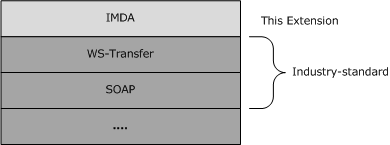

# [MS-WSTIM]: WS-Transfer: Identity Management Operations for Directory Access Extensions

Table of Contents

1 Introduction

- [1 Introduction](#Section_1)
  - [1.1 Glossary](#Section_1.1)
  - [1.2 References](#Section_1.2)
    - [1.2.1 Normative References](#Section_1.2.1)
    - [1.2.2 Informative References](#Section_1.2.2)
  - [1.3 Overview](#Section_1.3)
    - [1.3.1 Identity Objects](#Section_1.3.1)
    - [1.3.2 Dialect](#Section_1.3.2)
  - [1.4 Relationship to Other Protocols](#Section_1.4)
  - [1.5 Prerequisites/Preconditions](#Section_1.5)
  - [1.6 Applicability Statement](#Section_1.6)
  - [1.7 Versioning and Capability Negotiation](#Section_1.7)
  - [1.8 Vendor-Extensible Fields](#Section_1.8)
  - [1.9 Standards Assignments](#Section_1.9)

2 Messages

- [2 Messages](#Section_2)
  - [2.1 Transport](#Section_2.1)
  - [2.2 Common Message Syntax](#Section_2.2)
    - [2.2.1 Namespaces](#Section_2.2.1)
    - [2.2.2 Messages](#Section_2.2.2)
    - [2.2.3 Elements](#Section_2.2.3)
      - [2.2.3.1 AttributeType](#Section_2.2.3.1)
      - [2.2.3.2 AttributeTypeAndValue](#Section_2.2.3.2)
      - [2.2.3.3 AttributeTypeNotValidForDialect](#Section_2.2.3.3)
      - [2.2.3.4 AttributeTypeNotValidForEntry](#Section_2.2.3.4)
      - [2.2.3.5 AttributeTypeOrValueAlreadyExists](#Section_2.2.3.5)
      - [2.2.3.6 IdentityManagementOperation](#Section_2.2.3.6)
    - [2.2.4 Complex Types](#Section_2.2.4)
      - [2.2.4.1 AttributeTypeAndValueXmlType](#Section_2.2.4.1)
      - [2.2.4.2 ExtensibleType](#Section_2.2.4.2)
      - [2.2.4.3 ValueXmlType](#Section_2.2.4.3)
    - [2.2.5 Simple Types](#Section_2.2.5)
    - [2.2.6 Attributes](#Section_2.2.6)
      - [2.2.6.1 SizeLimit](#Section_2.2.6.1)
      - [2.2.6.2 Dialect](#Section_2.2.6.2)
    - [2.2.7 Groups](#Section_2.2.7)
    - [2.2.8 Attribute Groups](#Section_2.2.8)
  - [2.3 Directory Service Schema Elements](#Section_2.3)

3 Protocol Details

- [3 Protocol Details](#Section_3)
  - [3.1 Common Server Processing](#Section_3.1)
    - [3.1.1 Abstract Data Model](#Section_3.1.1)
    - [3.1.2 Timers](#Section_3.1.2)
    - [3.1.3 Initialization](#Section_3.1.3)
    - [3.1.4 Message Processing Events and Sequencing Rules](#Section_3.1.4)
      - [3.1.4.1 SOAP Header Processing](#Section_3.1.4.1)
      - [3.1.4.2 SOAP Faults](#Section_3.1.4.2)
        - [3.1.4.2.1 wsman:AccessDenied](#Section_3.1.4.2.1)
        - [3.1.4.2.2 wsman:AlreadyExists](#Section_3.1.4.2.2)
        - [3.1.4.2.3 wsman:CannotProcessFilter](#Section_3.1.4.2.3)
        - [3.1.4.2.4 wsa2004:DestinationUnreachable](#Section_3.1.4.2.4)
        - [3.1.4.2.5 wsman:EncodingLimit](#Section_3.1.4.2.5)
        - [3.1.4.2.6 wsa2004:EndpointUnavailable](#Section_3.1.4.2.6)
        - [3.1.4.2.7 wsman:FragmentDialectNotSupported](#Section_3.1.4.2.7)
        - [3.1.4.2.8 wxf:InvalidRepresentation](#Section_3.1.4.2.8)
        - [3.1.4.2.9 wsman:SchemaValidationError](#Section_3.1.4.2.9)
        - [3.1.4.2.10 UnwillingToPerform](#Section_3.1.4.2.10)
    - [3.1.5 Timer Events](#Section_3.1.5)
    - [3.1.6 Other Local Events](#Section_3.1.6)
  - [3.2 Resource Server Details](#Section_3.2)
    - [3.2.1 Abstract Data Model](#Section_3.2.1)
    - [3.2.2 Timers](#Section_3.2.2)
    - [3.2.3 Initialization](#Section_3.2.3)
    - [3.2.4 Message Processing Events and Sequencing Rules](#Section_3.2.4)
      - [3.2.4.1 Get](#Section_3.2.4.1)
        - [3.2.4.1.1 Messages](#Section_3.2.4.1.1)
          - [3.2.4.1.1.1 BaseObjectSearchRequestMessage](#Section_3.2.4.1.1.1)
          - [3.2.4.1.1.2 BaseObjectSearchResponseMessage](#Section_3.2.4.1.1.2)
        - [3.2.4.1.2 Elements](#Section_3.2.4.1.2)
          - [3.2.4.1.2.1 BaseObjectSearchRequest](#Section_3.2.4.1.2.1)
          - [3.2.4.1.2.2 BaseObjectSearchResponse](#Section_3.2.4.1.2.2)
        - [3.2.4.1.3 Complex Types](#Section_3.2.4.1.3)
          - [3.2.4.1.3.1 PartialAttributeXmlType](#Section_3.2.4.1.3.1)
      - [3.2.4.2 Put](#Section_3.2.4.2)
        - [3.2.4.2.1 Messages](#Section_3.2.4.2.1)
          - [3.2.4.2.1.1 ModifyRequestMessage](#Section_3.2.4.2.1.1)
          - [3.2.4.2.1.2 ModifyResponseMessage](#Section_3.2.4.2.1.2)
        - [3.2.4.2.2 Elements](#Section_3.2.4.2.2)
          - [3.2.4.2.2.1 ModifyRequest](#Section_3.2.4.2.2.1)
          - [3.2.4.2.2.2 Change](#Section_3.2.4.2.2.2)
        - [3.2.4.2.3 Simple Types](#Section_3.2.4.2.3)
          - [3.2.4.2.3.1 OperationXmlType](#Section_3.2.4.2.3.1)
      - [3.2.4.3 Delete](#Section_3.2.4.3)
    - [3.2.5 Timer Events](#Section_3.2.5)
    - [3.2.6 Other Local Events](#Section_3.2.6)
  - [3.3 ResourceFactory Server Details](#Section_3.3)
    - [3.3.1 Abstract Data Model](#Section_3.3.1)
    - [3.3.2 Timers](#Section_3.3.2)
    - [3.3.3 Initialization](#Section_3.3.3)
    - [3.3.4 Message Processing Events and Sequencing Rules](#Section_3.3.4)
      - [3.3.4.1 Create](#Section_3.3.4.1)
        - [3.3.4.1.1 Messages](#Section_3.3.4.1.1)
          - [3.3.4.1.1.1 AddRequestMessage](#Section_3.3.4.1.1.1)
          - [3.3.4.1.1.2 AddResponseMessage](#Section_3.3.4.1.1.2)
        - [3.3.4.1.2 Elements](#Section_3.3.4.1.2)
          - [3.3.4.1.2.1 AddRequest](#Section_3.3.4.1.2.1)
    - [3.3.5 Timer Events](#Section_3.3.5)
    - [3.3.6 Other Local Events](#Section_3.3.6)

4 Protocol Examples

- [4 Protocol Examples](#Section_4)
  - [4.1 Example of Creating an Identity Object](#Section_4.1)
  - [4.2 Example of Retrieving Attribute Types from an Identity Object](#Section_4.2)
  - [4.3 Example of Retrieving the Complete XML Representation of an Identity Object](#Section_4.3)
  - [4.4 Example of Modifying an Identity Object](#Section_4.4)

5 Security

- [5 Security](#Section_5)
  - [5.1 Security Considerations for Implementers](#Section_5.1)
  - [5.2 Index of Security Parameters](#Section_5.2)

6 Appendix A: Full WSDL

- [6 Appendix A: Full WSDL](#Section_6)

7 Appendix B: Product Behavior

- [7 Appendix B: Product Behavior](#Section_7)

8 Change Tracking

- [8 Change Tracking](#Section_8)

For the legal notice and IP terms, see [LEGAL.md](../LEGAL.md).
Last updated: 4/23/2024.
See [Revision History](#revision-history) for full version history.

# 1 Introduction

The WS-Transfer: Identity Management Operations for Directory Access Extensions (IMDA) are a set of extensions to the WS-Transfer protocol [[WXFR]](https://go.microsoft.com/fwlink/?LinkId=90587) for representing the protocol operations commonly used for directory access in identity management protocols.

The goal of this specification is to enable identity management client applications, which are currently using non-Web service protocols such as [**Lightweight Directory Access Protocol (LDAP)**](#gt_lightweight-directory-access-protocol-ldap) v3 [[RFC2251]](https://go.microsoft.com/fwlink/?LinkId=90325) for managing information held in [**directory services**](#gt_directory-service-ds), to instead use Web service protocols.

This protocol extension is designed to layer atop the WS-Transfer protocol and to be composable with the WS-Management protocol [[DMTF-DSP0226]](https://go.microsoft.com/fwlink/?LinkId=89849).

Sections 1.5, 1.8, 1.9, 2, and 3 of this specification are normative. All other sections and examples in this specification are informative.

## 1.1 Glossary

This document uses the following terms:

**Active Directory**: The Windows implementation of a general-purpose [**directory service**](#gt_directory-service-ds), which uses [**LDAP**](#gt_lightweight-directory-access-protocol-ldap) as its primary access protocol. [**Active Directory**](#gt_active-directory) stores information about a variety of objects in the network such as user accounts, computer accounts, groups, and all related credential information used by Kerberos [MS-KILE](../MS-KILE/MS-KILE.md). [**Active Directory**](#gt_active-directory) is either deployed as [**Active Directory Domain Services (AD DS)**](#gt_active-directory-domain-services-ad-ds) or [**Active Directory Lightweight Directory Services (AD LDS)**](#gt_active-directory-lightweight-directory-services-ad-lds), which are both described in [MS-ADOD](../MS-ADOD/MS-ADOD.md): Active Directory Protocols Overview.

**Active Directory Domain Services (AD DS)**: A [**directory service (DS)**](#gt_directory-service-ds) implemented by a domain controller (DC). The [**DS**](#gt_directory-service-ds) provides a data store for objects that is distributed across multiple DCs. The DCs interoperate as peers to ensure that a local change to an object replicates correctly across DCs. AD DS is a deployment of [**Active Directory**](#gt_active-directory) [MS-ADTS](../MS-ADTS/MS-ADTS.md).

**Active Directory Lightweight Directory Services (AD LDS)**: A [**directory service (DS)**](#gt_directory-service-ds) implemented by a domain controller (DC). AD LDS is a deployment of [**Active Directory**](#gt_active-directory) [MS-ADTS]. The most significant difference between [**AD LDS**](#gt_active-directory-lightweight-directory-services-ad-lds) and [**Active Directory Domain Services (AD DS)**](#gt_active-directory-domain-services-ad-ds) is that [**AD LDS**](#gt_active-directory-lightweight-directory-services-ad-lds) does not host domain naming contexts (domain NCs). A server can host multiple [**AD LDS**](#gt_active-directory-lightweight-directory-services-ad-lds) DCs. Each DC is an independent [**AD LDS**](#gt_active-directory-lightweight-directory-services-ad-lds) instance, with its own independent state. [**AD LDS**](#gt_active-directory-lightweight-directory-services-ad-lds) can be run as an operating system [**DS**](#gt_directory-service-ds) or as a directory service provided by a standalone application (Active Directory Application Mode (ADAM)).

**constructed attribute**: An attribute whose values are computed from normal attributes (for read) and/or have effects on the values of normal attributes (for write).

**dialect**: A specification of a format and rules for the expressions comprising an [**identity attribute type**](#gt_identity-attribute-type). An [**identity attribute type**](#gt_identity-attribute-type) can only be understood if it is known what dialect it is written in and how that dialect maps expressions to [**identity attributes**](#gt_identity-attribute). A dialect is uniquely identified by a [**URI**](#gt_uniform-resource-identifier-uri).

**directory attribute**: An identifier for a single-valued or multi-valued data element that is associated with a [**directory object**](#gt_directory-object).

**directory object**: A [**Lightweight Directory Access Protocol (LDAP)**](#gt_lightweight-directory-access-protocol-ldap) object, as specified in [[RFC2251]](https://go.microsoft.com/fwlink/?LinkId=90325), that is a specialization of an object.

**directory service (DS)**: A service that stores and organizes information about a computer network's users and network shares, and that allows network administrators to manage users' access to the shares. See also [**Active Directory**](#gt_active-directory).

**endpoint**: In the context of a web service, a network target to which a SOAP message can be addressed. See [[WSADDR]](https://go.microsoft.com/fwlink/?LinkId=113065).

**identity attribute**: A property of an identity object consisting of one or more identity attribute values. All the values of an identity attribute are related by a common purpose or meaning. For example, the collection of telephone numbers belonging to a user might form an identity attribute on the identity object that represents that user's account. An identity object is an abstraction over physical realizations such as directory attributes. An identity attribute is named by an identity attribute type.

**identity attribute type**: An expression, written in a dialect, that identifies an identity attribute. The relationship between identity attribute types and identity attributes is many-to-one. An identity attribute type uniquely names an identity attribute, but one identity attribute can be named by multiple identity attribute types, each written in a different dialect. This is analogous to how a directory attribute can be referred to by either an LDAP display name or by an object identifier (OID).

**identity attribute value**: The value of an identity attribute. For example, in an identity attribute representing a user's telephone numbers, each telephone number is an identity attribute value. Identity attribute values have implementation-defined XML representations.

**identity object**: An entity that is a collection of one or more [**identity attributes**](#gt_identity-attribute). For example, an identity object could represent a user's account. An identity object is an abstraction over physical realizations such as [**directory object**](#gt_directory-object)s.

**Lightweight Directory Access Protocol (LDAP)**: The primary access protocol for [**Active Directory**](#gt_active-directory). Lightweight Directory Access Protocol (LDAP) is an industry-standard protocol, established by the Internet Engineering Task Force (IETF), which allows users to query and update information in a [**directory service (DS)**](#gt_directory-service-ds), as described in [MS-ADTS]. The Lightweight Directory Access Protocol can be either version 2 [[RFC1777]](https://go.microsoft.com/fwlink/?LinkId=90290) or version 3 [[RFC3377]](https://go.microsoft.com/fwlink/?LinkID=91337).

**object identifier (OID)**: In the Lightweight Directory Access Protocol (LDAP), a sequence of numbers in a format described by [[RFC1778]](https://go.microsoft.com/fwlink/?LinkId=90291). In many LDAP directory implementations, an OID is the standard internal representation of an attribute. In the directory model used in this specification, the more familiar ldapDisplayName represents an attribute.

**resource**: In WS-Transfer, resources are entities that have an XML representation and can be addressed by an [**endpoint**](#gt_endpoint) reference [[WXFR]](https://go.microsoft.com/fwlink/?LinkId=90587).

**SOAP action**: The HTTP request header field used to indicate the intent of the SOAP request, using a [**URI**](#gt_uniform-resource-identifier-uri) value. See [[SOAP1.1]](https://go.microsoft.com/fwlink/?LinkId=90520) section 6.1.1 for more information.

**SOAP body**: A container for the payload data being delivered by a [**SOAP message**](#gt_soap-message) to its recipient. See [[SOAP1.2-1/2007]](https://go.microsoft.com/fwlink/?LinkId=94664) section 5.3 for more information.

**SOAP fault**: A container for error and status information within a [**SOAP message**](#gt_soap-message). See [SOAP1.2-1/2007] section 5.4 for more information.

**SOAP fault code**: The algorithmic mechanism for identifying a [**SOAP fault**](#gt_soap-fault). See [SOAP1.2-1/2007] section 5.6 for more information.

**SOAP fault detail**: A string containing a human-readable explanation of a [**SOAP fault**](#gt_soap-fault), which is not intended for algorithmic processing. See [SOAP1.2-1/2007] section 5.4.5 for more information.

**SOAP fault subcode**: An element of a [**SOAP fault**](#gt_soap-fault), defined in [[SOAP1.2-1/2003]](https://go.microsoft.com/fwlink/?LinkId=90521).

**SOAP header**: A mechanism for implementing extensions to a [**SOAP message**](#gt_soap-message) in a decentralized manner without prior agreement between the communicating parties. See [SOAP1.2-1/2007] section 5.2 for more information.

**SOAP header block**: The [**XML**](#gt_xml) block containing the [**SOAP header**](#gt_soap-header) entries within a [**SOAP header**](#gt_soap-header). See [SOAP1.2-1/2007] section 5.2.1 for more information.

**SOAP message**: An [**XML**](#gt_xml) document consisting of a mandatory SOAP envelope, an optional [**SOAP header**](#gt_soap-header), and a mandatory [**SOAP body**](#gt_soap-body). See [SOAP1.2-1/2007] section 5 for more information.

**SOAP mustUnderstand attribute**: A global, Boolean attribute that is used to indicate whether a header entry is mandatory or optional for the recipient to process. See [SOAP1.2-1/2007] section 5.2.3 for more information.

**Uniform Resource Identifier (URI)**: A string that identifies a resource. The URI is an addressing mechanism defined in Internet Engineering Task Force (IETF) Uniform Resource Identifier (URI): Generic Syntax [[RFC3986]](https://go.microsoft.com/fwlink/?LinkId=90453).

**Web Services Description Language (WSDL)**: An XML format for describing network services as a set of endpoints that operate on messages that contain either document-oriented or procedure-oriented information. The operations and messages are described abstractly and are bound to a concrete network protocol and message format in order to define an endpoint. Related concrete endpoints are combined into abstract endpoints, which describe a network service. WSDL is extensible, which allows the description of endpoints and their messages regardless of the message formats or network protocols that are used.

**WSDL message**: An abstract, typed definition of the data that is communicated during a [**WSDL operation**](#gt_wsdl-operation) [[WSDL]](https://go.microsoft.com/fwlink/?LinkId=90577). Also, an element that describes the data being exchanged between web service providers and clients.

**WSDL operation**: A single action or function of a web service. The execution of a WSDL operation typically requires the exchange of messages between the service requestor and the service provider.

**WSDL port type**: A named set of logically-related, abstract [**Web Services Description Language (WSDL)**](#gt_web-services-description-language-wsdl) operations and messages.

**XML**: The Extensible Markup Language, as described in [[XML1.0]](https://go.microsoft.com/fwlink/?LinkId=90599).

**XML namespace**: A collection of names that is used to identify elements, types, and attributes in XML documents identified in a URI reference [RFC3986]. A combination of XML namespace and local name allows XML documents to use elements, types, and attributes that have the same names but come from different sources. For more information, see [[XMLNS-2ED]](https://go.microsoft.com/fwlink/?LinkId=90602).

**XML Schema (XSD)**: A language that defines the elements, attributes, namespaces, and data types for [**XML**](#gt_xml) documents as defined by [[XMLSCHEMA1/2]](https://go.microsoft.com/fwlink/?LinkId=90607) and [[XMLSCHEMA2/2]](https://go.microsoft.com/fwlink/?LinkId=90609) standards. An XML schema uses [**XML**](#gt_xml) syntax for its language.

**MAY, SHOULD, MUST, SHOULD NOT, MUST NOT:** These terms (in all caps) are used as defined in [[RFC2119]](https://go.microsoft.com/fwlink/?LinkId=90317). All statements of optional behavior use either MAY, SHOULD, or SHOULD NOT.

## 1.2 References

Links to a document in the Microsoft Open Specifications library point to the correct section in the most recently published version of the referenced document. However, because individual documents in the library are not updated at the same time, the section numbers in the documents may not match. You can confirm the correct section numbering by checking the [Errata](https://go.microsoft.com/fwlink/?linkid=850906).

### 1.2.1 Normative References

We conduct frequent surveys of the normative references to assure their continued availability. If you have any issue with finding a normative reference, please contact [dochelp@microsoft.com](mailto:dochelp@microsoft.com). We will assist you in finding the relevant information.

[DMTF-DSP0226] Distributed Management Task Force, Inc., "Web Services for Management (WS-Management) Specification", version 1.0.0, February 2008, [http://dmtf.org/sites/default/files/standards/documents/DSP0226_1.0.0.pdf](https://go.microsoft.com/fwlink/?LinkId=89849)

[MC-NMF] Microsoft Corporation, "[.NET Message Framing Protocol](../MC-NMF/MC-NMF.md)".

[MS-ADA1] Microsoft Corporation, "[Active Directory Schema Attributes A-L](#Section_2.2.6)".

[MS-ADDM] Microsoft Corporation, "[Active Directory Web Services: Data Model and Common Elements](#Section_2.2.3)".

[MS-ADTS] Microsoft Corporation, "[Active Directory Technical Specification](../MS-ADTS/MS-ADTS.md)".

[RFC2119] Bradner, S., "Key words for use in RFCs to Indicate Requirement Levels", BCP 14, RFC 2119, March 1997, [https://www.rfc-editor.org/info/rfc2119](https://go.microsoft.com/fwlink/?LinkId=90317)

[RFC2251] Wahl, M., Howes, T., and Kille, S., "Lightweight Directory Access Protocol (v3)", RFC 2251, December 1997, [https://www.rfc-editor.org/info/rfc2251](https://go.microsoft.com/fwlink/?LinkId=90325)

[SOAP1.1] Box, D., Ehnebuske, D., Kakivaya, G., et al., "Simple Object Access Protocol (SOAP) 1.1", W3C Note, May 2000, [https://www.w3.org/TR/2000/NOTE-SOAP-20000508/](https://go.microsoft.com/fwlink/?LinkId=90520)

[SOAP1.2-1/2003] Gudgin, M., Hadley, M., Mendelsohn, N., et al., "SOAP Version 1.2 Part 1: Messaging Framework", W3C Recommendation, June 2003, [http://www.w3.org/TR/2003/REC-soap12-part1-20030624](https://go.microsoft.com/fwlink/?LinkId=90521)

[WSAddressing] Box, D., et al., "Web Services Addressing (WS-Addressing)", August 2004, [http://www.w3.org/Submission/ws-addressing/](https://go.microsoft.com/fwlink/?LinkId=90575)

[WSADDR] Gudgin, M., Hadley, M., and Rogers, T., "Web Services Addressing (WS-Addressing) 1.0", W3C Recommendation, May 2006, [http://www.w3.org/2005/08/addressing](https://go.microsoft.com/fwlink/?LinkId=113065)

[WSASB] Gudgin, M., Hadley, M., and Rogers, T., Eds., "Web Services Addressing 1.0 - SOAP Binding", W3C Recommendation, May 2006, [http://www.w3.org/TR/2006/REC-ws-addr-soap-20060509/](https://go.microsoft.com/fwlink/?LinkId=120449)

[WSDLSOAP] Angelov, D., Ballinger, K., Butek, R., et al., "WSDL 1.1 Binding Extension for SOAP 1.2", W3C Member Submission, April 2006, [http://www.w3.org/Submission/2006/SUBM-wsdl11soap12-20060405/](https://go.microsoft.com/fwlink/?LinkId=131790)

[WSDL] Christensen, E., Curbera, F., Meredith, G., and Weerawarana, S., "Web Services Description Language (WSDL) 1.1", W3C Note, March 2001, [https://www.w3.org/TR/2001/NOTE-wsdl-20010315](https://go.microsoft.com/fwlink/?LinkId=90577)

[WXFR] Alexander, J., Box, D., Cabrera, L.F., et al., "Web Services Transfer (WS-Transfer)", September 2006, [http://www.w3.org/Submission/2006/SUBM-WS-Transfer-20060927/](https://go.microsoft.com/fwlink/?LinkId=90587)

[XML10] World Wide Web Consortium, "Extensible Markup Language (XML) 1.0 (Third Edition)", February 2004, [http://www.w3.org/TR/2004/REC-xml-20040204/](https://go.microsoft.com/fwlink/?LinkId=90600)

[XMLNS] Bray, T., Hollander, D., Layman, A., et al., Eds., "Namespaces in XML 1.0 (Third Edition)", W3C Recommendation, December 2009, [https://www.w3.org/TR/2009/REC-xml-names-20091208/](https://go.microsoft.com/fwlink/?LinkId=191840)

[XMLSCHEMA1] Thompson, H., Beech, D., Maloney, M., and Mendelsohn, N., Eds., "XML Schema Part 1: Structures", W3C Recommendation, May 2001, [https://www.w3.org/TR/2001/REC-xmlschema-1-20010502/](https://go.microsoft.com/fwlink/?LinkId=90608)

[XMLSCHEMA2] Biron, P.V., Ed. and Malhotra, A., Ed., "XML Schema Part 2: Datatypes", W3C Recommendation, May 2001, [https://www.w3.org/TR/2001/REC-xmlschema-2-20010502/](https://go.microsoft.com/fwlink/?LinkId=90610)

### 1.2.2 Informative References

[MSFT-RSAT] Microsoft Corporation, "Remote Server Administration Tools (RSAT) for Windows operating systems", [https://support.microsoft.com/en-us/kb/2693643](https://go.microsoft.com/fwlink/?linkid=839006)

## 1.3 Overview

IMDA is an extension to the WS-Transfer protocol [[WXFR]](https://go.microsoft.com/fwlink/?LinkId=90587). WS-Transfer permits the [**XML**](#gt_xml) [[XML10]](https://go.microsoft.com/fwlink/?LinkId=90600) representation of [**resources**](#gt_resource) to be created, modified, retrieved, and deleted. WS-Transfer operates at the level of granularity of the complete representation of an entire resource. That is, when the resource is retrieved, the complete contents of the resource must be retrieved. There is no mechanism in WS-Transfer to specify that only a portion of the resource should be retrieved or what that portion should be. Similarly, when the resource is to be created or modified, the client must supply a new XML representation for the entire resource. During the creation of a resource, there is no means by which the caller can specify only the portion of interest of the resource and allow the server to fill in the remainder of the representation with suitable defaults. Nor is there a mechanism during resource modification by which the caller can specify only the portion of the representation that should be changed and what the new contents for just that portion should be.

Such operations can be difficult for a client to use. For example, if a client wants to modify a single portion (for example, the portion specifying a person's given name) on a resource representing that person, the client would need to read the entire resource, change the value of that one portion of the representation, and then send the entire representation back to the server. The result is increased network traffic and bandwidth consumption. In a usage such as a [**directory service**](#gt_directory-service-ds), where each resource might be a [**directory object**](#gt_directory-object) that could contains dozens or hundreds of attributes, and each attribute could contain multiple values, a more efficient protocol is desirable. The IMDA extensions to WS-Transfer [WXFR] were designed for this purpose.

IMDA adds protocol extensions to WS-Transfer to permit it to work at the level of granularity of portions of the representation of a resource. It allows the client to specify just the portion of the resource to be created, modified, or retrieved. To do so, IMDA defines such fine-grained extensions to the following WS-Transfer [**Web Services Description Language (WSDL)**](#gt_web-services-description-language-wsdl) operations:

- **Put**
- **Create**
- **Get**
Requests that make use of IMDA extensions can be identified by the presence of an IMDA-specific [**SOAP header**](#gt_soap-header).

Additionally, the specification of WS-Transfer provides only a small set of [**SOAP faults**](#gt_soap-fault) for a server to return. This set is insufficient for many error conditions that a server would need to report to the client, forcing the server to invent its own nonstandard [**SOAP fault codes**](#gt_soap-fault-code). IMDA extends the WS-Transfer set of faults by specifying additional SOAP faults that a server is permitted to return to the client to indicate that an error occurred while processing the request. The intent is to improve interoperability between clients and servers by providing a standardized set of errors that both sides of the communication session can understand. IMDA specifies SOAP faults for the three WS-Transfer operations listed in this section as well as for the WS-Transfer Delete operation (which is not otherwise extended by IMDA).

### 1.3.1 Identity Objects

IMDA operates on a type of [**resource**](#gt_resource) known as an [**identity object**](#gt_identity-object). An identity object is a collection of one or more [**identity attributes**](#gt_identity-attribute). An example of a kind of identity object is a [**directory object**](#gt_directory-object). Like any resource that can be accessed through WS-Transfer, identity objects can be represented as [**XML**](#gt_xml) documents.

An identity attribute is a collection of one or more [**identity attribute values**](#gt_identity-attribute-value). An identity attribute is named by an [**identity attribute type**](#gt_identity-attribute-type), which is an expression that designates an identity attribute within an identity object. The format of the expression is determined by the expression's [**dialect**](#gt_dialect), as described in section [1.3.2](#Section_1.3.2). For example, if the identity object corresponds to a directory object, an identity attribute could correspond to a [**directory attribute**](#gt_directory-attribute) of that directory object, and the [**LDAP**](#gt_lightweight-directory-access-protocol-ldap) display name<1> of that directory attribute could serve as the identity attribute type of the corresponding identity attribute.

The identity attribute value is represented as an XML element. An identity attribute can contain one or more identity attribute values. For example, in an identity attribute for a user's telephone numbers, each phone number could be represented as an identity attribute value.

### 1.3.2 Dialect

A single [**identity attributes**](#gt_identity-attribute) within an [**identity object**](#gt_identity-object) can be identified in multiple ways. In other words, there could be multiple [**identity attribute types**](#gt_identity-attribute-type) that each name the same identity attribute. For example, in the previous section, the use of an [**LDAP**](#gt_lightweight-directory-access-protocol-ldap) display name (for example, givenName) as a identity attribute type was given. Another means of naming the same identity attribute, in the example case of each identity object corresponding to a [**directory object**](#gt_directory-object), might be to use the [**object identifier (OID)**](#gt_object-identifier-oid) of the [**directory attribute**](#gt_directory-attribute). The OID acts as a different identity attribute type that names the same identity attribute. These two distinct forms of identity attribute types are each a different [**dialect**](#gt_dialect) of identity attribute type.

Formally, a dialect is a specification of the format of identity attribute types. Each dialect is uniquely identified by a unique [**Uniform Resource Identifier (URI)**](#gt_uniform-resource-identifier-uri).

## 1.4 Relationship to Other Protocols

The IMDA protocol extensions depend on WS-Transfer [[WXFR]](https://go.microsoft.com/fwlink/?LinkId=90587), built on top of SOAP [[SOAP1.2-1/2003]](https://go.microsoft.com/fwlink/?LinkId=90521), as shown in the following diagram.

Figure 1: IMDA protocol stack

## 1.5 Prerequisites/Preconditions

This protocol extension does not assume any prerequisites or preconditions.

## 1.6 Applicability Statement

Use of the IMDA protocol extensions is suitable when access to [**XML**](#gt_xml) representations of [**identity objects**](#gt_identity-object) by means of a WS-Transfer is required and that access needs to be performed at a level of granularity less than the entire identity object's representation. IMDA cannot be used independently of WS-Transfer, so it might not be applicable in applications that have already standardized on a protocol other than WS-Transfer for providing access to a [**directory service**](#gt_directory-service-ds). It might also not be useful in applications where the [**directory objects**](#gt_directory-object) are represented using a means other than XML.<2>

## 1.7 Versioning and Capability Negotiation

This document covers versioning issues in the following areas:

- **Supported Transports:** This protocol extension can be implemented using transports that support sending [**SOAP messages**](#gt_soap-message) as described in section [2.1](#Section_2.1).
- **Protocol Versions:** This protocol extension is not versioned.
- **Capability Negotiation:** This protocol does not support capability negotiation.
- **Localization:** This protocol includes text strings in various [**SOAP faults**](#gt_soap-fault). Localization considerations for such strings are specified in section [3.1.4.2](#Section_1.3).

## 1.8 Vendor-Extensible Fields

This protocol extension has no vendor-extensible fields.

## 1.9 Standards Assignments

There are no standards assignments for this protocol extension.

# 2 Messages

## 2.1 Transport

IMDA imposes no transport requirements or behaviors beyond those of the underlying WS-Transfer [[WXFR]](https://go.microsoft.com/fwlink/?LinkId=90587) protocol. WS-Transfer provides SOAP bindings for both SOAP 1.1 [[SOAP1.1]](https://go.microsoft.com/fwlink/?LinkId=90520) and SOAP 1.2 [[SOAP1.2-1/2003]](https://go.microsoft.com/fwlink/?LinkId=90521). All messages MUST be formatted as specified by either SOAP 1.1 or SOAP 1.2.<3>

## 2.2 Common Message Syntax

This section contains common definitions used by this protocol. The syntax of the definitions uses [**XML Schema**](#gt_xml-schema-xsd) as defined in [[XMLSCHEMA1]](https://go.microsoft.com/fwlink/?LinkId=90608) and [[XMLSCHEMA2]](https://go.microsoft.com/fwlink/?LinkId=90610), and [**Web Services Description Language**](#gt_web-services-description-language-wsdl) as defined in [[WSDL]](https://go.microsoft.com/fwlink/?LinkId=90577).

### 2.2.1 Namespaces

This specification defines and references various [**XML namespaces**](#gt_xml-namespace) using the mechanisms specified in [[XMLNS]](https://go.microsoft.com/fwlink/?LinkId=191840). Although this specification associates a specific XML namespace prefix for each XML namespace that is used, the choice of any particular XML namespace prefix is implementation-specific and not significant for interoperability.

Prefixes and XML namespaces used in this specification are as follows.

| Prefix | Namespace URI | Reference |
| --- | --- | --- |
| da | http://schemas.microsoft.com/2006/11/IdentityManagement/DirectoryAccess | This specification |
| soap12 | http://schemas.xmlsoap.org/wsdl/soap12 | [[WSDLSOAP]](https://go.microsoft.com/fwlink/?LinkId=131790) |
| soapenv | http://www.w3.org/2003/05/soap-envelope | [[SOAP1.2-1/2003]](https://go.microsoft.com/fwlink/?LinkId=90521) |
| wsdl | http://schemas.xmlsoap.org/wsdl | [[WSDL]](https://go.microsoft.com/fwlink/?LinkId=90577) |
| wxf | http://schemas.xmlsoap.org/ws/2004/09/transfer | [[WXFR]](https://go.microsoft.com/fwlink/?LinkId=90587) |
| wsa | http://www.w3.org/2005/08/addressing | [[WSADDR]](https://go.microsoft.com/fwlink/?LinkId=113065) |
| wsa2004 | http://schemas.xmlsoap.org/ws/2004/08/addressing | [[WSAddressing]](https://go.microsoft.com/fwlink/?LinkId=90575) |
| wsman | http://schemas.dmtf.org/wbem/wsman/1/wsman.xsd | [[DMTF-DSP0226]](https://go.microsoft.com/fwlink/?LinkId=89849) |
| xsd | http://www.w3.org/2001/XMLSchema | [[XMLSCHEMA1]](https://go.microsoft.com/fwlink/?LinkId=90608) |
| xsi | http://www.w3.org/2001/XMLSchema-instance | [XMLSCHEMA1] |

Two versions of the WS-Addressing namespace are included in the preceding table, corresponding to [WSAddressing] and [WSADDR]. Most of the IMDA protocol extensions make use of [WSADDR]. However, some of the faults incorporated into IMDA are based on the WS-Management [DMTF-DSP0226] protocol, which uses [WSAddressing].

### 2.2.2 Messages

This specification does not define any [**WSDL messages**](#gt_wsdl-message) that are used in more than one operation.

### 2.2.3 Elements

The following table summarizes the set of common XML schema element definitions defined by this specification. XML schema element definitions that are specific to a particular operation are described with the operation.

| Element | Description |
| --- | --- |
| AttributeType | Contains an [**identity attribute type**](#gt_identity-attribute-type). |
| AttributeTypeAndValue | A combination of an identity attribute type and [**identity attribute values**](#gt_identity-attribute-value). |
| AttributeTypeNotValidForDialect | Used in a [**SOAP fault detail**](#gt_soap-fault-detail) to indicate which identity attribute type was in a format that was not valid for the specified [**dialect**](#gt_dialect). |
| AttributeTypeNotValidForEntry | Used in a SOAP fault detail to indicate which identity attribute type specified an [**identity attribute**](#gt_identity-attribute) that was not valid for the targeted [**identity object**](#gt_identity-object). |
| AttributeTypeOrValueAlreadyExists | Used in a SOAP fault detail to indicate that the specified identity attribute and identity attribute value already exist in the targeted identity object. |
| IdentityManagementOperation | Used in the [**SOAP header block**](#gt_soap-header-block) to indicate a SOAP request message uses the IMDA protocol extensions. |

#### 2.2.3.1 AttributeType

The AttributeType element's value is an [**identity attribute type**](#gt_identity-attribute-type). The [**dialect**](#gt_dialect) used in the identity attribute type is not specified in the AttributeType but rather elsewhere in the operation-specific [**SOAP message**](#gt_soap-message).

<xsd:element name="AttributeType">

<xsd:complexType>

<xsd:complexContent>

<xsd:extension base="ExtensibleType" />

</xsd:complexContent>

</xsd:complexType>

</xsd:element>

#### 2.2.3.2 AttributeTypeAndValue

The AttributeTypeAndValue element specifies an [**identity attribute type**](#gt_identity-attribute-type) and optional [**identity attribute value**](#gt_identity-attribute-value)(s). Whether identity attribute values are included is a behavior defined by the context in which the element is used and is specified in those portions of this document that specify the use of the AttributeTypeAndValue element.

<xsd:element name="AttributeTypeAndValue"

type="AttributeTypeAndValueXmlType" />

#### 2.2.3.3 AttributeTypeNotValidForDialect

The AttributeTypeNotValidForDialect element MAY<4> be used in a [**SOAP fault**](#gt_soap-fault) to indicate that the client specified one or more [**identity attribute types**](#gt_identity-attribute-type) that were not valid expressions in the [**dialect**](#gt_dialect) specified in the operation-specific [**SOAP message**](#gt_soap-message).

<xsd:element name="AttributeTypeNotValidForDialect">

<xsd:complexType>

<xsd:sequence>

<xsd:element ref="AttributeType"

minOccurs="1" maxOccurs="unbounded" />

</xsd:sequence>

</xsd:complexType>

</xsd:element>

**AttributeType**: This element contains the invalid identity attribute type that was supplied by the client. This element can be present multiple times if multiple invalid identity attribute types were supplied.

#### 2.2.3.4 AttributeTypeNotValidForEntry

The AttributeTypeNotValidForEntry element MAY<5> be used in a [**SOAP fault**](#gt_soap-fault) to indicate that the client specified an [**identity attribute**](#gt_identity-attribute) that was not valid for the [**identity object**](#gt_identity-object) that was the target of the operation specified in the [**SOAP message**](#gt_soap-message).

<xsd:element name="AttributeTypeNotValidForEntry">

<xsd:complexType>

<xsd:sequence>

<xsd:element ref="AttributeType"

minOccurs="1" maxOccurs="unbounded" />

</xsd:sequence>

</xsd:complexType>

</xsd:element>

**AttributeType**: This element contains the [**identity attribute type**](#gt_identity-attribute-type) naming the invalid identity attribute. The [**dialect**](#gt_dialect) used for the identity attribute type MUST be the same dialect as the client used in the SOAP request message. This element can be present multiple times if multiple invalid identity attributes were specified.

#### 2.2.3.5 AttributeTypeOrValueAlreadyExists

The AttributeTypeOrValueAlreadyExists element MAY<6> be used in a [**SOAP fault**](#gt_soap-fault) to indicate that the client specified at least one combination of an [**identity attribute**](#gt_identity-attribute) and [**identity attribute value**](#gt_identity-attribute-value)(s) that was already present on the [**identity object**](#gt_identity-object) targeted by the operation. In other words, the client attempted to add duplicate value(s) to an identity attribute.

<xsd:element name="AttributeTypeOrValueAlreadyExists">

<xsd:complexType>

<xsd:sequence>

<xsd:element ref="AttributeTypeAndValue"

minOccurs="0" maxOccurs="unbounded" />

</xsd:sequence>

</xsd:complexType>

</xsd:element>

**AttributeTypeAndValue**: This element MAY<7> be present. If present, it MUST contain an [AttributeType](#Section_2.2.3.1) element and MAY contain an **AttributeValue** element. This element can be present multiple times if the client specified multiple duplicates of identity attributes and values.

**AttributeTypeAndValue.AttributeType**: This element contains the [**identity attribute type**](#gt_identity-attribute-type) naming the identity attribute that would contain the duplicated value. The [**dialect**](#gt_dialect) used for the identity attribute type MUST be the same dialect as the client used in the SOAP request message.

**AttributeTypeAndValue.AttributeValue**: This element, if present, contains the identity attribute value(s) that would be duplicated.

#### 2.2.3.6 IdentityManagementOperation

The IdentityManagementOperation element is used as a [**SOAP header**](#gt_soap-header) in [**SOAP messages**](#gt_soap-message) that request a WS-Transfer operation using IMDA protocol extensions to be performed.

<xsd:element name="IdentityManagementOperation" />

### 2.2.4 Complex Types

The following table summarizes the set of common XML schema complex type definitions defined by this specification. XML schema complex type definitions that are specific to a particular operation are described with the operation.

| Complex type | Description |
| --- | --- |
| AttributeTypeAndValueXmlType | A type that contains an [**identity attribute type**](#gt_identity-attribute-type) and [**identity attribute value**](#gt_identity-attribute-value)(s). |
| ExtensibleType | A base type from which other types derive. Used to contain the [**XML**](#gt_xml) content that comprises the representation of an identity attribute type or iidentity attribute value. |
| ValueXmlType | A type that contains identity attribute value(s). |

#### 2.2.4.1 AttributeTypeAndValueXmlType

Elements of this type contain an [**identity attribute type**](#gt_identity-attribute-type) and, optionally, [**identity attribute value**](#gt_identity-attribute-value)(s). It is used as the type of the [AttributeTypeAndValue](#Section_2.2.3.2) element. It is also used in the definition of the Change element (section [3.2.4.2.2](#Section_3.2.4.2.2.2)). Whether identity attribute values are included is a behavior defined by the context in which instances of this type are used and is specified in those portions of this document that specify the use of such instances.

<xsd:complexType name="AttributeTypeAndValueXmlType">

<xsd:sequence>

<xsd:element ref="AttributeType"

minOccurs="1" maxOccurs="1" />

<xsd:element name="AttributeValue" type="ValueXmlType"

minOccurs="0" maxOccurs="1" />

</xsd:sequence>

</xsd:complexType>

**AttributeType:** An identity attribute type.

**AttributeValue**: If present, the contents of this element are identity attribute value(s).

#### 2.2.4.2 ExtensibleType

This is a base type from which other [**XML**](#gt_xml) types derive, such as those XML types used to represent an [**identity attribute type**](#gt_identity-attribute-type) or [**identity attribute values**](#gt_identity-attribute-value). The content of this type is unconstrained. The interpretation of that content depends on the derived type in which this type is used.

<xsd:complexType name="ExtensibleType">

<xsd:complexContent mixed="true">

<xsd:restriction base="xsd:anyType">

<xsd:sequence>

<xsd:any processContents="lax"

minOccurs="0" maxOccurs="unbounded" />

</xsd:sequence>

</xsd:restriction>

</xsd:complexContent>

</xsd:complexType>

#### 2.2.4.3 ValueXmlType

Elements of this type contain [**identity attribute values**](#gt_identity-attribute-value). The format of the identity attribute value(s) is implementation-defined.<8>

<xsd:complexType name="ValueXmlType">

<xsd:complexContent>

<xsd:extension base="ExtensibleType" />

</xsd:complexContent>

</xsd:complexType>

### 2.2.5 Simple Types

This specification does not define any common XML schema simple type definitions.

### 2.2.6 Attributes

The following table summarizes the set of common XML schema attribute definitions defined by this specification. XML schema attributes that are specific to a particular operation are described with the operation.

| Attribute | Description |
| --- | --- |
| SizeLimit | Used in a [**SOAP fault detail**](#gt_soap-fault-detail) to specify the maximum number of elements that the server will permit in the request. |
| Dialect | Used in request messages to specify the format of [**identity attribute types**](#gt_identity-attribute-type), see section [1.3.2](#Section_1.3.2). |

#### 2.2.6.1 SizeLimit

The SizeLimit attribute is attached to a **wsman:FaultDetail** [[DMTF-DSP0226]](https://go.microsoft.com/fwlink/?LinkId=89849) element to indicate to the client the maximum number of elements that the server will permit in a request. It is used in conjunction with the wsman:EncodingLimit [**SOAP fault subcode**](#gt_soap-fault-subcode) (section [3.1.4.2.5](#Section_3.1.4.2.5)).

<xsd:attribute name="SizeLimit" type="xsd:nonNegativeInteger"/>

#### 2.2.6.2 Dialect

The Dialect attribute is used in request messages to specify the [**URI**](#gt_uniform-resource-identifier-uri) of the [**dialect**](#gt_dialect) (section [1.3.2](#Section_1.3.2)) used for [**identity attribute types**](#gt_identity-attribute-type).

<xsd:attribute name="Dialect" type="xsd:anyURI"/>

### 2.2.7 Groups

This specification does not define any common XML schema group definitions.

### 2.2.8 Attribute Groups

This specification does not define any common XML schema attribute group definitions.

## 2.3 Directory Service Schema Elements

This protocol extension does not access [**directory service**](#gt_directory-service-ds) schema classes or attributes. Implementations of this protocol extension MAY<9> map [**identity objects**](#gt_identity-object) to [**directory objects**](#gt_directory-object) and [**identity attributes**](#gt_identity-attribute)/values to attributes and values stored on directory objects.

# 3 Protocol Details

The following sections describe the behavior of the IMDA protocol extension. As an extension to WS-Transfer [[WXFR]](https://go.microsoft.com/fwlink/?LinkId=90587), the IMDA extensions follow the same client-server model, in which a client sends a [**SOAP message**](#gt_soap-message) containing a request (either a Get, Put, Create, or Delete operation) to the server, and the server responds with a SOAP message containing the response (or a [**SOAP fault**](#gt_soap-fault), if an error occurred during server processing).

In the following sections, the IMDA extensions are grouped by the two WS-Transfer [**WSDL port types**](#gt_wsdl-port-type) to which they apply: the Resource port type (on which Get, Put, and Delete operations are processed) and the ResourceFactory port type (in which Create operations are processed). Prior to discussing the operation-specific behaviors associated with each port type, a common server processing section is included that contains protocol details common to all operations on all port types.

The client side of this protocol is simply a pass-through. That is, no additional timers or other state is required on the client side of this protocol. Calls made by the higher-layer protocol or application are passed directly to the transport, and the results returned by the transport are passed directly back to the higher-layer protocol or application.

## 3.1 Common Server Processing

This section describes processing common to all operations on all port types. Specifically, it documents the abstract data model and initialization procedure common to all port types. This section also discusses the [**SOAP header**](#gt_soap-header) that is included by clients on [**SOAP messages**](#gt_soap-message) to identify WS–Transfer requests that make use of the IMDA extensions. It describes the set of [**SOAP faults**](#gt_soap-fault) that IMDA provides for servers to use to communicate errors to clients.

### 3.1.1 Abstract Data Model

This section describes a conceptual model of possible data organization that an implementation maintains to participate in this protocol. The described organization is provided to facilitate the explanation of how the protocol behaves. This document does not mandate that implementations adhere to this model as long as their external behavior is consistent with that described in this document.

As noted earlier, IMDA operates on entities known as [**identity object**](#gt_identity-object)s. Every IMDA operation, except for Create, targets exactly one existing identity object. The Create operation results in the creation of exactly one new identity object. An identity object is a collection of one or more [**identity attributes**](#gt_identity-attribute). Each identity attribute, in turn, is a collection of one or more [**identity attribute values**](#gt_identity-attribute-value). identity attribute values are represented as [**XML**](#gt_xml) elements.

For example, a user might be represented as an identity object. That identity object could have an identity attribute representing the user's given name, containing a single identity attribute value (for example, "John"). It could also have an identity attribute for the user's surname (for example, "Smith"). It might also have an identity attribute for the user's telephone numbers, which could contain multiple identity attribute values, one for each telephone number possessed by that user.

Like any [**resource**](#gt_resource) that can be accessed through WS-Transfer, an identity object is represented as an XML document. The identity attributes contained in an identity object, the contents of those attributes, and the representation of the identity object (including its identity attributes and identity attribute values) as an XML document is implementation-defined.<10>

In IMDA, requests and responses refer to an identity attribute by specifying an [**identity attribute type**](#gt_identity-attribute-type). This is an expression that names an identity attribute. The expression is interpreted by the server according to the rules of the [**dialect**](#gt_dialect) in which that expression is written. The choice of dialect is implementation-specific.<11> IMDA requests that use identity attribute types contain an attribute that permits the client to name the dialect that it has used in the request. If the server understands the named dialect, the server interprets the identity attribute type in accord with the rules of that dialect. Otherwise, the server rejects the request with a [**SOAP fault**](#gt_soap-fault) with a fault subcode of wsman:FragmentDialectNotSupported. Dialects are named by [**URIs**](#gt_uniform-resource-identifier-uri), and the URI of a dialect is specified as the value of the attribute called **Dialect** in a request message.

The distinction between identity attributes and identity attribute types is an important one. An identity object contains one or more identity attributes. An identity attribute type, on the other hand, is a dialect-relative name for that identity attribute. As IMDA allows for multiple dialects, a single identity attribute can be referenced by multiple identity attribute types (that is, the identity attribute can have multiple names). This is analogous to [**LDAP**](#gt_lightweight-directory-access-protocol-ldap) [[RFC2251]](https://go.microsoft.com/fwlink/?LinkId=90325), where an LDAP attribute in the LDAP data model can, at the protocol level, be referred to in multiple ways (for example, the LDAP display name of the attribute or the [**OID**](#gt_object-identifier-oid) of the attribute).

### 3.1.2 Timers

These protocol extensions do not specify any timers.

### 3.1.3 Initialization

When this protocol initializes, it MUST begin listening on [**endpoints**](#gt_endpoint) for the Resource and ResourceFactory port types. The [**URIs**](#gt_uniform-resource-identifier-uri) for the endpoints, as well as the transport and security mechanisms to use, are implementation-dependent.<12>

### 3.1.4 Message Processing Events and Sequencing Rules

This section describes the [**SOAP header**](#gt_soap-header) processing and [**SOAP faults**](#gt_soap-fault) that are common to all operations.

#### 3.1.4.1 SOAP Header Processing

A client MUST include the IdentityManagementOperation element (section [2.2.3.6](#Section_2.2.3.6)) as a [**SOAP header**](#gt_soap-header) in any WS-Transfer Get, Put, or Create request that uses the IMDA protocol extensions. The client SHOULD set the [**SOAP mustUnderstand attribute**](#gt_soap-mustunderstand-attribute) to true on this element.

When the server receives a WS-Transfer request on which the IdentityManagementOperation element is present as a SOAP header, one of two things MUST happen: either the server MUST process the request in accord with the IMDA extensions as described in this document, or the server MUST reject the request entirely. If the server receives a WS-Transfer request that does not contain the IdentityManagementOperation element as a SOAP header, the server SHOULD<13> treat the request as an ordinary WS-Transfer request that does not make use of the IMDA extensions.

#### 3.1.4.2 SOAP Faults

This section documents the [**SOAP faults**](#gt_soap-fault) specified for use by servers that implement the IMDA protocol extensions. These faults SHOULD be used by servers while processing a WS-Transfer message that uses IMDA extensions to indicate to the client that a server-side error has occurred. Most of the following faults are adopted from the WS-Management [[DMTF-DSP0226]](https://go.microsoft.com/fwlink/?LinkId=89849) protocol, and some are from WS-Transfer [[WXFR]](https://go.microsoft.com/fwlink/?LinkId=90587) or WS-Addressing [[WSAddressing]](https://go.microsoft.com/fwlink/?LinkId=90575); IMDA assigns these faults a specific meaning within the context of a WS-Transfer operation that uses the IMDA extensions.

These faults in this section represent a common set shared by all operations.

Server implementations are permitted to return additional faults beyond those described as follows. However, to maximize interoperability, implementations SHOULD make use of the following faults where applicable.

Some of the SOAP faults documented as follows specify English-language text in their fault reason. Server implementations are permitted to localize this text to other languages. Such localizations SHOULD maintain, to the extent possible, the same meaning as the English text supplied in this document.

All SOAP faults defined in this document MUST be sent as described in section 6 of [[WSASB]](https://go.microsoft.com/fwlink/?LinkId=120449). In the tables in the following sections, the following apply:

- [Code] is the [**SOAP fault code**](#gt_soap-fault-code).
- [Subcode] is the [**SOAP fault subcode**](#gt_soap-fault-subcode).
- [Action] is the [**SOAP action**](#gt_soap-action) [**URI**](#gt_uniform-resource-identifier-uri) for the fault.
- [Reason] is a human-readable explanation of the error.
- [Details] is an illustrative example of the fault detail. If not present, IMDA does not specify a fault detail for the fault.
The following table summarizes the faults (grouped by fault subcode) specified in this section.

| Fault subcode | Description |
| --- | --- |
| wsman:AccessDenied | The server rejected the operation due to access control policies. |
| wsman:AlreadyExists | The [**identity object**](#gt_identity-object) requested to be created already exists. |
| wsman:CannotProcessFilter | The [**identity attribute type**](#gt_identity-attribute-type) was invalid for the [**dialect**](#gt_dialect) or specified an [**identity attribute**](#gt_identity-attribute) that was invalid for the identity object. |
| wsa2004:DestinationUnreachable | The identity object specified as the target of the operation does not exist. |
| wsman:EncodingLimit | The client's request included too many elements. |
| wsa2004:EndpointUnavailable | Insufficient server-side [**resources**](#gt_resource) to process the request. |
| wsman:FragmentDialectNotSupported | The operation specified a dialect not supported by the server. |
| wxf:InvalidRepresentation | Performing the operation would result in an invalid representation of an identity object. |
| wsman:SchemaValidationError | The client's request did not conform to the [**XML Schema**](#gt_xml-schema-xsd) or was syntactically invalid [**XML**](#gt_xml). |
| UnwillingToPerform | The server cannot perform the requested operation. |

##### 3.1.4.2.1 wsman:AccessDenied

If the client sends a request that the server is unable or unwilling to perform because of an access control restriction, the server SHOULD reject the operation and return a [**SOAP fault**](#gt_soap-fault) with a fault subcode of wsman:AccessDenied (as defined in Table 2 of [[DMTF-DSP0226]](https://go.microsoft.com/fwlink/?LinkId=89849)).

Implementations MAY<14> supply a fault detail of their choosing.

| Element | Description |
| --- | --- |
| [Code] | soapenv:Sender |
| [Subcode] | wsman:AccessDenied |
| [Action] | http://schemas.dmtf.org/wbem/wsman/1/wsman/fault |
| [Reason] | The operation failed due to insufficient access rights. |
| [Details] | Implementation-defined and MAY be empty. |

##### 3.1.4.2.2 wsman:AlreadyExists

If the client sends a Create request that specifies the creation of an [**identity object**](#gt_identity-object) that already exists, the server SHOULD reject the operation and return a [**SOAP fault**](#gt_soap-fault) with a fault subcode of wsman:AlreadyExists (as defined in Table 4 of [[DMTF-DSP0226]](https://go.microsoft.com/fwlink/?LinkId=89849)).

Implementations MAY<15> supply a fault detail of their choosing.

| Element | Description |
| --- | --- |
| [Code] | soapenv:Sender |
| [Subcode] | wsman:AlreadyExists |
| [Action] | http://schemas.dmtf.org/wbem/wsman/1/wsman/fault |
| [Reason] | The supplied entry already exists. |
| [Details] | Implementation-defined and MAY be empty. |

##### 3.1.4.2.3 wsman:CannotProcessFilter

If the client specifies:

- One or more [**identity attribute types**](#gt_identity-attribute-type) which were not valid expressions in the [**dialect**](#gt_dialect) specified in the [**SOAP message**](#gt_soap-message),
- And/or one or more [**identity attributes**](#gt_identity-attribute) that are not valid for the [**identity object**](#gt_identity-object) that was the target of the operation specified in the SOAP message,
the server SHOULD reject the operation and return a [**SOAP fault**](#gt_soap-fault) with the fault subcode wsman:CannotProcessFilter (as defined in Table 6 of [[DMTF-DSP0226]](https://go.microsoft.com/fwlink/?LinkId=89849)).<16> The fault detail MAY<17> contain an **AttributeTypeNotValidForDialect** element and/or an **AttributeTypeNotValidForEntry** element, as described in sections [AttributeTypeNotValidForDialect (section 2.2.3.3)](#Section_2.2.3.1) and [AttributeTypeNotValidForEntry (section 2.2.3.4)](#Section_2.2.3.1).

| Element | Description |
| --- | --- |
| [Code] | soapenv:Sender |
| [Subcode] | wsman:CannotProcessFilter |
| [Action] | http://schemas.dmtf.org/wbem/wsman/1/wsman/fault |
| [Reason] | The specified AttributeType is not valid. |
| [Details] | <soapenv:Detail> <AttributeTypeNotValidForDialect> <AttributeType>...</AttributeType> <AttributeType>...</AttributeType> </AttributeTypeNotValidForDialect> <AttributeTypeNotValidForEntry> <AttributeType>...</AttributeType> <AttributeType>...</AttributeType> </AttributeTypeNotValidForEntry> </soapenv:Detail> |

##### 3.1.4.2.4 wsa2004:DestinationUnreachable

If the client sends a Get, Put, or Delete request in which the target of the operation is an [**identity object**](#gt_identity-object) that does not exist, the server SHOULD reject the operation and return a [**SOAP fault**](#gt_soap-fault) in which the fault subcode is wsa2004:DestinationUnreachable (as defined in Table 10 of [[DMTF-DSP0226]](https://go.microsoft.com/fwlink/?LinkId=89849)).

Implementations MAY<18> supply a fault detail or fault reason that differs from the one specified in [DMTF-DSP0226].<19>

| Element | Description |
| --- | --- |
| [Code] | soapenv:Sender |
| [Subcode] | wsa2004:DestinationUnreachable |
| [Action] | http://schemas.xmlsoap.org/ws/2004/08/addressing/fault |
| [Reason] | Implementation-defined. |
| [Details] | Implementation-defined and MAY be empty. |

##### 3.1.4.2.5 wsman:EncodingLimit

If the server determines that the client has included too many elements in a request (for example, too many AttributeType elements in a Get request or too many Change elements in a Put request), the server SHOULD reject the operation and return a [**SOAP fault**](#gt_soap-fault) with a fault subcode of wsman:EncodingLimit (as defined in Table 11 of [[DMTF-DSP0226]](https://go.microsoft.com/fwlink/?LinkId=89849)). The fault detail SHOULD contain a wsman:FaultDetail element containing the following value:

http://schemas.microsoft.com/2006/11/IdentityManagement/DirectoryAccess/RequestSizeLimitExceeded

The server MAY<20> also include a SizeLimit attribute (section [2.2.6.1)](#Section_2.2.6.1) on the wsman:FaultDetail element. If present, this attribute SHOULD be set equal to the maximum number of elements permitted by the server for the operation requested by the client. This maximum number is implementation-defined.<21>

| Element | Description |
| --- | --- |
| [Code] | soapenv:Sender |
| [Code] | soapenv:Sender |
| [Subcode] | wsman:EncodingLimit |
| [Action] | http://schemas.dmtf.org/wbem/wsman/1/wsman/fault |
| [Reason] | Access to multiple AttributeTypeAndValues, Changes, or AttributeTypes exceeded the supported number in a single message. |
| [Details] | <soapenv:Detail xmlns:da=" http://schemas.microsoft.com/2006/11/ IdentityManagement/DirectoryAccess"> <wsman:FaultDetail da:SizeLimit="..."> http://schemas.microsoft.com/2006/11/ IdentityManagement/DirectoryAccess/ RequestSizeLimitExceeded </wsman:FaultDetail> </soapenv:Detail> |

##### 3.1.4.2.6 wsa2004:EndpointUnavailable

If the server is unable to process the client's request because of a lack of internal [**resources**](#gt_resource), the server MAY<22> reject the request and return a [**SOAP fault**](#gt_soap-fault) with a fault subcode of wsa2004:EndpointUnavailable.

Implementations MAY<23> supply a fault detail and fault reason of their choosing.

| [Code] | Soapenv:Receiver |
| --- | --- |
| [Subcode] | wsa2004:EndpointUnavailable |
| [Action] | http://schemas.xmlsoap.org/ws/2004/08/addressing/fault |
| [Reason] | Implementation-defined |
| [Details] | Implementation-defined and MAY be empty |

##### 3.1.4.2.7 wsman:FragmentDialectNotSupported

If the client specifies a [**dialect**](#gt_dialect) in the SOAP request message that the server does not support, the server SHOULD reject the operation and return a [**SOAP fault**](#gt_soap-fault) with a fault subcode of wsman:FragmentDialectNotSupported (as defined in Table 19 of [[DMTF-DSP0226]](https://go.microsoft.com/fwlink/?LinkId=89849)).

| Element | Description |
| --- | --- |
| [Code] | soapenv:Sender |
| [Subcode] | wsman:FragmentDialectNotSupported |
| [Action] | http://schemas.dmtf.org/wbem/wsman/1/wsman/fault |
| [Reason] | The requested dialect is not supported. |
| [Details] | <soapenv:Detail> <wsman:FragmentDialect>... </wsman:FragmentDialect> <wsman:FragmentDialect>... </wsman:FragmentDialect> </soapenv:Detail> |

##### 3.1.4.2.8 wxf:InvalidRepresentation

If a client sends a request for a Create or Put operation that would result in an invalid representation of an [**identity object**](#gt_identity-object), the server SHOULD reject the operation and return a [**SOAP fault**](#gt_soap-fault) with a fault subcode of wxf:InvalidRepresentation (as described in section 5.1 of [[WXFR]](https://go.microsoft.com/fwlink/?LinkId=90587)).

If the representation was invalid because performing the operation would result in an identity object that violates a server-defined constraint, the server SHOULD return the fault with a fault reason and fault detail as specified in the following table.<24>

| Element | Description |
| --- | --- |
| [Code] | soapenv:Sender |
| [Subcode] | wxf:InvalidRepresentation |
| [Action] | http://schemas.xmlsoap.org/ws/2004/09/transfer/fault |
| [Reason] | Constraint violation |
| [Details] | Implementation-defined and MAY be empty.<25> |

If the representation was invalid because performing the operation specified a combination of [**identity attribute**](#gt_identity-attribute) and [**identity attribute value**](#gt_identity-attribute-value) that was already present on the identity object being targeted by the operation, the server SHOULD return the fault with a fault reason as specified in the following table. The fault detail MAY contain an **AttributeTypeOrValueAlreadyExists** element (section [2.2.3.5](#Section_2.2.3.5)) as specified in the following table.<26>

| Element | Description |
| --- | --- |
| [Code] | soapenv:Sender |
| [Subcode] | wxf:InvalidRepresentation |
| [Action] | http://schemas.xmlsoap.org/ws/2004/09/transfer/fault |
| [Reason] | The supplied attribute already exists. |
| [Details] | <soapenv:Detail> <AttributeTypeOrValueAlreadyExists> <AttributeTypeAndValue> <AttributeType>...</AttributeType> <AttributeValue>...</AttributeValue> </AttributeTypeAndValue> <AttributeTypeAndValue> <AttributeType>...</AttributeType> </AttributeTypeAndValue> </AttributeTypeOrValueAlreadyExists> </soapenv:Detail> |

A server MAY<27> return the wxf:InvalidRepresentation fault for other server-defined reasons, with a fault detail of the server's choosing.

| Element | Description |
| --- | --- |
| [Code] | soapenv:Sender |
| [Subcode] | wxf:InvalidRepresentation |
| [Action] | http://schemas.xmlsoap.org/ws/2004/09/transfer/fault |
| [Reason] | The supplied representation is invalid. |
| [Details] | Implementation-defined and MAY be empty. |

##### 3.1.4.2.9 wsman:SchemaValidationError

If the server determines that the client sent a [**SOAP message**](#gt_soap-message) containing a request that does not conform to the XML schema definition of WS-Transfer and/or the IMDA protocol extensions, or that is not syntactically valid [**XML**](#gt_xml), the server SHOULD reject the operation and return a [**SOAP fault**](#gt_soap-fault) with a fault subcode of wsman:SchemaValidationError (as defined in Table 34 of [[DMTF-DSP0226]](https://go.microsoft.com/fwlink/?LinkId=89849)).

Servers are not obliged to perform [**XML Schema**](#gt_xml-schema-xsd) validation of client requests.

While WS-Management does not specify a fault detail to return, implementations of the IMDA protocol extensions MAY<28> supply a fault detail of their choosing.

| Element | Description |
| --- | --- |
| [Code] | soapenv:Sender |
| [Subcode] | wsman:SchemaValidationError |
| [Action] | http://schemas.dmtf.org/wbem/wsman/1/wsman/fault |
| [Reason] | Implementations can choose any string to describe the reason for the schema validation error. |
| [Details] | Implementation-defined and MAY be empty. |

##### 3.1.4.2.10 UnwillingToPerform

A server SHOULD return a [**SOAP fault**](#gt_soap-fault) with a fault subcode of UnwillingToPerform when the client sends a request that is syntactically valid but that the server cannot perform and for which there is no other more specific SOAP fault specified in this document.

Implementations MAY<29> supply a fault detail of their choosing.

| Element | Description |
| --- | --- |
| [Code] | soapenv:Sender if an error in the client's request caused the fault. soapenv:Receiver if an error in the server's internal processing caused the fault. |
| [Subcode] | UnwillingToPerform |
| [Action] | http://schemas.microsoft.com/2006/11/IdentityManagement/DirectoryAccess/fault |
| [Reason] | Implementations can choose any string to describe the reason why the server cannot perform the operation. |
| [Details] | Implementation-defined and MAY be empty. |

### 3.1.5 Timer Events

There are no timer events in this protocol extension.

### 3.1.6 Other Local Events

There are no other local events in this protocol extension.

## 3.2 Resource Server Details

This section describes the server behavior of the IMDA protocol extensions as they apply to WS-Transfer's [[WXFR]](https://go.microsoft.com/fwlink/?LinkId=90587) Resource port type. In WS-Transfer, this port type is used to process three [**WSDL operations**](#gt_wsdl-operation):

- Get
- Put
- Delete
IMDA defines new [**SOAP messages**](#gt_soap-message) for the first two operations, which can be used to request that the Get and Put operations be performed at the level of granularity of [**identity attributes**](#gt_identity-attribute) and their values, rather than at the level of the entire [**identity object**](#gt_identity-object) (as provided for by unextended WS-Transfer). The Delete operation, on the other hand, always operates at the level of granularity of an identity object level. It is included in this section because IMDA specifies additional [**SOAP faults**](#gt_soap-fault) (beyond those defined in WS-Transfer) that can be used by a server to respond to a Delete operation.

Each of these operations is performed against a single identity object specified in the request. This identity object is called the target of the operation. The target of the operation SHOULD be specified by one or more [**SOAP headers**](#gt_soap-header). The choice of these SOAP headers and how they specify the target of the operation is not defined by the IMDA protocol extensions but rather by the service that employs the IMDA extensions.<30>

### 3.2.1 Abstract Data Model

See the abstract data model in the common processing section [Abstract Data Model (section 3.1.1)](#Section_3.1.1).

### 3.2.2 Timers

There are no timers in this protocol extension.

### 3.2.3 Initialization

See the initialization in the common processing section [3.1.3](#Section_3.1.3).

### 3.2.4 Message Processing Events and Sequencing Rules

The Resource port type includes three operations.

| Operation | Description |
| --- | --- |
| Delete | Removes an existing [**identity object**](#gt_identity-object). |
| Get | Retrieves one or more [**identity attribute**](#gt_identity-attribute)s from an identity object. |
| Put | Modifies the contents of one or more identity attributes on an identity object. |

#### 3.2.4.1 Get

A server processes a Get request using the IMDA protocol extensions upon receiving a [**SOAP message**](#gt_soap-message) containing the [IdentityManagementOperation](#Section_2.2.3.6) [**SOAP header**](#gt_soap-header) and specifying the following [**URI**](#gt_uniform-resource-identifier-uri) as the [**SOAP action**](#gt_soap-action).

http://schemas.xmlsoap.org/ws/2004/09/transfer/Get

This operation is specified by the following [**WSDL**](#gt_web-services-description-language-wsdl).

<wsdl:operation name="Get">

<wsdl:input

message="BaseObjectSearchRequestMessage"

wsa:Action="http://schemas.xmlsoap.org/ws/2004/09/

transfer/Get" />

<wsdl:output

message="BaseObjectSearchResponseMessage"

wsa:Action="http://schemas.xmlsoap.org/ws/2004/09/

transfer/GetResponse" />

</wsdl:operation>

The server's processing of this operation depends on the contents of the BaseObjectSearchRequest in the SOAP request message (section [3.2.4.1.2.1](#Section_3.2.4.1.2.1)). There are two cases:

- If the BaseObjectSearchRequest contains one or more AttributeType elements, the server SHOULD retrieve the values of the [**identity attributes**](#gt_identity-attribute) which that are specified by the [**identity attribute types**](#gt_identity-attribute-type) contained in the BaseObjectSearchRequest element. The server then assembles and returns a SOAP message containing a BaseObjectSearchResponse as the [**SOAP body**](#gt_soap-body). The contents of the BaseObjectSearchResponse are the [**identity attribute values**](#gt_identity-attribute-value) for the identity attributes requested by the client, from the [**identity object**](#gt_identity-object) specified by the client as the target of the Get operation. For each identity attribute, the identity attribute value(s) for that attribute are contained in a **PartialAttribute** element. There MUST be exactly one **PartialAttribute** element in the **BaseObjectSearchResponse** element for each **AttributeType** element in the BaseObjectSearchRequest element, and the order of the PartialAttribute elements in the response MUST be the same as the order of the AttributeTypes in the request.
If an identity attribute specified in the client's request does not exist on the targeted identity object, or if the server refuses to return the values of an identity attribute to the client due to access control policy, the server MUST include an empty PartialAttribute element in the BaseObjectSearchResponse in the position that would otherwise have been occupied by that identity attribute's values.

- If the BaseObjectSearchRequest contains no AttributeType elements, the server SHOULD assemble an implementation-defined<31> [**XML**](#gt_xml) representation of the entire identity object including all the identity attributes of the object, except it SHOULD exclude from that representation any identity attributes that the client is not permitted to retrieve the values of due to access control policy. The server MAY<32> exclude additional identity attributes as well.
The server then assembles and returns a SOAP message containing a BaseObjectSearchResponse as the SOAP body. The contents of the BaseObjectSearchResponse are a single PartialAttribute element. The contents of that PartialAttribute element is the XML representation of the identity object.

This mode of operation is similar to performing a WS-Transfer Get operation without using the IMDA protocol extensions.

If an error occurs while processing this operation, the server SHOULD reject the operation and return one of the [**SOAP faults**](#gt_soap-fault) specified in section [3.1.4.2](#Section_1.3).

##### 3.2.4.1.1 Messages

The following [**WSDL message**](#gt_wsdl-message) definitions are specific to this operation.

###### 3.2.4.1.1.1 BaseObjectSearchRequestMessage

The BaseObjectSearchRequestMessage is sent by the client to the server to specify which [**identity attributes**](#gt_identity-attribute) of the [**identity object**](#gt_identity-object) targeted by the Get operation are to be returned or (if it contains no AttributeType elements) to indicate that the [**XML**](#gt_xml) representation of the entire identity object is to be returned.

<wsdl:message name="BaseObjectSearchRequestMessage">

<wsdl:part name="BaseObjectSearchRequestMessageBody"

element="BaseObjectSearchRequest"/>

</wsdl:message>

###### 3.2.4.1.1.2 BaseObjectSearchResponseMessage

The BaseObjectSearchResponseMessage is returned by the server as the result of a successful Get operation and contains either the [**identity attribute values**](#gt_identity-attribute-value) or the [**XML**](#gt_xml) representation of the [**identity object**](#gt_identity-object), depending on whether the BaseObjectSearchRequestMessage contained any AttributeType elements.

<wsdl:message name="BaseObjectSearchResponseMessage">

<wsdl:part name="BaseObjectSearchResponseMessageBody"

element="BaseObjectSearchResponse"/>

</wsdl:message>

##### 3.2.4.1.2 Elements

The following XML schema element definitions are specific to this operation.

###### 3.2.4.1.2.1 BaseObjectSearchRequest

This element forms the body of the [**SOAP message**](#gt_soap-message) sent by a client in an IMDA-extended Get request. It contains zero or more [**identity attribute types**](#gt_identity-attribute-type), specifying the [**identity attributes**](#gt_identity-attribute) that the client wants the server to return from the [**identity object**](#gt_identity-object) targeted by the Get operation. If present, these identity attribute types MUST be expressed using the [**dialect**](#gt_dialect) specified in the Dialect attribute. Note that all identity attribute types within a BaseObjectSearchRequest element are specified using the same dialect.

If no identity attribute types are present (that is, if the count of AttributeType elements in the BaseObjectSearchRequest is zero), the server SHOULD interpret it as a request that the [**XML**](#gt_xml) representation of the identity object be returned to the client. In this case, the server SHOULD ignore the contents of the Dialect attribute.

<xsd:element name="BaseObjectSearchRequest">

<xsd:complexType>

<xsd:sequence>

<xsd:element ref="AttributeType"

minOccurs="0" maxOccurs="unbounded" />

</xsd:sequence>

<xsd:attribute name="Dialect" type="xsd:anyURI" />

</xsd:complexType>

</xsd:element>

**AttributeType**: Specifies an identity attribute type (expressed in the dialect specified on the Dialect attribute) for an identity attribute to be returned by the server in the response to the Get operation. This element can be present multiple times in the BaseObjectSearchRequest, each with a different identity attribute type.

**Dialect**: The value of this attribute is the [**URI**](#gt_uniform-resource-identifier-uri) of the dialect used for the identity attribute types specified in the AttributeType elements.

###### 3.2.4.1.2.2 BaseObjectSearchResponse

This element forms the body of the [**SOAP message**](#gt_soap-message) sent by the server in response to an IMDA-extended Get operation. It contains one or more PartialAttribute elements. The contents of the BaseObjectSearchResponse are one of the following two cases:

- If the BaseObjectSearchRequest contained one or more AttributeType elements (that is, if it specified at least one [**identity attribute type**](#gt_identity-attribute-type)), the BaseObjectSearchResponse contains one or more PartialAttribute elements, each of which contains the identity value(s) of the corresponding [**identity attribute**](#gt_identity-attribute) that was requested by the client in the BaseObjectSearchRequest. This correspondence is positional: the order of the PartialAttribute elements in the BaseObjectSearchResponse MUST be the same as the order of the AttributeType elements in the BaseObjectSearchRequest.
The number of PartialAttribute elements in the BaseObjectSearchResponse MUST equal the number of AttributeType elements in the BaseObjectSearchRequest. If the requested identity attribute is not present or is inaccessible due to access control policy in the [**identity object**](#gt_identity-object), the server MUST return an empty PartialAttribute element for that identity attribute in the BaseObjectSearchResponse.

- If the BaseObjectSearchRequest did not contain any AttributeType elements (that is, if it was a request for the [**XML**](#gt_xml) representation of the entire identity object), the BaseObjectSearchResponse MUST contain a single PartialAttribute element, the content of which is the XML representation of the identity object.

<xsd:element name="BaseObjectSearchResponse">

<xsd:complexType>

<xsd:sequence>

<xsd:element name="PartialAttribute"

type="PartialAttributeXmlType"

minOccurs="1" maxOccurs="unbounded" />

</xsd:sequence>

</xsd:complexType>

</xsd:element>

**PartialAttribute**: Contains either (1) one or more [**identity attribute values**](#gt_identity-attribute-value) for the identity attribute that was named in the corresponding position of the BaseObjectSearchRequest, or (2) the XML representation of the identity object. In the case of (1), this element can be present multiple times (once for each AttributeType element in the BaseObjectSearchRequest). In the case of (2), this element is present exactly once.

##### 3.2.4.1.3 Complex Types

The following XML schema complex type definitions are specific to this operation.

###### 3.2.4.1.3.1 PartialAttributeXmlType

This type is used for [**identity attribute values**](#gt_identity-attribute-value) (or for a representation of the entire [**identity object**](#gt_identity-object)) returned by the server in a BaseObjectSearchResponse element. The contents of elements of this type are either the identity attribute values for an [**identity attribute**](#gt_identity-attribute) or the [**XML**](#gt_xml) representation of an entire identity object. The format of the identity attribute values or the XML representation of an identity object is implementation-defined.<33>

<xsd:complexType name="PartialAttributeXmlType">

<xsd:complexContent>

<xsd:extension base="ExtensibleType" />

</xsd:complexContent>

</xsd:complexType>

#### 3.2.4.2 Put

A server processes a Put request using the IMDA protocol extensions upon receiving a [**SOAP message**](#gt_soap-message) containing the IdentityManagementOperation [**SOAP header**](#gt_soap-header) and specifying the following [**URI**](#gt_uniform-resource-identifier-uri) as the [**SOAP action**](#gt_soap-action).

http://schemas.xmlsoap.org/ws/2004/09/transfer/Put

This operation is specified by the following WSDL.

<wsdl:operation name="Put">

<wsdl:input

message="ModifyRequestMessage"

wsa:Action="http://schemas.xmlsoap.org/ws/2004/09/transfer/Put" />

<wsdl:output

message="ModifyResponseMessage"

wsa:Action="http://schemas.xmlsoap.org/ws/2004/09/transfer/PutResponse" />

</wsdl:operation>

For each Change element in the ModifyRequest, the server performs the modifications specified in that Change against the [**identity attribute**](#gt_identity-attribute) (also specified in the Change) of the [**identity object**](#gt_identity-object) targeted by the Put operation. The server SHOULD<34> perform these modifications as a single atomic transaction. If any of the modifications requested cannot be performed by the server for any reason, the server SHOULD perform none of the modifications and MUST fail the entire Put request. If there are no change elements present in the **ModifyRequest** message, then the server SHOULD NOT perform any modifications to the identity object.<35>

If an error occurs while processing this operation, the server SHOULD reject the operation and return one of the [**SOAP faults**](#gt_soap-fault) specified in section [3.1.4.2](#Section_1.3).

##### 3.2.4.2.1 Messages

The following [**WSDL message**](#gt_wsdl-message) definitions are specific to this operation.

###### 3.2.4.2.1.1 ModifyRequestMessage

The ModifyRequestMessage is sent by the client to the server to specify which [**identity attributes**](#gt_identity-attribute) of the targeted [**identity object**](#gt_identity-object) are to be modified and what those modifications (the addition, removal, or replacement of [**identity attribute values**](#gt_identity-attribute-value)) are to be.

<wsdl:message name="ModifyRequestMessage">

<wsdl:part name="ModifyRequestMessageBody" element="ModifyRequest"/>

</wsdl:message>

###### 3.2.4.2.1.2 ModifyResponseMessage

The ModifyResponseMessage is returned by the server in response to a successful Put operation. It has an empty [**SOAP body**](#gt_soap-body) and so conveys no information to the client other than that the Put operation requested by the client was performed successfully. This differs from the response used by Put operations in unextended WS-Transfer [[WXFR]](https://go.microsoft.com/fwlink/?LinkId=90587), in which the [**XML**](#gt_xml) representation of the modified object is to be returned by the server.

<wsdl:message name="ModifyResponseMessage" />

##### 3.2.4.2.2 Elements

The following XML schema element definitions are specific to this operation.

###### 3.2.4.2.2.1 ModifyRequest

This element specifies zero or more modifications to be performed to the [**identity attributes**](#gt_identity-attribute) of the [**identity object**](#gt_identity-object) targeted by the Put operation.

<xsd:element name="ModifyRequest">

<xsd:complexType>

<xsd:sequence>

<xsd:element ref="Change"

minOccurs="0" maxOccurs="unbounded" />

</xsd:sequence>

<xsd:attribute name="Dialect" type="xsd:anyURI" />

</xsd:complexType>

</xsd:element>

**Change**: Specifies a modification to be performed against an identity attribute. This element can be present multiple times in order to specify multiple modifications. It is permitted for multiple Change elements to specify the same identity attribute, in which case all of the modifications specified for that attribute will be made to that attribute. However, all the modifications to that identity attribute MUST be performed in the same order as they are specified in the **ModifyRequest**.

**Dialect**: The value of this attribute is the [**URI**](#gt_uniform-resource-identifier-uri) of the [**dialect**](#gt_dialect) used for the [**identity attribute types**](#gt_identity-attribute-type) (the AttributeType elements) in the Change elements.

###### 3.2.4.2.2.2 Change

This element specifies a modification to one [**identity attribute**](#gt_identity-attribute) in the [**identity object**](#gt_identity-object) targeted by the Put operation. A modification can take the form of adding, replacing, or removing values from the identity attribute.

<xsd:element name="Change" >

<xsd:complexType>

<xsd:complexContent>

<xsd:extension base="AttributeTypeAndValueXmlType">

<xsd:attribute name="Operation" type="OperationXmlType"

use="required" />

</xsd:extension>

</xsd:complexContent>

</xsd:complexType>

</xsd:element>

**Operation**: Specifies the type of modification to be performed against the identity attribute specified in the Change element. This can be either the addition of [**identity attribute values**](#gt_identity-attribute-value) to the identity attribute, the replacement of the existing values of the identity attribute with new values, or the removal of values from the identity attribute. If the client specifies a value for this attribute that is not a permitted value for the OperationXmlType, the server SHOULD reject the request with a wsman:SchemaValidationError [**SOAP fault**](#gt_soap-fault).

**AttributeType**: The contents of this element is an [**identity attribute type**](#gt_identity-attribute-type) expressed in the [**dialect**](#gt_dialect) specified by the Dialect attribute of the ModifyRequest element. This specifies the identity attribute against which the modification is to be performed.

**AttributeValue**: The contents of this element is one or more identity attribute values to be added, replaced, or removed from the identity attribute. If the Operation attribute has a value of "add", an AttributeValue element (containing at least one identity attribute value) SHOULD be specified and the server SHOULD reject the request and return a wsman:SchemaValidationError SOAP fault if it is not specified. If the Operation attribute has a value of "delete" or "replace", the AttributeValue is optional. The effects of omitting it are described in section [OperationXmlType](#Section_3.2.4.2.3.1).

##### 3.2.4.2.3 Simple Types

The following XML schema simple definitions are specific to this operation.

###### 3.2.4.2.3.1 OperationXmlType

This enumeration type is used to specify the value of the Operation attribute in the Change element. It indicates the type of modification to be performed to the [**identity attribute**](#gt_identity-attribute) that is specified in the Change element.

<xsd:simpleType name="OperationXmlType">

<xsd:restriction base="xsd:NMTOKEN">

<xsd:enumeration value="add" />

<xsd:enumeration value="delete" />

<xsd:enumeration value="replace" />

</xsd:restriction>

</xsd:simpleType>

| Value | Meaning |
| --- | --- |
| add | The server SHOULD add the specified [**identity attribute value**](#gt_identity-attribute-value)(s) to the set of values in the specified identity attribute, creating the identity attribute if it does not already exist on the targeted [**identity object**](#gt_identity-object). |
| delete | The server SHOULD<36> remove the specified identity attribute value(s) from the specified identity attribute. If no values are specified, the server SHOULD remove all the values. If the specified identity attribute does not exist on the targeted identity object, then the server MUST fail the PUT request. |
| replace | The server SHOULD replace the set of values in the specified identity attribute with the value(s) specified in the operation, creating the identity attribute if it does not already exist on the targeted identity object. If no values are specified in the operation, the server SHOULD remove all the values currently on the specified identity attribute. |

#### 3.2.4.3 Delete

A server processes a Delete request upon receiving a [**SOAP message**](#gt_soap-message) specifying the following [**URI**](#gt_uniform-resource-identifier-uri) as the [**SOAP action**](#gt_soap-action).

http://schemas.xmlsoap.org/ws/2004/09/transfer/Delete

This operation is specified by the following WSDL.

<wsdl:operation name="Delete">

<wsdl:input

message="DeleteRequestMessage"

wsa:Action="http://schemas.xmlsoap.org/ws/2004/09/transfer/Delete" />

<wsdl:output

message="DeleteResponseMessage"

wsa:Action="http://schemas.xmlsoap.org/ws/2004/09/transfer/DeleteResponse" />

</wsdl:operation>

Unlike the Get and Put operations, the IMDA protocol extensions do not specify any new messages or processing rules for the Delete operation, and therefore the IdentityManagementOperation [**SOAP header**](#gt_soap-header) is not used on Delete requests. Instead, IMDA simply extends the specification for WS-Transfer Delete by permitting the server to return any of the [**SOAP faults**](#gt_soap-fault) specified in section [3.1.4.2](#Section_1.3).

### 3.2.5 Timer Events

There are no timer events in this protocol extension.

### 3.2.6 Other Local Events

There are no other local events in this protocol extension.

## 3.3 ResourceFactory Server Details

This section describes the server behavior of the IMDA protocol extensions as they apply to WS-Transfer's [[WXFR]](https://go.microsoft.com/fwlink/?LinkId=90587) ResourceFactory port type. In WS-Transfer, this port type is used to process the Create operation. IMDA defines a new request message for this operation that permits the client to specify only a portion of the [**identity object**](#gt_identity-object) that is to be created, with the server supplying any remaining portions of the identity object when it creates the object.

Note that unlike operations performed on the Resource port type, the Create operation does not target a specific identity object but rather causes the creation of an identity object that can subsequently be targeted by operations on the Resource port type.

### 3.3.1 Abstract Data Model

See the abstract data model in the common processing section [3.1.1](#Section_3.1.1).

### 3.3.2 Timers

There are no timers in this protocol extension.

### 3.3.3 Initialization

See the initialization in the common processing section [3.1.3](#Section_3.1.3).

### 3.3.4 Message Processing Events and Sequencing Rules

The ResourceFactory port type includes one operation.

| Operation | Description |
| --- | --- |
| Create | Creates a new [**identity object**](#gt_identity-object). |

#### 3.3.4.1 Create

A server processes a Create request using the IMDA protocol extensions upon receiving a [**SOAP message**](#gt_soap-message) containing the IdentityManagementOperation [**SOAP header**](#gt_soap-header) and specifying the following [**URI**](#gt_uniform-resource-identifier-uri) as the [**SOAP action**](#gt_soap-action).

http://schemas.xmlsoap.org/ws/2004/09/transfer/Create

This operation is specified by the following WSDL.

<wsdl:operation name="Create">

<wsdl:input

message="AddRequestMessage"

wsa:Action="http://schemas.xmlsoap.org/ws/2004/09/transfer/Create" />

<wsdl:output

message="AddResponseMessage"

wsa:Action="http://schemas.xmlsoap.org/ws/2004/09/transfer/CreateResponse" />

</wsdl:operation>

Upon receiving the request, the server creates a new [**identity object**](#gt_identity-object). For each [**identity attribute**](#gt_identity-attribute) named in an AttributeTypeAndValue element in the AddRequest message, that identity attribute in the newly created object is assigned the [**identity attribute values**](#gt_identity-attribute-value) specified in that AttributeTypeAndValue element. If the identity object cannot be created or the identity attributes cannot be set as specified by the client (for example, due to reasons of access control policy or constraints that prohibit setting the specified identity attribute), the server MUST fail the Create request and MUST not create the identity object.

The creation of the identity object and the assignment of identity attribute values SHOULD be performed as a single atomic transaction. If any of the specified identity attributes cannot be set to the specified values, the entire operation SHOULD be rejected, and the server SHOULD not create the identity object.

Servers MAY<37> set other identity attributes on the identity objects to implementation-defined defaults as part of the object creation.

If an error occurs while processing this operation, the server SHOULD reject the operation and return one of the [**SOAP faults**](#gt_soap-fault) specified in section [3.1.4.2](#Section_1.3).

##### 3.3.4.1.1 Messages

The following [**WSDL message**](#gt_wsdl-message) definitions are specific to this operation.

###### 3.3.4.1.1.1 AddRequestMessage

The AddRequestMessage is sent by the client to the server to request the creation of a new [**identity object**](#gt_identity-object) and to specify values for [**identity attributes**](#gt_identity-attribute) on the identity object to be created.

<wsdl:message name="AddRequestMessage">

<wsdl:part name="AddRequestMessageBody" element="AddRequest"/>

</wsdl:message>

###### 3.3.4.1.1.2 AddResponseMessage

The AddResponseMessage is returned by the server in response to a successful Create operation. The contents of the message are a [**resource**](#gt_resource) reference (wxf:ResourceCreated) for the newly created [**identity object**](#gt_identity-object). wxf:ResourceCreated is defined in [[WXFR]](https://go.microsoft.com/fwlink/?LinkId=90587).

<wsdl:message name="AddResponseMessage">

<wsdl:part name="AddResponseMessageBody" element="wxf:ResourceCreated" />

</wsdl:message>

##### 3.3.4.1.2 Elements

The following XML schema element definitions are specific to this operation.

###### 3.3.4.1.2.1 AddRequest

This element is used by the client to specify [**identity attribute values**](#gt_identity-attribute-value) to be added to [**identity attributes**](#gt_identity-attribute) on the [**identity object**](#gt_identity-object) that is to be created. Zero or more identity attributes can be specified, and for each specified identity attribute, one or more identity attribute values can be supplied. When the object is created, those identity attributes specified in the AddRequest have their values initially set to the values specified by the client.

While there can be multiple occurrences of the AttributeTypeAndValue element, there is only one occurrence of the Dialect attribute on the AddRequest element. Therefore, all AttributeType elements use the same [**dialect**](#gt_dialect).

<xsd:element name="AddRequest">

<xsd:complexType>

<xsd:sequence>

<xsd:element ref="AttributeTypeAndValue"

minOccurs="0"

maxOccurs="unbounded" />

</xsd:sequence>

<xsd:attribute name="Dialect" type="xsd:anyURI" />

</xsd:complexType>

</xsd:element>

**AttributeTypeAndValue**: Specifies an identity attribute to be set on the to-be-created identity object and the identity attribute value(s) that are to be added to that identity attribute. This element can be present multiple times, permitting values for multiple identity attributes to be specified.

It is permitted for multiple AttributeTypeAndValue elements to specify the same identity attribute. In that case, the values added to the specified identity attribute are the union of all the values specified in the AttributeTypeAndValue elements that specify that attribute. If the server does not permit more than one value to be added to the specified identity attribute, the server SHOULD reject the operation with a wxf:InvalidRepresentation [**SOAP fault**](#gt_soap-fault).<38>

**AttributeTypeAndValue.AttributeType**: The content of this element is an [**identity attribute type**](#gt_identity-attribute-type) expressed in the dialect specified by the Dialect attribute. This specifies the identity attribute to which the values are to be added.

**AttributeTypeAndValue.AttributeValue**: Contains the identity attribute value(s) to be added to the specified identity attribute when the object is created.

**Dialect**: The value of this attribute is the [URI](#Section_1.1) of the dialect used for the identity attribute types.

### 3.3.5 Timer Events

There are no timer events in this protocol extension.

### 3.3.6 Other Local Events

There are no other local events in this protocol extension.

# 4 Protocol Examples

In this section, several sample IMDA operations are presented. First, an [**identity object**](#gt_identity-object) is created using a Create operation. Information from that identity object is then retrieved using Get operations. Finally, the object is modified using a Put operation.

For illustrative purposes, the chosen [**XML**](#gt_xml) representation of identity objects in this section is the XML view of [**directory objects**](#gt_directory-object) shown in [MS-ADDM](#Section_2.2.3) section 2.3. For the Get and Put examples, the [**SOAP header**](#gt_soap-header) defined in [MS-ADDM] section 2.5 are used to specify the object that is the target of the operation.

## 4.1 Example of Creating an Identity Object

In this section, a new [**identity object**](#gt_identity-object) is created using a Create operation with the IMDA protocol extensions. During the creation, [**identity attribute values**](#gt_identity-attribute-value) are specified for five [**identity attributes**](#gt_identity-attribute). For one of the identity attributes (named by the [**identity attribute type**](#gt_identity-attribute-type) "addata:otherTelephone"), two identity attribute values are specified. The [**dialect**](#gt_dialect) used for the identity attribute types is the XPath 1.0-derived dialect from [MS-ADDM](#Section_2.2.3) section 2.4. In the response, a wxf:ResourceCreated element is returned, the contents of which are used to target the IMDA operations against this newly created identity object in the subsequent examples.

SOAP Request Message

<soapenv:Envelope

xmlns:soapenv="http://www.w3.org/2003/05/soap-envelope"

xmlns:wsa="http://www.w3.org/2005/08/addressing">

<soapenv:Header>

<wsa:Action soapenv:mustUnderstand="1">

http://schemas.xmlsoap.org/ws/2004/09/transfer/Create

</wsa:Action>

<IdentityManagementOperation soapenv:mustUnderstand="1" xmlns=

"http://schemas.microsoft.com/2006/11/IdentityManagement/DirectoryAccess" />

<instance xmlns="http://schemas.microsoft.com/2008/1/ActiveDirectory">

ldap:389

</instance>

<wsa:MessageID>

urn:uuid:b0936e92-ce04-4a1f-b557-bb85b02717b7

</wsa:MessageID>

<wsa:ReplyTo>

<wsa:Address>http://www.w3.org/2005/08/addressing/anonymous</wsa:Address>

</wsa:ReplyTo>

<wsa:To soapenv:mustUnderstand="1">net.tcp://server01.fabrikam.com:9389/ActiveDirectoryWebServices/Windows/ResourceFactory</wsa:To>

</soapenv:Header>

<soapenv:Body>

<AddRequest Dialect="http://schemas.microsoft.com/2008/1/ActiveDirectory/Dialect/XPath-Level-1"

xmlns="http://schemas.microsoft.com/2006/11/IdentityManagement/DirectoryAccess" xmlns:ad="http://schemas.microsoft.com/2008/1/ActiveDirectory" xmlns:addata="http://schemas.microsoft.com/2008/1/ActiveDirectory/Data" xmlns:xsi="http://www.w3.org/2001/XMLSchema-instance" xmlns:xsd="http://www.w3.org/2001/XMLSchema">

<AttributeTypeAndValue>

<AttributeType>addata:objectClass</AttributeType>

<AttributeValue>

<ad:value xsi:type="xsd:string">user</ad:value>

</AttributeValue>

</AttributeTypeAndValue>

<AttributeTypeAndValue>

<AttributeType>addata:description</AttributeType>

<AttributeValue>

<ad:value xsi:type="xsd:string">Sample description.</ad:value>

</AttributeValue>

</AttributeTypeAndValue>

<AttributeTypeAndValue>

<AttributeType>addata:otherTelephone</AttributeType>

<AttributeValue>

<ad:value xsi:type="xsd:string">(425) 555-0100</ad:value>

<ad:value xsi:type="xsd:string">(206) 555-0100</ad:value>

</AttributeValue>

</AttributeTypeAndValue>

<AttributeTypeAndValue>

<AttributeType>ad:container-hierarchy-parent</AttributeType>

<AttributeValue>

<ad:value xsi:type="xsd:string">

CN=Users,DC=fabrikam,DC=com

</ad:value>

</AttributeValue>

</AttributeTypeAndValue>

<AttributeTypeAndValue>

<AttributeType>ad:relativeDistinguishedName</AttributeType>

<AttributeValue>

<ad:value xsi:type="xsd:string">CN=Sample User</ad:value>

</AttributeValue>

</AttributeTypeAndValue>

</AddRequest>

</soapenv:Body>

</soapenv:Envelope>

SOAP Response Message

<soapenv:Envelope

xmlns:s="http://www.w3.org/2003/05/soap-envelope"

xmlns:wsa="http://www.w3.org/2005/08/addressing">

<soapenv:Header>

<wsa:Action soapenv:mustUnderstand="1">

http://schemas.xmlsoap.org/ws/2004/09/transfer/CreateResponse

</wsa:Action>

<wsa:RelatesTo>

urn:uuid:b0936e92-ce04-4a1f-b557-bb85b02717b7

</wsa:RelatesTo>

<wsa:To soapenv:mustUnderstand="1">

http://www.w3.org/2005/08/addressing/anonymous

</wsa:To>

</soapenv:Header>

<soapenv:Body>

<wxf:ResourceCreated

xmlns:wxf="http://schemas.xmlsoap.org/ws/2004/09/transfer"

xmlns:ad="http://schemas.microsoft.com/2008/1/ActiveDirectory"

xmlns:wsa="http://www.w3.org/2005/08/addressing"> <wsa:Address>net.tcp://server01.fabrikam.com:9389/ActiveDirectoryWebServices/Windows/Resource</wsa:Address>

<wsa:ReferenceParameters>

<ad:objectReferenceProperty>

51419d0c-cadd-4b70-9c8d-8a73fdd2d32a

</ad:objectReferenceProperty>

<ad:instance>ldap:389</ad:instance>

</wsa:ReferenceParameters>

</wxf:ResourceCreated>

</soapenv:Body>

</soapenv:Envelope>

## 4.2 Example of Retrieving Attribute Types from an Identity Object

In this example, three [**identity attributes**](#gt_identity-attribute) are retrieved from the [**identity object**](#gt_identity-object) created in the preceding example using a Get operation with the IMDA protocol extensions. One of the identity attributes has multiple [**identity attribute values**](#gt_identity-attribute-value), and one of the requested identity attributes does not exist on the identity object and so is returned as an empty PartialAttribute element. As in the preceding example, the [**dialect**](#gt_dialect) used for the [**identity attribute types**](#gt_identity-attribute-type) is the XPath 1.0-derived dialect from [MS-ADDM](#Section_2.2.3) section 2.4.

SOAP Request Message

<soapenv:Envelope

xmlns:soapenv="http://www.w3.org/2003/05/soap-envelope"

xmlns:wsa="http://www.w3.org/2005/08/addressing">

<soapenv:Header>

<wsa:Action soapenv:mustUnderstand="1">

http://schemas.xmlsoap.org/ws/2004/09/transfer/Get

</wsa:Action>

<IdentityManagementOperation soapenv: mustUnderstand="1" xmlns="http://schemas.microsoft.com/2006/11/IdentityManagement/DirectoryAccess" />

<objectReferenceProperty

xmlns="http://schemas.microsoft.com/2008/1/ActiveDirectory">

51419d0c-cadd-4b70-9c8d-8a73fdd2d32a

</objectReferenceProperty>

<instance xmlns="http://schemas.microsoft.com/2008/1/ActiveDirectory">

ldap:389

</instance>

<wsa:MessageID>

urn:uuid:6841deed-8d13-4e37-90a9-a1437753bc73

</wsa:MessageID>

<wsa:ReplyTo>

<wsa:Address>http://www.w3.org/2005/08/addressing/anonymous</wsa:Address>

</wsa:ReplyTo>

<wsa:To soapenv:mustUnderstand="1">net.tcp://server01.fabrikam.com:9389/ActiveDirectoryWebServices/Windows/Resource</wsa:To>

</soapenv:Header>

<soapenv:Body>

<BaseObjectSearchRequest

Dialect="http://schemas.microsoft.com/2008/1/ActiveDirectory/Dialect/XPath-Level-1"

xmlns="http://schemas.microsoft.com/2006/11/IdentityManagement/DirectoryAccess"

xmlns:addata="http://schemas.microsoft.com/2008/1/ActiveDirectory/Data" >

<AttributeType>addata:description</AttributeType>

<AttributeType>addata:otherTelephone</AttributeType>

<AttributeType>addata:nonExistentAttribute </AttributeType>

</BaseObjectSearchRequest>

</soapenv:Body>

</soapenv:Envelope>

SOAP Response Message

<soapenv:Envelope

xmlns:soapenv="http://www.w3.org/2003/05/soap-envelope"

xmlns:wsa="http://www.w3.org/2005/08/addressing">

<soapenv:Header>

<wsa:Action soapenv:mustUnderstand="1">

http://schemas.xmlsoap.org/ws/2004/09/transfer/GetResponse

</wsa:Action>

<wsa:RelatesTo>

urn:uuid:6841deed-8d13-4e37-90a9-a1437753bc73

</wsa:RelatesTo>

<wsa:To soapenv:mustUnderstand="1">

http://www.w3.org/2005/08/addressing/anonymous

</wsa:To>

</soapenv:Header>

<soapenv:Body>

<BaseObjectSearchResponse

xmlns="http://schemas.microsoft.com/2006/11/IdentityManagement/DirectoryAccess"

xmlns:xsi="http://www.w3.org/2001/XMLSchema-instance"

xmlns:xsd="http://www.w3.org/2001/XMLSchema"

xmlns:ad="http://schemas.microsoft.com/2008/1/ActiveDirectory"

xmlns:addata="http://schemas.microsoft.com/2008/1/ActiveDirectory/Data">

<PartialAttribute>

<addata:description LdapSyntax="UnicodeString">

<ad:value xsi:type="xsd:string">Sample description.</ad:value>

</addata:description>

</PartialAttribute>

<PartialAttribute>

<addata:otherTelephone LdapSyntax="UnicodeString">

<ad:value xsi:type="xsd:string">(425) 555-0100</ad:value>

<ad:value xsi:type="xsd:string">(206) 555-0100</ad:value>

</addata:otherTelephone>

</PartialAttribute>

<PartialAttribute>

</PartialAttribute>

</BaseObjectSearchResponse>

</soapenv:Body>

</soapenv:Envelope>

## 4.3 Example of Retrieving the Complete XML Representation of an Identity Object

In the previous example, the SOAP request specified the [**identity attribute type**](#gt_identity-attribute-type)s to be returned by the server. In the example in this section, the request does not specify any identity attribute types, so the server returns the [**XML**](#gt_xml) representation of the entire [**identity object**](#gt_identity-object) as the contents of a single PartialAttribute element.

As seen in the response that follows, a number of [**identity attributes**](#gt_identity-attribute) are present that were not specified in the Create request. The values of these attributes were defaulted by the server implementation when the identity object was created.

SOAP Request Message

<soapenv:Envelope

xmlns:soapenv="http://www.w3.org/2003/05/soap-envelope"

xmlns:wsa="http://www.w3.org/2005/08/addressing">

<soapenv:Header>

<wsa:Action soapenv:mustUnderstand="1">

http://schemas.xmlsoap.org/ws/2004/09/transfer/Get

</wsa:Action>

<IdentityManagementOperation soapenv:mustUnderstand="1"

xmlns="http://schemas.microsoft.com/2006/11/IdentityManagement/

DirectoryAccess" />

<objectReferenceProperty

xmlns="http://schemas.microsoft.com/2008/1/ActiveDirectory">

51419d0c-cadd-4b70-9c8d-8a73fdd2d32a

</objectReferenceProperty>

<instance xmlns="http://schemas.microsoft.com/2008/1/

ActiveDirectory">

ldap:389

</instance>

<wsa:MessageID>

urn:uuid:648ec6f5-3b8e-46b5-9c4f-c9964f2773a8

</wsa:MessageID>

<wsa:ReplyTo>

<wsa:Address>http://www.w3.org/2005/08/addressing/anonymous

</wsa:Address>

</wsa:ReplyTo>

<wsa:To soapenv:mustUnderstand="1">

net.tcp://server01.fabrikam.com:9389/ActiveDirectoryWebServices/

Windows/Resource</wsa:To>

</soapenv:Header>

<soapenv:Body>

<BaseObjectSearchRequest Dialect="http://schemas.microsoft.com/

2008/1/ActiveDirectory/Dialect/XPath-Level-1"

xmlns="http://schemas.microsoft.com/2006/11/IdentityManagement/

DirectoryAccess" >

</BaseObjectSearchRequest>

</soapenv:Body>

</soapenv:Envelope>

SOAP Response Message

<soapenv:Envelope

xmlns:soapenv="http://www.w3.org/2003/05/soap-envelope"

xmlns:wsa="http://www.w3.org/2005/08/addressing">

<soapenv:Header>

<wsa:Action soapenv:mustUnderstand="1">

http://schemas.xmlsoap.org/ws/2004/09/transfer/GetResponse

</wsa:Action>

<wsa:RelatesTo>

urn:uuid:648ec6f5-3b8e-46b5-9c4f-c9964f2773a8

</wsa:RelatesTo>

<wsa:To soapenv:mustUnderstand="1">

http://www.w3.org/2005/08/addressing/anonymous

</wsa:To>

</soapenv:Header>

<soapenv:Body>

<BaseObjectSearchResponse xmlns="http://schemas.microsoft.com/2006/11/IdentityManagement/DirectoryAccess" xmlns:xsi="http://www.w3.org/2001/XMLSchema-instance" xmlns:xsd="http://www.w3.org/2001/XMLSchema" xmlns:ad="http://schemas.microsoft.com/2008/1/ActiveDirectory" xmlns:addata="http://schemas.microsoft.com/2008/1/ActiveDirectory/Data">

<PartialAttribute>

<addata:user>

<ad:objectReferenceProperty>

<ad:value xsi:type="xsd:string">

51419d0c-cadd-4b70-9c8d-8a73fdd2d32a

</ad:value>

</ad:objectReferenceProperty>

<addata:sAMAccountName LdapSyntax="UnicodeString">

<ad:value xsi:type="xsd:string">$5J1000-H8LSNOEVT4KN</ad:value>

</addata:sAMAccountName>

<addata:userAccountControl LdapSyntax="Integer">

<ad:value xsi:type="xsd:string">546</ad:value>

</addata:userAccountControl>

<addata:description LdapSyntax="UnicodeString">

<ad:value xsi:type="xsd:string">Sample description.</ad:value>

</addata:description>

<addata:otherTelephone LdapSyntax="UnicodeString">

<ad:value xsi:type="xsd:string">(425) 555-0100</ad:value>

<ad:value xsi:type="xsd:string">(206) 555-0100</ad:value>

</addata:otherTelephone>

<addata:primaryGroupID LdapSyntax="Integer">

<ad:value xsi:type="xsd:string">513</ad:value>

</addata:primaryGroupID>

<addata:instanceType LdapSyntax="Integer">

<ad:value xsi:type="xsd:string">4</ad:value>

</addata:instanceType>

<addata:objectClass LdapSyntax="ObjectIdentifier">

<ad:value xsi:type="xsd:string">top</ad:value>

<ad:value xsi:type="xsd:string">person</ad:value>

<ad:value xsi:type="xsd:string">organizationalPerson</ad:value>

<ad:value xsi:type="xsd:string">user</ad:value>

</addata:objectClass>

<addata:pwdLastSet LdapSyntax="LargeInteger">

<ad:value xsi:type="xsd:string">0</ad:value>

</addata:pwdLastSet>

<addata:badPwdCount LdapSyntax="Integer">

<ad:value xsi:type="xsd:string">0</ad:value>

</addata:badPwdCount>

<addata:sAMAccountType LdapSyntax="Integer">

<ad:value xsi:type="xsd:string">805306368</ad:value>

</addata:sAMAccountType>

<addata:dSCorePropagationData LdapSyntax="GeneralizedTimeString">

<ad:value xsi:type="xsd:string">16010101000000.0Z</ad:value>

</addata:dSCorePropagationData>

<addata:uSNChanged LdapSyntax="LargeInteger">

<ad:value xsi:type="xsd:string">17190</ad:value>

</addata:uSNChanged>

<addata:lastLogon LdapSyntax="LargeInteger">

<ad:value xsi:type="xsd:string">0</ad:value>

</addata:lastLogon>

<addata:accountExpires LdapSyntax="LargeInteger">

<ad:value xsi:type="xsd:string">9223372036854775807</ad:value>

</addata:accountExpires>

<addata:logonCount LdapSyntax="Integer">

<ad:value xsi:type="xsd:string">0</ad:value>

</addata:logonCount>

<addata:distinguishedName LdapSyntax="DSDNString">

<ad:value xsi:type="xsd:string">

CN=Sample User,CN=users,DC=fabrikam,DC=com

</ad:value>

</addata:distinguishedName>

<addata:codePage LdapSyntax="Integer">

<ad:value xsi:type="xsd:string">0</ad:value>

</addata:codePage>

<addata:name LdapSyntax="UnicodeString">

<ad:value xsi:type="xsd:string">Sample User</ad:value>

</addata:name>

<addata:whenChanged LdapSyntax="GeneralizedTimeString">

<ad:value xsi:type="xsd:string">20080806180821.0Z</ad:value>

</addata:whenChanged>

<addata:badPasswordTime LdapSyntax="LargeInteger">

<ad:value xsi:type="xsd:string">0</ad:value>

</addata:badPasswordTime>

<addata:lastLogoff LdapSyntax="LargeInteger">

<ad:value xsi:type="xsd:string">0</ad:value>

</addata:lastLogoff>

<addata:countryCode LdapSyntax="Integer">

<ad:value xsi:type="xsd:string">0</ad:value>

</addata:countryCode>

<addata:cn LdapSyntax="UnicodeString">

<ad:value xsi:type="xsd:string">Sample User</ad:value>

</addata:cn>

<addata:whenCreated LdapSyntax="GeneralizedTimeString">

<ad:value xsi:type="xsd:string">20080806180821.0Z</ad:value>

</addata:whenCreated>

<addata:objectSid LdapSyntax="SidString">

<ad:value xsi:type="xsd:base64Binary">

AQUAAAAAA,AUVAAAAmQa9c3c0W2VqP7D2ZQYAAA==

</ad:value>

</addata:objectSid>

<addata:objectGUID LdapSyntax="OctetString">

<ad:value xsi:type="xsd:base64Binary">

3MRkkoc1fUWGwM12sub3pw==

</ad:value>

</addata:objectGUID>

<addata:objectCategory LdapSyntax="DSDNString">

<ad:value xsi:type="xsd:string">

CN=Person,CN=Schema,CN=Configuration,DC=fabrikam,DC=com

</ad:value>

</addata:objectCategory>

<addata:uSNCreated LdapSyntax="LargeInteger">

<ad:value xsi:type="xsd:string">17189</ad:value>

</addata:uSNCreated>

<ad:container-hierarchy-parent>

<ad:value xsi:type="xsd:string">

2bc4e0c4-b8c9-4eba-8c9e-1f9ea52c8d7e

</ad:value>

</ad:container-hierarchy-parent>

<ad:relativeDistinguishedName>

<ad:value xsi:type="xsd:string">CN=Sample User</ad:value>

</ad:relativeDistinguishedName>

<ad:distinguishedName>

<ad:value xsi:type="xsd:string">

CN=Sample User,CN=Users,DC=fabrikam,DC=com

</ad:value>

</ad:distinguishedName>

</addata:user>

</PartialAttribute>

</BaseObjectSearchResponse>

</soapenv:Body>

</soapenv:Envelope>

## 4.4 Example of Modifying an Identity Object

In this example, the previously created [**identity object**](#gt_identity-object) has two of its [**identity attributes**](#gt_identity-attribute) modified by using a Put operation with the IMDA protocol extensions. For the attribute identified by the [**identity attribute type**](#gt_identity-attribute-type) "addata:description", the previous [**identity attribute value**](#gt_identity-attribute-value) is replaced with a new value. For "addata:otherTelephone", an additional value is added, giving that attribute a total of three identity attribute values. The [**dialect**](#gt_dialect) used for the identity attribute types is the XPath 1.0-derived dialect from [MS-ADDM](#Section_2.2.3) section 2.4.

SOAP Request Message

<soapenv:Envelope

xmlns:soapenv="http://www.w3.org/2003/05/soap-envelope"

xmlns:wsa="http://www.w3.org/2005/08/addressing">

<soapenv:Header>

<wsa:Action soapenv:mustUnderstand="1">

http://schemas.xmlsoap.org/ws/2004/09/transfer/Put

</wsa:Action>

<IdentityManagementOperation soapenv:mustUnderstand="1"

xmlns="http://schemas.microsoft.com/2006/11/IdentityManagement/

DirectoryAccess" />

<objectReferenceProperty

xmlns="http://schemas.microsoft.com/2008/1/ActiveDirectory">

51419d0c-cadd-4b70-9c8d-8a73fdd2d32a

</objectReferenceProperty>

<instance

xmlns="http://schemas.microsoft.com/2008/1/ActiveDirectory">

ldap:389

</instance>

<wsa:MessageID>

urn:uuid:5fb63904-b05a-408d-8a4a-4d2f9332568e

</wsa:MessageID>

<wsa:ReplyTo>

<wsa:Address>http://www.w3.org/2005/08/addressing/anonymous

</wsa:Address>

</wsa:ReplyTo>

<wsa:To soapenv:mustUnderstand="1">

net.tcp://server01.fabrikam.com:9389/ActiveDirectoryWebServices/

Windows/Resource</wsa:To>

</soapenv:Header>

<soapenv:Body>

<ModifyRequest Dialect="http://schemas.microsoft.com/2008/1/

ActiveDirectory/Dialect/XPath-Level-1"

xmlns="http://schemas.microsoft.com/2006/11/IdentityManagement/

DirectoryAccess"

xmlns:ad="http://schemas.microsoft.com/2008/1/ActiveDirectory"

xmlns:addata="http://schemas.microsoft.com/2008/1/

ActiveDirectory/Data"

xmlns:xsi="http://www.w3.org/2001/XMLSchema-instance"

xmlns:xsd="http://www.w3.org/2001/XMLSchema">

<Change Operation="replace">

<AttributeType>addata:description</AttributeType>

<AttributeValue>

<ad:value xsi:type="xsd:string">New description.

</ad:value>

</AttributeValue>

</Change>

<Change Operation="add">

<AttributeType>addata:otherTelephone</AttributeType>

<AttributeValue>

<ad:value xsi:type="xsd:string">(212) 555-0100

</ad:value>

</AttributeValue>

</Change>

</ModifyRequest>

</soapenv:Body>

</soapenv:Envelope>

SOAP Response Message

<soapenv:Envelope

xmlns:soapenv="http://www.w3.org/2003/05/soap-envelope"

xmlns:wsa="http://www.w3.org/2005/08/addressing">

<soapenv:Header>

<wsa:Action soapenv:mustUnderstand="1">

http://schemas.xmlsoap.org/ws/2004/09/transfer/PutResponse

</wsa:Action>

<wsa:RelatesTo>

urn:uuid:5fb63904-b05a-408d-8a4a-4d2f9332568e

</wsa:RelatesTo>

<wsa:To soapenv:mustUnderstand="1">

http://www.w3.org/2005/08/addressing/anonymous

</wsa:To>

</soapenv:Header>

<soapenv:Body />

</soapenv:Envelope>

# 5 Security

## 5.1 Security Considerations for Implementers

There are no known additional security considerations for these protocol extensions, but implementers have to consider the security implications of the data that they expose by means of these extensions. When exposing access to [**identity objects**](#gt_identity-object) that can contain sensitive information, server implementers are encouraged to use transport mechanisms that support encryption and integrity-verification of the messages. Server implementers are also encouraged to enforce access controls prior to performing any operation against an identity object.

## 5.2 Index of Security Parameters

This protocol extension has no security parameters.

# 6 Appendix A: Full WSDL

For ease of implementation, the full WSDL is provided below. After the full [**WSDL**](#gt_web-services-description-language-wsdl), a binding is included for using the Resource and ResourceFactory port types with SOAP 1.2 [[SOAP1.2-1/2003]](https://go.microsoft.com/fwlink/?LinkId=90521) over the "net.tcp" transport [MC-NMF](../MC-NMF/MC-NMF.md). This binding is included to illustrate how the IdentityManagementOperation [**SOAP header**](#gt_soap-header) is used in the [**SOAP messages**](#gt_soap-message) and should not be construed to restrict servers from implementing the IMDA protocol extensions using other versions of SOAP or over other transports.

Full WSDL.

[SOAP]

<?xml version="1.0" encoding="utf-8"?>

<wsdl:definitions

xmlns:wsdl="http://schemas.xmlsoap.org/wsdl/" targetNamespace="http://schemas.microsoft.com/2006/11/IdentityManagement/DirectoryAccess"

xmlns:da="http://schemas.microsoft.com/2006/11/IdentityManagement/DirectoryAccess"

xmlns:wsa="http://www.w3.org/2005/08/addressing"

xmlns:wxf="http://schemas.xmlsoap.org/ws/2004/09/transfer"

xmlns:xsd="http://www.w3.org/2001/XMLSchema"

xmlns:soap12="http://schemas.xmlsoap.org/wsdl/soap12"

>

<wsdl:types>

<xsd:schema>

<xsd:import

namespace="http://schemas.xmlsoap.org/ws/2004/09/transfer" />

</xsd:schema>

<xsd:schema elementFormDefault="qualified" targetNamespace="http://schemas.microsoft.com/2006/11/IdentityManagement/DirectoryAccess">

<xsd:complexType name="ExtensibleType">

<xsd:complexContent mixed="true">

<xsd:restriction base="xsd:anyType">

<xsd:sequence>

<xsd:any processContents="lax"

minOccurs="0" maxOccurs="unbounded" />

</xsd:sequence>

</xsd:restriction>

</xsd:complexContent>

</xsd:complexType>

<xsd:element name="AttributeType">

<xsd:complexType>

<xsd:complexContent>

<xsd:extension base="da:ExtensibleType" />

</xsd:complexContent>

</xsd:complexType>

</xsd:element>

<xsd:complexType name="ValueXmlType">

<xsd:complexContent>

<xsd:extension base="da:ExtensibleType" />

</xsd:complexContent>

</xsd:complexType>

<xsd:complexType name="PartialAttributeXmlType">

<xsd:complexContent>

<xsd:extension base="da:ExtensibleType" />

</xsd:complexContent>

</xsd:complexType>

<xsd:complexType name="AttributeTypeAndValueXmlType">

<xsd:sequence>

<xsd:element ref="da:AttributeType"

minOccurs="1" maxOccurs="1" />

<xsd:element name="AttributeValue" type="da:ValueXmlType"

minOccurs="0" maxOccurs="1" />

</xsd:sequence>

</xsd:complexType>

<xsd:element name="AttributeTypeAndValue"

type="da:AttributeTypeAndValueXmlType" />

<xsd:element name="BaseObjectSearchRequest">

<xsd:complexType>

<xsd:sequence>

<xsd:element ref="da:AttributeType" minOccurs="0"

maxOccurs="unbounded" />

</xsd:sequence>

<xsd:attribute name="Dialect" type="xsd:anyURI" />

</xsd:complexType>

</xsd:element>

<xsd:element name="BaseObjectSearchResponse">

<xsd:complexType>

<xsd:sequence>

<xsd:element name="PartialAttribute"

type="da:PartialAttributeXmlType"

minOccurs="1" maxOccurs="unbounded" />

</xsd:sequence>

</xsd:complexType>

</xsd:element>

<xsd:element name="AddRequest">

<xsd:complexType>

<xsd:sequence>

<xsd:element ref="da:AttributeTypeAndValue"

minOccurs="0" maxOccurs="unbounded" />

</xsd:sequence>

<xsd:attribute name="Dialect" type="xsd:anyURI" />

</xsd:complexType>

</xsd:element>

<xsd:simpleType name="OperationXmlType">

<xsd:restriction base="xsd:NMTOKEN">

<xsd:enumeration value="add" />

<xsd:enumeration value="delete" />

<xsd:enumeration value="replace" />

</xsd:restriction>

</xsd:simpleType>

<xsd:element name="Change" >

<xsd:complexType>

<xsd:complexContent>

<xsd:extension base="da:AttributeTypeAndValueXmlType">

<xsd:attribute name="Operation" type="da:OperationXmlType"

use="required" />

</xsd:extension>

</xsd:complexContent>

</xsd:complexType>

</xsd:element>

<xsd:element name="ModifyRequest">

<xsd:complexType>

<xsd:sequence>

<xsd:element ref="da:Change"

minOccurs="0" maxOccurs="unbounded" />

</xsd:sequence>

<xsd:attribute name="Dialect" type="xsd:anyURI" />

</xsd:complexType>

</xsd:element>

<xsd:element name="IdentityManagementOperation" />

<xsd:element name="AttributeTypeOrValueAlreadyExists">

<xsd:complexType>

<xsd:sequence>

<xsd:element ref="da:AttributeTypeAndValue"

minOccurs="0" maxOccurs="unbounded" />

</xsd:sequence>

</xsd:complexType>

</xsd:element>

<xsd:element name="AttributeTypeNotValidForDialect">

<xsd:complexType>

<xsd:sequence>

<xsd:element ref="da:AttributeType"

minOccurs="1" maxOccurs="unbounded" />

</xsd:sequence>

</xsd:complexType>

</xsd:element>

<xsd:element name="AttributeTypeNotValidForEntry">

<xsd:complexType>

<xsd:sequence>

<xsd:element ref="da:AttributeType"

minOccurs="1" maxOccurs="unbounded" />

</xsd:sequence>

</xsd:complexType>

</xsd:element>

</xsd:schema>

</wsdl:types>

<wsdl:message name="BaseObjectSearchRequestMessage">

<wsdl:part name="BaseObjectSearchRequestMessageBody"

element="da:BaseObjectSearchRequest"/>

</wsdl:message>

<wsdl:message name="BaseObjectSearchResponseMessage">

<wsdl:part name="BaseObjectSearchResponseMessageBody"

element="da:BaseObjectSearchResponse"/>

</wsdl:message>

<wsdl:message name="AddRequestMessage">

<wsdl:part name="AddRequestMessageBody" element="da:AddRequest"/>

</wsdl:message>

<wsdl:message name="AddResponseMessage">

<wsdl:part name="AddResponseMessageBody" element="wxf:ResourceCreated"/>

</wsdl:message>

<wsdl:message name="ModifyRequestMessage">

<wsdl:part name="ModifyRequestMessageBody" element="da:ModifyRequest"/>

</wsdl:message>

<wsdl:message name="ModifyResponseMessage" />

<wsdl:message name="DeleteRequestMessage" />

<wsdl:message name="DeleteResponseMessage" />

<wsdl:message name="IdentityOperationManagementMessage_Header">

<wsdl:part name="request_header"

element="da:IdentityManagementOperation" />

</wsdl:message>

<wsdl:portType name="Resource">

<wsdl:documentation>

This is the port for reading, modifying and deleting an identity object.

</wsdl:documentation>

<wsdl:operation name="Get">

<wsdl:input message="da:BaseObjectSearchRequestMessage"

wsa:Action="http://schemas.xmlsoap.org/ws/2004/09/transfer/Get" />

<wsdl:output message="da:BaseObjectSearchResponseMessage" wsa:Action="http://schemas.xmlsoap.org/ws/2004/09/transfer/GetResponse" />

</wsdl:operation>

<wsdl:operation name="Put">

<wsdl:input message="da:ModifyRequestMessage"

wsa:Action="http://schemas.xmlsoap.org/ws/2004/09/transfer/Put" />

<wsdl:output message="da:ModifyResponseMessage" wsa:Action="http://schemas.xmlsoap.org/ws/2004/09/transfer/PutResponse" />

</wsdl:operation>

<wsdl:operation name="Delete">

<wsdl:input message="da:DeleteRequestMessage"

wsa:Action="http://schemas.xmlsoap.org/ws/2004/09/transfer/Delete" />

<wsdl:output message="da:DeleteResponseMessage" wsa:Action="http://schemas.xmlsoap.org/ws/2004/09/transfer/DeleteResponse" />

</wsdl:operation>

</wsdl:portType>

<wsdl:portType name="ResourceFactory">

<wsdl:documentation>

This is the port for creating a new identity object.

</wsdl:documentation>

<wsdl:operation name="Create">

<wsdl:input message="da:AddRequestMessage"

wsa:Action="http://schemas.xmlsoap.org/ws/2004/09/transfer/Create" />

<wsdl:output message="da:AddResponseMessage"

wsa:Action="http://schemas.xmlsoap.org/ws/2004/09/transfer/CreateResponse" />

</wsdl:operation>

</wsdl:portType>

</wsdl:definitions>

Binding for using the Resource and ResourceFactory port types with [SOAP1.2-1/2003] over the "net.tcp" transport [MC-NMF]:

<wsdl:binding name="NetTcpBinding_Resource" type="Resource">

<wsdl:documentation>

Binding for the Resource port type on the net.tcp transport

using SOAP 1.2.

</wsdl:documentation>

<soap12:binding transport="http://schemas.microsoft.com/soap/tcp" />

<wsdl:operation name="Get">

<soap12:operation

soapAction="http://schemas.xmlsoap.org/ws/2004/09/transfer/Get"

style="document" />

<wsdl:input>

<soap12:header

message="da:IdentityOperationManagementMessage_Header"

part="request_header" use="literal" />

<soap12:body use="literal" />

</wsdl:input>

<wsdl:output>

<soap12:body use="literal" />

</wsdl:output>

</wsdl:operation>

<wsdl:operation name="Put">

<soap12:operation

soapAction="http://schemas.xmlsoap.org/ws/2004/09/transfer/Put"

style="document" />

<wsdl:input>

<soap12:header

message="da:IdentityOperationManagementMessage_Header"

part="request_header" use="literal" />

<soap12:body use="literal" />

</wsdl:input>

<wsdl:output>

<soap12:body use="literal" />

</wsdl:output>

</wsdl:operation>

<wsdl:operation name="Delete">

<soap12:operation

soapAction="http://schemas.xmlsoap.org/ws/2004/09/transfer/Delete"

style="document" />

<wsdl:input>

<soap12:body use="literal" />

</wsdl:input>

<wsdl:output>

<soap12:body use="literal" />

</wsdl:output>

</wsdl:operation>

</wsdl:binding>

<wsdl:binding

name="NetTcpBinding_ResourceFactory"

type="ResourceFactory">

<wsdl:documentation>

Binding for the ResourceFactory port type

on the net.tcp transport using SOAP 1.2.

</wsdl:documentation>

<soap12:binding

transport="http://schemas.microsoft.com/soap/tcp" />

<wsdl:operation name="Create">

<soap12:operation

soapAction="http://schemas.xmlsoap.org/ws/2004/09/transfer/Create"

style="document" />

<wsdl:input>

<soap12:header

message="da:IdentityOperationManagementMessage_Header"

part="request_header" use="literal" />

<soap12:body use="literal" />

</wsdl:input>

<wsdl:output>

<soap12:body use="literal" />

</wsdl:output>

</wsdl:operation>

</wsdl:binding>

# 7 Appendix B: Product Behavior

The information in this specification is applicable to the following Microsoft products or supplemental software. References to product versions include updates to those products.

The terms "earlier" and "later", when used with a product version, refer to either all preceding versions or all subsequent versions, respectively. The term "through" refers to the inclusive range of versions. Applicable Microsoft products are listed chronologically in this section.

- Windows Server 2008 R2 operating system
- Windows Server 2012 operating system
- Windows Server 2012 R2 operating system
- Windows Server 2016 operating system
- Windows Server operating system
- Windows Server 2019 operating system
- Windows Server 2022 operating system
- Windows Server 2025 operating system
Exceptions, if any, are noted in this section. If an update version, service pack or Knowledge Base (KB) number appears with a product name, the behavior changed in that update. The new behavior also applies to subsequent updates unless otherwise specified. If a product edition appears with the product version, behavior is different in that product edition.

Unless otherwise specified, any statement of optional behavior in this specification that is prescribed using the terms "SHOULD" or "SHOULD NOT" implies product behavior in accordance with the SHOULD or SHOULD NOT prescription. Unless otherwise specified, the term "MAY" implies that the product does not follow the prescription.

<1> Section 1.3.1: In [**Active Directory**](#gt_active-directory), the [**LDAP**](#gt_lightweight-directory-access-protocol-ldap) display name of an attribute is the value of its **lDAPDisplayName** attribute defined in [MS-ADA1](#Section_2.2.6) section 2.356.

<2> Section 1.6: The following products are applicable to WS-Transfer: Identity Management Operations for Directory Access Extensions:

- Active Directory Management Gateway Service contains the server implementation of WS-Transfer: Identity Management Operations for Directory Access Extensions.
- Remote Server Administration Tools (excluding Remote Server Administration Tools for Windows Vista operating system) contains the client implementation. For more information about Remote Server Administration Tools, see [[MSFT-RSAT]](https://go.microsoft.com/fwlink/?linkid=839006).
- Windows Server 2008 R2 and later have both the server and the client implementations.
Active Directory Management Gateway Service is available for Windows Server 2003 operating system with Service Pack 2 (SP2), Windows Server 2003 R2 operating system with Service Pack 2 (SP2), and Windows Server 2008 operating system.

<3> Section 2.1: Microsoft implementations of WS-Transfer: Identity Management Operations for Directory Access Extensions use SOAP 1.2 [[SOAP1.2-1/2003]](https://go.microsoft.com/fwlink/?LinkId=90521). The transports used, as well as the authentication mechanisms supported and the [**endpoints**](#gt_endpoint) exposed, are specified in [MS-ADDM](#Section_2.2.3) section 2.1.

<4> Section 2.2.3.3: While processing a WS-Transfer Message which uses IMDA extensions, the server will generate a [wsman:CannotProcessFilter](#Section_3.1.4.2.3) fault with **AttributeTypeNotValidForDialect** element as fault detail, if the client specified one or more [**identity attribute types**](#gt_identity-attribute-type) that were not valid expressions in the [**dialect**](#gt_dialect) specified in the operation-specific [**SOAP message**](#gt_soap-message).

<5> Section 2.2.3.4: While processing a WS-Transfer Message which uses IMDA extensions, the server will generate a wsman:CannotProcessFilter fault with the **AttributeTypeNotValidForEntry** element as fault detail if the client specified an [**identity attribute**](#gt_identity-attribute) that was not valid for the [**identity object**](#gt_identity-object) that was the target of the operation specified in the SOAP message.

<6> Section 2.2.3.5: Microsoft implementations of WS-Transfer: Identity Management Operations for Directory Access Extensions do not return this element. They use the fault detail containing the ad:FaultDetail/ad:DirectoryError element defined in [MS-ADDM] section 2.6.

<7> Section 2.2.3.5: Microsoft implementations of WS-Transfer: Identity Management Operations for Directory Access Extensions do not return this element.

<8> Section 2.2.4.3: Microsoft implementations of WS-Transfer: Identity Management Operations for Directory Access Extensions format the [**identity attribute values**](#gt_identity-attribute-value) using the rules specified in [MS-ADDM] section 2.3, namely:

- Each identity attribute value is contained in a separate "value" element in the **http://schemas.microsoft.com/2008/1/ActiveDirectory XML namespace**.
- The "value" elements are contained inside a single element named for the LDAP display name of the [**directory attribute**](#gt_directory-attribute) (or, for synthetic attributes [MS-ADDM], the name of the synthetic attribute).
One instance of the ValueXmlType (that is, an AttributeValue element) can contain a single instance of the element named for the attribute, but that element can in turn contain multiple "value" elements, allowing multiple identity attribute values to be specified.

<9> Section 2.3: For Microsoft implementations of WS-Transfer: Identity Management Operations for Directory Access Extensions, this mapping is defined in [MS-ADDM] section 2.3. Each identity object corresponds to exactly one [**directory object**](#gt_directory-object), and the identity attributes are the directory attributes and synthetic attributes of the directory object.

<10> Section 3.1.1: Microsoft implementations of WS-Transfer: Identity Management Operations for Directory Access Extensions use the mapping defined in [MS-ADDM] section 2.3.

<11> Section 3.1.1: Microsoft implementations of WS-Transfer: Identity Management Operations for Directory Access Extensions use the XPath 1.0-derived selection language defined in [MS-ADDM] section 2.4. As specified there, the [**URI**](#gt_uniform-resource-identifier-uri) that identifies this dialect is http://schemas.microsoft.com/2008/1/ActiveDirectory/Dialect/Xpath-Level-1.

<12> Section 3.1.3: Microsoft implementations of WS-Transfer: Identity Management Operations for Directory Access Extensions use the endpoints described in [MS-ADDM] section 2.1.

<13> Section 3.1.4.1: Microsoft implementations of WS-Transfer: Identity Management Operations for Directory Access Extensions do not support WS-Transfer Put and Create operations without use of the IMDA extensions and will reject any such operation that does not include the IdentityManagementOperation [**SOAP header**](#gt_soap-header) by returning a WS-Addressing Action Not Supported [**SOAP fault**](#gt_soap-fault) [[WSAddressing]](https://go.microsoft.com/fwlink/?LinkId=90575).

Additionally, Microsoft implementations of WS-Transfer: Identity Management Operations for Directory Access Extensions will return IMDA-specified SOAP faults (section [3.1.4.2](#Section_1.3)) in response to WS-Transfer Get and Delete operations even if those operations do not include the IdentityManagementOperation SOAP header.

<14> Section 3.1.4.2.1: Microsoft implementations of WS-Transfer: Identity Management Operations for Directory Access Extensions use the fault detail defined in [MS-ADDM] section 2.6.

<15> Section 3.1.4.2.2: Microsoft implementations of WS-Transfer: Identity Management Operations for Directory Access Extensions use the fault detail defined in [MS-ADDM] section 2.6.

<16> Section 3.1.4.2.3: Microsoft implementations of WS-Transfer: Identity Management Operations for Directory Access Extensions do NOT return a wsman:CannotProcessFilter fault if the request contains a rootDSE attribute, defined in [MS-ADTS](../MS-ADTS/MS-ADTS.md) section 3.1.1.3.2, that is not supported by the [**AD DS**](#gt_active-directory-domain-services-ad-ds) or [**AD LDS**](#gt_active-directory-lightweight-directory-services-ad-lds) instance running on the target server. In this case, the server returns one of the following responses:

- An empty value for read operations.
- A da:UnwillingToPerform SOAP fault for write operations. The fault detail contains the **ad:FaultDetail/ad:DirectoryError** element, as defined in [MS-ADDM] section 2.6.
<17> Section 3.1.4.2.3: Microsoft implementations of WS-Transfer: Identity Management Operations for Directory Access Extensions always include an **AttributeTypeNotValidForDialect** element or an **AttributeTypeNotValidForEntry** element, as appropriate, except that they will generate a wsman:CannotProcessFilter fault with an empty fault detail if, while retrieving information from the [**directory service**](#gt_directory-service-ds), they encounter a directory attribute whose Active Directory schema information cannot be retrieved.

<18> Section 3.1.4.2.4: Microsoft implementations of WS-Transfer: Identity Management Operations for Directory Access Extensions use the fault detail defined in [MS-ADDM] section 2.6 and the fault reason, "The failed operation was attempted on a non-existent directory object."

<19> Section 3.1.4.2.4: Microsoft implementations of WS-Transfer: Identity Management Operations for Directory Access Extensions generate a receiver fault, instead of a sender fault, as specified in section [3.1.4.2.4](#Section_3.1.4.2.4).

<20> Section 3.1.4.2.5: Microsoft implementations of WS-Transfer: Identity Management Operations for Directory Access Extensions include the **SizeLimit** attribute specifying the maximum number of elements permitted by the server for the operation requested.

<21> Section 3.1.4.2.5: For Microsoft implementations of WS-Transfer: Identity Management Operations for Directory Access Extensions, the limit defaults to a maximum of 100 AttributeType elements in a Get operation and 100 AttributeTypeAndValue elements in a Put or Create operation.

<22> Section 3.1.4.2.6: Microsoft implementations of WS-Transfer: Identity Management Operations for Directory Access Extensions generate this fault when the supply of connections to the directory service is exhausted.

<23> Section 3.1.4.2.6: Microsoft implementations of WS-Transfer: Identity Management Operations for Directory Access Extensions use the fault detail defined in [MS-ADDM] section 2.6 and the fault reason, "A connection to the directory on which to process the request was unavailable. This is likely a transient condition."

<24> Section 3.1.4.2.8: If the constraint violation occurs because of a Create operation, Microsoft implementations of WS-Transfer: Identity Management Operations for Directory Access Extensions generate a [da:UnwillingToPerform](#Section_3.1.4.2.10) SOAP fault. If it is a Put operation that causes constraint violation, Microsoft implementations of WS-Transfer: Identity Management Operations for Directory Access Extensions generate a [wxf:InvalidRepresentation](#Section_3.1.4.2.8) SOAP fault.

<25> Section 3.1.4.2.8: Microsoft implementations of WS-Transfer: Identity Management Operations for Directory Access extensions use the fault detail defined in [MS-ADDM] section 2.6.

<26> Section 3.1.4.2.8: Microsoft implementations of WS-Transfer: Identity Management Operations for Directory Access Extensions use the fault detail containing the ad:FaultDetail/ad:DirectoryError element defined in [MS-ADDM] section 2.6.

<27> Section 3.1.4.2.8: Microsoft implementations of WS-Transfer: Identity Management Operations for Directory Access Extensions return this fault whenever a condition occurs that would cause Active Directory [MS-ADTS] to return the LDAP error code objectClassViolation. Microsoft implementations of WS-Transfer: Identity Management Operations for Directory Access Extensions use the fault detail defined in [MS-ADDM] section 2.6.

<28> Section 3.1.4.2.9: Microsoft implementations of WS-Transfer: Identity Management Operations for Directory Access Extensions use the fault detail defined in [MS-ADDM] section 2.6.

<29> Section 3.1.4.2.10: Microsoft implementations of WS-Transfer: Identity Management Operations for Directory Access Extensions use the fault detail defined in [MS-ADDM] section 2.6.

<30> Section 3.2: Microsoft implementations of WS-Transfer: Identity Management Operations for Directory Access Extensions specify the target via the "instance" and "objectReferenceProperty" SOAP headers defined in [MS-ADDM] section 2.5.

<31> Section 3.2.4.1: Microsoft implementations of WS-Transfer: Identity Management Operations for Directory Access Extensions use the [**XML**](#gt_xml) view defined in [MS-ADDM] section 2.3.2, namely, an identity object is represented as an XML element in the http://schemas.microsoft.com/2008/1/ActiveDirectory/Data [**XML namespace**](#gt_xml-namespace) named for the most-specific structural class ([MS-ADTS] section 3.1.1.1.4) of the directory object to which the identity object corresponds.

<32> Section 3.2.4.1: Microsoft implementations of WS-Transfer: Identity Management Operations for Directory Access Extensions exclude those identity attributes that correspond to [**constructed attributes**](#gt_constructed-attribute) in the corresponding directory object.

<33> Section 3.2.4.1.3.1: Microsoft implementations of WS-Transfer: Identity Management Operations for Directory Access Extensions format identity objects and the identity attribute values using the rules specified in [MS-ADDM] section 2.3, namely:

An identity object is represented as an XML element in the http://schemas.microsoft.com/2008/1/ActiveDirectory/Data XML namespace named for the most-specific structural class ([MS-ADTS] section 3.1.1.1.4) of the directory object to which the identity object corresponds.

Identity attribute values are formatted as follows:

- Each identity attribute value is contained in a separate "value" element in the http://schemas.microsoft.com/2008/1/ActiveDirectory XML namespace.
- The "value" elements are contained inside a single element named for the LDAP display name of the directory attribute (or, for synthetic attributes, the name of the synthetic attribute).
One instance of the PartialAttributeXmlType (that is, a PartialAttribute element) can contain a single instance of the element named for the attribute, but that element can in turn contain multiple "value" elements, allowing multiple identity attribute values to be specified.

<34> Section 3.2.4.2: Microsoft implementations of WS-Transfer: Identity Management Operations for Directory Access Extensions perform modifications to the ad:container-hierarchy-parent and ad:relativeDistinguishedName synthetic attributes ([MS-ADDM] sections 2.3.3.2 and 2.3.3.4) as an atomic transaction separate from the modification of any other identity attributes that are present in the Put request. A single Put request could consist of up to two atomic transactions: one for the ad:container-hierarchy-parent and/or ad:relativeDistinguishedName modifications and one for any remaining modifications in the Put request. The transactions are performed in that order, and a failure in the latter transaction will not undo the changes made by the proceding transaction.

If there is more than one modification to the ad:container-hierarchy-parent synthetic attribute, or more than one modification to the ad:relativeDistinguishedName synthetic attribute, in a single Put request, the server will reject the request with a UnwillingToPerform SOAP fault.

<35> Section 3.2.4.2: Microsoft implementations of WS-Transfer: Identity Management Operations for Directory Access Extensions return **da:UnwillingToPerformFault** specified in section 3.1.4.2.10 without performing any modifications to the identity object if there are no change elements present in the **ModifyRequest**.

<36> Section 3.2.4.2.3.1: Microsoft implementations of WS-Transfer: Identity Management Operations for Directory Access Extensions permit an AttributeValue element to be specified in the Change element for a "delete" modification. In addition, the identity attribute value(s) to be deleted can also be specified by using an XPath 1.0-derived selection language expression containing a selection predicate ([MS-ADDM] section 2.4) as the contents of the AttributeType element in the Change element.

If both a predicate selection element and one or more AttributeValue elements are supplied, the union of the two is processed. (In other words, both the values specified by the predicate and by the AttributeValues are deleted.)

If neither a selection predicate nor an AttributeValue elements is supplied, then all the values of the identity attribute are deleted.

<37> Section 3.3.4.1: In Microsoft implementations of WS-Transfer: Identity Management Operations for Directory Access Extensions, the identity objects correspond to directory objects in Active Directory, and the identity attributes correspond to directory attributes and synthetic attributes on the directory object [MS-ADDM]. Therefore, when an object is created, its attributes are defaulted in accordance with the Active Directory processing rules for object creation (see [MS-ADTS], in particular, section 3.1.1.5.2).

<38> Section 3.3.4.1.2.1: If the server does not permit more than one value to be added to the specified identity attribute, Microsoft implementations of WS-Transfer: Identity Management Operations for Directory Access Extensions generate a da:UnwillingToPerform SOAP fault.

# 8 Change Tracking

This section identifies changes that were made to this document since the last release. Changes are classified as Major, Minor, or None.

The revision class **Major** means that the technical content in the document was significantly revised. Major changes affect protocol interoperability or implementation. Examples of major changes are:

- A document revision that incorporates changes to interoperability requirements.
- A document revision that captures changes to protocol functionality.
The revision class **Minor** means that the meaning of the technical content was clarified. Minor changes do not affect protocol interoperability or implementation. Examples of minor changes are updates to clarify ambiguity at the sentence, paragraph, or table level.

The revision class **None** means that no new technical changes were introduced. Minor editorial and formatting changes may have been made, but the relevant technical content is identical to the last released version.

The changes made to this document are listed in the following table. For more information, please contact [dochelp@microsoft.com](mailto:dochelp@microsoft.com).

| Section | Description | Revision class |
| --- | --- | --- |
| [7](#Section_7) Appendix B: Product Behavior | Added Windows Server 2025 to the list of applicable products. | Major |

## Revision History

| Date | Version | Revision Class | Comments |
| --- | --- | --- | --- |
| 12/5/2008 | 0.1 | Major | Initial Availability |
| 1/16/2009 | 0.1.1 | Editorial | Changed language and formatting in the technical content. |
| 2/27/2009 | 0.1.2 | Editorial | Changed language and formatting in the technical content. |
| 4/10/2009 | 0.1.3 | Editorial | Changed language and formatting in the technical content. |
| 5/22/2009 | 0.1.4 | Editorial | Changed language and formatting in the technical content. |
| 7/2/2009 | 0.2 | Minor | Clarified the meaning of the technical content. |
| 8/14/2009 | 1.0 | Major | Updated and revised the technical content. |
| 9/25/2009 | 2.0 | Major | Updated and revised the technical content. |
| 11/6/2009 | 2.1 | Minor | Clarified the meaning of the technical content. |
| 12/18/2009 | 3.0 | Major | Updated and revised the technical content. |
| 1/29/2010 | 3.1 | Minor | Clarified the meaning of the technical content. |
| 3/12/2010 | 4.0 | Major | Updated and revised the technical content. |
| 4/23/2010 | 4.0.1 | Editorial | Changed language and formatting in the technical content. |
| 6/4/2010 | 4.1 | Minor | Clarified the meaning of the technical content. |
| 7/16/2010 | 4.1 | None | No changes to the meaning, language, or formatting of the technical content. |
| 8/27/2010 | 4.1 | None | No changes to the meaning, language, or formatting of the technical content. |
| 10/8/2010 | 4.1 | None | No changes to the meaning, language, or formatting of the technical content. |
| 11/19/2010 | 4.1 | None | No changes to the meaning, language, or formatting of the technical content. |
| 1/7/2011 | 4.1 | None | No changes to the meaning, language, or formatting of the technical content. |
| 2/11/2011 | 4.1 | None | No changes to the meaning, language, or formatting of the technical content. |
| 3/25/2011 | 4.1 | None | No changes to the meaning, language, or formatting of the technical content. |
| 5/6/2011 | 4.1 | None | No changes to the meaning, language, or formatting of the technical content. |
| 6/17/2011 | 4.2 | Minor | Clarified the meaning of the technical content. |
| 9/23/2011 | 4.2 | None | No changes to the meaning, language, or formatting of the technical content. |
| 12/16/2011 | 5.0 | Major | Updated and revised the technical content. |
| 3/30/2012 | 5.0 | None | No changes to the meaning, language, or formatting of the technical content. |
| 7/12/2012 | 5.0 | None | No changes to the meaning, language, or formatting of the technical content. |
| 10/25/2012 | 6.0 | Major | Updated and revised the technical content. |
| 1/31/2013 | 6.0 | None | No changes to the meaning, language, or formatting of the technical content. |
| 8/8/2013 | 7.0 | Major | Updated and revised the technical content. |
| 11/14/2013 | 7.0 | None | No changes to the meaning, language, or formatting of the technical content. |
| 5/15/2014 | 7.0 | None | No changes to the meaning, language, or formatting of the technical content. |
| 6/30/2015 | 8.0 | Major | Significantly changed the technical content. |
| 10/16/2015 | 8.0 | None | No changes to the meaning, language, or formatting of the technical content. |
| 7/14/2016 | 8.0 | None | No changes to the meaning, language, or formatting of the technical content. |
| 6/1/2017 | 8.0 | None | No changes to the meaning, language, or formatting of the technical content. |
| 9/15/2017 | 9.0 | Major | Significantly changed the technical content. |
| 9/12/2018 | 10.0 | Major | Significantly changed the technical content. |
| 4/7/2021 | 11.0 | Major | Significantly changed the technical content. |
| 4/23/2024 | 12.0 | Major | Significantly changed the technical content. |
