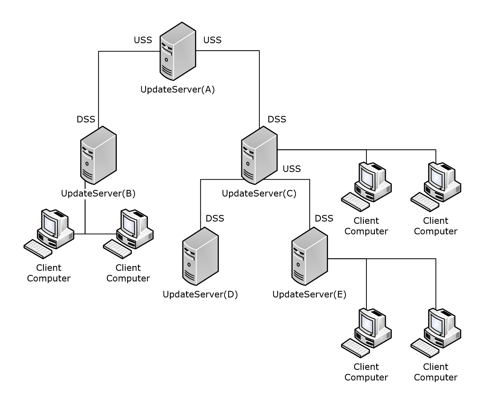
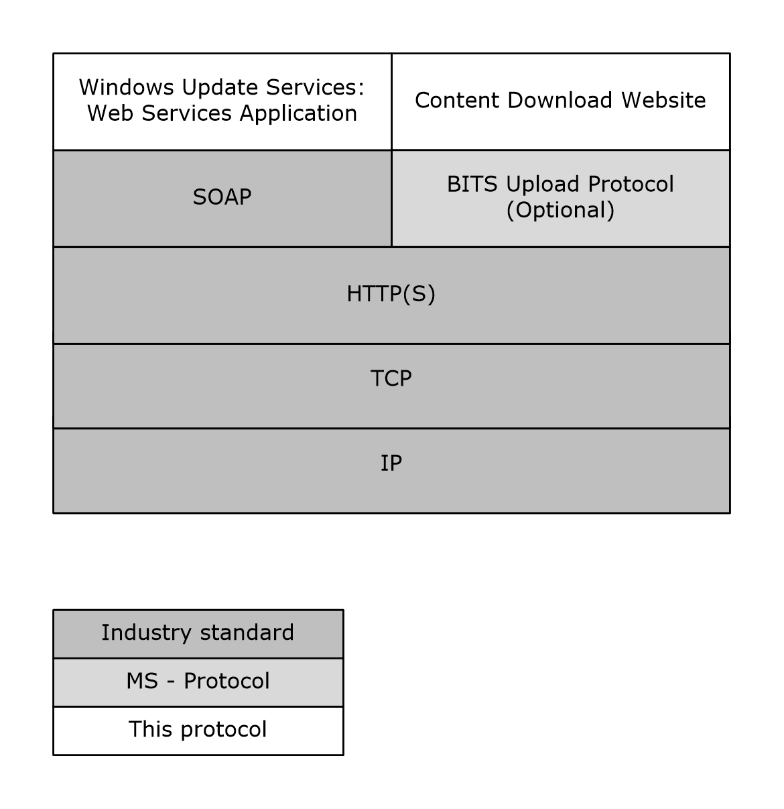
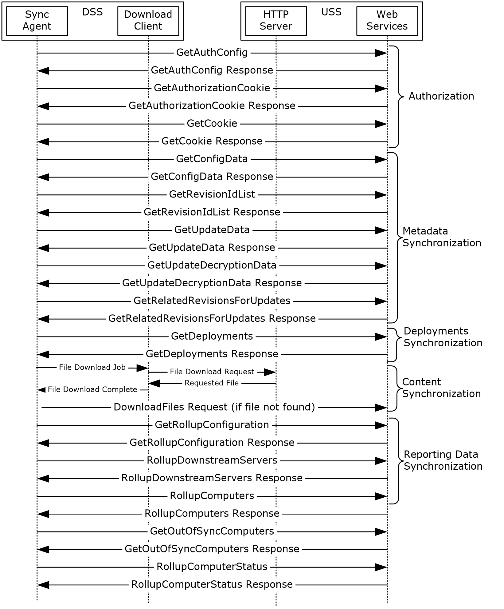

# [MS-WSUSSS]: Windows Update Services: Server-Server Protocol

Table of Contents

1 Introduction

- [1 Introduction](#Section_1)
  - [1.1 Glossary](#Section_1.1)
  - [1.2 References](#Section_1.2)
    - [1.2.1 Normative References](#Section_1.2.1)
    - [1.2.2 Informative References](#Section_1.2.2)
  - [1.3 Overview](#Section_1.3)
  - [1.4 Relationship to Other Protocols](#Section_1.4)
  - [1.5 Prerequisites/Preconditions](#Section_1.5)
  - [1.6 Applicability Statement](#Section_1.6)
  - [1.7 Versioning and Capability Negotiation](#Section_1.7)
  - [1.8 Vendor-Extensible Fields](#Section_1.8)
  - [1.9 Standards Assignments](#Section_1.9)

2 Messages

- [2 Messages](#Section_2)
  - [2.1 Transport](#Section_2.1)
  - [2.2 Common Message Syntax](#Section_2.2)
    - [2.2.1 Namespaces](#Section_2.2.1)
    - [2.2.2 Messages](#Section_2.2.2)
    - [2.2.3 Elements](#Section_2.2.3)
    - [2.2.4 Complex Types](#Section_2.2.4)
      - [2.2.4.1 ArrayOfAuthorizationCookie](#Section_2.2.4.1)
      - [2.2.4.2 ArrayOfBase64Binary](#Section_2.2.4.2)
      - [2.2.4.3 ArrayOfGuid](#Section_2.2.4.3)
      - [2.2.4.4 ArrayOfInt](#Section_2.2.4.4)
      - [2.2.4.5 ArrayOfString](#Section_2.2.4.5)
      - [2.2.4.6 ArrayOfUpdateIdentity](#Section_2.2.4.6)
      - [2.2.4.7 AuthorizationCookie](#Section_2.2.4.7)
      - [2.2.4.8 Cookie](#Section_2.2.4.8)
      - [2.2.4.9 UpdateIdentity](#Section_2.2.4.9)
    - [2.2.5 Simple Types](#Section_2.2.5)
      - [2.2.5.1 GUID](#Section_2.2.5.1)
      - [2.2.5.2 All](#Section_2.2.5.2)
    - [2.2.6 Attributes](#Section_2.2.6)
    - [2.2.7 Groups](#Section_2.2.7)
    - [2.2.8 Attribute Groups](#Section_2.2.8)
    - [2.2.9 SOAP Faults](#Section_2.2.9)
      - [2.2.9.1 Format for SOAP 1.1](#Section_2.2.9.1)
      - [2.2.9.2 Format for SOAP 1.2](#Section_2.2.9.2)
      - [2.2.9.3 ErrorCode Values](#Section_2.2.9.3)

3 Protocol Details

- [3 Protocol Details](#Section_3)
  - [3.1 USS Details](#Section_3.1)
    - [3.1.1 Abstract Data Model](#Section_3.1.1)
      - [3.1.1.1 Populating the Data Model](#Section_3.1.1.1)
    - [3.1.2 Timers](#Section_3.1.2)
    - [3.1.3 Initialization](#Section_3.1.3)
    - [3.1.4 Message Processing Events and Sequencing Rules](#Section_3.1.4)
      - [3.1.4.1 GetAuthConfig](#Section_3.1.4.1)
        - [3.1.4.1.1 Messages](#Section_3.1.4.1.1)
          - [3.1.4.1.1.1 GetAuthConfigSoapIn](#Section_3.1.4.1.1.1)
          - [3.1.4.1.1.2 GetAuthConfigSoapOut](#Section_3.1.4.1.1.2)
        - [3.1.4.1.2 Elements](#Section_3.1.4.1.2)
          - [3.1.4.1.2.1 GetAuthConfig](#Section_3.1.4.1.2.1)
          - [3.1.4.1.2.2 GetAuthConfigResponse](#Section_3.1.4.1.2.2)
        - [3.1.4.1.3 Complex Types](#Section_3.1.4.1.3)
          - [3.1.4.1.3.1 ServerAuthConfig](#Section_3.1.4.1.3.1)
          - [3.1.4.1.3.2 ArrayOfAuthPlugInInfo](#Section_3.1.4.1.3.2)
          - [3.1.4.1.3.3 AuthPlugInInfo](#Section_3.1.4.1.3.3)
      - [3.1.4.2 GetAuthorizationCookie](#Section_3.1.4.2)
        - [3.1.4.2.1 Messages](#Section_3.1.4.2.1)
          - [3.1.4.2.1.1 GetAuthorizationCookieSoapIn](#Section_3.1.4.2.1.1)
          - [3.1.4.2.1.2 GetAuthorizationCookieSoapOut](#Section_3.1.4.2.1.2)
        - [3.1.4.2.2 Elements](#Section_3.1.4.2.2)
          - [3.1.4.2.2.1 GetAuthorizationCookie](#Section_3.1.4.2.2.1)
          - [3.1.4.2.2.2 GetAuthorizationCookieResponse](#Section_3.1.4.2.2.2)
      - [3.1.4.3 GetCookie](#Section_3.1.4.3)
        - [3.1.4.3.1 Messages](#Section_3.1.4.3.1)
          - [3.1.4.3.1.1 GetCookieSoapIn](#Section_3.1.4.3.1.1)
          - [3.1.4.3.1.2 GetCookieSoapOut](#Section_3.1.4.3.1.2)
        - [3.1.4.3.2 Elements](#Section_3.1.4.3.2)
          - [3.1.4.3.2.1 GetCookie](#Section_3.1.4.3.2.1)
          - [3.1.4.3.2.2 GetCookieResponse](#Section_3.1.4.3.2.2)
      - [3.1.4.4 GetConfigData](#Section_3.1.4.4)
        - [3.1.4.4.1 Messages](#Section_3.1.4.4.1)
          - [3.1.4.4.1.1 GetConfigDataSoapIn](#Section_3.1.4.4.1.1)
          - [3.1.4.4.1.2 GetConfigDataSoapOut](#Section_3.1.4.4.1.2)
        - [3.1.4.4.2 Elements](#Section_3.1.4.4.2)
          - [3.1.4.4.2.1 GetConfigData](#Section_3.1.4.4.2.1)
          - [3.1.4.4.2.2 GetConfigDataResponse](#Section_3.1.4.4.2.2)
        - [3.1.4.4.3 Complex Types](#Section_3.1.4.4.3)
          - [3.1.4.4.3.1 ServerSyncConfigData](#Section_3.1.4.4.3.1)
          - [3.1.4.4.3.2 ArrayOfServerSyncLanguageData](#Section_3.1.4.4.3.2)
          - [3.1.4.4.3.3 ServerSyncLanguageData](#Section_3.1.4.4.3.3)
      - [3.1.4.5 GetRevisionIdList](#Section_3.1.4.5)
        - [3.1.4.5.1 Messages](#Section_3.1.4.5.1)
          - [3.1.4.5.1.1 GetRevisionIdListSoapIn](#Section_3.1.4.5.1.1)
          - [3.1.4.5.1.2 GetRevisionIdListSoapOut](#Section_3.1.4.5.1.2)
        - [3.1.4.5.2 Elements](#Section_3.1.4.5.2)
          - [3.1.4.5.2.1 GetRevisionIdList](#Section_3.1.4.5.2.1)
          - [3.1.4.5.2.2 GetRevisionIdListResponse](#Section_3.1.4.5.2.2)
        - [3.1.4.5.3 Complex Types](#Section_3.1.4.5.3)
          - [3.1.4.5.3.1 ServerSyncFilter](#Section_3.1.4.5.3.1)
          - [3.1.4.5.3.2 ArrayOfIdAndDelta](#Section_3.1.4.5.3.2)
          - [3.1.4.5.3.3 IdAndDelta](#Section_3.1.4.5.3.3)
          - [3.1.4.5.3.4 ArrayOfLanguageAndDelta](#Section_3.1.4.5.3.4)
          - [3.1.4.5.3.5 LanguageAndDelta](#Section_3.1.4.5.3.5)
          - [3.1.4.5.3.6 RevisionIdList](#Section_3.1.4.5.3.6)
      - [3.1.4.6 GetUpdateData](#Section_3.1.4.6)
        - [3.1.4.6.1 Messages](#Section_3.1.4.6.1)
          - [3.1.4.6.1.1 GetUpdateDataSoapIn](#Section_3.1.4.6.1.1)
          - [3.1.4.6.1.2 GetUpdateDataSoapOut](#Section_3.1.4.6.1.2)
        - [3.1.4.6.2 Elements](#Section_3.1.4.6.2)
          - [3.1.4.6.2.1 GetUpdateData](#Section_3.1.4.6.2.1)
          - [3.1.4.6.2.2 GetUpdateDataResponse](#Section_3.1.4.6.2.2)
        - [3.1.4.6.3 Complex Types](#Section_3.1.4.6.3)
          - [3.1.4.6.3.1 ServerUpdateData](#Section_3.1.4.6.3.1)
          - [3.1.4.6.3.2 ArrayOfServerSyncUpdateData](#Section_3.1.4.6.3.2)
          - [3.1.4.6.3.3 ServerSyncUpdateData](#Section_3.1.4.6.3.3)
          - [3.1.4.6.3.4 ArrayOfServerSyncUrlData](#Section_3.1.4.6.3.4)
          - [3.1.4.6.3.5 ServerSyncUrlData](#Section_3.1.4.6.3.5)
      - [3.1.4.7 GetDriverIdList](#Section_3.1.4.7)
        - [3.1.4.7.1 Messages](#Section_3.1.4.7.1)
          - [3.1.4.7.1.1 GetDriverIdListSoapIn](#Section_3.1.4.7.1.1)
          - [3.1.4.7.1.2 GetDriverIdListSoapOut](#Section_3.1.4.7.1.2)
        - [3.1.4.7.2 Elements](#Section_3.1.4.7.2)
          - [3.1.4.7.2.1 GetDriverIdList](#Section_3.1.4.7.2.1)
          - [3.1.4.7.2.2 GetDriverIdListResponse](#Section_3.1.4.7.2.2)
        - [3.1.4.7.3 Complex Types](#Section_3.1.4.7.3)
          - [3.1.4.7.3.1 DriverSetAndRevisionIdList](#Section_3.1.4.7.3.1)
          - [3.1.4.7.3.2 ArrayOfHardwareIdAndDelta](#Section_3.1.4.7.3.2)
          - [3.1.4.7.3.3 HardwareIdAndDelta](#Section_3.1.4.7.3.3)
          - [3.1.4.7.3.4 ServerSyncDriverFilter](#Section_3.1.4.7.3.4)
      - [3.1.4.8 GetDriverSetData](#Section_3.1.4.8)
        - [3.1.4.8.1 Messages](#Section_3.1.4.8.1)
          - [3.1.4.8.1.1 GetDriverSetDataSoapIn](#Section_3.1.4.8.1.1)
          - [3.1.4.8.1.2 GetDriverSetDataSoapOut](#Section_3.1.4.8.1.2)
        - [3.1.4.8.2 Elements](#Section_3.1.4.8.2)
          - [3.1.4.8.2.1 GetDriverSetData](#Section_3.1.4.8.2.1)
          - [3.1.4.8.2.2 GetDriverSetDataResponse](#Section_3.1.4.8.2.2)
        - [3.1.4.8.3 Complex Types](#Section_3.1.4.8.3)
          - [3.1.4.8.3.1 ServerDriverSetData](#Section_3.1.4.8.3.1)
          - [3.1.4.8.3.2 ServerSyncDriverSetData](#Section_3.1.4.8.3.2)
      - [3.1.4.9 GetRelatedRevisionsForUpdates](#Section_3.1.4.9)
      - [3.1.4.10 GetDeployments](#Section_3.1.4.10)
        - [3.1.4.10.1 Messages](#Section_3.1.4.10.1)
          - [3.1.4.10.1.1 GetDeploymentsSoapIn](#Section_3.1.4.10.1.1)
          - [3.1.4.10.1.2 GetDeploymentsSoapOut](#Section_3.1.4.10.1.2)
        - [3.1.4.10.2 Elements](#Section_3.1.4.10.2)
          - [3.1.4.10.2.1 GetDeployments](#Section_3.1.4.10.2.1)
          - [3.1.4.10.2.2 GetDeploymentsResponse](#Section_3.1.4.10.2.2)
        - [3.1.4.10.3 Complex Types](#Section_3.1.4.10.3)
          - [3.1.4.10.3.1 ServerSyncDeploymentResult](#Section_3.1.4.10.3.1)
          - [3.1.4.10.3.2 ArrayOfServerSyncTargetGroup](#Section_3.1.4.10.3.2)
          - [3.1.4.10.3.3 ServerSyncTargetGroup](#Section_3.1.4.10.3.3)
          - [3.1.4.10.3.4 ArrayOfServerSyncDeployment](#Section_3.1.4.10.3.4)
          - [3.1.4.10.3.5 ServerSyncDeployment](#Section_3.1.4.10.3.5)
      - [3.1.4.11 DownloadFiles](#Section_3.1.4.11)
        - [3.1.4.11.1 Messages](#Section_3.1.4.11.1)
          - [3.1.4.11.1.1 DownloadFilesSoapIn](#Section_3.1.4.11.1.1)
          - [3.1.4.11.1.2 DownloadFilesSoapOut](#Section_3.1.4.11.1.2)
        - [3.1.4.11.2 Elements](#Section_3.1.4.11.2)
          - [3.1.4.11.2.1 DownloadFiles](#Section_3.1.4.11.2.1)
          - [3.1.4.11.2.2 DownloadFilesResponse](#Section_3.1.4.11.2.2)
      - [3.1.4.12 Ping](#Section_3.1.4.12)
      - [3.1.4.13 GetRollupConfiguration](#Section_3.1.4.13)
        - [3.1.4.13.1 Messages](#Section_3.1.4.13.1)
          - [3.1.4.13.1.1 GetRollupConfigurationSoapIn](#Section_3.1.4.13.1.1)
          - [3.1.4.13.1.2 GetRollupConfigurationSoapOut](#Section_3.1.4.13.1.2)
        - [3.1.4.13.2 Elements](#Section_3.1.4.13.2)
          - [3.1.4.13.2.1 GetRollupConfiguration](#Section_3.1.4.13.2.1)
          - [3.1.4.13.2.2 GetRollupConfigurationResponse](#Section_3.1.4.13.2.2)
        - [3.1.4.13.3 Complex Types](#Section_3.1.4.13.3)
          - [3.1.4.13.3.1 RollupConfiguration](#Section_3.1.4.13.3.1)
      - [3.1.4.14 RollupDownstreamServers](#Section_3.1.4.14)
        - [3.1.4.14.1 Messages](#Section_3.1.4.14.1)
          - [3.1.4.14.1.1 RollupDownstreamServersSoapIn](#Section_3.1.4.14.1.1)
          - [3.1.4.14.1.2 RollupDownstreamServersSoapOut](#Section_3.1.4.14.1.2)
        - [3.1.4.14.2 Elements](#Section_3.1.4.14.2)
          - [3.1.4.14.2.1 RollupDownstreamServers](#Section_3.1.4.14.2.1)
          - [3.1.4.14.2.2 RollupDownstreamServersResponse](#Section_3.1.4.14.2.2)
        - [3.1.4.14.3 Complex Types](#Section_3.1.4.14.3)
          - [3.1.4.14.3.1 ArrayOfDownstreamServerRollupInfo](#Section_3.1.4.14.3.1)
          - [3.1.4.14.3.2 DownstreamServerRollupInfo](#Section_3.1.4.14.3.2)
          - [3.1.4.14.3.3 DownstreamServerRollupServerSummary](#Section_3.1.4.14.3.3)
          - [3.1.4.14.3.4 ArrayOfDownstreamServerRollupClientSummary](#Section_3.1.4.14.3.4)
          - [3.1.4.14.3.5 DownstreamServerRollupClientSummary](#Section_3.1.4.14.3.5)
          - [3.1.4.14.3.6 ArrayOfDownstreamServerRollupClientActivitySummary](#Section_3.1.4.14.3.6)
          - [3.1.4.14.3.7 DownstreamServerRollupClientActivitySummary](#Section_3.1.4.14.3.7)
      - [3.1.4.15 RollupComputers](#Section_3.1.4.15)
        - [3.1.4.15.1 Messages](#Section_3.1.4.15.1)
          - [3.1.4.15.1.1 RollupComputersSoapIn](#Section_3.1.4.15.1.1)
          - [3.1.4.15.1.2 RollupComputersSoapOut](#Section_3.1.4.15.1.2)
        - [3.1.4.15.2 Elements](#Section_3.1.4.15.2)
          - [3.1.4.15.2.1 RollupComputers](#Section_3.1.4.15.2.1)
          - [3.1.4.15.2.2 RollupComputersResponse](#Section_3.1.4.15.2.2)
        - [3.1.4.15.3 Complex Types](#Section_3.1.4.15.3)
          - [3.1.4.15.3.1 ArrayOfComputerRollupInfo](#Section_3.1.4.15.3.1)
          - [3.1.4.15.3.2 ComputerRollupInfo](#Section_3.1.4.15.3.2)
          - [3.1.4.15.3.3 ComputerRollupDetails](#Section_3.1.4.15.3.3)
          - [3.1.4.15.3.4 ArrayOfChangedComputer](#Section_3.1.4.15.3.4)
          - [3.1.4.15.3.5 ChangedComputer](#Section_3.1.4.15.3.5)
        - [3.1.4.15.4 Simple Types](#Section_3.1.4.15.4)
          - [3.1.4.15.4.1 ComputerChangeType](#Section_3.1.4.15.4.1)
      - [3.1.4.16 GetOutOfSyncComputers](#Section_3.1.4.16)
        - [3.1.4.16.1 Messages](#Section_3.1.4.16.1)
          - [3.1.4.16.1.1 GetOutOfSyncComputersSoapIn](#Section_3.1.4.16.1.1)
          - [3.1.4.16.1.2 GetOutOfSyncComputersSoapOut](#Section_3.1.4.16.1.2)
        - [3.1.4.16.2 Elements](#Section_3.1.4.16.2)
          - [3.1.4.16.2.1 GetOutOfSyncComputers](#Section_3.1.4.16.2.1)
          - [3.1.4.16.2.2 GetOutOfSyncComputersResponse](#Section_3.1.4.16.2.2)
        - [3.1.4.16.3 Complex Types](#Section_3.1.4.16.3)
          - [3.1.4.16.3.1 ArrayOfComputerLastRollupNumber](#Section_3.1.4.16.3.1)
          - [3.1.4.16.3.2 ComputerLastRollupNumber](#Section_3.1.4.16.3.2)
      - [3.1.4.17 RollupComputerStatus](#Section_3.1.4.17)
        - [3.1.4.17.1 Messages](#Section_3.1.4.17.1)
          - [3.1.4.17.1.1 RollupComputerStatusSoapIn](#Section_3.1.4.17.1.1)
          - [3.1.4.17.1.2 RollupComputerStatusSoapOut](#Section_3.1.4.17.1.2)
        - [3.1.4.17.2 Elements](#Section_3.1.4.17.2)
          - [3.1.4.17.2.1 RollupComputerStatus](#Section_3.1.4.17.2.1)
          - [3.1.4.17.2.2 RollupComputerStatusResponse](#Section_3.1.4.17.2.2)
        - [3.1.4.17.3 Complex Types](#Section_3.1.4.17.3)
          - [3.1.4.17.3.1 ArrayOfComputerStatusRollupInfo](#Section_3.1.4.17.3.1)
          - [3.1.4.17.3.2 ComputerStatusRollupInfo](#Section_3.1.4.17.3.2)
          - [3.1.4.17.3.3 ArrayOfComputerStatusRollupUpdateStatus](#Section_3.1.4.17.3.3)
          - [3.1.4.17.3.4 ComputerStatusRollupUpdateStatus](#Section_3.1.4.17.3.4)
      - [3.1.4.18 GetUpdateDecryptionData](#Section_3.1.4.18)
        - [3.1.4.18.1 Messages](#Section_3.1.4.18.1)
          - [3.1.4.18.1.1 GetUpdateDecryptionDataSoapIn](#Section_3.1.4.18.1.1)
          - [3.1.4.18.1.2 GetUpdateDecryptionDataSoapOut](#Section_3.1.4.18.1.2)
        - [3.1.4.18.2 Elements](#Section_3.1.4.18.2)
          - [3.1.4.18.2.1 GetUpdateDecryptionData](#Section_3.1.4.18.2.1)
          - [3.1.4.18.2.2 GetUpdateDecryptionDataResponse](#Section_3.1.4.18.2.2)
        - [3.1.4.18.3 Complex Types](#Section_3.1.4.18.3)
          - [3.1.4.18.3.1 ServerDecryptionData](#Section_3.1.4.18.3.1)
          - [3.1.4.18.3.2 ArrayOfServerSyncUpdateFileDecryption](#Section_3.1.4.18.3.2)
          - [3.1.4.18.3.3 ServerSyncUpdateFileDecryption](#Section_3.1.4.18.3.3)
          - [3.1.4.18.3.4 ArrayOfServerSyncFileDecryption](#Section_3.1.4.18.3.4)
          - [3.1.4.18.3.5 ServerSyncFileDecryption](#Section_3.1.4.18.3.5)
    - [3.1.5 Timer Events](#Section_3.1.5)
    - [3.1.6 Other Local Events](#Section_3.1.6)
  - [3.2 DSS Details](#Section_3.2)
    - [3.2.1 Abstract Data Model](#Section_3.2.1)
    - [3.2.2 Timers](#Section_3.2.2)
    - [3.2.3 Initialization](#Section_3.2.3)
    - [3.2.4 Message Processing Events and Sequencing Rules](#Section_3.2.4)
      - [3.2.4.1 Authorization](#Section_3.2.4.1)
      - [3.2.4.2 Metadata Synchronization](#Section_3.2.4.2)
      - [3.2.4.3 Deployments Synchronization](#Section_3.2.4.3)
      - [3.2.4.4 Content Synchronization](#Section_3.2.4.4)
      - [3.2.4.5 Reporting Data Synchronization](#Section_3.2.4.5)
    - [3.2.5 Timer Events](#Section_3.2.5)
    - [3.2.6 Other Local Events](#Section_3.2.6)

4 Protocol Examples

- [4 Protocol Examples](#Section_4)

5 Security

- [5 Security](#Section_5)
  - [5.1 Security Considerations for Implementers](#Section_5.1)
  - [5.2 Index of Security Parameters](#Section_5.2)

6 Appendix A: Full WSDL

- [6 Appendix A: Full WSDL](#Section_6)
  - [6.1 Server Sync Web Service](#Section_6.1)
  - [6.2 DSS Authorization Web Service](#Section_6.2)
  - [6.3 Reporting Web Service](#Section_6.3)

7 Appendix B: Product Behavior

- [7 Appendix B: Product Behavior](#Section_7)

8 Change Tracking

- [8 Change Tracking](#Section_8)

For the legal notice and IP terms, see [LEGAL.md](../LEGAL.md).
Last updated: 4/23/2024.
See [Revision History](#revision-history) for full version history.

# 1 Introduction

This document specifies the Windows Server Update Services: Server-Server Protocol, which enables a hierarchically organized collection of servers to synchronize [**metadata**](#gt_metadata) and [**content**](#gt_content) associated with software updates over the Internet by using the [**SOAP**](#gt_soap) and HTTP protocols.

Sections 1.5, 1.8, 1.9, 2, and 3 of this specification are normative. All other sections and examples in this specification are informative.

## 1.1 Glossary

This document uses the following terms:

**anchor**: An opaque data element generated by an [**update server**](#gt_update-server) to identify the occurrence of a software [**update**](#gt_update)-related event in a manner that distinguishes temporally separate occurrences of the event.

**autonomous DSS**: A downstream server (DSS) that obtains updates from its upstream server (USS) but manages the deployments of the updates to its client computers independently from its USS.

**base64 encoding**: A binary-to-text encoding scheme whereby an arbitrary sequence of bytes is converted to a sequence of printable ASCII characters, as described in [[RFC4648]](https://go.microsoft.com/fwlink/?LinkId=90487).

**category**: A logical grouping of [**updates**](#gt_update) identified by a [**GUID**](#gt_globally-unique-identifier-guid) and described by [**metadata**](#gt_metadata). A category can be treated as an [**update**](#gt_update) with no associated [**content**](#gt_content).

**client computer**: A computer that instigates a connection to a well-known port on a server.

**content**: A package that contains all the associated files for an [**update**](#gt_update) that is to be installed on a [**client computer**](#gt_client-computer).

**deployment**: An administratively specified decision to make a specific [**update**](#gt_update) [**revision**](#gt_revision) available to a specific [**target group**](#gt_target-group).

**detectoid**: A logical condition that is evaluated on a [**client computer**](#gt_client-computer) to detect the presence of software, drivers, or their [**updates**](#gt_update). A [**detectoid**](#gt_detectoid) is identified by a [**GUID**](#gt_globally-unique-identifier-guid) and described by [**metadata**](#gt_metadata). It is represented as an [**update**](#gt_update) with no associated [**content**](#gt_content).

**Domain Name System (DNS)**: A hierarchical, distributed database that contains mappings of domain names to various types of data, such as IP addresses. DNS enables the location of computers and services by user-friendly names, and it also enables the discovery of other information stored in the database.

**downstream server (DSS)**: An [**update server**](#gt_update-server) that synchronizes its [**updates**](#gt_update) from another [**update server**](#gt_update-server).

**DSS Authorization Web Service**: A web service on the upstream server (USS) used to authorize the release of updates to downstream servers (DSSs).

**End User License Agreement (EULA)**: A textual description of the terms that a user or administrator accepts before an [**update**](#gt_update) is installed. Each [**EULA**](#gt_end-user-license-agreement-eula) is identified by a [**GUID**](#gt_globally-unique-identifier-guid), and each update [**revision**](#gt_revision) might be associated with a [**EULA**](#gt_end-user-license-agreement-eula).

**fully qualified domain name (FQDN)**: An unambiguous domain name that gives an absolute location in the [**Domain Name System's (DNS)**](#gt_604dcfcd-72f5-46e5-85c1-f3ce69956700) hierarchy tree, as defined in [[RFC1035]](https://go.microsoft.com/fwlink/?LinkId=90264) section 3.1 and [[RFC2181]](https://go.microsoft.com/fwlink/?LinkId=127732) section 11.

**globally unique identifier (GUID)**: A term used interchangeably with universally unique identifier (UUID) in Microsoft protocol technical documents (TDs). Interchanging the usage of these terms does not imply or require a specific algorithm or mechanism to generate the value. Specifically, the use of this term does not imply or require that the algorithms described in [[RFC4122]](https://go.microsoft.com/fwlink/?LinkId=90460) or [[C706]](https://go.microsoft.com/fwlink/?LinkId=89824) must be used for generating the [**GUID**](#gt_globally-unique-identifier-guid). See also universally unique identifier (UUID).

**metadata**: XML-formatted data that defines the characteristics of an [**update**](#gt_update), including its title, description, rules for determining whether the [**update**](#gt_update) is applicable to a [**client computer**](#gt_client-computer), and instructions for installing the [**update**](#gt_update) content.

**Microsoft Update**: A Microsoft-hosted website located at http://update.microsoft.com.

**patch storage format (PSF)**: A version of a content file that includes only changes in binary content from a previous version of a software/driver binary.

**replica DSS**: A [**DSS**](#gt_downstream-server-dss) that obtains both [**updates**](#gt_update) and update [**deployments**](#gt_deployments) from its [**USS**](#gt_upstream-server-uss).

**revision**: A specific version of an [**update**](#gt_update) that is identified by a combination of an UpdateID [**GUID**](#gt_globally-unique-identifier-guid) and a 32-bit revision number.

**Server Sync Web Service**: A web service on the upstream server (USS) that provides updates of metadata and deployment information to the downstream servers (DSSs).

**SHA-1 hash**: A hashing algorithm as specified in [[FIPS180-2]](https://go.microsoft.com/fwlink/?LinkId=89868) that was developed by the National Institute of Standards and Technology (NIST) and the National Security Agency (NSA).

**SOAP**: A lightweight protocol for exchanging structured information in a decentralized, distributed environment. [**SOAP**](#gt_soap) uses XML technologies to define an extensible messaging framework, which provides a message construct that can be exchanged over a variety of underlying protocols. The framework has been designed to be independent of any particular programming model and other implementation-specific semantics. SOAP 1.2 supersedes SOAP 1.1. See [[SOAP1.2-1/2003]](https://go.microsoft.com/fwlink/?LinkId=90521).

**SOAP fault**: A container for error and status information within a [**SOAP message**](#gt_soap-message). See [[SOAP1.2-1/2007]](https://go.microsoft.com/fwlink/?LinkId=94664) section 5.4 for more information.

**SOAP message**: An XML document consisting of a mandatory SOAP envelope, an optional SOAP header, and a mandatory SOAP body. See [SOAP1.2-1/2007] section 5 for more information.

**target group**: A named collection of [**client computers**](#gt_client-computer) whose members are defined administratively.

**update**: An add, modify, or delete of one or more objects or attribute values. See originating update, replicated update.

**update classification**: A scheme to classify [**updates**](#gt_update) such as Critical, Security, Service Pack, and so on. An [**update classification**](#gt_update-classification) is identified by a [**GUID**](#gt_globally-unique-identifier-guid) and described by [**metadata**](#gt_metadata). It can be treated as an [**update**](#gt_update) with no associated [**content**](#gt_content).

**update server**: A computer that implements the Windows Server Update Services: Server-Server Protocol or the Windows Server Update Services: Client-Server Protocol to provide [**updates**](#gt_update) to [**client computers**](#gt_client-computer) and other [**update servers**](#gt_update-server).

**upstream server (USS)**: An [**update server**](#gt_update-server) that provides [**updates**](#gt_update) to other [**update servers**](#gt_update-server).

**web method**: A discrete operation exposed by a web service, called using a single SOAP message.

**web service**: (1) A unit of application logic that provides data and services to other applications and can be called by using standard Internet transport protocols such as HTTP, Simple Mail Transfer Protocol (SMTP), or File Transfer Protocol (FTP). Web services can perform functions that range from simple requests to complicated business processes.

(2) A software entity that responds to SOAP messages ([[SOAP1.1]](https://go.microsoft.com/fwlink/?LinkId=90520),.[[WSDL]](https://go.microsoft.com/fwlink/?LinkId=90577)).

**Web Services Description Language (WSDL)**: An XML format for describing network services as a set of endpoints that operate on messages that contain either document-oriented or procedure-oriented information. The operations and messages are described abstractly and are bound to a concrete network protocol and message format in order to define an endpoint. Related concrete endpoints are combined into abstract endpoints, which describe a network service. WSDL is extensible, which allows the description of endpoints and their messages regardless of the message formats or network protocols that are used.

**Windows Server Update Services (WSUS)**: An optional component that enables a machine to operate as an [**update server**](#gt_update-server).

**MAY, SHOULD, MUST, SHOULD NOT, MUST NOT:** These terms (in all caps) are used as defined in [[RFC2119]](https://go.microsoft.com/fwlink/?LinkId=90317). All statements of optional behavior use either MAY, SHOULD, or SHOULD NOT.

## 1.2 References

Links to a document in the Microsoft Open Specifications library point to the correct section in the most recently published version of the referenced document. However, because individual documents in the library are not updated at the same time, the section numbers in the documents may not match. You can confirm the correct section numbering by checking the [Errata](https://go.microsoft.com/fwlink/?linkid=850906).

### 1.2.1 Normative References

We conduct frequent surveys of the normative references to assure their continued availability. If you have any issue with finding a normative reference, please contact [dochelp@microsoft.com](mailto:dochelp@microsoft.com). We will assist you in finding the relevant information.

[MS-DRSR] Microsoft Corporation, "[Directory Replication Service (DRS) Remote Protocol](../MS-DRSR/MS-DRSR.md)".

[MS-LCID] Microsoft Corporation, "[Windows Language Code Identifier (LCID) Reference](../MS-LCID/MS-LCID.md)".

[MS-WUSP] Microsoft Corporation, "[Windows Update Services: Client-Server Protocol](../MS-WUSP/MS-WUSP.md)".

[RFC1035] Mockapetris, P., "Domain Names - Implementation and Specification", STD 13, RFC 1035, November 1987, [https://www.rfc-editor.org/info/rfc1035](https://go.microsoft.com/fwlink/?LinkId=90264)

[RFC2119] Bradner, S., "Key words for use in RFCs to Indicate Requirement Levels", BCP 14, RFC 2119, March 1997, [https://www.rfc-editor.org/info/rfc2119](https://go.microsoft.com/fwlink/?LinkId=90317)

[RFC2616] Fielding, R., Gettys, J., Mogul, J., et al., "Hypertext Transfer Protocol -- HTTP/1.1", RFC 2616, June 1999, [https://www.rfc-editor.org/info/rfc2616](https://go.microsoft.com/fwlink/?LinkId=90372)

[SOAP1.1] Box, D., Ehnebuske, D., Kakivaya, G., et al., "Simple Object Access Protocol (SOAP) 1.1", W3C Note, May 2000, [https://www.w3.org/TR/2000/NOTE-SOAP-20000508/](https://go.microsoft.com/fwlink/?LinkId=90520)

[SOAP1.2-1/2003] Gudgin, M., Hadley, M., Mendelsohn, N., et al., "SOAP Version 1.2 Part 1: Messaging Framework", W3C Recommendation, June 2003, [http://www.w3.org/TR/2003/REC-soap12-part1-20030624](https://go.microsoft.com/fwlink/?LinkId=90521)

[SOAP1.2-2/2003] Gudgin, M., Hadley, M., Mendelsohn, N., et al., "SOAP Version 1.2 Part 2: Adjuncts", W3C Recommendation, June 2003, [http://www.w3.org/TR/2003/REC-soap12-part2-20030624](https://go.microsoft.com/fwlink/?LinkId=90522)

[WSDL] Christensen, E., Curbera, F., Meredith, G., and Weerawarana, S., "Web Services Description Language (WSDL) 1.1", W3C Note, March 2001, [https://www.w3.org/TR/2001/NOTE-wsdl-20010315](https://go.microsoft.com/fwlink/?LinkId=90577)

[XML Namespaces] Bray, T., Hollander, D., and Layman, A., "Namespaces in XML", W3C Recommendation, January 1999, [http://www.w3.org/TR/1999/REC-xml-names-19990114/](https://go.microsoft.com/fwlink/?LinkId=90597)

[XMLNS-2ED] Bray, T., Hollander, D., Layman, A., and Tobin, R., Eds., "Namespaces in XML 1.0 (Second Edition)", W3C Recommendation, August 2006, [https://www.w3.org/TR/2006/REC-xml-names-20060816/](https://go.microsoft.com/fwlink/?LinkId=90602)

[XPATH] Clark, J. and DeRose, S., "XML Path Language (XPath), Version 1.0", W3C Recommendation, November 1999, [http://www.w3.org/TR/1999/REC-xpath-19991116/](https://go.microsoft.com/fwlink/?LinkId=90611)

### 1.2.2 Informative References

[MC-BUP] Microsoft Corporation, "[Background Intelligent Transfer Service (BITS) Upload Protocol](../MC-BUP/MC-BUP.md)".

[MSDN-BITS] Microsoft Corporation, "Background Intelligent Transfer Service", [http://msdn.microsoft.com/en-us/library/bb968799(VS.85).aspx](https://go.microsoft.com/fwlink/?LinkId=89959)

[MSDN-CAB] Microsoft Corporation, "Microsoft Cabinet Format", March 1997, [http://msdn.microsoft.com/en-us/library/bb417343.aspx](https://go.microsoft.com/fwlink/?LinkId=226293)

## 1.3 Overview

The [**Windows Server Update Services (WSUS)**](#gt_windows-server-update-services-wsus) protocols provides support for central publication and distribution of software components and software [**updates**](#gt_update) from server machines to client machines, and for hierarchical synchronization of available software components between servers.

This specification defines the Windows Server Update Services: Server-Server Protocol, which enables synchronization of updates within a hierarchical topology of [**update servers**](#gt_update-server).

This protocol is a [**SOAP**](#gt_soap)-based protocol that uses HTTP 1.1 as its transport.

The following figure shows a typical hierarchical topology of update servers and [**client computers**](#gt_client-computer). An [**upstream server (USS)**](#gt_upstream-server-uss) in a hierarchy provides information on software and drivers to [**downstream servers (DSSs)**](#gt_downstream-server-dss). Any update server in the hierarchy can serve simultaneously as a DSS with respect to its upstream server and as a USS with respect to its downstream servers. For example, in the following figure, update server C acts as a DSS when communicating with its upstream server A and acts as a USS when communicating with its downstream server D or E.

Figure 1: Typical hierarchical topology of update servers and client computers

An update server groups its client computers into [**target groups**](#gt_target-group). An update server can be configured to deploy the updates to its client computers by assigning the updates to the target groups for [**deployment**](#gt_deployments) and, optionally, by specifying an installation or removal deadline. This mapping of the individual update [**revisions**](#gt_revision) to target groups is known as a deployment.

There are two types of DSS defined by this protocol: autonomous and replica. Either type of DSS gets its updates from the USS. However, only a [**replica DSS**](#gt_replica-dss) gets the deployments from its USS. The [**autonomous DSS**](#gt_autonomous-dss) manages its deployments independently from the USS.

This specification describes the communication between two adjacent update servers in such a hierarchy.

This specification does not cover the format of self-update binaries, update [**metadata**](#gt_metadata), and update [**content**](#gt_content).<1>

## 1.4 Relationship to Other Protocols

The [**web services (2)**](#gt_a96bfb18-c329-40f5-89fd-df7a94b89882) application protocol uses [**SOAP**](#gt_soap) over HTTP or Hypertext Transfer Protocol over Secure Sockets Layer (HTTPS), as specified in [[SOAP1.1]](https://go.microsoft.com/fwlink/?LinkId=90520), for communication. The [**content**](#gt_content) files are downloaded using HTTP 1.1, as specified in [[RFC2616]](https://go.microsoft.com/fwlink/?LinkId=90372).

Figure 2: Relationship of this protocol to other protocols

Content download can be accomplished using the Background Intelligent Transfer Service (BITS) Upload protocol described in [MC-BUP](../MC-BUP/MC-BUP.md). This can also be accomplished using HTTP 1.1 Byte Range requests, as specified in [RFC2616] section 14.35, or simple HTTP GET requests, as specified in [RFC2616] section 9.3.

This protocol is closely related to the Windows Server Update Services: Client-Server Protocol, as specified in [MS-WUSP](../MS-WUSP/MS-WUSP.md), which is used for communication between update servers and client computers.

To resolve [**fully qualified domain names (FQDNs)**](#gt_fully-qualified-domain-name-fqdn) into IP addresses, the implementer of this protocol either provides or uses an implementation of the [**Domain Name System**](#gt_domain-name-system-dns) as defined in [[RFC1035]](https://go.microsoft.com/fwlink/?LinkId=90264).

## 1.5 Prerequisites/Preconditions

This protocol imposes the following requirement on update server implementations:

- This document specifies how the binaries and [**metadata**](#gt_metadata) are distributed using the server-server communications protocol. It does not specify the format of the binaries or metadata themselves, but it assumes that the metadata is well-formed XML that is compatible with the XPATH queries, as specified in section [3.1.1.1](#Section_3.1.1.1), for populating the update server data model. In all other respects, the binaries and metadata are treated as opaque by update servers.
This protocol imposes the following requirements on DSS implementations:

- An implementation-specific way of learning the [**FQDN**](#gt_fully-qualified-domain-name-fqdn) or IP address and the TCP/IP port of the USS.
- This protocol does not mandate the use of HTTPS. However, when a USS is configured to require HTTPS, the DSS needs an implementation-specific way of learning the root X509 certificate to be used for verifying the server.
- The protocol does not require the authentication of a DSS. However, when a USS is configured to require authentication, the DSS requires an implementation-specific way of learning the authentication scheme to be used and the identity information to be passed to USS for authenticating the DSS.

## 1.6 Applicability Statement

This protocol is applicable in environments in which there is a need to synchronize software updates within a hierarchical topology of update servers.

## 1.7 Versioning and Capability Negotiation

This document covers versioning issues in the following areas.

**Supported Transports**: This protocol is implemented on top of HTTP and HTTPS, as specified in section [2.1](#Section_2.1). The protocol supports the use of either SOAP 1.2 ([[SOAP1.2-1/2003]](https://go.microsoft.com/fwlink/?LinkId=90521) and [[SOAP1.2-2/2003]](https://go.microsoft.com/fwlink/?LinkId=90522)) or SOAP 1.1 ([[SOAP1.1]](https://go.microsoft.com/fwlink/?LinkId=90520)). This configuration option has to match on both ends of the communication, and is not negotiated within the protocol.

**Protocol Versions**: There are six versions of this protocol, as shown in the following table.<2>

| Protocol version | WSUS version implementing this protocol version | Number of update languages supported (see section 2.2.4.4) | Perform reporting data synchronization (see section 3.2.5) |
| --- | --- | --- | --- |
| 1.1 | WSUS 2.0 | 63 | No |
| 1.2 | WSUS 2.0 SP1 | 511 | No |
| 1.3 | WSUS 3.0 | 511 | Yes |
| 1.6 | WSUS 3.0 SP1 | 511 | Yes |
| 1.8 | WSUS 3.0 SP2 | 511 | Yes |
| 1.20 | WSUS 10.0 | 511 | Yes |

## 1.8 Vendor-Extensible Fields

This protocol does not define any vendor-extensible fields.

## 1.9 Standards Assignments

The following standard XML namespaces (as specified in [[XML Namespaces]](https://go.microsoft.com/fwlink/?LinkId=90597)) are used in this protocol:

- http://schemas.xmlsoap.org/wsdl/http/
- http://www.w3.org/2001/XMLSchema
- http://schemas.xmlsoap.org/wsdl/soap/
- http://schemas.xmlsoap.org/wsdl/soap12/
- http://schemas.xmlsoap.org/soap/encoding/
- http://schemas.xmlsoap.org/wsdl/
In addition, Microsoft defines the following new XML namespaces for use within this protocol:

- http://microsoft.com/wsdl/types/
- http://www.microsoft.com/SoftwareDistribution/
- http://www.microsoft.com/SoftwareDistribution/Server/DssAuthWebService

# 2 Messages

This protocol consists of a set of [**SOAP**](#gt_soap)-based [**Web services (1)**](#gt_a96bfb18-c329-40f5-89fd-df7a94b89882) and a content download service that enables [**content**](#gt_content) to be downloaded from the USS using HTTP, as specified in [[RFC2616]](https://go.microsoft.com/fwlink/?LinkId=90372) section 5.

## 2.1 Transport

The Windows Updated Services: Server-Server Protocol operates over the following transports:

- Web Services: SOAP 1.1 ([[SOAP1.1]](https://go.microsoft.com/fwlink/?LinkId=90520)) or SOAP 1.2 ([[SOAP1.2-1/2003]](https://go.microsoft.com/fwlink/?LinkId=90521) and [[SOAP1.2-2/2003]](https://go.microsoft.com/fwlink/?LinkId=90522)) over HTTP or HTTPS over TCP/IP ([[RFC2616]](https://go.microsoft.com/fwlink/?LinkId=90372))
- USS Content Download: HTTP over TCP/IP ([RFC2616])
The web services MUST operate on the following URI endpoints.

| Web service | Location |
| --- | --- |
| [**Server Sync Web Service**](#gt_server-sync-web-service) | http://<server>:<server port>/ServerSyncWebService/ServerSyncWebService.asmx |
| [**DSS Authorization Web Service**](#gt_dss-authorization-web-service) | http://<server>:<server port>/ dssauthWebService/dssauthWebService.asmx |
| Reporting Web Service | http://<server>:<server port>/ReportingWebService/ReportingWebService.asmx |

Each web service MUST be bound to the HTTP transport, as specified in the following [**Web Services Description Language (WSDL)**](#gt_web-services-description-language-wsdl) element.

<soap:binding transport="http://schemas.xmlsoap.org/soap/http" />

Each web service MUST support [**SOAP**](#gt_soap) over HTTP, as specified in [RFC2616]. Each Web service SHOULD support HTTPS for securing its communication with clients.<3>

To optimize network bandwidth, the DSS MAY request that the reply be compressed by specifying the encoding format in the HTTP **Accept-Encoding** request-header field (as specified in [RFC2616] section 14.3).<4> The USS SHOULD compress the reply in the requested format.

[**USS**](#gt_upstream-server-uss) Content Download

The USS Content Download MUST operate on the following URI endpoints.

http://<server>:<server port>/Content/<folder name>/<content file name>

where:

- <server> is the IP address or [**FQDN**](#gt_fully-qualified-domain-name-fqdn) of the USS.
- <server port> is the TCP/IP port on which the USS supports this protocol.
- <folder name> is the last two hexadecimal digits of the SHA1 hash for the file to be downloaded. The SHA1 hash is sent down in the [GetUpdateData](#Section_3.1.4.6) (section 3.1.4.6) call.
- <content file name> is the name of the content file.
The following rules MUST be applied to the configuration of the USS Content Download transport based on the configuration of the USS Web Services transport:<5>

- If USS Web Services uses HTTP, USS Content Download uses HTTP over TCP port 80.
- If USS Web Services uses HTTPS over TCP port 443, USS Content Download uses HTTP over port 80.
- If USS Web Services uses HTTPS over TCP port N, where N is not 443, USS Content Download uses HTTP over port N–1.
A USS Content Download SHOULD<6> support HTTP 1.1 Byte Range requests, as specified in [RFC2616] section 14.35. The downloaded [**content**](#gt_content) files are binary.

## 2.2 Common Message Syntax

This section specifies the syntax of [**SOAP messages**](#gt_soap-message) exchanged by the protocol. The following rules apply to all SOAP messages in the protocol:

- The <soap:header> element ([[SOAP1.1]](https://go.microsoft.com/fwlink/?LinkId=90520) section 4.2 and [[SOAP1.2-1/2003]](https://go.microsoft.com/fwlink/?LinkId=90521) section 5.2) MUST NOT be used.
- The <soap:binding> element of the WSDL MUST specify style="document", as specified in [[WSDL]](https://go.microsoft.com/fwlink/?LinkId=90577) section 3.3.
- The <soap:body> element of the WSDL MUST specify use="literal", as specified in [WSDL] section 3.5.
In the sections that follow, excerpts are given from the WSDL file for this protocol. In the WSDL file, the minOccurs and maxOccurs attributes are used to specify options and cardinality of all elements, except where otherwise specified.

For certain WSDL elements, the protocol specifies additional restrictions beyond those specified by the WSDL syntax of the elements. For instance, in some cases, the protocol always requires the presence of an element in a message, even though its WSDL specification has a minOccurs attribute set to 0. In other cases, the protocol requires stronger typing on elements than is specified by the WSDL for the elements.

In all such cases, the additional restrictions are described immediately after the WSDL is given.

### 2.2.1 Namespaces

This specification defines and references various XML namespaces using the mechanisms specified in [[XMLNS-2ED]](https://go.microsoft.com/fwlink/?LinkId=90602). Although this specification associates a specific XML namespace prefix for each XML namespace that is used, the choice of any particular XML namespace prefix is implementation-specific and not significant for interoperability.

| Prefix | Namespace URI | Reference |
| --- | --- | --- |
| tns | http://www.microsoft.com/SoftwareDistribution | - |
| xsd | http://www.w3.org/2001/XMLSchema | - |
| http | http://schemas.xmlsoap.org/wsdl/http/ | - |
| S | http://www.w3.org/2001/XMLSchema | - |
| Soap | http://schemas.xmlsoap.org/wsdl/soap/ | - |
| soap12 | http://schemas.xmlsoap.org/wsdl/soap12/ | - |
| soapenc | http://schemas.xmlsoap.org/soap/encoding/ | - |
| Wsdl | http://schemas.xmlsoap.org/wsdl/ | - |

The following table shows the Microsoft-defined XML namespaces used within this protocol and the alias (prefix) used in the remaining sections of this protocol specification.

| Prefix | Namespace URI | Reference |
| --- | --- | --- |
| s1 | http://microsoft.com/wsdl/types/ | - |
| s2 | The target namespace. The XML namespace it refers to depends on the WSDL file it is used in. For [**DSS Authorization Web Service**](#gt_dss-authorization-web-service) WSDL, [**Server Sync Web Service**](#gt_server-sync-web-service) WSDL, and Reporting Web Service WSDL, it is http://www.microsoft.com/SoftwareDistribution/Server/IMonitorable | - |

The following sections define the common data types that are used in this protocol.

### 2.2.2 Messages

None.

### 2.2.3 Elements

None.

### 2.2.4 Complex Types

The following table summarizes the set of common XML schema complex type definitions defined by this specification. XML schema complex type definitions that are specific to a particular operation are described with the operation.

| Complex type | Description |
| --- | --- |
| [ArrayOfAuthorizationCookie](#Section_3.2.4.1) | An array of [AuthorizationCookie](#Section_2.2.4.7) objects. |
| [ArrayOfBase64Binary](#Section_2.2.4.2) | An array of binary values encoded in [**base64**](#gt_179b9392-9019-45a3-880b-26f6890522b7). |
| [ArrayOfGuid](#Section_2.2.4.3) | An array of [GUIDs](#Section_2.2.5.1) used in messages within this protocol. |
| [ArrayofInt](#Section_2.2.4.4) | An array of integer values used in messages within the protocol. |
| [ArrayOfString](#Section_2.2.4.5) | An array of strings used in messages within this protocol. |
| [ArrayOfUpdateIdentity](#Section_2.2.4.6) | An array of [UpdateIdentity](#Section_2.2.4.9) objects used in messages within the protocol. |
| AuthorizationCookie | An object returned by the [**USS**](#gt_upstream-server-uss) on successful completion of the [GetAuthorizationCookie](#Section_3.1.4.2.2.1) operation. |
| [Cookie](#Section_2.2.4.8) | An object generated by the USS to opaquely capture USS protocol state for submission by the [**DSS**](#gt_downstream-server-dss) in subsequent protocol operations. |
| UpdateIdentity | A GUID for a specific [**revision**](#gt_revision) of an update. |

#### 2.2.4.1 ArrayOfAuthorizationCookie

This is an array of [AuthorizationCookie](#Section_2.2.4.7) objects that is defined in the namespace: http://www.microsoft.com/SoftwareDistribution.

<s:complexType name="ArrayOfAuthorizationCookie">

<s:sequence>

<s:element minOccurs="0" maxOccurs="unbounded"

name="AuthorizationCookie" nillable="true"

type="tns:AuthorizationCookie" />

</s:sequence>

</s:complexType>

#### 2.2.4.2 ArrayOfBase64Binary

This is an array of binary values encoded in [**base64**](#gt_179b9392-9019-45a3-880b-26f6890522b7).

It is defined in the namespace: http://www.microsoft.com/SoftwareDistribution.

<s:complexType name="ArrayOfBase64Binary">

<s:sequence>

<s:element minOccurs="0" maxOccurs="unbounded"

name="base64Binary" nillable="true"

type="s:base64Binary" />

</s:sequence>

</s:complexType>

#### 2.2.4.3 ArrayOfGuid

This complex type is an array of [**GUIDs**](#gt_globally-unique-identifier-guid) used in messages within this protocol. It is defined in the namespace: http://www.microsoft.com/SoftwareDistribution.

<s:complexType name="ArrayOfGuid">

<s:sequence>

<s:element minOccurs="0" maxOccurs="unbounded" name="guid"

type="s1:guid" />

</s:sequence>

</s:complexType>

#### 2.2.4.4 ArrayOfInt

This complex type is an array of integer values used in messages within the protocol. It is defined in the namespace: http://www.microsoft.com/SoftwareDistribution.

<s:complexType name="ArrayOfInt">

<s:sequence>

<s:element minOccurs="0" maxOccurs="unbounded" name="int"

type="s:int" />

</s:sequence>

</s:complexType>

#### 2.2.4.5 ArrayOfString

This complex type is an array of strings used in messages within this protocol. It is defined in the namespace: http://www.microsoft.com/SoftwareDistribution.

<s:complexType name="ArrayOfString">

<s:sequence>

<s:element minOccurs="0" maxOccurs="unbounded" name="string"

nillable="true" type="s:string" />

</s:sequence>

</s:complexType>

#### 2.2.4.6 ArrayOfUpdateIdentity

This complex type is an array of [UpdateIdentity](#Section_2.2.4.9) objects used in messages within the protocol. It is defined in the namespace: http://www.microsoft.com/SoftwareDistribution.

<s:complexType name="ArrayOfUpdateIdentity">

<s:sequence>

<s:element minOccurs="0" maxOccurs="unbounded"

name="UpdateIdentity" nillable="true"

type="tns:UpdateIdentity" />

</s:sequence>

</s:complexType>

#### 2.2.4.7 AuthorizationCookie

This complex type is an object returned by the USS on successful completion of the [GetAuthorizationCookie](#Section_3.1.4.2.2.1) operation. It is defined in the namespace: http://www.microsoft.com/SoftwareDistribution.

<s:complexType name="AuthorizationCookie">

<s:sequence>

<s:element minOccurs="0" maxOccurs="1" name="PlugInId"

type="s:string" />

<s:element minOccurs="0" maxOccurs="1" name="CookieData"

type="s:base64Binary" />

</s:sequence>

</s:complexType>

**PlugInId**: The name identifying the Authorization PlugIn issuing the AuthorizationCookie.

**CookieData**: An opaque sequence of bytes constituting the data for the authorization cookie. The USS creates the data and interprets its [**content**](#gt_content). The DSS does not interpret the content of this element. The format of the data is implementation-dependent; however, the USS that generated this data MUST be able to obtain the following information from the data:<7>

- [**Globally unique identifier (GUID)**](#gt_globally-unique-identifier-guid) identifying the DSS
- List of target groups to which the DSS belongs
- Cookie expiration time

#### 2.2.4.8 Cookie

This complex type is an object generated by the USS to opaquely capture USS protocol state for submission by the DSS in subsequent protocol operations. It is defined in the namespace: http://www.microsoft.com/SoftwareDistribution.

<s:complexType name="Cookie">

<s:sequence>

<s:element minOccurs="1" maxOccurs="1" name="Expiration"

type="s:dateTime" />

<s:element minOccurs="0" maxOccurs="1" name="EncryptedData"

type="s:base64Binary" />

</s:sequence>

</s:complexType>

**Expiration**: Coordinated Universal Time (UTC) date/time when the cookie expires.

**EncryptedData**: An opaque sequence of bytes constituting the data for the cookie. The USS creates the data and interprets its content. The DSS does not interpret the content of this element. The format of the data is implementation-dependent; however, the USS that generated this data MUST be able to obtain the following information from the data:<8>

- [**GUID**](#gt_globally-unique-identifier-guid) identifying the DSS
- List of target groups to which the DSS belongs
- Cookie expiration time
- Protocol version
- GUID identifying the USS

#### 2.2.4.9 UpdateIdentity

This complex type is a [**GUID**](#gt_globally-unique-identifier-guid) for a specific [**revision**](#gt_revision) of an update. It is defined in the namespace: http://www.microsoft.com/SoftwareDistribution.

<s:complexType name="UpdateIdentity">

<s:sequence>

<s:element minOccurs="1" maxOccurs="1" name="UpdateID"

type="s1:guid" />

<s:element minOccurs="1" maxOccurs="1"

name="RevisionNumber" type="s:int" />

</s:sequence>

</s:complexType>

**UpdateID:** A GUID that uniquely identifies an update.

**RevisionNumber**: A number that specifies the version of the update identified by this revision.

### 2.2.5 Simple Types

The following table describes the XML schema simple types defined by this specification. XML schema simple type definitions that are specific to a particular operation are described with the operation.

| Simple type | Description |
| --- | --- |
| [GUID](#Section_2.2.5.1) | A [**globally unique identifier (GUID)**](#gt_globally-unique-identifier-guid) of an object or entity within the protocol. For example, each update has a unique ID that is a GUID. |
| [NeutralLanguage](#Section_2.2.5.2) | A static Readonly string that designates a language-neutral common update value equal to “all”, for use with UUP On Prem-generated updates. |

#### 2.2.5.1 GUID

A [**globally unique identifier (GUID)**](#gt_globally-unique-identifier-guid) of an object or entity within the protocol. For example, each update has a unique ID that is a GUID.

Defined in the namespace: http://www.microsoft.com/wsdl/types.

<s:schema elementFormDefault="qualified"

"targetNamespace=http://microsoft.com/wsdl/types/">

<s:simpleType name="guid">

<s:restriction base="s:string">

<s:pattern value="[0-9a-fA-F]{8}-[0-9a-fA-F]{4}-[0-9a-fA-F]{4}-[0-

9a-fA-F]{4}-[0-9a-fA-F]{12}" />

</s:restriction>

</s:simpleType>

</s:schema>

#### 2.2.5.2 All

Exists in SusXML for language neutral packages used by the Windows update client to identify language neutral updates with the "all" value, by using the **NeutralLanguage** type (as defined in section [2.2.5](#Section_2.2.5) Simple Types) for UUP on-Prem only applications, as shown in the example that follows.

<upd:LocalizedPropertiesCollection>

<upd:LocalizedProperties>

<upd:Language>NeutralLanguage</upd:Language>

<upd:Title>SQL 2005 English ia64</upd:Title>

</upd:LocalizedProperties>

</upd:LocalizedPropertiesCollection>

For more information, see “Sample 2: Metadata and Deployments Synchronization” in section [4](#Section_4) of this document.

### 2.2.6 Attributes

This specification does not define any common XML schema attribute definitions.

### 2.2.7 Groups

This specification does not define any common XML schema group definitions.

### 2.2.8 Attribute Groups

This specification does not define any common XML schema attribute group definitions.

### 2.2.9 SOAP Faults

This protocol allows a USS to notify a DSS of application-level faults by generating [**SOAP faults**](#gt_soap-fault). Not all SOAP faults returned by the USS contain application-level fault information. Details are specified in sections [3.1.4](#Section_3.1.4) and [3.2.4](#Section_3.1.4).

For SOAP faults containing application-level fault information, the format specified in the following sections is used. The format varies depending on the SOAP version that is being used.

#### 2.2.9.1 Format for SOAP 1.1

When using SOAP 1.1, the Detail subelement under the Fault element MUST contain the following child elements:

- <ErrorCode>: A case-sensitive string that identifies the type of exception being thrown. The valid values and their descriptions are given in the table in section [2.2.9.3](#Section_2.2.9.3).
- <Message>: A human-readable message describing the error.
- <ID>: A GUID that identifies this instance of the fault.
These element names MUST NOT be qualified by a namespace.

The other subelements of the Fault element MUST be set as specified in [[SOAP1.1]](https://go.microsoft.com/fwlink/?LinkId=90520) section 4.4, SOAP Fault.

#### 2.2.9.2 Format for SOAP 1.2

When using SOAP 1.2, the Fault element MUST contain a child element named Detail, with no namespace name. This Detail element MUST contain <ErrorCode>, <Message>, and <ID> subelements, as specified in section [2.2.9.1](#Section_2.2.9.1). This Detail element is distinct from the Detail element specified in [[SOAP1.2-1/2003]](https://go.microsoft.com/fwlink/?LinkId=90521) section 5.4, SOAP Fault.

The other subelements of the Fault element MUST be set as specified in [SOAP1.2-1/2003] section 5.4.5, SOAP Detail element.

#### 2.2.9.3 ErrorCode Values

When present, the <ErrorCode> element MUST contain one of the following values. If a DSS receives a [**SOAP fault**](#gt_soap-fault) with one of the following ErrorCode values, it MUST react to the fault as defined in the following table.

| ErrorCode | Description |
| --- | --- |
| InvalidParameters | Parameters passed to a [**web method**](#gt_web-method) are not valid. The message part of the exception MUST contain the parameter name. The DSS MAY retry the operation with a new set of valid parameters, if available. Otherwise, the DSS MUST stop the protocol.<9> |
| InvalidCookie | The **EncryptedData** field of the cookie has a syntax, formatting, or other error. The DSS MUST restart the protocol from the beginning for the protocol to succeed. |
| InternalServerError | An internal error occurred on the server. The DSS MUST stop the protocol. |
| IncompatibleProtocolVersion | The version of the protocol used by DSS is incompatible with the version used by USS. The DSS MUST stop the protocol. |
| InvalidAuthorizationCookie | The authorization cookie submitted by the DSS is not valid. The DSS MUST restart the protocol from the beginning for the protocol to succeed. |
| FileDigestsMissing | Some or all of the requested **FileDigest** values are not known to the USS. This is possibly due to deletion of unneeded updates on the USS. |
| ServerChanged | The USS has changed. The DSS MUST reset the ConfigAnchor, SyncAnchor, and DeploymentAnchor as defined in section [3.1.1](#Section_3.2.1) and continue the protocol. |
| ServerBusy | The USS is too busy to handle this request. The DSS MAY back off and try again later. Otherwise, the DSS MUST stop the protocol.<10> |

# 3 Protocol Details

This protocol operates between two update servers acting in the following roles:

- DSS: This update server initiates all communication with the USS.
- USS: This update server responds to requests received from the DSS.
The protocol incorporates support for the following capabilities:

- Discovering and synchronizing software and driver updates [**metadata**](#gt_metadata).
- Downloading [**content**](#gt_content) for the updates synchronized by the DSS from the USS.
- Discovering and synchronizing target groups when the DSS is configured as a replica of the USS.
- Discovering and synchronizing [**deployments**](#gt_deployments) of the updates to target groups when the DSS is configured as a replica of the USS.
- Reporting the status of updates on client computers by the DSS to the USS.
The protocol is intended to be stateless wherever possible. However, due to the requirements of authorization and the interrelationships between deployments, updates, and target groups, the DSS MUST execute the steps of this protocol in a specific order. A high-level sequence figure, as specified in section [3.2.4](#Section_3.1.4), summarizes the working of the protocol. Further details are provided in the following sections. This section first specifies details that are common between both roles. It then provides additional USS-specific and DSS-specific behavior, respectively.

Information about updates, target groups, and deployments is maintained on each USS, and each DSS obtains this information through a series of [**SOAP message**](#gt_soap-message) exchanges that comprise the USS Web Services.

Similarly, information on descendant DSSs, client computers, and the status of updates on those client computers is maintained on each DSS, and the DSS sends this information to its USS through a series of SOAP message exchanges with USS.

A USS can also be configured to store the content associated with updates. In such a configuration, each DSS obtains content from its USS through a series of HTTP operations that comprise the USS Content Download.

If the content is not available from the USS, the DSS obtains content from an Internet website through a series of HTTP operations using the file location URLs obtained from the USS.

## 3.1 USS Details

An update server in the USS role provides a downstream update server with the capability to synchronize update [**metadata**](#gt_metadata), update [**content**](#gt_content), target groups, and [**deployments**](#gt_deployments). The USS provides [**web services (2)**](#gt_a96bfb18-c329-40f5-89fd-df7a94b89882) for DSS to communicate using [**SOAP message**](#gt_soap-message) exchange; it can also be configured to provide update content via HTTP download requests. This section provides the processing details of the USS role.

### 3.1.1 Abstract Data Model

This section describes a conceptual model of possible data organization that an implementation maintains to participate in this protocol. The described organization is provided to facilitate the explanation of how the protocol behaves. This document does not mandate that implementations adhere to this model as long as their external behavior is consistent with that described in this document.

Both the DSS and the USS maintain the following information regarding updates, target computers, target groups, and deployments.

**Server Configuration**: A set of configuration elements specified administratively for the server.

- **ServerID**: A self-generated GUID that identifies the update server.
- **Replication Mode**: Autonomous or replica, as specified in section [1.1](#Section_1.1).
- **CatalogOnlySync**: A flag that indicates if the server stores the [**content**](#gt_content) files locally and exposes them as the USS content Download service. When set to FALSE, the server stores the content files locally and supports the USS content Download service. When set to TRUE, it specifies that the USS only supports the USS Web Services and does not support the USS content Download service.
- **LazySync**: A flag that indicates when the content files are downloaded. This flag is ignored if **CatalogOnlySync** is set to TRUE. It can be one of the following:
- TRUE: Content files are downloaded when the update is approved for install.
- FALSE: Content files are downloaded when the update [**metadata**](#gt_metadata) is synchronized from a parent USS.
- **ServerHostsPsfFiles**: A flag that indicates if the server will store the patch storage format (PSF) versions of content files if available for an update.
- **MaxNumberOfUpdatesPerRequest**: The maximum number of revision IDs that the DSS is allowed to submit in the [GetUpdateData](#Section_3.1.4.6) (section 3.1.4.6) operation.
- **Languages Support**: The list of languages known to the update server and a flag for each language indicating whether the update server supports the language.
- **All Languages**: A flag indicating that the update server supports all languages. When All Languages is set to TRUE, the specific language settings MUST be ignored. If set to FALSE, the specific language settings define what languages are supported by the update server.
- **Specific Language Settings**: Each supported language MUST include the following elements:
- Language ID
- Short name
- Long name
- Enabled state (TRUE/FALSE)
- **DoDetailedRollup**: A flag that indicates if this update server allows DSSs to report detailed information about client computers that get updates from them.
- TRUE: This update server allows DSSs to report detailed information about client computers that get updates from them.
- FALSE: This update server does not allow DSSs to report detailed information about client computers that get updates from them as described in the [RollupComputers](#Section_3.1.4.15), [GetOutOfSyncComputers](#Section_3.1.4.16.2.1), and [RollupComputerStatus](#Section_3.1.4.17) methods.
**Server State**: A set of information about this server's runtime state.

- **ConfigAnchor**: An [**anchor**](#gt_anchor) that identifies the last change in the configuration for the server.
**Synchronization History Table**: A table that tracks the completion time stamp of each successful synchronization with the USS. If this update server is configured as a replica server, a new entry MUST be added following the successful completion of the [Deployments Synchronization](#Section_3.2.4.3) (section 3.2.4.3) step. If this update server is configured as an Autonomous Server, a new entry MUST be added following the successful completion of the [Metadata Synchronization](#Section_3.2.4.2) (section 3.2.4.2) step. Existing entries in the table MAY be removed at any time. However, entries SHOULD NOT<11> be removed until they are at least 15 days old.

- SynchronizationTime: A time stamp that identifies the time when this update server successfully completed the Deployments Synchronization (section 3.2.4.3) step if this server is a replica server, or completed the Metadata Synchronization (section 3.2.4.2) step if this server is an Autonomous Server.
**Parent USS Configuration**: Each update server has at most one parent USS. The following information on the parent USS is configured by an administrator and maintained by the update server:

- Server [**FQDN**](#gt_fully-qualified-domain-name-fqdn) or IP address where the USS Web Services is provided.
- Server port on which the USS Web Services is provided.
**Parent USS State**: A set of information regarding the state of this server's communication with its USS. This information is received from the USS and is maintained for use within the protocol.

- Last AuthorizationCookie received from the parent USS in a [GetAuthorizationCookie](#Section_3.1.4.2.2.1) (section 3.1.4.2) response.
- Last Cookie received from the parent USS in a [GetCookie](#Section_3.1.4.3) (section 3.1.4.3) response.
- Last **ConfigAnchor** received from the parent in a [GetConfigData](#Section_3.1.4.4) (section 3.1.4.4) response.
- Last Sync anchor received from the parent USS in a [GetRevisionIdList](#Section_3.1.4.5.2.1) (section 3.1.4.5) response.
- Last Deployment anchor received from the USS in a [GetDeployments](#Section_3.1.4.10.2.1) (section 3.1.4.10) response.
- **MaxNumberOfUpdatesPerRequest** received from the parent USS in a GetConfigData (section 3.1.4.4) response.
- List of languages supported by the USS. This is received from the parent USS in a GetConfigData (section 3.1.4.4) response.
- **CatalogOnlySync**: A flag that indicates if the USS stores the content files locally. This is received from the parent USS in a GetConfigData (section 3.1.4.4).
- **LazySync:** A flag that indicates when the content files are downloaded. This is received from the parent USS in a GetConfigData (section 3.1.4.4). This flag is ignored if **CatalogOnlySync** is set to TRUE. It can be one of the following:
- TRUE: Download content when the update is approved for install.
- FALSE: Download content immediately.
- **ServerHostsPsfFiles:** Set to TRUE if the server stores the [**patch storage format (PSF)**](#gt_patch-storage-format-psf) versions of content files when available; otherwise, set to FALSE. This is received from the parent USS in a GetConfigData (section 3.1.4.4).
**TargetGroup Table**: A table of entries that correspond to each target group that is configured on the update server. The entries in this table are administratively configured if the update server is an autonomous DSS of its parent USS. Otherwise, the entries in this table are received from the parent USS in response to invocations of the GetDeployments (section 3.1.4.10) method. Each entry is indexed by its **TargetGroupID** and MUST include the following elements:

- **TargetGroupID:** A GUID that identifies this target group.
- **TargetGroupName:** The name of the target group given as a string value.
- **IsBuiltin:** A flag indicating whether this target group is provided by the implementation of the server or is created by a user.
- **ParentGroupID:** Target groups can be nested. The ParentGroupID is the GUID of another target group from this table that is the parent of this target group in the nesting hierarchy.
**DSS Table**: A table that stores the information about each DSS and descendant DSSs that synchronize with this update of this update server.

A new entry is added to this table when a GetAuthorizationCookie message is received for the first time from a DSS. New entries are also added to this table when the USS receives a [RollupDownstreamServers](#Section_3.1.4.14.2.1) message that contains information on new DSSs. Existing entries can be modified or removed at any time. When an entry is deleted from this table, all entries in the client computers table with a **ParentServerID** value matching the **ServerID** value of the deleted entry MUST be deleted.<12>

Each entry is keyed by the **ServerID** and MUST include the following elements:

- **ServerID**: The GUID that identifies this DSS.
- FQDN of the DSS.
- **ParentServerID**: The **ServerID** of the USS that this DSS synchronizes with.
- **LastRollupTime**: A time stamp that indicates the time when this DSS last reported information on itself to its USS by calling the RollupDownstreamServers method. The value MUST be initialized to NULL.
- **LastSyncTime**: A time stamp that identifies when this DSS last synchronized with its parent USS. The value MUST be initialized to NULL.
- **Version**: The version number of the software on the DSS that gives it the capability to synchronize with the USS.<13>
- **IsReplica**: A flag indicating whether this DSS is configured to be an Autonomous DSS or a Replica DSS of its parent USS.
- **UpdateCount**: The number of updates known to the DSS.
- **DeclinedUpdateCount**: The number updates that have been marked as hidden on the DSS.
- **ApprovedUpdateCount**: The number of updates that have at least one Deployment with an Action of Install or Uninstall on the DSS.
- **NotApprovedUpdateCount**: The number of updates that are not marked as hidden and have no Deployments with an Action of Install or Uninstall on the DSS.
- **UpdatesWithStaleUpdateApprovalsCount**: The number of updates that have at least one Deployment with an Action of Install or Uninstall on the DSS where the deployment is associated with a [**revision**](#gt_revision) of the update other than the latest revision.
- **ExpiredUpdateCount**: The number of updates on the DSS that are no longer useful and do not have any deployments.
- **CriticalOrSecurityUpdatesNotApprovedForInstallCount**: The number of updates that are related to the security of the client computers or are otherwise considered critical that have no Deployments with an Action of Install on the DSS.
- **WsusInfrastructureUpdatesNotApprovedForInstallCount**: The number of updates that the client computers installs to enable them to continue to get updates from the DSS, which have no Deployments with an Action of Install on the DSS.
- **UpdatesWithClientErrorsCount**: The number of updates on the DSS that at least one client computer has attempted and failed to install.
- **UpdatesWithServerErrorsCount**: The number of updates on the DSS for which the DSS has attempted to download content but was unable to complete the download due to an error.
- **UpdatesNeedingFilesCount**: The number of updates on the DSS for which the DSS downloads content but has not completed the download.
- **UpdatesNeededByComputersCount**: The number of updates on the DSS that have at least one client computer that it is applicable to but not yet installed on.
- **UpdatesUpToDateCount**: The number updates on the DSS that are known to be installed on all client computers that it is applicable to.
- **CustomComputerTargetGroupCount**: The number of target groups on the DSS that have been created administratively on the DSS or have been received from its USS.
- **ComputerTargetCount**: The number of client computers that get updates from this DSS.
- **ComputerTargetsNeedingUpdatesCount**: The number of client computers that get updates from this DSS, on which at least one update is known to be applicable, but not yet installed.
- **ComputerTargetsWithUpdateErrorsCount**: The number of client computers that get updates from this DSS that has tried and failed to install at least one update.
- **ComputersUpToDateCount**: The number of client computers that get updates from this DSS that are known to have successfully installed all updates that are applicable to it.
**Client computers table**: A table that stores the information on each client computer that gets updates from this update server or from a descendant DSS. New entries are added to this table on the USS when a DSS reports information on new client computers to the USS using the RollupComputers method. New entries can be added to this table when new client computers are discovered through other implementation-specific means. Existing entries MAY be modified or removed at any time.<14>

Each entry is indexed by the ComputerID and MUST include the following elements:

- **ComputerID**: A globally unique string that identifies this client computer.
- **ParentServerID**: The **ServerID** of the update server that the client computer gets updates from.
- **LastSyncTime**: A time stamp that identifies when this client computer last contacted the update server to get updates. The value MUST be initialized to NULL.
- **LastSyncResult**: The result of the last attempt by this client computer to get updates from the update server. The valid values are the following:
- Unknown/not applicable: The result is unknown, or the client computer has never attempted to get updates from the update server.
- Succeeded: The client computer successfully retrieved updates from the update server.
- Failed: The client computer failed to retrieve updates from the update server.
- **LastSentStatusRollupNumber:** The **RollupNumber** value that was used when this update server last sent information about this client computer to the USS using the RollupComputerStatus method.
- **LastReceivedStatusRollupNumber**: The **RollupNumber** value that was used when this update server last received information about this client computer from a DSS.
- **LastReportedRebootTime**: A time stamp that identifies when this client computer notified the update server that it has rebooted. The value MUST be initialized to NULL.
- **LastInventoryTime**: A time stamp indicating the last time this client computer reported software and hardware inventory information to the update server. The value MUST be initialized to NULL.
- **RequestedTargetGroupNames**: A list of strings listing the target groups of which the client computer has been configured to be a member.
- **IPAddress**: The IP address of the client computer.
- **FullDomainName**: The FQDN of the client computer.
- **OSMajorVersion**, **OSMinorVersion**, **OSBuildNumber**, **OSServicePackMajorVersionNumber**, **OSServicePackMinorVersionNumber**, **OSLocale**, **SuiteMask**, **NewProductType**, **OldProductType**, and **SystemMetrics**: These values are used to identify the operating system used by the client computer.
This protocol provides a mechanism for transporting these values between update servers but does not specify how these values are initialized or how they are consumed. An implementation that consumes these values needs to have an out-of-band mechanism for determining their meaning.<15>

- Computer manufacturer and model names.
- Basic input/output system (BIOS) name, version, and release date.
- Version number of the client software that gives the client computer the ability to get updates from the update server.
- **TargetGroupIDList**: The list of GUIDs identifying the target groups that this client computer belongs to. Each GUID in the list corresponds to the **TargetGroupID** value from an entry in the TargetGroup Table.
- HasDetailsChanged: A flag that indicates if the value of the **RequestedTargetGroupNames**, **IPAddress**, **FullDomainName**, operating system version number, computer manufacturer/model, BIOS name/version/release date, or the **TargetGroupID** element has changed since the last time information about this client computer was sent to the USS in a RollupComputers request. This value is set to TRUE when the value of one or more of these other elements is changed.
- **LastStatusRollupTime**: A time stamp indicating when the status of updates on this client computer was last reported to the USS. The value MUST be initialized to NULL.
- **EffectiveLastDetectionTime**: A time stamp indicating the time when the newest update that the client computer has reported status for was made available on the update server. This value MUST be initialized to NULL.
This value is updated on the USS as part of the [Reporting Data Synchronization](#Section_3.2.4.5) step. If the implementation has the ability to receive messages from client computers describing the state of all updates on the client computer, then this field SHOULD<16> be updated at the same time these messages are processed.

**Update Status Table**: A table that tracks the status of each update on each client computer. Entries are added to, and removed from, this table on the USS when a DSS reports information regarding the status of updates on its client computers using the RollupComputerStatus method.

Entries MAY be added or removed through additional implementation-specific means.<17>

Each entry is indexed by the pair (ComputerID, UpdateID) and MUST include the following elements:

- ComputerID: A globally unique string that identifies this client computer.
- UpdateID: A GUID that identifies the update. This corresponds to the GUID portion of the UpdateIdentifier element in the Revision Table.
- Status: The status of the update on the client computer. The valid values are shown in the following table.
| Value | Meaning |
| --- | --- |
| 0 | The status of the update on the client computer is unknown. |
| 1 | The update is not applicable to the client computer (the software that the update is intended to update is not present). |
| 2 | The update is applicable to the client computer, but it has not yet been downloaded or installed. |
| 3 | The update is applicable to the client computer, and the client computer has downloaded all files required to install the update, but it has not installed the update yet. |
| 4 | The update is applicable to the client computer, and the update has been installed. |
| 5 | The update is applicable to the client computer, but the client computer either has failed to download the files required to install the update or has completed the download but has failed to install the update. |
| 6 | The update is applicable to the client computer, and the update has been installed, but the client computer is required to reboot before the update can take effect. |

- LastChangeTime: A time stamp indicating when the status of this update last changed on this client computer.
**Client computer activity summary table**: A table that tracks the number of times an update has been installed, successfully and unsuccessfully, by client computers. The client computers are grouped based on the update server that they get updates from, and the operating system used by the client computer. Entries are added, modified, and removed as part of the Reporting Data Synchronization step of this protocol.

Update server implementations MUST have the capability to receive notifications from client computers on which they have installed an update (or have failed to do so). The mechanism for receiving such notifications is implementation-dependent; however, when such notifications are received, this table SHOULD<18> be modified at that time as follows:

- Use the client computers table to determine the operating system version number of the client computer and the ServerID of the update server it gets updates from.
- Find the entry in this table with the corresponding operating system version number and ServerID. If no such entry exists, insert one.
- If the client computer has successfully installed an update, increment the InstallSuccessCount value of this entry. Otherwise, if the client computer failed to successfully complete the install, increment the InstallFailureCount value.
Each entry is indexed by the **UpdateID**, the **ServerID**, and the operating system version elements and MUST include the following elements:

- **UpdateID**: A [**GUID**](#gt_globally-unique-identifier-guid) that identifies the update. This corresponds to the GUID portion of the UpdateIdentifier element in the Revision Table.
- **ServerID**: The **ServerID** of the update server that the client computers get updates from.
- Operating system version: Consists of the **OSMajorVersion**, **OSMinorVersion**, **OSBuildNumber**, **OSServicePackMajorVersionNumber**, **OSServicePackMinorVersionNumber**, **OSLocale**, **SuiteMask**, **NewProductType**, **OldProductType**, and **SystemMetrics** values, corresponding to elements in the client computers table.
- **InstallSuccessCount**: The number of times that client computers, running the operating system described by the operating system version elements, have successfully installed the update specified by the UpdateID element.
- **InstallFailureCount**: The number of times that client computers, running the operating system described by the operating system version elements, have attempted unsuccessfully to install the update specified by the UpdateID element.
The **InstallSuccessCount** and **InstallFailureCount** values MUST be initialized to 0 and incremented accordingly whenever a client computer (using an operating system with version numbers matching the operating system version fields) notifies the update server that it has successfully or unsuccessfully installed this update. The mechanism used by client computers to notify the update server is implementation-dependent.<19>

The value is also modified, on both the USS and DSS, as part of the Reporting Data Synchronization (section 3.2.4.5) step of this protocol.

**Categories Table**: A table of entries corresponding to each [**category**](#gt_category) with which an update can be associated. Each entry is indexed by the CategoryIdentity and MUST include the following elements:

- CategoryIdentity: This consists of a GUID that identifies the category and a revision number for each version of the category.
- XMLMetaData: The metadata for the category.
- LastChangedAnchor: An anchor that identifies when this entry was changed.
**Update Classifications Table**: A table of entries corresponding to each [**update classification**](#gt_update-classification) that can be assigned to an update. The entries in this table are generated at runtime when this update server synchronizes its updates from its parent USS. Each entry is indexed/identified by the ClassificationIdentity and MUST include the following elements:

- ClassificationIdentity: This consists of a GUID that identifies the update classification and a revision number for each version of the update classification.
- XMLMetaData: The metadata for the update classification.
- LastChangedAnchor: An anchor that identifies when this entry was changed.
**Detectoids Table**: A table of entries corresponding to each [**Detectoid**](#gt_detectoid). The entries in this table are generated at runtime when this update server synchronizes its updates from its parent USS. Each entry is indexed/identified by DetectoidIdentity and MUST include the following elements:

- DetectoidIdentity: This consists of a GUID that identifies the Detectoid and a revision number for each version of the detectoid.
- XMLMetaData: The metadata for the Detectoid.
- LastChangedAnchor: An anchor that identifies when this entry was changed.
**Revision Table**: A table of entries corresponding to the revisions that exist for each update. The entries in this table are generated at runtime when this update server synchronizes its updates from its parent USS. Each entry is indexed/identified by UpdateIdentity and MUST include the following elements:

- UpdateIdentity: This consists of a GUID that identifies the update and a revision number for each revision of the update.
- XMLMetaData: The metadata for the update revision.
- Hidden: A flag indicating if the administrator has chosen to hide this update. Hidden updates are assumed to be declined and will not be offered for [**deployment**](#gt_deployments). When configured as a replica, a DSS gets information on hidden updates from its parent USS in the response to GetDeployments (section 3.1.4.10).
- LastChangedAnchor: An anchor that identifies when this entry was changed.
- Classification: An index into the update classification table identifying the update classification for this update revision.
- For each content file associated with this revision:
- **FileDigest**: An SHA-1 hash of the content file.
- **MUUrl**: An HTTP URL specifying the location of this file on the [**Microsoft Update**](#gt_microsoft-update) HTTP service. This field is NULL for updates that do not originate from the Microsoft Update website.
- **IsSecure**: A bit field indicating whether the file uses a secure URL.<20>
- **IsEncrypted**: A bit field indicating whether the file is encrypted.<21>
- **DecryptionKey**: The key that is used to decrypt the file, if it is encrypted.<22>
- If available, an **AdditionalDigest** element. The digest algorithm is specified by the Algorithm attribute. The digest value is specified as text within the **AdditionalDigest** element.<23>
**EULAs Table**: A table of entries corresponding to the [**End User License Agreement (EULA)**](#gt_end-user-license-agreement-eula) for the software and driver update revisions. The entries in this table are populated at run time from the metadata associated with this revision using the EulaID property, as specified in section [3.1.1.1](#Section_3.1.1.1). The Accepted flag of each entry can be updated by administrative action. Each entry is uniquely identified by its EulaID and MUST include the following elements:

- EulaID: This is a GUID that identifies the EULA.
- Accepted: A flag indicating if this EULA was accepted by the administrator of this update server or its parent or ancestor update server.
**Deployment Table**: A table of entries corresponding to each deployment that is administratively approved for distribution to client computers and DSSs. The entries in this table are administratively configured if the update server is an autonomous DSS of its parent USS. Otherwise, the entries in this table are received from the parent USS using GetDeployments (section 3.1.4.10). Each entry is uniquely identified by DeploymentID and MUST include the following elements:

- DeploymentID: This is a GUID that identifies the deployment.
- UpdateIdentity: This consists of a GUID that identifies the update and a revision number for the update revision that is deployed by this deployment.
- TargetGroupID: An index into the TargetGroup Table identifying the group of client computers to be targeted by this deployment.
- Action: This field specifies the specific action defined by this deployment. The following are valid values for Action.
| Value | Meaning |
| --- | --- |
| 0 | Install the update revision. |
| 1 | Uninstall the update revision. |
| 2 | Scan for the presence of the update revision. |
| 3 | Block. |

- AdminName: The login name of the administrator that created this deployment.
- LastChangedAnchor: An anchor that identifies when this entry was changed.
- All other deployment options as given in the **ServerSyncDeployment** structure specified in GetDeployments (section 3.1.4.10).
**Content Store**: A data store where content files are stored. The names of the files are as specified by the parent USS. The Content Store is empty if the **CatalogOnlySync** flag is set to FALSE for this update server. Each file is uniquely identified by the SHA-1 hash value. The Content Store stores the file by organizing them into folders with two character names that match the last two characters of the SHA-1 hash for files stored in that folder.

#### 3.1.1.1 Populating the Data Model

The server implementation needs to extract information for the data model from the update metadata. Except as specified in the following table, the update metadata does not need to be interpreted by the server. Because the metadata is well-formed XML, the properties specified in the following table can all be extracted using XPATH queries, as specified in [[XPATH]](https://go.microsoft.com/fwlink/?LinkId=90611).

The following properties are extracted from the metadata by using the XPATH queries shown in the following table. The other sections of this document indicate what property is being extracted from the metadata.

| Property | XPATH |
| --- | --- |
| UpdateType | /Update/Properties/@UpdateType |
| CategoryType | /Update/HandlerSpecificData/CategoryInformation/@CategoryType |
| EulaID | /Update/Properties/@EulaID |
| FileDigest | /Update/Files/File[]/@Digest |
| PatchingType | /Update/Files/File[]/@PatchingType |
| FileName | /Update/Files/File[]/@FileName |
| FragmentType<24> | /Update/Properties/SecuredFragment |
| IsEncrypted<25> | /Update/Files/File[]/@IsEncrypted |

### 3.1.2 Timers

None.

### 3.1.3 Initialization

The following initialization steps MUST be performed:

- All tables in section [3.1.1](#Section_3.2.1) except the Last AuthorizationCookie in the USS Parent State table contain persistent data that MUST be retrieved from persistent storage at initialization time.
- Each field of the USS Parent State Table MUST be initialized to NULL.
- Each [**web service (2)**](#gt_a96bfb18-c329-40f5-89fd-df7a94b89882) within the server MUST begin listening for requests at the respective URL addresses specified in section [2.1](#Section_2.1).
- If the USS is configured to store content files locally (see the CatalogOnlySync flag as specified in section 3.1.1 in "Server Configuration"), the USS Content Download service MUST be started at the URL address as specified in section 2.1.

### 3.1.4 Message Processing Events and Sequencing Rules

When a message arrives, the first XML element inside <soap:body> identifies the operation that is requested by the [**DSS**](#gt_downstream-server-dss). The message is then handled based on this operation name as specified in the following sections.

The following table summarizes the list of all WSDL operations as defined by this specification.

| Operation | Description |
| --- | --- |
| DownloadFiles | Called by the DSS to request the server to download a file or set of files from the parent of the [**USS**](#gt_upstream-server-uss). |
| GetAuthConfig | Requests the server's authorization configuration. |
| GetAuthorizationCookie | Called by the DSS to authenticate to the server and request an authorization cookie that is used in the GetCookie operation. |
| GetConfigData | Returns the server's configuration data, which the DSS uses to manage metadata and content synchronization from the server. |
| GetCookie | Request a cookie from the server, which is then used by most other server operations. |
| GetDeployments | Returns the list of new or changed deployments to a replica DSS server. |
| GetRelatedRevisionsForUpdates | Unused method. |
| GetRevisionIdList | Returns the revision IDs for new updates based on the filters provided by the DSS to prune the list of [**revisions**](#gt_revision). |
| GetRollupConfiguration | Returns the server's reporting rollup configuration settings. |
| GetOutOfSyncComputers | Called by the DSS to determine what data needs to be reported to the USS. |
| GetUpdateData | Returns the full metadata for a set of requested revision IDs. |
| Ping | Unused method. |
| RollupComputers | Called by the DSS to send information about client computers from itself and recursive DSS servers to the USS. |
| RollupComputerStatus | Called by the DSS to send information about update status on client computers. |
| RollupDownstreamServers | Called by the DSS to send information about itself and recursive DSS servers to the USS. |

#### 3.1.4.1 GetAuthConfig

A DSS calls the GetAuthConfig method to get information about the authorization service to use to get the authorization cookie.

<wsdl:operation name="GetAuthConfig">

<wsdl:input message="tns:GetAuthConfigSoapIn" />

<wsdl:output message="tns:GetAuthConfigSoapOut" />

</wsdl:operation>

The [**SOAP**](#gt_soap) operation is defined as follows.

<soap:operation soapAction="http://www.microsoft.com/SoftwareDistribut

ion/GetAuthConfig" style="document" />

Request validation:

None.

Data processing:

The USS MUST compose a GetAuthConfigResponse message in response, as follows:

- **AuthInfo**: MUST contain exactly one element, and its fields MUST be set as the following:
- **PlugInID**: Set to "DssTargeting".
- **ServiceUrl**: Set to "DssAuthWebService/DssAuthWebService.asmx".
- **Parameter**: This MUST NOT be included.
Response:

If no errors occur during processing, the USS MUST return the response to the DSS.

The following [**SOAP fault**](#gt_soap-fault) MAY be returned by this operation.

| ErrorCode | Description |
| --- | --- |
| InternalServerError | An internal error occurred on the server. The error is implementation-specific. The DSS MUST stop the protocol. |

##### 3.1.4.1.1 Messages

| Message | Description |
| --- | --- |
| [GetAuthConfigSoapIn](#Section_3.1.4.1.1.1) | Requests the server authorization configuration. |
| [GetAuthConfigSoapOut](#Section_3.1.4.1.1.2) | A response containing the server authorization configuration. |

###### 3.1.4.1.1.1 GetAuthConfigSoapIn

<wsdl:message name="GetAuthConfigSoapIn">

<wsdl:part name="parameters" element="tns:GetAuthConfig" />

</wsdl:message>

**GetAuthConfig**: The <GetAuthConfig> element, as specified in section [3.1.4.1.2.1](#Section_3.1.4.1.2.1).

###### 3.1.4.1.1.2 GetAuthConfigSoapOut

<wsdl:message name="GetAuthConfigSoapOut">

<wsdl:part name="parameters" element="tns:GetAuthConfigResponse" />

</wsdl:message>

**GetAuthConfigResponse:** The <GetAuthConfigResponse> element, as specified in section [3.1.4.1.2.2](#Section_3.1.4.1.2.2).

##### 3.1.4.1.2 Elements

| Element | Description |
| --- | --- |
| [GetAuthConfig](#Section_3.1.4.1.2.1) | Contains the request for the GetAuthConfig operation. |
| [GetAuthConfigResponse](#Section_3.1.4.1.2.2) | Contains the response for the GetAuthConfig operation. |

###### 3.1.4.1.2.1 GetAuthConfig

<s:element name="GetAuthConfig">

<s:complexType />

</s:element>

This type has no fields.

###### 3.1.4.1.2.2 GetAuthConfigResponse

<s:element name="GetAuthConfigResponse">

<s:complexType>

<s:sequence>

<s:element minOccurs="0" maxOccurs="1"

name="GetAuthConfigResult"

type="tns:ServerAuthConfig" />

</s:sequence>

</s:complexType>

</s:element>

**GetAuthConfigResult**: On successful execution of this operation, this object MUST be returned. The ServerAuthConfig complex type is defined by the schema in section [3.1.4.1.3.1](#Section_3.1.4.1.3.1).

##### 3.1.4.1.3 Complex Types

| Complex type | Description |
| --- | --- |
| [ServerAuthConfig](#Section_3.1.4.1.3.1) | Contains the authorization configuration information. |
| [ArrayOfAuthPlugInInfo](#Section_3.1.4.1.3.2) | Contains the AuthPlugInInfo elements. |
| [AuthPlugInInfo](#Section_3.1.4.1.3.3) | Contains the AuthPlugInInfo data. |

###### 3.1.4.1.3.1 ServerAuthConfig

<s:complexType name="ServerAuthConfig">

<s:sequence>

<s:element minOccurs="1" maxOccurs="1"

name="LastChange" type="s:dateTime" />

<s:element minOccurs="0" maxOccurs="1" name="AuthInfo"

type="tns:ArrayOfAuthPlugInInfo" />

<s:element minOccurs="0" maxOccurs="1"

name="AllowedEventIds" type="s1:ArrayOfInt" />

</s:sequence>

</s:complexType>

**LastChange**: This field is not used. The DSS MUST ignore this field.

**AuthInfo**: Contains the Authorization PlugIn information on the USS. On successful execution of this operation, this array MUST contain exactly one element. Its format (ArrayOfAuthPlugInInfo) is shown in the following code.

**AllowedEventIds**: Unused. It SHOULD NOT be present and MUST be ignored on receipt if present.<26>

###### 3.1.4.1.3.2 ArrayOfAuthPlugInInfo

<s:complexType name="ArrayOfAuthPlugInInfo">

<s:sequence>

<s:element minOccurs="0" maxOccurs="unbounded"

name="AuthPlugInInfo" nillable="true"

type="tns:AuthPlugInInfo" />

</s:sequence>

</s:complexType>

**AuthPlugInInfo**: This field MUST be present and MUST contain exactly one element in the array. It provides information on the Authorization PlugIn available on the USS. Its format is as specified in section [3.1.4.1.3.3](#Section_3.1.4.1.3.3).

###### 3.1.4.1.3.3 AuthPlugInInfo

<s:complexType name="AuthPlugInInfo">

<s:sequence>

<s:element minOccurs="0" maxOccurs="1" name="PlugInID"

type="s:string" />

<s:element minOccurs="0" maxOccurs="1"

name="ServiceUrl" type="s:string" />

<s:element minOccurs="0" maxOccurs="1" name="Parameter"

type="s:string" />

</s:sequence>

</s:complexType>

**PlugInID**: This MUST be set to "DssTargeting".

**ServiceUrl**: This MUST be set to "DssAuthWebService/DssAuthWebService.asmx". It is a partial URL that can be appended to http://<server>:<server port>/ to form the full URL to be used for DSS Authorization Web Service.

**Parameter**: Unused. It SHOULD NOT be present, and MUST be ignored upon receipt.<27>

#### 3.1.4.2 GetAuthorizationCookie

A DSS calls the GetAuthorizationCookie method to authenticate and authorize access to the [**Server Sync Web Service**](#gt_server-sync-web-service). The USS sends back an authorization cookie that is used in the [GetCookie](#Section_3.1.4.3) operation.

<wsdl:operation name="GetAuthorizationCookie">

<wsdl:input message="tns:GetAuthorizationCookieSoapIn" />

<wsdl:output message="tns:GetAuthorizationCookieSoapOut" />

</wsdl:operation>

The [**SOAP**](#gt_soap) operation is defined as follows:

<soap:operation soapAction="http://www.microsoft.com/SoftwareDistribut

ion/Server/DssAuthWebService/GetAuthorizationCookie" style="document" />

Request validation:

The USS validates inputs as specified in the following table. If any of the inputs are not valid, the USS MUST return a [SOAP fault](#Section_2.2.9) message to the DSS with the <ErrorCode> set, as shown in the table.<28>

| Parameter | Validation conditions | ErrorCode |
| --- | --- | --- |
| *accountName* | MUST not be NULL or a zero-length string. The format of this field MUST be consistent with FQDN requirements (that is, it does not contain characters that are not valid for a FQDN, as specified in [[RFC1035]](https://go.microsoft.com/fwlink/?LinkId=90264) section 2.3). | InvalidParameters |
| *accountGuid* | MUST not be NULL or a zero-length string. The format of this field MUST be consistent with the GUID format, as specified in section [2.2.5.1](#Section_2.2.5.1). | InvalidParameters |

Data processing:

The USS MUST process this message as follows:

- Locate the entry identified by the **accountGuid** element in the DSS Table.
- If not found, initialize and insert a new entry in the DSS Table containing the **accountGuid** and **accountName** elements.
- The USS MUST compose a GetAuthorizationCookieResponse message in response to the DSS, as follows:
- Generate an [AuthorizationCookie](#Section_2.2.4.7) element for the DSS.
- Initialize the *PlugInId* element to "DssTargeting".
- Initialize the *CookieData* element to a sequence of bytes, as defined in section 2.2.4.7.
Response:

If no errors occur during processing, the USS MUST return the response to the DSS.

If an error occurs during processing, the USS MUST return a [**SOAP fault**](#gt_soap-fault). The SOAP fault SHOULD contain an <ErrorCode> element, as defined in section 2.2.9. If the SOAP fault contains an <ErrorCode> element, its value MUST be one of the following.

If the DSS receives a SOAP fault containing an <ErrorCode> element, it MUST react to the fault as described in the following table. If the DSS receives a fault that does not contain an <ErrorCode> element, it MUST stop the protocol.

| ErrorCode | Description |
| --- | --- |
| InternalServerError | An internal error occurred on the server. The error is implementation specific. The DSS MUST stop the protocol. |
| InvalidParameters | Parameters passed to a web method are not valid. The "message" part of the exception will contain the parameter name. The DSS MUST stop the protocol. |

##### 3.1.4.2.1 Messages

| Message | Description |
| --- | --- |
| [GetAuthorizationCookieSoapIn](#Section_3.1.4.2.1.1) | Requests the server authorization cookie. |
| [GetAuthorizationCookieSoapOut](#Section_3.1.4.2.1.2) | A response containing the server authorization cookie. |

###### 3.1.4.2.1.1 GetAuthorizationCookieSoapIn

<wsdl:message name="GetAuthorizationCookieSoapIn">

<wsdl:part name="parameters" element="tns:GetAuthorizationCookie" />

</wsdl:message>

**GetAuthorizationCookie**: As specified in section [3.1.4.2.2.1](#Section_3.1.4.2.2.1).

###### 3.1.4.2.1.2 GetAuthorizationCookieSoapOut

<wsdl:message name="GetAuthorizationCookieSoapOut">

<wsdl:part name="parameters" element="tns:GetAuthorizationCookieResponse" />

</wsdl:message>

**GetAuthorizationCookieResponse**: As specified in section [3.1.4.2.2.2](#Section_3.1.4.2.2.2).

##### 3.1.4.2.2 Elements

| Element | Description |
| --- | --- |
| [GetAuthorizationCookie](#Section_3.1.4.2.2.1) | Contains the request for the GetAuthorizationCookie operation. |
| [GetAuthorizationCookieResponse](#Section_3.1.4.2.2.2) | Contains the response for the GetAuthorizationCookie operation. |

###### 3.1.4.2.2.1 GetAuthorizationCookie

<s:element name="GetAuthorizationCookie">

<s:complexType>

<s:sequence>

<s:element minOccurs="0" maxOccurs="1"

name="accountName" type="s:string" />

<s:element minOccurs="0" maxOccurs="1"

name="accountGuid" type="s:string" />

<s:element minOccurs="0" maxOccurs="1"

name="programKeys" type="tns:ArrayOfGuid" />

</s:sequence>

</s:complexType>

</s:element>

**accountName**: This field MUST be present. It MUST be set to the [**FQDN**](#gt_fully-qualified-domain-name-fqdn) of the DSS.

**accountGuid:** This field MUST be present. It MUST be a GUID that identifies the DSS.

**programKeys**: This field is reserved for future use and MUST be set to empty.

###### 3.1.4.2.2.2 GetAuthorizationCookieResponse

<s:element name="GetAuthorizationCookieResponse">

<s:complexType>

<s:sequence>

<s:element minOccurs="0" maxOccurs="1"

name="GetAuthorizationCookieResult"

type="s1:AuthorizationCookie" />

</s:sequence>

</s:complexType>

</s:element>

**GetAuthorizationCookieResult**: On successful completion of this operation, this field MUST be returned. It MUST be an AuthorizationCookie structure, as defined in section [2.2.4.7](#Section_2.2.4.7), and the **PlugInId** field on the structure MUST be set to "DssTargeting".

#### 3.1.4.3 GetCookie

A DSS calls the GetCookie method to obtain a cookie containing an opaque sequence of bytes that encode implementation-specific authorization, authentication, and runtime information for use by the USS.

<wsdl:operation name="GetCookie">

<wsdl:input message="tns: GetCookieSoapIn" />

<wsdl:output message=" tns:GetCookieSoapOut" />

</wsdl:operation>

The [**SOAP**](#gt_soap) operation is defined as follows.

<soap:operation soapAction="http://www.microsoft.com/SoftwareDistribut

ion/GetCookie" style="document" />

Request validation:

The USS validates inputs, as specified in the following table. If any of the inputs are not valid, the USS MUST return a [SOAP fault](#Section_2.2.9) message to the DSS with the <ErrorCode> set, as shown in the table.

| Input | Validation conditions | ErrorCode |
| --- | --- | --- |
| **authCookies** | MUST contain exactly one [AuthorizationCookie](#Section_2.2.4.7) element. | InvalidParameters |
| **authCookies** | The CookieData field MUST be of the correct format such that the USS can read values out of it, as specified in section 2.2.4.7. | InvalidAuthorizationCookie |
| **protocolVersion** | MUST be of the format "x.y", where x is the Major Version and y is the Minor Version number. | InvalidParameters |
| **protocolVersion** | Major Version MUST be "1". | IncompatibleProtocolVersion |

Data processing:

The USS MUST process this message as follows:

- Parse the *CookieData* in the AuthorizationCookie and extract the ExpirationTime, target groups list, and DSS account GUID.
- If the cookie has a syntax, formatting, or other error preventing the necessary information from being read out of the **EncryptedData** field, return [**SOAP fault**](#gt_soap-fault) with <ErrorCode> set to InvalidAuthorizationCookie.
- Create a [Cookie](#Section_2.2.4.8) with the *Expiration* set to an implementation-specific cookie expiration interval sometime in the future.<29>
- Initialize the **EncryptedData** field of the Cookie to a sequence of bytes, as defined in section 2.2.4.8.
Response:

If no errors occur during processing, the USS MUST return the response to the DSS.

If an error occurs during processing, the USS MUST return a SOAP fault. The SOAP fault SHOULD contain an <ErrorCode> element, as defined in section 2.2.9. If the SOAP fault contains an <ErrorCode> element, its value MUST be one of the following.

If the DSS receives a SOAP fault containing an <ErrorCode> element, it MUST react to the fault, as described in the following table. If the DSS receives a fault that does not contain an <ErrorCode> element, it MUST stop the protocol.

| ErrorCode | Description |
| --- | --- |
| InvalidParameters | Parameters passed to a web method are not valid. The message part of the exception will contain the parameter name. The DSS MUST stop the protocol. |
| InternalServerError | An internal error occurred on the server. The DSS MUST stop the protocol. |
| IncompatibleProtocolVersion | The version of the protocol used by DSS is incompatible with the version used by USS. The DSS MUST abort the protocol. |
| InvalidAuthorizationCookie | The authorization cookie submitted by the DSS is not valid. The DSS MUST restart the protocol from the beginning. |

##### 3.1.4.3.1 Messages

| Message | Description |
| --- | --- |
| [GetCookieSoapIn](#Section_3.1.4.3.1.1) | Requests the cookie. |
| [GetCookieSoapOut](#Section_3.1.4.3.1.2) | A response containing the cookie. |

###### 3.1.4.3.1.1 GetCookieSoapIn

<wsdl:message name="GetCookieSoapIn">

<wsdl:part name="parameters" element="tns:GetCookie" />

</wsdl:message>

**GetCookie**: As specified in section [3.1.4.3.2.1](#Section_3.1.4.3.2.1).

###### 3.1.4.3.1.2 GetCookieSoapOut

<wsdl:message name="GetCookieSoapOut">

<wsdl:part name="parameters" element="tns:GetCookieResponse" />

</wsdl:message>

**GetCookieResponse**: As specified in section [3.1.4.3.2.2](#Section_3.1.4.3.2.2).

##### 3.1.4.3.2 Elements

| Element | Description |
| --- | --- |
| [GetCookie](#Section_3.1.4.3.2.1) | Contains the request for the GetCookie operation. |
| [GetCookieResponse](#Section_3.1.4.3.2.2) | Contains the response for the GetCookie operation. |

###### 3.1.4.3.2.1 GetCookie

<s:element name="GetCookie">

<s:complexType>

<s:sequence>

<s:element minOccurs="0" maxOccurs="1"

name="authCookies"

type="s1:ArrayOfAuthorizationCookie" />

<s:element minOccurs="0" maxOccurs="1" name="oldCookie"

type="s1:Cookie" />

<s:element minOccurs="0" maxOccurs="1"

name="protocolVersion" type="s:string" />

</s:sequence>

</s:complexType>

</s:element>

**authCookies**: This field MUST be present. It provides the list of Authorization Cookies received via the [GetAuthorizationCookie](#Section_3.1.4.2.2.1) (section 3.1.4.2) method. Because only one Authorization PlugIn is defined within this protocol, the array MUST contain exactly one element.

**oldCookie**: This field MUST be set to the cookie returned in the last successful [GetCookie](#Section_3.1.4.3) operation response. The **oldCookie** field MUST be set to NULL/empty when DSS calls the GetCookie method for the first time.

**protocolVersion**: This field MUST be present. It identifies the version of the protocol that the DSS supports, as specified in section [1.7](#Section_1.7). Its values can be 1.1, 1.2, 1.3, 1.6, 1.8, or 1.20.

###### 3.1.4.3.2.2 GetCookieResponse

<s:element name="GetCookieResponse">

<s:complexType>

<s:sequence>

<s:element minOccurs="0" maxOccurs="1"

name="GetCookieResult" type="s1:Cookie" />

</s:sequence>

</s:complexType>

</s:element>

**GetCookieResult**: On successful completion of this operation, this field MUST be returned. It MUST be a Cookie structure, as defined in section [2.2.4.8](#Section_2.2.4.8).

#### 3.1.4.4 GetConfigData

A DSS calls the GetConfigData method to obtain configuration data that governs the metadata and content synchronization phases of the protocol, as specified in section [3.2.4.2](#Section_3.2.4.2).

<wsdl:operation name="GetConfigData">

<wsdl:input message="tns:GetConfigDataSoapIn" />

<wsdl:output message="tns:GetConfigDataSoapOut" />

</wsdl:operation>

The [**SOAP**](#gt_soap) operation is defined as follows.

<soap:operation soapAction="http://www.microsoft.com/SoftwareDistribut

ion/GetConfigData" style="document" />

Request validation:

The USS validates inputs as given in the following table. If any of the inputs are not valid, the USS MUST return a [SOAP fault](#Section_2.2.9) message to the DSS with the <ErrorCode> set, as shown in the table.

| Input | Validation conditions | ErrorCode |
| --- | --- | --- |
| **cookie** | MUST be present and not empty. | InvalidCookie |
| **cookie** | The EncryptedData MUST be the correct format such that the USS can read values out of it, as specified in section [2.2.4.8](#Section_2.2.4.8). | InvalidCookie |
| **protocolVersion** in the cookie **EncryptedData** | MUST be of the format "x.y" where x is the Major Version and y is the Minor Version number. | InvalidParameters |
| **protocolVersion** in the cookie **EncryptedData** | Major Version MUST be "1". | IncompatibleProtocolVersion |

Data processing:

The USS MUST compose a GetConfigDataResponse message in response, as follows:

- Copy the following Server Configuration Table entries into the ServerSyncConfigData structure of the response:
- **CatalogOnlySync**
- **LazySync**
- **ServerHostsPsfFiles**
- **MaxNumberOfUpdatesPerRequest**
- **MaxNumberOfDriverSetsPerRequest**
- **MaxNumberOfComputerIdsInRequest**
- **MaxNumberOfPnpHardwareIdsInRequest**
- **MaxUpdatesPerRequestInGetUpdateDecryptionData**<30>
- Copy the following Server State Table entries into the ServerSyncConfigData structure of the response:
- **ConfigAnchor**
- Add an entry to the **LanguageUpdateList** element of the ServerSyncConfigData structure of the response:
- **LanguageID** = 0.
- **ShortLanguage** = "all".
- **LongLanguage** = "all".
- **Enabled** ="All Languages" flag value from the Languages Support element in the Server Configuration Table.
- Copy the Specific Language Settings from the Server Configuration Table entries into the **LanguageUpdateList** element of the ServerSyncConfigData structure.
Response:

If no errors occur during processing, the USS MUST return the response to the DSS.

If an error occurs during processing, the USS MUST return a [**SOAP fault**](#gt_soap-fault). The SOAP fault SHOULD contain an <ErrorCode> element, as described in section 2.2.9. If the SOAP fault contains an <ErrorCode> element, its value MUST be one of the following.

If the DSS receives a SOAP fault containing an <ErrorCode> element, it MUST react to the fault with one of the following errors. These are described in section [2.2.9.3](#Section_2.2.9.3).

- InvalidParameters
- InternalServerError
- InvalidCookie
- IncompatibleProtocolVersion
If the DSS receives a fault that does not contain an <ErrorCode> element, it MUST stop the protocol.

##### 3.1.4.4.1 Messages

| Message | Description |
| --- | --- |
| [GetConfigDataSoapIn](#Section_3.1.4.4.1.1) | Requests the configuration data. |
| [GetConfigDataSoapOut](#Section_3.1.4.4.1.2) | A response containing the configuration data. |

###### 3.1.4.4.1.1 GetConfigDataSoapIn

<wsdl:message name="GetConfigDataSoapIn">

<wsdl:part name="parameters" element="tns:GetConfigData" />

</wsdl:message>

**GetConfigData**: As specified in section [3.1.4.4.2.1](#Section_3.1.4.4.2.1).

###### 3.1.4.4.1.2 GetConfigDataSoapOut

<wsdl:message name="GetConfigDataSoapOut">

<wsdl:part name="parameters" element="tns:GetConfigDataResponse" />

</wsdl:message>

**GetConfigDataResponse**: As specified in section [3.1.4.4.2.2](#Section_3.1.4.4.2.2).

##### 3.1.4.4.2 Elements

| Element | Description |
| --- | --- |
| [GetConfigData](#Section_3.1.4.4.2.1) | Contains the request for the GetConfigData operation. |
| [GetConfigDataResponse](#Section_3.1.4.4.2.2) | Contains the response for the GetConfigData operation. |

###### 3.1.4.4.2.1 GetConfigData

<s:element name="GetConfigData">

<s:complexType>

<s:sequence>

<s:element minOccurs="0" maxOccurs="1" name="cookie"

type="s1:Cookie" />

<s:element minOccurs="0" maxOccurs="1"

name="configAnchor" type="s:string" />

</s:sequence>

</s:complexType>

</s:element>

**cookie**: This field MUST be present and set to the [Cookie](#Section_2.2.4.8) returned by the most recent invocation of the [GetCookie](#Section_3.1.4.3) method. The Cookie MUST NOT be expired.

**configAnchor**: If the DSS is calling GetConfigData for the first time, this field MUST NOT be present.

If the DSS has successfully called GetConfigData in the past, this field MUST contain the NewConfigAnchor value returned by the USS during the last successful call.

###### 3.1.4.4.2.2 GetConfigDataResponse

<s:element name="GetConfigDataResponse">

<s:complexType>

<s:sequence>

<s:element minOccurs="0" maxOccurs="1"

name="GetConfigDataResult"

type="s1:ServerSyncConfigData" />

</s:sequence>

</s:complexType>

</s:element>

**GetConfigDataResult**: On successful execution of this operation, this object MUST be returned. Its format is specified in section [3.1.4.4.3.1](#Section_3.1.4.4.3.1), ServerSyncConfigData.

**LanguageID**: Identifies the language corresponding to this entry. This MUST be set to 0 (which is a special value that refers to all languages) or to a language ID referring to a specific language, as specified in [MS-LCID](../MS-LCID/MS-LCID.md).

**ShortLanguage**: This field MUST be present. It provides a short name for the language. The value "all" refers to "All languages". All other language short names are as specified in [MS-LCID].

**LongLanguage**: This field MUST be present. It provides a long name for the language. The value "all" refers to "All languages". All other language long names are as specified in [MS-LCID].

**Enabled**: MUST be set to TRUE if the USS currently supports updates in the specified language. Otherwise, MUST be set to FALSE.

##### 3.1.4.4.3 Complex Types

| Complex type | Description |
| --- | --- |
| [ServerSyncConfigData](#Section_3.1.4.4.3.1) | Contains the server synchronization configuration data. |
| [ArrayOfServerSyncLanguageData](#Section_3.1.4.4.3.2) | Contains an array of the server synchronization language data. |
| [ServerSyncLanguageData](#Section_3.1.4.4.3.3) | Contains the server synchronization language data. |

###### 3.1.4.4.3.1 ServerSyncConfigData

<s:complexType name="ServerSyncConfigData">

<s:sequence>

<s:element minOccurs="1" maxOccurs="1"

name="CatalogOnlySync" type="s:boolean" />

<s:element minOccurs="1" maxOccurs="1" name="LazySync"

type="s:boolean" />

<s:element minOccurs="1" maxOccurs="1"

name="ServerHostsPsfFiles" type="s:boolean" />

<s:element minOccurs="1" maxOccurs="1"

name="MaxNumberOfUpdatesPerRequest" type="s:int" />

<s:element minOccurs="1" maxOccurs="1"

name="MaxNumberOfDriverSetsPerRequest" type="s:int" />

<s:element minOccurs="1" maxOccurs="1"

name="MaxNumberOfComputerIdsInRequest" type="s:int" />

<s:element minOccurs="1" maxOccurs="1"

name="MaxNumberOfPnpHardwareIdsInRequest" type="s:int" />

<s:element minOccurs="0" maxOccurs="1"

name="NewConfigAnchor" type="s:string" />

<s:element minOccurs="0" maxOccurs="1"

name="ProtocolVersion" type="s:string" />

<s:element minOccurs="0" maxOccurs="1"

name="LanguageUpdateList"

type="s1:ArrayOfServerSyncLanguageData" />

<s:element minOccurs="1" maxOccurs="1"

name="MaxUpdatesPerRequestInGetUpdateDecryptionData"

type="s:int" />

</s:sequence>

</s:complexType>

**CatalogOnlySync**: This field MUST be present. Set to TRUE indicates that the USS supports the [**web services (2)**](#gt_a96bfb18-c329-40f5-89fd-df7a94b89882) but does not support the USS Content Download for downloading the content files. Otherwise, set to FALSE.

**LazySync**: This field MUST be present. Set to TRUE if the USS defers the download of content for updates until they are needed by its client computers or its DSSs. Otherwise, set to FALSE.

**ServerHostsPsfFiles**: This field MUST be present. It indicates that the USS also hosts the [**patch storage format (PSF)**](#gt_patch-storage-format-psf) version of the content files if available for an update revision.

**MaxNumberOfUpdatesPerRequest**: Specifies the maximum number of [**revisions**](#gt_revision) that can be requested in the [GetUpdateData](#Section_3.1.4.6) (section 3.1.4.6) operation.

**MaxNumberOfDriverSetsPerRequest**: Specifies the maximum number of DriverSetIds that can be requested in the GetDriverSetData (section [3.1.4.8](#Section_3.1.4.8)) operation.

**MaxNumberOfComputerIdsInRequest**: Specifies the maximum number of computer hardware Ids that can be requested in the [GetDriverIdList](#Section_3.1.4.7) (section 3.1.4.7) operation.

**MaxNumberOfPnpHardwareIdsInRequest**: Specifies the maximum number of device hardware Ids that can be requested in the GetDriverIdList operation.

**NewConfigAnchor**: This field MUST be present. It identifies the point in time that this operation was completed successfully. It is an opaque string that is not interpreted by the DSS. The format of the string is implementation specific.<31>

**ProtocolVersion**: This field SHOULD<32> be present and SHOULD be set to the protocol version supported by the USS. The possible values are as specified in section [1.7](#Section_1.7).

**LanguageUpdateList**: This field MUST be present. It identifies the list of languages that are supported by the USS. The array contains only the list of languages whose settings have changed since the time identified by the **configAnchor**. Its format is specified in section [3.1.4.4.3.2](#Section_3.1.4.4.3.2).

**MaxUpdatesPerRequestInGetUpdateDecryptionData**: Specifies the maximum number of revisions that can be requested in the [GetUpdateDecryptionData (section 3.1.4.18)](#Section_3.1.4.18) operation.<33>

###### 3.1.4.4.3.2 ArrayOfServerSyncLanguageData

<s:complexType name="ArrayOfServerSyncLanguageData">

<s:sequence>

<s:element minOccurs="0" maxOccurs="unbounded"

name="ServerSyncLanguageData"

nillable="true"

type="s1:ServerSyncLanguageData" />

</s:sequence>

</s:complexType>

An array structure, each element of which provides information on a language setting on the USS. The format of each element is as specified in section [3.1.4.4.3.3](#Section_3.1.4.4.3.3).

###### 3.1.4.4.3.3 ServerSyncLanguageData

<s:complexType name="ServerSyncLanguageData"> <s:sequence>

<s:element minOccurs="1" maxOccurs="1"

name="LanguageID" type="s:int" />

<s:element minOccurs="0" maxOccurs="1"

name="ShortLanguage" type="s:string" />

<s:element minOccurs="0" maxOccurs="1"

name="LongLanguage" type="s:string" />

<s:element minOccurs="1" maxOccurs="1" name="Enabled"

type="s:boolean" />

</s:sequence>

</s:complexType>

**LanguageID**: Identifies the language corresponding to this entry. This MUST be set to 0 (which is a special value that refers to all languages) or to a language ID referring to a specific language, as specified in [MS-LCID](../MS-LCID/MS-LCID.md).

**ShortLanguage**: This field MUST be present. It provides a short name for the language. The value "all" refers to "All languages". All other language short names are as specified in [MS-LCID].

**LongLanguage**: This field MUST be present. It provides a long name for the language. The value "all" refers to "All languages". All other language long names are as specified in [MS-LCID].

**Enabled**: MUST be set to TRUE if the USS currently supports updates in the specified language. Otherwise, MUST be set to FALSE.

#### 3.1.4.5 GetRevisionIdList

A DSS calls the GetRevisionIdList method to get the revision IDs for new updates. The DSS provides filters to be used to prune the list of [**revisions**](#gt_revision).

<wsdl:operation name="GetRevisionIdList">

<wsdl:input message="tns:GetRevisionIdListSoapIn" />

<wsdl:output message="tns:GetRevisionIdListSoapOut" />

</wsdl:operation>

The [**SOAP**](#gt_soap) operation is defined as follows.

<soap:operation soapAction="http://www.microsoft.com/SoftwareDistribut

ion/GetRevisionIdList" style="document" />

Request validation:

The USS validates inputs as specified in the following table. If any of the inputs are not valid, the USS MUST return a [SOAP fault](#Section_2.2.9) message to the DSS with the <ErrorCode> set, as shown in the table.

| Input | Validation conditions | ErrorCode |
| --- | --- | --- |
| **cookie** | MUST be present and not empty. | InvalidCookie |
| **cookie** | The EncryptedData MUST be the correct format such that the USS can read values out of it, as specified in section [2.2.4.8](#Section_2.2.4.8). | InvalidCookie |
| **protocolVersion** in the cookie **EncryptedData** | MUST be of the format x.y where x is the Major Version and y is the Minor Version number. | InvalidParameters |
| **protocolVersion** in the cookie **EncryptedData** | Major Version MUST be 1. | IncompatibleProtocolVersion |
| filter:Anchor | MUST be valid format or NULL or empty string. The format of the [**anchor**](#gt_anchor) is implementation specific and not defined by the protocol.<34> | InvalidParameters |

Note that if a [**downstream server (DSS)**](#gt_downstream-server-dss) does not meet the required protocol version specified by the **CompatibleProtocolVersion** attribute for updates within a bundle, some or all those updates may be filtered out. This behavior occurs because each update has its own **CompatibleProtocolVersion**, which can potentially be higher than the version of the DSS. To ensure successful update distribution, upgrading the DSS to a compatible protocol version is recommended.

Data processing:

The USS MUST compose a GetRevisionIdListResponse message in response, as follows:

- If the DSS protocol version is 1.1, and the USS protocol version is 1.2, force-set the filter's **Get63LanguageOnly** field to TRUE.
- If **GetConfig** is set to TRUE in the filter, create the **NewRevisions** list in the response as follows:
- Select entries from the Categories, Update Classifications, and Detectoids Tables using the following rules:
- If the GUID portion of the ID for multiple entries is the same, select only the entry with the highest Revision Number.
- The LastChangedAnchor in the entry is newer that the anchor specified in the GetRevisionIdList request.
- Add the selected entry to the **NewRevisions** field of the response.
- If **GetConfig** is set to FALSE in the filter, create the **NewRevisions** list in the response as follows:
- Select entries from the Revision Table using the following rules:
- If the GUID portion of the ID for multiple entries is the same, select only the entry with the highest Revision Number.
- The LastChangedAnchor in the entry is newer that the anchor specified in the GetRevisionIdList request.
- Add the selected entry to the **NewRevisions** field of the response.
- Set the **Anchor** field in the response to mark the time this operation was completed.
Response:

If no errors occur during processing, the USS MUST return the success response to the DSS.

If an error occurs during processing, the USS MUST return a [**SOAP fault**](#gt_soap-fault). The SOAP fault SHOULD contain an <ErrorCode> element, as described in section 2.2.9. If the SOAP fault contains an <ErrorCode> element, its value MUST be one of the following.

If the DSS receives a SOAP fault containing an <ErrorCode> element, it MUST react to the fault with one of the following error codes, which are defined in section [2.2.9.3](#Section_2.2.9.3).

- InvalidParameters
- InternalServerError
- InvalidCookie
- IncompatibleProtocolVersion
If the DSS receives a fault that does not contain an <ErrorCode> element, it MUST stop the protocol.

##### 3.1.4.5.1 Messages

| Message | Description |
| --- | --- |
| [GetRevisionIdListSoapIn](#Section_3.1.4.5.1.1) | Requests the revision ID list. |
| [GetRevisionIdListSoapOut](#Section_3.1.4.5.1.2) | A response containing the revision ID list. |

###### 3.1.4.5.1.1 GetRevisionIdListSoapIn

<wsdl:message name="GetRevisionIdListSoapIn">

<wsdl:part name="parameters" element="tns:GetRevisionIdList" />

</wsdl:message>

**GetRevisionIdList**: As specified in section [3.1.4.5.2.1](#Section_3.1.4.5.2.1).

###### 3.1.4.5.1.2 GetRevisionIdListSoapOut

<wsdl:message name="GetRevisionIdListSoapOut">

<wsdl:part name="parameters" element="tns:GetRevisionIdListResponse" />

</wsdl:message>

**GetRevisionIdListResponse**: As specified in section [3.1.4.5.2.2](#Section_3.1.4.5.2.2).

##### 3.1.4.5.2 Elements

| Element | Description |
| --- | --- |
| [GetRevisionIdList](#Section_3.1.4.5.2.1) | Contains the request for the GetRevisionIdList operation. |
| [GetRevisionIdListResponse](#Section_3.1.4.5.2.2) | Contains the response for the GetRevisionIdList operation. |

###### 3.1.4.5.2.1 GetRevisionIdList

<s:element name="GetRevisionIdList">

<s:complexType>

<s:sequence>

<s:element minOccurs="0" maxOccurs="1" name="cookie"

type="s1:Cookie" />

<s:element minOccurs="0" maxOccurs="1" name="filter"

type="s1:ServerSyncFilter" />

</s:sequence>

</s:complexType>

</s:element>

**cookie**: This field MUST be present and set to the [Cookie](#Section_2.2.4.8) returned by the [GetCookie](#Section_3.1.4.3) operation. The Cookie MUST NOT be expired.

**filter**: This field MUST be present. It describes the revisions for which the DSS is searching. Its format is as specified in section [3.1.4.5.3.1](#Section_3.1.4.5.3.1).

###### 3.1.4.5.2.2 GetRevisionIdListResponse

<s:element name="GetRevisionIdListResponse">

<s:complexType>

<s:sequence>

<s:element minOccurs="0" maxOccurs="1"

name="GetRevisionIdListResult"

type="s1:RevisionIdList" />

</s:sequence>

</s:complexType>

</s:element>

GetRevisionIdListResult: On successful execution of this operation, this object MUST be returned. Its format is specified in section [3.1.4.5.3.6](#Section_3.1.4.5.3.6).

##### 3.1.4.5.3 Complex Types

| Complex type | Description |
| --- | --- |
| [ServerSyncFilter](#Section_3.1.4.5.3.1) | Contains the server synchronization filter data. |
| [ArrayOfIdAndDelta](#Section_3.1.4.5.3.2) | Contains an array of the Id and Delta data. |
| [IdAndDelta](#Section_3.1.4.5.3.3) | Contains the Id and Delta data. |
| [ArrayOfLanguageAndDelta](#Section_3.1.4.5.3.4) | Contains an array of the Language and Delta data. |
| [LanguageAndDelta](#Section_3.1.4.5.3.5) | Contains the LanguageAndDelta data. |
| [RevisionIdList](#Section_3.1.4.5.3.6) | Contains the RevisionIdList data. |

###### 3.1.4.5.3.1 ServerSyncFilter

<s:complexType name="ServerSyncFilter">

<s:sequence>

<s:element minOccurs="0" maxOccurs="1" name="DssProtocolVersion"

type="s1:Version" />

<s:element minOccurs="0" maxOccurs="1" name="Anchor"

type="s:string" />

<s:element minOccurs="1" maxOccurs="1" name="GetConfig"

type="s:boolean" />

<s:element minOccurs="1" maxOccurs="1"

name="Get63LanguageOnly" type="s:boolean" />

<s:element minOccurs="0" maxOccurs="1" name="Categories"

type="s1:ArrayOfIdAndDelta" />

<s:element minOccurs="0" maxOccurs="1"

name="Classifications" type="s1:ArrayOfIdAndDelta" />

<s:element minOccurs="0" maxOccurs="1" name="Languages"

type="s1:ArrayOfLanguageAndDelta" />

</s:sequence>

</s:complexType>

**DssProtocolVersion:** This field is reserved for future use. It MUST NOT be sent by the DSS.

**Anchor:** This field MUST not be present for the first call to this operation. It SHOULD be set to the anchor returned in the last successful response from this operation. It identifies the point in time that the last GetRevisionIdList operation was completed successfully. This field is an opaque string that is not interpreted by the DSS.<35>

**GetConfig:** This field MUST be present. Set to TRUE if the DSS is requesting categories, update classifications, and detectoids that have changed since the time denoted by the anchor. MUST be set to FALSE if the DSS is requesting software updates.

**Get63LanguageOnly:** This field MUST be present if a DSS supports version 1.2 or higher of the protocol. This element is not defined in the ServerSyncFilter type for protocol version 1.1. It MUST NOT be present if the DSS supports version 1.1 of the protocol. MUST be set to TRUE if the DSS is requesting up to 63 languages, as specified in section [1.7](#Section_1.7). A USS implementing version 1.1 of the protocol MUST silently ignore this field.

**Categories:** This field MAY be present. The USS MUST ignore this field if the **GetConfig** field is set to TRUE. The format of the field is specified in section [3.1.4.5.3.2](#Section_3.1.4.5.3.2). If the array is not empty, it specifies a list of [**category**](#gt_category) IDs. In this case, the Classifications array MUST also contain at least one classification in order for the filter to work. The USS MUST only return update revisions for updates that belong to at least one of the categories and at least one of the classifications specified.

**Classifications:** This field MAY be present. The USS MUST ignore this field if the **GetConfig** field is set to TRUE. The format of the field is specified in section 3.1.4.5.3.2. If the array is not empty, it specifies a list of classification IDs. In this case, the Categories array MUST also contain at least one category in order for the filter to work. The USS MUST only return update revisions for updates that belong to at least one of the classifications and at least one of the categories specified.

**Languages:** This field SHOULD be present if the DSS supports version 1.3 or later of the protocol. This field MUST NOT be present if the DSS supports either 1.1 or 1.2 of the protocol. It format is specified in section [3.1.4.5.3.4](#Section_3.1.4.5.3.4).

###### 3.1.4.5.3.2 ArrayOfIdAndDelta

An array structure, each element of which identifies one category for which update revisions are requested. It also specifies if only newer update revisions are requested.

<s:complexType name="ArrayOfIdAndDelta">

<s:sequence>

<s:element minOccurs="0" maxOccurs="unbounded"

name="IdAndDelta" nillable="true"

type="s1:IdAndDelta" />

</s:sequence>

</s:complexType>

**IdAndDelta:** The format of each element is as specified in section [3.1.4.5.3.3](#Section_3.1.4.5.3.3).

###### 3.1.4.5.3.3 IdAndDelta

<s:complexType name="IdAndDelta">

<s:sequence>

<s:element minOccurs="1" maxOccurs="1" name="Id"

type="s2:guid" />

<s:element minOccurs="1" maxOccurs="1" name="Delta"

type="s:boolean" />

</s:sequence>

</s:complexType>

**Id:** Identifies the category or classification for which update revisions are requested.

**Delta:** Specifies if only update revisions newer than the time denoted by the [**anchor**](#gt_anchor) are requested.

###### 3.1.4.5.3.4 ArrayOfLanguageAndDelta

An array structure, each element of which identifies one language for which update revisions are requested. It also specifies if only newer update revisions are requested. The format of each element is as follows.

<s:complexType name="ArrayOfLanguageAndDelta">

<s:sequence>

<s:element minOccurs="0" maxOccurs="unbounded"

name="LanguageAndDelta" nillable="true"

type="s1:LanguageAndDelta" />

</s:sequence>

</s:complexType>

**LanguageAndDelta**: as specified in section [3.1.4.5.3.5](#Section_3.1.4.5.3.5).

###### 3.1.4.5.3.5 LanguageAndDelta

<s:complexType name="LanguageAndDelta">

<s:sequence>

<s:element minOccurs="1" maxOccurs="1" name="Id"

type="s:int" />

<s:element minOccurs="1" maxOccurs="1" name="Delta"

type="s:boolean" />

</s:sequence>

</s:complexType>

**Id**: Identifies the language for which update revisions are requested, as specified in [MS-LCID](../MS-LCID/MS-LCID.md).

**Delta:** Set TRUE to indicate that only update revisions newer than the time denoted by the anchor are requested. Set FALSE to indicate that all update revisions are requested.

###### 3.1.4.5.3.6 RevisionIdList

<s:complexType name="RevisionIdList">

<s:sequence>

<s:element minOccurs="0" maxOccurs="1" name="Anchor"

type="s:string" />

<s:element minOccurs="0" maxOccurs="1" name="NewRevisions"

type="s1:ArrayOfUpdateIdentity" />

</s:sequence>

</s:complexType>

**Anchor**: This field MUST be returned. It identifies the point in time that this operation was completed successfully.

**NewRevisions**: This field MUST be present. It identifies the list of update revisions that match the filter specified in the request and are new since the [**anchor**](#gt_anchor) specified in the filter. The list MUST be empty if there are no new revisions.

#### 3.1.4.6 GetUpdateData

A DSS calls the **GetUpdateData** method to get the full update metadata for the list of revision IDs requested.

<wsdl:operation name="GetUpdateData">

<wsdl:input message="tns:GetUpdateDataSoapIn" />

<wsdl:output message="tns:GetUpdateDataSoapOut" />

</wsdl:operation>

The [**SOAP**](#gt_soap) operation is defined as follows.

<soap:operation soapAction="http://www.microsoft.com/SoftwareDistribut

ion/GetUpdateData" style="document" />

Request validation:

The USS validates inputs as given in the following table. If any of the inputs are not valid, the USS MUST return a [SOAP fault](#Section_2.2.9) message to the DSS with the <ErrorCode> set, as shown in the table.

| Input | Validation conditions | ErrorCode |
| --- | --- | --- |
| **cookie** | MUST be present and nonempty. | InvalidCookie |
| **cookie** | The EncryptedData MUST be the correct format such that the USS can read values out of it, as specified in section [2.2.4.8](#Section_2.2.4.8). | InvalidCookie |
| **protocolVersion** in the cookie **EncryptedData** | MUST be of the format x.y where x is the Major Version and y is the Minor Version number. | InvalidParameters |
| **protocolVersion** in the cookie **EncryptedData** | Major Version MUST be 1. | IncompatibleProtocolVersion |
| **updateIds** | MUST not be NULL. | InvalidParameters |
| **updateIds** | Number of elements in the array MUST NOT be greater than the **MaxNumberOfUpdatesPerRequest** value returned in the [GetConfigData](#Section_3.1.4.4) (section 3.1.4.4) response message. | InvalidParameters |

Data processing:

The USS MUST process this message as follows:

- Search for the requested **updateIds** in the Categories Table, Update Classifications Table, Detectoids Table, and Update Revision Table.
- For each entry found in step 1, create an entry in the ArrayOfServerSyncUpdateData element of the response. Initialize the entry as follows:
- For categories, update classifications, and detectoids, set the UpdateIdentity element to the CategoryIdentity, ClassificationIdentity, and DetectoidIdentity, respectively, and the XML metadata from the table.
- For update Revisions found in the Revision Table, set the UpdateIdentity to the UpdateIdentity from the table.
- For each ServerSyncUpdateData entry, initialize the **XmlUpdateBlob** or the **XmlUpdateBlobCompressed** element with the XML metadata stored in the table.<36>
- For each update Revision, initialize the **FileDigestList** element of the ServerSyncUpdateData with the **FileDigest** of the content files associated with the Revision Table entry.
- For each content file of an update Revision found in the Revision Table in step 2, create an entry in the ArrayOfServerSyncUrlData element of the response. Initialize the **FileDigest** and **MUUrl** fields of this entry from the information in the Revision Table.
Response:

If no errors occur during processing, the USS MUST return the success response to the DSS.

If an error occurs during processing, the USS MUST return a [**SOAP fault**](#gt_soap-fault). The SOAP fault SHOULD contain an <ErrorCode> element, as defined in section 2.2.9. If the SOAP fault contains an <ErrorCode> element, its value MUST be one of the following.

If the DSS receives a SOAP fault containing an <ErrorCode> element, it MUST react to the fault with one of the following error codes, which are defined in section [2.2.9.3](#Section_2.2.9.3).

- InvalidParameters
- InternalServerError
- InvalidCookie
- IncompatibleProtocolVersion
If the DSS receives a fault that does not contain an <ErrorCode> element, it MUST stop the protocol.

##### 3.1.4.6.1 Messages

| Message | Description |
| --- | --- |
| [GetUpdateDataSoapIn](#Section_3.1.4.6.1.1) | Requests the update data. |
| [GetUpdateDataSoapOut](#Section_3.1.4.6.1.2) | A response containing the update data. |

###### 3.1.4.6.1.1 GetUpdateDataSoapIn

<wsdl:message name="GetUpdateDataSoapIn">

<wsdl:part name="parameters" element="tns:GetUpdateData" />

</wsdl:message>

**GetUpdateData**: As specified in section [3.1.4.6.2.1](#Section_3.1.4.6.2.1).

###### 3.1.4.6.1.2 GetUpdateDataSoapOut

<wsdl:message name="GetUpdateDataSoapOut">

<wsdl:part name="parameters" element="tns:GetUpdateDataResponse" />

</wsdl:message>

**GetUpdateData**: As specified in section [3.1.4.6.2.2](#Section_3.1.4.6.2.2).

##### 3.1.4.6.2 Elements

| Element | Description |
| --- | --- |
| [GetUpdateData](#Section_3.1.4.6.2.1) | Contains the request for the GetUpdateData operation. |
| [GetUpdateDataResponse](#Section_3.1.4.6.2.2) | Contains the response for the GetUpdateData operation. |

###### 3.1.4.6.2.1 GetUpdateData

<s:element name="GetUpdateData">

<s:complexType>

<s:sequence>

<s:element minOccurs="0" maxOccurs="1" name="cookie"

type="s1:Cookie" />

<s:element minOccurs="0" maxOccurs="1" name="updateIds"

type="s1:ArrayOfUpdateIdentity" />

</s:sequence>

</s:complexType>

</s:element>

**cookie**: This field MUST be present and set to the [Cookie](#Section_2.2.4.8) returned by the [GetCookie](#Section_3.1.4.3) operation. The Cookie MUST NOT be expired.

**updateIds**: This field MUST be present. The array MUST contain at least one element. The array MUST contain a maximum number of elements as specified by the **MaxNumberOfUpdatesPerRequest** field returned by the [GetConfigData](#Section_3.1.4.4) (section 3.1.4.4) operation. It contains a list of update identities, each identifying a specific update revision for which update metadata is requested, as specified in section [2.2.4.6](#Section_2.2.4.6).

The size of the response is implementation dependent.<37>

###### 3.1.4.6.2.2 GetUpdateDataResponse

<s:element name="GetUpdateDataResponse">

<s:complexType>

<s:sequence>

<s:element minOccurs="0" maxOccurs="1"

name="GetUpdateDataResult"

type="s1:ServerUpdateData" />

</s:sequence>

</s:complexType>

</s:element>

**GetUpdateDataResult**: On successful execution of this operation, this object MUST be returned. Its format is as specified in section [3.1.4.6.3.1](#Section_3.1.4.6.3.1).

##### 3.1.4.6.3 Complex Types

| Complex type | Description |
| --- | --- |
| [ServerUpdateData](#Section_3.1.4.6.3.1) | Contains the server update data. |
| [ArrayOfServerSyncUpdateData](#Section_3.1.4.6.3.2) | Contains an array of the server synchronization update data. |
| [ServerSyncUpdateData](#Section_3.1.4.6.3.3) | Contains the server synchronization update data. |
| [ArrayOfServerSyncUrlData](#Section_3.1.4.6.3.4) | Contains an array of the server synchronization URL data. |
| [ServerSyncUrlData](#Section_3.1.4.6.3.5) | Contains the server synchronization URL data. |

###### 3.1.4.6.3.1 ServerUpdateData

<s:complexType name="ServerUpdateData">

<s:sequence>

<s:element minOccurs="0" maxOccurs="1" name="updates"

type="s1:ArrayOfServerSyncUpdateData" />

<s:element minOccurs="0" maxOccurs="1" name="fileUrls"

type="s1:ArrayOfServerSyncUrlData" />

</s:sequence>

</s:complexType>

**updates**: This field MUST be present. Each element in the array contains the update metadata. Its type is **ArrayOfServerSyncUpdateData**, whose format is as specified in section [3.1.4.6.3.2](#Section_3.1.4.6.3.2).

**fileUrls**: This field MUST be present. It provides information on the content files referenced by the updates field. Its format is given as specified in section [3.1.4.6.3.4](#Section_3.1.4.6.3.4).

###### 3.1.4.6.3.2 ArrayOfServerSyncUpdateData

<s:complexType name="ArrayOfServerSyncUpdateData">

<s:sequence>

<s:element minOccurs="0" maxOccurs="unbounded"

name="ServerSyncUpdateData" nillable="true"

type="s1:ServerSyncUpdateData" />

</s:sequence>

</s:complexType>

An array structure, each element of which provides information on an update revision. The format of each element is as specified in section [3.1.4.6.3.3](#Section_3.1.4.6.3.3).

###### 3.1.4.6.3.3 ServerSyncUpdateData

<s:complexType name="ServerSyncUpdateData">

<s:sequence>

<s:element minOccurs="0" maxOccurs="1" name="Id"

type="s1:UpdateIdentity" />

<s:element minOccurs="0" maxOccurs="1"

name="XmlUpdateBlob" type="s:string" />

<s:element minOccurs="0" maxOccurs="1"

name="FileDigestList"

type="s1:ArrayOfBase64Binary" />

<s:element minOccurs="0" maxOccurs="1"

name="XmlUpdateBlobCompressed"

type="s:base64Binary" />

</s:sequence>

</s:complexType>

**Id**: This field MUST be present. It identifies the update revision that is described in this structure. The details of [UpdateIdentity](#Section_2.2.4.9) are specified in section 2.2.4.9.

**XmlUpdateBlob**: This field MUST be present if **XmlUpdateBlobCompressed** is absent. This field MUST be absent if **XmlUpdateBlobCompressed** is present. The field contains the metadata associated with the update.

**FileDigestList**: Contains an array of file digests, one for each content file associated with the update revision. The file digest is an SHA-1 hash of the content of the file. If the update revision does not have any associated content file, this field MUST be absent.

**XmlUpdateBlobCompressed**: This field MUST be absent if **XmlUpdateBlob** is present. It contains metadata associated with the update, compressed using a LZX variant of the Lempel-Ziv compression algorithm. For more information, see [[MSDN-CAB]](https://go.microsoft.com/fwlink/?LinkId=226293). The LZX window size used for compressing this field is 2 megabytes.

###### 3.1.4.6.3.4 ArrayOfServerSyncUrlData

<s:complexType name="ArrayOfServerSyncUrlData">

<s:sequence>

<s:element minOccurs="0" maxOccurs="unbounded"

name="ServerSyncUrlData" nillable="true"

type="s1:ServerSyncUrlData" />

</s:sequence>

</s:complexType>

An array structure, each element of which provides information on an update revision. The format of each element is as specified in section [3.1.4.6.3.5](#Section_3.1.4.6.3.5).

###### 3.1.4.6.3.5 ServerSyncUrlData

<s:complexType name="ServerSyncUrlData">

<s:sequence>

<s:element minOccurs="0" maxOccurs="1" name="FileDigest"

type="s:base64Binary" />

<s:element minOccurs="0" maxOccurs="1" name="MUUrl"

type="s:string" />

<s:element minOccurs="0" maxOccurs="1" name="UssUrl"

type="s:string" />

</s:sequence>

</s:complexType>

**FileDigest**: An SHA-1 hash of the content file.

**MUUrl**: An HTTP URL specifying the location on the Internet from which client computers can download this file. This field MUST NOT be present if no such location is available.<38>

**UssUrl**: Unused. This field SHOULD NOT be present, and MUST be ignored on receipt.<39>

#### 3.1.4.7 GetDriverIdList

The GetDriverIdList method SHOULD<40> get driver revisions and driver sets for new driver updates. This method is invoked only when an [**upstream server (USS)**](#gt_upstream-server-uss) syncs with [**Microsoft Update**](#gt_microsoft-update).

<wsdl:operation name="GetRevisionIdList">

<wsdl:input message="tns:GetDriverIdListSoapIn" />

<wsdl:output message="tns:GetDriverIdListSoapOut" />

</wsdl:operation>

The [**SOAP**](#gt_soap) operation is defined as follows.

<wsdl:operation name="GetDriverIdList">

<soap:operation soapAction="http://www.microsoft.com/SoftwareDistribution/GetDriverIdList" style="document" />

</wsdl:operation>

Request validation:

The USS validates inputs as specified in the following table. If any of the inputs are not valid, the USS MUST return a [**SOAP fault**](#gt_soap-fault) message to Microsoft Update with the ErrorCode set, as shown in the table.

| Input | Validation conditions | ErrorCode |
| --- | --- | --- |
| **Cookie** | MUST be present and not empty. | InvalidCookie |
| **Cookie** | The EncryptedData MUST be the correct format such that the USS can read values out of it, as specified in section [2.2.4.4](#Section_2.2.4.4). | InvalidCookie |
| **protocolVersion** in the cookie **EncryptedData** | MUST be of the format x.y where x is the Major Version and y is the Minor Version number. | InvalidParameters |
| **protocolVersion** in the cookie **EncryptedData** | Major Version MUST be 1. | IncompatibleProtocolVersion |
| filter:**Anchor** | MUST be a valid format, NULL or empty string. The format of the anchor is implementation specific and not defined by the protocol.<41> | InvalidParameters |
| **ComputerIds** in the ServerSyncDriverFilter parameter | Must be less than or equal to the value defined in the **MaxNumberOfComputerIdsInRequest** config value. | InvalidParameters |
| **PnpHardwareIds** in the ServerSyncDriverFilter parameter | Must be less than or equal to the value defined in the **MaxNumberOfPnpHardwareIdsInRequest** config value. | InvalidParameters |

Data processing:

The USS MUST compose a GetDriverIdListResponse message as follows:

- The method checks that the number of computer Ids and device hardware Ids is not greater than the maximum configuration value that is returned to the caller in the **GetConfigData** method.
- If the caller specifies more Ids, FaultException is returned.
- The method looks at computer hardware Ids and PNP hardware Ids specified by Microsoft Update and sends the corresponding driver set identities and the referenced driver identities back.
- If categories are specified and no values t are valid, the method returns an empty result (no exception).
- When only some categories are invalid, the invalid categories are ignored and the method continues to return driver sets/drivers matching ComputerIds and PnpHardwareIds with the correct operating system and [**category**](#gt_category) prerequisites.
- If ComputerIds contains a computer Id that the system is unaware of, that computer Id is ignored.
- Set the **Anchor** field in the response to mark the time this operation completed.
Response:

If no errors occur during processing, the USS MUST return the success response.

If an error occurs during processing, the USS MUST return a SOAP fault. The SOAP fault SHOULD contain an <ErrorCode> element, as described in section [2.2.9](#Section_2.2.9). If the SOAP fault contains an <ErrorCode> element, its value MUST be one of the following.

If Microsoft Update receives a SOAP fault containing an <ErrorCode> element, it MUST react to the fault, with one of the following errors defined in section [2.2.9.3](#Section_2.2.9.3).

- InvalidParameters
- InternalServerError
- InvalidCookie
- IncompatibleProtocolVersion
If a fault that does not contain an <ErrorCode> element is received, the protocol MUST be stopped.

##### 3.1.4.7.1 Messages

The following WSDL messages are specific to this operation:

| Message | Description |
| --- | --- |
| [GetDriverIdListSoapIn](#Section_3.1.4.7.1.1) | Requests the Driver ID list. |
| [GetDriverIdListSoapOut](#Section_3.1.4.7.1.2) | A response containing the Driver ID List. |

###### 3.1.4.7.1.1 GetDriverIdListSoapIn

This message contains the request for **GetDriverIdList** WSDL operation.

<wsdl:message name="GetDriverIdListSoapIn">

<wsdl:part name="parameters" element="tns:GetDriverIdList" />

</wsdl:message>

**GetDriverIdList**: As specified in section [3.1.4.7.2.1](#Section_3.1.4.7.2.1).

###### 3.1.4.7.1.2 GetDriverIdListSoapOut

This message contains the response for **GetDriverIdList** WSDL operation.

<wsdl:message name="GetDriverIdListSoapOut">

<wsdl:part name="parameters" element="tns:GetDriverIdListResponse" />

</wsdl:message>

**GetDriverIdListResponse**: As specified in section [3.1.4.7.2.2](#Section_3.1.4.7.2.2).

##### 3.1.4.7.2 Elements

The following XML schema element definitions are specific to this operation.

| Element | Description |
| --- | --- |
| [GetDriverIdList](#Section_3.1.4.7.2.1) | Contains the body for the request of the **GetDriverIdList** WSDL operation. |
| [GetDriverIdListResponse](#Section_3.1.4.7.2.2) | Contains the body for the response of the **GetDriverIdList** WSDL operation. |

###### 3.1.4.7.2.1 GetDriverIdList

This element contains the body of the request for the GetDriverIdList WSDL operation. The format is defined in section [3.1.4.7.3.1](#Section_3.1.4.7.3.1).

<s:element name="GetDriverIdList">

<s:complexType>

<s:sequence>

<s:element minOccurs="0" maxOccurs="1" name="cookie" type="tns:Cookie" />

- <s:element minOccurs="0" maxOccurs="1" name="filter" type="tns:ServerSyncDriverFilter" />
- </s:sequence>
- </s:complexType>
- </s:element>
**cookie**: This field MUST be present and set to the Cookie returned by the **GetCookie** operation. The Cookie MUST NOT be expired.

**filter**: This field MUST be present. It describes the revisions for which [**Microsoft Update**](#gt_microsoft-update) is searching. Its format is as specified in ServerSyncDriverFilter (section [3.1.4.7.3.4](#Section_3.1.4.7.3.4)).

###### 3.1.4.7.2.2 GetDriverIdListResponse

This element contains the body of the response for the GetDriverIdList WSDL operation. The format is defined in section [3.1.4.7.3.2](#Section_3.1.4.7.3.2).

- <s:element name="GetDriverIdListResponse">
- <s:complexType>
- <s:sequence>
- <s:element minOccurs="0" maxOccurs="1" name="GetDriverIdListResult" type="tns:DriverSetAndRevisionIdList" />
- </s:sequence>
- </s:complexType>
- </s:element>

**GetDriverIdListResult**: On successful execution of this operation, this object MUST be returned. Its format is specified in section [3.1.4.7.3.1](#Section_3.1.4.7.3.1).

##### 3.1.4.7.3 Complex Types

The following XML schema complex type definitions are specific to this operation.

| Complex type | Description |
| --- | --- |
| [DriverSetAndRevisionIdList](#Section_3.1.4.7.3.1) | Contains a collection of driver set identities. |
| [ArrayOfHardwareIdAndDelta](#Section_3.1.4.7.3.2) | Contains collection of PNP driver hardware Ids. |
| [HardwareIdAndDelta](#Section_3.1.4.7.3.3) | Contains PNP driver hardware Ids and identifies if newer revisions are requested. |
| [ServerSyncDriverFilter](#Section_3.1.4.7.3.4) | Contains driver synchronization filter data. |

###### 3.1.4.7.3.1 DriverSetAndRevisionIdList

This complex type contains a collection of driver set identities.

- <s:complexType name="DriverSetAndRevisionIdList">
- <s:sequence>
<s:element minOccurs="0" maxOccurs="1" name="Anchor" type="s:string" />

<s:element minOccurs="0" maxOccurs="1" name="NewRevisions" type="tns:ArrayOfUpdateIdentity" />

<s:element minOccurs="0" maxOccurs="1" name="NewDriverSets" type="tns:ArrayOfGuid" />

<s:element minOccurs="0" maxOccurs="1" name="RemovedDriverSets" type="tns:ArrayOfGuid" />

- </s:sequence>
- </s:complexType>
**Anchor**: This field MUST be returned. It identifies the point in time that the operation completed successfully. Note that the GetDriverIdList can be called multiple times for different groups of Ids (since there is a maximum limit on number of Ids). If called more than once, the method needs to be called with the same anchor that was returned from the first method result. The first anchor is persisted and used the next time the method is called.

**NewRevisions**: This field MUST be present. It identifies the list of driver update revisions that are new since the anchor specified in the filter. This field also includes the drivers corresponding to the driver sets in the **NewDriverSets** array. The list MUST be empty if there are no new revisions.

**NewDriverSets**: A list of driver sets that match the computer hardware Ids that were sent in the request and are new since the anchor specified in the filter.

**RemovedDriverSets**: A list of driver sets that were removed since the anchor specified in the filter. For removed driver sets, the method does not add the corresponding driver revisions to the NewRevisions collection. The fact that the driver set is removed does not mean that corresponding drivers are expired. It is up to [**Microsoft Update**](#gt_microsoft-update) to determine whether any of the drivers that were referenced by the removed driver set are referenced by any other driver set. If not, then the information can be removed from its data store.

###### 3.1.4.7.3.2 ArrayOfHardwareIdAndDelta

In this array structure, each element identifies one device hardware Id for which driver updates are requested. It also specifies whether newer update revisions only are requested.

<s:complexType name="ArrayOfHardwareIdAndDelta">

<s:sequence>

<s:element minOccurs="0" maxOccurs="unbounded" name="HardwareIdAndDelta" nillable="true" type="tns:HardwareIdAndDelta" />

</s:sequence>

</s:complexType>

**HardwareIdAndDelta**: The format of each element is specified in section [3.1.4.7.3.3](#Section_3.1.4.7.3.3).

###### 3.1.4.7.3.3 HardwareIdAndDelta

This complex type contains device driver hardware Ids and specifies whether newer revisions are requested.

<s:complexType name="HardwareIdAndDelta">

<s:sequence>

<s:element minOccurs="0" maxOccurs="1" name="Id" type="s:string" />

<s:element minOccurs="1" maxOccurs="1" name="Delta" type="s:boolean" />

</s:sequence>

</s:complexType>

**Id:** Identifies the device hardware ID for which driver update revisions are requested. This field MUST be present.

**Delta:** Specifies if only driver update revisions newer than the time denoted by the anchor are requested. This field MUST be present.

###### 3.1.4.7.3.4 ServerSyncDriverFilter

This complex type contains driver synchronization filter data.

<s:complexType name="ServerSyncDriverFilter">

<s:sequence>

<s:element minOccurs="0" maxOccurs="1" name="DssProtocolVersion" type="tns:Version" />

<s:element minOccurs="0" maxOccurs="1" name="Anchor" type="s:string" />

<s:element minOccurs="0" maxOccurs="1" name="Categories" type="tns: ArrayOfIdAndDelta" />

<s:element minOccurs="0" maxOccurs="1" name="ComputerIds" type="tns:ArrayOfIdAndDelta" />

<s:element minOccurs="0" maxOccurs="1" name="PnpHardwareIds" type="tns:ArrayOfHardwareIdAndDelta" />

</s:sequence>

</s:complexType>

**DssProtocolVersion:** This field MUST be sent but is ignored by the server.

**Anchor:** This field SHOULD<42> be set to the anchor returned in the first successful response from this operation. It identifies the point in time that the last GetDriverIdList operation was completed successfully. This field is an opaque string that is not interpreted by [**Microsoft Update**](#gt_microsoft-update). If Microsoft Update has never called the USS before, this field MUST NOT be present for the first call to this operation.

**Categories:** This field MUST be present. The format of the field is specified in section [3.1.4.5.3.2](#Section_3.1.4.5.3.2). If the array is not empty, it specifies a list of category IDs and whether or not delta-synchronization is to be applied for each update. If empty, then USS will return all matching driver sets/drivers irrespective of OS/category prerequisites. When specified, USS filters only driver sets/drivers that have the correct OS/category prerequisite.

For a category in the array, if the Delta field is set to TRUE, the update server MUST only return driver updates in that category that have changed since the last sync and that match the other filter criteria specified by the **ComputerIds** and **PnpHardwareIds** fields. Otherwise, all updates in that categories MUST be returned that match the other criteria specified by the **ComputerIds** and **PnpHardwareIds** fields.

**ComputerIds**: A List of computer hardware Ids that represent a combination of the system management BIOS values put in the device by the OEMs. (Manufacturer, Family, ProductName, SKUNumber, BIOS Vendor, BIOS Version, BIOS Major Release, BIOS Minor Release). This is different from the Categories field, in that the USS MUST return driver sets only if the specified Ids match something. If the array is empty, no driver sets are returned.

**PnpHardwareIds**: This field MUST be present. It is a list of device driver hardware Ids that represent the different hardware components available on the client devices. The USS only returns drivers if Microsoft Update specifies PNP Ids in the array and the USS has driver updates for those IDs. If the array is empty, no driver updates are returned.

#### 3.1.4.8 GetDriverSetData

The **GetDriverSetData** method SHOULD<43> get a list of driver set identities and their corresponding driver targeting XMLs. This method is only invoked when an [**upstream server (USS)**](#gt_upstream-server-uss) syncs with [**Microsoft Update**](#gt_microsoft-update), which provides a list of driver set identities as input.

- <wsdl:operation name="GetDriverSetData">
- <wsdl:input message="tns:GetDriverSetDataSoapIn" />
- <wsdl:output message="tns:GetDriverSetDataSoapOut" />
- </wsdl:operation>
The [**SOAP**](#gt_soap) operation is defined as follows.

<wsdl:operation name="GetDriverSetData">

<soap:operation soapAction="http://www.microsoft.com/SoftwareDistribution/GetDriverSetData" style="document" />

- </wsdl:operation>
Request validation:

The USS validates inputs as specified in the following table. If any of the inputs are not valid, the USS MUST return a [**SOAP fault**](#gt_soap-fault) message with the <ErrorCode> set, as shown in the table.

| Input | Validation conditions | ErrorCode |
| --- | --- | --- |
| **Cookie** | MUST be present and not empty. | InvalidCookie |
| **Cookie** | The EncryptedData MUST be the correct format such that the USS can read values out of it, as specified in section [2.2.4.4](#Section_2.2.4.4). | InvalidCookie |
| **protocolVersion** in the cookie **EncryptedData** | MUST be of the format x.y where x is the Major Version and y is the Minor Version number. | InvalidParameters |
| **protocolVersion** in the cookie **EncryptedData** | Major Version MUST be 1. | IncompatibleProtocolVersion |
| **driverSets** in the GetDriverSetData method | Should not be greater than the max defined in the **MaxNumberOfDriverSetsPerRequest** config value. | InvalidParameters |

Data processing:

The method takes an array of **DriverSetIds**. The USS MUST compose a GetDriverSetDataResponse message in response, as follows:

- The method checks that the number of driver set ids is not bigger than the maximum configuration value that is returned to the caller in GetConfigData method.
- If the caller specifies more ids, FaultException is returned.
- If matching driver sets are found, return an array of **ServerSyncDriverSetData** (section [3.1.4.8.3.2](#Section_3.1.4.8.3.2)) where each one contains driver set identity and driver targeting XML.
Response:

If no errors occur during processing, the USS MUST return the success response.

If an error occurs during processing, the USS MUST return a SOAP fault. The SOAP fault SHOULD contain an <ErrorCode> element, as described in section [2.2.9](#Section_2.2.9). If the SOAP fault contains an <ErrorCode> element, its value MUST be one of the following.

If Microsoft Update receives a SOAP fault containing an <ErrorCode> element, it MUST react to the fault, as described in the following table. If it receives a fault that does not contain an <ErrorCode> element, it MUST stop the protocol.

| ErrorCode | Description |
| --- | --- |
| InvalidParameters | Parameters passed to a web method are not valid. The "message" part of the exception will contain the parameter name. The protocol MUST be stopped. |
| InternalServerError | An internal error occurred on the server. The protocol MUST be stopped. |
| InvalidCookie | The cookie has a syntax, formatting, or other error. The protocol is restarted from the beginning. |
| IncompatibleProtocolVersion | The version of the protocol used by Microsoft Update is incompatible with the version used by USS. The protocol MUST be stopped. |
| TooManyIds | When the # of driver set ids specified is greater than defined by the MaxNumberOfDriverSetsPerRequest configuration value |

##### 3.1.4.8.1 Messages

The WSDL messages specific to this operation are as follows:

| Message | Description |
| --- | --- |
| [GetDriverSetDataSoapIn](#Section_3.1.4.8.1.1) | Contains the request for the **GetDriverSetData** WSDL operation. |
| [GetDriverSetDataSoapOut](#Section_3.1.4.8.1.2) | Contains the response for the **GetDriverSetData** WSDL operation. |

###### 3.1.4.8.1.1 GetDriverSetDataSoapIn

This WSDL message contains the request for the **GetDriverSetData** WSDL operation.

<wsdl:message name="GetDriverSetDataSoapIn">

<wsdl:part name="parameters" element="tns:GetDriverSetData" />

</wsdl:message>

**GetDriverSetData**: As specified in section [3.1.4.8.2.1](#Section_3.1.4.8.2.1)

###### 3.1.4.8.1.2 GetDriverSetDataSoapOut

This WSDL message contains the response for the **GetDriverSetData** WSDL operation.

The SOAP action value is:

<wsdl:message name="GetDriverSetDataSoapOut">

<wsdl:part name="parameters" element="tns:GetDriverSetDataResponse" />

</wsdl:message>

**GetDriverSetDataResponse**: As specified in section [3.1.4.8.2.2](#Section_3.1.4.8.2.2)

##### 3.1.4.8.2 Elements

The XML schema element definitions for this operation are as follows:

| Element | Description |
| --- | --- |
| GetDriverSetData | Contains the body for the request of the GetDriverSetData WSDL operation. |
| GetDriverSetDataResponse | Contains the body for the response of the GetDriverSetData WSDL operation. |

###### 3.1.4.8.2.1 GetDriverSetData

This element contains the body of the request message for the **GetDriverSetData** operation.

<s:element name="GetDriverSetData">

<s:complexType>

<s:sequence>

<s:element minOccurs="0" maxOccurs="1" name="cookie" type="tns:Cookie" />

<s:element minOccurs="0" maxOccurs="1" name="driverSets" type="tns:ArrayOfGuid" />

</s:sequence>

</s:complexType>

</s:element>

**cookie**: This field MUST be present and set to the [Cookie](#Section_2.2.4.8) returned by the [GetCookie](#Section_3.1.4.3) operation. The Cookie MUST NOT be expired.

**driverSets**: This field MUST be present. The array MUST NOT contain more than the maximum number of elements specified by the **MaxNumberOfDriverSetsPerRequest** field returned by the [GetConfigData](#Section_3.1.4.4) (section 3.1.4.4) operation. It contains a list of driver set identities, each identifying the specific driver-targeting-XML update metadata that was requested. If the array is NULL, a SOAP fault (InvalidParameters) is returned. If it is empty, no error message or data is returned.

###### 3.1.4.8.2.2 GetDriverSetDataResponse

This element contains the body of the response message for the GetDriverSetData operation.

- <s:element name="GetDriverSetDataResponse">
- <s:complexType>
- <s:sequence>
- <s:element minOccurs="0" maxOccurs="1" name="GetDriverSetDataResult" type="tns:ServerDriverSetData" />
- </s:sequence>
- </s:complexType>
- </s:element>
**ServerDriverSetData:** Contains an array of ServerSyncDriverSetData and each contain driver set identity and driver targeting XML.

##### 3.1.4.8.3 Complex Types

The following XML schema complex type definitions are specific to this operation.

| Complex type | Description |
| --- | --- |
| [ServerDriverSetData](#Section_3.1.4.8.3.1) | Contains an array of ServerSyncDriverSetData. |
| [ServerSyncDriverSetData](#Section_3.1.4.8.3.2) | Contains driver set identity and driver targeting XML. |

###### 3.1.4.8.3.1 ServerDriverSetData

This complex type contains an array of ServerSyncDriverSetData.

- <s:complexType name="ServerDriverSetData">
- <s:sequence>
- <s:element minOccurs="0" maxOccurs="1" name="DriverSets" type="tns:ArrayOfServerSyncDriverSetData" />
- </s:sequence>
- </s:complexType>
**DriverSets:** Contains an array of Driver Sets.

###### 3.1.4.8.3.2 ServerSyncDriverSetData

This complex type contains driver set identity and driver targeting XML.

- <s:complexType name="ServerSyncDriverSetData">
- <s:sequence>
- <s:element minOccurs="1" maxOccurs="1" name="DriverSetId" type="s1:guid" />
- <s:element minOccurs="0" maxOccurs="1" name="DriverSetXml" type="s:string" />
- </s:sequence>
- </s:complexType>
**DriverSetId:** A GUID that uniquely identifies a driver set.

**DriverSetXml:** A driver set targeting XML that represents the metadata for a driver set. It contains the following information:

- Matching computer hardware Id
- SMBIOS fields that make up the computer hardware Id
- Update Ids of the drivers that are part of this set
- Operating system and architecture prerequisites

#### 3.1.4.9 GetRelatedRevisionsForUpdates

This method is not used in the protocol. The USS MUST ignore it if called.

#### 3.1.4.10 GetDeployments

A DSS calls the GetDeployments method to get the list of deployments that are new or changed since the last successful GetDeployments call made by this DSS. This call MUST NOT be invoked unless the DSS is configured to be a "Replica Server", as specified in section [3.1.1](#Section_3.2.1).

<wsdl:operation name="GetDeployments">

<wsdl:input message="tns:GetDeploymentsSoapIn" />

<wsdl:output message="tns:GetDeploymentsSoapOut" />

</wsdl:operation>

The [**SOAP**](#gt_soap) operation is defined as follows.

<soap:operation soapAction="http://www.microsoft.com/SoftwareDistribut

ion/GetDeployments" style="document" />

Request validation:

The USS validates inputs as given in the following table. If any of the inputs are not valid, the USS MUST return a [SOAP fault](#Section_2.2.9) message to the DSS with the <ErrorCode> set, as shown in the table.

| Input | Validation conditions | ErrorCode |
| --- | --- | --- |
| **cookie** | MUST be present and not empty. | InvalidCookie |
| **cookie** | The EncryptedData MUST be the correct format such that the USS can read values out of it, as specified in section [2.2.4.8](#Section_2.2.4.8). | InvalidCookie |
| **protocolVersion** in the cookie **EncryptedData** | MUST be of the format x.y where x is the Major Version and y is the Minor Version number. | InvalidParameters |
| **protocolVersion** in the cookie **EncryptedData** | Major Version MUST be 1. | IncompatibleProtocolVersion |
| **deploymentAnchor** | MUST be a string with the correct format, an empty string, or not present. The format of the anchor is implementation-specific and not defined by the protocol.<44> | InvalidParameters |
| **syncAnchor** | MUST be a valid format and not NULL and not an empty string. The format of the anchor is implementation-specific and not defined by the protocol.<45> | InvalidParameters |

Data processing:

The USS MUST compose a GetDeploymentsResponse message in response, as follows:

- Search the TargetGroup Table for all target groups defined on the USS. For each entry found in the table, create a **ServerSyncTargetGroup** entry in the **Groups** field of the response. Initialize the **ServerSyncTargetGroup** entry from the entry in the Targets Group Table.
- Search the Deployment Table for all deployments that have been added between the time identified by the **deploymentAnchor** and the time identified by the sync anchor. For each entry found in the Deployment Table, create a ServerSyncDeployment entry in the **Deployments** field of the response. Initialize the ServerSyncDeployment entry from the entry in the Deployment Table.
- Search the Deployment Table for all deployments that have been deleted between the time identified by the **deploymentAnchor** and the time identified by the **syncAnchor** and add their GUIDs to the **DeadDeployments** array in the response.
- Search the Revision Table for all entries whose **Hidden** field is set to TRUE and add their GUIDs to the **HiddenUpdates** array in the response.
- Search the EULAs Table for all entries whose **Accepted** field is set to TRUE and add their GUIDs to the **AcceptedEulas** array in the response.
Response:

If no errors occur during processing, the USS MUST return the success response to the DSS.

If an error occurs during processing, the USS MUST return a [**SOAP fault**](#gt_soap-fault). The SOAP fault SHOULD contain an <ErrorCode> element, as described in section 2.2.9. If the SOAP fault contains an <ErrorCode> element, its value MUST be one of the following.

If the DSS receives a SOAP fault containing an <ErrorCode> element, it MUST react to the fault with one of the following error codes, which are defined in section [2.2.9.3](#Section_2.2.9.3).

- InvalidParameters
- InternalServerError
- InvalidCookie
- IncompatibleProtocolVersion
If the DSS receives a fault that does not contain an <ErrorCode> element, it MUST stop the protocol.

##### 3.1.4.10.1 Messages

| Message | Description |
| --- | --- |
| [GetDeploymentsSoapIn](#Section_3.1.4.10.1.1) | Requests the deployment data. |
| [GetDeploymentsSoapOut](#Section_3.1.4.10.1.2) | A response containing the deployment data. |

###### 3.1.4.10.1.1 GetDeploymentsSoapIn

<wsdl:message name="GetDeploymentsSoapIn">

<wsdl:part name="parameters" element="tns:GetDeployments" />

</wsdl:message>

**GetDeployments**: As specified in [3.1.4.10.2.1](#Section_3.1.4.10.2.1).

###### 3.1.4.10.1.2 GetDeploymentsSoapOut

<wsdl:message name="GetDeploymentsSoapOut">

<wsdl:part name="parameters" element="tns:GetDeploymentsResponse" />

</wsdl:message>

**GetDeploymentsResponse**: As specified in [3.1.4.10.2.2](#Section_3.1.4.10.2.2).

##### 3.1.4.10.2 Elements

| Element | Description |
| --- | --- |
| [GetDeployments](#Section_3.1.4.10.2.1) | Contains the request for the GetDeployments operation. |
| [GetDeploymentsResponse](#Section_3.1.4.10.2.2) | Contains the response for the GetDeployments operation. |

###### 3.1.4.10.2.1 GetDeployments

<s:element name="GetDeployments">

<s:complexType>

<s:sequence>

<s:element minOccurs="0" maxOccurs="1" name="cookie"

type="s1:Cookie" />

<s:element minOccurs="0" maxOccurs="1"

name="deploymentAnchor" type="s:string" />

<s:element minOccurs="0" maxOccurs="1" name="syncAnchor"

type="s:string" />

</s:sequence>

</s:complexType>

</s:element>

**cookie**: This field MUST be present and set to the [Cookie](#Section_2.2.4.8) returned by the [GetCookie](#Section_3.1.4.3) operation. The Cookie MUST NOT be expired.

**deploymentAnchor**: This identifies the point in time that the last [GetDeployments](#Section_3.1.4.10.2.1) operation was completed successfully. If this is the first time the GetDeployments operation is called, this field MUST NOT be present. For subsequent calls to GetDeployments, it MUST be set to the anchor returned in the last GetDeployments call.

**syncAnchor**: This field MUST be present. It MUST be set to the anchor returned in the last successful [GetRevisionIdList](#Section_3.1.4.5.2.1) operation response. It identifies the point in time that the last GetRevisionIdList operation was completed successfully.

###### 3.1.4.10.2.2 GetDeploymentsResponse

<s:element name="GetDeploymentsResponse">

<s:complexType>

<s:sequence>

<s:element minOccurs="0" maxOccurs="1"

name="GetDeploymentsResult"

type="s1:ServerSyncDeploymentResult" />

</s:sequence>

</s:complexType>

</s:element>

**GetDeploymentsResult**: On successful execution of this operation, this object MUST be returned. Its format is as specified in section [3.1.4.10.3.1](#Section_3.1.4.10.3.1).

##### 3.1.4.10.3 Complex Types

| Complex type | Description |
| --- | --- |
| [ServerSyncDeploymentResult](#Section_3.1.4.10.3.1) | Contains the server update data. |
| [ArrayOf ServerSyncTargetGroup](#Section_01ae02873aeb4cccb4e9e40f9e21473b) | Contains an array of the ServerSyncTargetGroup data. |
| [ServerSyncTargetGroup](#Section_3.1.4.10.3.3) | Contains the ServerSyncTargetGroup data. |
| [ArrayOf ServerSyncDeployment lData](#Section_dc5b565812ad465b9c73aa4bece0c615) | Contains an array of the ServerSyncDeployment data. |
| [ServerSyncDeployment](#Section_3.1.4.10.3.5) | Contains the ServerSyncDeployment data. |

###### 3.1.4.10.3.1 ServerSyncDeploymentResult

<s:complexType name="ServerSyncDeploymentResult">

<s:sequence>

<s:element minOccurs="0" maxOccurs="1" name="Anchor"

type="s:string" />

<s:element minOccurs="0" maxOccurs="1" name="Groups"

type="s1:ArrayOfServerSyncTargetGroup" />

<s:element minOccurs="0" maxOccurs="1" name="Deployments"

type="s1:ArrayOfServerSyncDeployment" />

<s:element minOccurs="0" maxOccurs="1"

name="DeadDeployments" type="s1:ArrayOfGuid" />

<s:element minOccurs="0" maxOccurs="1"

name="HiddenUpdates" type="s1:ArrayOfGuid" />

<s:element minOccurs="0" maxOccurs="1"

name="AcceptedEulas" type="s1:ArrayOfGuid" />

</s:sequence>

</s:complexType>

**Anchor**: This field MUST be present. It identifies the point in time that the last [GetDeployments](#Section_3.1.4.10.2.1) operation was completed successfully.

**Groups**: This field MUST be present. It provides information on all client computer target groups configured on the USS. The target group information is as specified in the **ServerSyncTargetGroup** data type in this section.

**Deployments**: This field MUST be present, but it MAY contain zero elements in the array. It provides information on all the deployments that have been added to the USS between the time identified by the **deploymentAnchor** and the time identified by the **syncAnchor** inputs passed in the request. The deployment information is as specified in the **ServerSyncDeployment** data type in this section.

**DeadDeployments**: This field MUST be present, but it MAY contain zero elements in the array. It provides information on the list of deployments that have been removed from the USS between the time identified by the **deploymentAnchor** and the time identified by the **syncAnchor** inputs passed in the request.

**HiddenUpdates**: This field MUST be present, but it MAY contain zero elements in the array. It lists all of the updates that have been hidden by the administrator on the USS and are therefore unavailable for deployment on client computers. Unlike deployments and **DeadDeployments**, this is a full list rather than a list of the elements changed since the last time identified by the **deploymentAnchor**.

**AcceptedEulas**: This field MUST be present, but it MAY contain zero elements in the array. It lists all the EULAs that have been accepted by the administrator on the USS. Unlike deployments and **DeadDeployments**, this is a full list that does not take the **deploymentAnchor** into account.

###### 3.1.4.10.3.2 ArrayOfServerSyncTargetGroup

<s:complexType name="ArrayOfServerSyncTargetGroup">

<s:sequence>

<s:element minOccurs="0" maxOccurs="unbounded"

name="ServerSyncTargetGroup" nillable="true"

type="s1:ServerSyncTargetGroup" />

</s:sequence>

</s:complexType>

An array structure, each element of which provides information on one target group. The format of each element is as specified in section [3.1.4.10.3.3](#Section_3.1.4.10.3.3).

###### 3.1.4.10.3.3 ServerSyncTargetGroup

<s:complexType name="ServerSyncTargetGroup">

<s:sequence>

<s:element minOccurs="1" maxOccurs="1"

name="TargetGroupID" type="s2:guid" />

<s:element minOccurs="1" maxOccurs="1" name="ParentGroupId"

type="s1:guid" />

<s:element minOccurs="0" maxOccurs="1" name="Name"

type="s:string" />

<s:element minOccurs="1" maxOccurs="1" name="IsBuiltin"

type="s:boolean" />

</s:sequence>

</s:complexType>

**TargetGroupID**: This field uniquely identifies the target group.

**ParentGroupID**: This field MUST be present. This field is a GUID identifying the parent group of this target group. For the target group at top of the group hierarchy, the value MUST be set to a GUID containing all zeros.

**Name**: This field MUST be present. It specifies a human-readable text name for the target group.

**IsBuiltin**: This field is set to FALSE for a target group that is created by an administrator. Otherwise, it is set to TRUE.

###### 3.1.4.10.3.4 ArrayOfServerSyncDeployment

<s:complexType name="ArrayOfServerSyncDeployment">

<s:sequence>

<s:element minOccurs="0" maxOccurs="unbounded"

name="ServerSyncDeployment" nillable="true"

type="s1:ServerSyncDeployment" />

</s:sequence>

</s:complexType>

An array structure, each element of which provides information on one deployment. The format of each element is as specified in section [3.1.4.10.3.5](#Section_3.1.4.10.3.5).

###### 3.1.4.10.3.5 ServerSyncDeployment

<s:complexType name="ServerSyncDeployment">

<s:sequence>

<s:element minOccurs="1" maxOccurs="1" name="UpdateId"

type="s2:guid" />

<s:element minOccurs="1" maxOccurs="1"

name="RevisionNumber" type="s:int" />

<s:element minOccurs="1" maxOccurs="1" name="Action"

type="s:int" />

<s:element minOccurs="0" maxOccurs="1" name="AdminName"

type="s:string" />

<s:element minOccurs="1" maxOccurs="1" name="Deadline"

type="s:dateTime" />

<s:element minOccurs="1" maxOccurs="1" name="IsAssigned"

type="s:boolean" />

<s:element minOccurs="1" maxOccurs="1" name="GoLiveTime"

type="s:dateTime" />

<s:element minOccurs="1" maxOccurs="1"

name="DeploymentGuid" type="s2:guid" />

<s:element minOccurs="1" maxOccurs="1"

name="TargetGroupId" type="s2:guid" />

<s:element minOccurs="1" maxOccurs="1"

name="DownloadPriority" type="s:unsignedByte" />

</s:sequence>

</s:complexType>

**UpdateId**: This field identifies the update that is referred to in this deployment.

**RevisionNumber**: This field identifies the specific revision of the update referred to in this deployment.

**Action**: This field specifies the specific action defined by this deployment. The value MUST be one of the following.

| Value | Action |
| --- | --- |
| 0 | Install the update revision. |
| 1 | Uninstall the update revision. |
| 2 | Scan for the presence of the update revision. |
| 3 | Block. |

**AdminName**: This field specifies the login name of the administrator that created this deployment.

**Deadline**: Specifies the date/time by which the update revision referred to in this deployment is be installed on the computers in the target group referred to in this deployment. If there is no deadline associated with this deployment, the deadline value MUST be set to the following.

Date (Year-Month-Date) = 9999-12-31

Time (Hours:Minutes:Seconds)= 23:59:59.9999999

**IsAssigned**: This field is not used within this protocol and is used when client computers communicate with the update server. The value in this field MUST be preserved for use with client computers. It specifies whether the update revision is installed by the Automatic Update component of the client, as specified in [MS-WUSP](../MS-WUSP/MS-WUSP.md).

**GoLiveTime**: This field specifies the date/time after which the update revision MUST be made available for deployment.

**DeploymentGuid**: This field MUST be set to a GUID that uniquely identifies this deployment.

**TargetGroupId**: This field identifies the target group for which this deployment action applies.

**DownloadPriority**: This field specifies a value indicating how the client computer prioritizes its download of content for this deployment relative to other deployments. The value MUST be an integer value between 1 and 3, inclusive, where 1 indicates the lowest priority, and 3 indicates the highest priority.

#### 3.1.4.11 DownloadFiles

A DSS calls the DownloadFiles method to initiate the Content Download process on a USS for a set of files from the parent of the USS. This method is typically called by a DSS after a Content Download attempt from the USS fails with a "File Not Found" condition.

<wsdl:operation name="DownloadFiles">

<wsdl:input message="tns:DownloadFilesSoapIn" />

<wsdl:output message="tns:DownloadFilesSoapOut" />

</wsdl:operation>

The [**SOAP**](#gt_soap) operation is defined as follows.

<soap:operation soapAction="http://www.microsoft.com/SoftwareDistribut

ion/DownloadFiles" style="document" />

Request validation:

The USS validates inputs as given in the following table. If any of the inputs are not valid, the USS MUST return a [SOAP fault](#Section_2.2.9) message to the DSS with the <ErrorCode> set, as shown in the following table.

| Input | Validation conditions | ErrorCode |
| --- | --- | --- |
| **cookie** | MUST be present and not empty. | InvalidCookie |
| **cookie** | The EncryptedData MUST be the correct format such that the USS can read values out of it, as specified in section [2.2.4.8](#Section_2.2.4.8). | InvalidCookie |
| **protocolVersion** in the cookie **EncryptedData** | MUST be of the format x.y where x is the Major Version and y is the Minor Version number. | InvalidParameters |
| **protocolVersion** in the cookie **EncryptedData** | Major Version MUST be 1. | IncompatibleProtocolVersion |
| **fileDigestList** | MUST be present, and the number of elements in the array MUST NOT be greater than 100. | InvalidParameters |

Data processing:

The USS MUST process this message as follows:

- Locate the entry corresponding to each requested **FileDigest** in the Revision Table.
- For all **FileDigest** values not found in the table, report back a [**SOAP fault**](#gt_soap-fault) to the DSS with ErrorCode set to "FileDigestsMissing" and the <Message> XML element within the <soap:Fault><detail> element containing the list of missing **FileDigest** values, each separated by a "|" character.
- For each entry found in the Revision Table, initiate an HTTP download as follows:
- If the Parent Server State's **CatalogOnlySync** flag is set to FALSE, construct the URL as given below and initiate the download.
- If the Parent Server State's **CatalogOnlySync** flag is TRUE, initiate the download from using the **MUUrl** for the file.
- If the download fails, silently ignore the error.
- If the download succeeds, verify that the **FileDigest** field of the corresponding entry in the Content Store matches the SHA-1 hash value computed over the contents of the file. If the values do not match, delete the downloaded file. Otherwise, store the file in the Content Store.
Response:

If no errors occur during processing, the USS MUST return the success response to the DSS.

If an error occurs during processing, the USS MUST return a SOAP fault. The SOAP fault SHOULD contain an <ErrorCode> element, as described in section 2.2.9. If the SOAP fault contains an <ErrorCode> element, its value MUST be one of the following.

If the DSS receives a SOAP fault containing an <ErrorCode> element, it MUST react to the fault, as described in the following table. If the DSS receives a fault that does not contain an <ErrorCode> element, it MUST stop the protocol.

| ErrorCode | Description |
| --- | --- |
| InvalidParameters | Parameters passed to a web method are not valid. The message part of the exception will contain the parameter name. The DSS MUST stop the protocol. |
| InternalServerError | An internal error occurred on the server. The DSS MUST stop the protocol. |
| InvalidCookie | The cookie has a syntax, formatting, or other error. The DSS MUST restart the protocol from the beginning. |
| IncompatibleProtocolVersion | The version of the protocol used by DSS is incompatible with the version used by USS. The DSS MUST stop the protocol. |
| FileDigestsMissing | Some or all of the requested FileDigest values are not known to the USS. This could be due to deletion of unneeded updates on the USS. The DSS MUST restart the protocol from the beginning. |

##### 3.1.4.11.1 Messages

| Message | Description |
| --- | --- |
| [DownloadFilesSoapIn](#Section_3.1.4.11.1.1) | Requests the file download data. |
| [DownloadFilesSoapOut](#Section_3.1.4.11.1.2) | Response containing the file download data. |

###### 3.1.4.11.1.1 DownloadFilesSoapIn

<wsdl:message name="DownloadFilesSoapIn">

<wsdl:part name="parameters" element="tns:DownloadFiles" />

</wsdl:message>

**DownloadFiles**: As specified in section [3.1.4.11.2.1](#Section_3.1.4.11.2.1).

###### 3.1.4.11.1.2 DownloadFilesSoapOut

<wsdl:message name="DownloadFilesSoapOut">

<wsdl:part name="parameters" element="tns:DownloadFilesResponse" />

</wsdl:message>

**DownloadFilesResponse:** As specified in section [3.1.4.11.2.2](#Section_3.1.4.11.2.2).

##### 3.1.4.11.2 Elements

| Element | Description |
| --- | --- |
| [DownloadFiles](#Section_3.1.4.11.2.1) | Contains the request for the DownloadFiles operation. |
| [DownloadFilesResponse](#Section_3.1.4.11.2.2) | Contains the response for the DownloadFiles operation. |

###### 3.1.4.11.2.1 DownloadFiles

<s:element name="DownloadFiles">

<s:complexType>

<s:sequence>

<s:element minOccurs="0" maxOccurs="1" name="cookie"

type="s1:Cookie" />

<s:element minOccurs="0" maxOccurs="1"

name="fileDigestList"

type="s1:ArrayOfBase64Binary" />

</s:sequence>

</s:complexType>

</s:element>

**cookie**: This field MUST be present and set to the [Cookie](#Section_2.2.4.8) returned by the [GetCookie](#Section_3.1.4.3) operation. The Cookie MUST NOT be expired.

**fileDigestList**: This field MUST be present. The array MUST contain at least one element and, at most, 100 elements. Each element contains the SHA-1 hash value for an update content file. The hash value is one of those returned by the USS in [GetUpdateData](#Section_3.1.4.6) operation.

###### 3.1.4.11.2.2 DownloadFilesResponse

<s:element name="DownloadFilesResponse">

<s:complexType />

</s:element>

This type has no fields.

#### 3.1.4.12 Ping

This method is not used in this protocol. The DSS MUST NOT call it.

#### 3.1.4.13 GetRollupConfiguration

A DSS calls the GetRollupConfiguration method to obtain information on the USS's report rollup configuration settings.

<wsdl:operation name="GetRollupConfiguration">

<wsdl:input message="tns:GetRollupConfigurationSoapIn" />

<wsdl:output message="tns:GetRollupConfigurationSoapOut" />

</wsdl:operation>

The [**SOAP**](#gt_soap) operation is defined as follows.

<soap:operation soapAction="http://www.microsoft.com/SoftwareDistribut

ion/GetRollupConfiguration" style="document" />

Request validation:

The USS performs no input validation.

Data processing:

The USS MUST compose a GetRollupConfigurationResponse message in response, as follows:

- **DoDetailedRollup**: Set to the **DoDetailedRollup** value stored in the Server Configuration Table.
- **RollupResetGuid**: Set to the RollupResetGuid value stored in the Server Configuration Table.
- **ServerId**: Set to the **ServerID** value stored in the Server Configuration Table.
- **RollupDownstreamServersMaxBatchSize**: Set to the maximum number of DownstreamServerRollupClientSummary structures the USS will accept in a single [RollupDownstreamServers](#Section_3.1.4.14.2.1) request, summed across all DownstreamServerRollupInfo structures in the request. The value is implementation-specific.<46>
- **RollupComputersMaxBatchSize**: Set to the maximum number of ComputerRollupInfo structures the USS will accept in a single [RollupComputers](#Section_3.1.4.15) request. The value is implementation-specific.<47>
- **GetOutOfSyncComputersMaxBatchSize**: Set to the maximum number of ComputerLastRollupNumber structures the USS will accept in a single [GetOutOfSyncComputers](#Section_3.1.4.16.2.1) request. The value is implementation-specific.<48>
- **RollupComputerStatusMaxBatchSize**: Set to the maximum number of ComputerStatusRollupInfo structures the USS will accept in a single [RollupComputerStatus](#Section_3.1.4.17) request. The value is implementation-specific.<49>
Response:

If no errors occur during processing, the USS MUST return the response to the DSS. If an error occurs during processing, the USS MUST return a [**SOAP fault**](#gt_soap-fault) indicating that an error occurred. This protocol does not define a mechanism for returning information on the cause of the failure. The DSS MUST stop the protocol when a SOAP fault is received.

##### 3.1.4.13.1 Messages

| Message | Description |
| --- | --- |
| [GetRollupConfigurationSoapIn](#Section_3.1.4.13.1.1) | Requests the rollup configuration data. |
| [GetRollupConfigurationSoapOut](#Section_3.1.4.13.1.2) | Response containing the rollup configuration data. |

###### 3.1.4.13.1.1 GetRollupConfigurationSoapIn

<wsdl:message name="GetRollupConfigurationSoapIn">

<wsdl:part name="parameters" element="tns:GetRollupConfiguration" />

</wsdl:message>

**GetRollupConfiguration**: As specified in section [3.1.4.13.2.1](#Section_3.1.4.13.2.1).

###### 3.1.4.13.1.2 GetRollupConfigurationSoapOut

<wsdl:message name="GetRollupConfigurationSoapOut">

<wsdl:part name="parameters" element="tns:GetRollupConfigurationResponse" />

</wsdl:message>

**GetRollupConfigurationResponse:** As specified in section [3.1.4.13.2.2](#Section_3.1.4.13.2.2).

##### 3.1.4.13.2 Elements

| Element | Description |
| --- | --- |
| [<GetRollupConfiguration>](#Section_3.1.4.13.2.1) | Contains the request for the GetRollupConfiguration operation. |
| [<GetRollupConfigurationResponse>](#Section_3.1.4.13.2.2) | Contains the response for the GetRollupConfiguration operation. |

###### 3.1.4.13.2.1 GetRollupConfiguration

<s:element name="GetRollupConfiguration">

<s:complexType>

<s:sequence>

<s:element minOccurs="0" maxOccurs="1" name="cookie" type="tns:Cookie" />

</s:sequence>

</s:complexType>

</s:element>

**cookie**: This field is reserved for future use. This field MUST be present, and the value MUST be set to the following:

Expiration (Year-Month-Date Hours:Minutes:Seconds) = 9999-12-31 23:59:59.9999999

EncryptedData = zero length array

###### 3.1.4.13.2.2 GetRollupConfigurationResponse

<s:element name="GetRollupConfigurationResponse">

<s:complexType>

<s:sequence>

<s:element minOccurs="0" maxOccurs="1" name="GetRollupConfigurat

ionResult" type="tns:RollupConfiguration" />

</s:sequence>

</s:complexType>

</s:element>

**GetRollupConfigurationResult**: On successful execution of this operation, this object MUST be returned. Its format is as specified in section [3.1.4.13.3.1](#Section_3.1.4.13.3.1).

##### 3.1.4.13.3 Complex Types

| Complex type | Description |
| --- | --- |
| [RollupConfiguration](#Section_3.1.4.13.3.1) | Contains the RollupConfiguration data. |

###### 3.1.4.13.3.1 RollupConfiguration

<s:complexType name="RollupConfiguration">

<s:sequence>

<s:element minOccurs="1" maxOccurs="1" name="DoDetailedRollup"

type="s:boolean" />

<s:element minOccurs="1" maxOccurs="1" name="RollupResetGuid"

type="s1:guid" />

<s:element minOccurs="1" maxOccurs="1" name="ServerId"

type="s1:guid" />

<s:element minOccurs="1" maxOccurs="1" name="RollupDownstreamS

erversMaxBatchSize" type="s:int" />

<s:element minOccurs="1" maxOccurs="1" name="RollupComputersMax

BatchSize" type="s:int" />

<s:element minOccurs="1" maxOccurs="1" name="GetOutOfSyncComputers

MaxBatchSize" type="s:int" />

<s:element minOccurs="1" maxOccurs="1" name="RollupComputerStatus

MaxBatchSize" type="s:int" />

</s:sequence>

</s:complexType>

**DoDetailedRollup**: This field MUST be present. It MUST be set to TRUE if the USS has been configured to collect detailed information on client computers from the DSS. Otherwise, it MUST be set to FALSE.

**RollupResetGuid**: This **field** MUST be present and MUST contain a well-formed GUID, adhering to the schema of the guid type as defined in section [2.2.5.1](#Section_2.2.5.1). The DSS uses this value to compare against a saved rollup configuration. If the configuration value does not match the value from the saved rollup configuration, the DSS SHOULD save the new rollup configuration value and mark data for full rollup to a new USS; otherwise, it can continue with the [GetOutOfSyncComputers](#Section_3.1.4.16.2.1) operation.

**ServerId**: This field MUST be present. It MUST be a GUID that identifies the USS.

**RollupDownstreamServersMaxBatchSize**: This field MUST be present. It specifies the maximum number of DownstreamServerRollupInfo elements the DSS can pass in a call to [RollupDownstreamServers](#Section_3.1.4.14.2.1). The value MUST be greater than zero.

**RollupComputersMaxBatchSize**: This field MUST be present. It specifies the maximum number of ComputerRollupInfo elements the DSS can pass in a call to [RollupComputers](#Section_3.1.4.15). The value MUST be greater than zero.

**GetOutOfSyncComputersMaxBatchSize**: This field MUST be present. It specifies the maximum number of ComputerLastRollupNumber elements the DSS can pass in a call to GetOutOfSyncComputers. The value MUST be greater than zero.

**RollupComputerStatusMaxBatchSize**: This field MUST be present. It specifies the maximum number of ComputerStatusRollupInfo elements the DSS can pass in a call to [RollupComputerStatus](#Section_3.1.4.17). The value MUST be greater than zero.

#### 3.1.4.14 RollupDownstreamServers

A DSS calls the RollupDownstreamServers method to send information on itself (and on DSSs that synchronize updates from it) to the USS.

<wsdl:operation name="RollupDownstreamServers">

<wsdl:input message="tns:RollupDownstreamServersSoapIn" />

<wsdl:output message="tns:RollupDownstreamServersSoapOut" />

</wsdl:operation>

The [**SOAP**](#gt_soap) operation is defined as follows.

<soap:operation soapAction="http://www.microsoft.com/SoftwareDistribut

ion/RollupDownstreamServers" style="document" />

Request validation:

The USS validates inputs as given in the following table. If any of the inputs are not valid, the USS MUST return a [SOAP fault](#Section_2.2.9) message to the DSS.

| Input | Validation conditions |
| --- | --- |
| downstreamServers | MUST be present, and the total number of DownstreamServerRollupClientSummary structures in the request (summed across all DownstreamServerRollupInfo structures in the request) MUST NOT exceed the **RollupDownstreamServersMaxBatchSize** value returned by the USS in the preceding [GetRollupConfiguration](#Section_3.1.4.13) call. |

Data processing:

The USS MUST process this message as follows:

- The USS MAY use the clientTime value passed by the DSS to determine the difference between the USS system clock and DSS system clock, and adjust the other input time stamps to compensate for the difference.<50>
- For each DownstreamServerRollupInfo structure in the request:
- Get the **ParentServerId** value and search the DSS Table for an entry with a **ServerID** matching this value. If no such entry is found, return a [**SOAP fault**](#gt_soap-fault) message and stop processing this request.
- Get the **ServerId** value and search the DSS Table for an entry with a **ServerID** matching this value.
- If no entry is found, create a new entry, initializing all values in the entry using values from the DownstreamServerRollupInfo structure.
If the DownstreamServerRollupInfo structure contains a **ParentServerId** value of "00000000-0000-0000-0000-000000000000", the **ParentServerId** value MUST instead use the **ServerID** value from the Server Configuration Table.

- If an existing entry is found, and the **LastRollupTime** value from this entry in the table is less than or equal to the **LastRollupTime** value from the DownstreamServerRollupInfo structure, then do the following:
- Update the entry using the values from the DownstreamServerRollupInfo structure. If the DownstreamServerRollupInfo structure contains a **ParentServerId** value of "00000000-0000-0000-0000-000000000000", the **ParentServerID** value MUST instead use the **ServerID** value from the Server Configuration Table.
- For each DownstreamServerRollupClientSummary structure in the **ClientSummaries** array, search the Client Computer Activity Summaries Table for an entry with UpdateID, ServerID, and OS version values matching those from the DownstreamServerRollupInfo and DownstreamServerRollupClientSummary structures.
- If an existing entry is found, increment the **InstallSuccessCount** and **InstallFailureCount** values in the table entry by the corresponding value from the DownstreamServerRollupClientSummary structure.
- Else add a new entry to the table using the values from the DownstreamServerRollupInfo and DownstreamServerRollupClientSummary structure.
- Else ignore this DownstreamServerRollupInfo structure.
Response:

If no errors occur during processing, the USS MUST return the success response to the DSS.

If an error occurs during processing, the USS MUST return a SOAP fault indicating that an error occurred. This protocol does not define a mechanism for returning information on the cause of the failure.

##### 3.1.4.14.1 Messages

| Message | Description |
| --- | --- |
| [RollupDownstreamServersSoapIn](#Section_3.1.4.14.1.1) | Requests the downstream servers rollup data. |
| [RollupDownstreamServersSoapOut](#Section_3.1.4.14.1.2) | A response containing the downstream servers rollup data. |

###### 3.1.4.14.1.1 RollupDownstreamServersSoapIn

<wsdl:message name="RollupDownstreamServersSoapIn">

<wsdl:part name="parameters" element="tns:RollupDownstreamServers" />

</wsdl:message>

**RollupDownstreamServers**: As specified in section [3.1.4.14.2.1](#Section_3.1.4.14.2.1).

###### 3.1.4.14.1.2 RollupDownstreamServersSoapOut

<wsdl:message name="RollupDownstreamServersSoapOut">

<wsdl:part name="parameters"

element="tns:RollupDownstreamServersResponse" />

</wsdl:message>

**RollupDownstreamServersResponse**: As specified in section [3.1.4.14.2.2](#Section_3.1.4.14.2.2).

##### 3.1.4.14.2 Elements

| Element | Description |
| --- | --- |
| [<RollupDownstreamServers>](#Section_3.1.4.14.2.1) | Contains the request for the RollupDownstreamServers operation. |
| [<RollupDownstreamServersResponse>](#Section_3.1.4.14.2.2) | Contains the response for the RollupDownstreamServers operation. |

###### 3.1.4.14.2.1 RollupDownstreamServers

<s:element name="RollupDownstreamServers">

<s:complexType>

<s:sequence>

<s:element minOccurs="0" maxOccurs="1" name="cookie" type="tns:C

ookie" />

<s:element minOccurs="1" maxOccurs="1" name="clientTime" type="s

:dateTime" />

<s:element minOccurs="0" maxOccurs="1" name="downstreamServers"

type="tns:ArrayOfDownstreamServerRollupInfo" />

</s:sequence>

</s:complexType>

</s:element>

**cookie**: This field is reserved for future use. This field MUST be present, and the value MUST be set to the following:

- Expiration (Year-Month-Date Hours:Minutes:Seconds) = 9999-12-31 23:59:59.9999999
- EncryptedData = zero length array
**clientTime**: This field MUST be present and set to the current time on the DSS.

**downstreamServers**: This field MUST be present, but MAY contain zero elements in the array. Each element in the array contains information on an update server. Its format is specified in section [3.1.4.14.3.1](#Section_3.1.4.14.3.1).

###### 3.1.4.14.2.2 RollupDownstreamServersResponse

<s:element name="RollupDownstreamServersResponse">

<s:complexType />

</s:element>

This type has no fields.

##### 3.1.4.14.3 Complex Types

| Complex type | Description |
| --- | --- |
| [ArrayOfDownstreamServerRollupInfo](#Section_3.1.4.14.3.1) | Contains the ArrayOfDownstreamServerRollupInfo data. |
| [DownstreamServerRollupInfo](#Section_3.1.4.14.3.2) | Contains the DownstreamServerRollupInfo data. |
| [DownstreamServerRollupServerSummary](#Section_3.1.4.14.3.3) | Contains the DownstreamServerRollupServerSummary data. |
| [ArrayOfDownstreamServerRollupClientSummary](#Section_3.1.4.14.3.4) | Contains the ArrayOfDownstreamServerRollupClientSummary data. |
| [DownstreamServerRollupClientSummary](#Section_3.1.4.14.3.5) | Contains the ArrayOfDownstreamServerRollupClientSummary data. |
| [ArrayOfDownstreamServerRollupClientActivitySummary](#Section_3.1.4.14.3.6) | Contains the ArrayOfDownstreamServerRollupClientActivitySummary data. |
| [DownstreamServerRollupClientActivitySummary](#Section_3.1.4.14.3.7) | Contains the DownstreamServerRollupClientActivitySummary data. |

###### 3.1.4.14.3.1 ArrayOfDownstreamServerRollupInfo

<s:complexType name="ArrayOfDownstreamServerRollupInfo">

<s:sequence>

<s:element minOccurs="0" maxOccurs="unbounded" name="DownstreamServ

erRollupInfo" nillable="true" type="tns:DownstreamServerRollupInfo" />

</s:sequence>

</s:complexType>

An array structure, each element of which contains information on one update server (either the update server sending the request or one of its descendant DSSs). The format of each element is specified in section [3.1.4.14.3.2](#Section_3.1.4.14.3.2).

###### 3.1.4.14.3.2 DownstreamServerRollupInfo

<s:complexType name="DownstreamServerRollupInfo">

<s:sequence>

<s:element minOccurs="1" maxOccurs="1" name="ServerId" type="s1:gu

id" />

<s:element minOccurs="0" maxOccurs="1" name="FullDomainName" type=

"s:string" />

<s:element minOccurs="1" maxOccurs="1" name="LastSyncTime" type="s

:dateTime" />

<s:element minOccurs="1" maxOccurs="1" name="ParentServerId" type=

"s1:guid" />

<s:element minOccurs="0" maxOccurs="1" name="Version" type="s:stri

ng" />

<s:element minOccurs="1" maxOccurs="1" name="IsReplica" type="s:bo

olean" />

<s:element minOccurs="1" maxOccurs="1" name="LastRollupTime" type=

"s:dateTime" />

<s:element minOccurs="0" maxOccurs="1" name="ServerSummary" type="

tns:DownstreamServerRollupServerSummary" />

<s:element minOccurs="0" maxOccurs="1" name="ClientSummaries" type

="tns:ArrayOfDownstreamServerRollupClientSummary" />

</s:sequence>

</s:complexType>

**ServerId**: This field MUST be present. It MUST be a GUID that identifies the update server being described.

**FullDomainName**: This field MUST be present. It MUST be set to the FQDN of the update server.

**LastSyncTime**: This field MUST be present. It MUST be set to the time when the update server last synchronized updates from its USS. If the update server has never synchronized with its USS, this value MUST be set to the following:

Date (Year-Month-Date) = 1753-01-01

Time (Hours:Minutes:Seconds)= 00:00:00

**ParentServerId**: This field MUST be present. It MUST be a GUID that identifies the update server's parent USS. If the update server's parent USS is the update server receiving the [RollupDownstreamServers](#Section_3.1.4.14.2.1) request, this field MUST be set to "00000000-0000-0000-0000-000000000000".

**Version**: This field MUST be present. It MUST be a string that identifies the version number of the update server. The string MUST contain no more than 32 characters and MUST consist of one to four integers that are separated by periods (".").<51>

**IsReplica**: This field MUST be present. It MUST be TRUE if the update server is a Replica DSS; otherwise, it MUST be FALSE.

**LastRollupTime**: This field MUST be present. If the update server has previously reported information on itself to its parent USS using RollupDownstreamServers, this field MUST be set to the time when it last reported. Otherwise, if the update server has never reported information on itself to its parent USS, this value MUST be set to the following:

Date (Year-Month-Date) = 1753-01-01

Time (Hours:Minutes:Seconds)= 00:00:00

**ServerSummary**: This field MUST be present. It contains aggregate summary information on the update server, the updates available on it, and the client computers that get updates from it. Its format is specified in section [3.1.4.14.3.3](#Section_3.1.4.14.3.3).

**ClientSummaries**: This field MUST be present, but it MAY contain zero elements in the array. Each element in the array contains summary information on the client computers that get updates from the update server. This information comes from the Client computer activity summary table as defined in the abstract data model section [3.1.1](#Section_3.2.1). Its format is specified in section [3.1.4.14.3.4](#Section_3.1.4.14.3.4).

###### 3.1.4.14.3.3 DownstreamServerRollupServerSummary

A structure that contains summary information on the update server, the updates available on the update server, and the client computers that receive updates from it.

<s:complexType name="DownstreamServerRollupServerSummary">

<s:sequence>

<s:element minOccurs="1" maxOccurs="1" name="UpdateCount" type="s:

int" />

<s:element minOccurs="1" maxOccurs="1" name="DeclinedUpdateCount"

type="s:int" />

<s:element minOccurs="1" maxOccurs="1" name="ApprovedUpdateCount"

type="s:int" />

<s:element minOccurs="1" maxOccurs="1" name="NotApprovedUpdateCoun

t" type="s:int" />

<s:element minOccurs="1" maxOccurs="1" name="UpdatesWithStaleUpdat

eApprovalsCount" type="s:int" />

<s:element minOccurs="1" maxOccurs="1" name="ExpiredUpdateCount" t

ype="s:int" />

<s:element minOccurs="1" maxOccurs="1" name="CriticalOrSecurityUpd

atesNotApprovedForInstallCount" type="s:int" />

<s:element minOccurs="1" maxOccurs="1" name="WsusInfrastructureUpd

atesNotApprovedForInstallCount" type="s:int" />

<s:element minOccurs="1" maxOccurs="1" name="UpdatesWithClientErro

rsCount" type="s:int" />

<s:element minOccurs="1" maxOccurs="1" name="UpdatesWithServerErro

rsCount" type="s:int" />

<s:element minOccurs="1" maxOccurs="1" name="UpdatesNeedingFilesCo

unt" type="s:int" />

<s:element minOccurs="1" maxOccurs="1" name="UpdatesNeededByComput

ersCount" type="s:int" />

<s:element minOccurs="1" maxOccurs="1" name="UpdatesUpToDateCount"

type="s:int" />

<s:element minOccurs="1" maxOccurs="1" name="CustomComputerTargetG

roupCount" type="s:int" />

<s:element minOccurs="1" maxOccurs="1" name="ComputerTargetCount"

type="s:int" />

<s:element minOccurs="1" maxOccurs="1" name="ComputerTargetsNeedin

gUpdatesCount" type="s:int" />

<s:element minOccurs="1" maxOccurs="1" name="ComputerTargetsWithUp

dateErrorsCount" type="s:int" />

<s:element minOccurs="1" maxOccurs="1" name="ComputersUpToDateCoun

t" type="s:int" />

</s:sequence>

</s:complexType>

A structure that contains summary information on the update server, the updates available on it, and the client computers that get updates from it.

**UpdateCount**: This field MUST be present. It indicates the number of updates available on the update server. The value MUST be 0 or greater.

**DeclinedUpdateCount**: This field MUST be present. It indicates the number updates that have been marked as hidden on the update server. The value MUST be 0 or greater.

**ApprovedUpdateCount**: This field MUST be present. It indicates the number of updates for which there exists at least one deployment with an Action of 0 (Install) or 1 (Uninstall) on the update server. The value MUST be 0 or greater.

**NotApprovedUpdateCount**: This field MUST be present. It indicates the number of updates that are neither marked as hidden nor have any deployments with an Action of 0 (Install) or 1 (Uninstall) on the update server. The value MUST be 0 or greater.

**UpdatesWithStaleUpdateApprovalsCount**: This field MUST be present. It indicates the number of updates that have at least one deployment with an Action of 0 (Install) or 1 (Uninstall) on the update server where the Deployment is associated with a revision of the update other than the latest revision. The value MUST be 0 or greater.

**ExpiredUpdateCount**: This field MUST be present. It indicates the number of updates on the DSS that are no longer useful and do not have any deployments. The value MUST be 0 or greater.

**CriticalOrSecurityUpdatesNotApprovedForInstallCount**: This field MUST be present. It indicates the number of updates that are intended to repair a security issue on the client computers, or are otherwise considered critical to the operation of the client computers, that have no Deployments with an Action of 0 (Install) on the update server. The value MUST be 0 or greater.

**WsusInfrastructureUpdatesNotApprovedForInstallCount**: This field MUST be present. It indicates the number of updates that client computers need to have installed to continue to get updates from the update server, and that have no deployments with an Action of 0 (Install) on the update server. The value MUST be 0 or greater.

**UpdatesWithClientErrorsCount**: This field MUST be present. It indicates the number of updates that at least one client computer has attempted and failed to install. The value MUST be 0 or greater.

**UpdatesWithServerErrorsCount**: This field MUST be present. It indicates the number of updates for which the update server has attempted to download content but was unable to complete the download due to an error. The value MUST be 0 or greater.

**UpdatesNeedingFilesCount**: This field MUST be present. It indicates the number of updates for which the update server downloads content but has not completed the download. The value MUST be 0 or greater.

**UpdatesNeededByComputersCount**: This field MUST be present. It indicates the number of updates that have at least one client computer to which it is applicable but not yet installed on. The value MUST be 0 or greater.

**UpdatesUpToDateCount**: This field MUST be present. It indicates the number of updates that are known to be installed on all client computers to which it is applicable. The value MUST be 0 or greater.

**CustomComputerTargetGroupCount**: This field MUST be present. It indicates the number of target groups that have been created on this update server or that have been received from the USS. This count MUST NOT include target groups that were created during the initial setup of the update server. The value MUST be 0 or greater.<52>

**ComputerTargetCount**: This field MUST be present. It indicates the number of client computers that get updates from this update server. The value MUST be 0 or greater.

**ComputerTargetsNeedingUpdatesCount**: This field MUST be present. It indicates the number of client computers that get updates from this update server, on which at least one update is known to be applicable, but that has not yet attempted to install the update. The value MUST be 0 or greater.

**ComputerTargetsWithUpdateErrorsCount**: This field MUST be present. It indicates the number (of client computers) that gets updates from this update server (which failed in its last attempt to successfully complete the install of at least one update). The value MUST be 0 or greater.

**ComputersUpToDateCount**: This field MUST be present. It indicates the number of client computers known to have successfully installed all updates that are applicable to them. The value MUST be 0 or greater.

###### 3.1.4.14.3.4 ArrayOfDownstreamServerRollupClientSummary

An array structure, each element of which contains summary information on a group (of client computers) that gets updates from the update server or its descendant update servers, identified by operating system version and locale. The format of each element is specified in section [3.1.4.14.3.5](#Section_3.1.4.14.3.5).

<s:complexType name="ArrayOfDownstreamServerRollupClientSummary">

<s:sequence>

<s:element minOccurs="0" maxOccurs="unbounded" name="DownstreamSer

verRollupClientSummary" nillable="true" type="tns:DownstreamServerRoll

upClientSummary" />

</s:sequence>

</s:complexType>

###### 3.1.4.14.3.5 DownstreamServerRollupClientSummary

<s:complexType name="DownstreamServerRollupClientSummary">

<s:sequence>

<s:element minOccurs="1" maxOccurs="1" name="OSMajorVersion" type=

"s:int" />

<s:element minOccurs="1" maxOccurs="1" name="OSMinorVersion" type=

"s:int" />

<s:element minOccurs="1" maxOccurs="1" name="OSBuildNumber" type="

s:int" />

<s:element minOccurs="1" maxOccurs="1" name="OSServicePackMajorNum

ber" type="s:int" />

<s:element minOccurs="1" maxOccurs="1" name="OSServicePackMinorNum

ber" type="s:int" />

<s:element minOccurs="0" maxOccurs="1" name="OSLocale" type="s:str

ing" />

<s:element minOccurs="1" maxOccurs="1" name="SuiteMask" type="s:sh

ort" />

<s:element minOccurs="1" maxOccurs="1" name="OldProductType" type=

"s:unsignedByte" />

<s:element minOccurs="1" maxOccurs="1" name="NewProductType" type=

"s:int" />

<s:element minOccurs="1" maxOccurs="1" name="SystemMetrics" type="

s:int" />

<s:element minOccurs="0" maxOccurs="1" name="ProcessorArchitecture

" type="s:string" />

<s:element minOccurs="1" maxOccurs="1" name="Count" type="s:int" />

<s:element minOccurs="0" maxOccurs="1" name="ActivitySummaries" ty

pe="tns:ArrayOfDownstreamServerRollupClientActivitySummary" />

</s:sequence>

</s:complexType>

**OSMajorVersion**: This field MUST be present. It indicates the operating system major version number of the client computers. The value MUST be 0 or greater.

**OSMinorVersion**: This field MUST be present. It indicates the operating system minor version number of the client computers. The value MUST be 0 or greater.

**OSBuildNumber**: This field MUST be present. It indicates the operating system build number of the client computers. The value MUST be 0 or greater.

**OSServicePackMajorNumber**: This field MUST be present. It indicates the operating system service pack major version number of the client computers. The value MUST be 0 or greater.

**OSServicePackMinorNumber**: This field MUST be present. It indicates the operating system service pack minor version number of the client computers. The value MUST be 0 or greater.

**OSLocale**: This field MUST be present. It MUST indicate the operating system locale of the client computers, using language IDs, as specified in [MS-LCID](../MS-LCID/MS-LCID.md).

**SuiteMask**: This field MUST be present. It MAY contain additional data to be used to identify the operating system used by the client computers.

**OldProductType**: This field MUST be present. It MAY contain additional data to be used to identify the operating system used by the client computers.

**NewProductType**: This field MUST be present. It MAY contain additional data to be used to identify the operating system used by the client computers.

**SystemMetrics**: This field MUST be present. It MAY contain additional data to be used to identify the operating system used by the client computers.

**ProcessorArchitecture**: This field MUST be present. It indicates the CPU architecture for which the operating system on the client computers is built.<53>

**Count**: This field MUST be present. It indicates the number of client computers in this group.

**ActivitySummaries**: This field MUST be present, but it MAY contain zero elements in the array. Each element in the array contains summary information describing the activity of the client computers in this group with respect to a single update. Its format is specified in section [3.1.4.14.3.6](#Section_3.1.4.14.3.6).

###### 3.1.4.14.3.6 ArrayOfDownstreamServerRollupClientActivitySummary

An array structure, each element of which contains summary information describing the activity of the client computers in this group with respect to a single update. The format of each element is specified in section [3.1.4.14.3.7](#Section_3.1.4.14.3.7).

<s:complexType name="ArrayOfDownstreamServerRollupClientActivitySummary">

<s:sequence>

<s:element minOccurs="0" maxOccurs="unbounded" name="DownstreamServer

RollupClientActivitySummary" nillable="true" type="tns:DownstreamServerRo

llupClientActivitySummary" />

</s:sequence>

</s:complexType>

###### 3.1.4.14.3.7 DownstreamServerRollupClientActivitySummary

<s:complexType name="DownstreamServerRollupClientActivitySummary">

<s:sequence>

<s:element minOccurs="1" maxOccurs="1" name="UpdateId" type="s1:gui

d" />

<s:element minOccurs="1" maxOccurs="1" name="RevisionNumber" type=

"s:int" />

<s:element minOccurs="1" maxOccurs="1" name="InstallSuccessCount"

type="s:int" />

<s:element minOccurs="1" maxOccurs="1" name="InstallFailureCount"

type="s:int" />

</s:sequence>

</s:complexType>

**UpdateId**: This field MUST be present. It identifies the update for which the client computer's activity is being described.

**RevisionNumber**: This field MUST be present. It identifies the specific Revision of the update for which the client computer's activity is being described.

**InstallSuccessCount**: This field MUST be present. It indicates the number of times this update has been installed successfully on client computers in this group since the last time information on this update server was reported to its parent using the [RollupDownstreamServers](#Section_3.1.4.14.2.1) method. Note that this is the number of successful install operations, not the number of client computers that have installed the update. If a single client computer has installed the update multiple times, it is counted multiple times, once per successful install operation.

**InstallFailureCount**: This field MUST be present. It indicates the number of times client computers in this group attempted to install this update but failed since the last time information on this update server was reported to its parent using the RollupDownstreamServers method. Note that this is the number of unsuccessful install attempts, not the number of client computers that have failed. If a single client computer attempts unsuccessfully to install the update multiple times, it is counted multiple times, once per failed install attempt.

#### 3.1.4.15 RollupComputers

A DSS calls the RollupComputers method to send information on client computers that get updates from it, or from any descendant update server, to the USS.

<wsdl:operation name="RollupComputers">

<wsdl:input message="tns:RollupComputersSoapIn" />

<wsdl:output message="tns:RollupComputersSoapOut" />

</wsdl:operation>

The [**SOAP**](#gt_soap) operation is as follows.

<soap:operation soapAction="http://www.microsoft.com/SoftwareDistribut

ion/RollupComputers" style="document" />

Request validation:

The USS validates inputs as given in the following table. If any of the inputs are not valid, the USS MUST return a [SOAP fault](#Section_2.2.9) message to the DSS.

| Input | Validation conditions |
| --- | --- |
| computers | MUST be present, and the total number of ComputerRollupInfo structures in the request MUST NOT exceed the **RollupComputersMaxBatchSize** value returned by the USS in the preceding [GetRollupConfiguration](#Section_3.1.4.13) call. |

Data processing:

The USS MUST process this message as follows:

- If the **DoDetailedRollup** value in the Server Configuration Table is FALSE, return a [**SOAP fault**](#gt_soap-fault) message to the DSS and stop processing the request.
- For each ComputerRollupInfo structure in the request, get the **ParentServerId** value and search the DSS Table for an entry with a matching **ServerID**. If no entry is found, return a SOAP fault message to the DSS with an <ErrorCode> of InternalServerError and stop processing the request.
- The USS MAY use the clientTime value passed by the DSS to determine the difference between the USS system clock and DSS system clock, and adjust the other input time stamps to compensate for the difference.<54>
- For each ComputerRollupInfo structure in the request, get the **ComputerId** value and search the client computers table for an entry with a matching **ComputerId**.
- If no entry is found, create a new entry, initializing all values using values from the ComputerRollupInfo structure.
- If an existing entry is found, and the **LastSyncTime** value from this entry in the table is less than or equal to the **LastSyncTime** value from the ComputerRollupInfo structure, replace the values in the entry using the values from the ComputerRollupInfo structure.
- Else ignore this ComputerRollupInfo structure.
- The USS MUST compose a RollupComputersResponse message in response, as follows:
- The **RollupComputersResult** array is initialized to an empty array.
- For each ComputerRollupInfo structure in the request, if the Details field does not exist and one of the following is true:
- A new entry was added to the client computers table in step 4.1 for this ComputerRollupInfo structure.
- An existing entry in the client computers table was updated in step 4.2 for this ComputerRollupInfo structure, and the **ParentServerID** value was changed to a new value.
The USS MUST add an entry to the **RollupComputersResult** array with the following:

- **ComputerId**: Set to the **ComputerId** value from the ComputerRollupInfo structure.
- **Change**: Set to NewParent.
This notifies the caller that it MUST populate the Details field the next time it reports information about this client computer to this USS.

- For each ComputerRollupInfo structure in the request, the USS MAY add an entry to the **RollupComputersResult** array with the following:
- **ComputerId**: Set to the **ComputerId** value from the ComputerRollupInfo structure.
- **Change**: Set to Deleted.
This notifies the caller that the USS is no longer interested in receiving information about this client computer.<55>

The same **ComputerId** MUST NOT appear more than once in the **RollupComputersResult** array. If the **ComputerId** already exists in the array as a result of step 5.2, the same **ComputerId** MUST NOT be added in step 5.3.

Response

If no errors occur during processing, the USS MUST return the success response to the DSS.

If an error occurs during processing, the USS MUST return a SOAP fault indicating that an error occurred. This protocol does not define a mechanism for returning information on the cause of the failure. The DSS MUST stop the protocol when a SOAP fault is received.

##### 3.1.4.15.1 Messages

| Message | Description |
| --- | --- |
| [RollupComputersSoapIn](#Section_3.1.4.15.1.1) | Requests the computer rollup data. |
| [RollupComputersSoapOut](#Section_3.1.4.15.1.2) | A response containing the computer rollup data. |

###### 3.1.4.15.1.1 RollupComputersSoapIn

<wsdl:message name="RollupComputersSoapIn">

<wsdl:part name="parameters" element="tns:RollupComputers" />

</wsdl:message>

**RollupComputers**: As specified in section [3.1.4.15.2.1](#Section_3.1.4.15.2.1).

###### 3.1.4.15.1.2 RollupComputersSoapOut

<wsdl:message name="RollupComputersSoapOut">

<wsdl:part name="parameters" element="tns:RollupComputersResponse" />

</wsdl:message>

**RollupComputersResponse**: As specified in section [3.1.4.15.2.2](#Section_3.1.4.15.2.2).

##### 3.1.4.15.2 Elements

| Element | Description |
| --- | --- |
| [RollupComputers](#Section_3.1.4.15.2.1) | Contains the request for the RollupComputers operation. |
| [RollupComputersResponse](#Section_3.1.4.15.2.2) | Contains the response for the RollupComputers operation. |

###### 3.1.4.15.2.1 RollupComputers

<s:element name="RollupComputers">

<s:complexType>

<s:sequence>

<s:element minOccurs="0" maxOccurs="1" name="cookie" type="tns:C

ookie" />

<s:element minOccurs="1" maxOccurs="1" name="clientTime" type="s

:dateTime" />

<s:element minOccurs="0" maxOccurs="1" name="computers" type="tn

s:ArrayOfComputerRollupInfo" />

</s:sequence>

</s:complexType>

</s:element>

**cookie**: This field is reserved for future use. This field MUST be present, and the value MUST be set to the following:

Expiration (Year-Month-Date Hours:Minutes:Seconds) = 9999-12-31 23:59:59.9999999

EncryptedData = zero length array

**clientTime**: This field MUST be present and set to the current time on the DSS.

**computers**: This field MUST be present, but it MAY contain zero elements in the array. Each element in the array contains information on an update server. Its format is as follows.

**ArrayOfComputerRollupInfo**: An array structure, each element of which contains information about one client computer. The format of each element is specified in section [3.1.4.15.3.1](#Section_3.1.4.15.3.1).

###### 3.1.4.15.2.2 RollupComputersResponse

<s:element name="RollupComputersResponse">

<s:complexType>

<s:sequence>

<s:element minOccurs="0" maxOccurs="1" name="RollupComputersResu

lt" type="tns:ArrayOfChangedComputer" />

</s:sequence>

</s:complexType>

</s:element>

**RollupComputersResult**: On successful execution of this operation, this object MUST be returned.

**ArrayOfChangedComputer**: An array structure, each element of which defines a client computer and a ComputerChangeType value indicating an action that the DSS takes on this client computer. Details of how the DSS reacts are specified in section [3.2.4.5](#Section_3.2.4.5).

**ComputerId**: This field MUST be present, and it MUST match a **ComputerId** from the request sent by the DSS. It indicates the client computer that the instruction MUST be applied to.

**ComputerChangeType**: This field MUST be present. It specifies the action that the DSS MUST take for the specified client computer. The valid values for this field are specified in section [3.1.4.15.4.1](#Section_3.1.4.15.4.1).

##### 3.1.4.15.3 Complex Types

| Complex type | Description |
| --- | --- |
| [ArrayOfComputerRollupInfo](#Section_3.1.4.15.3.1) | Contains the ArrayOfComputerRollupInfo data. |
| [ComputerRollupInfo](#Section_3.1.4.15.3.2) | Contains the ComputerRollupInfo data. |
| [ComputerRollupDetails](#Section_3.1.4.15.3.3) | Contains the ComputerRollupDetails data. |
| [ArrayOfChangedComputer](#Section_3.1.4.15.3.4) | Contains the ArrayOfChangedComputer data. |
| [ChangedComputer](#Section_3.1.4.15.3.5) | Contains the ChangedComputer data. |

###### 3.1.4.15.3.1 ArrayOfComputerRollupInfo

An array structure, each element of which contains information about one client computer. The format of each element is specified in section [3.1.4.15.3.2](#Section_3.1.4.15.3.2).

<s:complexType name="ArrayOfComputerRollupInfo">

<s:sequence>

<s:element minOccurs="0" maxOccurs="unbounded" name="ComputerRollu

pInfo" nillable="true" type="tns:ComputerRollupInfo" />

</s:sequence>

</s:complexType>

###### 3.1.4.15.3.2 ComputerRollupInfo

<s:complexType name="ComputerRollupInfo">

<s:sequence>

<s:element minOccurs="0" maxOccurs="1" name="Details" type="tns:Co

mputerRollupDetails" />

</s:sequence>

<s:attribute name="ComputerId" type="s:string" />

<s:attribute name="LastSyncTime" type="s:dateTime" use="required" />

<s:attribute name="LastSyncResult" type="s:int" use="required" />

<s:attribute name="LastReportedRebootTime" type="s:dateTime" use="re

quired" />

<s:attribute name="LastReportedStatusTime" type="s:dateTime" use="re

quired" />

<s:attribute name="LastInventoryTime" type="s:dateTime" use="require

d" />

<s:attribute name="ParentServerId" type="s1:guid" use="required" />

</s:complexType>

**Details**: This field MUST be present if this DSS is reporting information on this client computer for the first time. This field MAY be present in subsequent calls. It contains detailed information on the client computer. Its format is specified in section [3.1.4.15.3.3](#Section_3.1.4.15.3.3).<56>

**ComputerId**: This field MUST be present. It indicates the globally unique string that is used to identify the client computer.

**LastSyncTime**: This field MUST be present. It indicates the time when the client computer last contacted the update server to check for new updates. If the client computer has never contacted the update server to check for updates, this value MUST be set to the following:

- Date (Year-Month-Date) = 1753-01-01
- Time (Hours:Minutes:Seconds)= 00:00:00
**LastSyncResult**: This field MUST be present. It indicates the result of the client computer's last attempt to get updates from the update server. The valid values for this field are shown in the following table.

| Value | Meaning |
| --- | --- |
| 0 | Unknown/client computer has never contacted the update server. |
| 1 | Succeeded. |
| 2 | Failed. |

**LastReportedRebootTime**: This field MUST be present. It indicates the time when the client computer last started, and then notified the update server that it has started (the time stamp indicates the time it started, not the time when the update server was notified). If the client computer has never notified the update server that it has started, this value MUST be set to the following:

- Date (Year-Month-Date) = 1753-01-01
- Time (Hours:Minutes:Seconds)= 00:00:00
**LastReportedStatusTime**: This field MUST be present. It indicates the time when the client computer last reported the status of updates on the client computer to the update server. If the client computer has never reported the status of updates, this value MUST be set to the following:

- Date (Year-Month-Date) = 1753-01-01
- Time (Hours:Minutes:Seconds)= 00:00:00
**LastInventoryTime**: This field MUST be present. It indicates the time when the client computer last reported software and hardware inventory information to the update server. If the client computer has never reported inventory information, this value MUST be set to the following:

- Date (Year-Month-Date) = 1753-01-01
- Time (Hours:Minutes:Seconds)= 00:00:00
**ParentServerId**: This field MUST be present. It indicates the GUID that identifies the update server that the client computer gets updates from.

###### 3.1.4.15.3.3 ComputerRollupDetails

<s:complexType name="ComputerRollupDetails">

<s:sequence>

<s:element minOccurs="0" maxOccurs="1" name="TargetGroupIdList" ty

pe="tns:ArrayOfGuid" />

<s:element minOccurs="0" maxOccurs="1" name="RequestedTargetGroupN

ames" type="tns:ArrayOfString" />

</s:sequence>

<s:attribute name="IPAddress" type="s:string" />

<s:attribute name="FullDomainName" type="s:string" />

<s:attribute name="OSMajorVersion" type="s:int" use="required" />

<s:attribute name="OSMinorVersion" type="s:int" use="required" />

<s:attribute name="OSBuildNumber" type="s:int" use="required" />

<s:attribute name="OSServicePackMajorNumber" type="s:int" use="requi

red" />

<s:attribute name="OSServicePackMinorNumber" type="s:int" use="requi

red" />

<s:attribute name="OSLocale" type="s:string" />

<s:attribute name="OSFamily" type="s:string" />

<s:attribute name="OSDescription" type="s:string" />

<s:attribute name="ComputerMake" type="s:string" />

<s:attribute name="ComputerModel" type="s:string" />

<s:attribute name="BiosVersion" type="s:string" />

<s:attribute name="BiosName" type="s:string" />

<s:attribute name="BiosReleaseDate" type="s:dateTime" use="required"

/>

<s:attribute name="ProcessorArchitecture" type="s:string" />

<s:attribute name="SuiteMask" type="s:short" use="required" />

<s:attribute name="OldProductType" type="s:unsignedByte" use="requir

ed" />

<s:attribute name="NewProductType" type="s:int" use="required" />

<s:attribute name="SystemMetrics" type="s:int" use="required" />

<s:attribute name="ClientVersion" type="s:string" />

</s:complexType>

**TargetGroupIdList**: This field MUST be present, but it MAY contain zero elements in the array. It contains a list of GUIDs that identify the list of target groups that the client computer belongs to.

**RequestedTargetGroupNames**: This field MUST be present, but it MAY contain zero elements in the array. It lists the names of the target groups of which the client computer has been configured to be a member, regardless of whether or not the named target group exists. Individual strings in this array MUST NOT exceed 256 characters.

**IPAddress**: This field MUST be present. It indicates the client computer's IP address.

**FullDomainName**: This field MUST be present. It indicates the FQDN of the client computer.

**OSMajorVersion**: This field MUST be present. It indicates the operating system major version number of the client computer.

**OSMinorVersion**: This field MUST be present. It indicates the operating system minor version number of the client computer.

**OSBuildNumber**: This field MUST be present. It indicates the operating system build number of the client computer.

**OSServicePackMajorNumber**: This field MUST be present. It indicates the operating system service pack major version number of the client computer.

**OSServicePackMinorNumber**: This field MUST be present. It indicates the operating system service pack minor version number of the client computer.

**OSLocale**: This field MUST be present. It indicates the operating system locale of the client computer. Details are specified in [MS-LCID](../MS-LCID/MS-LCID.md).

**OSFamily**: This field SHOULD be present and it SHOULD be set to the operating system dependent family name of the client computer.<57>

**OSDescription**: This field SHOULD be present and it SHOULD be set to the operating system dependent description.<58>

**ComputerMake**: This field MUST be present. It indicates the name of the client computer's manufacturer. The string MUST contain no more than 64 characters.

**ComputerModel**: This field MUST be present. It indicates the name of the client computer's model. The string MUST contain no more than 64 characters.

**BiosVersion**: This field MUST be present. It indicates the version number of the client computer's BIOS. The string MUST contain no more than 64 characters.

**BiosName**: This field MUST be present. It indicates the name of the client computer's BIOS. The string MUST contain no more than 64 characters.

**BiosReleaseDate**: This field MUST be present. It indicates the release date of the client computer's BIOS.

**ProcessorArchitecture**: This field MUST be present. It is a string indicating the CPU architecture that the operating system on the client computer is built for. The string MUST contain no more than 50 characters.

**SuiteMask**: This field MUST be present. It contains additional integer data to be used to identify the operating system used by the client computer.

**OldProductType**: This field MUST be present. It contains additional integer data to be used to identify the operating system used by the client computer.

**NewProductType**: This field MUST be present. It contains additional integer data to be used to identify the operating system used by the client computer.

**SystemMetrics**: This field MUST be present. It contains additional integer data to be used to identify the operating system used by the client computer.

**ClientVersion**: This field MUST be present. It indicates the version number of the client software on the client computer that is communicating with the update server. The string MUST contain no more than 20 characters.<59>

###### 3.1.4.15.3.4 ArrayOfChangedComputer

An array structure, each element of which defines a client computer and a ComputerChangeType value, as specified in section [3.1.4.15.3.5](#Section_3.1.4.15.3.5).

<s:complexType name="ArrayOfChangedComputer">

<s:sequence>

<s:element minOccurs="0" maxOccurs="unbounded" name="ChangedComput

er" nillable="true" type="tns:ChangedComputer" />

</s:sequence>

</s:complexType>

###### 3.1.4.15.3.5 ChangedComputer

<s:complexType name="ChangedComputer">

<s:attribute name="ComputerId" type="s:string" />

<s:attribute name="Change" type="tns:ComputerChangeType" use="requir

ed" />

</s:complexType>

**ComputerChangeType**: as specified in section [3.1.4.15.4.1](#Section_3.1.4.15.4.1).

##### 3.1.4.15.4 Simple Types

| Simple type | Description |
| --- | --- |
| [ComputerChangeType](#Section_3.1.4.15.4.1) | Contains the ComputerChangeType data. |

###### 3.1.4.15.4.1 ComputerChangeType

<s:simpleType name="ComputerChangeType">

<s:restriction base="s:string">

<s:enumeration value="Deleted" />

<s:enumeration value="NewParent" />

</s:restriction>

</s:simpleType>

#### 3.1.4.16 GetOutOfSyncComputers

A DSS calls the GetOutOfSyncComputers method to determine what data needs to be reported to the USS.

<wsdl:operation name="GetOutOfSyncComputers">

<wsdl:input message="tns:GetOutOfSyncComputersSoapIn" />

<wsdl:output message="tns:GetOutOfSyncComputersSoapOut" />

</wsdl:operation>

The [**SOAP**](#gt_soap) operation is as follows.

<soap:operation

soapAction="http://www.microsoft.com/SoftwareDistribution/GetOutOfSync

Computers" style="document" />

Request validation:

The USS validates inputs as given in the following table. If any of the inputs are not valid, the USS MUST return a [SOAP fault](#Section_2.2.9) message to the DSS.

| Input | Validation conditions |
| --- | --- |
| lastRollupNumbers | MUST be present, and the total number of ComputerLastRollupNumber structures in the request MUST NOT exceed the **GetOutOfSyncComputersMaxBatchSize** value returned by the USS in the preceding [GetRollupConfiguration](#Section_3.1.4.13) call. |

Data processing:

The USS MUST process this message as follows:

- If the **DoDetailedRollup** value in the Server Configuration Table is FALSE, return a [**SOAP fault**](#gt_soap-fault) message to the DSS and stop processing the request.
- If the DSS Table does not contain an entry with **ServerID** equal to the parentServerId value from the request, compose and return a GetOutOfSyncComputersResponse message containing an empty **GetOutOfSyncComputersResult** array.
- Else, the USS MUST compose a GetOutOfSyncComputersResponse message in response, as follows:
- The **GetOutOfSyncComputersResult** array is initialized to an empty array.
- Use the entries in the DSS Table to construct a list containing the **ServerID** values of all DSSs synchronized with the update server identified by parentServerId or with one of its descendant DSSs.
- For each ComputerLastRollupNumber structure in the request, get the **ComputerId** value and search the client computers table for an entry with a matching **ComputerId** value.
- If an entry is found, the **ParentServerID** value from the entry appears on the list constructed in step 3b, and the **LastReceivedRollupNumber** value from the entry does not match the **RollupNumber** value from ComputerLastRollupNumber structure, then add the **ComputerId** to the **GetOutOfSyncComputersResult** array.
- Else ignore this ComputerLastRollupNumber structure.
Response:

If no errors occur during processing, the USS MUST return the success response to the DSS.

If an error occurs during processing, the USS MUST return a SOAP fault indicating that an error occurred. This protocol does not define a mechanism for returning information on the cause of the failure. The DSS MUST stop the protocol when a SOAP fault is received.

##### 3.1.4.16.1 Messages

| Message | Description |
| --- | --- |
| [GetOutOfSyncComputersSoapIn](#Section_3.1.4.16.1.1) | Requests the out-of-sync computer data. |
| [GetOutOfSyncComputersSoapOut](#Section_3.1.4.16.1.2) | Response containing the out-of-sync computer data. |

###### 3.1.4.16.1.1 GetOutOfSyncComputersSoapIn

<wsdl:message name="GetOutOfSyncComputersSoapIn">

<wsdl:part name="parameters" element="tns:GetOutOfSyncComputers" />

</wsdl:message>

**GetOutOfSyncComputers**: As specified in section [3.1.4.16.2.1](#Section_3.1.4.16.2.1).

###### 3.1.4.16.1.2 GetOutOfSyncComputersSoapOut

<wsdl:message name="GetOutOfSyncComputersSoapOut">

<wsdl:part name="parameters" element="tns:GetOutOfSyncComputersResponse" />

</wsdl:message>

**GetOutOfSyncComputersResponse**: As specified in section [3.1.4.16.2.2](#Section_3.1.4.16.2.2).

##### 3.1.4.16.2 Elements

| Element | Description |
| --- | --- |
| [GetOutOfSyncComputers](#Section_3.1.4.16.2.1) | Contains the request for the GetOutOfSyncComputers operation. |
| [GetOutOfSyncComputersResponse](#Section_3.1.4.16.2.2) | Contains the response for the GetOutOfSyncComputers operation. |

###### 3.1.4.16.2.1 GetOutOfSyncComputers

<s:element name="GetOutOfSyncComputers">

<s:complexType>

<s:sequence>

<s:element minOccurs="0" maxOccurs="1" name="cookie" type="tns:C

ookie" />

<s:element minOccurs="1" maxOccurs="1" name="parentServerId" typ

e="s1:guid" />

<s:element minOccurs="0" maxOccurs="1" name="lastRollupNumbers"

type="tns:ArrayOfComputerLastRollupNumber" />

</s:sequence>

</s:complexType>

</s:element>

**cookie**: This field is reserved for future use. This field MUST be present, and the value MUST be set to the following:

- Expiration (Year-Month-Date Hours:Minutes:Seconds) = 9999-12-31 23:59:59.9999999
- EncryptedData = zero length array
**parentServerId**: This field MUST be present. It indicates the GUID that identifies the DSS making the call.

**lastRollupNumbers**: This field MUST be present, but it MAY contain zero elements in the array. Each element in the array contains information that determines what information DSS reports for each client computer. Its format is specified in section [3.1.4.16.3.1](#Section_3.1.4.16.3.1).

###### 3.1.4.16.2.2 GetOutOfSyncComputersResponse

<s:element name="GetOutOfSyncComputersResponse">

<s:complexType>

<s:sequence>

<s:element minOccurs="0" maxOccurs="1" name="GetOutOfSyncCompute

rsResult" type="tns:ArrayOfString" />

</s:sequence>

</s:complexType>

</s:element>

**GetOutOfSyncComputersResult**: This field MUST be present, but it MAY contain zero elements in the array. Every string in the array MUST match a **ComputerId** from the request sent by the DSS. This array indicates the list of client computers for which the DSS MUST send all available information in a following call to [RollupComputerStatus](#Section_3.1.4.17).

##### 3.1.4.16.3 Complex Types

| Complex type | Description |
| --- | --- |
| [ArrayOfComputerLastRollupNumber](#Section_3.1.4.16.3.1) | Contains the ArrayOfComputerLastRollupNumber data. |
| [ComputerLastRollupNumber](#Section_3.1.4.16.3.2) | Contains the ComputerLastRollupNumber data. |

###### 3.1.4.16.3.1 ArrayOfComputerLastRollupNumber

In this array structure, each element contains information that is used to determine what information DSS reports for a client computer. The format of each element is specified in section [3.1.4.16.3.2](#Section_3.1.4.16.3.2).

<s:complexType name="ArrayOfComputerLastRollupNumber">

<s:sequence>

<s:element minOccurs="0" maxOccurs="unbounded" name="ComputerLastR

ollupNumber" nillable="true" type="tns:ComputerLastRollupNumber" />

</s:sequence>

</s:complexType>

###### 3.1.4.16.3.2 ComputerLastRollupNumber

<s:complexType name="ComputerLastRollupNumber">

<s:sequence>

<s:element minOccurs="0" maxOccurs="1" name="ComputerId" type="s:s

tring" />

<s:element minOccurs="1" maxOccurs="1" name="RollupNumber" type="s

:int" />

</s:sequence>

</s:complexType>

**ComputerId**: This field MUST be present. It indicates the globally unique string that is used to identify the client computer.

**RollupNumber**: This field MUST be present. It indicates the **RollupNumber** value that was used when the DSS last sent information about this client computer to the USS using [RollupComputerStatus](#Section_3.1.4.17). If the DSS has never sent information about this client computer to the USS using RollupComputerStatus, the value MUST be 0. This value MUST be 0 or greater.

#### 3.1.4.17 RollupComputerStatus

A DSS calls the RollupComputerStatus method to send information on the status of updates on each of the client computers that get updates from it (or from any descendant update server) to the USS.

<wsdl:operation name="RollupComputerStatus">

<wsdl:input message="tns:RollupComputerStatusSoapIn" />

<wsdl:output message="tns:RollupComputerStatusSoapOut" />

</wsdl:operation>

The [**SOAP**](#gt_soap) operation is as follows.

<soap:operation soapAction="http://www.microsoft.com/SoftwareDistribut

ion/RollupComputerStatus" style="document" />

Request validation:

The USS validates inputs as given in the following table. If any of the inputs are not valid, the USS MUST return a [SOAP fault](#Section_2.2.9) message to the DSS.

| Input | Validation conditions |
| --- | --- |
| computers | MUST be present, and the total number of ComputerStatusRollupInfo structures in the request MUST NOT exceed the **RollupComputerStatusMaxBatchSize** value returned by the USS in the preceding [GetRollupConfiguration](#Section_3.1.4.13) call. |

Data processing:

The USS MUST process this message as follows:

- If the **DoDetailedRollup** value in the Server Configuration Table is FALSE, return a [**SOAP fault**](#gt_soap-fault) message to the DSS and stop processing the request.
- If the USS is under heavy load, the USS MAY return RollupComputerStatusResponse message with **RollupComputerStatusResult** set to FALSE, and stop processing the request. This notifies the DSS that it SHOULD wait and resend the request at a later time.<60>
- The USS MAY use the clientTime value passed by the DSS to determine the difference between the USS system clock and DSS system clock, and adjust the other input time stamps to compensate for the difference.<61>
- For each ComputerStatusRollupInfo structure in the request, get the **ComputerId** value and search the Client Computers Table for an entry with a matching **ComputerId** value.
- If an entry is found, do the following:
- Set the **LastReceivedRollupNumber** value in the table entry to the **RollupNumber** value from the ComputerStatusRollupInfo structure.
- Set the **EffectiveLastDetectionTime** value in the table entry to the **EffectiveLastDetectionTime** value form the ComputerStatusRollupInfo structure.
- If the **IsFullRollup** value from the ComputerStatusRollupInfo structure is TRUE, remove all entries from the Update Status Table with a **ComputerId** value matching the **ComputerId** value from the ComputerStatusRollupInfo structure.
- For each ComputerStatusRollupUpdateStatus structure in the **UpdateStatus** array from the ComputerStatusRollupInfo structure, search the Update Status Table for an entry with **ComputerId** and UpdateID values matching the **ComputerId** value from the ComputerStatusRollupInfo structure, and the UpdateId value from the ComputerStatusRollupUpdateStatus structure, respectively.
- If an entry is found, compare the **LastChangeTime** value from the entry with the **LastChangeTime** value from the ComputerStatusRollupUpdateStatus structure.
- If the **LastChangeTime** value from the table entry is greater, ignore this ComputerStatusRollupUpdateStatus structure.
- Else update the State and LastChangeTime values in the table entry using the **SummarizationState** and **LastChangeTime** values, respectively, from the ComputerStatusRollupUpdateStatus structure.
- If no entry is found, add a new entry to the Update Status table, initializing the values as follows:
- Set **ComputerId** to the **ComputerId** value from the ComputerStatusRollupInfo structure.
- Set UpdateID, State, and **LastChangeTime** values to the **UpdateId**, **SummarizationState**, and **LastChangeTime** values from the ComputerStatusRollupUpdateStatus structure, respectively.
- Else ignore this ComputerStatusRollupInfo structure.
Response:

If no errors occur during processing, the USS MUST return the success response to the DSS.

If an error occurs during processing, the USS MUST return a SOAP fault indicating that an error occurred. This protocol does not define a mechanism for returning information on the cause of the failure. The DSS MUST stop the protocol when a SOAP fault is received.

##### 3.1.4.17.1 Messages

| Message | Description |
| --- | --- |
| [RollupComputerStatus SoapIn](#Section_3.1.4.17) | Requests the RollupComputerStatus data. |
| [RollupComputerStatus SoapOut](#Section_3.1.4.17) | Response containing the RollupComputerStatus data. |

###### 3.1.4.17.1.1 RollupComputerStatusSoapIn

<wsdl:message name="RollupComputerStatusSoapIn">

<wsdl:part name="parameters" element="tns:RollupComputerStatus" />

</wsdl:message>

**RollupComputerStatus**: As specified in section [3.1.4.17.2.1](#Section_3.1.4.17.2.1).

###### 3.1.4.17.1.2 RollupComputerStatusSoapOut

<wsdl:message name="RollupComputerStatusSoapOut">

<wsdl:part name="parameters" element="tns:RollupComputerStatusResponse" />

</wsdl:message>

**RollupComputerStatusResponse**: As specified in section [3.1.4.17.2.2](#Section_3.1.4.17.2.2).

##### 3.1.4.17.2 Elements

| Element | Description |
| --- | --- |
| [RollupComputerStatus](#Section_3.1.4.17.2.1) | Contains the request for the RollupComputerStatus operation. |
| [RollupComputerStatusResponse](#Section_3.1.4.17.2.2) | Contains the response for the RollupComputerStatus operation. |

###### 3.1.4.17.2.1 RollupComputerStatus

<s:element name="RollupComputerStatus">

<s:complexType>

<s:sequence>

<s:element minOccurs="0" maxOccurs="1" name="cookie" type="tns:C

ookie" />

<s:element minOccurs="1" maxOccurs="1" name="clientTime" type="s

:dateTime" />

<s:element minOccurs="1" maxOccurs="1" name="parentServerId" typ

e="s1:guid" />

<s:element minOccurs="0" maxOccurs="1" name="computers" type="tn

s:ArrayOfComputerStatusRollupInfo" />

</s:sequence>

</s:complexType>

</s:element>

**cookie**: This field is reserved for future use. This field MUST be present, and the value MUST be set to the following:

- Expiration (Year-Month-Date Hours:Minutes:Seconds) = 9999-12-31 23:59:59.9999999
- EncryptedData = zero length array
**clientTime**: This field MUST be present and set to the current time on the DSS.

**parentServerId**: This field MUST be present. It indicates the GUID that identifies the DSS making the call.

**computers**: This field MUST be present, but it MAY contain zero elements in the array. Each element in the array contains information about the status of updates on a client computer. Its format is specified in section [3.1.4.17.3.1](#Section_3.1.4.17.3.1).

###### 3.1.4.17.2.2 RollupComputerStatusResponse

<s:element name="RollupComputerStatusResponse">

<s:complexType>

<s:sequence>

<s:element minOccurs="1" maxOccurs="1" name="RollupComputerStatusResult"

type="s:boolean" />

</s:sequence>

</s:complexType>

</s:element>

**RollupComputerStatusResult**: This field MUST be present. The value MUST be TRUE if the USS successfully received and processed the request. If the USS was too busy or otherwise was unable to process the request, the value MUST be FALSE.

##### 3.1.4.17.3 Complex Types

| Complex type | Description |
| --- | --- |
| [ArrayOfComputerStatusRollupInfo](#Section_3.1.4.17.3.1) | Contains the ArrayOfComputerStatusRollupInfo data. |
| [ComputerStatusRollupInfo](#Section_3.1.4.17.3.2) | Contains the ComputerStatusRollupInfo data. |
| [ArrayOfComputerStatusRollupUpdateStatus](#Section_3.1.4.17.3.3) | Contains the ArrayOfComputerStatusRollupUpdateStatus data. |
| [ComputerStatusRollupUpdateStatus](#Section_3.1.4.17.3.4) | Contains the ComputerStatusRollupUpdateStatus data. |

###### 3.1.4.17.3.1 ArrayOfComputerStatusRollupInfo

An array structure, each element of which contains information about the status of updates on a client computer, as specified in section [3.1.4.17.3.2](#Section_3.1.4.17.3.2).

<s:complexType name="ArrayOfComputerStatusRollupInfo">

<s:sequence>

<s:element minOccurs="0" maxOccurs="unbounded" name="ComputerStatu sRollupInfo" nillable="true" type="tns:ComputerStatusRollupInfo" />

</s:sequence>

</s:complexType>

###### 3.1.4.17.3.2 ComputerStatusRollupInfo

<s:complexType name="ComputerStatusRollupInfo">

<s:sequence>

<s:element minOccurs="1" maxOccurs="1" name="InstanceId" type="s1:

guid" />

<s:element minOccurs="0" maxOccurs="1" name="ComputerId" type="s:s

tring" />

<s:element minOccurs="1" maxOccurs="1" name="EffectiveLastDetectio

nTime" type="s:dateTime" />

<s:element minOccurs="1" maxOccurs="1" name="RollupNumber" type="s

:int" />

<s:element minOccurs="1" maxOccurs="1" name="IsFullRollup" type="s

:boolean" />

<s:element minOccurs="0" maxOccurs="1" name="UpdateStatus" type="t

ns:ArrayOfComputerStatusRollupUpdateStatus" />

</s:sequence>

</s:complexType>

**InstanceId**: This field MUST be present. It MUST be a new GUID.

**ComputerId**: This field MUST be present. It indicates the globally unique string that is used to identify the client computer.

**EffectiveLastDetectionTime**: This field MUST be present. It indicates the time when the newest update (that the client computer has reported status for) was made available on the update server (this is the time when the update was made available, not when the status was reported). If the client computer has never reported the status of updates on the client computer, or if the update server did not have any updates available at the time the client computer reported status, this value MUST be set to the following:

- Date (Year-Month-Date) = 1753-01-01
- Time (Hours:Minutes:Seconds)= 00:00:00
**RollupNumber**: This field MUST be present. This value MUST be greater than the **RollupNumber** that was previously used for this client computer in the last [RollupComputerStatus](#Section_3.1.4.17) call.

If the update server has not previously sent information about this client computer to the USS using RollupComputerStatus, the value MUST be 1.

This value MUST be 1 or greater.

**IsFullRollup**: This field MUST be present. Set to TRUE if this ComputerRollupInfo structure describes the status of all updates on the client computer. Set to FALSE if this ComputerRollupInfo structure contains information only for updates for which there have been changes on the client computer. An update is considered to have changed if the status of the update on the client computer has changed at least once since the last time information on this client was reported. Note that if the status has changed to a new value, and then changed back again, it is considered to have changed.

**UpdateStatus**: This field MUST be present, but it MAY contain zero elements in the array. Each element in the array describes the status of a single update on the client computer. Its format is specified in section [3.1.4.17.3.3](#Section_3.1.4.17.3.3).

###### 3.1.4.17.3.3 ArrayOfComputerStatusRollupUpdateStatus

An array structure, each element of which describes the status of a single update on the client computer.

<s:complexType name="ArrayOfComputerStatusRollupUpdateStatus">

<s:sequence>

<s:element minOccurs="0" maxOccurs="unbounded" name="ComputerStatu sRollupUpdateStatus" nillable="true" type="tns:ComputerStatusRollupUpd

ateStatus" />

</s:sequence>

</s:complexType>

###### 3.1.4.17.3.4 ComputerStatusRollupUpdateStatus

<s:complexType name="ComputerStatusRollupUpdateStatus">

<s:sequence>

<s:element minOccurs="1" maxOccurs="1" name="UpdateId" type="s1:gu

id" />

<s:element minOccurs="1" maxOccurs="1" name="SummarizationState" t

ype="s:int" />

<s:element minOccurs="1" maxOccurs="1" name="LastChangeTime" type=

"s:dateTime" />

</s:sequence>

</s:complexType>

**UpdateId**: This field MUST be present. It identifies the update for which the status on the client computer is being described.

**SummarizationState**: This field MUST be present. It indicates the status of the update on the client computer. The valid values are shown in the following table.

| Value | Meaning |
| --- | --- |
| 0 | Not applicable |
| 2 | Not installed |
| 3 | Downloaded, but not yet installed |
| 4 | Installed |
| 5 | Failed |
| 6 | Installed, but requires starting |

**LastChangeTime**: This field MUST be present. It indicates the time when the status of the update on the client computer was changed to its current value.

#### 3.1.4.18 GetUpdateDecryptionData

A DSS SHOULD<62> call the GetUpdateDecryptionData method to get the decryption data for the list of update IDs requested.

<wsdl:operation name="GetUpdateDecryptionData">

<wsdl:input message="tns:GetUpdateDecryptionDataSoapIn" />

<wsdl:output message="tns:GetUpdateDecryptionDataSoapOut" />

</wsdl:operation>

The [**SOAP**](#gt_soap) operation is defined as follows:

<soap:operation soapAction="http://www.microsoft.com/SoftwareDistribution/GetUpdateDecryptionData" style="document" />

Request validation:

The USS validates inputs as given in the following table. If any of the inputs is not valid, the USS MUST return a [SOAP fault](#Section_2.2.9) message to the DSS with the <ErrorCode> set, as shown in the table.

| Input | Validation conditions | ErrorCode |
| --- | --- | --- |
| **cookie** | MUST be present and nonempty. The EncryptedData MUST be the correct format such that the USS can read values out of it, as specified in section [2.2.4.8](#Section_2.2.4.8). | InvalidCookie |
| **protocolVersion** in the cookie **EncryptedData** | MUST be of the format x.y where x is the major version and y is the minor version number. | InvalidParameters |
| **protocolVersion** in the cookie **EncryptedData** | Major version MUST be 1. | IncompatibleProtocolVersion |
| **updateIds** | MUST NOT be NULL. The number of elements in the array MUST NOT be greater than the **MaxUpdatesPerRequestInGetUpdateDecryptionData** value returned in the GetConfigData (section [3.1.4.4](#Section_3.1.4.4)) response message. | InvalidParameters |

Data processing:

The USS MUST process this message as follows:

- For each UpdateIdentity requested, search for the file(s) associated with the requested UpdateIdentity, in the File Table. For each file found, create an entry in the ArrayOfServerSyncUpdateFileDecryption element of the response. Initialize the entry as follows:
- Set the **UpdateId** element to the requested UpdateIdentity.
- Create a **ServerSyncFileDecryption** entry in the **ArrayOfServerSyncFileDecryption** element. Initialize the entry as follows:
- Initialize the FileDigest element with the FileDigest retrieved from the File Table.
- Initialize the DecryptionKey element with the DecryptionKey retrieved from the File Table. This value MAY be NULL.
Response:

If no errors occur during processing, the USS MUST return the success response to the DSS.

If an error occurs during processing, the USS MUST return a [**SOAP fault**](#gt_soap-fault). The SOAP fault SHOULD contain an <ErrorCode> element, as defined in section 2.2.9.

If the DSS receives a SOAP fault containing an <ErrorCode> element, it MUST react to the fault with one of the following error codes, which are defined in section [2.2.9.3](#Section_2.2.9.3).

- InvalidParameters
- InternalServerError
- InvalidCookie
- IncompatibleProtocolVersion
If the DSS receives a fault that does not contain an <ErrorCode> element, it MUST stop the protocol.

##### 3.1.4.18.1 Messages

| Message | Description |
| --- | --- |
| GetUpdateDecryptionDataSoapIn | Requests the update data. |
| GetUpdateDecryptionDataSoapOut | A response containing the update data. |

###### 3.1.4.18.1.1 GetUpdateDecryptionDataSoapIn

<wsdl:message name="GetUpdateDecryptionDataSoapIn">

<wsdl:part name="parameters" element="tns:GetUpdateDecryptionData" />

</wsdl:message>

**GetUpdateDecryptionData**: As specified in section [3.1.4.18.2.1](#Section_3.1.4.18.2.1).

###### 3.1.4.18.1.2 GetUpdateDecryptionDataSoapOut

<wsdl:message name="GetUpdateDecryptionDataSoapOut">

<wsdl:part name="parameters" element="tns:GetUpdateDecryptionDataResponse" />

</wsdl:message>

**GetUpdateDecryptionDataResponse**: As specified in section [3.1.4.18.2.2](#Section_3.1.4.18.2.2).

##### 3.1.4.18.2 Elements

| Element | Description |
| --- | --- |
| [GetUpdateDecryptionData](#Section_3.1.4.18.2.1) | Contains the request for the GetUpdateDecryptionData operation. |
| [GetUpdateDecryptionDataResponse](#Section_3.1.4.18.2.2) | Contains the response for the GetUpdateDecryptionData operation. |

###### 3.1.4.18.2.1 GetUpdateDecryptionData

<s:element name="GetUpdateDecryptionData">

<s:complexType>

<s:sequence>

<s:element minOccurs="0" maxOccurs="1" name="cookie" type="tns:Cookie" />

<s:element minOccurs="0" maxOccurs="1" name="updateIds"

type="tns:ArrayOfUpdateIdentity" />

</s:sequence>

</s:complexType>

</s:element>

**cookie**: This field MUST be present and set to the [Cookie](#Section_2.2.4.8)returned by the [GetCookie](#Section_3.1.4.3)operation. The Cookie MUST NOT be expired.

**updateIds**: This field MUST be present. The array MUST contain at least one element. The array MUST contain a maximum number of elements as specified by the **MaxUpdatesPerRequestInGetUpdateDecryptionData** field returned by the [GetConfigData (section 3.1.4.4)](#Section_3.1.4.4) operation. It contains a list of update identities, each identifying a specific update revision for which decryption data is requested, as specified in section [2.2.4.6](#Section_2.2.4.6).

###### 3.1.4.18.2.2 GetUpdateDecryptionDataResponse

<s:element name="GetUpdateDecryptionDataResponse">

<s:complexType>

<s:sequence>

<s:element minOccurs="0" maxOccurs="1" name="GetUpdateDecryptionDataResult"

type="tns:ServerDecryptionData" />

</s:sequence>

</s:complexType>

</s:element>

**GetUpdateDecryptionDataResult**: On successful execution of this operation, this object MUST be returned. Its format is as specified in section [3.1.4.18.3.1](#Section_3.1.4.18.3.1).

##### 3.1.4.18.3 Complex Types

| Complex type | Description |
| --- | --- |
| [ServerDecryptionData](#Section_3.1.4.18.3.1) | Contains the server update decryption data. |
| [ArrayOfServerSyncUpdateFileDecryption](#Section_3.1.4.18.3.2) | Contains an array of the server synchronization update file decryption data. |
| [ServerSyncUpdateFileDecryption](#Section_3.1.4.18.3.3) | Contains the server synchronization file decryption data associated with a requested update ID. |
| [ArrayOfServerSyncFileDecryption](#Section_3.1.4.18.3.4) | Contains an array of server synchronization file decryption data. |
| [ServerSyncFileDecryption](#Section_3.1.4.18.3.5) | Contains the server synchronization file decryption data. |

###### 3.1.4.18.3.1 ServerDecryptionData

<s:complexType name="ServerDecryptionData">

<s:sequence>

<s:element minOccurs="0" maxOccurs="1" name="UpdateFileDecryptionData"

type="tns:ArrayOfServerSyncUpdateFileDecryption" />

</s:sequence>

</s:complexType>

**UpdateFileDecryptionData**: This field MUST be present. Each element in the array contains the update decryption data. Its type is ArrayOfServerSyncUpdateFileDecryption, as specified in section [3.1.4.18.3.2](#Section_3.1.4.18.3.2).

###### 3.1.4.18.3.2 ArrayOfServerSyncUpdateFileDecryption

<s:complexType name="ArrayOfServerSyncUpdateFileDecryption">

<s:sequence>

<s:element minOccurs="0" maxOccurs="unbounded" name="ServerSyncUpdateFileDecryption"

nillable="true" type="tns:ServerSyncUpdateFileDecryption" />

</s:sequence>

</s:complexType>

**ServerSyncUpdateFileDecryption**: An array structure, each element of which provides information on file decryption data associated with an update. The format of each element is specified in section [3.1.4.18.3.3](#Section_3.1.4.18.3.3).

###### 3.1.4.18.3.3 ServerSyncUpdateFileDecryption

<s:complexType name="ServerSyncUpdateFileDecryption">

<s:sequence>

<s:element minOccurs="0" maxOccurs="1" name="UpdateId" type="tns:UpdateIdentity" />

<s:element minOccurs="0" maxOccurs="1" name="FileDecryptionData"

type="tns:ArrayOfServerSyncFileDecryption" />

</s:sequence>

</s:complexType>

**UpdateId**: This field MUST be present. It identifies the update revision associated with the file decryption data that is described in this structure. The details of **UpdateIdentity** are specified in section [2.2.4.9](#Section_2.2.4.9).

**FileDecryptionData**: Contains an array of **ServerSyncFileDecryption**, as specified in section [3.1.4.18.3.5](#Section_3.1.4.18.3.5).

###### 3.1.4.18.3.4 ArrayOfServerSyncFileDecryption

<s:complexType name="ArrayOfServerSyncFileDecryption">

<s:sequence>

<s:element minOccurs="0" maxOccurs="unbounded" name="ServerSyncFileDecryption"

nillable="true" type="tns:ServerSyncFileDecryption" />

</s:sequence>

</s:complexType>

**ServerSyncFileDecryption**: Contains an array of the server synchronization update file decryption data, as specified in section [3.1.4.18.3.5](#Section_3.1.4.18.3.5).

###### 3.1.4.18.3.5 ServerSyncFileDecryption

<s:complexType name="ServerSyncFileDecryption">

<s:sequence>

<s:element minOccurs="0" maxOccurs="1" name="FileDigest" type="s:base64Binary" />

<s:element minOccurs="0" maxOccurs="1" name="DecryptionKey" type="s:base64Binary" />

</s:sequence>

</s:complexType>

**FileDigest**: The [**SHA-1 hash**](#gt_sha-1-hash) of the content file.

**DecryptionKey**: The hash representing the decryption key associated with an encrypted file. This field MUST be present if the associated file metadata indicates the file is encrypted.

### 3.1.5 Timer Events

None.

### 3.1.6 Other Local Events

None.

## 3.2 DSS Details

The DSS Authorization Web Service on the USS is used to authorize the release of updates to DSSs.

On failure, all methods specified in this section MUST return a [SOAP fault (section 2.2.9)](#Section_2.2.9) message that contains error information.

### 3.2.1 Abstract Data Model

The data model used by the DSS is the same as USS.

### 3.2.2 Timers

None.

### 3.2.3 Initialization

A DSS MUST have some implementation-specific way of learning the [**FQDN**](#gt_fully-qualified-domain-name-fqdn) or IP address and the TCP/IP port of the USS that it is configured to synchronize from (for example, manual configuration or specified as part of the Start Synchronization trigger). No other actions are taken until an event is triggered by a higher layer, as described below.<63>

- Start Synchronization trigger: The DSS MUST provide at least one way to trigger the start of the synchronization process that uses this protocol. The DSS implementation MAY use timer events to trigger the protocol initiation.<64>
- On receipt of the Start Synchronization trigger, the DSS MUST start the Authorization step given in section [3.2.4.1](#Section_3.2.4.1).
- Cancel Synchronization trigger: The DSS implementation MAY provide a higher layer with the capability to cancel a synchronization that is in progress. This protocol does not define when such a Cancel request is honored by the DSS and how to effect the cancellation. If the steps and message sequencing given in section [3.2.4](#Section_3.1.4) are followed, the protocol is designed to ensure that the DSS data store integrity is maintained after every step in the synchronization until processing is completed at the DSS.<65>
- Start Reporting Data Synchronization trigger: The DSS MAY provide an additional way to trigger the start of the reporting process that uses this protocol but skips the [Deployments Synchronization](#Section_3.2.4.3) and [Content Synchronization](#Section_3.2.4.4) steps.<66>
A DSS MUST have an implementation-specific way of learning its FQDN. It MUST also have an implementation-specific way of creating a [**GUID**](#gt_globally-unique-identifier-guid) to identify itself.

### 3.2.4 Message Processing Events and Sequencing Rules

The DSS MUST perform the following sequential steps (phases) every time it synchronizes with the USS:

- [Authorization](#Section_3.2.4.1)
The DSS provides credentials to the USS to obtain a [Cookie](#Section_2.2.4.8) from the USS during this step.

- [Metadata Synchronization](#Section_3.2.4.2)
The DSS uses the Cookie from the Authorization phase and gets information about new updates from the USS during this step.

- [Deployments Synchronization](#Section_3.2.4.3)
This step is applicable only if the DSS is configured as a replica server. The DSS gets the list of target groups and deployments from the USS during this step.

- [Content Synchronization](#Section_3.2.4.4)
The DSS downloads the content files associated with the updates from the USS during this step. This is performed asynchronously. This step is applicable only if the **CatalogOnlySync** flag in the Server Configuration for this DSS is set to FALSE.

- [Reporting Data Synchronization](#Section_3.2.4.5)
During this step, the DSS sends (to the USS) information on the update servers that synchronize from it and on the client computers that get updates from it.

This step is performed only if both the USS and DSS support version 1.3 or higher of the protocol.

The following sequence diagram shows the details of the message exchange. The content download step is carried out asynchronously. For simplicity, it is shown in sequence.

Figure 3: Message exchange

If the DSS receives a [**SOAP fault**](#gt_soap-fault) in response to a [**web service (2)**](#gt_a96bfb18-c329-40f5-89fd-df7a94b89882) call, it MUST attempt to parse the SOAP fault using the format specified in section [2.2.9](#Section_2.2.9), and then extract the **ErrorCode** value. If an **ErrorCode** value is available, the DSS MUST react to the error, as specified in section [2.2.9.3](#Section_2.2.9.3). If no ErrorCode value is available, the DSS MUST stop the protocol.

The following table summarizes the WSDL operations as defined by this specification.

| Operation | Description |
| --- | --- |
| Authorization | Provides credentials to the USS. |
| Metadata Synchronization | Synchronizes metadata. |
| Deployments Synchronization | Synchronizes deployments for replica servers. |
| Content Synchronization | Synchronizes content. |
| Reporting Data Synchronization | Synchronizes reporting data. |

#### 3.2.4.1 Authorization

The DSS provides credentials to the USS to obtain a [Cookie](#Section_2.2.4.8) from the USS during this step.

The DSS MUST obtain a Cookie from the USS as follows:

- Compose and transmit a [GetAuthConfig](#Section_3.1.4.1) message to the USS.
- Receive a GetAuthConfigResponse from the USS, extract the AuthPlugIn.ServiceUrl, and save it in the Parent USS State Table.
- Compose a [GetAuthorizationCookie](#Section_3.1.4.2.2.1) message by doing the following:
- Copy the **Account Name** field of the Server Configuration Table to the GetAuthorizationCookie request.
- Copy the **Account GUID** field of the Server Configuration Table to the GetAuthorizationCookie request.
- Transmit the GetAuthorizationCookie request to the USS and receive a response from the USS.
- Save the [AuthorizationCookie](#Section_2.2.4.7) received from GetAuthorizationCookie response into the Parent USS State.
- Compose a [GetCookie](#Section_3.1.4.3) message as follows:
- Add an entry into the **authCookies** array of the request message by copying the AuthorizationCookie from the Parent USS State data store.
- Initialize the **oldCookie** element of the request message from the Last Cookie stored in the USS Parent State data store.
- Initialize the protocol version to the version being implemented by the DSS.
- Transmit the GetCookie request to the USS and receive a response from the USS.
- Save the Cookie returned in the GetCookie response in the Last Cookie field of the USS Parent State data store.
The DSS MUST treat the **CookieData** field of the AuthorizationCookie and the **EncryptedData** field of the Cookie as an opaque object. It is to be interpreted by the USS only. The **Expiration** field of the Cookie indicates whether it is expired. The DSS MUST NOT use an expired Cookie in any method calls in the following sections.

#### 3.2.4.2 Metadata Synchronization

The DSS first synchronizes configuration settings, supported languages, categories, classifications, and detectoids during this step. It then synchronizes the update revisions information from the USS. Each request sent during this processing step uses the [Cookie](#Section_2.2.4.8) returned by [GetCookie](#Section_3.1.4.3) as an input parameter to various operations.

The DSS MUST synchronize metadata from the USS as follows:

- Send a [GetConfigData](#Section_3.1.4.4) request to get configuration settings and languages supported by the USS. The request message is composed as follows:
- Last Cookie from the Parent USS State is copied to the request message.
- Last **ConfigAnchor** from the Parent USS State is copied to the request message.
- Store the following information in the returned response in the Parent USS State for future use:
- **CatalogOnlySync**
- **LazySync**
- **ServerHostsPsfFiles**
- **MaxNumberOfUpdatesPerRequest**
- **NewConfigAnchor**
- **LanguageUpdateList**
- Send a [GetRevisionIdList](#Section_3.1.4.5.2.1) request to the USS with the following filter:
- **GetConfig**: Set to TRUE to get Categories, Update Classifications, Detectoids.
- **Get63LanguageOnly**: Omit if the DSS implements version 1.1 of the protocol. Set to TRUE if the DSS implements versions 1.2 or higher of the protocol (as specified in section [1.7](#Section_1.7)) but does not intend to support more than 63 languages. Otherwise, set to FALSE.
- Store the Anchor returned by this operation response in the **Last SyncAnchor** field of the USS Parent State for future use within the protocol.
- Compose a [GetUpdateData](#Section_3.1.4.6) request by copying the Revision IDs returned in the GetRevisionIdList response into the updateIDs element of the GetUpdateData request.
The number of items requested in this operation MUST NOT exceed **MaxNumberOfUpdatesPerRequest**, as specified in GetConfigData (section 3.1.4.4).

- Send the GetUpdateData request to the USS to obtain the metadata related to any new categories and detectoids using the GetUpdateData operation. If the metadata is received in the **XmlUpdateBlobCompressed** field of the response, it MUST be decompressed before storing it in the data model, as specified in GetUpdateData (section 3.1.4.6).
If the number of revisions in the GetRevisionIdList response in the previous step exceeds the **MaxNumberOfUpdatesPerRequest** limit, then the DSS MUST repeat steps 5 and 6 in batches not exceeding the above limit until the metadata for all the revisions is obtained.

- On successful completion of this operation, store the revision IDs and the metadata in the Categories, Update Classifications, and Detectoid Tables. The DSS MUST use the following properties in the XML metadata to detect if a revision is a category, update classification, or a detectoid, as specified in section [3.1.1](#Section_3.2.1):
- Detectoid: UpdateType = "Detectoid"
- Update Classification: UpdateType = "Category" and CategoryType="UpdateClassification"
- Category: UpdateType = "Category" and CategoryType="Company", "ProductFamily", or "Product".
- Send a GetRevisionIdList request to the USS to get the software/driver update revisions IDs. The input filter is used, as specified in the following list:
- **GetConfig**: Set to false.
- **Get63LanguageOnly**: Omit if the DSS implements version 1.1 of the protocol. Set to TRUE if the DSS implements versions 1.2 or higher of the protocol (as specified in section 1.7) but does not intend to support more than 63 languages. Otherwise, set to FALSE.
- Store the Anchor returned by this operation response in the **Last SyncAnchor** field of the USS Parent State for future use within the protocol.
- Compose a GetUpdateData request by copying the revision IDs returned in the GetRevisionIdList response into the updateIDs element of the GetUpdateData request.
The number of items requested in this operation MUST NOT exceed **MaxNumberOfUpdatesPerRequest**, as specified in GetConfigData (section 3.1.4.4).

- Send the GetUpdateData request to the USS to obtain the metadata related to the new update revisions returned in the GetRevisionIdList. If the metadata is received in the **XmlUpdateBlobCompressed** field of the response, it MUST be decompressed before storing it in the data model, as specified in section 3.1.4.6. Store the metadata in the Revision Table.
If the number of revisions in the GetRevisionIdList response in the previous step exceeds the **MaxNumberOfUpdatesPerRequest** limit, then the DSS MUST repeat steps 10 and 11 in batches not exceeding the above limit until the metadata for all the revisions is obtained.

- From each metadata for an update revision, extract the following elements (as specified in section [3.1.1.1](#Section_3.1.1.1)) for each file associated with this update revision and store the extracted data in the Revision Table:
- FileName
- FileDigest
- PatchingType
- From each metadata for an update revision, extract the **EulaID** (as specified in section 3.1.1.1) and store it in the EULAs Table.
- From each metadata for an update revision, extract the **FragmentType**, and **IsEncrypted** (as specified in section 3.1.1.1). If **FragmentType** matches "FileURL", then set the **IsSecure** field (section 3.1.1) to 1 in the Revision Table. If **IsEncrypted** is true, set the value of the **IsEncrypted** field to 1 in the Revision Table.
- From each metadata for an update revision, extract the **FragmentType** (as specified in section 3.1.1.1). If **FragmentType** is "FileDecryption", then the update contains additional decryption information. For all such updates, compose a[GetUpdateDecryptionData (section 3.1.4.18)](#Section_3.1.4.18) request.
The number of items requested in this operation MUST NOT exceed **MaxUpdatesPerRequestInGetUpdateDecryptionData,** as specified in section 3.1.4.4).

- Send the GetUpdateDecryptionData request to the USS to obtain the decryption data related to the updates. For each file associated with the update, store the **DecryptionKey** in the Revision Table.
- After all update revision metadata is received, continue with the Deployments Synchronization step if the Replication Mode in DSS's Server Configuration is set to "Replica". Otherwise, go to the Content Synchronization step as given in section [3.2.4.4](#Section_3.2.4.4).

#### 3.2.4.3 Deployments Synchronization

This step is applicable only if the DSS is configured as a replica server. The DSS gets the list of target groups and deployments from the USS during this step.

The DSS MUST synchronize the target groups and deployments from the USS as follows:

- Compose and send a [GetDeployments](#Section_3.1.4.10.2.1) request to the USS that is initialized as follows:
- Last Cookie from the Parent USS State is copied to the request message.
- Last Deployment Anchor from the Parent USS State is copied to the request message.
- Last Sync Anchor from the Parent USS State is copied to the request message.
- Store the Anchor in the returned response in the Parent USS State as Last Deployment Anchor.
- Update the TargetGroup Table using the Groups array returned in the response:
- Update the target group entry if it already exists in the table.
- Add a new entry into the TargetGroup Table if it does not exist.
- Delete the target group entry in the table if it does not exist in the Groups returned. All deployments in the Deployment Table that refer to the deleted target group MUST also be deleted.
- For each entry in the **DeadDeployments** array in the response, locate the entry in the Deployment Table and set the Dead flag to TRUE.
- For each entry in the **Deployments** array in the response:
- Update the Deployment entry if it already exists in the Deployment Table.
- Add the Deployment entry if it does not exist in the Deployment Table.
- For each entry in the **HiddenUpdates** array of the response locate the update in the Revision Table and set the Hidden flag to TRUE.
- Set the Accepted flag to TRUE in the EULAs Table for every entry found in the **AcceptedEulas** array in the response.
- Add a new entry to the Synchronization History Table with the LastSyncTime value set to the current time.

#### 3.2.4.4 Content Synchronization

The DSS downloads the content files associated with the updates from the USS during this step. The protocol does not define when the file download is started. It is considered to be implementation-specific. However, the following rules MUST be followed by the DSS to determine the need to download a file:

- **CatalogOnlySync** flag in the Server Configuration for this DSS is set to FALSE.
- The file does not already exist in the Content Store.
- Either the **LazySync** flag in the Server Configuration for this DSS is set to FALSE.
OR

If the **LazySync** flag is set to TRUE, the update revision associated with this file has an associated Deployment in the Deployment Table whose Action is set to "Install".

OR

A [DownloadFiles](#Section_3.1.4.11.2.1) request is received by this Update Server for this file.

- If the file's PatchingType is "Express and" the ServerHostsPsfFiles flag in the Server Configuration for this DSS is set to TRUE.<67>
The DSS MUST synchronize content for each file that it needs to download as follows:

- If the **CatalogOnlySync** flag of the Parent USS State is set to FALSE, construct the URL as follows and download the file using the USS Content Download service:
- Use the USS Content Download service URL, as specified in section [2.1](#Section_2.1), and fill the server and server port, using values stored in the Parent USS Configuration data store.
- Set the <folder name> of the URL to the last two characters of the **FileDigest** that is represented in Base64.
- Set the <content file name> to the name of the file as given in the Revision Table.
- If the **CatalogOnlySync** flag of the Parent USS State is set to TRUE, download the file using the **MUUrl** for the file.
- When downloading from the USS, if a "File Not Found" HTTP error is received, request the USS to download the file by sending the **FileDigest** of the file in the DownloadFiles (section 3.1.4.11) request. An implementation MAY choose to batch multiple such failed requests within a single method call for DownloadFiles.<68>
- For any other error during the HTTP download of the file, the recovery action is implementation-specific and not defined by the protocol.<69>

#### 3.2.4.5 Reporting Data Synchronization

The DSS reports information on its descendant DSSs and their client computers to the USS during this step. This step is performed only if both the USS and the DSS support version 1.3 or higher of the protocol.

This step MAY<70> run before or in parallel with the [Content Synchronization](#Section_3.2.4.4) step. Also, this step MAY be triggered and run on its own without running the previous steps in the protocol.

The DSS MUST send information on its descendant DSSs and their client computers to the USS as follows:

- The DSS sends a [GetRollupConfiguration](#Section_3.1.4.13) request to obtain information on the USS's report rollup requirements. The request message is composed as follows:
- **cookie**: Set to a **Cookie** structure with the following fields:
- **Expiration** (Year-Month-Date Hours:Minutes:Seconds) = 9999-12-31 23:59:59.9999999
- **EncryptedData** = zero length array
The response is stored for use in the steps that follow.

- The DSS reports information on itself and any descendant DSSs to the USS as follows:
- The DSS constructs a **DownstreamServerInfo** structure representing itself, as follows:
- **ServerId**: The self-generated GUID identifying the DSS.
- **FullDomainName**: The FQDN of the DSS.
- **LastRollupTime**: The current time.
- **ParentServerId**: "00000000-0000-0000-0000-000000000000".
- **IsReplica**: TRUE if the DSS is configured as a replica server; otherwise, false.
- **LastSyncTime**: The **LastSyncTime** value from the Server State Table. If the value in the table is NULL, use 1753-01-01 00:00:00 (Year-Month-Date Hours:Minutes:Seconds).
- **ServerSummary**: Set to a DownstreamServerRollupServerSummary structure describing the status of updates on the DSS, and of client computers that get updates from the DSS. The member fields are set as follows:
- **UpdateCount**: The number of unique UpdateIdentity GUID values in the Revision Table (the Revision Number portion is ignored).
- **DeclinedUpdateCount**: The number of unique UpdateIdentity GUID values in the Revision Table, for which all entries with that UpdateIdentity GUID have the Hidden element set to TRUE.
- **ApprovedUpdateCount**: The number of unique UpdateIdentity GUID values in the Revision Table, for which at least one entry with that UpdateIdentity GUID has the Hidden element set to FALSE, and at least one entry in the Deployment Table has a matching UpdateIdentity GUID and an Action value of 0.
- **NotApprovedUpdateCount**: The number of unique UpdateIdentity GUID values in the Revision Table, for which at least one entry with that UpdateIdentity GUID has the Hidden element set to FALSE and no entry in the Deployment Table has a matching UpdateIdentity GUID and an Action value of 0.
- **ApprovedUpdateCount**: The number of entries in the Revision Table for which:
- At least one entry with that UpdateIdentity GUID has the Hidden element set to FALSE.
- At least one other entry in the Revision Table has the same UpdateIdentity GUID but a larger UpdateIdentity Revision Number.
- An entry in the Deployment Table has the same UpdateIdentity value and an Action value of 0.
- **CriticalOrSecurityUpdatesNotApprovedForInstallCount**: The number of unique UpdateIdentity GUID values in the Revision Table, for which:
- At least one entry with that UpdateIdentity GUID has the Hidden element set to FALSE.
- There is no entry in the Deployment Table with a matching UpdateIdentity GUID and an Action value of 0.
- The update that this entry represents is intended to repair a security issue on the client computers, or is otherwise considered to be critical to the operation of the client computers. How this determination is made is implementation-dependent.<71>
- **WsusInfrastructureUpdatesNotApprovedForInstallCount**: The number of unique UpdateIdentity GUID values in the Revision Table, for which:
- At least one entry with that UpdateIdentity GUID has the Hidden element set to FALSE.
- There is no entry in the Deployment Table with a matching UpdateIdentity GUID and an Action value of 0.
- The update that this entry represents is required for the client computers to continue to get updates from this DSS. How this determination is made is implementation dependent.<72>
- **CustomComputerTargetGroupCount**: The number of entries in the TargetGroup Table for which the **IsBuiltin** value is FALSE.
- **UpdatesWithClientErrorsCount**: The number of updates available on the DSS that at least one client computer has attempted and failed to install.
- **UpdatesWithServerErrorsCount**: The number of updates available on the DSS for which the DSS has failed to download [**content**](#gt_content).
- **UpdatesNeedingFilesCount**: The number of updates for which the DSS downloads content but has not completed the download.
- **UpdatesNeededByComputersCount**: The number of updates available on the DSS to which at least one client computer is applicable but not yet installed on.
- **UpdatesUpToDateCount**: The number of updates available on the DSS known to be installed on all client computers to which it is applicable.
- **ComputerTargetCount**: The number of client computers that gets updates from this DSS.
- **ComputerTargetsNeedingUpdatesCount**: The number of client computers that gets updates from this DSS on which at least one update is known to be applicable but not yet installed.
- **ComputerTargetsWithUpdateErrorsCount**: The number of client computers that gets updates from this DSS and that has tried and failed to install at least one update.
- **ComputersUpToDateCount**: The number of client computers that is known to have successfully installed all updates available on this DSS that are applicable to it.
The values for steps 2.1.7.9–2.1.7.17 are all computed from the values stored in the Revision Table, Deployment Table, and Update Status Table.

- **ClientSummary**: Set to an array of DownstreamServerRollupClientSummary structures. The array is populated by constructing one DownstreamServerRollupClientSummary structure for each entry in the Client Computer Activity Summary Table with a ServerID value equal to the GUID identifying this DSS.
The fields of the structure are populated by copying the corresponding values from the table entry.

- The DSS constructs a list of DownstreamServerInfo structures, one for each entry in the DSS Table. The list MUST be ordered such that if one DSS synchronizes with another, the structure corresponding to the parent DSS appears before that of the child DSS.
The fields in the DownstreamServerInfo structures are initialized using values from the corresponding DSS Table entry.

The **ClientSummary** array is populated by searching the Client Computer Activity Summary Table for entries with a ServerID value matching the ServerID from the DSS Table entry, and then constructing a DownstreamServerRollupClientSummary for each such entry by copying the values from the table entry.

- The DSS appends the DownstreamServerInfo structure from step 1 to the end of the list constructed in step 2.
- If the number of DownstreamServerRollupClientSummary structures in any one member of the resulting list is greater than the **RollupDownstreamServersMaxBatchSize** value received from the USS in step 1, split the offending DownstreamServerInfo structure into two or more structures as follows:
- Split the **ClientSummary** array of the original DownstreamServerInfo structure into two or more subarrays, each containing at least one member, such that the number of DownstreamServerRollupClientSummary structures in any one subarray does not exceed the **RollupDownstreamServersMaxBatchSize** value from step 1.
- For each subarray, construct a new DownstreamServerInfo structure. All fields in this structure, excluding the **ClientSummary** array, are set to the value of the corresponding field in the original DownstreamServerInfo structure. The **ClientSummary** array is set to the subarray created in step 4.1.
- Remove the original DownstreamServerInfo structure from the list, and insert the new DownstreamServerInfo structures created in step 3 in its place.
- The DSS sends the DownstreamServerInfo structures to the USS using [RollupDownstreamServers](#Section_3.1.4.14.2.1) messages. Each request is composed as follows:
- **cookie**: Set to a Cookie structure with the following fields:
- **Expiration** (Year-Month-Date Hours:Minutes:Seconds) = 9999-12-31 23:59:59.9999999
- **EncryptedData** = zero length array
- **clientTime**: Set to the current time.
- **downstreamServers**: Populate the array using one or more DownstreamServerInfo structures from the list.
An implementation can send the DownstreamServerInfo structures one at a time, or it can send them in batches. In either case, ordering MUST be preserved.

Example: If structure A appears before structure B in the list, the request containing structure B MUST NOT be sent before the request containing structure A is sent. They MAY be sent in the same request; however, in this example, structure A MUST appear before structure B in the **downstreamServers** array.

Furthermore, the number of DownstreamServerRollupClientSummary structures in one request, summed across all DownstreamServerInfo structures in the request, MUST NOT exceed the **RollupDownstreamServersMaxBatchSize** value.<73>

For each RollupDownstreamServers request sent, the USS responds with a RollupDownstreamServers message. Upon receiving this response, the DSS removes from the Client Activity Summary Table all rows corresponding to the **ServerID** values that were sent as part of the request.

- If the **DoDetailedRollup** value from the GetRollupConfigurationResponse structure (received from the USS in step 1) is FALSE, stop. The following steps in the protocol MUST NOT be run. If the value is TRUE, continue.
- The DSS reports information on client computers that get updates from it or from any of its descendant DSSs as follows:
- For each entry in the Client Computers Table, the DSS constructs a ComputerRollupInfo structure, populating the fields as follows:
- **ComputerId**, **LastSyncTime**, **LastSyncResult**, **LastReportedRebootTime**, **LastReportedStatusTime**, **LastInventoryTime**, and **ParentServerId**: Use the corresponding value from the table entry. If a time stamp value in the table is NULL, use 1753-01-01 00:00:00 (Year-Month-Date Hours:Minutes:Seconds) instead.
- The **Details** field MUST NOT be added if the HasDetailsChanged element of the table entry is FALSE. If the HasDetailsChanged element is TRUE, the **Details** field MUST be populated as follows:
**TargetGroupIdList**, **RequestedTargetGroupNames**, **IPAddress**, **FullDomainName**, **OSMajorVersion**, **OSMinorVersion**, **OSBuildNumber**, **OSServicePackMajorNumber**, **OSServicePackMinorNumber**, **OSLocale**, **ComputerMake**, **ComputerModel**, **BiosVersion**, **BiosName**, **BiosReleaseDate**, **ProcessorArchitecture**, **SuiteMask**, **OldProductType**, **NewProductType**, **SystemMetrics**, and **ClientVersion**: Use the corresponding value from the table entry.

- The DSS sends the ComputerRollupInfo structures to the USS using [RollupComputers](#Section_3.1.4.15) messages. Each request is composed as follows:
- **cookie**: Set to a Cookie structure with the following fields:
- **Expiration** (Year-Month-Date Hours:Minutes:Seconds) = 9999-12-31 23:59:59.9999999
- **EncryptedData** = zero length array
- **clientTime**: Set to the current time.
- **computers**: Populate the array using one or more of the ComputerRollupInfo structures.
An implementation MAY send the ComputerRollupInfo structures one at a time, or it MAY send them in batches. If the implementation chooses to send them in batches, the number of ComputerRollupInfo structures sent in a single request MUST NOT exceed the **RollupComputersMaxBatchSize** value obtained from the GetRollupConfigurationResponse.<74> For each RollupComputers message sent, the USS responds with a RollupComputersResponse message, with the **RollupComputersResult** field set to an array of zero or more ChangedComputer structures. The DSS MUST process each ChangedComputer structure in each response as follows:

- If the value of the Change field is deleted, get the **ComputerId** value from the ChangedComputer structure, find the entry in the Client Computers Table with the matching **ComputerId** value, and remove it from the table. If the entry is not found in the table, do nothing.
- If the value of the Change field is NewParent, get the **ComputerId** value from the ChangedComputer structure, find the entry in the Client Computers Table with the matching ComputerId value, and set the **HasDetailsChanged** value to TRUE. If the entry is not found in the table, do nothing.
- Repeat step 4.1, but only for entries in the Client Computers Table having a **HasDetailsChanged** value of TRUE. Repeat step 4.2, using the resulting list of ComputerRollupInfo structures; repeat step 4.3 for the resulting responses.
- The DSS reports the status of each update on each client computer to the USS as follows:
- For each entry in the Client Computers Table, the DSS constructs a ComputerLastRollupNumber structure, populating the fields as follows:
- **ComputerId**: Use the **ComputerId** value from the table entry.
- **RollupNumber**: Use the LastSentStatusRollupNumber value from the table entry.
- For client computers that have reported their status, the DSS MUST send the ComputerLastRollupNumber structures to the USS using [GetOutOfSyncComputers](#Section_3.1.4.16.2.1) messages. This message is only sent when the DSS is aware of computers that are potentially out of sync. If no clients have reported their status, the implementation MAY skip this step.
Each request is composed as follows:

- **cookie**: Set to a Cookie structure with the following fields:
- **Expiration** (Year-Month-Date Hours:Minutes:Seconds) = 9999-12-31 23:59:59.9999999
- **EncryptedData** = zero length array
- **parentServerId**: Set to the **ServerID** value from the Server Configuration Table.
- **lastRollupNumbers**: Populate the array using one or more of the ComputerLastRollupNumber structures.
An implementation MAY send the ComputerLastRollupNumber structures one at a time, or it MAY send them in batches. If the implementation chooses to send them in batches, the number of ComputerLastRollupNumber structures sent in a single request MUST NOT exceed the **GetOutOfSyncComputersMaxBatchSize** value obtained from the GetRollupConfigurationResponse.<75>

For each GetOutOfSyncComputers message sent, the USS responds with a GetOutOfSyncComputersResponse message with the **GetOutOfSyncComputersResult** field set to an array of zero or more strings, each identifying a client computer.

For each string, the DSS MUST search the Client Computers Table for an entry with the matching ComputerId value. If an entry is found, set the **LastStatusRollupTime** to NULL. If no entry is found, do nothing.

- For each entry in the Client Computers Table, the DSS constructs a ComputerStatusRollupInfo structure, populating the fields as follows:
- **InstanceId**: Set to a new, randomly generated GUID.
- **ComputerId**: Set to the **ComputerId** value from the table entry.
- **EffectiveLastDetectionTime**: Search the Synchronization History Table for the row with the largest **SynchronizationTime** value that is less than the **EffectiveLastDetectionTime** value from the Client Computers Table row. If such a row is found, then use the **SynchronizationTime** value from that row; if no row is found, use 1753-01-01 00:00:00 (Year-Month-Date Hours:Minutes:Seconds).
- **RollupNumber**: Use the **LastSentStatusRollupNumber** value from the table entry, plus 1.
- **IsFullRollup**: If the LastStatusRollupTime value is NULL, set this to TRUE; else set this to FALSE.
- **UpdateStatus**: If the **LastStatusRollupTime** value is NULL, find all entries in the Update Status Table with a **ComputerId** value matching the **ComputerId** value from the Client Computer Table entry. If the **LastStatusRollupTime** value is not NULL, find all matching Update Status Table entries having a **LastChangeTime** value greater than the **LastStatusRollupTime**.
For each entry, construct a ComputerStatusRollupUpdateStatus structure as follows. Set this field to an array containing the resulting ComputerStatusRollupUpdateStatus structures:

- **UpdateId**: Set to the **UpdateID** value from the Update Status Table entry.
- **SummarizationState**: Set to the **State** value from the Update Status Table entry.
- **LastChangeTime**: Set to the **LastChangeTime** value from the Update Status Table entry.
- The DSS sends the ComputerStatusRollupInfo structures to the USS using RollupComputerStatus messages. Each request is composed as follows:
- **cookie**: Set to a Cookie structure with the following fields:
- **Expiration** (Year-Month-Date Hours:Minutes:Seconds) = 9999-12-31 23:59:59.9999999
- **EncryptedData** = zero length array
- **clientTime**: Set to the current time.
- **parentServerId**: Set to the **ServerID** value from the Server Configuration Table.
- **computers**: Populate the array using one or more of the ComputerStatusRollupInfo structures.
An implementation MAY send the ComputerStatusRollupInfo structures one at a time, or it MAY<76> send them in batches. If the implementation chooses to send them in batches, the number of ComputerStatusRollupInfo structures sent in a single request MUST NOT exceed the **RollupComputerStatusMaxBatchSize** value obtained from the GetRollupConfigurationResponse.

For each RollupComputerStatus message sent, the USS responds with a RollupComputerStatusResponse message, each containing a Boolean **RollupComputerStatusResult** value.

If the **RollupComputerStatusResult** value is FALSE, this indicates that the USS was too busy to accept the request, and the DSS MUST wait at least 1 minute before sending another request. The DSS MAY resend the same request (with the **clientTime** value updated to reflect the current time) after waiting.<77>

If the **RollupComputerStatusResult** value is TRUE, this indicates that the USS successfully received the message. For each ComputerStatusRollupInfo structure that was sent as part of the request, the DSS MUST find the corresponding entry in the Client Computers Table and update the entry as follows:

- **LastStatusRollupTime**: Search the **UpdateStatus** array in the ComputerStatusRollupInfo structure for the entry with the largest **LastChangeTime**, and use this **LastChangeTime**.
- **LastSentStatusRollupNumber**: Set to the current **LastSentStatusRollupNumber**, plus 1.

### 3.2.5 Timer Events

None.

### 3.2.6 Other Local Events

None.

# 4 Protocol Examples

The following samples show sequences of messages exchanged in various steps within the protocol. All protocol messages are wrapped inside the <soap:Envelope> and <soap:Body> elements. To simplify the examples, only the first two messages, GetAuthConfig Request and GetAuthConfig Response, in sample 1 and the [SOAP fault](#Section_2.2.9) in sample 3 illustrate the use of these SOAP elements.

**Sample 1: Authorization**

The following sample message sequence shows how the [Authorization](#Section_3.2.4.1) step is performed between a DSS and a USS. All requests flow from the DSS to the USS, and all responses flow from the USS to the DSS. This sample shows three request-response exchanges.

- [GetAuthConfig](#Section_3.1.4.1)
- [GetAuthorizationCookie](#Section_3.1.4.2.2.1)
- [GetCookie](#Section_3.1.4.3)
<!-- AUTHORIZATION PHASE: GetAuthConfig() Request -->

<soap:Envelope xmlns:soap="http://schemas.xmlsoap.org/soap/envelope/"

xmlns:xsi="http://www.w3.org/2001/XMLSchema-instance"

xmlns:xsd="http://www.w3.org/2001/XMLSchema">

<soap:Body>

<GetAuthConfig

xmlns="http://www.microsoft.com/SoftwareDistribution" />

</soap:Body>

</soap:Envelope>

<!-- AUTHORIZATION PHASE: GetAuthConfig() Response - Success -->

<soap:Envelope xmlns:soap="http://schemas.xmlsoap.org/soap/envelope/"

xmlns:xsi="http://www.w3.org/2001/XMLSchema-instance"

xmlns:xsd="http://www.w3.org/2001/XMLSchema">

<soap:Body>

<GetAuthConfigResponse

xmlns="http://www.microsoft.com/SoftwareDistribution">

<GetAuthConfigResult>

<LastChange>2006-06-07T20:41:50.883Z</LastChange>

<AuthInfo>

<AuthPlugInInfo>

<PlugInID>DssTargeting</PlugInID>

<ServiceUrl>DssAuthWebService/DssAuthWebService.asmx</ServiceUrl>

<Parameter />

</AuthPlugInInfo>

</AuthInfo>

</GetAuthConfigResult>

</GetAuthConfigResponse>

</soap:Body>

</soap:Envelope>

<!-- AUTHORIZATION PHASE: GetAuthorizationCookie() Request -->

<soap:Envelope xmlns:soap="http://schemas.xmlsoap.org/soap/envelope/"

xmlns:xsi="http://www.w3.org/2001/XMLSchema-instance"

xmlns:xsd="http://www.w3.org/2001/XMLSchema">

<soap:Body>

<GetAuthorizationCookie xmlns="http://www.microsoft.com/SoftwareDistribution/Server/DssAuthWebService">

<accountName>HemantTest.redmond.microsoft.com</accountName>

<accountGuid>ADB2FE48-0B2E-451e-8FC8-44B29845B0C6</accountGuid>

</GetAuthorizationCookie>

<!-- AUTHORIZATION PHASE: GetAuthorizationCookie() Response - Success -->

<GetAuthorizationCookieResponse

xmlns="http://www.microsoft.com/SoftwareDistribution/Server/DssAuthWebService">

<GetAuthorizationCookieResult>

<PlugInId>DssTargeting</PlugInId>

<CookieData>4VEGgCdh/cuG4BSwhzLDomn2BAcYKl45Po5CmuBbOlRXfwhmBopYbLUHLWP

<!--................................. -->

<!--.....CookieData BLOB TRIMMED..... -->

<!--................................. -->

EHsBFG</CookieData>

</GetAuthorizationCookieResult>

</GetAuthorizationCookieResponse>

</soap:Body>

</soap:Envelope>

<!-- AUTHORIZATION PHASE: GetCookie() Request -->

<soap:Envelope xmlns:soap="http://schemas.xmlsoap.org/soap/envelope/"

xmlns:xsi="http://www.w3.org/2001/XMLSchema-instance"

xmlns:xsd="http://www.w3.org/2001/XMLSchema">

<soap:Body>

<GetCookie xmlns="http://www.microsoft.com/SoftwareDistribution">

<authCookies>

<AuthorizationCookie>

<PlugInId>DssTargeting</PlugInId>

<CookieData>4VEGgCdh/cuG4BSwhzLDomn2BAcYKl45Po5CmuBbOlRXfwhmBopYbLUHLW

<!--................................. -->

<!--.....CookieData BLOB TRIMMED..... -->

<!--................................. -->

EHsBFG</CookieData>

</AuthorizationCookie>

</authCookies>

<protocolVersion>1.2</protocolVersion>

</GetCookie>

<!-- AUTHORIZATION PHASE: GetCookie() Response - Success -->

<GetCookieResponse xmlns="http://www.microsoft.com/SoftwareDistribution">

<GetCookieResult>

<Expiration>2006-06-08T19:32:23.7190987Z</Expiration>

<EncryptedData>edzLnPhI/Rjr6CBMlcP+fuCRNBKREOtAw9yEMe6EF3oXXvU/N67oNV/An

L5eN3ZAA+jOoJzdcdJmc9za5M3B0jqBSnZsWch8waYEVNqd+eLx1EMBCK2v9lb+oXtMGw05PgQJAHtZP

Rk5h4bCN4hxaCaI7JJaN7VWiWBQLh9HAKoBEm7WpOyJgnr7acYoEf64KOrB+aRc0QFuNnLsNYPNQKmxl

7R+cGkS</EncryptedData>

</GetCookieResult>

</GetCookieResponse>

</soap:Body>

</soap:Envelope>

**Sample 2: Metadata and Deployments Synchronization**

The following sample message sequences show how this protocol is used during the [Metadata Synchronization](#Section_3.2.4.2) and [Deployments Synchronization](#Section_3.2.4.3) phases. This is not a complete conversation between a DSS and a USS. Specifically, the array fields in the [**content**](#gt_content) of the message are trimmed to reduce the space required for this illustration. All requests flow from the DSS to the USS, and all responses flow from the USS to the DSS.

This sample shows four request-response exchanges.

- [GetConfigData](#Section_3.1.4.4)
- [GetRevisionIdList](#Section_3.1.4.5.2.1)
- [GetUpdateData](#Section_3.1.4.6)
- [GetDeployments](#Section_3.1.4.10.2.1)
<?xml version="1.0" encoding="utf-8"?>

<!-- META-DATA SYNC PHASE: GetConfigData() Request -->

<GetConfigData xmlns="http://www.microsoft.com/SoftwareDistribution">

<cookie>

<Expiration>2006-06-08T19:32:23.7190987Z</Expiration>

<EncryptedData>edzLnPhI/Rjr6CBMlcP+fuCRNBKREOtAw9yEMe6EF3oXXvU/N67oNV/AnL5eN3ZAA

+jOoJzdcdJmc9za5M3B0jqBSnZsWch8waYEVNqd+eLx1EMBCK2v9lb+oXtMGw05PgQJAHtZPRk5h4bCN

4hxaCaI7JJaN7VWiWBQLh9HAKoBEm7WpOyJgnr7acYoEf64KOrB+aRc0QFuNnLsNYPNQKmxl7R+cGkS<

/EncryptedData>

</cookie>

</GetConfigData>

<!-- META-DATA SYNC PHASE: GetConfigData() Response -->

<GetConfigDataResponse

xmlns="http://www.microsoft.com/SoftwareDistribution">

<GetConfigDataResult>

<CatalogOnlySync>true</CatalogOnlySync>

<LazySync>true</LazySync>

<ServerHostsPsfFiles>false</ServerHostsPsfFiles>

<MaxNumberOfUpdatesPerRequest>100</MaxNumberOfUpdatesPerRequest>

<NewConfigAnchor>14030,2006-06-08 15:38:16.022</NewConfigAnchor>

<LanguageUpdateList>

<ServerSyncLanguageData>

<LanguageID>0</LanguageID>

<ShortLanguage>all</ShortLanguage>

<LongLanguage>all</LongLanguage>

<Enabled>true</Enabled>

</ServerSyncLanguageData>

<ServerSyncLanguageData>

<LanguageID>1033</LanguageID>

<ShortLanguage>en</ShortLanguage>

<LongLanguage>English</LongLanguage>

<Enabled>false</Enabled>

</ServerSyncLanguageData>

</LanguageUpdateList>

</GetConfigDataResult>

</GetConfigDataResponse>

<!-- META-DATA SYNC PHASE: GetRevisionIdList() Request -->

<GetRevisionIdList xmlns="http://www.microsoft.com/SoftwareDistribution">

<cookie>

<Expiration>2006-05-26T22:59:25.1296674Z</Expiration>

<EncryptedData>c7jG7GX4Czeq+uO8twkF3uNyVfDX6G2bXwIUKk114C+BOl80eXz9YToko

+KAMpO50h16kmztwMUn4i7bJ7AQw64t05Xtgfmf9F42JG1mADwLmRUSAIxnWEpKJe4fmdUzHPKjUWbKB

Pi2UijibE2jZ4y177B3vafHo3RtM7NM2lMi/VWXxHwlNKvMYvzOrOvXPNuDJtTM3AOHGzW2MlZ4daT7T

Usd5m6g</EncryptedData>

</cookie>

<filter>

<GetConfig>true</GetConfig>

<Get63LanguageOnly>false</Get63LanguageOnly>

</filter>

</GetRevisionIdList>

<!-- META-DATA SYNC PHASE: GetRevisionIdList() Response -->

<GetRevisionIdListResponse

xmlns="http://www.microsoft.com/SoftwareDistribution">

<GetRevisionIdListResult>

<Anchor>4742,2006-05-26 18:59:26.192</Anchor>

<NewRevisions>

<UpdateIdentity>

<UpdateID>0287014e-6772-4b4d-81f7-42063ac26e8a</UpdateID>

<RevisionNumber>100</RevisionNumber>

</UpdateIdentity>

<!--....................... -->

<!--.....ARRAY TRIMMED..... -->

<!--....................... -->

<UpdateIdentity>

<UpdateID>ff2a96fb-cc89-4e5e-83b2-7d48aa179840</UpdateID>

<RevisionNumber>101</RevisionNumber>

</UpdateIdentity>

</NewRevisions>

</GetRevisionIdListResult>

</GetRevisionIdListResponse>

<!-- META-DATA SYNC PHASE: GetUpdateData() Request -->

<GetUpdateData xmlns="http://www.microsoft.com/SoftwareDistribution">

<cookie>

<Expiration>2006-05-27T22:42:23.0632331Z</Expiration>

<EncryptedData>XXRQXVUzH9NX5Qvos3IL4F31UmlUgdVSVFm450d+O9A32AyPyTo66g4Vl

MA48PRBtRsvajGUYA+CDNeF/ylHxuy48MUWiTJK68AJHO1V+Z6sfBDDnCTVlFc8z7UUQHguLLTXx0B4h

kHhm5FSRMH03ei7mDJnhGstnEhu2hjASXU8uvespc7yt5BtoPCamiNEJQR2WgCImaw3S96AubSSKxDv9

yEAChjO</EncryptedData>

</cookie>

<updateIds>

<UpdateIdentity>

<UpdateID>0287014e-6772-4b4d-81f7-42063ac26e8a</UpdateID>

<RevisionNumber>100</RevisionNumber>

</UpdateIdentity>

<!--....................... -->

<!--.....ARRAY TRIMMED..... -->

<!--....................... -->

<UpdateIdentity>

<UpdateID>36b1c48e-c741-4047-9b09-d38698ed34b3</UpdateID>

<RevisionNumber>101</RevisionNumber>

</UpdateIdentity>

</updateIds>

</GetUpdateData>

<!-- META-DATA SYNC PHASE: GetUpdateData() Response -->

<GetUpdateDataResponse

xmlns="http://www.microsoft.com/SoftwareDistribution">

<GetUpdateDataResult>

<updates>

<ServerSyncUpdateData>

<Id>

<UpdateID>0fa1201d-4330-4fa8-8ae9-b877473b6441</UpdateID>

<RevisionNumber>1</RevisionNumber>

</Id>

<XmlUpdateBlobCompressed>TVNDRgAAAABfCwAAAAAAACwAAAAAAAAAAwEBAAEAAAA

AAAAAQQAAAAEAAxU2NgAAAAAAAAAAAAAAAAAAYmxvYgBLKmjgFgs2NluAgI0

<!--................................. -->

<!--.....COMPRESSED BLOB TRIMMED..... -->

<!--................................. -->

COEqHYXEGOORfjDFecM5DTHmuLzJUxYNb5WUkHxosE1dCv1cNwrigJVvwU8EsqzX2z0UOqAxw==</Xml

UpdateBlobCompressed>

</ServerSyncUpdateData>

<!--....................... -->

<!--.....ARRAY TRIMMED..... -->

<!--....................... -->

<ServerSyncUpdateData>

<Id>

<UpdateID>17e993cd-cf5a-4276-9944-6af62ff7139c</UpdateID>

<RevisionNumber>100</RevisionNumber>

</Id>

<XmlUpdateBlob>

<upd:Update

xmlns:pub="http://schemas.microsoft.com/msus/2002/12/Publishing"

xmlns:mar="http://schemas.microsoft.com/msus/2002/12/MsiApplicabilityRules"

xmlns:upd="http://schemas.microsoft.com/msus/2002/12/Update">

<upd:UpdateIdentity

UpdateID="17e993cd-cf5a-4276-9944-6af62ff7139c"

RevisionNumber="100" />

<upd:Properties

DefaultPropertiesLanguage="en"

UpdateType="Detectoid"

ExplicitlyDeployable="false"

IsPublic="false"

DetectoidType="Application Locale"

PublicationState="Published"

CreationDate="2006-05-22T19:10:10.172Z"

PublisherID="dd79a08b-c3c2-4e05-9862-ee90f9585e33" />

<upd:LocalizedPropertiesCollection>

<upd:LocalizedProperties>

<upd:Language>en</upd:Language>

<upd:Title>SQL 2005 English ia64</upd:Title>

</upd:LocalizedProperties>

</upd:LocalizedPropertiesCollection>

<upd:Relationships>

<upd:Prerequisites>

<upd:UpdateIdentity

UpdateID="60916385-7546-4e9b-836e-79d65e517bab" />

</upd:Prerequisites>

</upd:Relationships>

<upd:ApplicabilityRules>

<upd:IsInstalled>

<mar:MsiProductInstalled

ProductCode="{3c4a397d-22b2-4ab0-849f-f5e12672caca}"

ExcludeVersionMax="true"

VersionMin="9.00.1399.06"

Language="1033"

xmlns:mar="http://schemas.microsoft.com/msus/2002/12/MsiApplicabilityRules" />

</upd:IsInstalled>

</upd:ApplicabilityRules>

</upd:Update>

</XmlUpdateBlob>

</ServerSyncUpdateData>

</updates>

<fileUrls />

</GetUpdateDataResult>

</GetUpdateDataResponse>

<!-- DEPLOYMENTS SYNC PHASE: GetDeployments() Request -->

<GetDeployments xmlns="http://www.microsoft.com/SoftwareDistribution">

<cookie>

<Expiration>2006-05-26T22:59:25.1296674Z</Expiration>

<EncryptedData>c7jG7GX4Czeq+uO8twkF3uNyVfDX6G2bXwIUKk114C+BOl80eXz9YToko

+KAMpO50h16kmztwMUn4i7bJ7AQw64t05Xtgfmf9F42JG1mADwLmRUSAIxnWEpKJe4fmdUzHPKjUWbKB

Pi2UijibE2jZ4y177B3vafHo3RtM7NM2lMi/VWXxHwlNKvMYvzOrOvXPNuDJtTM3AOHGzW2MlZ4daT7T

Usd5m6g</EncryptedData>

</cookie>

<syncAnchor>4742,2006-05-26 18:59:26.192</syncAnchor>

</GetDeployments>

<!-- DEPLOYMENTS SYNC PHASE: GetDeployments() Response -->

<GetDeploymentsResponse

xmlns="http://www.microsoft.com/SoftwareDistribution">

<GetDeploymentsResult>

<Anchor>4742,2006-05-26 18:59:26.192</Anchor>

<Groups>

<ServerSyncTargetGroup>

<TargetGroupID>a0a08746-4dbe-4a37-9adf-9e7652c0b421</TargetGroupID>

<ParentGroupId>00000000-0000-0000-0000-000000000000</ParentGroupId>

<Name>All Computers</Name>

<IsBuiltin>true</IsBuiltin>

</ServerSyncTargetGroup>

<ServerSyncTargetGroup>

<TargetGroupID>b73ca6ed-5727-47f3-84de-015e03f6a88a</TargetGroupID>

<Name>Unassigned Computers</Name>

<IsBuiltin>true</IsBuiltin>

</ServerSyncTargetGroup>

</Groups>

<Deployments>

<ServerSyncDeployment>

<UpdateId>4b62aa32-52f6-4c15-b739-1c8e696eb33e</UpdateId>

<RevisionNumber>100</RevisionNumber>

<Action>0</Action>

<AdminName>WUS Server</AdminName>

<Deadline>9999-12-31T23:59:59.9999999</Deadline>

<IsAssigned>true</IsAssigned>

<GoLiveTime>2006-05-24T15:37:08.887</GoLiveTime>

<DeploymentGuid>c2f2ca62-5413-419a-bdee-275a23087758</DeploymentGuid

>

<TargetGroupId>b73ca6ed-5727-47f3-84de-015e03f6a88a</TargetGroupId>

<DownloadPriority>1</DownloadPriority>

</ServerSyncDeployment>

<!--....................... -->

<!--.....ARRAY TRIMMED..... -->

<!--....................... -->

<ServerSyncDeployment>

<UpdateId>52bdd083-4169-4094-8eea-6230c7c1520d</UpdateId>

<RevisionNumber>102</RevisionNumber>

<Action>0</Action>

<AdminName>WUS Server</AdminName>

<Deadline>9999-12-31T23:59:59.9999999</Deadline>

<IsAssigned>true</IsAssigned>

<GoLiveTime>2006-05-24T15:59:33.063</GoLiveTime>

<DeploymentGuid>10a2030d-0ac1-434a-9c37-732fc36f9838</DeploymentGuid

>

<TargetGroupId>b73ca6ed-5727-47f3-84de-015e03f6a88a</TargetGroupId>

<DownloadPriority>1</DownloadPriority>

</ServerSyncDeployment>

</Deployments>

<DeadDeployments />

<HiddenUpdates>

<guid>9a9bafe2-fbfc-4b0b-8479-49a2bb08cd5a</guid>

<!--....................... -->

<!--.....ARRAY TRIMMED..... -->

<!--....................... -->

<guid>6c9d9217-0e1d-434a-a938-d9918703c361</guid>

</HiddenUpdates>

<AcceptedEulas />

</GetDeploymentsResult>

</GetDeploymentsResponse>

**Sample 3: Reporting Data Synchronization**

The following sample message sequences show how this protocol is used during the [Reporting Data Synchronization](#Section_3.2.4.5) phase. This is not a complete conversation between a DSS and a USS. Specifically, the array fields in the content of the message are trimmed to reduce the space required for this illustration. Furthermore, the sample only shows one message for each of the following: [RollupDownstreamServers](#Section_3.1.4.14.2.1), [RollupComputers](#Section_3.1.4.15), [GetOutOfSyncComputers](#Section_3.1.4.16.2.1), and [RollupComputerStatus](#Section_3.1.4.17); a complete conversation can consist of any number of calls being made to each of these methods.

All requests flow from the DSS to the USS, and all responses flow from the USS to the DSS.

This sample shows five request-response exchanges.

- [GetRollupConfiguration](#Section_3.1.4.13)
- RollupDownstreamServers
- RollupComputers
- GetOutOfSyncComputers
- RollupComputerStatus
<!-- REPORTING DATA SYNC PHASE: GetRollupConfiguration request -->

<?xml version="1.0" encoding="utf-8"?>

<soap:Envelope xmlns:soap="http://schemas.xmlsoap.org/soap/envelope/"

xmlns:xsi="http://www.w3.org/2001/XMLSchema-instance"

xmlns:xsd="http://www.w3.org/2001/XMLSchema">

<soap:Body>

<GetRollupConfiguration

xmlns="http://www.microsoft.com/SoftwareDistribution">

<cookie>

<Expiration>9999-12-31T23:59:59.9999999</Expiration>

<EncryptedData />

</cookie>

</GetRollupConfiguration>

</soap:Body>

</soap:Envelope>

<!-- REPORTING DATA SYNC PHASE: GetRollupConfiguration response -->

<?xml version="1.0" encoding="utf-8"?>

<soap:Envelope xmlns:soap="http://schemas.xmlsoap.org/soap/envelope/"

xmlns:xsi="http://www.w3.org/2001/XMLSchema-instance"

xmlns:xsd="http://www.w3.org/2001/XMLSchema">

<soap:Body>

<GetRollupConfigurationResponse

xmlns="http://www.microsoft.com/SoftwareDistribution">

<GetRollupConfigurationResult>

<DoDetailedRollup>true</DoDetailedRollup>

<RollupResetGuid>3277f62c-fa08-468f-873f-2f9867bcf9e5</RollupResetGuid>

<ServerId>059ab167-8a19-4bab-befc-daaab5b1d82b</ServerId>

<RollupDownstreamServersMaxBatchSize>5000</RollupDownstreamServersMaxBat

chSize>

<RollupComputersMaxBatchSize>1500</RollupComputersMaxBatchSize>

<GetOutOfSyncComputersMaxBatchSize>20000</GetOutOfSyncComputersMaxBatchS

ize>

<RollupComputerStatusMaxBatchSize>500</RollupComputerStatusMaxBatchSize>

</GetRollupConfigurationResult>

</GetRollupConfigurationResponse>

</soap:Body>

</soap:Envelope>

<!-- REPORTING DATA SYNC PHASE: RollupDownstreamServers request -->

<?xml version="1.0" encoding="utf-8"?>

<soap:Envelope xmlns:soap="http://schemas.xmlsoap.org/soap/envelope/"

xmlns:xsi="http://www.w3.org/2001/XMLSchema-instance"

xmlns:xsd="http://www.w3.org/2001/XMLSchema">

<soap:Body>

<RollupDownstreamServers

xmlns="http://www.microsoft.com/SoftwareDistribution">

<cookie>

<Expiration>9999-12-31T23:59:59.9999999</Expiration>

<EncryptedData />

</cookie>

<clientTime>2007-03-06T03:28:02.5507362Z</clientTime>

<downstreamServers>

<DownstreamServerRollupInfo>

<ServerId>050cee4a-aaff-470c-8fc3-7a94cb3a4293</ServerId>

<FullDomainName>yasufs64.ntdev.corp.microsoft.com</FullDomainName>

<LastSyncTime>0001-01-01T00:00:00</LastSyncTime>

<ParentServerId>00000000-0000-0000-0000-000000000000</ParentServerId>

<Version>3.0.6000.354</Version>

<IsReplica>true</IsReplica>

<LastRollupTime>2007-03-06T03:28:01.894503Z</LastRollupTime>

<ServerSummary>

<UpdateCount>1002</UpdateCount>

<DeclinedUpdateCount>29</DeclinedUpdateCount>

<ApprovedUpdateCount>2</ApprovedUpdateCount>

<NotApprovedUpdateCount>971</NotApprovedUpdateCount>

<UpdatesWithStaleUpdateApprovalsCount>0</UpdatesWithStaleUpdateAppro

valsCount>

<ExpiredUpdateCount>1</ExpiredUpdateCount>

<CriticalOrSecurityUpdatesNotApprovedForInstallCount>953</CriticalOr

SecurityUpdatesNotApprovedForInstallCount>

<WsusInfrastructureUpdatesNotApprovedForInstallCount>3</WsusInfrastr

uctureUpdatesNotApprovedForInstallCount>

<UpdatesWithClientErrorsCount>0</UpdatesWithClientErrorsCount>

<UpdatesWithServerErrorsCount>0</UpdatesWithServerErrorsCount>

<UpdatesNeedingFilesCount>0</UpdatesNeedingFilesCount>

<UpdatesNeededByComputersCount>1</UpdatesNeededByComputersCount>

<UpdatesUpToDateCount>972</UpdatesUpToDateCount>

<CustomComputerTargetGroupCount>0</CustomComputerTargetGroupCount>

<ComputerTargetCount>1</ComputerTargetCount>

<ComputerTargetsNeedingUpdatesCount>1</ComputerTargetsNeedingUpdates

Count>

<ComputerTargetsWithUpdateErrorsCount>0</ComputerTargetsWithUpdateEr

rorsCount>

<ComputersUpToDateCount>0</ComputersUpToDateCount>

</ServerSummary>

<ClientSummaries>

<DownstreamServerRollupClientSummary>

<OSMajorVersion>5</OSMajorVersion>

<OSMinorVersion>2</OSMinorVersion>

<OSBuildNumber>3790</OSBuildNumber>

<OSServicePackMajorNumber>1</OSServicePackMajorNumber>

<OSServicePackMinorNumber>0</OSServicePackMinorNumber>

<OSLocale>en-US</OSLocale>

<SuiteMask>272</SuiteMask>

<OldProductType>3</OldProductType>

<NewProductType>0</NewProductType>

<SystemMetrics>0</SystemMetrics>

<ProcessorArchitecture>AMD64</ProcessorArchitecture>

<Count>1</Count>

<ActivitySummaries>

<DownstreamServerRollupClientActivitySummary>

<UpdateId>63ee225f-897d-42ae-841e-4a383c92f350</UpdateId>

<RevisionNumber>101</RevisionNumber>

<InstallSuccessCount>1</InstallSuccessCount>

<InstallFailureCount>0</InstallFailureCount>

</DownstreamServerRollupClientActivitySummary>

</ActivitySummaries>

</DownstreamServerRollupClientSummary>

</ClientSummaries>

</DownstreamServerRollupInfo>

</downstreamServers>

</RollupDownstreamServers>

</soap:Body>

</soap:Envelope>

<!-- REPORTING DATA SYNC PHASE: RollupDownstreamServers response -->

<?xml version="1.0" encoding="utf-8"?>

<soap:Envelope xmlns:soap="http://schemas.xmlsoap.org/soap/envelope/"

xmlns:xsi="http://www.w3.org/2001/XMLSchema-instance"

xmlns:xsd="http://www.w3.org/2001/XMLSchema">

<soap:Body>

<RollupDownstreamServersResponse

xmlns="http://www.microsoft.com/SoftwareDistribution" />

</soap:Body>

</soap:Envelope>

<!-- REPORTING DATA SYNC PHASE: RollupComputers request -->

<?xml version="1.0" encoding="utf-8"?>

<soap:Envelope xmlns:soap="http://schemas.xmlsoap.org/soap/envelope/"

xmlns:xsi="http://www.w3.org/2001/XMLSchema-instance"

xmlns:xsd="http://www.w3.org/2001/XMLSchema">

<soap:Body>

<RollupComputers xmlns="http://www.microsoft.com/SoftwareDistribution">

<cookie>

<Expiration>9999-12-31T23:59:59.9999999</Expiration>

<EncryptedData />

</cookie>

<clientTime>2007-03-06T03:28:02.9726004Z</clientTime>

<computers>

<ComputerRollupInfo

ComputerId="d07a4d51-7cb2-46d1-ad86-91195cb4325a"

LastSyncTime="2007-03-06T03:22:28.137Z"

LastSyncResult="1"

LastReportedRebootTime="0001-01-01T00:00:00"

LastReportedStatusTime="2007-03-06T03:27:59.377Z"

LastInventoryTime="0001-01-01T00:00:00"

ParentServerId="050cee4a-aaff-470c-8fc3-7a94cb3a4293">

<TargetGroupIdList>

<guid>b73ca6ed-5727-47f3-84de-015e03f6a88a</guid>

</TargetGroupIdList>

<RequestedTargetGroupNames>

<string>Windows Server 2003</string>

<string>Servers</string>

</RequestedTargetGroupNames>

</ComputerRollupInfo>

</computers>

</RollupComputers>

</soap:Body>

</soap:Envelope>

<!-- REPORTING DATA SYNC PHASE: RollupComputers response -->

<?xml version="1.0" encoding="utf-8"?>

<soap:Envelope xmlns:soap="http://schemas.xmlsoap.org/soap/envelope/"

xmlns:xsi="http://www.w3.org/2001/XMLSchema-instance"

xmlns:xsd="http://www.w3.org/2001/XMLSchema">

<soap:Body>

<RollupComputersResponse

xmlns="http://www.microsoft.com/SoftwareDistribution">

<RollupComputersResult />

</RollupComputersResponse>

</soap:Body>

</soap:Envelope>

<!-- REPORTING DATA SYNC PHASE: GetOutOfSyncComputers request -->

<?xml version="1.0" encoding="utf-8"?>

<soap:Envelope xmlns:soap="http://schemas.xmlsoap.org/soap/envelope/"

xmlns:xsi="http://www.w3.org/2001/XMLSchema-instance"

xmlns:xsd="http://www.w3.org/2001/XMLSchema">

<soap:Body>

<GetOutOfSyncComputers

xmlns="http://www.microsoft.com/SoftwareDistribution">

<cookie>

<Expiration>9999-12-31T23:59:59.9999999</Expiration>

<EncryptedData />

</cookie>

<parentServerId>050cee4a-aaff-470c-8fc3-7a94cb3a4293</parentServerId>

<lastRollupNumbers>

<ComputerLastRollupNumber>

<ComputerId>d07a4d51-7cb2-46d1-ad86-91195cb4325a</ComputerId>

<RollupNumber>2</RollupNumber>

</ComputerLastRollupNumber>

</lastRollupNumbers>

</GetOutOfSyncComputers>

</soap:Body>

</soap:Envelope>

<!-- REPORTING DATA SYNC PHASE: GetOutOfSyncComputers response -->

<?xml version="1.0" encoding="utf-8"?>

<soap:Envelope xmlns:soap="http://schemas.xmlsoap.org/soap/envelope/"

xmlns:xsi="http://www.w3.org/2001/XMLSchema-instance"

xmlns:xsd="http://www.w3.org/2001/XMLSchema">

<soap:Body>

<GetOutOfSyncComputersResponse

xmlns="http://www.microsoft.com/SoftwareDistribution">

<GetOutOfSyncComputersResult />

</GetOutOfSyncComputersResponse>

</soap:Body>

</soap:Envelope>

<!-- REPORTING DATA SYNC PHASE: RollupComputerStatus request -->

<?xml version="1.0" encoding="utf-8"?>

<soap:Envelope xmlns:soap="http://schemas.xmlsoap.org/soap/envelope/"

xmlns:xsi="http://www.w3.org/2001/XMLSchema-instance"

xmlns:xsd="http://www.w3.org/2001/XMLSchema">

<soap:Body>

<RollupComputerStatus xmlns="http://www.microsoft.com/SoftwareDistribution">

<cookie>

<Expiration>9999-12-31T23:59:59.9999999</Expiration>

<EncryptedData />

</cookie>

<clientTime>2007-03-06T03:39:24.2520342Z</clientTime>

<parentServerId>050cee4a-aaff-470c-8fc3-7a94cb3a4293</parentServerId>

<computers>

<ComputerStatusRollupInfo>

<InstanceId>14720b83-5998-41f7-b586-6088cd8acd0c</InstanceId>

<ComputerId>d07a4d51-7cb2-46d1-ad86-91195cb4325a</ComputerId>

<EffectiveLastDetectionTime>2007-03-06T01:47:46.42Z</EffectiveLastDete

ctionTime>

<RollupNumber>3</RollupNumber>

<IsFullRollup>true</IsFullRollup>

<UpdateStatus>

<ComputerStatusRollupUpdateStatus>

<UpdateId>09de7a79-5c09-4f3a-972e-cc1bbb7ca7e4</UpdateId>

<SummarizationState>4</SummarizationState>

<LastChangeTime>2007-03-05T22:25:11.64Z</LastChangeTime>

</ComputerStatusRollupUpdateStatus>

<ComputerStatusRollupUpdateStatus>

<UpdateId>5eb6225f-5d33-4213-a6b4-fcdd9f672d75</UpdateId>

<SummarizationState>5</SummarizationState>

<LastChangeTime>2007-03-05T22:25:11.64Z</LastChangeTime>

</ComputerStatusRollupUpdateStatus>

<!--.......................-->

<!--.....ARRAY TRIMMED.....-->

<!--.......................-->

</UpdateStatus>

</ComputerStatusRollupInfo>

</computers>

</RollupComputerStatus>

</soap:Body>

</soap:Envelope>

<!-- REPORTING DATA SYNC PHASE: RollupComputerStatus response -->

<?xml version="1.0" encoding="utf-8"?>

<soap:Envelope xmlns:soap="http://schemas.xmlsoap.org/soap/envelope/"

xmlns:xsi="http://www.w3.org/2001/XMLSchema-instance"

xmlns:xsd="http://www.w3.org/2001/XMLSchema">

<soap:Body>

<RollupComputerStatusResponse

xmlns="http://www.microsoft.com/SoftwareDistribution">

<RollupComputerStatusResult>true</RollupComputerStatusResult>

</RollupComputerStatusResponse>

</soap:Body>

</soap:Envelope>

**Sample 4: SOAP Fault**

The following sample message shows a SOAP fault response from the USS to the DSS when the DSS sent an invalid cookie. It shows the <detail> section of the SOAP fault filled with <ErrorCode> "InvalidCookie". The <Method> element also shows the operation that returned this error: "GetDeployments".

<!-- DEPLOYMENTS SYNC PHASE: GetDeployments() Failure Response - InvalidCookie -

->

<soap:Envelope xmlns:soap="http://schemas.xmlsoap.org/soap/envelope/"

xmlns:xsi="http://www.w3.org/2001/XMLSchema-instance"

xmlns:xsd="http://www.w3.org/2001/XMLSchema">

<soap:Body>

<soap:Fault>

<faultcode>soap:Client</faultcode>

<faultstring>System.Web.Services.Protocols.SoapException: Fault occurred a

t Microsoft.UpdateServices.Internal.SoapUtilities.ThrowException(ErrorCode error

Code, String message) at Microsoft.UpdateServices.Internal.Authorization.Authori

zationManager.CrackCookieInServerSync(Cookie cookie) at Microsoft.UpdateServices

.Internal.ServerImplementation.GetDeployments(Cookie cookie, String deploymentAn

chor, String syncAnchor) at Microsoft.UpdateServices.Internal.ServerSyncProxy.Ge

tDeployments(Cookie cookie, String deploymentAnchor, String syncAnchor)</faultst

ring>

<faultactor>http://HemantTest:8530/serversyncWebService/serversyncWebServi

ce.asmx</faultactor>

<detail>

<ErrorCode>InvalidCookie</ErrorCode>

<Message />

<ID>247dfffd-a6b4-4a57-b9d4-2e464b668cd3</ID>

<Method>"http://www.microsoft.com/SoftwareDistribution/GetDeployments"</

Method>

</detail>

</soap:Fault>

</soap:Body>

</soap:Envelope>

# 5 Security

## 5.1 Security Considerations for Implementers

The USS provides the DSS with all updates that ultimately are intended for client computers. It is important to prevent man-in-the-middle or other forms of spoofing attacks from providing the DSS with invalid or malformed metadata and rogue content. To ensure secure download of all data from the USS, the DSS performs these checks:

- It accepts only updates that are signed by Microsoft certificates.
- Depending on the operating system, it accepts only content files whose SHA hash matches the SHA hash specified by the USS in the update metadata.<78>
As a result, it is strongly recommended that the USS be configured so that all metadata communication is done over HTTPS instead of HTTP. Using Secure Sockets Layer (SSL) server certificate verification ensures that the client is talking to the real server and closes any possible man-in-the-middle attacks.

There are two strategies one can use to reduce the impact of Denial Of Service (DOS) attacks against the USS:

- Turn on authentication, and deny access to unauthenticated DSS. This will allow one to quickly disable access to rogue DSS machines.
- Be sure no single operation takes too much processing time on the USS. This will require an attacker to keep up a steady stream of requests to deny access to the server, so a simple network trace will identify the offending machine and shut it down. This applies to requests sent by "spoof clients" (for example, a virus emulating a client that tries to pass an unbounded set of parameters to various methods).
If the USS implementation stores and displays any data passed to it from DSS, it is important to ensure the data is not malformed, especially if it is displayed in the context of a scripting language (for example, from JScript, from within a webpage, or used within SQL).

## 5.2 Index of Security Parameters

None.

# 6 Appendix A: Full WSDL

## 6.1 Server Sync Web Service

- <?xml version="1.0" encoding="utf-8"?>
<wsdl:definitions xmlns:s="http://www.w3.org/2001/XMLSchema" xmlns:soap12="http://schemas.xmlsoap.org/wsdl/soap12/" xmlns:http="http://schemas.xmlsoap.org/wsdl/http/" xmlns:mime="http://schemas.xmlsoap.org/wsdl/mime/" xmlns:tns="http://www.microsoft.com/SoftwareDistribution" xmlns:s2="http://www.microsoft.com/SoftwareDistribution/Server/IMonitorable" xmlns:s1="http://microsoft.com/wsdl/types/" xmlns:soap="http://schemas.xmlsoap.org/wsdl/soap/" xmlns:tm="http://microsoft.com/wsdl/mime/textMatching/" xmlns:soapenc="http://schemas.xmlsoap.org/soap/encoding/" targetNamespace="http://www.microsoft.com/SoftwareDistribution" xmlns:wsdl="http://schemas.xmlsoap.org/wsdl/">

<wsdl:types>

<s:schema elementFormDefault="qualified" targetNamespace="http://www.microsoft.com/SoftwareDistribution">

<s:import namespace="http://microsoft.com/wsdl/types/" />

<s:element name="GetAuthConfig">

<s:complexType />

</s:element>

<s:element name="GetAuthConfigResponse">

<s:complexType>

<s:sequence>

<s:element minOccurs="0" maxOccurs="1" name="GetAuthConfigResult" type="tns:ServerAuthConfig" />

</s:sequence>

</s:complexType>

</s:element>

<s:complexType name="ServerAuthConfig">

<s:sequence>

<s:element minOccurs="1" maxOccurs="1" name="LastChange" type="s:dateTime" />

<s:element minOccurs="0" maxOccurs="1" name="AuthInfo" type="tns:ArrayOfAuthPlugInInfo" />

<s:element minOccurs="0" maxOccurs="1" name="AllowedEventIds" type="tns:ArrayOfInt" />

</s:sequence>

</s:complexType>

<s:complexType name="ArrayOfAuthPlugInInfo">

<s:sequence>

<s:element minOccurs="0" maxOccurs="unbounded" name="AuthPlugInInfo" nillable="true" type="tns:AuthPlugInInfo" />

</s:sequence>

</s:complexType>

<s:complexType name="AuthPlugInInfo">

<s:sequence>

<s:element minOccurs="0" maxOccurs="1" name="PlugInID" type="s:string" />

<s:element minOccurs="0" maxOccurs="1" name="ServiceUrl" type="s:string" />

<s:element minOccurs="0" maxOccurs="1" name="Parameter" type="s:string" />

</s:sequence>

</s:complexType>

<s:complexType name="ArrayOfInt">

<s:sequence>

<s:element minOccurs="0" maxOccurs="unbounded" name="int" type="s:int" />

</s:sequence>

</s:complexType>

<s:element name="GetCookie">

<s:complexType>

<s:sequence>

<s:element minOccurs="0" maxOccurs="1" name="authCookies" type="tns:ArrayOfAuthorizationCookie" />

<s:element minOccurs="0" maxOccurs="1" name="oldCookie" type="tns:Cookie" />

<s:element minOccurs="0" maxOccurs="1" name="protocolVersion" type="s:string" />

</s:sequence>

</s:complexType>

</s:element>

<s:complexType name="ArrayOfAuthorizationCookie">

<s:sequence>

<s:element minOccurs="0" maxOccurs="unbounded" name="AuthorizationCookie" nillable="true" type="tns:AuthorizationCookie" />

</s:sequence>

</s:complexType>

<s:complexType name="AuthorizationCookie">

<s:sequence>

<s:element minOccurs="0" maxOccurs="1" name="PlugInId" type="s:string" />

<s:element minOccurs="0" maxOccurs="1" name="CookieData" type="s:base64Binary" />

</s:sequence>

</s:complexType>

<s:complexType name="Cookie">

<s:sequence>

<s:element minOccurs="1" maxOccurs="1" name="Expiration" type="s:dateTime" />

<s:element minOccurs="0" maxOccurs="1" name="EncryptedData" type="s:base64Binary" />

</s:sequence>

</s:complexType>

<s:element name="GetCookieResponse">

<s:complexType>

<s:sequence>

<s:element minOccurs="0" maxOccurs="1" name="GetCookieResult" type="tns:Cookie" />

</s:sequence>

</s:complexType>

</s:element>

<s:element name="GetConfigData">

<s:complexType>

<s:sequence>

<s:element minOccurs="0" maxOccurs="1" name="cookie" type="tns:Cookie" />

<s:element minOccurs="0" maxOccurs="1" name="configAnchor" type="s:string" />

</s:sequence>

</s:complexType>

</s:element>

<s:element name="GetConfigDataResponse">

<s:complexType>

<s:sequence>

<s:element minOccurs="0" maxOccurs="1" name="GetConfigDataResult" type="tns:ServerSyncConfigData" />

</s:sequence>

</s:complexType>

</s:element>

<s:complexType name="ServerSyncConfigData">

<s:sequence>

<s:element minOccurs="1" maxOccurs="1" name="CatalogOnlySync" type="s:boolean" />

<s:element minOccurs="1" maxOccurs="1" name="LazySync" type="s:boolean" />

<s:element minOccurs="1" maxOccurs="1" name="ServerHostsPsfFiles" type="s:boolean" />

<s:element minOccurs="1" maxOccurs="1" name="MaxNumberOfComputerIdsInRequest" type="s:int" />

<s:element minOccurs="1" maxOccurs="1" name="MaxNumberOfDriverSetsPerRequest" type="s:int" />

<s:element minOccurs="1" maxOccurs="1" name="MaxNumberOfPnpHardwareIdsInRequest" type="s:int" />

<s:element minOccurs="1" maxOccurs="1" name="MaxNumberOfUpdatesPerRequest" type="s:int" />

<s:element minOccurs="0" maxOccurs="1" name="NewConfigAnchor" type="s:string" />

<s:element minOccurs="0" maxOccurs="1" name="ProtocolVersion" type="s:string" />

<s:element minOccurs="0" maxOccurs="1" name="LanguageUpdateList" type="tns:ArrayOfServerSyncLanguageData" />

<s:element minOccurs="1" maxOccurs="1" name="MaxUpdatesPerRequestInGetUpdateDecryptionData" type="s:int" />

</s:sequence>

</s:complexType>

<s:complexType name="ArrayOfServerSyncLanguageData">

<s:sequence>

<s:element minOccurs="0" maxOccurs="unbounded" name="ServerSyncLanguageData" nillable="true" type="tns:ServerSyncLanguageData" />

</s:sequence>

</s:complexType>

<s:complexType name="ServerSyncLanguageData">

<s:sequence>

<s:element minOccurs="1" maxOccurs="1" name="LanguageID" type="s:int" />

<s:element minOccurs="0" maxOccurs="1" name="ShortLanguage" type="s:string" />

<s:element minOccurs="0" maxOccurs="1" name="LongLanguage" type="s:string" />

<s:element minOccurs="1" maxOccurs="1" name="Enabled" type="s:boolean" />

</s:sequence>

</s:complexType>

<s:element name="GetRevisionIdList">

<s:complexType>

<s:sequence>

<s:element minOccurs="0" maxOccurs="1" name="cookie" type="tns:Cookie" />

<s:element minOccurs="0" maxOccurs="1" name="filter" type="tns:ServerSyncFilter" />

</s:sequence>

</s:complexType>

</s:element>

<s:complexType name="ServerSyncFilter">

<s:sequence>

<s:element minOccurs="0" maxOccurs="1" name="DssProtocolVersion" type="tns:Version" />

<s:element minOccurs="0" maxOccurs="1" name="Anchor" type="s:string" />

<s:element minOccurs="1" maxOccurs="1" name="GetConfig" type="s:boolean" />

<s:element minOccurs="1" maxOccurs="1" name="Get63LanguageOnly" type="s:boolean" />

<s:element minOccurs="0" maxOccurs="1" name="Categories" type="tns:ArrayOfIdAndDelta" />

<s:element minOccurs="0" maxOccurs="1" name="Classifications" type="tns:ArrayOfIdAndDelta" />

<s:element minOccurs="0" maxOccurs="1" name="Languages" type="tns:ArrayOfLanguageAndDelta" />

</s:sequence>

</s:complexType>

<s:complexType name="Version" />

<s:complexType name="ArrayOfIdAndDelta">

<s:sequence>

<s:element minOccurs="0" maxOccurs="unbounded" name="IdAndDelta" nillable="true" type="tns:IdAndDelta" />

</s:sequence>

</s:complexType>

<s:complexType name="IdAndDelta">

<s:sequence>

<s:element minOccurs="1" maxOccurs="1" name="Id" type="s1:guid" />

<s:element minOccurs="1" maxOccurs="1" name="Delta" type="s:boolean" />

</s:sequence>

</s:complexType>

<s:complexType name="ArrayOfLanguageAndDelta">

<s:sequence>

<s:element minOccurs="0" maxOccurs="unbounded" name="LanguageAndDelta" nillable="true" type="tns:LanguageAndDelta" />

</s:sequence>

</s:complexType>

<s:complexType name="LanguageAndDelta">

<s:sequence>

<s:element minOccurs="1" maxOccurs="1" name="Id" type="s:int" />

<s:element minOccurs="1" maxOccurs="1" name="Delta" type="s:boolean" />

</s:sequence>

</s:complexType>

<s:element name="GetRevisionIdListResponse">

<s:complexType>

<s:sequence>

<s:element minOccurs="0" maxOccurs="1" name="GetRevisionIdListResult" type="tns:RevisionIdList" />

</s:sequence>

</s:complexType>

</s:element>

<s:complexType name="RevisionIdList">

<s:sequence>

<s:element minOccurs="0" maxOccurs="1" name="Anchor" type="s:string" />

<s:element minOccurs="0" maxOccurs="1" name="NewRevisions" type="tns:ArrayOfUpdateIdentity" />

</s:sequence>

</s:complexType>

<s:complexType name="ArrayOfUpdateIdentity">

<s:sequence>

<s:element minOccurs="0" maxOccurs="unbounded" name="UpdateIdentity" nillable="true" type="tns:UpdateIdentity" />

</s:sequence>

</s:complexType>

<s:complexType name="UpdateIdentity">

<s:sequence>

<s:element minOccurs="1" maxOccurs="1" name="UpdateID" type="s1:guid" />

<s:element minOccurs="1" maxOccurs="1" name="RevisionNumber" type="s:int" />

</s:sequence>

</s:complexType>

<s:element name="GetUpdateData">

<s:complexType>

<s:sequence>

<s:element minOccurs="0" maxOccurs="1" name="cookie" type="tns:Cookie" />

<s:element minOccurs="0" maxOccurs="1" name="updateIds" type="tns:ArrayOfUpdateIdentity" />

</s:sequence>

</s:complexType>

</s:element>

<s:element name="GetUpdateDataResponse">

<s:complexType>

<s:sequence>

<s:element minOccurs="0" maxOccurs="1" name="GetUpdateDataResult" type="tns:ServerUpdateData" />

</s:sequence>

</s:complexType>

</s:element>

<s:complexType name="ServerUpdateData">

<s:sequence>

<s:element minOccurs="0" maxOccurs="1" name="updates" type="tns:ArrayOfServerSyncUpdateData" />

<s:element minOccurs="0" maxOccurs="1" name="fileUrls" type="tns:ArrayOfServerSyncUrlData" />

</s:sequence>

</s:complexType>

<s:complexType name="ArrayOfServerSyncUpdateData">

<s:sequence>

<s:element minOccurs="0" maxOccurs="unbounded" name="ServerSyncUpdateData" nillable="true" type="tns:ServerSyncUpdateData" />

</s:sequence>

</s:complexType>

<s:complexType name="ServerSyncUpdateData">

<s:sequence>

<s:element minOccurs="0" maxOccurs="1" name="Id" type="tns:UpdateIdentity" />

<s:element minOccurs="0" maxOccurs="1" name="XmlUpdateBlob" type="s:string" />

<s:element minOccurs="0" maxOccurs="1" name="FileDigestList" type="tns:ArrayOfBase64Binary" />

<s:element minOccurs="0" maxOccurs="1" name="XmlUpdateBlobCompressed" type="s:base64Binary" />

</s:sequence>

</s:complexType>

<s:complexType name="ArrayOfBase64Binary">

<s:sequence>

<s:element minOccurs="0" maxOccurs="unbounded" name="base64Binary" nillable="true" type="s:base64Binary" />

</s:sequence>

</s:complexType>

<s:complexType name="ArrayOfServerSyncUrlData">

<s:sequence>

<s:element minOccurs="0" maxOccurs="unbounded" name="ServerSyncUrlData" nillable="true" type="tns:ServerSyncUrlData" />

</s:sequence>

</s:complexType>

<s:complexType name="ServerSyncUrlData">

<s:sequence>

<s:element minOccurs="0" maxOccurs="1" name="FileDigest" type="s:base64Binary" />

<s:element minOccurs="0" maxOccurs="1" name="MUUrl" type="s:string" />

<s:element minOccurs="0" maxOccurs="1" name="UssUrl" type="s:string" />

<s:element minOccurs="0" maxOccurs="1" name="DecryptionKey" type="s:base64Binary" />

</s:sequence>

</s:complexType>

<s:element name="GetUpdateDecryptionData">

<s:complexType>

<s:sequence>

<s:element minOccurs="0" maxOccurs="1" name="cookie" type="tns:Cookie" />

<s:element minOccurs="0" maxOccurs="1" name="updateIds" type="tns:ArrayOfUpdateIdentity" />

</s:sequence>

</s:complexType>

</s:element>

<s:element name="GetUpdateDecryptionDataResponse">

<s:complexType>

<s:sequence>

<s:element minOccurs="0" maxOccurs="1" name="GetUpdateDecryptionDataResult" type="tns:ServerDecryptionData" />

</s:sequence>

</s:complexType>

</s:element>

<s:complexType name="ServerDecryptionData">

<s:sequence>

<s:element minOccurs="0" maxOccurs="1" name="UpdateFileDecryptionData" type="tns:ArrayOfServerSyncUpdateFileDecryption" />

</s:sequence>

</s:complexType>

<s:complexType name="ArrayOfServerSyncUpdateFileDecryption">

<s:sequence>

<s:element minOccurs="0" maxOccurs="unbounded" name="ServerSyncUpdateFileDecryption" nillable="true" type="tns:ServerSyncUpdateFileDecryption" />

</s:sequence>

</s:complexType>

<s:complexType name="ServerSyncUpdateFileDecryption">

<s:sequence>

<s:element minOccurs="0" maxOccurs="1" name="UpdateId" type="tns:UpdateIdentity" />

<s:element minOccurs="0" maxOccurs="1" name="FileDecryptionData" type="tns:ArrayOfServerSyncFileDecryption" />

</s:sequence>

</s:complexType>

<s:complexType name="ArrayOfServerSyncFileDecryption">

<s:sequence>

<s:element minOccurs="0" maxOccurs="unbounded" name="ServerSyncFileDecryption" nillable="true" type="tns:ServerSyncFileDecryption" />

</s:sequence>

</s:complexType>

<s:complexType name="ServerSyncFileDecryption">

<s:sequence>

<s:element minOccurs="0" maxOccurs="1" name="FileDigest" type="s:base64Binary" />

<s:element minOccurs="0" maxOccurs="1" name="DecryptionKey" type="s:base64Binary" />

</s:sequence>

</s:complexType>

<s:element name="DownloadFiles">

<s:complexType>

<s:sequence>

<s:element minOccurs="0" maxOccurs="1" name="cookie" type="tns:Cookie" />

<s:element minOccurs="0" maxOccurs="1" name="fileDigestList" type="tns:ArrayOfBase64Binary" />

</s:sequence>

</s:complexType>

</s:element>

<s:element name="DownloadFilesResponse">

<s:complexType />

</s:element>

<s:element name="GetDeployments">

<s:complexType>

<s:sequence>

<s:element minOccurs="0" maxOccurs="1" name="cookie" type="tns:Cookie" />

<s:element minOccurs="0" maxOccurs="1" name="deploymentAnchor" type="s:string" />

<s:element minOccurs="0" maxOccurs="1" name="syncAnchor" type="s:string" />

</s:sequence>

</s:complexType>

</s:element>

<s:element name="GetDeploymentsResponse">

<s:complexType>

<s:sequence>

<s:element minOccurs="0" maxOccurs="1" name="GetDeploymentsResult" type="tns:ServerSyncDeploymentResult" />

</s:sequence>

</s:complexType>

</s:element>

<s:complexType name="ServerSyncDeploymentResult">

<s:sequence>

<s:element minOccurs="0" maxOccurs="1" name="Anchor" type="s:string" />

<s:element minOccurs="0" maxOccurs="1" name="Groups" type="tns:ArrayOfServerSyncTargetGroup" />

<s:element minOccurs="0" maxOccurs="1" name="Deployments" type="tns:ArrayOfServerSyncDeployment" />

<s:element minOccurs="0" maxOccurs="1" name="DeadDeployments" type="tns:ArrayOfGuid" />

<s:element minOccurs="0" maxOccurs="1" name="HiddenUpdates" type="tns:ArrayOfGuid" />

<s:element minOccurs="0" maxOccurs="1" name="AcceptedEulas" type="tns:ArrayOfGuid" />

</s:sequence>

</s:complexType>

<s:complexType name="ArrayOfServerSyncTargetGroup">

<s:sequence>

<s:element minOccurs="0" maxOccurs="unbounded" name="ServerSyncTargetGroup" nillable="true" type="tns:ServerSyncTargetGroup" />

</s:sequence>

</s:complexType>

<s:complexType name="ServerSyncTargetGroup">

<s:sequence>

<s:element minOccurs="1" maxOccurs="1" name="TargetGroupID" type="s1:guid" />

<s:element minOccurs="1" maxOccurs="1" name="ParentGroupId" type="s1:guid" />

<s:element minOccurs="0" maxOccurs="1" name="Name" type="s:string" />

<s:element minOccurs="1" maxOccurs="1" name="IsBuiltin" type="s:boolean" />

</s:sequence>

</s:complexType>

<s:complexType name="ArrayOfServerSyncDeployment">

<s:sequence>

<s:element minOccurs="0" maxOccurs="unbounded" name="ServerSyncDeployment" nillable="true" type="tns:ServerSyncDeployment" />

</s:sequence>

</s:complexType>

<s:complexType name="ServerSyncDeployment">

<s:sequence>

<s:element minOccurs="1" maxOccurs="1" name="UpdateId" type="s1:guid" />

<s:element minOccurs="1" maxOccurs="1" name="RevisionNumber" type="s:int" />

<s:element minOccurs="1" maxOccurs="1" name="Action" type="s:int" />

<s:element minOccurs="0" maxOccurs="1" name="AdminName" type="s:string" />

<s:element minOccurs="1" maxOccurs="1" name="Deadline" type="s:dateTime" />

<s:element minOccurs="1" maxOccurs="1" name="IsAssigned" type="s:boolean" />

<s:element minOccurs="1" maxOccurs="1" name="GoLiveTime" type="s:dateTime" />

<s:element minOccurs="1" maxOccurs="1" name="DeploymentGuid" type="s1:guid" />

<s:element minOccurs="1" maxOccurs="1" name="TargetGroupId" type="s1:guid" />

<s:element minOccurs="1" maxOccurs="1" name="DownloadPriority" type="s:unsignedByte" />

</s:sequence>

</s:complexType>

<s:complexType name="ArrayOfGuid">

<s:sequence>

<s:element minOccurs="0" maxOccurs="unbounded" name="guid" type="s1:guid" />

</s:sequence>

</s:complexType>

<s:element name="GetRelatedRevisionsForUpdates">

<s:complexType>

<s:sequence>

<s:element minOccurs="0" maxOccurs="1" name="cookie" type="tns:Cookie" />

<s:element minOccurs="0" maxOccurs="1" name="updateIDs" type="tns:ArrayOfGuid" />

</s:sequence>

</s:complexType>

</s:element>

<s:element name="GetRelatedRevisionsForUpdatesResponse">

<s:complexType>

<s:sequence>

<s:element minOccurs="0" maxOccurs="1" name="GetRelatedRevisionsForUpdatesResult" type="tns:ArrayOfUpdateIdentity" />

</s:sequence>

</s:complexType>

</s:element>

</s:schema>

<s:schema elementFormDefault="qualified" targetNamespace="http://microsoft.com/wsdl/types/">

<s:simpleType name="guid">

<s:restriction base="s:string">

<s:pattern value="[0-9a-fA-F]{8}-[0-9a-fA-F]{4}-[0-9a-fA-F]{4}-[0-9a-fA-F]{4}-[0-9a-fA-F]{12}" />

</s:restriction>

</s:simpleType>

</s:schema>

<s:schema elementFormDefault="qualified" targetNamespace="http://www.microsoft.com/SoftwareDistribution/Server/IMonitorable">

<s:element name="Ping">

<s:complexType>

<s:sequence>

<s:element minOccurs="1" maxOccurs="1" name="pingLevel" type="s:int" />

</s:sequence>

</s:complexType>

</s:element>

<s:element name="PingResponse">

<s:complexType>

<s:sequence>

<s:element minOccurs="0" maxOccurs="1" name="PingResult" type="s2:MonitoredServicesResponse" />

</s:sequence>

</s:complexType>

</s:element>

<s:complexType name="MonitoredServicesResponse">

<s:sequence>

<s:element minOccurs="1" maxOccurs="1" name="SuccessFlag" type="s:boolean" />

<s:element minOccurs="1" maxOccurs="1" name="ServicesTime" type="s:dateTime" />

<s:element minOccurs="0" maxOccurs="1" name="ServicesName" type="s:string" />

<s:element minOccurs="0" maxOccurs="1" name="ServicesMachine" type="s:string" />

<s:element minOccurs="1" maxOccurs="1" name="IsHttps" type="s:boolean" />

<s:element minOccurs="0" maxOccurs="1" name="RequestContentType" type="s:string" />

<s:element minOccurs="0" maxOccurs="1" name="ConfigFilePath" type="s:string" />

<s:element minOccurs="0" maxOccurs="1" name="ConfigFileProjectName" type="s:string" />

<s:element minOccurs="0" maxOccurs="1" name="ConfigFileEnvironmentName" type="s:string" />

<s:element minOccurs="1" maxOccurs="1" name="ConfigFileLastModifiedTime" type="s:dateTime" />

<s:element minOccurs="0" maxOccurs="1" name="ConfigFileVersion" type="s:string" />

<s:element minOccurs="1" maxOccurs="1" name="ConfigFileNextExpirationTime" type="s:dateTime" />

<s:element minOccurs="1" maxOccurs="1" name="ConfigFileExpirationModuloInMinutes" type="s:int" />

<s:element minOccurs="0" maxOccurs="1" name="DatabaseInfo" type="s:string" />

<s:element minOccurs="0" maxOccurs="1" name="CustomInfo" type="s:string" />

</s:sequence>

</s:complexType>

</s:schema>

</wsdl:types>

<wsdl:message name="GetAuthConfigSoapIn">

<wsdl:part name="parameters" element="tns:GetAuthConfig" />

</wsdl:message>

<wsdl:message name="GetAuthConfigSoapOut">

<wsdl:part name="parameters" element="tns:GetAuthConfigResponse" />

</wsdl:message>

<wsdl:message name="GetCookieSoapIn">

<wsdl:part name="parameters" element="tns:GetCookie" />

</wsdl:message>

<wsdl:message name="GetCookieSoapOut">

<wsdl:part name="parameters" element="tns:GetCookieResponse" />

</wsdl:message>

<wsdl:message name="GetConfigDataSoapIn">

<wsdl:part name="parameters" element="tns:GetConfigData" />

</wsdl:message>

<wsdl:message name="GetConfigDataSoapOut">

<wsdl:part name="parameters" element="tns:GetConfigDataResponse" />

</wsdl:message>

<wsdl:message name="GetRevisionIdListSoapIn">

<wsdl:part name="parameters" element="tns:GetRevisionIdList" />

</wsdl:message>

<wsdl:message name="GetRevisionIdListSoapOut">

<wsdl:part name="parameters" element="tns:GetRevisionIdListResponse" />

</wsdl:message>

<wsdl:message name="GetUpdateDataSoapIn">

<wsdl:part name="parameters" element="tns:GetUpdateData" />

</wsdl:message>

<wsdl:message name="GetUpdateDataSoapOut">

<wsdl:part name="parameters" element="tns:GetUpdateDataResponse" />

</wsdl:message>

<wsdl:message name="GetUpdateDecryptionDataSoapIn">

<wsdl:part name="parameters" element="tns:GetUpdateDecryptionData" />

</wsdl:message>

<wsdl:message name="GetUpdateDecryptionDataSoapOut">

<wsdl:part name="parameters" element="tns:GetUpdateDecryptionDataResponse" />

</wsdl:message>

<wsdl:message name="DownloadFilesSoapIn">

<wsdl:part name="parameters" element="tns:DownloadFiles" />

</wsdl:message>

<wsdl:message name="DownloadFilesSoapOut">

<wsdl:part name="parameters" element="tns:DownloadFilesResponse" />

</wsdl:message>

<wsdl:message name="GetDeploymentsSoapIn">

<wsdl:part name="parameters" element="tns:GetDeployments" />

</wsdl:message>

<wsdl:message name="GetDeploymentsSoapOut">

<wsdl:part name="parameters" element="tns:GetDeploymentsResponse" />

</wsdl:message>

<wsdl:message name="GetRelatedRevisionsForUpdatesSoapIn">

<wsdl:part name="parameters" element="tns:GetRelatedRevisionsForUpdates" />

</wsdl:message>

<wsdl:message name="GetRelatedRevisionsForUpdatesSoapOut">

<wsdl:part name="parameters" element="tns:GetRelatedRevisionsForUpdatesResponse" />

</wsdl:message>

<wsdl:message name="PingSoapIn">

<wsdl:part name="parameters" element="s2:Ping" />

</wsdl:message>

<wsdl:message name="PingSoapOut">

<wsdl:part name="parameters" element="s2:PingResponse" />

</wsdl:message>

<wsdl:portType name="ServerSyncProxySoap">

<wsdl:operation name="GetAuthConfig">

<wsdl:input message="tns:GetAuthConfigSoapIn" />

<wsdl:output message="tns:GetAuthConfigSoapOut" />

</wsdl:operation>

<wsdl:operation name="GetCookie">

<wsdl:input message="tns:GetCookieSoapIn" />

<wsdl:output message="tns:GetCookieSoapOut" />

</wsdl:operation>

<wsdl:operation name="GetConfigData">

<wsdl:input message="tns:GetConfigDataSoapIn" />

<wsdl:output message="tns:GetConfigDataSoapOut" />

</wsdl:operation>

<wsdl:operation name="GetRevisionIdList">

<wsdl:input message="tns:GetRevisionIdListSoapIn" />

<wsdl:output message="tns:GetRevisionIdListSoapOut" />

</wsdl:operation>

<wsdl:operation name="GetUpdateData">

<wsdl:input message="tns:GetUpdateDataSoapIn" />

<wsdl:output message="tns:GetUpdateDataSoapOut" />

</wsdl:operation>

<wsdl:operation name="GetUpdateDecryptionData">

<wsdl:input message="tns:GetUpdateDecryptionDataSoapIn" />

<wsdl:output message="tns:GetUpdateDecryptionDataSoapOut" />

</wsdl:operation>

<wsdl:operation name="DownloadFiles">

<wsdl:input message="tns:DownloadFilesSoapIn" />

<wsdl:output message="tns:DownloadFilesSoapOut" />

</wsdl:operation>

<wsdl:operation name="GetDeployments">

<wsdl:input message="tns:GetDeploymentsSoapIn" />

<wsdl:output message="tns:GetDeploymentsSoapOut" />

</wsdl:operation>

<wsdl:operation name="GetRelatedRevisionsForUpdates">

<wsdl:input message="tns:GetRelatedRevisionsForUpdatesSoapIn" />

<wsdl:output message="tns:GetRelatedRevisionsForUpdatesSoapOut" />

</wsdl:operation>

<wsdl:operation name="Ping">

<wsdl:input message="tns:PingSoapIn" />

<wsdl:output message="tns:PingSoapOut" />

</wsdl:operation>

</wsdl:portType>

<wsdl:binding name="ServerSyncProxySoap" type="tns:ServerSyncProxySoap">

<soap:binding transport="http://schemas.xmlsoap.org/soap/http" />

<wsdl:operation name="GetAuthConfig">

<soap:operation soapAction="http://www.microsoft.com/SoftwareDistribution/GetAuthConfig" style="document" />

<wsdl:input>

<soap:body use="literal" />

</wsdl:input>

<wsdl:output>

<soap:body use="literal" />

</wsdl:output>

</wsdl:operation>

<wsdl:operation name="GetCookie">

<soap:operation soapAction="http://www.microsoft.com/SoftwareDistribution/GetCookie" style="document" />

<wsdl:input>

<soap:body use="literal" />

</wsdl:input>

<wsdl:output>

<soap:body use="literal" />

</wsdl:output>

</wsdl:operation>

<wsdl:operation name="GetConfigData">

<soap:operation soapAction="http://www.microsoft.com/SoftwareDistribution/GetConfigData" style="document" />

<wsdl:input>

<soap:body use="literal" />

</wsdl:input>

<wsdl:output>

<soap:body use="literal" />

</wsdl:output>

</wsdl:operation>

<wsdl:operation name="GetRevisionIdList">

<soap:operation soapAction="http://www.microsoft.com/SoftwareDistribution/GetRevisionIdList" style="document" />

<wsdl:input>

<soap:body use="literal" />

</wsdl:input>

<wsdl:output>

<soap:body use="literal" />

</wsdl:output>

</wsdl:operation>

<wsdl:operation name="GetUpdateData">

<soap:operation soapAction="http://www.microsoft.com/SoftwareDistribution/GetUpdateData" style="document" />

<wsdl:input>

<soap:body use="literal" />

</wsdl:input>

<wsdl:output>

<soap:body use="literal" />

</wsdl:output>

</wsdl:operation>

<wsdl:operation name="GetUpdateDecryptionData">

<soap:operation soapAction="http://www.microsoft.com/SoftwareDistribution/GetUpdateDecryptionData" style="document" />

<wsdl:input>

<soap:body use="literal" />

</wsdl:input>

<wsdl:output>

<soap:body use="literal" />

</wsdl:output>

</wsdl:operation>

<wsdl:operation name="DownloadFiles">

<soap:operation soapAction="http://www.microsoft.com/SoftwareDistribution/DownloadFiles" style="document" />

<wsdl:input>

<soap:body use="literal" />

</wsdl:input>

<wsdl:output>

<soap:body use="literal" />

</wsdl:output>

</wsdl:operation>

<wsdl:operation name="GetDeployments">

<soap:operation soapAction="http://www.microsoft.com/SoftwareDistribution/GetDeployments" style="document" />

<wsdl:input>

<soap:body use="literal" />

</wsdl:input>

<wsdl:output>

<soap:body use="literal" />

</wsdl:output>

</wsdl:operation>

<wsdl:operation name="GetRelatedRevisionsForUpdates">

<soap:operation soapAction="http://www.microsoft.com/SoftwareDistribution/GetRelatedRevisionsForUpdates" style="document" />

<wsdl:input>

<soap:body use="literal" />

</wsdl:input>

<wsdl:output>

<soap:body use="literal" />

</wsdl:output>

</wsdl:operation>

<wsdl:operation name="Ping">

<soap:operation soapAction="http://www.microsoft.com/SoftwareDistribution/Server/IMonitorable/Ping" style="document" />

<wsdl:input>

<soap:body use="literal" />

</wsdl:input>

<wsdl:output>

<soap:body use="literal" />

</wsdl:output>

</wsdl:operation>

</wsdl:binding>

<wsdl:binding name="ServerSyncProxySoap12" type="tns:ServerSyncProxySoap">

<soap12:binding transport="http://schemas.xmlsoap.org/soap/http" />

<wsdl:operation name="GetAuthConfig">

<soap12:operation soapAction="http://www.microsoft.com/SoftwareDistribution/GetAuthConfig" style="document" />

<wsdl:input>

<soap12:body use="literal" />

</wsdl:input>

<wsdl:output>

<soap12:body use="literal" />

</wsdl:output>

</wsdl:operation>

<wsdl:operation name="GetCookie">

<soap12:operation soapAction="http://www.microsoft.com/SoftwareDistribution/GetCookie" style="document" />

<wsdl:input>

<soap12:body use="literal" />

</wsdl:input>

<wsdl:output>

<soap12:body use="literal" />

</wsdl:output>

</wsdl:operation>

<wsdl:operation name="GetConfigData">

<soap12:operation soapAction="http://www.microsoft.com/SoftwareDistribution/GetConfigData" style="document" />

<wsdl:input>

<soap12:body use="literal" />

</wsdl:input>

<wsdl:output>

<soap12:body use="literal" />

</wsdl:output>

</wsdl:operation>

<wsdl:operation name="GetRevisionIdList">

<soap12:operation soapAction="http://www.microsoft.com/SoftwareDistribution/GetRevisionIdList" style="document" />

<wsdl:input>

<soap12:body use="literal" />

</wsdl:input>

<wsdl:output>

<soap12:body use="literal" />

</wsdl:output>

</wsdl:operation>

<wsdl:operation name="GetUpdateData">

<soap12:operation soapAction="http://www.microsoft.com/SoftwareDistribution/GetUpdateData" style="document" />

<wsdl:input>

<soap12:body use="literal" />

</wsdl:input>

<wsdl:output>

<soap12:body use="literal" />

</wsdl:output>

</wsdl:operation>

<wsdl:operation name="GetUpdateDecryptionData">

<soap12:operation soapAction="http://www.microsoft.com/SoftwareDistribution/GetUpdateDecryptionData" style="document" />

<wsdl:input>

<soap12:body use="literal" />

</wsdl:input>

<wsdl:output>

<soap12:body use="literal" />

</wsdl:output>

</wsdl:operation>

<wsdl:operation name="DownloadFiles">

<soap12:operation soapAction="http://www.microsoft.com/SoftwareDistribution/DownloadFiles" style="document" />

<wsdl:input>

<soap12:body use="literal" />

</wsdl:input>

<wsdl:output>

<soap12:body use="literal" />

</wsdl:output>

</wsdl:operation>

<wsdl:operation name="GetDeployments">

<soap12:operation soapAction="http://www.microsoft.com/SoftwareDistribution/GetDeployments" style="document" />

<wsdl:input>

<soap12:body use="literal" />

</wsdl:input>

<wsdl:output>

<soap12:body use="literal" />

</wsdl:output>

</wsdl:operation>

<wsdl:operation name="GetRelatedRevisionsForUpdates">

<soap12:operation soapAction="http://www.microsoft.com/SoftwareDistribution/GetRelatedRevisionsForUpdates" style="document" />

<wsdl:input>

<soap12:body use="literal" />

</wsdl:input>

<wsdl:output>

<soap12:body use="literal" />

</wsdl:output>

</wsdl:operation>

<wsdl:operation name="Ping">

<soap12:operation soapAction="http://www.microsoft.com/SoftwareDistribution/Server/IMonitorable/Ping" style="document" />

<wsdl:input>

<soap12:body use="literal" />

</wsdl:input>

<wsdl:output>

<soap12:body use="literal" />

</wsdl:output>

</wsdl:operation>

</wsdl:binding>

<wsdl:service name="ServerSyncProxy">

<wsdl:port name="ServerSyncProxySoap" binding="tns:ServerSyncProxySoap">

<soap:address location="http://localhost/serversyncwebservice/ServerSyncProxy.asmx" />

</wsdl:port>

<wsdl:port name="ServerSyncProxySoap12" binding="tns:ServerSyncProxySoap12">

<soap12:address location="http://localhost/serversyncwebservice/ServerSyncProxy.asmx" />

</wsdl:port>

</wsdl:service>

- </wsdl:definitions>

## 6.2 DSS Authorization Web Service

<?xml version="1.0" encoding="utf-8"?>

<wsdl:definitions xmlns:soap="http://schemas.xmlsoap.org/wsdl/soap/"

xmlns:tm="http://microsoft.com/wsdl/mime/textMatching/"

xmlns:soapenc="http://schemas.xmlsoap.org/soap/encoding/"

xmlns:mime="http://schemas.xmlsoap.org/wsdl/mime/"

xmlns:tns="http://www.microsoft.com/SoftwareDistribution/Server/DssAuthWebService"

xmlns:s1="http://microsoft.com/wsdl/types/"

xmlns:s="http://www.w3.org/2001/XMLSchema"

xmlns:s2="http://www.microsoft.com/SoftwareDistribution/Server/IMonitorable"

xmlns:soap12="http://schemas.xmlsoap.org/wsdl/soap12/"

xmlns:http="http://schemas.xmlsoap.org/wsdl/http/"

targetNamespace="http://www.microsoft.com/SoftwareDistribution/Server/DssAuthWebService" xmlns:wsdl="http://schemas.xmlsoap.org/wsdl/">

<wsdl:types>

<s:schema elementFormDefault="qualified"

targetNamespace="http://www.microsoft.com/SoftwareDistribution/Server/DssAuthWebService">

<s:import namespace="http://microsoft.com/wsdl/types/" />

<s:element name="GetAuthorizationCookie">

<s:complexType>

<s:sequence>

<s:element minOccurs="0" maxOccurs="1" name="accountName"

type="s:string" />

<s:element minOccurs="0" maxOccurs="1" name="accountGuid"

type="s:string" />

<s:element minOccurs="0" maxOccurs="1" name="programKeys"

type="tns:ArrayOfGuid" />

</s:sequence>

</s:complexType>

</s:element>

<s:complexType name="ArrayOfGuid">

<s:sequence>

<s:element minOccurs="0" maxOccurs="unbounded" name="guid"

type="s1:guid" />

</s:sequence>

</s:complexType>

<s:element name="GetAuthorizationCookieResponse">

<s:complexType>

<s:sequence>

<s:element minOccurs="0" maxOccurs="1"

name="GetAuthorizationCookieResult"

type="tns:AuthorizationCookie" />

</s:sequence>

</s:complexType>

</s:element>

<s:complexType name="AuthorizationCookie">

<s:sequence>

<s:element minOccurs="0" maxOccurs="1" name="PlugInId"

type="s:string" />

<s:element minOccurs="0" maxOccurs="1" name="CookieData"

type="s:base64Binary" />

</s:sequence>

</s:complexType>

</s:schema>

<s:schema elementFormDefault="qualified"

targetNamespace="http://microsoft.com/wsdl/types/">

<s:simpleType name="guid">

<s:restriction base="s:string">

<s:pattern

value="[0-9a-fA-F]{8}-[0-9a-fA-F]{4}-[0-9a-fA-F]{4}-[0-9a-fA-F]{4}-[0-9a-fA-F]{12}" />

</s:restriction>

</s:simpleType>

</s:schema>

<s:schema elementFormDefault="qualified"

targetNamespace="http://www.microsoft.com/SoftwareDistribution/Server/IMonitorable">

<s:element name="Ping">

<s:complexType>

<s:sequence>

<s:element minOccurs="1" maxOccurs="1" name="pingLevel"

type="s:int" />

</s:sequence>

</s:complexType>

</s:element>

<s:element name="PingResponse">

<s:complexType>

<s:sequence>

<s:element minOccurs="0" maxOccurs="1" name="PingResult"

type="s2:MonitoredServicesResponse" />

</s:sequence>

</s:complexType>

</s:element>

<s:complexType name="MonitoredServicesResponse">

<s:sequence>

<s:element minOccurs="1" maxOccurs="1" name="SuccessFlag"

type="s:boolean" />

<s:element minOccurs="1" maxOccurs="1" name="ServicesTime"

type="s:dateTime" />

<s:element minOccurs="0" maxOccurs="1" name="ServicesName"

type="s:string" />

<s:element minOccurs="0" maxOccurs="1" name="ServicesMachine"

type="s:string" />

<s:element minOccurs="1" maxOccurs="1" name="IsHttps"

type="s:boolean" />

<s:element minOccurs="0" maxOccurs="1" name="RequestContentType"

type="s:string" />

<s:element minOccurs="0" maxOccurs="1" name="ConfigFilePath"

type="s:string" />

<s:element minOccurs="0" maxOccurs="1" name="ConfigFileProjectName"

type="s:string" />

<s:element minOccurs="0" maxOccurs="1"

name="ConfigFileEnvironmentName" type="s:string" />

<s:element minOccurs="1" maxOccurs="1"

name="ConfigFileLastModifiedTime" type="s:dateTime" />

<s:element minOccurs="0" maxOccurs="1" name="ConfigFileVersion"

type="s:string" />

<s:element minOccurs="1" maxOccurs="1"

name="ConfigFileNextExpirationTime" type="s:dateTime" />

<s:element minOccurs="1" maxOccurs="1"

name="ConfigFileExpirationModuloInMinutes" type="s:int" />

<s:element minOccurs="0" maxOccurs="1" name="DatabaseInfo"

type="s:string" />

<s:element minOccurs="0" maxOccurs="1" name="CustomInfo"

type="s:string" />

</s:sequence>

</s:complexType>

</s:schema>

</wsdl:types>

<wsdl:message name="GetAuthorizationCookieSoapIn">

<wsdl:part name="parameters" element="tns:GetAuthorizationCookie" />

</wsdl:message>

<wsdl:message name="GetAuthorizationCookieSoapOut">

<wsdl:part name="parameters" element="tns:GetAuthorizationCookieResponse" />

</wsdl:message>

<wsdl:message name="PingSoapIn">

<wsdl:part name="parameters" element="s2:Ping" />

</wsdl:message>

<wsdl:message name="PingSoapOut">

<wsdl:part name="parameters" element="s2:PingResponse" />

</wsdl:message>

<wsdl:portType name="DssAuthWebServiceSoap">

<wsdl:operation name="GetAuthorizationCookie">

<wsdl:input message="tns:GetAuthorizationCookieSoapIn" />

<wsdl:output message="tns:GetAuthorizationCookieSoapOut" />

</wsdl:operation>

<wsdl:operation name="Ping">

<wsdl:input message="tns:PingSoapIn" />

<wsdl:output message="tns:PingSoapOut" />

</wsdl:operation>

</wsdl:portType>

<wsdl:binding name="DssAuthWebServiceSoap" type="tns:DssAuthWebServiceSoap">

<soap:binding transport="http://schemas.xmlsoap.org/soap/http" />

<wsdl:operation name="GetAuthorizationCookie">

<soap:operation

soapAction="http://www.microsoft.com/SoftwareDistribution/Server/DssAuthWebService/GetAuthorizationCookie" style="document" />

<wsdl:input>

<soap:body use="literal" />

</wsdl:input>

<wsdl:output>

<soap:body use="literal" />

</wsdl:output>

</wsdl:operation>

<wsdl:operation name="Ping">

<soap:operation

soapAction="http://www.microsoft.com/SoftwareDistribution/Server/IMonitorable/Ping" style="document" />

<wsdl:input>

<soap:body use="literal" />

</wsdl:input>

<wsdl:output>

<soap:body use="literal" />

</wsdl:output>

</wsdl:operation>

</wsdl:binding>

<wsdl:binding name="DssAuthWebServiceSoap12" type="tns:DssAuthWebServiceSoap">

<soap12:binding transport="http://schemas.xmlsoap.org/soap/http" />

<wsdl:operation name="GetAuthorizationCookie">

<soap12:operation

soapAction="http://www.microsoft.com/SoftwareDistribution/Server/DssAuthWebService/GetAuthorizationCookie" style="document" />

<wsdl:input>

<soap12:body use="literal" />

</wsdl:input>

<wsdl:output>

<soap12:body use="literal" />

</wsdl:output>

</wsdl:operation>

<wsdl:operation name="Ping">

<soap12:operation

soapAction="http://www.microsoft.com/SoftwareDistribution/Server/IMonitorable/Ping" style="document" />

<wsdl:input>

<soap12:body use="literal" />

</wsdl:input>

<wsdl:output>

<soap12:body use="literal" />

</wsdl:output>

</wsdl:operation>

</wsdl:binding>

<wsdl:service name="DssAuthWebService">

<wsdl:port name="DssAuthWebServiceSoap" binding="tns:DssAuthWebServiceSoap">

<soap:address

location="http://localhost/DssAuthWebService/DssAuthWebService.asmx" />

</wsdl:port>

<wsdl:port name="DssAuthWebServiceSoap12"

binding="tns:DssAuthWebServiceSoap12">

<soap12:address

location="http://localhost/DssAuthWebService/DssAuthWebService.asmx" />

</wsdl:port>

</wsdl:service>

</wsdl:definitions>

## 6.3 Reporting Web Service

<?xml version="1.0" encoding="utf-8"?>

<wsdl:definitions xmlns:soap="http://schemas.xmlsoap.org/wsdl/soap/"

xmlns:tm="http://microsoft.com/wsdl/mime/textMatching/"

xmlns:soapenc="http://schemas.xmlsoap.org/soap/encoding/"

xmlns:mime="http://schemas.xmlsoap.org/wsdl/mime/"

xmlns:tns="http://www.microsoft.com/SoftwareDistribution"

xmlns:s1="http://microsoft.com/wsdl/types/"

xmlns:s="http://www.w3.org/2001/XMLSchema"

xmlns:s2="http://www.microsoft.com/SoftwareDistribution/Server/IMonitorable"

xmlns:soap12="http://schemas.xmlsoap.org/wsdl/soap12/"

xmlns:http="http://schemas.xmlsoap.org/wsdl/http/"

targetNamespace="http://www.microsoft.com/SoftwareDistribution"

xmlns:wsdl="http://schemas.xmlsoap.org/wsdl/">

<wsdl:types>

<s:schema elementFormDefault="qualified"

targetNamespace="http://www.microsoft.com/SoftwareDistribution">

<s:import namespace="http://microsoft.com/wsdl/types/" />

<s:element name="ReportEventBatch">

<s:complexType>

<s:sequence>

<s:element minOccurs="0" maxOccurs="1" name="cookie"

type="tns:Cookie" />

<s:element minOccurs="1" maxOccurs="1" name="clientTime"

type="s:dateTime" />

<s:element minOccurs="0" maxOccurs="1" name="eventBatch"

type="tns:ArrayOfReportingEvent" />

</s:sequence>

</s:complexType>

</s:element>

<s:complexType name="Cookie">

<s:sequence>

<s:element minOccurs="1" maxOccurs="1" name="Expiration"

type="s:dateTime" />

<s:element minOccurs="0" maxOccurs="1" name="EncryptedData"

type="s:base64Binary" />

</s:sequence>

</s:complexType>

<s:complexType name="ArrayOfReportingEvent">

<s:sequence>

<s:element minOccurs="0" maxOccurs="unbounded" name="ReportingEvent"

nillable="true" type="tns:ReportingEvent" />

</s:sequence>

</s:complexType>

<s:complexType name="ReportingEvent">

<s:sequence>

<s:element minOccurs="0" maxOccurs="1" name="BasicData"

type="tns:BasicData" />

<s:element minOccurs="0" maxOccurs="1" name="ExtendedData"

type="tns:ExtendedData" />

<s:element minOccurs="0" maxOccurs="1" name="PrivateData"

type="tns:PrivateData" />

</s:sequence>

</s:complexType>

<s:complexType name="BasicData">

<s:sequence>

<s:element minOccurs="0" maxOccurs="1" name="TargetID"

type="tns:ComputerTargetIdentifier" />

<s:element minOccurs="1" maxOccurs="1" name="SequenceNumber"

type="s:int" />

<s:element minOccurs="1" maxOccurs="1" name="TimeAtTarget"

type="s:dateTime" />

<s:element minOccurs="1" maxOccurs="1" name="EventInstanceID"

type="s1:guid" />

<s:element minOccurs="1" maxOccurs="1" name="NamespaceID"

type="s:int" />

<s:element minOccurs="1" maxOccurs="1" name="EventID"

type="s:short" />

<s:element minOccurs="1" maxOccurs="1" name="SourceID"

type="s:short" />

<s:element minOccurs="0" maxOccurs="1" name="UpdateID"

type="tns:UpdateRevisionIdentifier" />

<s:element minOccurs="1" maxOccurs="1" name="Win32HResult"

type="s:int" />

<s:element minOccurs="0" maxOccurs="1" name="AppName"

type="s:string" />

</s:sequence>

</s:complexType>

<s:complexType name="ComputerTargetIdentifier">

<s:sequence>

<s:element minOccurs="0" maxOccurs="1" name="Sid" type="s:string" />

</s:sequence>

</s:complexType>

<s:complexType name="UpdateRevisionIdentifier">

<s:sequence>

<s:element minOccurs="1" maxOccurs="1" name="UpdateID"

type="s1:guid" />

<s:element minOccurs="1" maxOccurs="1" name="RevisionNumber"

type="s:int" />

</s:sequence>

</s:complexType>

<s:complexType name="ExtendedData">

<s:sequence>

<s:element minOccurs="0" maxOccurs="1" name="ReplacementStrings"

type="tns:ArrayOfString" />

<s:element minOccurs="0" maxOccurs="1" name="MiscData"

type="tns:ArrayOfString" />

<s:element minOccurs="0" maxOccurs="1" name="ComputerBrand"

type="s:string" />

<s:element minOccurs="0" maxOccurs="1" name="ComputerModel"

type="s:string" />

<s:element minOccurs="0" maxOccurs="1" name="BiosRevision"

type="s:string" />

<s:element minOccurs="1" maxOccurs="1" name="ProcessorArchitecture"

type="tns:ProcessorArchitecture" />

<s:element minOccurs="1" maxOccurs="1" name="OSVersion"

type="tns:DetailedVersion" />

<s:element minOccurs="1" maxOccurs="1" name="OSLocaleID"

type="s:int" />

<s:element minOccurs="0" maxOccurs="1" name="DeviceID"

type="s:string" />

</s:sequence>

</s:complexType>

<s:complexType name="ArrayOfString">

<s:sequence>

<s:element minOccurs="0" maxOccurs="unbounded" name="string"

nillable="true" type="s:string" />

</s:sequence>

</s:complexType>

<s:simpleType name="ProcessorArchitecture">

<s:restriction base="s:string">

<s:enumeration value="Unknown" />

<s:enumeration value="X86Compatible" />

<s:enumeration value="IA64Compatible" />

<s:enumeration value="Amd64Compatible" />

</s:restriction>

</s:simpleType>

<s:complexType name="DetailedVersion">

<s:sequence>

<s:element minOccurs="1" maxOccurs="1" name="Major" type="s:int" />

<s:element minOccurs="1" maxOccurs="1" name="Minor" type="s:int" />

<s:element minOccurs="1" maxOccurs="1" name="Build" type="s:int" />

<s:element minOccurs="1" maxOccurs="1" name="Revision"

type="s:int" />

<s:element minOccurs="1" maxOccurs="1" name="ServicePackMajor"

type="s:int" />

<s:element minOccurs="1" maxOccurs="1" name="ServicePackMinor"

type="s:int" />

</s:sequence>

</s:complexType>

<s:complexType name="PrivateData">

<s:sequence>

<s:element minOccurs="0" maxOccurs="1" name="ComputerDnsName"

type="s:string" />

<s:element minOccurs="0" maxOccurs="1" name="UserAccountName"

type="s:string" />

</s:sequence>

</s:complexType>

<s:element name="ReportEventBatchResponse">

<s:complexType>

<s:sequence>

<s:element minOccurs="1" maxOccurs="1"

name="ReportEventBatchResult" type="s:boolean" />

</s:sequence>

</s:complexType>

</s:element>

<s:element name="ReportEventBatch2">

<s:complexType>

<s:sequence>

<s:element minOccurs="0" maxOccurs="1" name="computerId"

type="s:string" />

<s:element minOccurs="1" maxOccurs="1" name="clientTime"

type="s:dateTime" />

<s:element minOccurs="0" maxOccurs="1" name="eventBatch"

type="tns:ArrayOfReportingEvent" />

</s:sequence>

</s:complexType>

</s:element>

<s:element name="ReportEventBatch2Response">

<s:complexType>

<s:sequence>

<s:element minOccurs="1" maxOccurs="1"

name="ReportEventBatch2Result" type="s:boolean" />

</s:sequence>

</s:complexType>

</s:element>

<s:element name="GetRequiredInventoryType">

<s:complexType>

<s:sequence>

<s:element minOccurs="0" maxOccurs="1" name="cookie"

type="tns:Cookie" />

<s:element minOccurs="1" maxOccurs="1" name="rulesId"

type="s1:guid" />

<s:element minOccurs="0" maxOccurs="1" name="rulesVersion"

type="s:string" />

</s:sequence>

</s:complexType>

</s:element>

<s:element name="GetRequiredInventoryTypeResponse">

<s:complexType>

<s:sequence>

<s:element minOccurs="1" maxOccurs="1"

name="GetRequiredInventoryTypeResult" type="s:int" />

</s:sequence>

</s:complexType>

</s:element>

<s:element name="ReportInventory">

<s:complexType>

<s:sequence>

<s:element minOccurs="0" maxOccurs="1" name="cookie"

type="tns:Cookie" />

<s:element minOccurs="1" maxOccurs="1" name="clientTime"

type="s:dateTime" />

<s:element minOccurs="0" maxOccurs="1" name="inventory"

type="tns:ReportingInventory" />

</s:sequence>

</s:complexType>

</s:element>

<s:complexType name="ReportingInventory">

<s:sequence>

<s:element minOccurs="1" maxOccurs="1" name="IsCompressed"

type="s:boolean" />

<s:element minOccurs="0" maxOccurs="1" name="RawXml"

type="s:string" />

<s:element minOccurs="0" maxOccurs="1" name="CompressedXml"

type="s:base64Binary" />

</s:sequence>

</s:complexType>

<s:element name="ReportInventoryResponse">

<s:complexType>

<s:sequence>

<s:element minOccurs="1" maxOccurs="1" name="ReportInventoryResult"

type="s:boolean" />

</s:sequence>

</s:complexType>

</s:element>

<s:element name="GetRollupConfiguration">

<s:complexType>

<s:sequence>

<s:element minOccurs="0" maxOccurs="1" name="cookie"

type="tns:Cookie" />

</s:sequence>

</s:complexType>

</s:element>

<s:element name="GetRollupConfigurationResponse">

<s:complexType>

<s:sequence>

<s:element minOccurs="0" maxOccurs="1"

name="GetRollupConfigurationResult"

type="tns:RollupConfiguration" />

</s:sequence>

</s:complexType>

</s:element>

<s:complexType name="RollupConfiguration">

<s:sequence>

<s:element minOccurs="1" maxOccurs="1" name="DoDetailedRollup"

type="s:boolean" />

<s:element minOccurs="1" maxOccurs="1" name="RollupResetGuid"

type="s1:guid" />

<s:element minOccurs="1" maxOccurs="1" name="ServerId"

type="s1:guid" />

<s:element minOccurs="1" maxOccurs="1"

name="RollupDownstreamServersMaxBatchSize" type="s:int" />

<s:element minOccurs="1" maxOccurs="1"

name="RollupComputersMaxBatchSize" type="s:int" />

<s:element minOccurs="1" maxOccurs="1"

name="GetOutOfSyncComputersMaxBatchSize" type="s:int" />

<s:element minOccurs="1" maxOccurs="1"

name="RollupComputerStatusMaxBatchSize" type="s:int" />

</s:sequence>

</s:complexType>

<s:element name="RollupDownstreamServers">

<s:complexType>

<s:sequence>

<s:element minOccurs="0" maxOccurs="1" name="cookie"

type="tns:Cookie" />

<s:element minOccurs="1" maxOccurs="1" name="clientTime"

type="s:dateTime" />

<s:element minOccurs="0" maxOccurs="1" name="downstreamServers"

type="tns:ArrayOfDownstreamServerRollupInfo" />

</s:sequence>

</s:complexType>

</s:element>

<s:complexType name="ArrayOfDownstreamServerRollupInfo">

<s:sequence>

<s:element minOccurs="0" maxOccurs="unbounded"

name="DownstreamServerRollupInfo" nillable="true"

type="tns:DownstreamServerRollupInfo" />

</s:sequence>

</s:complexType>

<s:complexType name="DownstreamServerRollupInfo">

<s:sequence>

<s:element minOccurs="1" maxOccurs="1" name="ServerId"

type="s1:guid" />

<s:element minOccurs="0" maxOccurs="1" name="FullDomainName"

type="s:string" />

<s:element minOccurs="1" maxOccurs="1" name="LastSyncTime"

type="s:dateTime" />

<s:element minOccurs="1" maxOccurs="1" name="ParentServerId"

type="s1:guid" />

<s:element minOccurs="0" maxOccurs="1" name="Version"

type="s:string" />

<s:element minOccurs="1" maxOccurs="1" name="IsReplica"

type="s:boolean" />

<s:element minOccurs="1" maxOccurs="1" name="LastRollupTime"

type="s:dateTime" />

<s:element minOccurs="0" maxOccurs="1" name="ServerSummary"

type="tns:DownstreamServerRollupServerSummary" />

<s:element minOccurs="0" maxOccurs="1" name="ClientSummaries"

type="tns:ArrayOfDownstreamServerRollupClientSummary" />

</s:sequence>

</s:complexType>

<s:complexType name="DownstreamServerRollupServerSummary">

<s:sequence>

<s:element minOccurs="1" maxOccurs="1" name="UpdateCount"

type="s:int" />

<s:element minOccurs="1" maxOccurs="1" name="DeclinedUpdateCount"

type="s:int" />

<s:element minOccurs="1" maxOccurs="1" name="ApprovedUpdateCount"

type="s:int" />

<s:element minOccurs="1" maxOccurs="1" name="NotApprovedUpdateCount"

type="s:int" />

<s:element minOccurs="1" maxOccurs="1"

name="UpdatesWithStaleUpdateApprovalsCount" type="s:int" />

<s:element minOccurs="1" maxOccurs="1" name="ExpiredUpdateCount"

type="s:int" />

<s:element minOccurs="1" maxOccurs="1"

name="CriticalOrSecurityUpdatesNotApprovedForInstallCount"

type="s:int" />

<s:element minOccurs="1" maxOccurs="1"

name="WsusInfrastructureUpdatesNotApprovedForInstallCount"

type="s:int" />

<s:element minOccurs="1" maxOccurs="1"

name="UpdatesWithClientErrorsCount" type="s:int" />

<s:element minOccurs="1" maxOccurs="1"

name="UpdatesWithServerErrorsCount" type="s:int" />

<s:element minOccurs="1" maxOccurs="1"

name="UpdatesNeedingFilesCount" type="s:int" />

<s:element minOccurs="1" maxOccurs="1"

name="UpdatesNeededByComputersCount" type="s:int" />

<s:element minOccurs="1" maxOccurs="1" name="UpdatesUpToDateCount"

type="s:int" />

<s:element minOccurs="1" maxOccurs="1"

name="CustomComputerTargetGroupCount" type="s:int" />

<s:element minOccurs="1" maxOccurs="1" name="ComputerTargetCount"

type="s:int" />

<s:element minOccurs="1" maxOccurs="1"

name="ComputerTargetsNeedingUpdatesCount" type="s:int" />

<s:element minOccurs="1" maxOccurs="1"

name="ComputerTargetsWithUpdateErrorsCount" type="s:int" />

<s:element minOccurs="1" maxOccurs="1" name="ComputersUpToDateCount"

type="s:int" />

</s:sequence>

</s:complexType>

<s:complexType name="ArrayOfDownstreamServerRollupClientSummary">

<s:sequence>

<s:element minOccurs="0" maxOccurs="unbounded"

name="DownstreamServerRollupClientSummary" nillable="true"

type="tns:DownstreamServerRollupClientSummary" />

</s:sequence>

</s:complexType>

<s:complexType name="DownstreamServerRollupClientSummary">

<s:sequence>

<s:element minOccurs="1" maxOccurs="1" name="OSMajorVersion"

type="s:int" />

<s:element minOccurs="1" maxOccurs="1" name="OSMinorVersion"

type="s:int" />

<s:element minOccurs="1" maxOccurs="1" name="OSBuildNumber"

type="s:int" />

<s:element minOccurs="1" maxOccurs="1"

name="OSServicePackMajorNumber" type="s:int" />

<s:element minOccurs="1" maxOccurs="1"

name="OSServicePackMinorNumber" type="s:int" />

<s:element minOccurs="0" maxOccurs="1" name="OSLocale"

type="s:string" />

<s:element minOccurs="1" maxOccurs="1" name="SuiteMask"

type="s:short" />

<s:element minOccurs="1" maxOccurs="1" name="OldProductType"

type="s:unsignedByte" />

<s:element minOccurs="1" maxOccurs="1" name="NewProductType"

type="s:int" />

<s:element minOccurs="1" maxOccurs="1" name="SystemMetrics"

type="s:int" />

<s:element minOccurs="0" maxOccurs="1" name="ProcessorArchitecture"

type="s:string" />

<s:element minOccurs="1" maxOccurs="1" name="Count" type="s:int" />

<s:element minOccurs="0" maxOccurs="1" name="ActivitySummaries"

type="tns:ArrayOfDownstreamServerRollupClientActivitySummary" />

</s:sequence>

</s:complexType>

<s:complexType name="ArrayOfDownstreamServerRollupClientActivitySummary">

<s:sequence>

<s:element minOccurs="0" maxOccurs="unbounded"

name="DownstreamServerRollupClientActivitySummary"

nillable="true"

type="tns:DownstreamServerRollupClientActivitySummary" />

</s:sequence>

</s:complexType>

<s:complexType name="DownstreamServerRollupClientActivitySummary">

<s:sequence>

<s:element minOccurs="1" maxOccurs="1" name="UpdateId"

type="s1:guid" />

<s:element minOccurs="1" maxOccurs="1" name="RevisionNumber"

type="s:int" />

<s:element minOccurs="1" maxOccurs="1" name="InstallSuccessCount"

type="s:int" />

<s:element minOccurs="1" maxOccurs="1" name="InstallFailureCount"

type="s:int" />

</s:sequence>

</s:complexType>

<s:element name="RollupDownstreamServersResponse">

<s:complexType />

</s:element>

<s:element name="RollupComputers">

<s:complexType>

<s:sequence>

<s:element minOccurs="0" maxOccurs="1" name="cookie"

type="tns:Cookie" />

<s:element minOccurs="1" maxOccurs="1" name="clientTime"

type="s:dateTime" />

<s:element minOccurs="0" maxOccurs="1" name="computers"

type="tns:ArrayOfComputerRollupInfo" />

</s:sequence>

</s:complexType>

</s:element>

<s:complexType name="ArrayOfComputerRollupInfo">

<s:sequence>

<s:element minOccurs="0" maxOccurs="unbounded"

name="ComputerRollupInfo" nillable="true"

type="tns:ComputerRollupInfo" />

</s:sequence>

</s:complexType>

<s:complexType name="ComputerRollupInfo">

<s:sequence>

<s:element minOccurs="0" maxOccurs="1" name="Details"

type="tns:ComputerRollupDetails" />

</s:sequence>

<s:attribute name="ComputerId" type="s:string" />

<s:attribute name="LastSyncTime" type="s:dateTime" use="required" />

<s:attribute name="LastSyncResult" type="s:int" use="required" />

<s:attribute name="LastReportedRebootTime" type="s:dateTime"

use="required" />

<s:attribute name="LastReportedStatusTime" type="s:dateTime"

use="required" />

<s:attribute name="LastInventoryTime" type="s:dateTime"

use="required" />

<s:attribute name="ParentServerId" type="s1:guid" use="required" />

</s:complexType>

<s:complexType name="ComputerRollupDetails">

<s:sequence>

<s:element minOccurs="0" maxOccurs="1" name="TargetGroupIdList"

type="tns:ArrayOfGuid" />

<s:element minOccurs="0" maxOccurs="1"

name="RequestedTargetGroupNames"

type="tns:ArrayOfString" />

</s:sequence>

<s:attribute name="IPAddress" type="s:string" />

<s:attribute name="FullDomainName" type="s:string" />

<s:attribute name="OSMajorVersion" type="s:int" use="required" />

<s:attribute name="OSMinorVersion" type="s:int" use="required" />

<s:attribute name="OSBuildNumber" type="s:int" use="required" />

<s:attribute name="OSServicePackMajorNumber" type="s:int"

use="required" />

<s:attribute name="OSServicePackMinorNumber" type="s:int"

use="required" />

<s:attribute name="OSLocale" type="s:string" />

<s:attribute name="OSFamily" type="s:string" />

<s:attribute name="OSDescription" type="s:string" />

<s:attribute name="ComputerMake" type="s:string" />

<s:attribute name="ComputerModel" type="s:string" />

<s:attribute name="BiosVersion" type="s:string" />

<s:attribute name="BiosName" type="s:string" />

<s:attribute name="BiosReleaseDate" type="s:dateTime" use="required" />

<s:attribute name="ProcessorArchitecture" type="s:string" />

<s:attribute name="SuiteMask" type="s:short" use="required" />

<s:attribute name="OldProductType" type="s:unsignedByte"

use="required" />

<s:attribute name="NewProductType" type="s:int" use="required" />

<s:attribute name="SystemMetrics" type="s:int" use="required" />

<s:attribute name="ClientVersion" type="s:string" />

</s:complexType>

<s:complexType name="ArrayOfGuid">

<s:sequence>

<s:element minOccurs="0" maxOccurs="unbounded" name="guid"

type="s1:guid" />

</s:sequence>

</s:complexType>

<s:element name="RollupComputersResponse">

<s:complexType>

<s:sequence>

<s:element minOccurs="0" maxOccurs="1" name="RollupComputersResult"

type="tns:ArrayOfChangedComputer" />

</s:sequence>

</s:complexType>

</s:element>

<s:complexType name="ArrayOfChangedComputer">

<s:sequence>

<s:element minOccurs="0" maxOccurs="unbounded" name="ChangedComputer"

nillable="true" type="tns:ChangedComputer" />

</s:sequence>

</s:complexType>

<s:complexType name="ChangedComputer">

<s:attribute name="ComputerId" type="s:string" />

<s:attribute name="Change" type="tns:ComputerChangeType"

use="required" />

</s:complexType>

<s:simpleType name="ComputerChangeType">

<s:restriction base="s:string">

<s:enumeration value="Deleted" />

<s:enumeration value="NewParent" />

</s:restriction>

</s:simpleType>

<s:element name="GetOutOfSyncComputers">

<s:complexType>

<s:sequence>

<s:element minOccurs="0" maxOccurs="1" name="cookie"

type="tns:Cookie" />

<s:element minOccurs="1" maxOccurs="1" name="parentServerId"

type="s1:guid" />

<s:element minOccurs="0" maxOccurs="1" name="lastRollupNumbers"

type="tns:ArrayOfComputerLastRollupNumber" />

</s:sequence>

</s:complexType>

</s:element>

<s:complexType name="ArrayOfComputerLastRollupNumber">

<s:sequence>

<s:element minOccurs="0" maxOccurs="unbounded"

name="ComputerLastRollupNumber" nillable="true"

type="tns:ComputerLastRollupNumber" />

</s:sequence>

</s:complexType>

<s:complexType name="ComputerLastRollupNumber">

<s:sequence>

<s:element minOccurs="0" maxOccurs="1" name="ComputerId"

type="s:string" />

<s:element minOccurs="1" maxOccurs="1" name="RollupNumber"

type="s:int" />

</s:sequence>

</s:complexType>

<s:element name="GetOutOfSyncComputersResponse">

<s:complexType>

<s:sequence>

<s:element minOccurs="0" maxOccurs="1"

name="GetOutOfSyncComputersResult"

type="tns:ArrayOfString" />

</s:sequence>

</s:complexType>

</s:element>

<s:element name="RollupComputerStatus">

<s:complexType>

<s:sequence>

<s:element minOccurs="0" maxOccurs="1" name="cookie"

type="tns:Cookie" />

<s:element minOccurs="1" maxOccurs="1" name="clientTime"

type="s:dateTime" />

<s:element minOccurs="1" maxOccurs="1" name="parentServerId"

type="s1:guid" />

<s:element minOccurs="0" maxOccurs="1" name="computers"

type="tns:ArrayOfComputerStatusRollupInfo" />

</s:sequence>

</s:complexType>

</s:element>

<s:complexType name="ArrayOfComputerStatusRollupInfo">

<s:sequence>

<s:element minOccurs="0" maxOccurs="unbounded"

name="ComputerStatusRollupInfo" nillable="true"

type="tns:ComputerStatusRollupInfo" />

</s:sequence>

</s:complexType>

<s:complexType name="ComputerStatusRollupInfo">

<s:sequence>

<s:element minOccurs="1" maxOccurs="1" name="InstanceId"

type="s1:guid" />

<s:element minOccurs="0" maxOccurs="1" name="ComputerId"

type="s:string" />

<s:element minOccurs="1" maxOccurs="1"

name="EffectiveLastDetectionTime" type="s:dateTime" />

<s:element minOccurs="1" maxOccurs="1" name="RollupNumber"

type="s:int" />

<s:element minOccurs="1" maxOccurs="1" name="IsFullRollup"

type="s:boolean" />

<s:element minOccurs="0" maxOccurs="1" name="UpdateStatus"

type="tns:ArrayOfComputerStatusRollupUpdateStatus" />

</s:sequence>

</s:complexType>

<s:complexType name="ArrayOfComputerStatusRollupUpdateStatus">

<s:sequence>

<s:element minOccurs="0" maxOccurs="unbounded"

name="ComputerStatusRollupUpdateStatus" nillable="true"

type="tns:ComputerStatusRollupUpdateStatus" />

</s:sequence>

</s:complexType>

<s:complexType name="ComputerStatusRollupUpdateStatus">

<s:sequence>

<s:element minOccurs="1" maxOccurs="1" name="UpdateId"

type="s1:guid" />

<s:element minOccurs="1" maxOccurs="1" name="SummarizationState"

type="s:int" />

<s:element minOccurs="1" maxOccurs="1" name="LastChangeTime"

type="s:dateTime" />

</s:sequence>

</s:complexType>

<s:element name="RollupComputerStatusResponse">

<s:complexType>

<s:sequence>

<s:element minOccurs="1" maxOccurs="1"

name="RollupComputerStatusResult" type="s:boolean" />

</s:sequence>

</s:complexType>

</s:element>

</s:schema>

<s:schema elementFormDefault="qualified"

targetNamespace="http://microsoft.com/wsdl/types/">

<s:simpleType name="guid">

<s:restriction base="s:string">

<s:pattern

value="[0-9a-fA-F]{8}-[0-9a-fA-F]{4}-[0-9a-fA-F]{4}-[0-9a-fA-F]{4}-[0-9a-fA-F]{12}" />

</s:restriction>

</s:simpleType>

</s:schema>

<s:schema elementFormDefault="qualified"

targetNamespace="http://www.microsoft.com/SoftwareDistribution/Server/IMonitorable">

<s:element name="Ping">

<s:complexType>

<s:sequence>

<s:element minOccurs="1" maxOccurs="1" name="pingLevel"

type="s:int" />

</s:sequence>

</s:complexType>

</s:element>

<s:element name="PingResponse">

<s:complexType>

<s:sequence>

<s:element minOccurs="0" maxOccurs="1" name="PingResult"

type="s2:MonitoredServicesResponse" />

</s:sequence>

</s:complexType>

</s:element>

<s:complexType name="MonitoredServicesResponse">

<s:sequence>

<s:element minOccurs="1" maxOccurs="1" name="SuccessFlag"

type="s:boolean" />

<s:element minOccurs="1" maxOccurs="1" name="ServicesTime"

type="s:dateTime" />

<s:element minOccurs="0" maxOccurs="1" name="ServicesName"

type="s:string" />

<s:element minOccurs="0" maxOccurs="1" name="ServicesMachine"

type="s:string" />

<s:element minOccurs="1" maxOccurs="1" name="IsHttps"

type="s:boolean" />

<s:element minOccurs="0" maxOccurs="1" name="RequestContentType"

type="s:string" />

<s:element minOccurs="0" maxOccurs="1" name="ConfigFilePath"

type="s:string" />

<s:element minOccurs="0" maxOccurs="1" name="ConfigFileProjectName"

type="s:string" />

<s:element minOccurs="0" maxOccurs="1"

name="ConfigFileEnvironmentName" type="s:string" />

<s:element minOccurs="1" maxOccurs="1"

name="ConfigFileLastModifiedTime" type="s:dateTime" />

<s:element minOccurs="0" maxOccurs="1" name="ConfigFileVersion"

type="s:string" />

<s:element minOccurs="1" maxOccurs="1"

name="ConfigFileNextExpirationTime" type="s:dateTime" />

<s:element minOccurs="1" maxOccurs="1"

name="ConfigFileExpirationModuloInMinutes" type="s:int" />

<s:element minOccurs="0" maxOccurs="1" name="DatabaseInfo"

type="s:string" />

<s:element minOccurs="0" maxOccurs="1" name="CustomInfo"

type="s:string" />

</s:sequence>

</s:complexType>

</s:schema>

</wsdl:types>

<wsdl:message name="ReportEventBatchSoapIn">

<wsdl:part name="parameters" element="tns:ReportEventBatch" />

</wsdl:message>

<wsdl:message name="ReportEventBatchSoapOut">

<wsdl:part name="parameters" element="tns:ReportEventBatchResponse" />

</wsdl:message>

<wsdl:message name="ReportEventBatch2SoapIn">

<wsdl:part name="parameters" element="tns:ReportEventBatch2" />

</wsdl:message>

<wsdl:message name="ReportEventBatch2SoapOut">

<wsdl:part name="parameters" element="tns:ReportEventBatch2Response" />

</wsdl:message>

<wsdl:message name="GetRequiredInventoryTypeSoapIn">

<wsdl:part name="parameters" element="tns:GetRequiredInventoryType" />

</wsdl:message>

<wsdl:message name="GetRequiredInventoryTypeSoapOut">

<wsdl:part name="parameters"

element="tns:GetRequiredInventoryTypeResponse" />

</wsdl:message>

<wsdl:message name="ReportInventorySoapIn">

<wsdl:part name="parameters" element="tns:ReportInventory" />

</wsdl:message>

<wsdl:message name="ReportInventorySoapOut">

<wsdl:part name="parameters" element="tns:ReportInventoryResponse" />

</wsdl:message>

<wsdl:message name="GetRollupConfigurationSoapIn">

<wsdl:part name="parameters" element="tns:GetRollupConfiguration" />

</wsdl:message>

<wsdl:message name="GetRollupConfigurationSoapOut">

<wsdl:part name="parameters"

element="tns:GetRollupConfigurationResponse" />

</wsdl:message>

<wsdl:message name="RollupDownstreamServersSoapIn">

<wsdl:part name="parameters" element="tns:RollupDownstreamServers" />

</wsdl:message>

<wsdl:message name="RollupDownstreamServersSoapOut">

<wsdl:part name="parameters"

element="tns:RollupDownstreamServersResponse" />

</wsdl:message>

<wsdl:message name="RollupComputersSoapIn">

<wsdl:part name="parameters" element="tns:RollupComputers" />

</wsdl:message>

<wsdl:message name="RollupComputersSoapOut">

<wsdl:part name="parameters" element="tns:RollupComputersResponse" />

</wsdl:message>

<wsdl:message name="GetOutOfSyncComputersSoapIn">

<wsdl:part name="parameters" element="tns:GetOutOfSyncComputers" />

</wsdl:message>

<wsdl:message name="GetOutOfSyncComputersSoapOut">

<wsdl:part name="parameters" element="tns:GetOutOfSyncComputersResponse" />

</wsdl:message>

<wsdl:message name="RollupComputerStatusSoapIn">

<wsdl:part name="parameters" element="tns:RollupComputerStatus" />

</wsdl:message>

<wsdl:message name="RollupComputerStatusSoapOut">

<wsdl:part name="parameters" element="tns:RollupComputerStatusResponse" />

</wsdl:message>

<wsdl:message name="PingSoapIn">

<wsdl:part name="parameters" element="s2:Ping" />

</wsdl:message>

<wsdl:message name="PingSoapOut">

<wsdl:part name="parameters" element="s2:PingResponse" />

</wsdl:message>

<wsdl:portType name="WebServiceSoap">

<wsdl:operation name="ReportEventBatch">

<wsdl:input message="tns:ReportEventBatchSoapIn" />

<wsdl:output message="tns:ReportEventBatchSoapOut" />

</wsdl:operation>

<wsdl:operation name="ReportEventBatch2">

<wsdl:input message="tns:ReportEventBatch2SoapIn" />

<wsdl:output message="tns:ReportEventBatch2SoapOut" />

</wsdl:operation>

<wsdl:operation name="GetRequiredInventoryType">

<wsdl:input message="tns:GetRequiredInventoryTypeSoapIn" />

<wsdl:output message="tns:GetRequiredInventoryTypeSoapOut" />

</wsdl:operation>

<wsdl:operation name="ReportInventory">

<wsdl:input message="tns:ReportInventorySoapIn" />

<wsdl:output message="tns:ReportInventorySoapOut" />

</wsdl:operation>

<wsdl:operation name="GetRollupConfiguration">

<wsdl:input message="tns:GetRollupConfigurationSoapIn" />

<wsdl:output message="tns:GetRollupConfigurationSoapOut" />

</wsdl:operation>

<wsdl:operation name="RollupDownstreamServers">

<wsdl:input message="tns:RollupDownstreamServersSoapIn" />

<wsdl:output message="tns:RollupDownstreamServersSoapOut" />

</wsdl:operation>

<wsdl:operation name="RollupComputers">

<wsdl:input message="tns:RollupComputersSoapIn" />

<wsdl:output message="tns:RollupComputersSoapOut" />

</wsdl:operation>

<wsdl:operation name="GetOutOfSyncComputers">

<wsdl:input message="tns:GetOutOfSyncComputersSoapIn" />

<wsdl:output message="tns:GetOutOfSyncComputersSoapOut" />

</wsdl:operation>

<wsdl:operation name="RollupComputerStatus">

<wsdl:input message="tns:RollupComputerStatusSoapIn" />

<wsdl:output message="tns:RollupComputerStatusSoapOut" />

</wsdl:operation>

<wsdl:operation name="Ping">

<wsdl:input message="tns:PingSoapIn" />

<wsdl:output message="tns:PingSoapOut" />

</wsdl:operation>

</wsdl:portType>

<wsdl:binding name="WebServiceSoap" type="tns:WebServiceSoap">

<soap:binding transport="http://schemas.xmlsoap.org/soap/http" />

<wsdl:operation name="ReportEventBatch">

<soap:operation

soapAction="http://www.microsoft.com/SoftwareDistribution/ReportEventBatch"

style="document" />

<wsdl:input>

<soap:body use="literal" />

</wsdl:input>

<wsdl:output>

<soap:body use="literal" />

</wsdl:output>

</wsdl:operation>

<wsdl:operation name="ReportEventBatch2">

<soap:operation

soapAction="http://www.microsoft.com/SoftwareDistribution/ReportEventBatch2"

style="document" />

<wsdl:input>

<soap:body use="literal" />

</wsdl:input>

<wsdl:output>

<soap:body use="literal" />

</wsdl:output>

</wsdl:operation>

<wsdl:operation name="GetRequiredInventoryType">

<soap:operation

soapAction="http://www.microsoft.com/SoftwareDistribution/GetRequiredInventoryType" style="document" />

<wsdl:input>

<soap:body use="literal" />

</wsdl:input>

<wsdl:output>

<soap:body use="literal" />

</wsdl:output>

</wsdl:operation>

<wsdl:operation name="ReportInventory">

<soap:operation

soapAction="http://www.microsoft.com/SoftwareDistribution/ReportInventory"

style="document" />

<wsdl:input>

<soap:body use="literal" />

</wsdl:input>

<wsdl:output>

<soap:body use="literal" />

</wsdl:output>

</wsdl:operation>

<wsdl:operation name="GetRollupConfiguration">

<soap:operation

soapAction="http://www.microsoft.com/SoftwareDistribution/GetRollupConfiguration" style="document" />

<wsdl:input>

<soap:body use="literal" />

</wsdl:input>

<wsdl:output>

<soap:body use="literal" />

</wsdl:output>

</wsdl:operation>

<wsdl:operation name="RollupDownstreamServers">

<soap:operation

soapAction="http://www.microsoft.com/SoftwareDistribution/RollupDownstreamServers" style="document" />

<wsdl:input>

<soap:body use="literal" />

</wsdl:input>

<wsdl:output>

<soap:body use="literal" />

</wsdl:output>

</wsdl:operation>

<wsdl:operation name="RollupComputers">

<soap:operation

soapAction="http://www.microsoft.com/SoftwareDistribution/RollupComputers"

style="document" />

<wsdl:input>

<soap:body use="literal" />

</wsdl:input>

<wsdl:output>

<soap:body use="literal" />

</wsdl:output>

</wsdl:operation>

<wsdl:operation name="GetOutOfSyncComputers">

<soap:operation

soapAction="http://www.microsoft.com/SoftwareDistribution/GetOutOfSyncComputers" style="document" />

<wsdl:input>

<soap:body use="literal" />

</wsdl:input>

<wsdl:output>

<soap:body use="literal" />

</wsdl:output>

</wsdl:operation>

<wsdl:operation name="RollupComputerStatus">

<soap:operation

soapAction="http://www.microsoft.com/SoftwareDistribution/RollupComputerStatus"

style="document" />

<wsdl:input>

<soap:body use="literal" />

</wsdl:input>

<wsdl:output>

<soap:body use="literal" />

</wsdl:output>

</wsdl:operation>

<wsdl:operation name="Ping">

<soap:operation

soapAction="http://www.microsoft.com/SoftwareDistribution/Server/IMonitorable/Ping" style="document" />

<wsdl:input>

<soap:body use="literal" />

</wsdl:input>

<wsdl:output>

<soap:body use="literal" />

</wsdl:output>

</wsdl:operation>

</wsdl:binding>

<wsdl:binding name="WebServiceSoap12" type="tns:WebServiceSoap">

<soap12:binding transport="http://schemas.xmlsoap.org/soap/http" />

<wsdl:operation name="ReportEventBatch">

<soap12:operation

soapAction="http://www.microsoft.com/SoftwareDistribution/ReportEventBatch"

style="document" />

<wsdl:input>

<soap12:body use="literal" />

</wsdl:input>

<wsdl:output>

<soap12:body use="literal" />

</wsdl:output>

</wsdl:operation>

<wsdl:operation name="ReportEventBatch2">

<soap12:operation

soapAction="http://www.microsoft.com/SoftwareDistribution/ReportEventBatch2"

style="document" />

<wsdl:input>

<soap12:body use="literal" />

</wsdl:input>

<wsdl:output>

<soap12:body use="literal" />

</wsdl:output>

</wsdl:operation>

<wsdl:operation name="GetRequiredInventoryType">

<soap12:operation

soapAction="http://www.microsoft.com/SoftwareDistribution/GetRequiredInventoryType" style="document" />

<wsdl:input>

<soap12:body use="literal" />

</wsdl:input>

<wsdl:output>

<soap12:body use="literal" />

</wsdl:output>

</wsdl:operation>

<wsdl:operation name="ReportInventory">

<soap12:operation

soapAction="http://www.microsoft.com/SoftwareDistribution/ReportInventory"

style="document" />

<wsdl:input>

<soap12:body use="literal" />

</wsdl:input>

<wsdl:output>

<soap12:body use="literal" />

</wsdl:output>

</wsdl:operation>

<wsdl:operation name="GetRollupConfiguration">

<soap12:operation

soapAction="http://www.microsoft.com/SoftwareDistribution/GetRollupConfiguration" style="document" />

<wsdl:input>

<soap12:body use="literal" />

</wsdl:input>

<wsdl:output>

<soap12:body use="literal" />

</wsdl:output>

</wsdl:operation>

<wsdl:operation name="RollupDownstreamServers">

<soap12:operation

soapAction="http://www.microsoft.com/SoftwareDistribution/RollupDownstreamServers" style="document" />

<wsdl:input>

<soap12:body use="literal" />

</wsdl:input>

<wsdl:output>

<soap12:body use="literal" />

</wsdl:output>

</wsdl:operation>

<wsdl:operation name="RollupComputers">

<soap12:operation

soapAction="http://www.microsoft.com/SoftwareDistribution/RollupComputers"

style="document" />

<wsdl:input>

<soap12:body use="literal" />

</wsdl:input>

<wsdl:output>

<soap12:body use="literal" />

</wsdl:output>

</wsdl:operation>

<wsdl:operation name="GetOutOfSyncComputers">

<soap12:operation

soapAction="http://www.microsoft.com/SoftwareDistribution/GetOutOfSyncComputers" style="document" />

<wsdl:input>

<soap12:body use="literal" />

</wsdl:input>

<wsdl:output>

<soap12:body use="literal" />

</wsdl:output>

</wsdl:operation>

<wsdl:operation name="RollupComputerStatus">

<soap12:operation

soapAction="http://www.microsoft.com/SoftwareDistribution/RollupComputerStatus"

style="document" />

<wsdl:input>

<soap12:body use="literal" />

</wsdl:input>

<wsdl:output>

<soap12:body use="literal" />

</wsdl:output>

</wsdl:operation>

<wsdl:operation name="Ping">

<soap12:operation

soapAction="http://www.microsoft.com/SoftwareDistribution/Server/IMonitorable/Ping" style="document" />

<wsdl:input>

<soap12:body use="literal" />

</wsdl:input>

<wsdl:output>

<soap12:body use="literal" />

</wsdl:output>

</wsdl:operation>

</wsdl:binding>

<wsdl:service name="WebService">

<wsdl:port name="WebServiceSoap" binding="tns:WebServiceSoap">

<soap:address

location="http://localhost/ReportingWebService/WebService.asmx" />

</wsdl:port>

<wsdl:port name="WebServiceSoap12" binding="tns:WebServiceSoap12">

<soap12:address

location="http://localhost/ReportingWebService/WebService.asmx" />

</wsdl:port>

</wsdl:service>

</wsdl:definitions>

# 7 Appendix B: Product Behavior

The information in this specification is applicable to the following Microsoft products or supplemental software. References to product versions include updates to those products.

The terms "earlier" and "later", when used with a product version, refer to either all preceding versions or all subsequent versions, respectively. The term "through" refers to the inclusive range of versions. Applicable Microsoft products are listed chronologically in this section.

- Windows Server 2003 operating system
- Windows Server 2008 operating system
- Windows Server 2008 R2 operating system
- Windows Server 2012 operating system
- Windows Server 2012 R2 operating system
- Windows Server 2016 operating system
- Windows Server operating system
- Windows Server 2019 operating system
- Windows Server 2022 operating system
- Windows Server 2025 operating system
Exceptions, if any, are noted in this section. If an update version, service pack or Knowledge Base (KB) number appears with a product name, the behavior changed in that update. The new behavior also applies to subsequent updates unless otherwise specified. If a product edition appears with the product version, behavior is different in that product edition.

Unless otherwise specified, any statement of optional behavior in this specification that is prescribed using the terms "SHOULD" or "SHOULD NOT" implies product behavior in accordance with the SHOULD or SHOULD NOT prescription. Unless otherwise specified, the term "MAY" implies that the product does not follow the prescription.

<1> Section 1.3: This protocol is implemented by the Windows Server Update Services (WSUS) component in Windows 2000 Server operating system Service Pack 3 (SP3) and later.

<2> Section 1.7: The relationship between Windows versions and WSUS versions is specified as follows.

| Operating system version | WSUS 2.0 supported | WSUS 2.0 SP1 supported | WSUS 3.0 supported | WSUS 3.0 SP1 supported | WSUS 3.0 SP2 supported | WSUS 10.0 supported |
| --- | --- | --- | --- | --- | --- | --- |
| Windows 2000 Server SP3 | X | X | - | - | - | - |
| Windows Server 2003 | X | X | X | X | - | - |
| Windows Server 2003 operating system with Service Pack 1 (SP1) | X | X | X | X | - | - |
| Windows Server 2003 operating system with Service Pack 2 (SP2) and Windows Server 2003 operating system with Service Pack 3 (SP3) | X | X | X | X | X | - |
| Windows Server 2008 | - | - | - | X | - | - |
| Windows Server 2008 operating system with Service Pack 2 (SP2) | - | - | - | X | X | - |
| Windows Server 2008 R2 | - | - | - | - | X | - |
| Windows Server 2012 | - | - | - | - | X | - |
| Windows Server 2012 R2 | - | - | - | - | X | - |
| Windows Server 2016 | - | - | - | - | X | X |
| Windows Server 2019 | - | - | - | - | - | X |

<3> Section 2.1: All applicable Windows Server releases support HTTPS for securing ports, although SSL is not configured by default when WSUS is installed.

<4> Section 2.1: In all applicable Windows Server releases, the DSS adds "xpress" to the HTTP "Accept-Encoding" request-header to request the encoding in "Win 2K3 Compression Algorithm", as specified in [MS-DRSR](../MS-DRSR/MS-DRSR.md). The USS compresses the reply in the requested algorithm.

<5> Section 2.1: In applicable Windows Server releases, ports used by the Web services are administratively configured during the initial setup of the USS.

<6> Section 2.1: Applicable Windows Server releases support HTTP1.1 Byte Range requests.

<7> Section 2.2.4.7: Applicable Windows Server releases construct the **EncryptedData** field by converting the DSS identity, the target groups that the DSS belongs to, and the cookie expiration time into a sequence of bytes, and then by encrypting the sequence of bytes using the TripleDES algorithm.

<8> Section 2.2.4.8: Applicable Windows Server releases construct the **EncryptedData** field by converting the DSS identity, the target groups that the DSS belongs to, the cookie expiration time, protocol version, and server's identity into a sequence of bytes, and then by encrypting the sequence of bytes using the TripleDES algorithm.

<9> Section 2.2.9.3: Windows Server 2003 and later implementations abort the protocol when this error is encountered. They do not automatically retry the operation.

<10> Section 2.2.9.3: Windows Server 2003 and later implementations stop the protocol when this error is encountered. They do not automatically retry the operation.

<11> Section 3.1.1: Windows implementations remove entries from this table after 90 days, by default. The threshold can be configured administratively, down to a minimum of 1 day.

<12> Section 3.1.1: In Windows implementations, entries are removed from this table only when specified by the administrator.

<13> Section 3.1.1: Applicable Windows Server releases use the version number of the WSUS component. If the update server is using WSUS 3.0 RTM, the value is "3.0.6000.374". If the update server is using WSUS 3.0 SP1, the value is "3.1.6001.65". If the update server is using an earlier version, the value is "2.0.0.0".

<14> Section 3.1.1: In Windows implementations, a new entry is added to this table when a new client computer calls the **GetAuthCookie** method on the update server for the first time as part of the Windows Server Update Services: Client-Server Protocol (as specified in [MS-WUSP](../MS-WUSP/MS-WUSP.md)). Existing entries are removed only when specified by the administrator.

<15> Section 3.1.1: In Windows implementations, these values are populated when the client computer calls the **RegisterComputer** method as part of the Windows Server Update Services: Client-Server Protocol (as specified in [MS-WUSP]), and it is assumed that the values can be interpreted as specified in [MS-WUSP]. The data in this table is made available to the administrators of the update server for informational purposes.

<16> Section 3.1.1: In Windows implementations, this field is updated when the client computer calls the **ReportEventBatch** method of the WUSP (as specified in [MS-WUSP]).

<17> Section 3.1.1: In applicable Windows Server releases, the update server receives such notifications from client computers when the **ReportEventBatch** method is called as part of the Windows Server Update Services: Client-Server Protocol specified in [MS-WUSP]. Entries are added or modified when such notifications are received.

<18> Section 3.1.1: In applicable Windows Server releases, the update server receives notifications from client computers when the **ReportEventBatch** method is called as part of the Windows Server Update Services: Client-Server Protocol specified in [MS-WUSP]. Entries are added or modified when such notifications are received.

<19> Section 3.1.1: In applicable Windows Server releases, client computers notify the update server when they have successfully installed or failed to install an update. This is done using the Windows Server Update Services: Client-Server Protocol, specified in [MS-WUSP].

<20> Section 3.1.1: The **IsSecure** field is not available in Windows Server 2003, Windows Server 2008, and Windows Server 2008 R2.

<21> Section 3.1.1: The **IsEncrypted** field is not available in Windows Server 2003, Windows Server 2008, and Windows Server 2008 R2.

<22> Section 3.1.1: The **DecryptionKey** field is not available in Windows Server 2003, Windows Server 2008, and Windows Server 2008 R2.

<23> Section 3.1.1: In Windows 8 operating system and Windows Server 2012 and later, WUA clients authenticate the downloaded files against SHA-256 hashes prior to using their contents, in addition to the SHA-1 hashes. All other versions of WUA only authenticate the SHA-1 hashes contained in the existing Digest attribute and ignore the **AdditionalDigest** elements if they are present.

<24> Section 3.1.1.1: The **FragmentType** property is not available in Windows Server 2003, Windows Server 2008, and Windows Server 2008 R2.

<25> Section 3.1.1.1: The **IsEncrypted** property is not available in Windows Server 2003, Windows Server 2008, and Windows Server 2008 R2.

<26> Section 3.1.4.1.3.1: In applicable Windows Server releases, this field is not present.

<27> Section 3.1.4.1.3.3: In applicable Windows Server releases, this field is not present.

<28> Section 3.1.4.2: Windows implementations return an incorrect parameter name of *machineName* instead of *accountName* when the *accountName* parameter is invalid.

<29> Section 3.1.4.3: Windows implementations set the cookie expiration time to be 240 minutes from the time the cookie is created or the expiration time of the [AuthorizationCookie](#Section_2.2.4.7), whichever is lower.

<30> Section 3.1.4.4: The **MaxUpdatesPerRequestInGetUpdateDecryptionData** configuration element is not available in Windows Server 2003, Windows Server 2008, and Windows Server 2008 R2.

<31> Section 3.1.4.4.3.1: In applicable Windows Server releases, this field is of the form nnnn ',' yyyy '-' MM '-' dd ' ' hh ':' mm ':' ss '.' sss where

nnnn is a positive decimal integer value between 1 and 2,147,483,647 that is used internally to identify a point in time. The value is 1 initially and is incremented by 1 each time a Deployment is created or deleted.

yyyy, MM, dd,hh, mm, ss, and sss are the current year, month, day, hour, minute, second, and fraction of a second, respectively.

<32> Section 3.1.4.4.3.1: WSUS 2.0 omits this element. WSUS 3.0 and its service pack releases specify this element to correspond to the protocol version specified in section [1.7](#Section_1.7).

<33> Section 3.1.4.4.3.1: The **MaxUpdatesPerRequestInGetUpdateDecryptionData** configuration element is not available in Windows Server 2003, Windows Server 2008, and Windows Server 2008 R2.

<34> Section 3.1.4.5: In applicable Windows Server releases, the anchor is required to follow the format described in section [3.1.4.4](#Section_3.1.4.4), under the Windows behavior description for the **NewConfigAnchor** field.

<35> Section 3.1.4.5.3.1: All applicable Windows Server releases set this to the anchor returned in the last successful GetRevisionIdList operation response.

<36> Section 3.1.4.6: All Windows implementations use **XmlUpdateBlobCompressed** if the size of the uncompressed XML metadata is more than 5,120 bytes.

<37> Section 3.1.4.6.2.1: On Microsoft Windows, the response is limited to 2000000 bytes.

<38> Section 3.1.4.6.3.5: In applicable Windows Server releases, this field is present only for updates that are available on the Microsoft Update website. For such updates, this URL points to a location on the Microsoft Update website from which the file can be downloaded.

<39> Section 3.1.4.6.3.5: In applicable Windows Server releases, this field is not present.

<40> Section 3.1.4.7: The GetDriverIdList method is not available in Windows Server 2003, Windows Server 2008, Windows Server 2008 R2, Windows Server 2012, and Windows Server 2012 R2.

<41> Section 3.1.4.7: In applicable Windows Server releases, the anchor is required to follow the format described in section [3.1.4.4.3.1](#Section_3.1.4.4.3.1), under the Windows behavior description for the **NewConfigAnchor** field.

<42> Section 3.1.4.7.3.4: All applicable Windows Server releases set this to the anchor returned in the first successful GetDriverIdList operation response.

<43> Section 3.1.4.8: The **GetDriverSetData** method is not available in Windows Server 2003, Windows Server 2008, Windows Server 2008 R2, Windows Server 2012, and Windows Server 2012 R2.

<44> Section 3.1.4.10: In Windows Server 2003 and Windows Server 2008 implementations, the anchor is required to follow the format defined in section 3.1.4.4 under the Windows behavior description for the **NewConfigAnchor** field.

<45> Section 3.1.4.10: In applicable Windows Server releases, the anchor is required to follow the format defined in section 3.1.4.4 under the Windows behavior description for the **NewConfigAnchor** field.

<46> Section 3.1.4.13: In Windows implementations, this value is always set to 5,000.

<47> Section 3.1.4.13: In Windows implementations, this value is always set to 1,500.

<48> Section 3.1.4.13: In Windows implementations, this value is always set to 20,000.

<49> Section 3.1.4.13: In Windows implementations, this value is always set to 500.

<50> Section 3.1.4.14: In Windows implementations, the USS calculates the difference between the current time (according to its system clock) and the **clientTime** value. If the absolute value of the difference is greater than 1 minute, the USS adds the difference to all other time stamps contained in the request.

<51> Section 3.1.4.14.3.2: Applicable Windows Server releases use the version number of the WSUS component. If the update server is using WSUS 3.0, the value is "3.0.6000.374". If the update server is using an earlier version, the value is "2.0.0.0".

<52> Section 3.1.4.14.3.3: In applicable Windows Server releases, two target groups are created during initial setup of the WSUS component: the "All Computers" and the "Unassigned Computers" groups. Because these groups are created during the initial setup of the update server, they are not counted by this field. If any additional target groups are created (by the administrator or by an application that interacts with the update server), those groups will be counted.

<53> Section 3.1.4.14.3.5: In applicable Windows Server releases, the **OSMajorVersion**, **OSMinorVersion**, **OSBuildNumber**, **OSServicePackMajorNumber**, **OSServicePackMinorNumber**, **OSLocale**, **SuiteMask**, **OldProductType**, **NewProductType**, **SystemMetrics**, and **ProcessorArchitecture** fields are populated using the corresponding values passed by the client computer to the RegisterComputer method on the update server as part of the WUSP (as specified in [MS-WUSP]).

<54> Section 3.1.4.15: In Windows implementations, the USS calculates the difference between the current time (according to its system clock) and the clientTime value. If the absolute value of the difference is greater than 1 minute, the USS adds the difference to all other time stamps contained in the request.

<55> Section 3.1.4.15: In Windows implementations, the USS maintains a list containing the **ComputerId** fields of client computers whose records have recently been deleted from the persisted store.

When the USS receives a call to [RollupComputers](#Section_3.1.4.15), it checks the **ComputerId** from each ComputerRollupInfo structure against this list. If the **ComputerId** is found on the list, an entry of this form is added to the **RollupComputersResult** with this **ComputerId**.

<56> Section 3.1.4.15.3.2: In applicable Windows Server releases, the DSS will omit this field for a given client computer if none of the values have changed.

<57> Section 3.1.4.15.3.3: WSUS 3.0 SP1 sets this field to "Windows".

<58> Section 3.1.4.15.3.3: WSUS 3.0 SP1 sets this field to an empty string.

<59> Section 3.1.4.15.3.3: In applicable Windows Server releases, the **OSMajorVersion**, **OSMinorVersion**, **OSBuildNumber**, **OSServicePackMajorNumber**, **OSServicePackMinorNumber**, **OSLocale**, **ComputerModel**, **BiosVersion**, **BiosName**, **BiosReleaseDate**, **SuiteMask**, **OldProductType**, **NewProductType**, and **SystemMetrics** fields are populated using the corresponding values passed by the client computer to the **RegisterComputer** method on the update server as part of the Windows Server Update Services: Client-Server Protocol specified in [MS-WUSP].

The **ComputerMake** field is populated using the ComputerManufacturer value passed by the client computer to the **RegisterComputer** method.

The **ClientVersion** field is populated by combining the ClientVersionMajorNumber, ClientVersionMinorNumber, ClientVersionBuildNumber, and ClientVersionQfeNumber values passed by the client computer to the **RegisterComputer** method with "." inserted between each of the four values.

<60> Section 3.1.4.17: In Windows implementations, the USS will do this if it is under extremely heavy load.

<61> Section 3.1.4.17: In Windows implementations, the USS calculates the difference between the current time (according to its system clock) and the clientTime value. If the absolute value of the difference is greater than 1 minute, the USS adds the difference to all other time stamps contained in the request.

<62> Section 3.1.4.18: The **GetUpdateDecryptionData** method is not available in Windows Server 2003, Windows Server 2008, and Windows Server 2008 R2.

<63> Section 3.2.3: In applicable Windows Server releases, the FQDN of the USS is configured by the administrator using the WSUS administration UI.

<64> Section 3.2.3: In all Windows implementations, a DSS initiates this protocol either by a configuration-defined timer event (for example, every night at 1:00 A.M.) or by a manual request from the administrator UI. It also provides an API through which other applications can trigger the synchronization.

<65> Section 3.2.3: All Windows implementations provide an option in the WSUS administrator UI that allows the administrator to cancel a synchronization that is in progress.

If a cancel request is made while a SOAP call is in progress (a request has been sent but the response has not yet been received), the update server waits until the response is received before stopping the protocol. If no call is in progress, the update server stops the protocol immediately.

<66> Section 3.2.3: All Windows implementations provide an API through which other applications can trigger reporting data synchronization.

<67> Section 3.2.4.4: In applicable Windows Server releases, whenever a new entry is added to the Revision Table or to the Deployment Table, the update server will determine if any of the files associated with the update meet the preceding criteria. If so, the update server will start to download all such files.

In addition, if either the CatalogSyncOnly flag or the LazySync flag in the Server Configuration is changed, the update server will reexamine all files to see if any of them need to be downloaded. It will then start the download for all files that need to be downloaded.

<68> Section 3.2.4.4: The Windows implementation does not batch multiple **FileDigest** values into a single call.

<69> Section 3.2.4.4: In applicable Windows Server releases, the Background Intelligent Transfer Service (for more information, see [[MSDN-BITS]](https://go.microsoft.com/fwlink/?LinkId=89959)) is used to perform the download.

<70> Section 3.2.4.5: In Windows implementations, this step is run immediately following the completion of the [Deployments Synchronization](#Section_3.2.4.3) step if the DSS is configured as a replica server, or following the [Metadata Synchronization](#Section_3.2.4.2) step if the DSS is configured as an Autonomous Server. All Windows implementations also provide an API through which other applications can trigger [Reporting Data Synchronization](#Section_3.2.4.5) without running the preceding steps in this protocol.

<71> Section 3.2.4.5: An update is considered to be critical if it is a member of the "Critical Updates" or the "Security Updates" Update Classification.

<72> Section 3.2.4.5: In Windows implementations, such updates are identified by an attribute matching the XPATH query "/Update/Property/@IsMandatory" and having a value of TRUE.

<73> Section 3.2.4.5: Windows implementations send the DownstreamServerInfo structures in batches, minimizing the number of requests required to send all the information.

<74> Section 3.2.4.5: Windows implementations send the ComputerRollupInfo structures in batches, minimizing the number of requests required to send all the information.

<75> Section 3.2.4.5: Windows implementations send the ComputerLastRollupNumber structures in batches, minimizing the number of requests required to send all the information.

<76> Section 3.2.4.5: Windows implementations send the ComputerStatusRollupInfo structures in batches, minimizing the number of requests required to send all the information.

<77> Section 3.2.4.5: Windows implementations wait between 1 and 5 minutes (chosen randomly) and then resend the failed message. If the request is still unsuccessful after three retries (four total attempts), the protocol is stopped with a failure.

<78> Section 5.1: On Windows 2000 Server operating system and Windows Server 2003, the DSS accepts only content files whose SHA-1 hash matches the SHA-1 hash specified by the USS in the update metadata. On Windows 8, Windows Server 2012 and later, it accepts only content files whose SHA-1 and SHA-256 hashes match the SHA-1 and SHA-256 hashes specified by the USS in the update metadata. On Windows 8, Windows Server 2012 and later, both the SHA-1 and SHA-256 hashes are required.

# 8 Change Tracking

This section identifies changes that were made to this document since the last release. Changes are classified as Major, Minor, or None.

The revision class **Major** means that the technical content in the document was significantly revised. Major changes affect protocol interoperability or implementation. Examples of major changes are:

- A document revision that incorporates changes to interoperability requirements.
- A document revision that captures changes to protocol functionality.
The revision class **Minor** means that the meaning of the technical content was clarified. Minor changes do not affect protocol interoperability or implementation. Examples of minor changes are updates to clarify ambiguity at the sentence, paragraph, or table level.

The revision class **None** means that no new technical changes were introduced. Minor editorial and formatting changes may have been made, but the relevant technical content is identical to the last released version.

The changes made to this document are listed in the following table. For more information, please contact [dochelp@microsoft.com](mailto:dochelp@microsoft.com).

| Section | Description | Revision class |
| --- | --- | --- |
| [3.1.4.5](#Section_3.1.4.5.2.1) GetRevisionIdList | 11708 : Added information about filtering of updates due to incompatible protocol versions. | Major |
| [7](#Section_7) Appendix B: Product Behavior | Added Windows Server 2025 to the list of applicable products. | Major |

## Revision History

| Date | Version | Revision Class | Comments |
| --- | --- | --- | --- |
| 3/2/2007 | 1.0 | New | Version 1.0 release |
| 4/3/2007 | 1.1 | Minor | Version 1.1 release |
| 5/11/2007 | 1.2 | Minor | Version 1.2 release |
| 6/1/2007 | 1.2.1 | Editorial | Changed language and formatting in the technical content. |
| 7/3/2007 | 1.3 | Minor | Added informative reference; minor language changes. |
| 8/10/2007 | 1.3.1 | Editorial | Changed language and formatting in the technical content. |
| 9/28/2007 | 1.4 | Minor | Clarified the meaning of the technical content. |
| 10/23/2007 | 1.4.1 | Editorial | Changed language and formatting in the technical content. |
| 1/25/2008 | 1.4.2 | Minor | Clarified the meaning of the technical content. |
| 3/14/2008 | 1.4.3 | Editorial | Changed language and formatting in the technical content. |
| 6/20/2008 | 1.4.4 | Editorial | Changed language and formatting in the technical content. |
| 7/25/2008 | 1.4.5 | Editorial | Changed language and formatting in the technical content. |
| 8/29/2008 | 1.4.6 | Editorial | Changed language and formatting in the technical content. |
| 10/24/2008 | 1.4.7 | Editorial | Changed language and formatting in the technical content. |
| 12/5/2008 | 1.5 | Minor | Initial availability |
| 1/16/2009 | 1.5.1 | Editorial | Changed language and formatting in the technical content. |
| 2/27/2009 | 1.5.2 | Editorial | Changed language and formatting in the technical content. |
| 4/10/2009 | 1.5.3 | Editorial | Changed language and formatting in the technical content. |
| 5/22/2009 | 1.5.4 | Editorial | Changed language and formatting in the technical content. |
| 7/2/2009 | 1.5.5 | Editorial | Changed language and formatting in the technical content. |
| 8/14/2009 | 2.0 | Major | Updated and revised the technical content. |
| 9/25/2009 | 2.1 | Minor | Clarified the meaning of the technical content. |
| 11/6/2009 | 2.2 | Minor | Clarified the meaning of the technical content. |
| 12/18/2009 | 2.3 | Minor | Clarified the meaning of the technical content. |
| 1/29/2010 | 3.0 | Major | Updated and revised the technical content. |
| 3/12/2010 | 3.0.1 | Editorial | Changed language and formatting in the technical content. |
| 4/23/2010 | 3.0.2 | Editorial | Changed language and formatting in the technical content. |
| 6/4/2010 | 3.0.3 | Editorial | Changed language and formatting in the technical content. |
| 7/16/2010 | 3.0.3 | None | No changes to the meaning, language, or formatting of the technical content. |
| 8/27/2010 | 3.0.3 | None | No changes to the meaning, language, or formatting of the technical content. |
| 10/8/2010 | 4.0 | Major | Updated and revised the technical content. |
| 11/19/2010 | 4.0 | None | No changes to the meaning, language, or formatting of the technical content. |
| 1/7/2011 | 5.0 | Major | Updated and revised the technical content. |
| 2/11/2011 | 5.0 | None | No changes to the meaning, language, or formatting of the technical content. |
| 3/25/2011 | 5.0 | None | No changes to the meaning, language, or formatting of the technical content. |
| 5/6/2011 | 5.0 | None | No changes to the meaning, language, or formatting of the technical content. |
| 6/17/2011 | 5.1 | Minor | Clarified the meaning of the technical content. |
| 9/23/2011 | 5.1 | None | No changes to the meaning, language, or formatting of the technical content. |
| 12/16/2011 | 6.0 | Major | Updated and revised the technical content. |
| 3/30/2012 | 6.0 | None | No changes to the meaning, language, or formatting of the technical content. |
| 7/12/2012 | 6.1 | Minor | Clarified the meaning of the technical content. |
| 10/25/2012 | 6.1 | None | No changes to the meaning, language, or formatting of the technical content. |
| 1/31/2013 | 6.1 | None | No changes to the meaning, language, or formatting of the technical content. |
| 8/8/2013 | 7.0 | Major | Updated and revised the technical content. |
| 11/14/2013 | 8.0 | Major | Updated and revised the technical content. |
| 2/13/2014 | 8.0 | None | No changes to the meaning, language, or formatting of the technical content. |
| 5/15/2014 | 9.0 | Major | Updated and revised the technical content. |
| 6/30/2015 | 10.0 | Major | Significantly changed the technical content. |
| 7/14/2016 | 11.0 | Major | Significantly changed the technical content. |
| 6/1/2017 | 11.1 | Minor | Clarified the meaning of the technical content. |
| 9/15/2017 | 12.0 | Major | Significantly changed the technical content. |
| 12/1/2017 | 12.0 | None | No changes to the meaning, language, or formatting of the technical content. |
| 9/12/2018 | 13.0 | Major | Significantly changed the technical content. |
| 4/7/2021 | 14.0 | Major | Significantly changed the technical content. |
| 2/14/2024 | 15.0 | Major | Significantly changed the technical content. |
| 4/23/2024 | 16.0 | Major | Significantly changed the technical content. |
