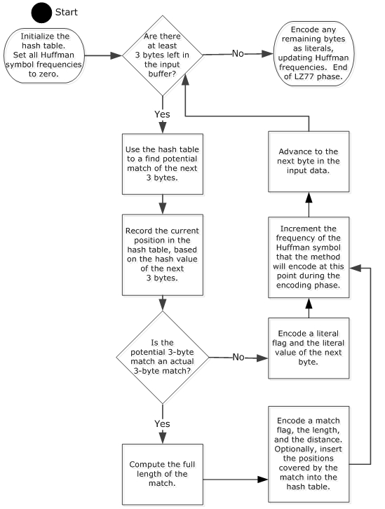
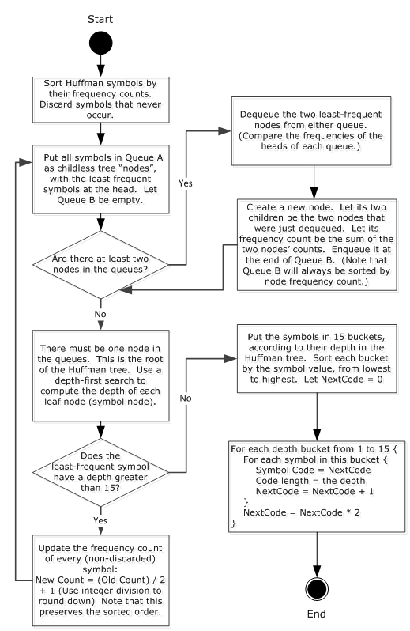

# [MS-XCA]: Xpress Compression Algorithm

Table of Contents

1 Introduction

- [1 Introduction](#Section_1)
  - [1.1 Glossary](#Section_1.1)
  - [1.2 References](#Section_1.2)
    - [1.2.1 Normative References](#Section_1.2.1)
    - [1.2.2 Informative References](#Section_1.2.2)
  - [1.3 Overview](#Section_1.3)
  - [1.4 Relationship to Protocols and Other Algorithms](#Section_1.4)
  - [1.5 Applicability Statement](#Section_1.5)
  - [1.6 Standards Assignments](#Section_1.6)

2 Algorithm Details

- [2 Algorithm Details](#Section_2)
  - [2.1 LZ77+Huffman Compression Algorithm Details](#Section_2.1)
    - [2.1.1 Abstract Data Model](#Section_2.1.1)
    - [2.1.2 Initialization](#Section_2.1.2)
    - [2.1.3 Processing Rules](#Section_2.1.3)
    - [2.1.4 Phases](#Section_2.1.4)
      - [2.1.4.1 LZ77 Phase](#Section_2.1.4.1)
      - [2.1.4.2 Huffman Code Construction Phase](#Section_2.1.4.2)
      - [2.1.4.3 Final Encoding Phase](#Section_2.1.4.3)
  - [2.2 LZ77+Huffman Decompression Algorithm Details](#Section_2.2)
    - [2.2.1 Abstract Data Model](#Section_2.2.1)
    - [2.2.2 Initialization](#Section_2.2.2)
    - [2.2.3 Processing Rules](#Section_2.2.3)
    - [2.2.4 Processing](#Section_2.2.4)
  - [2.3 Plain LZ77 Compression Algorithm Details](#Section_2.3)
    - [2.3.1 Abstract Data Model](#Section_2.3.1)
    - [2.3.2 Initialization](#Section_2.3.2)
    - [2.3.3 Processing Rules](#Section_2.3.3)
    - [2.3.4 Processing](#Section_2.3.4)
  - [2.4 Plain LZ77 Decompression Algorithm Details](#Section_2.4)
    - [2.4.1 Abstract Data Model](#Section_2.4.1)
    - [2.4.2 Initialization](#Section_2.4.2)
    - [2.4.3 Processing Rules](#Section_2.4.3)
    - [2.4.4 Processing](#Section_2.4.4)
  - [2.5 LZNT1 Algorithm Details](#Section_2.5)
    - [2.5.1 Abstract Data Model](#Section_2.5.1)
      - [2.5.1.1 Buffer Format](#Section_2.5.1.1)
      - [2.5.1.2 Buffers and Chunks](#Section_2.5.1.2)
      - [2.5.1.3 Flag Groups](#Section_2.5.1.3)
      - [2.5.1.4 Data Elements](#Section_2.5.1.4)
    - [2.5.2 Initialization](#Section_2.5.2)
    - [2.5.3 Processing Rules](#Section_2.5.3)
    - [2.5.4 Processing](#Section_2.5.4)

3 Algorithm Examples

- [3 Algorithm Examples](#Section_3)
  - [3.1 LZ77](#Section_3.1)
  - [3.2 LZ77+Huffman](#Section_3.2)
  - [3.3 LZNT1](#Section_3.3)

4 Security

- [4 Security](#Section_4)
  - [4.1 Security Considerations for Implementers](#Section_4.1)
  - [4.2 Index of Security Parameters](#Section_4.2)

5 Appendix A: Product Behavior

- [5 Appendix A: Product Behavior](#Section_5)

6 Change Tracking

- [6 Change Tracking](#Section_6)

For the legal notice and IP terms, see [LEGAL.md](../LEGAL.md).
Last updated: 4/23/2024.
See [Revision History](#revision-history) for full version history.

# 1 Introduction

The Xpress Compression Algorithm has three variants, all designed for speed.

The fastest variant, Plain LZ77, implements the [**LZ77**](#gt_lz77) algorithm ([[UASDC]](https://go.microsoft.com/fwlink/?LinkId=90549)).

A slower variant, LZ77+Huffman, adds a Huffman encoding pass on the LZ77 data.

A third variant, LZNT1, implements LZ77 without the Huffman encoding pass of the second variant, but with an encoding process less complex than Plain LZ77.

Sections 1.6 and 2 of this specification are normative. All other sections and examples in this specification are informative.

## 1.1 Glossary

This document uses the following terms:

**Huffman alphabet**: A set of symbols used in Huffman encoding.

**Huffman code**: See "prefix code".

**Huffman codes**: A set of variable-length bit sequences for an alphabet of symbols. In order to provide compression, more frequent symbols are assigned shorter bit sequences. The bottom-up Huffman construction process is optimal in the sense that the total length of the data is minimized, given the number of times each symbol occurs.

**Huffman symbol**: See "prefix code".

**LZ77**: A general-purpose compression technique introduced by Lempel and Ziv in 1977. Byte sequences that are the same as previous sequences are replaced by a (length, distance) pair that unambiguously references the earlier sequence.

**prefix code**: A type of code system, typically variable-length, having the prefix property, in that no valid code word in the system is a prefix of any other valid code word in the set.

**MAY, SHOULD, MUST, SHOULD NOT, MUST NOT:** These terms (in all caps) are used as defined in [[RFC2119]](https://go.microsoft.com/fwlink/?LinkId=90317). All statements of optional behavior use either MAY, SHOULD, or SHOULD NOT.

## 1.2 References

Links to a document in the Microsoft Open Specifications library point to the correct section in the most recently published version of the referenced document. However, because individual documents in the library are not updated at the same time, the section numbers in the documents may not match. You can confirm the correct section numbering by checking the [Errata](https://go.microsoft.com/fwlink/?linkid=850906).

### 1.2.1 Normative References

We conduct frequent surveys of the normative references to assure their continued availability. If you have any issue with finding a normative reference, please contact [dochelp@microsoft.com](mailto:dochelp@microsoft.com). We will assist you in finding the relevant information.

[IEEE-MRC] Huffman, D.A., "A Method for the Construction of Minimum-Redundancy Codes", Proceedings of the IRE, vol. 40, pp. 1098-1101, September 1952, [http://ieeexplore.ieee.org/xpls/abs_all.jsp?arnumber=4051119&tag=1](https://go.microsoft.com/fwlink/?LinkId=227659)

**Note** Access to this document requires a subscription

[RFC2119] Bradner, S., "Key words for use in RFCs to Indicate Requirement Levels", BCP 14, RFC 2119, March 1997, [https://www.rfc-editor.org/info/rfc2119](https://go.microsoft.com/fwlink/?LinkId=90317)

[UASDC] Ziv, J. and Lempel, A., "A Universal Algorithm for Sequential Data Compression", May 1977, [http://www.cs.duke.edu/courses/spring03/cps296.5/papers/ziv_lempel_1977_universal_algorithm.pdf](https://go.microsoft.com/fwlink/?LinkId=90549)

### 1.2.2 Informative References

[MS-DTYP] Microsoft Corporation, "[Windows Data Types](../MS-DTYP/MS-DTYP.md)".

## 1.3 Overview

This algorithm efficiently compresses data that contain repeated byte sequences. It is not designed to compress image, audio, or video data. Between the trade-offs of compressed size and CPU cost, it heavily emphasizes low CPU cost.

## 1.4 Relationship to Protocols and Other Algorithms

This algorithm does not depend on any other algorithms or protocols. It is a compression method designed to have minimal CPU overhead for compression and decompression. A protocol that depends on this algorithm would typically need to transfer significant amounts of data that cannot be easily precompressed by another algorithm having a better compression ratio.

## 1.5 Applicability Statement

This algorithm is appropriate for any protocol that transfers large amounts of easily compressible textlike data, such as HTML, source code, or log files. Protocols use this algorithm to reduce the number of bits transferred.

## 1.6 Standards Assignments

None.

# 2 Algorithm Details

## 2.1 LZ77+Huffman Compression Algorithm Details

The overall compression algorithm for the Huffman [[IEEE-MRC]](https://go.microsoft.com/fwlink/?LinkId=227659) variant can handle an arbitrary amount of data. Data is processed in 64k blocks, and the encoded results are stored in-order. After the final block, the end-of-file (EOF) symbol is encoded. Each 64k block is run through three stages, which are performed in this order:

- Perform **LZ77** ([[UASDC]](https://go.microsoft.com/fwlink/?LinkId=90549)) compression to generate an intermediate compressed buffer.
- Construct canonical **Huffman codes**.
- Process the intermediate **LZ77** data, and re-encode it in a Huffman-based bit stream.
The algorithm cannot start Huffman encoding until it has computed the **Huffman codes**, and it cannot compute the **Huffman codes** until it knows the frequency of each symbol in the **Huffman alphabet**. To compute these frequencies, the algorithm first performs the **LZ77** phase. For efficiency, the algorithm SHOULD store the **LZ77** output so that the final phase does not have to recompute it.

The final compression format consists of two parts:

- The first 256 bytes indicate the bit length of each of the 512 **Huffman symbol**s (see [**prefix code**](#gt_prefix-code)).
- The remainder of the data is a sequence of **Huffman symbol**s, along with match lengths and distances.
The **Huffman alphabet** consists of 512 symbols, each with a numeric value in the range 0-511. The symbols 0-255 represent literal values that correspond to raw byte values as opposed to matches. The symbols 256-511 represent **matches** or **references** indicating that the next several bytes are the same as some bytes that previously occurred in the data. Each match consists of two encoded integers: a length and a distance. When the decoding method encounters a match symbol, the original data is reconstructed by copying <length> bytes from the position in its previously decompressed data of <[decompression cursor] – [match distance]>.

### 2.1.1 Abstract Data Model

None.

### 2.1.2 Initialization

None.

### 2.1.3 Processing Rules

None.

### 2.1.4 Phases

#### 2.1.4.1 LZ77 Phase

This phase processes each byte of the input data and produces two outputs: the intermediate **LZ77** ([[UASDC]](https://go.microsoft.com/fwlink/?LinkId=90549)) encoding of flags, literals, and matches; and the frequency of each symbol in the **Huffman alphabet**.

The following flowchart shows how the **LZ77** phase works.

Figure 1: LZ77 phase

The **hash table** is an array of pointers to previous positions in the input buffer. It is used to find matches, as follows:

HashValue = HashThreeBytes(InputBuffer[CurrentPosition],

InputBuffer[CurrentPosition+1],

InputBuffer[CurrentPosition+2]);

PotentialMatch = HashTable[HashValue];

HashTable[HashValue] = CurrentPosition;

The **HashThreeBytes** function SHOULD be quick to compute and provide a small number of collisions.

If the additional CPU cost is justified, the algorithm SHOULD be extended to search for longer matches than those provided by the basic **hash table**. This can be achieved with more **hash table**s, **tree**s, or a **chained hash table**. Finding longer matches generally results in smaller compressed data but requires more time for the compression method to execute.

The intermediate compression format that is produced in this phase SHOULD be designed for quick encoding and decoding, and it SHOULD be small enough to guarantee its fit in a temporary buffer that is only slightly larger than the input buffer. The algorithm will be more efficient if it is not necessary to check whether the temporary buffer has sufficient space.

The intermediate compression format SHOULD use bitmasks grouped in 32-bit values to represent the literal or match flags. Also, literal values SHOULD be stored as simple bytes in the intermediate stream. Matches SHOULD be encoded in sizes that are guaranteed to be less than or equal to their lengths.

For example, a 3-byte match could use 1 byte for its length and 2 bytes for its distance. Much longer matches SHOULD be encoded with a 2-byte distance and a special length value (such as 0xFF) indicating that the full length is encoded in the next 2 or 4 bytes.

During the **LZ77** phase, the algorithm SHOULD count the frequencies of the **Huffman symbol**s it will later encode. The **Huffman symbol** for each literal or match is computed in the following way.

- For literals, the Huffman symbol index is the value of the literal (ranging from 0 to 255, inclusive).
- For matches, the **Huffman symbol** is computed from the length and distance by using the following code, in which GetHighBit(Distance) is defined as the bit index of the highest set bit in the binary representation of the distance.
If (Length – 3) < 15

HuffmanSymbol = 256 + (Length – 3) + (16 * GetHighBit(Distance))

Else

HuffmanSymbol = 256 + 15 + (16 * GetHighBit(Distance))

Note that this definition assumes that *Distance* is greater than 0, and this is a valid assumption in this context.

The following table provides examples of **GetHighBit** calculations.

| Bit Range | Field | Description |
| --- | --- | --- |
| Variable | 1 | …000**1** 0 |
| Variable | 2 | …00**1**0 1 |
| Variable | 5 | …0**1**01 2 |
| Variable | 7 | …0**1**11 2 |

The **GetHighBit** function SHOULD be efficiently computed with a precomputed 256-byte table.

If Distance < 256

DistanceHighBit = PrecomputedHighBitTable[Distance]

Else (assuming Distance < (1 << 16))

DistanceHighBit = 8 + PrecomputedHighBitTable[Distance >> 8]

#### 2.1.4.2 Huffman Code Construction Phase

This phase computes canonical [**Huffman codes**](#gt_huffman-codes) from the symbol counts generated by the [**LZ77**](#gt_lz77) ([[UASDC]](https://go.microsoft.com/fwlink/?LinkId=90549)) phase. For each of the 512 symbols in the [**Huffman alphabet**](#gt_huffman-alphabet), this phase computes the bit sequence that is used to encode the symbol. These codes are reconstructed by the decompression algorithm from the bit length of each symbol. The codes are canonical because they depend only on the bit length of the symbol, not the precise symbol count. This encoding saves space because bit lengths require fewer bits to store (4 bits per symbol) than exact counts (16 bits per symbol).

An additional requirement of this phase comes from the way the bit lengths are stored in the compressed data: each bit length is stored in 4 bits, so no bit length can be longer than 15 (a **length** of zero means that the symbol does not occur).

The following flowchart illustrates the length-limited canonical [**Huffman code**](#gt_huffman-code) construction method. Note that the sorting algorithm used in the Huffman Code construction phase is stable.

Figure 2: Length-limited canonical Huffman code construction method.

#### 2.1.4.3 Final Encoding Phase

In the final encoding phase, the algorithm processes the intermediate encoding of literals and matches generated by the [**LZ77**](#gt_lz77) ([[UASDC]](https://go.microsoft.com/fwlink/?LinkId=90549)) phase. It re-encodes each literal and match using the canonical [**Huffman codes**](#gt_huffman-codes), but first it encodes the [**Huffman symbol**](#gt_huffman-symbol) bit lengths.

Each symbol bit length is encoded with 4 bits. Bit lengths for even-valued symbols are stored in the lower 4 bits of the bytes, whereas bit lengths for odd-valued symbols are stored in the higher 4 bits.

For example, if the bit lengths of symbols 0, 1, 2, and 3 were 5, 6, 7, and 8, respectively, the first 2 bytes of the output buffer would be `0x65 0x87`. The Huffman [[IEEE-MRC]](https://go.microsoft.com/fwlink/?LinkId=227659) construction process guarantees that each bit length fits in 4 bits. Symbols that are never used, and therefore have no [**Huffman code**](#gt_huffman-code), have the special value of zero.

Because there are 512 Huffman symbols, and the format stores two lengths per byte, this part of the output data will always be exactly 256 bytes.

Following the 256-byte table, the format encodes the sequence of literals and matches. Literals are distinguished from matches by the value of the Huffman symbol: symbol values less than 256 are literals, whereas symbols greater than 255 are matches. Most matches require more bits to fully encode the distance and the length.

As explained in section [2.1.4.1](#Section_3.1), the match symbol value encodes the length of the match (up to 17) and the bit index of the highest set bit in the distance. If this bit index is, for example, 3, the decompression function can determine that the distance is at least 1000 (1000 binary, or 8 decimal) and at most 1111 (1111 binary, or 15 decimal). It can also compute that 3 more bits of information are required to determine the exact distance. Therefore, the encoder encodes the lower 3 bits of the distance directly in the output bit stream (which is also used to encode the variable-length Huffman codes). In general, the encoder explicitly encodes the lower `<GetHighBit(Distance)>` bits immediately following the match's Huffman symbol.

The encoder is required to process match lengths longer than 17. If the length is less than 18, the decoder can determine it directly from the match symbol by taking the lower 4 bits and adding 3. A lower-four-bits value of 15 is a special case that means the length is at least 18, and the full length is encoded with more bits. Unlike the extra-distance bits, the extra-length bits are not encoded seamlessly in the **Huffman** bit stream. Longer lengths are encoded with an extra byte in the output, and if that is not enough, an additional 2 bytes. The location of these extra bytes is such that, if the decompression function reads the **Huffman** bit stream in 2-byte chunks, these extra bytes are the next bytes that the decompression function will read.

Implementations of the decompression algorithm may expect an extra symbol to mark the end of the data. For example, certain implementations fail during decompression if the Huffman symbol 256 is not found after the actual data. For this reason, the encoding algorithm SHOULD append this symbol and increment the count of symbol 256 before the Huffman codes are constructed.

The following pseudocode demonstrates the encoding method.

Write the 256-byte table of symbol bit lengths

While there are more literals or matches to encode

If the next thing is a literal

WriteBits(SymbolLength[LiteralValue], SymbolCode[LiteralValue])

Else // the next thing is a match

Extract the length and distance of the match

MatchSymbolValue = 256 + min(Length, 15) + (16 * GetHighBit(Distance))

WriteBits(SymbolLength[MatchSymbolValue], SymbolCode[MatchSymbolValue])

Length = Length - 3

If (Length) >= 15

Length = Length – 15

If (Length < 255)

WriteByte(Length)

Else

WriteByte(255)

Length = Length + 15

If (Length < 65536)

WriteUint16(Length)

Else

WriteUint16(0)

WriteUint32(Length)

WriteBits(GetHighBit(Distance), Distance – (1 << GetHighBit(Distance)))

WriteBits(SymbolLength[256], SymbolCode[256])

FlushBits()

The **WriteBits**, **WriteByte**, **WriteUint16**, **WriteUint32**, and **FlushBits** functions implicitly use five variables, which are initialized as follows:

FreeBits = 16

NextWord = 0

OutputPosition1 = OutputBufferPointer + 256

OutputPosition2 = OutputBufferPointer + 258

OutputPosition = OutputBufferPointer + 260

The following pseudocode shows the implementation of the functions. Note that a complete implementation must also include bounds checks to ensure that nothing is written beyond the output buffer.

WriteBits (NumberOfBitsToWrite, BitsToWrite)

If FreeBits >= NumberOfBitsToWrite

FreeBits = FreeBits – NumberOfBitsToWrite

NextWord = (NextWord << NumberOfBitsToWrite) + BitsToWrite

Else

NextWord = (NextWord << FreeBits)

NextWord = NextWord + (BitsToWrite >> (NumberOfBitsToWrite – FreeBits))

FreeBits = FreeBits – NumberOfBitsToWrite

Write (NextWord & 0xFF) to OutputPosition1

Write (NextWord >> 8) to OutputPosition1 + 1

OutputPosition1 = OutputPosition2

OutputPosition2 = OutputPosition

Advance OutputPosition by 2 bytes

FreeBits = FreeBits + 16

NextWord = BitsToWrite

End

WriteByte (ByteToWrite)

Write ByteToWrite to OutputPosition

Advance OutputPosition by 1 byte

End

WriteUint16 (Value)

Write bytes for Value to OutputPosition

Advance OutputPosition by 2 bytes

End

WriteUint32 (Value)

Write bytes for Value to OutputPosition

Advance OutputPosition by 4 bytes

End

FlushBits ()

NextWord <<= FreeBits

Write (NextWord & 0xFF) to OutputPosition1

Write (NextWord >> 8) to OutputPosition1 + 1

Write a 16-bit value of zero to OutputPosition2

The final compressed size is the value of OutputPosition

End

## 2.2 LZ77+Huffman Decompression Algorithm Details

### 2.2.1 Abstract Data Model

None.

### 2.2.2 Initialization

None.

### 2.2.3 Processing Rules

None.

### 2.2.4 Processing

The decompression processes a series of blocks to form the decompressed output. Each block is processed in-order, and its decoded content written to the output stream is in-order. When processing a block, we check for terminating conditions for both block and overall decoding.

The decompression algorithm uses the 256-byte Huffman table to reconstruct the canonical Huffman [[IEEE-MRC]](https://go.microsoft.com/fwlink/?LinkId=227659) representations of each symbol. Next, the Huffman stream of [**LZ77**](#gt_lz77) ([[UASDC]](https://go.microsoft.com/fwlink/?LinkId=90549)) literals and matches is decoded to reproduce the original data.

The following method can be used to construct a decoding table. The decoding table will have 2^15 entries because 15 is the maximum bit length permitted by the Xpress Compression Algorithm for a [**Huffman code**](#gt_huffman-code). If a symbol has a bit length of X, it has 2^(15 – X) entries in the table that point to its value. The order of symbols in the table is sorted by bit length (from low to high), and then by symbol value (from low to high). These requirements represent the agreement of canonicalness with the compression end of the algorithm. The following pseudocode shows the table construction method:

CurrentTableEntry = 0

For BitLength = 1 to 15

For Symbol = 0 to 511

If the encoded bit length of Symbol equals BitLength

EntryCount = (1 << (15 – BitLength))

Repeat EntryCount times

If CurrentTableEntry >= 2^15

The compressed data is not valid. Return with error.

DecodingTable[CurrentTableEntry] = Symbol

CurrentTableEntry = CurrentTableEntry + 1

If CurrentTableEntry does not equal 2^15

The compressed data is not valid. Return with error.

A valid implementation MUST use a method that provides results equivalent to those of the preceding table-based method to construct a data structure for decoding canonical [**Huffman codes**](#gt_huffman-codes). An implementation MAY use this simple table-based method, but SHOULD use a faster method.

The compression stream is designed to be read in (mostly) 16-bit chunks, with a 32-bit register maintaining at least the next 16 bits of input. This strategy allows the code to seamlessly handle the bytes for long match lengths, which would otherwise be awkward. The following pseudocode demonstrates this method.

During the beginning of processing each block for decompression, an implementation MUST check that the block has sufficient space for a Huffman table — if the block has enough space, then processing continues. If there is not enough space for a Huffman table and all output has been written, then processing stops and success is returned, otherwise an error indicating invalid data is returned.

Loop until a decompression terminating condition

If remaining input buffer does not have enough space for a Huffman table

If we're at the end of the output buffer

Decompression is complete, return success

The compressed data is not valid, return error

Build the decoding table

CurrentPosition = 256 // start at the end of the Huffman table

NextBits = Read16Bits(InputBuffer + CurrentPosition)

CurrentPosition += 2

NextBits <<= 16

NextBits |= Read16Bits(InputBuffer + CurrentPosition)

CurrentPosition += 2

ExtraBitCount = 16

BlockEnd = OutputPosition + 65536

Loop until a block terminating condition

If the OutputPosition >= BlockEnd then terminate block processing

Next15Bits = NextBits >> (32 – 15)

HuffmanSymbol = DecodingTable[Next15Bits]

HuffmanSymbolBitLength = the bit length of HuffmanSymbol, from the table in

the input buffer

NextBits <<= HuffmanSymbolBitLength

ExtraBitCount -= HuffmanSymbolBitLength

If ExtraBitCount < 0

NextBits |= Read16Bits(InputBuffer + CurrentPosition) << (-ExtraBitCount)

ExtraBitCount += 16

CurrentPosition += 2

If HuffmanSymbol < 256

Output the byte value HuffmanSymbol to the output stream.

Else If HuffmanSymbol == 256 and

the entire input buffer has been read and

the expected decompressed size has been written to the output buffer

Decompression is complete. Return with success.

Else

HuffmanSymbol = HuffmanSymbol - 256

MatchLength = HuffmanSymbol mod 16

MatchOffsetBitLength = HuffmanSymbol / 16

If MatchLength == 15

MatchLength = ReadByte(InputBuffer + CurrentPosition)

CurrentPosition += 1

If MatchLength == 255

MatchLength = Read16Bits(InputBuffer + CurrentPosition)

CurrentPosition += 2

If MatchLength < 15

The compressed data is invalid. Return error.

MatchLength = MatchLength - 15

MatchLength = MatchLength + 15

MatchLength = MatchLength + 3

MatchOffset = NextBits >> (32 – MatchOffsetBitLength)

MatchOffset += (1 << MatchOffsetBitLength)

NextBits <<= MatchOffsetBitLength

ExtraBitCount -= MatchOffsetBitLength

If ExtraBitCount < 0

Read the next 2 bytes the same as the preceding (ExtraBitCount < 0) case

For i = 0 to MatchLength - 1

Output OutputBuffer[CurrentOutputPosition – MatchOffset + i]

End of block loop

End of decoding loop

An implementation MUST also generate an error indicating that the compressed data is not valid in the event of an improper memory access outside the buffer.

Note that the match-copying loop copies 1 byte at a time and cannot use the standard library functions **memcpy** or **memove**. A sequence of bytes such as `aaaaaa` can be encoded like this: `[literal: "a"][match: offset=1, length=5]`. In other words, the match length can be greater than the match offset, and this necessitates the 1-byte-at-a-time copying strategy.

## 2.3 Plain LZ77 Compression Algorithm Details

### 2.3.1 Abstract Data Model

None.

### 2.3.2 Initialization

None.

### 2.3.3 Processing Rules

None.

### 2.3.4 Processing

The fastest variant of the Xpress Compression Algorithm avoids the cost of the Huffman[[IEEE-MRC]](https://go.microsoft.com/fwlink/?LinkId=227659) pass by encoding the LZ77 [[UASDC]](https://go.microsoft.com/fwlink/?LinkId=90549) literals and matches in a simple way. The encoding process is similar to the method described in section [2.1.4.1](#Section_3.1), with the key difference that the largest match offset it can encode is 8192 instead of the 65535 limit of the Huffman format. The literal or match flags are encoded in 32-bit chunks. Literals are encoded with a simple byte value. Matches are encoded with a 16-bit value, where the high 13 bits represent the offset and the low 3 bits represent the length. Long lengths are encoded with an additional 4 bits, then 8 bits, and then 16 bits. The MatchLength is represented by a ULONG, a 32-bit unsigned integer (see [MS-DTYP](../MS-DTYP/MS-DTYP.md) section 2.2.51); therefore, the maximum value is 4,294,967,295. The following pseudocode provides an outline of the encoding method.

Flags = 0 // this is a 32-bit integer value

FlagCount = 0

FlagOutputPosition = 0

OutputPosition = 4

InputPosition = 0

LastLengthHalfByte = 0

While InputPosition has not reached the end of the input buffer

Try to find a match with a length of at least 3 (see section 2.1.4.1)

The match must be within the last 8,192 bytes (MatchOffset <= 2^13)

If no match was found or InputPosition + 2 is beyond the input buffer

Copy 1 byte from InputPosition to OutputPosition. Advance both.

Flags <<= 1

FlagCount = FlagCount + 1

If FlagCount == 32

Write the 32-bit value Flags to FlagOutputPosition

FlagCount = 0

FlagOutputPosition = OutputPosition

OutputPosition += 4

Else // a valid match was found

Let MatchLength and MatchOffset describe the match

MatchLength = MatchLength – 3

MatchOffset = MatchOffset – 1

MatchOffset <<= 3

If MatchLength < 7

// This is the simple case. The length fits in 3 bits.

MatchOffset += MatchLength

Write MatchOffset the 2-byte value to OutputPosition

OutputPosition += 2

Else

// The length does not fit 3 bits. Record a special value to

// indicate a longer length.

MatchOffset |= 7

Write MatchOffset the 2-byte value to OutputPosition

OutputPosition += 2

MatchLength -= 7

// Try to encode the length in the next 4 bits. If we previously

// encoded a 4-bit length, we'll use the high 4 bits from that byte.

If LastLengthHalfByte == 0

LastLengthHalfByte = OutputPosition

If MatchLength < 15

Write single byte value of MatchLength to OutputPosition

OutputPosition += 1

Else

Write single byte value of 15 to OutputPosition

OutputPosition++

goto EncodeExtraLen

Else

If MatchLength < 15

OutputBuffer[LastLengthHalfByte] |= MatchLength << 4

LastLengthHalfByte = 0

Else

OutputBuffer[LastLengthHalfByte] |= 15 << 4

LastLengthHalfByte = 0

EncodeExtraLen:

// We've already used 3 bits + 4 bits to encode the length

// Next use the next byte.

MatchLength -= 15

If MatchLength < 255

Write single byte value of MatchLength to OutputPosition

OutputPosition += 1

Else

// Use two more bytes for the length

Write single byte value of 255 to OutputPosition

OutputPosition += 1

MatchLength += 7 + 15

If MatchLength < (1 << 16)

Write two-byte value MatchLength to OutputPosition

OutputPosition += 2

Else

Write two-byte value of 0 to OutputPosition

OutputPosition += 2

Write four-byte value of MatchLength to OutputPosition

OutputPosition += 4

Flags = (Flags << 1) | 1

FlagCount = FlagCount + 1

If FlagCount == 32

Write the 32-bit value Flags to FlagOutputPosition

FlagCount = 0

FlagOutputPosition = OutputPosition

OutputPosition += 4

Advance InputPosition to the first byte that was not in the match

Endwhile

Flags <<= (32 – FlagCount)

Flags |= (1 << (32 – FlagCount)) - 1

Write the 32-bit value Flags to FlagOutputPosition

The final compressed size is the value of OutputPosition

## 2.4 Plain LZ77 Decompression Algorithm Details

### 2.4.1 Abstract Data Model

None.

### 2.4.2 Initialization

None.

### 2.4.3 Processing Rules

None.

### 2.4.4 Processing

This section provides the decompression method corresponding to the compression method that is described in section [2.3](#Section_2.3). The basic structure is to decode each flag, which indicates whether the next item is a literal or a match. Literals are copied directly from the input buffer to the output buffer. Matches are decoded into a `(length, offset)` pair that is used to copy data from earlier in the output buffer. If the code that follows reads or writes outside the provided buffers at any time, an implementation MUST return an error indicating that the compressed buffer is invalid. Note that the match-copying loop copies 1 byte at a time and cannot use the standard library functions **memcpy** or **memmove**. A sequence of bytes such as `aaaaaa` can be encoded as follows:

[literal: "a"][match: offset=1, length=5]

The **match length** can be greater than the **match offset**, and this necessitates the 1-byte-at-a-time copying strategy shown in the following pseudocode.

BufferedFlags = 0

BufferedFlagCount = 0

InputPosition = 0

OutputPosition = 0

LastLengthHalfByte = 0

Loop until break instruction or error

If BufferedFlagCount == 0

BufferedFlags = read 4 bytes at InputPosition

InputPosition += 4

BufferedFlagCount = 32

BufferedFlagCount = BufferedFlagCount – 1

If (BufferedFlags & (1 << BufferedFlagCount)) == 0

Copy 1 byte from InputPosition to OutputPosition. Advance both.

Else

If InputPosition == InputBufferSize

Decompression is complete. Return with success.

MatchBytes = read 2 bytes from InputPosition

InputPosition += 2

MatchLength = MatchBytes mod 8

MatchOffset = (MatchBytes / 8) + 1

If MatchLength == 7

If LastLengthHalfByte == 0

MatchLength = read 1 byte from InputPosition

MatchLength = MatchLength mod 16

LastLengthHalfByte = InputPosition

InputPosition += 1

Else

MatchLength = read 1 byte from LastLengthHalfByte position

MatchLength = MatchLength / 16

LastLengthHalfByte = 0

If MatchLength == 15

MatchLength = read 1 byte from InputPosition

InputPosition += 1

If MatchLength == 255

MatchLength = read 2 bytes from InputPosition

InputPosition += 2

If MatchLength == 0

MatchLength = read 4 bytes from InputPosition

InputPosition += 4 bytes

If MatchLength < 15 + 7

Return error.

MatchLength -= (15 + 7)

MatchLength += 15

MatchLength += 7

MatchLength += 3

For i = 0 to MatchLength – 1

Copy 1 byte from OutputBuffer[OutputPosition – MatchOffset]

OutputPosition += 1

## 2.5 LZNT1 Algorithm Details

The LZNT1 algorithm employs a grammar common to LZ77 variants, making use of LZ77 [[UASDC]](https://go.microsoft.com/fwlink/?LinkId=90549) literals and matches and using the characteristic processing. The LZNT1 algorithm is comparable to the Plain LZ77 variant, which implements the features of LZ77 through a specialized buffer format as specified in section [2.3](#Section_2.3) and section [2.4](#Section_2.4). Key differences between the "plain" and LZNT1 variants include the following:

- LZNT1 uses a less complex process to encode lengths.
- LZNT1 varies the number of bits used to encode length and distance, whereas the sizes of the Plain LZ77-encoded fields are fixed.
- LZNT1 groups flags in bytes; Plain LZ77 groups them in 4-byte DWORDs.
- The LZNT1 buffer is structured as a series of chunks that can be independently decompressed.

### 2.5.1 Abstract Data Model

This section describes a conceptual model of possible data organization that an implementation maintains to participate in this algorithm. The described organization is provided to facilitate the explanation of how the algorithm behaves. This document does not mandate that implementations adhere to this model as long as their external behavior is consistent with that described in this document.

The following elements are specific to this algorithm.

**Chunks:** Segments of data that are compressed, uncompressed, or that denote the end of the buffer.

**Chunk header:** The header for a compressed or uncompressed chunk of data.

**Flag bytes:** A bit flag whose bits, read from low order to high order, specify the formats of the data elements that follow. For example, bit 0 corresponds to the first data element, bit 1 to the second, and so on. If the bit corresponding to a data element is set, the element is a 2-byte compressed word; otherwise, it is a 1-byte literal value.

**Flag group:** A flag byte followed by zero or more data elements, each of which is a single literal byte or a 2-byte compressed word.

#### 2.5.1.1 Buffer Format

The LZNT1 algorithm relies on the use of a specific buffer format in its implementation of LZ77. The compression algorithm produces a buffer format of the following grammatical structure:

<Buffer> ::= <Chunk> <Buffer> | <Chunk>

<Chunk> ::= <Compressed_chunk> |

<Uncompressed_chunk> |

End_of_buffer

<Uncompressed_chunk> ::= Chunk_header Uncompressed_data

<Compressed_chunk> ::= Chunk_header <Flag_group>

<Flag_group> ::= <Flag_data> <Flag_group> | <Flag_data>

<Flag_data> ::=

Flag_byte <Data> <Data> <Data> <Data> <Data> <Data> <Data> <Data>

| Flag_byte <Data> <Data> <Data> <Data> <Data> <Data> <Data>

| Flag_byte <Data> <Data> <Data> <Data> <Data> <Data>

| Flag_byte <Data> <Data> <Data> <Data> <Data>

| Flag_byte <Data> <Data> <Data> <Data>

| Flag_byte <Data> <Data> <Data>

| Flag_byte <Data> <Data>

| Flag_byte <Data>

<Data> ::= Literal | Compressed_word

A compressed data buffer consists of one or more **chunks**. A chunk is either compressed, uncompressed, or it denotes the end of the buffer. If the chunk is uncompressed, it contains a **chunk header** followed by uncompressed data; if it is compressed, it contains a chunk header followed by a series of one or more pieces of flagged data. Finally, a piece of flagged data consists of a **flag byte** that is followed by no more than 8 individual data elements.

The following sections describe the structure of each of these grammatical elements, including constraints on their usage that are not expressed in the raw grammar.

#### 2.5.1.2 Buffers and Chunks

A compressed buffer consists of a series of one or more compressed output **chunks**. Each chunk begins with a 16-bit header.

If both bytes of the header are 0, the header is an *End_of_buffer* terminal that denotes the end of the compressed data stream.

Otherwise, the header MUST be formatted as follows:

- Bit 15 indicates whether the chunk contains compressed data.
- Bits [14:12] contain a signature indicating the format of the subsequent data.
- Bits [11:0] contain the size of the compressed chunk, minus three bytes.
Bit 15 indicates whether the chunk contains compressed data. If this bit is zero, the **chunk header** is followed by uncompressed literal data. If this bit is set, the next byte of the chunk is the beginning of a *Flag_group* nonterminal that describes some compressed data.

Bits 14 down to 12 contain a signature value. This value MUST always be 3 (unless the header denotes the end of the compressed buffer).

Bits 11 down to 0 contain the size of the compressed chunk minus three bytes. This size otherwise includes the size of any metadata in the chunk, including the chunk header. If the chunk is uncompressed, the total amount of uncompressed data therein can be computed by adding 1 to this value (adding 3 bytes to get the total chunk size, then subtracting 2 bytes to account for the chunk header).

The *End_of_buffer* character is not required to terminate the compressed buffer. The character is used, however, if space allows. For example, given 20 kilobytes (KB) of uncompressed data and a 10 KB buffer to contain the compressed data, if the size of the compressed data (including metadata) is exactly 10 KB, the capacity of the buffer has been met. In such a case, the *End_of_buffer* terminal is not written.

Because the presence of this terminal is not guaranteed, the size of the compressed data MUST be known before data in this format is decompressed.

If an *End_of_buffer* terminal is added, the size of the final compressed data is considered not to include the size of the *End_of_buffer* terminal.

#### 2.5.1.3 Flag Groups

If a **chunk** is compressed, its **chunk header** is immediately followed by the first byte of a *Flag_group* nonterminal.

A **flag group** consists of a **flag byte** followed by zero or more data elements. Each data element is either a single literal byte or a two-byte compressed word. The individual bits of a **flag byte**, taken from low-order bits to high-order bits, specify the formats of the subsequent data elements (such that bit 0 corresponds to the first data element, bit 1 to the second, and so on). If the bit corresponding to a data element is set, the element is a two-byte compressed word; otherwise, it is a one-byte literal.

#### 2.5.1.4 Data Elements

A data element MUST either be an uncompressed literal or a compressed word. An uncompressed literal is a byte of data that was not compressed and can therefore be treated as part of the uncompressed data stream. A compressed word is a two-byte value that contains a length and a displacement and whose format varies depending on the portion of the data that is being processed.

Each compressed word consists of a D-bit displacement in the high-order bits and an L-bit length in the low-order bits, subject to the constraints that 4 <= D <= 12, 4 <= L <= 12, and D + L = 16. The displacement in a compressed word is the difference between the current location in the uncompressed data (either the current read point when compressing or the current write point when decompressing) and the location of the uncompressed data corresponding to the compressed word, minus one byte. The length is the amount of uncompressed data that can be found at the appropriate displacement, minus three bytes. While using the compressed buffers, the stored displacement must be incremented by 1 and the stored length must be incremented by 3, to get the actual displacement and length.

For example, the input data for a given compression consists of the following stream:

F F G A A G F E D D E F F E E | F F G A A G F E D D E F E D D

In this case, the data prior to the vertical bar has already been compressed. The next 12 characters of the input stream match the first 12 characters of the data that was already compressed. Moreover, the distance from the current input pointer to the start of this matching string is 15 characters. This can be described by the `<displacement, length>` pair of `<15, 12>`.

Decompression of this data produces the first portion of the input stream:

F F G A A G F E D D E F F E E |

The next data element is a `<15, 12>` displacement-length pair. The start of the uncompressed data is 15 characters behind the last character in the already uncompressed data, and the length of the data to read is 12 characters. Decompression results in the following buffer.

F F G A A G F E D D E F F E E F F G A A G F E D D E F |

This matches the original data stream.

F F G A A G F E D D E F F E E F F G A A G F E D D E F E D D

The sizes of the displacement and length fields of a compressed word vary with the amount of uncompressed data in the current chunk that has already been processed. The format of a given compressed word is determined as follows:

Let U be the amount of uncompressed data that has already been processed in the current chunk (either the amount that has been read when compressing data or the amount that has been written when decompressing data).

Note that U depends on the offset from the start of a chunk and not the offset from the beginning of the uncompressed data.

Then let M be the largest value in [4…12] such that 2M-1 < U, or 4 if there is no such value.

A compressed word then has the format D = M and L = 16 – M, with the displacement occupying D high-order bits and the length occupying L low-order bits.

### 2.5.2 Initialization

None.

### 2.5.3 Processing Rules

Input streams are compressed in units of 4096 bytes. The process of creating a chunk is complete if at least 4096 bytes of data or the remainder of the input buffer is compressed. If the data remains in the input buffer, the processing of a new chunk is started.

Lempel-Ziv compression does not require that the entirety of the data to which a compressed word refers actually be in the uncompressed buffer when the word is processed. In other words, it is not required that (U – displacement + length < U). Therefore, when processing a compressed word, data MUST be copied from the start of the uncompressed target region to the end—that is, the byte at (U – displacement) MUST be copied first, then (U – displacement + 1), and so on, because the compressed word might refer to data that will be written during decompression.

Some of the bits in a flag byte might not be used. To process compressed buffers, the size of the compressed chunk that is stored in the chunk header MUST be used to determine the position of the last valid byte in the chunk. The size value MUST ignore flag bits that correspond to bytes outside the chunk.

### 2.5.4 Processing

For a discussion of [**LZ77**](#gt_lz77) processing similar to that of the LZNT1 variant, see sections [2.3](#Section_2.3) and [2.4](#Section_2.4) on Plain LZ77 compression and decompression.

# 3 Algorithm Examples

## 3.1 LZ77

With the Plain LZ77 variant of the algorithm, the uncompressed ASCII string `abcdefghijklmnopqrstuvwxyz` is compressed as follows, in hexadecimal.

3f 00 00 00 61 62 63 64 65 66 67 68 69 6a 6b 6c 6d 6e 6f 70 71 72 73 74 75 76 77 78 79 7a

The first 4 bytes encode the first 32 literal or match flags (in this case, 26 zero bits, representing the 26 literals to follow, then 6 one bits, because any extra flag bits are ones). The next 26 bytes are the ASCII representation of the input string.

The uncompressed input is the 300-byte ASCII string:

abcabcabcabcabcabcabcabcabcabcabcabcabcabcabcabcabcabcabcabcabcabcabcabcabcabcabcabcabcabcabcabcabcabcabcabcabcabcabcabcabcabcabcabcabcabcabcabcabcabcabcabcabcabcabcabcabcabcabcabcabcabcabcabcabcabcabcabcabcabcabcabcabcabcabcabcabcabcabcabcabcabcabcabcabcabcabcabcabcabcabcabcabcabcabcabcabcabcabcabc

In this case, using Plain LZ77, those 300 bytes are encoded as follows:

ff ff ff 1f 61 62 63 17 00 0f ff 26 01

This is the encoding of `abc[match: distance = 3, length = 297]`.

## 3.2 LZ77+Huffman

The uncompressed ASCII string `abcdefghijklmnopqrstuvwxyz` is compressed as a sequence of literals, as follows, in hexadecimal.

00 00 00 00 00 00 00 00 00 00 00 00 00 00 00 00 00 00 00 00 00 00 00 00 00 00 00 00 00 00 00 00 00 00 00 00 00 00 00 00 00 00 00 00 00 00 00 00 50 55 55 55 55 55 55 55 55 55 55 45 44 04 00 00 00 00 00 00 00 00 00 00 00 00 00 00 00 00 00 00 00 00 00 00 00 00 00 00 00 00 00 00 00 00 00 00 00 00 00 00 00 00 00 00 00 00 00 00 00 00 00 00 00 00 00 00 00 00 00 00 00 00 00 00 00 00 00 00 04 00 00 00 00 00 00 00 00 00 00 00 00 00 00 00 00 00 00 00 00 00 00 00 00 00 00 00 00 00 00 00 00 00 00 00 00 00 00 00 00 00 00 00 00 00 00 00 00 00 00 00 00 00 00 00 00 00 00 00 00 00 00 00 00 00 00 00 00 00 00 00 00 00 00 00 00 00 00 00 00 00 00 00 00 00 00 00 00 00 00 00 00 00 00 00 00 00 00 00 00 00 00 00 00 00 00 00 00 00 00 00 00 00 00 00 00 00 00 00 00 00 00 00 00 00 00 00 d8 52 3e d7 94 11 5b e9 19 5f f9 d6 7c df 8d 04 00 00 00 00

The first 256 bytes represent the [**Huffman code**](#gt_huffman-code) lengths. In this case, most of these values are zero because those symbols are not used. The few nonzero values represent the code lengths (5 bits or 4 bits in this case) of the literal symbols corresponding to the ASCII characters of the lowercase alphabet, as well as the end-of-file (EOF) symbol (symbols index 256). The last few bytes in the buffer are the Huffman encoding of the string `abcdefghijklmnopqrstuvwxyz[EOF]`.

The uncompressed data is the following 300-byte ASCII string:

abcabcabcabcabcabcabcabcabcabcabcabcabcabcabcabcabcabcabcabcabcabcabcabcabcabcabcabcabcabcabcabcabcabcabcabcabcabcabcabcabcabcabcabcabcabcabcabcabcabcabcabcabcabcabcabcabcabcabcabcabcabcabcabcabcabcabcabcabcabcabcabcabcabcabcabcabcabcabcabcabcabcabcabcabcabcabcabcabcabcabcabcabcabcabcabcabcabcabcabc

The LZ77+Huffman algorithm encodes it as follows:

00 00 00 00 00 00 00 00 00 00 00 00 00 00 00 00 00 00 00 00 00 00 00 00 00 00 00 00 00 00 00 00 00 00 00 00 00 00 00 00 00 00 00 00 00 00 00 00 30 23 00 00 00 00 00 00 00 00 00 00 00 00 00 00 00 00 00 00 00 00 00 00 00 00 00 00 00 00 00 00 00 00 00 00 00 00 00 00 00 00 00 00 00 00 00 00 00 00 00 00 00 00 00 00 00 00 00 00 00 00 00 00 00 00 00 00 00 00 00 00 00 00 00 00 00 00 00 00 02 00 00 00 00 00 00 00 00 00 00 00 00 00 00 20 00 00 00 00 00 00 00 00 00 00 00 00 00 00 00 00 00 00 00 00 00 00 00 00 00 00 00 00 00 00 00 00 00 00 00 00 00 00 00 00 00 00 00 00 00 00 00 00 00 00 00 00 00 00 00 00 00 00 00 00 00 00 00 00 00 00 00 00 00 00 00 00 00 00 00 00 00 00 00 00 00 00 00 00 00 00 00 00 00 00 00 00 00 00 00 00 00 00 00 00 00 00 00 00 00 00 00 00 00 00 00 00 a8 dc 00 00 ff 26 01

The first 256 bytes are the Huffman code lengths. The nonzero symbols are the literals '`a`', '`b`', and '`c`'; the `EOF` symbol; and one match symbol. The last few bytes encode `abc[match: distance=3, length=297][EOF]`. This example illustrates how long match lengths are encoded. In the last bytes of the compressed data, note the calculation `0x126 = 294 = 297 – 3`. Because it is the minimum match length, 3 is subtracted from each match length before it is encoded.

## 3.3 LZNT1

The following shows an example of [**LZ77**](#gt_lz77) compression in which the compressed word references data that is not wholly contained in the uncompressed buffer at the time when the word is processed. In this scenario, the compressed word is processed by copying data from the start of the uncompressed target region to the end.

The following ANSI string, including the terminal NUL, is 142 bytes in length.

F# F# G A A G F# E D D E F# F# E E F# F# G A A G F# E D D E F# E D D E E F# D E F# G F# D E F# G F# E D E A F# F# G A A G F# E D D E F# E D D

The algorithm, using the standard compression engine, produces the following hexadecimal output with a length of 59 bytes.

0x00000000: 38 b0 88 46 23 20 00 20

0x00000008: 47 20 41 00 10 a2 47 01

0x00000010: a0 45 20 44 00 08 45 01

0x00000018: 50 79 00 c0 45 20 05 24

0x00000020: 13 88 05 b4 02 4a 44 ef

0x00000028: 03 58 02 8c 09 16 01 48

0x00000030: 45 00 be 00 9e 00 04 01

0x00000038: 18 90 00

The compressed data is contained in a single chunk. The chunk header, interpreted as a 16-bit value, is 0xB038. Bit 15 is 1, so the chunk is compressed; bits 14 through 12 are the correct signature value (3); and bits 11 through 0 are decimal 56, so the chunk is 59 bytes in size.

The next byte, 0x88, is a flag byte. Bits 0, 1, and 2 of this byte are clear, so the next 3 bytes are not compressed. They are 0x46 ('F'), 0x23 ('#'), and 0x20 (a space). The output stream now contains "F# ".

Bit 3 of the flag byte is set, however, so the next two bytes are part of a compressed word; in this case, that word is 0x2000. Here, the offset from the start of the uncompressed data, U, is 3 bytes; there is no value M such that M >= 4 and 2M-1 < U, so the compressed word has 4 bits of displacement and 12 bits of length. The stored displacement is 2 (0010) and the stored length is 0 (0000 0000 0000); the actual displacement is 3 (2 + 1 = 3) and the length is 3 (0 + 3 = 3). The next 3 characters of uncompressed data are "F# ", which results in an uncompressed string of length 6: "F# F# ".

Bits 4 through 6 of the flag byte are clear, so the next three bytes are literals: 0x47 ('G'), 0x20 (a space), and 0x41 ('A'). The string is now "F# F# G A". Bit 7 is set, so the next two bytes are a compressed word, 0x1000. The offset from the start of the chunk is 9 bytes, so the compressed word once again has 4 bits of displacement and 12 bits of length. The stored displacement is 1 (0001) and the stored length is 0 (0000 0000 0000); thus, the final displacement is 2 (1 + 1 = 2) and the final length is 3 (0 + 3 = 3).

This is a case in which the current uncompressed length (9 bytes) minus the displacement plus the length (10 bytes) actually exceeds the amount of uncompressed data, so character-by-character copying from the beginning of the displaced region is important. The first character is a space, so the string is "F# F# G A "; the next character is an A, resulting in "F# F# G A A"; and the next is the space that was just written, resulting in "F# F# G A A ".

The rest of the decompression proceeds similarly.

The final flag byte is located at offset 0x37. This is the 56th byte of compressed data; only three bytes remain. The flag byte is 0x01, so the next two bytes are a single compressed word. The final byte is a literal value, 0x00. The remainder of the flag byte is ignored because no data remains in the buffer.

# 4 Security

## 4.1 Security Considerations for Implementers

Implementers of the decompression method need to ensure that their code fails correctly on invalid input instead of overwriting memory locations outside the caller's output buffer. Implementers need to assume that the input buffer could be corrupted or might be maliciously constructed to cause the decompression function to read or write outside the buffers it is provided. A particularly subtle case involves guarding against integer/pointer overflow bugs when the input buffer contains long match lengths.

## 4.2 Index of Security Parameters

None.

# 5 Appendix A: Product Behavior

The information in this specification is applicable to the following Microsoft products or supplemental software. References to product versions include updates to those products.

- Windows 2000 operating system
- Windows XP operating system
- Windows Server 2003 operating system
- Windows Server 2003 R2 operating system
- Windows Vista operating system
- Windows Server 2008 operating system
- Windows 7 operating system
- Windows Server 2008 R2 operating system
- Windows 8 operating system
- Windows Server 2012 operating system
- Windows 10 operating system
- Windows Server 2016 operating system
- Windows Server operating system
- Windows Server 2019 operating system
- Windows Server 2022 operating system
- Windows 11 operating system
- Windows Server 2025 operating system
Exceptions, if any, are noted in this section. If an update version, service pack or Knowledge Base (KB) number appears with a product name, the behavior changed in that update. The new behavior also applies to subsequent updates unless otherwise specified. If a product edition appears with the product version, behavior is different in that product edition.

Unless otherwise specified, any statement of optional behavior in this specification that is prescribed using the terms "SHOULD" or "SHOULD NOT" implies product behavior in accordance with the SHOULD or SHOULD NOT prescription. Unless otherwise specified, the term "MAY" implies that the product does not follow the prescription.

# 6 Change Tracking

This section identifies changes that were made to this document since the last release. Changes are classified as Major, Minor, or None.

The revision class **Major** means that the technical content in the document was significantly revised. Major changes affect protocol interoperability or implementation. Examples of major changes are:

- A document revision that incorporates changes to interoperability requirements.
- A document revision that captures changes to protocol functionality.
The revision class **Minor** means that the meaning of the technical content was clarified. Minor changes do not affect protocol interoperability or implementation. Examples of minor changes are updates to clarify ambiguity at the sentence, paragraph, or table level.

The revision class **None** means that no new technical changes were introduced. Minor editorial and formatting changes may have been made, but the relevant technical content is identical to the last released version.

The changes made to this document are listed in the following table. For more information, please contact [dochelp@microsoft.com](mailto:dochelp@microsoft.com).

| Section | Description | Revision class |
| --- | --- | --- |
| [2.1.4.3](#Section_2.1.4.3) Final Encoding Phase | 11485 : Removed statement about checking match lengths as no checks are performed. | Major |
| 2.1.4.3 Final Encoding Phase | 11618 : Revised pseudocode to take account of cases where the length will exceed two bytes. | Major |
| [2.2.4](#Section_2.4.4) Processing | 11487 : Added terminating condition to pseudocode for when the input buffer does not have enough room for the Huffman table. | Major |
| 2.2.4 Processing | 11492 : Clarified processing of blocks for decompression. | Major |
| [5](#Section_5) Appendix A: Product Behavior | Added Windows Server 2025 to the list of applicable products. | Major |

## Revision History

| Date | Version | Revision Class | Comments |
| --- | --- | --- | --- |
| 12/16/2011 | 1.0 | New | Released new document. |
| 3/30/2012 | 1.0 | None | No changes to the meaning, language, or formatting of the technical content. |
| 7/12/2012 | 1.0 | None | No changes to the meaning, language, or formatting of the technical content. |
| 10/25/2012 | 2.0 | Major | Significantly changed the technical content. |
| 1/31/2013 | 2.0 | None | No changes to the meaning, language, or formatting of the technical content. |
| 8/8/2013 | 2.0 | None | No changes to the meaning, language, or formatting of the technical content. |
| 11/14/2013 | 2.1 | Minor | Clarified the meaning of the technical content. |
| 2/13/2014 | 2.1 | None | No changes to the meaning, language, or formatting of the technical content. |
| 5/15/2014 | 2.1 | None | No changes to the meaning, language, or formatting of the technical content. |
| 6/30/2015 | 3.0 | Major | Significantly changed the technical content. |
| 10/16/2015 | 3.0 | None | No changes to the meaning, language, or formatting of the technical content. |
| 7/14/2016 | 3.0 | None | No changes to the meaning, language, or formatting of the technical content. |
| 6/1/2017 | 3.0 | None | No changes to the meaning, language, or formatting of the technical content. |
| 9/15/2017 | 4.0 | Major | Significantly changed the technical content. |
| 9/12/2018 | 5.0 | Major | Significantly changed the technical content. |
| 3/4/2020 | 6.0 | Major | Significantly changed the technical content. |
| 8/26/2020 | 7.0 | Major | Significantly changed the technical content. |
| 4/7/2021 | 8.0 | Major | Significantly changed the technical content. |
| 6/25/2021 | 9.0 | Major | Significantly changed the technical content. |
| 4/23/2024 | 10.0 | Major | Significantly changed the technical content. |
