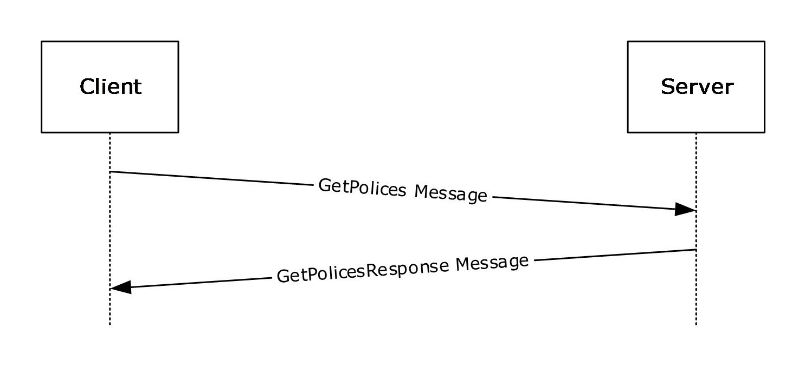
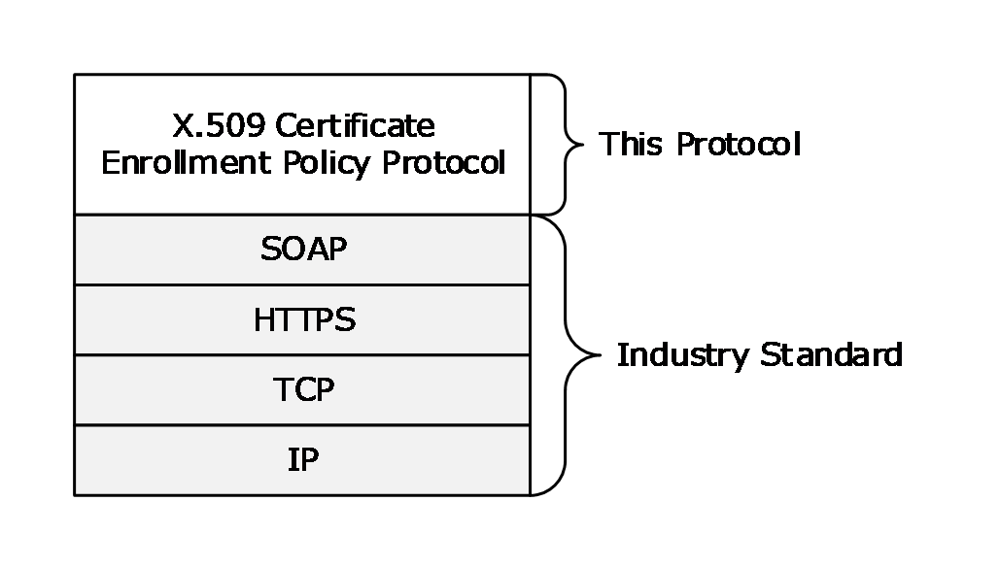
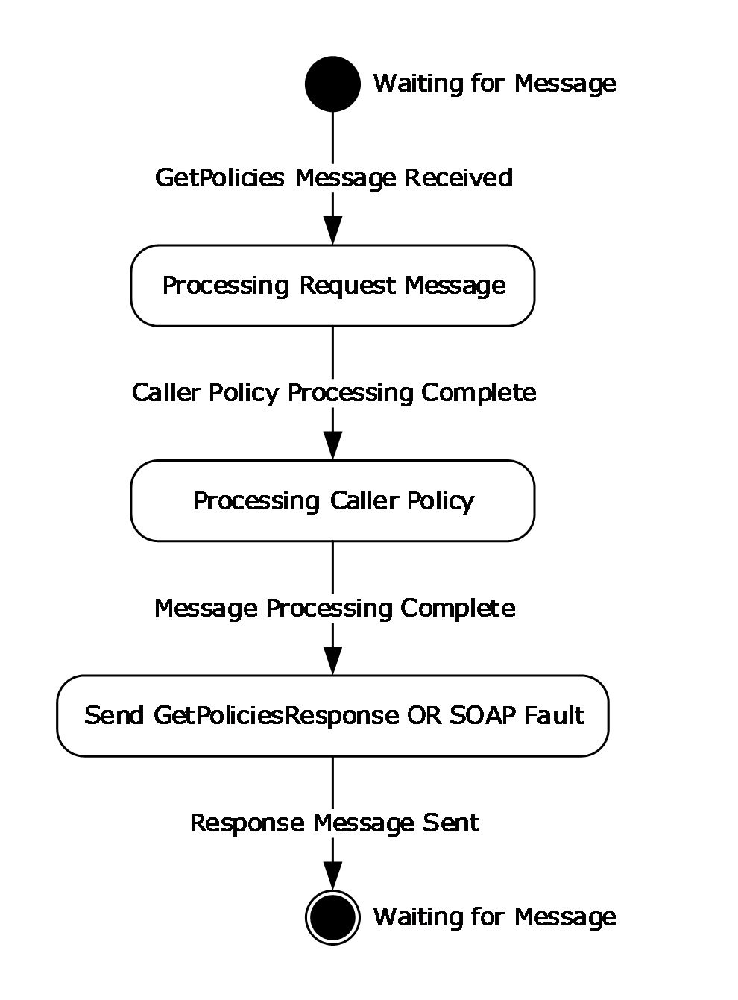

# [MS-XCEP]: X.509 Certificate Enrollment Policy Protocol

Table of Contents

1 Introduction

- [1 Introduction](#Section_1)
  - [1.1 Glossary](#Section_1.1)
  - [1.2 References](#Section_1.2)
    - [1.2.1 Normative References](#Section_1.2.1)
    - [1.2.2 Informative References](#Section_1.2.2)
  - [1.3 Overview](#Section_1.3)
  - [1.4 Relationship to Other Protocols](#Section_1.4)
  - [1.5 Prerequisites/Preconditions](#Section_1.5)
  - [1.6 Applicability Statement](#Section_1.6)
  - [1.7 Versioning and Capability Negotiation](#Section_1.7)
  - [1.8 Vendor-Extensible Fields](#Section_1.8)
  - [1.9 Standards Assignments](#Section_1.9)

2 Messages

- [2 Messages](#Section_2)
  - [2.1 Transport](#Section_2.1)
  - [2.2 Common Message Syntax](#Section_2.2)
    - [2.2.1 Namespaces](#Section_2.2.1)
    - [2.2.2 Messages](#Section_2.2.2)
    - [2.2.3 Elements](#Section_2.2.3)
    - [2.2.4 Complex Types](#Section_2.2.4)
    - [2.2.5 Simple Types](#Section_2.2.5)
    - [2.2.6 Attributes](#Section_2.2.6)
    - [2.2.7 Groups](#Section_2.2.7)
    - [2.2.8 Attribute Groups](#Section_2.2.8)
  - [2.3 Directory Service Schema Elements](#Section_2.3)

3 Protocol Details

- [3 Protocol Details](#Section_3)
  - [3.1 IPolicy Server Details](#Section_3.1)
    - [3.1.1 Abstract Data Model](#Section_3.1.1)
    - [3.1.2 Timers](#Section_3.1.2)
    - [3.1.3 Initialization](#Section_3.1.3)
    - [3.1.4 Message Processing Events and Sequencing Rules](#Section_3.1.4)
      - [3.1.4.1 GetPolicies Operation](#Section_3.1.4.1)
        - [3.1.4.1.1 Messages](#Section_3.1.4.1.1)
          - [3.1.4.1.1.1 GetPolicies Message](#Section_3.1.4.1.1.1)
          - [3.1.4.1.1.2 GetPoliciesResponse Message](#Section_3.1.4.1.1.2)
        - [3.1.4.1.2 Elements](#Section_3.1.4.1.2)
          - [3.1.4.1.2.1 GetPolicies](#Section_3.1.4.1.2.1)
          - [3.1.4.1.2.2 GetPoliciesResponse](#Section_3.1.4.1.2.2)
        - [3.1.4.1.3 Complex Types](#Section_3.1.4.1.3)
          - [3.1.4.1.3.1 Attributes](#Section_3.1.4.1.3.1)
          - [3.1.4.1.3.2 CA](#Section_3.1.4.1.3.2)
          - [3.1.4.1.3.3 CACollection](#Section_3.1.4.1.3.3)
          - [3.1.4.1.3.4 CAReferenceCollection](#Section_3.1.4.1.3.4)
          - [3.1.4.1.3.5 CAURI](#Section_3.1.4.1.3.5)
          - [3.1.4.1.3.6 CAURICollection](#Section_3.1.4.1.3.6)
          - [3.1.4.1.3.7 CertificateEnrollmentPolicy](#Section_3.1.4.1.3.7)
          - [3.1.4.1.3.8 CertificateValidity](#Section_3.1.4.1.3.8)
          - [3.1.4.1.3.9 Client](#Section_3.1.4.1.3.9)
          - [3.1.4.1.3.10 CryptoProviders](#Section_3.1.4.1.3.10)
          - [3.1.4.1.3.11 EnrollmentPermission](#Section_3.1.4.1.3.11)
          - [3.1.4.1.3.12 Extension](#Section_3.1.4.1.3.12)
          - [3.1.4.1.3.13 ExtensionCollection](#Section_3.1.4.1.3.13)
          - [3.1.4.1.3.14 FilterOIDCollection](#Section_3.1.4.1.3.14)
          - [3.1.4.1.3.15 KeyArchivalAttributes](#Section_3.1.4.1.3.15)
          - [3.1.4.1.3.16 OID](#Section_3.1.4.1.3.16)
          - [3.1.4.1.3.17 OIDCollection](#Section_3.1.4.1.3.17)
          - [3.1.4.1.3.18 OIDReferenceCollection](#Section_3.1.4.1.3.18)
          - [3.1.4.1.3.19 PolicyCollection](#Section_3.1.4.1.3.19)
          - [3.1.4.1.3.20 PrivateKeyAttributes](#Section_3.1.4.1.3.20)
          - [3.1.4.1.3.21 RARequirements](#Section_3.1.4.1.3.21)
          - [3.1.4.1.3.22 RequestFilter](#Section_3.1.4.1.3.22)
          - [3.1.4.1.3.23 Response](#Section_3.1.4.1.3.23)
          - [3.1.4.1.3.24 Revision](#Section_3.1.4.1.3.24)
          - [3.1.4.1.3.25 SupersededPolicies](#Section_3.1.4.1.3.25)
    - [3.1.5 Timer Events](#Section_3.1.5)
    - [3.1.6 Other Local Events](#Section_3.1.6)

4 Protocol Examples

- [4 Protocol Examples](#Section_4)
  - [4.1 Standard GetPolicies Request and GetPoliciesResponse Response Message Sequences](#Section_4.1)
    - [4.1.1 Initial Certificate Enrollment Policy Retrieval](#Section_4.1.1)
      - [4.1.1.1 Initial GetPolicies Client Request](#Section_4.1.1.1)
      - [4.1.1.2 GetPoliciesResponse Response](#Section_4.1.1.2)
    - [4.1.2 Certificate Enrollment Policy Retrieval Using LastUpdateTime](#Section_4.1.2)
      - [4.1.2.1 Client Request with Provided LastUpdateTime](#Section_4.1.2.1)
      - [4.1.2.2 Server Response](#Section_4.1.2.2)

5 Security

- [5 Security](#Section_5)
  - [5.1 Security Considerations for Implementers](#Section_5.1)
  - [5.2 Index of Security Parameters](#Section_5.2)

6 Appendix A: Full WSDL

- [6 Appendix A: Full WSDL](#Section_6)
  - [6.1 WSDL](#Section_6.1)
  - [6.2 XML Schema](#Section_6.2)

7 Appendix B: Product Behavior

- [7 Appendix B: Product Behavior](#Section_7)

8 Change Tracking

- [8 Change Tracking](#Section_8)

For the legal notice and IP terms, see [LEGAL.md](../LEGAL.md).
Last updated: 4/23/2024.
See [Revision History](#revision-history) for full version history.

# 1 Introduction

This protocol specification describes the X.509 Certificate Enrollment Policy Protocol, a protocol between a requesting client and a responding server for the exchange of a [**certificate enrollment policy**](#gt_certificate-enrollment-policy).

The communication is initiated by a requesting client that requests either the full certificate enrollment policy, or a subset, by passing in a filter. A server processes the identity of the client and an optionally provided client filter, and generates a response with a collection of certificate enrollment policy objects accompanied by a collection of [**certificate**](#gt_certificate) issuers. The returned certificate issuers provide X509v3 Security Token issuance using [MS-WSTEP](#Section_3.1.4.1.3.12).

The X.509 Certificate Enrollment Policy Protocol is a minimal messaging protocol that includes a single client request message (GetPolicies) with a matching server response message (GetPoliciesResponse). The server can alternatively respond with a [**SOAP fault**](#gt_soap-fault) message.

Sections 1.5, 1.8, 1.9, 2, and 3 of this specification are normative. All other sections and examples in this specification are informative.

## 1.1 Glossary

This document uses the following terms:

**Abstract Syntax Notation One (ASN.1)**: A notation to define complex data types to carry a message, without concern for their binary representation, across a network. ASN.1 defines an encoding to specify the data types with a notation that does not necessarily determine the representation of each value. ASN.1 encoding rules are sets of rules used to transform data that is specified in the ASN.1 language into a standard format that can be decoded on any system that has a decoder based on the same set of rules. ASN.1 and its encoding rules were once part of the same standard. They have since been separated, but it is still common for the terms ASN.1 and Basic Encoding Rules (BER) to be used to mean the same thing, though this is not the case. Different encoding rules can be applied to a given ASN.1 definition. The choice of encoding rules used is an option of the protocol designer. ASN.1 is described in the following specifications: [[ITUX660]](https://go.microsoft.com/fwlink/?LinkId=89922) for general procedures; [[ITUX680]](https://go.microsoft.com/fwlink/?LinkId=89923) for syntax specification; [[ITUX690]](https://go.microsoft.com/fwlink/?LinkId=89924) for the Basic Encoding Rules (BER), Canonical Encoding Rules (CER), and Distinguished Encoding Rules (DER) encoding rules; and [[ITUX691]](https://go.microsoft.com/fwlink/?LinkId=192078) for the Packed Encoding Rules (PER). Further background information on ASN.1 is also available in [DUBUISSON].

**certificate**: When referring to X.509v3 certificates, that information consists of a public key, a distinguished name (DN) of some entity assumed to have control over the private key corresponding to the [**public key**](#gt_public-key) in the certificate, and some number of other attributes and extensions assumed to relate to the entity thus referenced. Other forms of certificates can bind other pieces of information.

**certificate enrollment**: The process of acquiring a digital certificate from a [**certificate authority (CA)**](#gt_certification-authority-ca), which typically requires an end entity to first makes itself known to the CA (either directly, or through a registration authority). This certificate and its associated [**private key**](#gt_private-key) establish a trusted identity for an entity that is using the [**public key**](#gt_public-key)–based services and applications. Also referred to as simply "enrollment".

**certificate enrollment policy**: The collection of [**certificate templates**](#gt_certificate-template) and [**certificate**](#gt_certificate) issuers available to the requestor for [**X.509**](#gt_x509) [**certificate enrollment**](#gt_certificate-enrollment).

**certificate template**: A list of attributes that define a blueprint for creating an [**X.509**](#gt_x509) [**certificate**](#gt_certificate). It is often referred to in non-Microsoft documentation as a "certificate profile". A [**certificate template**](#gt_certificate-template) is used to define the content and purpose of a digital certificate, including issuance requirements (certificate policies), implemented [**X.509**](#gt_x509) extensions such as application policies, key usage, or extended key usage as specified in [[X509]](https://go.microsoft.com/fwlink/?LinkId=90590), and enrollment permissions. Enrollment permissions define the rules by which a [**certification authority (CA)**](#gt_certification-authority-ca) will issue or deny certificate requests. In Windows environments, [**certificate templates**](#gt_certificate-template) are stored as objects in the Active Directory and used by Microsoft enterprise [**CAs**](#gt_certification-authority-ca).

**certification authority (CA)**: A third party that issues [**public key**](#gt_public-key) certificates. Certificates serve to bind public keys to a user identity. Each user and certification authority (CA) can decide whether to trust another user or CA for a specific purpose, and whether this trust is to be transitive. For more information, see [[RFC3280]](https://go.microsoft.com/fwlink/?LinkId=90414).

**common name (CN)**: A string attribute of a certificate that is one component of a distinguished name (DN). In Microsoft Enterprise uses, a CN has to be unique within the forest where it is defined and any forests that share trust with the defining forest. The website or email address of the certificate owner is often used as a common name. Client applications often refer to a [**certification authority (CA)**](#gt_certification-authority-ca) by the CN of its signing certificate.

**extended key usage (EKU)**: An [**X.509**](#gt_x509) [**certificate**](#gt_certificate) extension that indicates one or more purposes for which the [**certificate**](#gt_certificate) can be used.

**object identifier (OID)**: In the context of an object server, a 64-bit number that uniquely identifies an object.

**private key**: One of a pair of keys used in public-key cryptography. The private key is kept secret and is used to decrypt data that has been encrypted with the corresponding public key. For an introduction to this concept, see [[CRYPTO]](https://go.microsoft.com/fwlink/?LinkId=89841) section 1.8 and [[IEEE1363]](https://go.microsoft.com/fwlink/?LinkId=89899) section 3.1.

**public key**: One of a pair of keys used in public-key cryptography. The public key is distributed freely and published as part of a digital certificate. For an introduction to this concept, see [CRYPTO] section 1.8 and [IEEE1363] section 3.1.

**public key infrastructure (PKI)**: The laws, policies, standards, and software that regulate or manipulate certificates and public and private keys. In practice, it is a system of digital certificates, [**certificate authorities (CAs)**](#gt_certification-authority-ca), and other registration authorities that verify and authenticate the validity of each party involved in an electronic transaction. For more information, see [X509] section 6.

**registration authority (RA)**: A generic term for a software module, hardware component, or human operator thereof that enables a user or [**public key infrastructure (PKI)**](#gt_public-key-infrastructure-pki) administrator to perform various administration and operational functions as part of the certification or revocation process.

**relative distinguished name (RDN)**: The name of an object relative to its parent. This is the leftmost attribute-value pair in the distinguished name (DN) of an object. For example, in the DN "cn=Peter Houston, ou=NTDEV, dc=microsoft, dc=com", the [**RDN**](#gt_relative-distinguished-name-rdn) is "cn=Peter Houston". For more information, see [[RFC2251]](https://go.microsoft.com/fwlink/?LinkId=90325).

**Security Descriptor Definition Language (SDDL)**: The format used to specify a security descriptor as a text string, specified in [MS-DTYP](../MS-DTYP/MS-DTYP.md) section 2.5.1.

**SOAP fault**: A container for error and status information within a SOAP message. See [[SOAP1.2-1/2007]](https://go.microsoft.com/fwlink/?LinkId=94664) section 5.4 for more information.

**Uniform Resource Identifier (URI)**: A string that identifies a resource. The URI is an addressing mechanism defined in Internet Engineering Task Force (IETF) Uniform Resource Identifier (URI): Generic Syntax [[RFC3986]](https://go.microsoft.com/fwlink/?LinkId=90453).

**Web Services Description Language (WSDL)**: An XML format for describing network services as a set of endpoints that operate on messages that contain either document-oriented or procedure-oriented information. The operations and messages are described abstractly and are bound to a concrete network protocol and message format in order to define an endpoint. Related concrete endpoints are combined into abstract endpoints, which describe a network service. WSDL is extensible, which allows the description of endpoints and their messages regardless of the message formats or network protocols that are used.

**X.509**: An ITU-T standard for public key infrastructure subsequently adapted by the IETF, as specified in [RFC3280].

**XML**: The Extensible Markup Language, as described in [[XML1.0]](https://go.microsoft.com/fwlink/?LinkId=90599).

**XML namespace**: A collection of names that is used to identify elements, types, and attributes in XML documents identified in a URI reference [RFC3986]. A combination of XML namespace and local name allows XML documents to use elements, types, and attributes that have the same names but come from different sources. For more information, see [[XMLNS-2ED]](https://go.microsoft.com/fwlink/?LinkId=90602).

**XML Schema (XSD)**: A language that defines the elements, attributes, namespaces, and data types for [**XML**](#gt_xml) documents as defined by [[XMLSCHEMA1/2]](https://go.microsoft.com/fwlink/?LinkId=90607) and [[XMLSCHEMA2/2]](https://go.microsoft.com/fwlink/?LinkId=90609) standards. An XML schema uses [**XML**](#gt_xml) syntax for its language.

**MAY, SHOULD, MUST, SHOULD NOT, MUST NOT:** These terms (in all caps) are used as defined in [[RFC2119]](https://go.microsoft.com/fwlink/?LinkId=90317). All statements of optional behavior use either MAY, SHOULD, or SHOULD NOT.

## 1.2 References

Links to a document in the Microsoft Open Specifications library point to the correct section in the most recently published version of the referenced document. However, because individual documents in the library are not updated at the same time, the section numbers in the documents may not match. You can confirm the correct section numbering by checking the [Errata](https://go.microsoft.com/fwlink/?linkid=850906).

### 1.2.1 Normative References

We conduct frequent surveys of the normative references to assure their continued availability. If you have any issue with finding a normative reference, please contact [dochelp@microsoft.com](mailto:dochelp@microsoft.com). We will assist you in finding the relevant information.

[MS-ADLS] Microsoft Corporation, "[Active Directory Lightweight Directory Services Schema](../MS-ADLS/MS-ADLS.md)".

[MS-CRTD] Microsoft Corporation, "[Certificate Templates Structure](../MS-CRTD/MS-CRTD.md)".

[MS-WCCE] Microsoft Corporation, "[Windows Client Certificate Enrollment Protocol](../MS-WCCE/MS-WCCE.md)".

[MS-WSTEP] Microsoft Corporation, "[WS-Trust X.509v3 Token Enrollment Extensions](#Section_3.1.4.1.3.12)".

[RFC2119] Bradner, S., "Key words for use in RFCs to Indicate Requirement Levels", BCP 14, RFC 2119, March 1997, [https://www.rfc-editor.org/info/rfc2119](https://go.microsoft.com/fwlink/?LinkId=90317)

[RFC3066] Alvestrand, H., "Tags for the Identification of Languages", BCP 47, RFC 3066, January 2001, [https://www.rfc-editor.org/info/rfc3066](https://go.microsoft.com/fwlink/?LinkId=90404)

[RFC5280] Cooper, D., Santesson, S., Farrell, S., et al., "Internet X.509 Public Key Infrastructure Certificate and Certificate Revocation List (CRL) Profile", RFC 5280, May 2008, [https://www.rfc-editor.org/info/rfc5280](https://go.microsoft.com/fwlink/?LinkId=131034)

[WSDL] Christensen, E., Curbera, F., Meredith, G., and Weerawarana, S., "Web Services Description Language (WSDL) 1.1", W3C Note, March 2001, [https://www.w3.org/TR/2001/NOTE-wsdl-20010315](https://go.microsoft.com/fwlink/?LinkId=90577)

[XMLNS] Bray, T., Hollander, D., Layman, A., et al., Eds., "Namespaces in XML 1.0 (Third Edition)", W3C Recommendation, December 2009, [https://www.w3.org/TR/2009/REC-xml-names-20091208/](https://go.microsoft.com/fwlink/?LinkId=191840)

[XMLSCHEMA1] Thompson, H., Beech, D., Maloney, M., and Mendelsohn, N., Eds., "XML Schema Part 1: Structures", W3C Recommendation, May 2001, [https://www.w3.org/TR/2001/REC-xmlschema-1-20010502/](https://go.microsoft.com/fwlink/?LinkId=90608)

[XMLSCHEMA2] Biron, P.V., Ed. and Malhotra, A., Ed., "XML Schema Part 2: Datatypes", W3C Recommendation, May 2001, [https://www.w3.org/TR/2001/REC-xmlschema-2-20010502/](https://go.microsoft.com/fwlink/?LinkId=90610)

### 1.2.2 Informative References

[DUBUISSON] Dubuisson, O., "ASN.1 Communication between Heterogeneous Systems", Morgan Kaufmann, October 2000, ISBN: 0126333610.

[MS-CERSOD] Microsoft Corporation, "[Certificate Services Protocols Overview](#Section_1.3)".

[RFC4262] Santesson, S., "X.509 Certificate Extension for Secure/Multipurpose Internet Mail Extensions (S/MIME) Capabilities", RFC 4262, December 2005, [https://www.rfc-editor.org/info/rfc4262](https://go.microsoft.com/fwlink/?LinkId=90463)

[RFC4523] Zeilenga, K., "Lightweight Directory Access Protocol (LDAP) Schema Definitions for X.509 Certificates", RFC 4523, June 2006, [https://www.rfc-editor.org/info/rfc4523](https://go.microsoft.com/fwlink/?LinkId=90479)

## 1.3 Overview

The [**X.509**](#gt_x509) [**certificate enrollment policy**](#gt_certificate-enrollment-policy) defines the properties and characteristics for the [**certificate enrollment**](#gt_certificate-enrollment) process. The set of policies is stored and managed by the [**public key infrastructure (PKI)**](#gt_public-key-infrastructure-pki) administration. The X.509 Certificate Enrollment Policy Protocol is used by the caller to retrieve enrollment policies that the PKI administrator has defined for use by the caller. This protocol begins with initialization of the secure tunnel over HTTPS, followed by message exchange (request/response) and subsequent closure of the secure tunnel. This specification does not describe the setup and closure of the HTTPS transport.

Figure 1: Typical sequence for certificate enrollment

The server responds to a [GetPolicies](#Section_3.1.4.1.2.1) message with a [GetPoliciesResponse](#Section_3.1.4.1.2.2) message or a [**SOAP fault**](#gt_soap-fault) message.

Figure 2: Typical sequence when server responds with SOAP fault message

## 1.4 Relationship to Other Protocols

The following figure shows the X.509 Certificate Enrollment Policy Protocol stack diagram.

Figure 3: Stack diagram for the X.509 Certificate Enrollment Policy Protocol

## 1.5 Prerequisites/Preconditions

The server that implements the X.509 Certificate Enrollment Policy Protocol requires the client to be preconfigured with the [**URI**](#gt_uniform-resource-identifier-uri) location of the Web service. Authentication using Kerberos will require a compliant Kerberos client. For information about the data model initialization requirements, see section [3.1.3](#Section_3.1.3).

## 1.6 Applicability Statement

The X.509 Certificate Enrollment Policy Protocol is recommended for use as part of a managed [**PKI**](#gt_public-key-infrastructure-pki) to provide clients with policy guidance for the [**X.509**](#gt_x509) [**certificate**](#gt_certificate) life cycle. It is possible to enroll for a certificate (to request and receive one) without knowing the policy information provided by this protocol, and therefore, use of this protocol is optional. However, with the policy information, a client can avoid making requests that would be rejected, and can therefore save time and network bandwidth. If the client is running, for example, an autoenrollment process ([MS-CERSOD](#Section_1.3) sections 2.1.2.2 and 2.1.2.2.2), that process might require this policy information.

## 1.7 Versioning and Capability Negotiation

None.

## 1.8 Vendor-Extensible Fields

Vendor extensibility is provided through the use of individual extension points (the <##any> element) as described in sections [3.1.4.1.3.1](#Section_3.1.4.1.3.1), [3.1.4.1.3.7](#Section_3.1.4.1.3.7), [3.1.4.1.3.9](#Section_3.1.4.1.3.9), [3.1.4.1.3.16](#Section_3.1.4.1.3.16), [3.1.4.1.3.22](#Section_3.1.4.1.3.22), and [3.1.4.1.3.23](#Section_3.1.4.1.3.23).

## 1.9 Standards Assignments

None.

# 2 Messages

## 2.1 Transport

The X.509 Certificate Enrollment Policy Protocol makes use of the HTTPS transport for message exchange.

## 2.2 Common Message Syntax

This section contains common definitions used by the X.509 Certificate Enrollment Policy Protocol. The syntax of the definitions use [**XML**](#gt_xml) Schema as defined in [[XMLSCHEMA1]](https://go.microsoft.com/fwlink/?LinkId=90608) and [[XMLSCHEMA2]](https://go.microsoft.com/fwlink/?LinkId=90610), and [**Web Services Description Language (WSDL)**](#gt_web-services-description-language-wsdl) as defined in [[WSDL]](https://go.microsoft.com/fwlink/?LinkId=90577).

### 2.2.1 Namespaces

The X.509 Certificate Enrollment Policy Protocol defines and references various [**XML namespaces**](#gt_xml-namespace) using the mechanisms specified in [[XMLNS]](https://go.microsoft.com/fwlink/?LinkId=191840). Although this protocol associates a specific XML namespace prefix for each XML namespace that is used, the choice of any particular XML namespace prefix is implementation-specific and not significant for interoperability.

| Prefix | Namespace URI | Reference |
| --- | --- | --- |
| wsse | http://docs.oasis-open.org/wss/2004/01/oasis-200401-wss-wssecurity-secext-1.0.xsd | [XMLNS] |
| xsi | http://www.w3.org/2001/XMLSchema-instance | [XMLNS] |
| wsa | http://www.w3.org/2005/08/addressing | [XMLNS] |
| xs | http://www.w3.org/2001/XMLSchema | [XMLNS] |
| xcep | http://schemas.microsoft.com/windows/pki/2009/01/enrollmentpolicy | [XMLNS] |
| wsdl | http://schemas.xmlsoap.org/wsdl/ | [[WSDL]](https://go.microsoft.com/fwlink/?LinkId=90577) |

### 2.2.2 Messages

This specification does not define any common XML schema message definitions.

### 2.2.3 Elements

This specification does not define any common XML schema element definitions.

### 2.2.4 Complex Types

This specification does not define any common XML schema complex type definitions.

### 2.2.5 Simple Types

This specification does not define any common XML schema simple type definitions.

### 2.2.6 Attributes

This specification does not define any common XML schema attribute definitions.

### 2.2.7 Groups

This specification does not define any common XML schema group definitions.

### 2.2.8 Attribute Groups

This specification does not define any common XML schema attribute group definitions.

## 2.3 Directory Service Schema Elements

This protocol accesses the following Directory Service schema classes and attributes listed in the following table.

For the syntactic specifications of the following **<Class>** or **<Class><Attribute>** pairs, refer to Active Directory Lightweight Directory Services (AD LDS) ([MS-ADLS](../MS-ADLS/MS-ADLS.md)).

| Class | Attribute |
| --- | --- |
| User | cn distinguishedName dNSHostName mail objectGUID userCertificate userPrincipalName |

# 3 Protocol Details

The client side of this protocol is simply a pass-through. That is, no additional timers or other state is required on the client side of this protocol. Calls made by the higher-layer protocol or application are passed directly to the transport, and the results returned by the transport are passed directly back to the higher-layer protocol or application.

## 3.1 IPolicy Server Details

The IPolicy server hosts a message endpoint that receives [GetPolicies (section 3.1.4.1.1.1)](#Section_3.1.4.1.2.1) messages. Once received, the server processes the client request, formulates a response, and sends either a [GetPoliciesResponse (section 3.1.4.1.1.2)](#Section_3.1.4.1.2.2) response message or a [**SOAP fault**](#gt_soap-fault). Once the message has been sent to the client, the server returns to the waiting state.

Figure 4: X.509 Certificate Enrollment Policy Protocol session state diagram

### 3.1.1 Abstract Data Model

**CertificateEnrollmentPolicyStore:** A repository where a [**certificate enrollment policy**](#gt_certificate-enrollment-policy) resides. The enrollment policy in the store is the basis for a server's X.509 Certificate Enrollment Policy response.

**SupportedLanguages:** A list of language identifiers supported by the server. The set of languages are of type xml:lang and defined in [[RFC3066]](https://go.microsoft.com/fwlink/?LinkId=90404).

**DefaultLanguage:** A data element that is used to store the server's default language for localized resources.

**LastUpdateTime:** A data element that specifies the last date and time when the **CertificateEnrollmentPolicyStore** was updated or modified.

### 3.1.2 Timers

None.

### 3.1.3 Initialization

The **CertificateEnrollmentPolicyStore** data element MUST be initialized with the available [**certificate enrollment policy**](#gt_certificate-enrollment-policy). The initialization MUST also set the value for the **LastUpdateTime** data element.

A server MUST initialize the **DefaultLanguage** data element with the language identifier that is to be used when responding to requests when a caller has not specified a preferred language, or when the specified preferred language is not available in the set of **SupportedLanguages**.

### 3.1.4 Message Processing Events and Sequencing Rules

| Operation | Description |
| --- | --- |
| [GetPolicies (section 3.1.4.1)](#Section_1.3) | The GetPolicies operation defines the client request and server response messages that are used to complete the act of retrieving a [**certificate enrollment policy**](#gt_certificate-enrollment-policy). |

#### 3.1.4.1 GetPolicies Operation

The GetPolicies operation defines the client request and server response messages that are used to complete the act of retrieving a [**certificate enrollment policy**](#gt_certificate-enrollment-policy).

<wsdl:portType name="IPolicy">

<wsdl:operation name="GetPolicies">

<wsdl:input

wsaw:Action=http://schemas.microsoft.com/windows/pki/2009/01/enrollmentpolicy/IPolicy/GetPolicies

message="xcep:IPolicy_GetPolicies_InputMessage"/>

<wsdl:output

wsaw:Action=http://schemas.microsoft.com/windows/pki/2009/01/enrollmentpolicy/IPolicy/GetPoliciesResponse

message="xcep:IPolicy_GetPolicies_OutputMessage"/>

</wsdl:operation>

</wsdl:portType>

##### 3.1.4.1.1 Messages

| Message | Description |
| --- | --- |
| [GetPolicies](#Section_3.1.4.1.2.1) | Sent from the client to the server to retrieve [**certificate enrollment policies**](#gt_certificate-enrollment-policy). |
| [GetPoliciesResponse](#Section_3.1.4.1.2.2) | Sent from the server to the client that contains the requested certificate enrollment policy. |

###### 3.1.4.1.1.1 GetPolicies Message

GetPolicies is a request message. It is the message sent from client to server to retrieve [**certificate enrollment policies**](#gt_certificate-enrollment-policy).

<wsdl:message name="IPolicy_GetPolicies_InputMessage">

<wsdl:part name="request" element="xcep:GetPolicies"/>

</wsdl:message>

**xcep:GetPolicies:** An instance of a <GetPolicies> element as defined in section [3.1.4.1.2.1](#Section_3.1.4.1.2.1). This element contains the client request.

###### 3.1.4.1.1.2 GetPoliciesResponse Message

GetPoliciesResponse is a response message. It is the message sent from the server to the client containing the requested [**certificate enrollment policy**](#gt_certificate-enrollment-policy).

<wsdl:message name="IPolicy_GetPolicies_OutputMessage">

<wsdl:part name="response" element="xcep:GetPoliciesResponse"/>

</wsdl:message>

**xcep:GetPoliciesResponse:** An instance of a <GetPoliciesResponse> element as defined in section [3.1.4.1.2.2](#Section_3.1.4.1.2.2). This element contains the server response.

##### 3.1.4.1.2 Elements

| Element | Description |
| --- | --- |
| [<GetPolicies> (section 3.1.4.1.2.1)](#Section_3.1.4.1.2.1) | Contains the body of the request for the **GetPolicies** operation. |
| [<GetPoliciesResponse> (section 3.1.4.1.2.2)](#Section_3.1.4.1.2.2) | Contains the server response to a **GetPolicies** request message. |

###### 3.1.4.1.2.1 GetPolicies

The <GetPolicies> element contains the client request.

<xs:element name="GetPolicies">

<xs:complexType>

<xs:sequence>

<xs:element name="client" type="xcep:Client" />

<xs:element name="requestFilter" nillable="true" type="xcep:RequestFilter" />

</xs:sequence>

</xs:complexType>

</xs:element>

**xcep:client:** The <xcep:client> element is an instance of the [Client](#Section_3.1.4.1.3.9) object as defined in section 3.1.4.1.3.9. The <xcep:client> element contains information about the caller including the caller's preferred language, and the date and time of last policy retrieval. If the <xcep:client> element is absent, is specified as nil, or has no value, the server MUST respond with a [**SOAP fault**](#gt_soap-fault).

**xcep:requestFilter:** The <xcep:requestFilter> element is an instance of the [RequestFilter](#Section_3.1.4.1.3.22) object as defined in section 3.1.4.1.3.22. The <xcep:requestFilter> element specified in the request is used to constrain the policy request to specific policies. If the <xcep:requestFilter> element is empty or specified as nil, the server MUST NOT apply any filters to the response.

###### 3.1.4.1.2.2 GetPoliciesResponse

The <GetPoliciesResponse> element contains the server response.

<xs:element name="GetPoliciesResponse">

<xs:complexType>

<xs:sequence>

<xs:element name="response" nillable="true" type="xcep:Response" />

<xs:element name="cAs" nillable="true" type="xcep:CACollection" />

<xs:element name="oIDs" nillable="true" type="xcep:OIDCollection" />

</xs:sequence>

</xs:complexType>

</xs:element>

**xcep:response:** The <xcep:response:> element is an instance of the [Response](#Section_3.1.4.1.3.23) object as defined in section 3.1.4.1.3.23 that contains the [**certificate enrollment policies**](#gt_certificate-enrollment-policy).

**xcep:cAs:** The <xcep:cAs> element is an instance of a [CACollection](#Section_3.1.4.1.3.3) object as defined in section 3.1.4.1.3.3 that contains the issuers for the certificate enrollment policies.

**xcep:oIDs:** The <xcep:oIDs> element is an instance of the [OIDCollection](#Section_3.1.4.1.3.17) object as defined in section 3.1.4.1.3.17 that contains the collection of [**OIDs**](#gt_object-identifier-oid) for the response.

##### 3.1.4.1.3 Complex Types

| Complex Type | Description |
| --- | --- |
| <Attributes> | Contains information about a [CertificateEnrollmentPolicy](#Section_3.1.4.1.3.7) object. |
| <CA> | Encapsulates information about a [**certificate authority**](#gt_certification-authority-ca). |
| <CACollection> | Groups one or more CA objects together. |
| <CAReferenceCollection> | Groups one or more <cAReference> elements together. |
| <CAURI> | Defines the [**URI**](#gt_uniform-resource-identifier-uri) for a certificate authority. |
| <CAURICollection> | Groups one or more [CAURI (section 3.1.4.1.3.5)](#Section_3.1.4.1.3.5) objects in a [GetPoliciesResponse (section 3.1.4.1.1.2)](#Section_3.1.4.1.2.2) message. |
| <CertificateEnrollmentPolicy> | Encapsulates a [**certificate enrollment policy**](#gt_certificate-enrollment-policy) object and its set of issuers. |
| <CertificateValidity> | Contains information about the expected validity of an issued [**certificate**](#gt_certificate), and the expected period when renewal starts. |
| <Client> | Contains information about the client's current state and preferences. |
| <CryptoProviders> | An unordered list of cryptographic providers for use in [**private key**](#gt_private-key) generation. |
| <EnrollmentPermission> | Conveys the permissions for the associated parent object. |
| <Extension> | Provides an [**X.509v3**](#gt_x509) Certificate Extension. |
| <ExtensionCollection> | The unordered list of extensions. |
| <FilterOIDCollection> | The unordered list of [**OIDs**](#gt_object-identifier-oid) used to filter the server response down to certain CertificateEnrollmentPolicy objects. |
| <KeyArchivalAttributes> | Contains the required attributes that MUST be used on the client prior to sending the client private key to the server for archival. |
| <OID> | Identifies an object and provides generic attributes on the object. |
| <OIDCollection> | An unordered list of OID objects. |
| <OIDReferenceCollection> | An unordered list of references to OID objects. |
| <PolicyCollection> | An unordered list of CertificateEnrollmentPolicy objects. |
| <PrivateKeyAttributes> | Contains the attributes for the private key that will be associated with any certificate request for the corresponding CertificateEnrollmentPolicy object. |
| <RARequirements> | Any additional [**registration authority (RA)**](#gt_registration-authority-ra) keys required in signing [**enrollment**](#gt_certificate-enrollment) requests for this policy. |
| <RequestFilter> | Filters the GetPoliciesResponse to contain only CertificateEnrollmentPolicy objects that satisfy the filter. |
| <Response> | Conveys the results of a request for certificate enrollment policy. |
| <Revision> | Identifies the version information of a CertificateEnrollmentPolicy object. |
| <SupersededPolicies> | An unordered list of superseded policies identified by the value of their <commonName> attribute. |

###### 3.1.4.1.3.1 Attributes

The <Attributes> complex type contains information about a [CertificateEnrollmentPolicy](#Section_3.1.4.1.3.7) object defined in section 3.1.4.1.3.7. It MUST be present for each CertificateEnrollmentPolicy object instance.

<xs:complexType name="Attributes">

<xs:sequence>

<xs:element ref="xcep:commonName" />

<xs:element name="policySchema"

type="xs:unsignedInt" />

<xs:element name="certificateValidity"

type="xcep:CertificateValidity" />

<xs:element name="permission"

type="xcep:EnrollmentPermission" />

<xs:element name="privateKeyAttributes"

type="xcep:PrivateKeyAttributes" />

<xs:element name="revision"

type="xcep:Revision" />

<xs:element name="supersededPolicies"

type="xcep:SupersededPolicies" nillable="true" />

<xs:element name="privateKeyFlags"

type="xs:unsignedInt" nillable="true" />

<xs:element name="subjectNameFlags"

type="xs:unsignedInt" nillable="true" />

<xs:element name="enrollmentFlags"

type="xs:unsignedInt" nillable="true" />

<xs:element name="generalFlags"

type="xs:unsignedInt" nillable="true" />

<xs:element name="hashAlgorithmOIDReference"

type="xs:int" nillable="true" />

<xs:element name="rARequirements"

type="xcep:RARequirements" nillable="true" />

<xs:element name="keyArchivalAttributes"

type="xcep:KeyArchivalAttributes" nillable="true" />

<xs:element name="extensions"

type="xcep:ExtensionCollection" nillable="true" />

<xs:any namespace="##any" processContents="lax"

minOccurs="0" maxOccurs="unbounded" />

</xs:sequence>

</xs:complexType>

**xcep:commonName:** A string value of the [**common name (CN)**](#gt_common-name-cn) of a CertificateEnrollmentPolicy object. The <xcep:commonName> element MUST be unique in the scope of a [GetPoliciesResponse (section 3.1.4.1.1.2)](#Section_3.1.4.1.2.2) message.

**policySchema:** An integer value presenting the schema version of the corresponding CertificateEnrollmentPolicy. The <policySchema> element SHOULD be an integer value of 1, 2, or 3.

**certificateValidity:** An instance of a [CertificateValidity](#Section_3.1.4.1.3.8) object as defined in section 3.1.4.1.3.8.

**permission:** An instance of an [EnrollmentPermission](#Section_3.1.4.1.3.11) object as defined in section 3.1.4.1.3.11.

**privateKeyAttributes:** An instance of a [PrivateKeyAttributes](#Section_3.1.4.1.3.20) object as defined in section 3.1.4.1.3.20.

**revision:** An instance of a [Revision](#Section_3.1.4.1.3.24) object as defined in section 3.1.4.1.3.24.

**supersededPolicies:** An instance of a [SupersededPolicies](#Section_3.1.4.1.3.25) object as defined in section 3.1.4.1.3.25. A value of nil indicates that the corresponding CertificateEnrollmentPolicy object does not supersede another.

**privateKeyFlags:** The <privateKeyFlags> element is an unsigned integer that MUST be a bitwise OR of zero or more of the following possible values. For more information about the relationship between the <privateKeyFlags> element and the <msPKI-Private-Key-Flag> attribute, see [MS-WCCE](../MS-WCCE/MS-WCCE.md) section 3.1.2.4.2.2.2.8.

| Integer value | Meaning |
| --- | --- |
| 0x00000001 | Instructs the client to archive the [**private key**](#gt_private-key). |
| 0x00000010 | Instructs the client to allow the private key to be exported. |
| 0x00000020 | Instructs the client to protect the private key. |

**subjectNameFlags:** The <subjectNameFlags> element is an unsigned integer that MUST be a bitwise OR of zero or more of the following possible values.

| Integer value | Meaning |
| --- | --- |
| 0x00000001 | The client supplies the Subject field value in the [**certificate**](#gt_certificate) request. |
| 0x00010000 | The client supplies the Subject Alternative Name field value in the certificate request. |
| 0x00400000 | The [**certificate authority (CA)**](#gt_certification-authority-ca) adds the value of the DNS of the root domain (the domain where the user's object resides in Active Directory) to the Subject Alternative Name extension of the issued certificate. |
| 0x00800000 | The CA adds the value of the userPrincipalName attribute from the requestor's user object in Active Directory to the Subject Alternative Name extension of the issued certificate. |
| 0x01000000 | The CA adds the value of the objectGUID attribute from the requestor's user object in Active Directory to the Subject Alternative Name extension of the issued certificate. |
| 0x02000000 | The CA adds the value of the userPrincipalName attribute from the requestor's user object in Active Directory to the Subject Alternative Name extension of the issued certificate. |
| 0x04000000 | The CA adds the value of the mail attribute from the requestor's user object in Active Directory to the Subject Alternative Name extension of the issued certificate. |
| 0x08000000 | The CA adds the value obtained from the dNSHostName attribute of the requestor's user object in Active Directory to the Subject Alternative Name extension of the issued certificate. |
| 0x10000000 | The CA adds the value obtained from the dNSHostName attribute of the requestor's user object in Active Directory as the CN in the Subject extension of the issued certificate. |
| 0x20000000 | The CA adds the value of the mail attribute from the requestor's user object in Active Directory as the Subject extension of the issued certificate. |
| 0x40000000 | The CA sets the Subject Name to the cn attribute value of the requestor's user object in Active Directory. |
| 0x80000000 | The CA sets the Subject Name to the distinguishedName attribute value of the requestor's user object in Active Directory. |
| 0x00000008 | The client reuses the values of the Subject Name and Subject Alternative Name extensions from an existing, valid certificate when creating a renewal certificate request. This flag can only be used when the SubjectNameEnrolleeSupplies (0x00000001) or SubjectAlternativeNameEnrolleeSupplies (0x00010000) flag is specified. |

**enrollmentFlags:** The <enrollmentFlags> element is an unsigned integer that MUST be a bitwise OR of zero or more of the following values.

| Integer value | Meaning |
| --- | --- |
| 0x00000001 | Instructs the client and CA to include an S/MIME extension, as specified in [[RFC4262]](https://go.microsoft.com/fwlink/?LinkId=90463). |
| 0x00000008 | Instructs the CA to append the issued certificate to the userCertificate attribute, on the user object in Active Directory. |
| 0x00000010 | Instructs the CA to check the user's userCertificate attribute in Active Directory, as specified in [[RFC4523]](https://go.microsoft.com/fwlink/?LinkId=90479), for valid certificates that match the template enrolled for. |
| 0x00000040 | This flag instructs clients to sign the renewal request using the private key of the existing certificate. For more information, see [MS-WCCE] section 3.2.2.6.2.1.4.5.6. This flag also instructs the CA to process the renewal requests as specified in [MS-WCCE] section 3.2.2.6.2.1.4.5.6. |
| 0x00000100 | Instructs the client to get a user's consent before attempting to enroll for a certificate based on the specified template. |
| 0x00000400 | Instructs the client to delete any expired, revoked, or renewed certificate from the user's certificate stores. |
| 0x00002000 | This flag instructs the client to reuse the private key for a smart card–based certificate renewal if it is unable to create a new private key on the card. |

**generalFlags:** The <generalFlags> element is an unsigned integer that MUST be a bitwise OR of zero or more of the following values.

| Integer value | Name | Meaning |
| --- | --- | --- |
| 0x00000040 | GeneralMachineType | This [**certificate template**](#gt_certificate-template) is for an end entity that represents a machine. |
| 0x00000080 | GeneralCA | A certificate request for a CA certificate. |
| 0x00000800 | GeneralCrossCA | A certificate request for cross-certifying a certificate. |
| 0x00010000 | Reserved | This flag value is reserved. |
| 0x00020000 | Reserved | This flag value is reserved. |
| 0x10000000 | Reserved | This flag value is reserved. |
| 0x00000001 | Reserved | This flag value is reserved. |
| 0x00000002 | Reserved | This flag value is reserved. |
| 0x00000004 | Reserved | This flag value is reserved. |
| 0x00000008 | Reserved | This flag value is reserved. |
| 0x00000010 | Reserved | This flag value is reserved. |
| 0x00000020 | Reserved | This flag value is reserved. |
| 0x00000100 | Reserved | This flag value is reserved. |
| 0x00000200 | Reserved | This flag value is reserved. |
| 0x00000400 | Reserved | This flag value is reserved. |
| 0x00040000 | Reserved | This flag value is reserved. |
| 0x00080000 | Reserved | This flag value is reserved. |
| 0x00001000 | Reserved | This flag value is reserved. |

**hashAlgorithmOIDReference:** An integer value that references an existing <oIDReferenceID> element as defined in section [3.1.4.1.3.16](#Section_3.1.4.1.3.16). The hash algorithm is used when signing operations are performed during the [**certificate enrollment**](#gt_certificate-enrollment) process. If the value of the <policySchema> element for this Attributes object is 3 and the hash algorithm is defined for the policy, the value of the <hashAlgorithmOIDReference> element MUST be an integer that references the <oIDReferenceID> of the corresponding hash algorithm definition. If the value of the <policySchema> element for this Attributes object is 1 or 2, or the hash algorithm is not defined, the <hashAlgorithmOIDReference> element MUST be specified as nil.

**rARequirements:** An instance of an [RARequirements](#Section_3.1.4.1.3.21) object as defined in section 3.1.4.1.3.21.

**keyArchivalAttributes:** An instance of a [KeyArchivalAttributes](#Section_3.1.4.1.3.15) object as defined in section 3.1.4.1.3.15.

**extensions:** An instance of an [ExtensionCollection](#Section_3.1.4.1.3.13) object as defined in section 3.1.4.1.3.13.

**##any:** This element provides a vendor extensibility point. Additional elements MAY be added.

###### 3.1.4.1.3.2 CA

The <CA> complex type is used to encapsulate information about a [**certificate authority**](#gt_certification-authority-ca), including one or more [**URIs**](#gt_uniform-resource-identifier-uri) that are available for enrollment operations and permissions.

<xs:complexType name="CA">

<xs:sequence>

<xs:element name="uris" type="xcep:CAURICollection" />

<xs:element name="certificate" type="xs:base64Binary" />

<xs:element name="enrollPermission" type="xs:boolean" />

<xs:element name="cAReferenceID" type="xs:int" />

<xs:any namespace="##any" processContents="lax"

minOccurs="0" maxOccurs="unbounded" />

</xs:sequence>

</xs:complexType>

**uris:** An instance of a [CAURICollection](#Section_3.1.4.1.3.6) object as defined in section 3.1.4.1.3.6, which contains the list of URI values for a certificate authority.

**certificate:** The <certificate> element contains the xs:base64Binary representation of the [**Abstract Syntax Notation One (ASN.1)**](#gt_abstract-syntax-notation-one-asn1) encoded certificate authority signing [**certificate**](#gt_certificate). The value for the <certificate> element MUST never be an empty string.

**enrollPermission:** The <enrollPermission> element contains an xs:boolean value that indicates whether or not the requestor has permission to submit enrollment requests to the server represented by the corresponding CA object. It MUST be true or false. If the <enrollPermission> element is true, the requestor has enroll permissions and can submit requests. If the <enrollPermission> element is false, the requestor does not have permission.

**cAReferenceID:** Each instance of a CA object in a [GetPoliciesResponse](#Section_3.1.4.1.2.2) message MUST have a unique <cAReferenceID>. The <cAReferenceID> is an unsigned integer value used as an index for referencing the corresponding CA object within the scope of a GetPoliciesResponse message.

###### 3.1.4.1.3.3 CACollection

The <CACollection> complex type is used to group one or more [CA](#Section_3.1.4.1.3.2) objects together.

<xs:complexType name="CACollection">

<xs:sequence>

<xs:element name="cA" type="xcep:CA" minOccurs="1"

maxOccurs="unbounded" />

</xs:sequence>

</xs:complexType>

**cA:** An instance of an xcep:CA object as defined in section 3.1.4.1.3.2.

###### 3.1.4.1.3.4 CAReferenceCollection

The <CAReferenceCollection> complex type is used to group one or more <cAReference> elements together.

<xs:complexType name="CAReferenceCollection">

<xs:sequence>

<xs:element name="cAReference" type="xs:int"

minOccurs="1" maxOccurs="unbounded" />

</xs:sequence>

</xs:complexType>

**caReference:** An integer value reference of an existing <cAReferenceID> element in a [CA (section 3.1.4.1.3.2)](#Section_3.1.4.1.3.2) object. The integer value of each <cAReference> element MUST be unique for each CAReferenceCollection object and MUST reference a <cAReferenceID> element defined in the corresponding [GetPoliciesResponse](#Section_3.1.4.1.2.2) message.

###### 3.1.4.1.3.5 CAURI

The <CAURI> complex type is used to define the [**URI**](#gt_uniform-resource-identifier-uri) for a [**certificate authority**](#gt_certification-authority-ca), which includes specifying the supported authentication type, the URI, and a relative priority.

<xs:complexType name="CAURI">

<xs:sequence>

<xs:element name="clientAuthentication" type="xs:unsignedInt" />

<xs:element name="uri" type="xs:anyURI" />

<xs:element name="priority" type="xs:unsignedInt"

nillable="true" />

<xs:element name="renewalOnly" type ="xs:boolean" nillable="true" />

<xs:any namespace="##any" processContents="lax"

minOccurs="0" maxOccurs="unbounded" />

</xs:sequence>

</xs:complexType>

**clientAuthentication:** The <clientAuthentication> element is used to define the supported authentication type for the <uri> element of this CAURI object. The <clientAuthentication> element is an unsigned integer that MUST have one of the following values.

| Integer value | Meaning |
| --- | --- |
| 1 | Anonymous Authentication |
| 2 | Transport Kerberos Authentication |
| 4 | Message Username and Password Authentication |
| 8 | Message [**X.509**](#gt_x509) Certificate Authentication |

**uri:** The <uri> element is used to store a Uniform Resource Identifier (URI) entry for a [CA (section 3.1.4.1.3.2)](#Section_3.1.4.1.3.2) object.

**priority:** The <priority> element is an integer value that represents the priority value for the URI. The <priority> element value is used as a relative indicator against other CAURI objects. The lower the integer value, the higher the priority. Two CAURI objects have the same priority if the integer values of each <priority> element are the same. A CAURI object is considered to have a lower priority if the <priority> element integer value is more than the integer value of the <priority> element of an alternate CAURI object.

**renewalOnly:** The <renewalOnly> element is an xs:boolean value that identifies whether the corresponding CAURI object can accept all types of requests, or only renewal requests. If the value is true, the server that is addressed by the CAURI object only accepts renewal requests. If the value is false, other request types are supported.

###### 3.1.4.1.3.6 CAURICollection

A <CAURICollection> complex type is used to group one or more [CAURI (section 3.1.4.1.3.5)](#Section_3.1.4.1.3.5) objects in a [GetPoliciesResponse](#Section_3.1.4.1.2.2) message.

<xs:complexType name="CAURICollection">

<xs:sequence>

<xs:element name="cAURI" type="xcep:CAURI"

minOccurs="1" maxOccurs="unbounded" />

</xs:sequence>

</xs:complexType>

**cAURI:** A <cAURI> element is used to represent an instance of a CAURI object as defined in section 3.1.4.1.3.5.

###### 3.1.4.1.3.7 CertificateEnrollmentPolicy

The <CertificateEnrollmentPolicy> complex type is used to encapsulate a [**certificate enrollment policy**](#gt_certificate-enrollment-policy) object and its set of issuers. Each instance of a CertificateEnrollmentPolicy object is uniquely identified by its <policyOIDReference>.

<xs:complexType name="CertificateEnrollmentPolicy">

<xs:sequence>

<xs:element name="policyOIDReference" type="xs:int" />

<xs:element name="cAs" type="CAReferenceCollection"

nillable="true" />

<xs:element name="attributes" type="Attributes" />

<xs:any namespace="##any" processContents="lax"

minOccurs="0" maxOccurs="unbounded" />

</xs:sequence>

</xs:complexType>

**policyOIDReference:** A <policyOIDReference> element is an integer value that references the <oIDReferenceID> element of an existing [OID](#Section_3.1.4.1.3.16) object as defined in section 3.1.4.1.3.16. A <policyOIDReference> element MUST be present in the set of <oIDReferenceID> element values in the corresponding [GetPoliciesResponse](#Section_3.1.4.1.2.2) message.

**cAs:** A <cAs> element is used to represent an instance of a [CAReferenceCollection](#Section_3.1.4.1.3.4) object as defined in section 3.1.4.1.3.4, which is used to reference the issuers for this CertificateEnrollmentPolicy object.

**attributes:** A <attributes> element is used to represent an instance of an [Attributes](#Section_3.1.4.1.3.1) object as defined in section 3.1.4.1.3.1.

**##any:** This element provides a vendor extensible point. Additional elements MAY be included as part of a CertificateEnrollmentPoilcy object instance.

###### 3.1.4.1.3.8 CertificateValidity

The <CertificateValidity> complex type contains information about the expected validity of an issued [**certificate**](#gt_certificate), and the expected period when renewal starts.

<xs:complexType name="CertificateValidity">

<xs:sequence>

<xs:element name="validityPeriodSeconds" type="xs:unsignedLong" />

<xs:element name="renewalPeriodSeconds" type="xs:unsignedLong" />

</xs:sequence>

</xs:complexType>

**validityPeriodSeconds:** The <validityPeriodSeconds> element is the recommended validity period of an issued certificate in seconds. The <validityPeriodSeconds> element MUST be a positive nonzero long.

**renewalPeriodSeconds:** The <renewalPeriodSeconds> element is the recommended renewal period of an issued certificate. The <renewalPeriodSeconds> element MUST be a positive nonzero long.

###### 3.1.4.1.3.9 Client

The <Client> complex type contains information about the client's current state and preferences.

<xs:complexType name="Client">

<xs:sequence>

<xs:element name="lastUpdate" type="xs:dateTime"

nillable="true" />

<xs:element name="preferredLanguage" type="xs:language"

nillable="true" />

<xs:any namespace="##any" processContents="lax"

minOccurs="0" maxOccurs="unbounded" />

</xs:sequence>

</xs:complexType>

**lastUpdate:** The <lastUpdate> element is an xs:dateTime value that represents the last time that the client retrieved policies from a policy server with this [Response](#Section_3.1.4.1.3.23) object's <policyServerID>, as defined in section 3.1.4.1.3.23. The <lastUpdate> element is provided as GMT. If the client does not include the <lastUpdate> element or the element is nil, the server MUST consider the value to be older than the initialized value of the **LastUpdateTime** data element. The server SHOULD provide a full [GetPoliciesResponse](#Section_3.1.4.1.2.2) message if the client's <lastUpdate> time is older than the time of the server's last update to the policy. If the <lastUpdate> time provided by the client is equal to or newer than the <lastUpdate> time of the server, the server SHOULD respond with a GetPoliciesResponse message in which the <oIDs> and <cAs> elements are set to nil, as defined in 3.1.4.1.1.2, and the <policiesNotChanged> element in the Response object is set to true.

**preferredLanguage:** The <preferredLanguage> element is an xs:language value that indicates the preferred caller language. The GetPoliciesResponse message SHOULD be returned in the preferred client language. If the <preferredLanguage> is not present in the **SupportedLanguages** data element, the GetPoliciesResponse message MUST return using the language specified by the **DefaultLanguage** data element.

**##any:** This element provides a vendor-extensible point. Additional elements MAY be included as part of a Client object instance. Additional elements MAY be ignored by a server.

###### 3.1.4.1.3.10 CryptoProviders

A list of cryptographic providers for use in [**private key**](#gt_private-key) generation. The list is not ordered.

<xs:complexType name="CryptoProviders">

<xs:sequence>

<xs:element name="provider" type="xs:string"

minOccurs="1" maxOccurs="unbounded" />

</xs:sequence>

</xs:complexType>

**provider:** The <provider> element is the string name of a cryptographic provider. Each string in this list follows the syntax of the pKIDefaultCSPs attribute specified in [MS-CRTD](../MS-CRTD/MS-CRTD.md) section 2.8.

###### 3.1.4.1.3.11 EnrollmentPermission

The <EnrollmentPermission> complex type is used to convey the permissions for the associated parent object.

<xs:complexType name="EnrollmentPermission">

<xs:sequence>

<xs:element name="enroll" type="xs:boolean" />

<xs:element name="autoEnroll" type="xs:boolean" />

</xs:sequence>

</xs:complexType>

**enroll:** The xs:boolean <enroll> element is used to indicate whether the requestor has permission to enroll. If the <enroll> element is true, the requestor has permission to enroll. If the <enroll> element is false, the requestor does not have permission to enroll.

**autoEnroll:** The xs:boolean <autoEnroll> element is used to indicate whether the requestor has permission to automatically enroll. If the <autoEnroll> element is true, the requestor has permission to automatically enroll. If the <autoEnroll> element is false, the requestor does not have permission to automatically enroll.

###### 3.1.4.1.3.12 Extension

The <Extension> complex type is used to provide an [**X.509v3**](#gt_x509) Certificate Extension, as specified in [[RFC5280]](https://go.microsoft.com/fwlink/?LinkId=131034) section 4.1.2.9.

<xs:complexType name="Extension">

<xs:sequence>

<xs:element name="oIDReference" type="xs:int" />

<xs:element name="critical" type="xs:boolean" nillable="true" />

<xs:element name="value" type="xs:base64Binary" nillable="true" />

</xs:sequence>

</xs:complexType>

**oIDReference:** The <oIDReference> element is an integer value that references an existing <oIDReferenceID> element of an existing [**object identifier (OID)**](#gt_object-identifier-oid) object as defined in section [3.1.4.1.3.16](#Section_3.1.4.1.3.16). The integer value MUST be a valid OID reference ID.

**critical:** The <critical> element is used to indicate whether the Extension is critical. A value of true indicates that the Extension is critical. A value of false indicates that the Extension is not critical.

**value:** The <value> element contains the xs:base64Binary representation of the ASN.1 encoded value of the Extension.

###### 3.1.4.1.3.13 ExtensionCollection

The list of extensions. The list is not ordered. The <ExtensionCollection> is used to group [Extension](#Section_3.1.4.1.3.12) objects together.

<xs:complexType name="ExtensionCollection">

<xs:sequence>

<xs:element name="extension" type="xcep:Extension"

minOccurs="1" maxOccurs="unbounded" />

</xs:sequence>

</xs:complexType>

**extension:** An instance of an Extension object as defined in section 3.1.4.1.3.12.

###### 3.1.4.1.3.14 FilterOIDCollection

The <FilterOIDCollection> complex type is provided as part of a request message. The list of [**OIDs**](#gt_object-identifier-oid) is used to filter the server response down to [CertificateEnrollmentPolicy](#Section_3.1.4.1.3.7) objects where the **CertificateEnrollmentPolicy** <policyOIDReference> value matches a value in the <FilterOIDCollection>. The list is not ordered.

<xs:complexType name="FilterOIDCollection">

<xs:sequence>

<xs:element name="oid" type="xs:string"

minOccurs="1" maxOccurs="unbounded" />

</xs:sequence>

</xs:complexType>

**oid:** A string representation of an OID. Each <oid> element MUST be unique in the <FilterOIDCollection>.

###### 3.1.4.1.3.15 KeyArchivalAttributes

The <KeyArchivalAttributes> complex type contains the required attributes that MUST be used on the client prior to sending the client [**private key**](#gt_private-key) to the server for archival.<1>

<xs:complexType name="KeyArchivalAttributes">

<xs:sequence>

<xs:element name="symmetricAlgorithmOIDReference" type="xs:int" />

<xs:element name="symmetricAlgorithmKeyLength" type="xs:unsignedInt" />

</xs:sequence>

</xs:complexType>

**symmetricAlgorithmOIDReference:** A reference to an <oIDReferenceID> element of an existing [**OID**](#gt_object-identifier-oid) object as defined in section [3.1.4.1.3.16](#Section_3.1.4.1.3.16). The referenced OID object identifies the expected symmetric key algorithm used when encrypting a private key during key exchange requests. The value MUST correspond to an existing <oIDReferenceID> in the GetPoliciesResponse (section [3.1.4.1.1.2](#Section_3.1.4.1.2.2)) message.

**symmetricAlgorithmKeyLength:** An integer value representing the expected bit length of a symmetric key used when encrypting a private key during key exchange requests. The <symmetricAlgorithmKeyLength> element MUST be a positive nonzero integer value.

###### 3.1.4.1.3.16 OID

The <OID> complex type is used and referenced throughout the X.509 Certificate Enrollment Policy Protocol to identify an object and to provide generic attributes on the object. Each [**OID**](#gt_object-identifier-oid) object has a specific intended purpose, denoted by the <group> element.

<xs:complexType name="OID">

<xs:sequence>

<xs:element name="value" type="xs:string" />

<xs:element name="group" type="xs:unsignedInt" />

<xs:element name="oIDReferenceID" type="xs:int"/>

<xs:element name="defaultName" type="xs:string" nillable="true" />

<xs:any namespace="##any" processContents="lax"

minOccurs="0" maxOccurs="unbounded" />

</xs:sequence>

</xs:complexType>

**value:** The object identifier value (for example, 1.2.3.4).

**group:** The integer value that identifies the type of object that the OID object represents. The <group> element MUST be one of the following integer values.

| Integer value | Meaning |
| --- | --- |
| 1 | Hash algorithm identifier. |
| 2 | Encryption algorithm identifier. |
| 3 | [**Public key**](#gt_public-key) identifier. |
| 4 | Signing algorithm identifier. |
| 5 | [**Relative distinguished name (RDN)**](#gt_relative-distinguished-name-rdn) identifier. |
| 6 | [**Certificate**](#gt_certificate) extension or attribute identifier. |
| 7 | [**Extended key usage**](#gt_extended-key-usage-eku) identifier. |
| 8 | Certificate policy identifier. |
| 9 | Enrollment object identifier. |

**oIDReferenceID:** The integer identifier for the OID. The value of <oIDReferenceID> MUST be unique for each unique OID object instance in a [GetPoliciesResponse](#Section_3.1.4.1.2.2) message.

**defaultName:** A friendly name for the OID object. The <defaultName> element MUST be provided in a GetPoliciesResponse message. The <defaultName> is not localized and has no language specifier.

**##any:** This element provides a vendor-extensible point. Additional elements MAY be included as part of an OID object instance.

###### 3.1.4.1.3.17 OIDCollection

A list of [OID](#Section_3.1.4.1.3.16) objects. The list is not ordered. An <OIDCollection> is used to group OID objects together.

<xs:complexType name="OIDCollection">

<xs:sequence>

<xs:element name="oID" type="xcep:OID" minOccurs="1"

maxOccurs="unbounded" />

</xs:sequence>

</xs:complexType>

**oID:** An instance of an OID object as defined in section 3.1.4.1.3.16.

###### 3.1.4.1.3.18 OIDReferenceCollection

A list of references to [OID](#Section_3.1.4.1.3.16) objects. The reference is to the <oIDReferenceID> element of an OID object. The list is not ordered.

<xs:complexType name="OIDReferenceCollection">

<xs:sequence>

<xs:element name="oIDReference" type="xs:int"

minOccurs="1" maxOccurs="unbounded" />

</xs:sequence>

</xs:complexType>

**oIDReference:** An integer reference to an <oIDReferenceID> element in an OID object in a [GetPoliciesResponse (section 3.1.4.1.1.2)](#Section_3.1.4.1.2.2) message. The integer MUST reference an existing <oIDReferenceID> in this GetPoliciesResponse message.

###### 3.1.4.1.3.19 PolicyCollection

A list of [CertificateEnrollmentPolicy](#Section_3.1.4.1.3.7) objects. The list is not ordered. The <PolicyCollection> is used to group CertificateEnrollmentPolicy objects together.

<xs:complexType name="PolicyCollection">

<xs:sequence>

<xs:element name="policy" type="xcep:CertificateEnrollmentPolicy"

minOccurs="1" maxOccurs="unbounded" />

</xs:sequence>

</xs:complexType>

**policy:** An instance of a CertificateEnrollmentPolicy object as defined in section 3.1.4.1.3.7.

###### 3.1.4.1.3.20 PrivateKeyAttributes

The <PrivateKeyAttributes> complex type contains the attributes for the [**private key**](#gt_private-key) that will be associated with any [**certificate**](#gt_certificate) request for the corresponding [CertificateEnrollmentPolicy](#Section_3.1.4.1.3.7) object.

<xs:complexType name="PrivateKeyAttributes">

<xs:sequence>

<xs:element name="minimalKeyLength" type="xs:unsignedInt" />

<xs:element name="keySpec" type="xs:unsignedInt"

nillable="true" />

<xs:element name="keyUsageProperty" type="xs:unsignedInt"

nillable="true" />

<xs:element name="permissions" type="xs:string"

nillable="true" />

<xs:element name="algorithmOIDReference" type="xs:int"

nillable="true" />

<xs:element name="cryptoProviders" type="xcep:CryptoProviders"

nillable="true" />

</xs:sequence>

</xs:complexType>

**minimalKeyLength:** An integer specifying the minimum key length in bits for the private key. The value of the <minimalKeyLength> element MUST be a positive nonzero number.

**keySpec:** This element has identical semantics for the <pKIDefaultKeySpec> attribute specified in [MS-WCCE](../MS-WCCE/MS-WCCE.md) section 3.1.2.4.2.2.1.5.

**keyUsageProperty:** This element has identical semantics to the <pKIKeyUsage> attribute specified in [MS-WCCE] section 3.1.2.4.2.2.1.3.

**permissions:** Used to specify a [**Security Descriptor Definition Language (SDDL)**](#gt_security-descriptor-definition-language-sddl) representation of the permissions when a private key is created.

**algorithmOIDReference:** An integer reference to an <oIDReferenceID> element of an existing [OID (section 3.1.4.1.3.16)](#Section_3.1.4.1.3.16) object in a [GetPoliciesResponse](#Section_3.1.4.1.2.2) message. The OID object that is referenced corresponds to the asymmetric algorithm of the private key.

**cryptoProviders:** An instance of the [CryptoProviders](#Section_3.1.4.1.3.10) object as specified in section 3.1.4.1.3.10. If there are no cryptographic providers to be specified, the <cryptoProviders> element MUST be nil.

###### 3.1.4.1.3.21 RARequirements

If additional [**registration authority (RA)**](#gt_registration-authority-ra) key(s) are required in signing enrollment requests for this policy, these keys are defined in an RARequirements object.

<xs:complexType name="RARequirements">

<xs:sequence>

<xs:element name="rASignatures" type="xs:unsignedInt" />

<xs:element name="rAEKUs" type="xcep:OIDReferenceCollection"

nillable="true" />

<xs:element name="rAPolicies" type="xcep:OIDReferenceCollection"

nillable="true" />

</xs:sequence>

</xs:complexType>

**rASignatures:** Defines an integer indicating the number of additional signatures required. The <rASignatures> element MUST be an integer greater than or equal to 0.

**rAEKUs:** An instance of an [OIDReferenceCollection](#Section_3.1.4.1.3.18) object as defined in section 3.1.4.1.3.18. The <rAEKUs> element defines the required values in the [**extended key usage (EKU)**](#gt_extended-key-usage-eku) extension of the RA [**certificate**](#gt_certificate).

**rAPolicies:** An instance of an OIDReferenceCollection object defined in section 3.1.4.1.3.18. The <rAPolicies> element defines the required values in the policy extension of the RA certificate.

###### 3.1.4.1.3.22 RequestFilter

The <RequestFilter> complex type is provided in a request and used by the server to filter the [GetPoliciesResponse](#Section_3.1.4.1.2.2) to contain only [CertificateEnrollmentPolicy](#Section_3.1.4.1.3.7) objects that satisfy the filter.

<xs:complexType name="RequestFilter">

<xs:sequence>

<xs:element name="policyOIDs" type="xcep:FilterOIDCollection"

nillable="true" />

<xs:element name="clientVersion" type="xs:int" nillable="true" />

<xs:element name="serverVersion" type="xs:int" nillable="true" />

<xs:any namespace="##any" processContents="lax"

minOccurs="0" maxOccurs="unbounded" />

</xs:sequence>

</xs:complexType>

**policyOIDs:** An instance of a [FilterOIDCollection](#Section_3.1.4.1.3.14) object as defined in section 3.1.4.1.3.14. If the <policyOIDs> element is nil, the server MUST NOT apply an [**OID**](#gt_object-identifier-oid) filter to the policies returned in the GetPoliciesResponse message.

**clientVersion:** The server SHOULD only return **CertificateEnrollmentPolicy** objects whose bitwise AND of the <privateKeyFlags> element of the <attributes> element with 0x0F000000 is smaller than or equal to 0x0Z000000, where Z denotes the value of the **clientVersion**.<2>

**serverVersion:** The server SHOULD only return the **CertificateEnrollmentPolicy** objects whose bitwise AND of the <privateKeyFlags> element of the <attributes> element with 0x000F0000 is smaller than or equal to 0x000Y0000, where Y denotes the value of the **serverVersion**.<3>

**##any:** This element provides a vendor-extensible point. Additional elements MAY be included as part of a RequestFilter object instance. Additional elements MAY be ignored by a server.

###### 3.1.4.1.3.23 Response

The <Response> complex type is used to convey the results of a request for [**certificate enrollment policy**](#gt_certificate-enrollment-policy).

<xs:complexType name="Response">

<xs:sequence>

<xs:element name="policyID" type="xs:string" />

<xs:element name="policyFriendlyName" type="xs:string"

nillable="true" />

<xs:element name="nextUpdateHours" type="xs:unsignedInt"

nillable="true" />

<xs:element name="policiesNotChanged" type="xs:boolean"

nillable="true" />

<xs:element name="policies" type="xcep:PolicyCollection"

nillable="true" />

<xs:any namespace="##any" processContents="lax"

minOccurs="0" maxOccurs="unbounded" />

</xs:sequence>

</xs:complexType>

**policyID:** A unique identifier for the certificate enrollment policy. Two or more servers can respond with the same <policyID> element in a [GetPoliciesResponse](#Section_3.1.4.1.2.2) message if, and only if, they are configured to return the same Response object to the same requestor. The <policyID> element is not intended to be a human-readable property.

**policyFriendlyName:** A human readable friendly name for the certificate enrollment policy.

**nextUpdateHours:** An integer representing the number of hours that the server recommends the client wait before submitting another [GetPolicies](#Section_3.1.4.1.2.1) message. If the <nextUpdateHours> element is present and not nil, the <nextUpdateHours> element value MUST be a positive nonzero integer.<4>

**policiesNotChanged:** Used to indicate to the requestor whether the policies have changed since the requestor specified <lastUpdateTime> in the GetPolicies request message as described in section [3.1.4.1.3.9](#Section_3.1.4.1.3.9). If the value of the <policiesNotChanged> element is true, the policy has not changed since the <lastUpdateTime> value in the GetPolicies message. If the <policiesNotChanged> element is false or nil, the policy has changed since the requestor specified <lastUpdateTime>.

**policies:** An instance of a [PolicyCollection](#Section_3.1.4.1.3.19) object as defined in section 3.1.4.1.3.19.

**##any:** This element provides a vendor extensible point. Additional elements MAY be included as part of a Response object instance.

###### 3.1.4.1.3.24 Revision

The <Revision> complex type identifies the version information of a [CertificateEnrollmentPolicy](#Section_3.1.4.1.3.7) object.

<xs:complexType name="Revision">

<xs:sequence>

<xs:element name="majorRevision" type="xs:unsignedInt" />

<xs:element name="minorRevision" type="xs:unsignedInt" nillable="true" />

</xs:sequence>

</xs:complexType>

**majorRevision:** The major version number of the corresponding CertificateEnrollmentPolicy object. The <majorRevision> element MUST be a positive nonzero integer. The <majorRevision> element will be populated from the <revision> attribute as specified in [MS-CRTD](../MS-CRTD/MS-CRTD.md) section 2.6.

**minorRevision:** The minor version number of the corresponding CertificateEnrollmentPolicy object. The <minorRevision> element MUST be an integer greater than or equal to 0. The <minorRevision> element will be populated from the <msPKI-Template-Minor-Revision> attribute as specified in [MS-CRTD] section 2.17.

###### 3.1.4.1.3.25 SupersededPolicies

A list of superseded policies identified by the value of their <commonName> attribute. The list is not ordered.

<xs:complexType name="SupersededPolicies">

<xs:sequence>

<xs:element ref="xcep:commonName"

minOccurs="1" maxOccurs="unbounded" />

</xs:sequence>

</xs:complexType>

**commonName:** The <commonName> is a string value representing the [**common name**](#gt_common-name-cn) of a [CertificateEnrollmentPolicy](#Section_3.1.4.1.3.7) object that has been superseded by the CertificateEnrollmentPolicy object corresponding to this SupersededPolicies object. The list of <commonName> elements in the SupersededPolicies object is constructed based on the <msPKI-Supersede-Templates> attribute as specified in [MS-CRTD](../MS-CRTD/MS-CRTD.md) section 2.21. Each value is returned as a string element.

### 3.1.5 Timer Events

None.

### 3.1.6 Other Local Events

Updates to the [**certificate enrollment policy**](#gt_certificate-enrollment-policy) data model SHOULD be accompanied by an update to the initialized update time for the data model.

# 4 Protocol Examples

## 4.1 Standard GetPolicies Request and GetPoliciesResponse Response Message Sequences

In the following sections, the username/password authentication headers have been included in the message sequences for clarity.

### 4.1.1 Initial Certificate Enrollment Policy Retrieval

#### 4.1.1.1 Initial GetPolicies Client Request

<s:Envelope

xmlns:s="http://www.w3.org/2003/05/soap-envelope"

xmlns:a="http://www.w3.org/2005/08/addressing"

xmlns:u="http://docs.oasis-open.org/wss/2004/01/oasis-200401-wss-wssecurity-utility-1.0.xsd">

<s:Header>

<a:Action s:mustUnderstand="1">

http://schemas.microsoft.com/windows/pki/2009/01/enrollmentpolicy/IPolicy/GetPolicies

</a:Action>

<a:MessageID>

urn:uuid:5fb5f6fd-4709-414b-8afa-0c05f6686d1c

</a:MessageID>

<a:ReplyTo>

<a:Address>

http://www.w3.org/2005/08/addressing/anonymous

</a:Address>

</a:ReplyTo>

<a:To s:mustUnderstand="1">

https://9-1351c1223a.dom9-1351c1223a.nttest.microsoft.com/ADPolicyProvider_cep_usernamepassword/service.svc/cep

</a:To>

<o:Security

s:mustUnderstand="1"

xmlns:o="http://docs.oasis-open.org/wss/2004/01/oasis-200401-wss-wssecurity-secext-1.0.xsd">

<u:Timestamp u:Id="_0">

<u:Created>2009-03-26T00:58:51.549Z</u:Created>

<u:Expires>2009-03-26T01:03:51.549Z</u:Expires>

</u:Timestamp>

<o:UsernameToken u:Id="uuid-12df19ba-93db-4f41-8d7e-8bb789168bf9-1">

<o:Username>

<!--Removed-->

</o:Username>

<o:Password>

<!--Removed-->

</o:Password>

</o:UsernameToken>

</o:Security>

</s:Header>

<s:Body

xmlns:xsi="http://www.w3.org/2001/XMLSchema-instance"

xmlns:xs="http://www.w3.org/2001/XMLSchema">

<GetPolicies xmlns="http://schemas.microsoft.com/windows/pki/2009/01/enrollmentpolicy">

<client>

<lastUpdate>0001-01-01T00:00:00</lastUpdate>

<preferredLanguage xsi:nil="true"></preferredLanguage>

</client>

<requestFilter xsi:nil="true"></requestFilter>

</GetPolicies>

</s:Body>

</s:Envelope>

#### 4.1.1.2 GetPoliciesResponse Response

<s:Envelope

xmlns:a="http://www.w3.org/2005/08/addressing"

xmlns:s="http://www.w3.org/2003/05/soap-envelope">

<s:Header>

<a:Action s:mustUnderstand="1">

http://schemas.microsoft.com/windows/pki/2009/01/enrollmentpolicy/IPolicy/GetPoliciesResponse

</a:Action>

</s:Header>

<s:Body

xmlns:xsi="http://www.w3.org/2001/XMLSchema-instance"

xmlns:xs="http://www.w3.org/2001/XMLSchema">

<GetPoliciesResponse xmlns="http://schemas.microsoft.com/windows/pki/2009/01/enrollmentpolicy">

<response>

<policyID>{083C7011-1D0A-4855-885D-AC945184658C}</policyID>

<policyFriendlyName>Contoso Enrollment Policy</policyFriendlyName>

<nextUpdateHours>8</nextUpdateHours>

<policiesNotChanged xsi:nil="true"/>

<policies>

<policy>

<policyOIDReference>9</policyOIDReference>

<cAs>

<cAReference>0</cAReference>

</cAs>

<attributes>

<commonName>EFS</commonName>

<policySchema>1</policySchema>

<certificateValidity>

<validityPeriodSeconds>31536000</validityPeriodSeconds>

<renewalPeriodSeconds>3628800</renewalPeriodSeconds>

</certificateValidity>

<permission>

<enroll>true</enroll>

<autoEnroll>false</autoEnroll>

</permission>

<privateKeyAttributes>

<minimalKeyLength>2048</minimalKeyLength>

<keySpec>1</keySpec>

<keyUsageProperty xsi:nil="true"/>

<permissions xsi:nil="true"/>

<algorithmOIDReferencexsi:nil="true"/>

<cryptoProviders>

<provider>

Microsoft Enhanced Cryptographic Provider v1.0</provider>

<provider>

Microsoft Base Cryptographic Provider v1.0</provider>

</cryptoProviders>

</privateKeyAttributes>

<revision>

<majorRevision>3</majorRevision>

<minorRevision>1</minorRevision>

</revision>

<supersededPolicies xsi:nil="true"/>

<privateKeyFlags nil="true"/>

<subjectNameFlags nil="true/>

<enrollmentFlags nil="true"/>

<generalFlags nil="true"/>

<hashAlgorithmOIDReference xsi:nil="true"></hashAlgorithmOIDReference>

<rARequirements xsi:nil="true"/>

<keyArchivalAttributes xsi:nil="true"/>

<extensions>

<extension>

<oIDReference>5</oIDReference>

<critical>false</critical>

<value></value>

</extension>

<extension>

<oIDReference>6</oIDReference>

<critical>false</critical>

<value>

MCAGCCsGAQUFBwMCB…YBBAGCNwoDBA==

</value>

</extension>

<extension>

<oIDReference>7</oIDReference>

<critical>true</critical>

<value>

AwIFoA==

</value>

</extension>

</extensions>

</attributes>

</policy>

</policies>

</response>

<cAs>

<cA>

<uris>

<cAURI>

<clientAuthentication>8</clientAuthentication>

<uri>https://9-1351c1223a.dom9-1351c1223a.nttest.microsoft.com/EntRootCA_CES_Certificate/service.svc/CES</uri>

<priority>1</priority>

<renewalOnly>false</renewalOnly>

</cAURI>

<cAURI>

<clientAuthentication>4</clientAuthentication>

<uri>https://9-1351c1223a.dom9-1351c1223a.nttest.microsoft.com/EntRootCA_CES_UsernamePassword/service.svc/CES</uri>

<priority>1</priority>

<renewalOnly>false</renewalOnly>

</cAURI>

<cAURI>

<clientAuthentication>2</clientAuthentication>

<uri>https://9-1351c1223a.dom9-1351c1223a.nttest.microsoft.com/EntRootCA_CES_Kerberos/service.svc/CES</uri>

<priority>1</priority>

<renewalOnly>false</renewalOnly>

</cAURI>

</uris>

<certificate>

MIID4TCCAsmgAwI…Cz1HRi2TpCY3OlJLUPG/+Nw==

</certificate>

<enrollPermission>true</enrollPermission>

<cAReferenceID>0</cAReferenceID>

</cA>

</cAs>

<oIDs>

<oID>

<value>1.3.6.1.4.1.311.20.2</value>

<group>6</group>

<oIDReferenceID>5</oIDReferenceID>

<defaultName>Certificate Template Name</defaultName>

</oID>

<oID>

<value>2.5.29.37</value>

<group>6</group>

<oIDReferenceID>6</oIDReferenceID>

<defaultName>Enhanced Key Usage</defaultName>

</oID>

<oID>

<value>2.5.29.15</value>

<group>6</group>

<oIDReferenceID>7</oIDReferenceID>

<defaultName>Key Usage</defaultName>

</oID>

<oID>

<value>

1.3.6.1.4.1.311.21.8.3800100.3166153.13323660.9808540.8334961.78.1.6

</value>

<group>9</group>

<oIDReferenceID>9</oIDReferenceID>

<defaultName>Basic EFS</defaultName>

</oID>

</oIDs>

</GetPoliciesResponse>

</s:Body>

</s:Envelope>

### 4.1.2 Certificate Enrollment Policy Retrieval Using LastUpdateTime

#### 4.1.2.1 Client Request with Provided LastUpdateTime

<s:Envelope

xmlns:s="http://www.w3.org/2003/05/soap-envelope"

xmlns:a="http://www.w3.org/2005/08/addressing"

xmlns:u="http://docs.oasis-open.org/wss/2004/01/oasis-200401-wss-wssecurity-utility-1.0.xsd">

<s:Header>

<a:Action s:mustUnderstand="1">

http://schemas.microsoft.com/windows/pki/2009/01/enrollmentpolicy/IPolicy/GetPolicies

</a:Action>

<a:MessageID>urn:uuid:5fb5f6fd-4709-414b-8afa-0c05f6686d1c</a:MessageID>

<a:ReplyTo>

<a:Address>http://www.w3.org/2005/08/addressing/anonymous</a:Address>

</a:ReplyTo>

<a:To s:mustUnderstand="1">

https://9-1351c1223a.dom9-1351c1223a.nttest.microsoft.com/ADPolicyProvider_cep_usernamepassword/service.svc/cep

</a:To>

<o:Security s:mustUnderstand="1"

xmlns:o="http://docs.oasis-open.org/wss/2004/01/oasis-200401-wss-wssecurity-secext-1.0.xsd">

<u:Timestamp u:Id="_0">

<u:Created>2009-03-28T11:28:41.692Z</u:Created>

<u:Expires>2009-03-28T11:33:41.692Z</u:Expires>

</u:Timestamp>

<o:UsernameToken u:Id="uuid-12df19ba-93db-4f41-8d7e-8bb789168bf9-1">

<o:Username>

<!--Removed-->

</o:Username>

<o:Password>

<!--Removed-->

</o:Password>

</o:UsernameToken>

</o:Security>

</s:Header>

<s:Body xmlns:xsi="http://www.w3.org/2001/XMLSchema-instance" xmlns:xs="http://www.w3.org/2001/XMLSchema">

<GetPolicies xmlns="http://schemas.microsoft.com/windows/pki/2009/01/enrollmentpolicy">

<client>

<lastUpdate>20090-03-15-T09:38:46</lastUpdate>

<preferredLanguage xsi:nil="true"></preferredLanguage>

</client>

<requestFilter xsi:nil="true"/>

</GetPolicies>

</s:Body>

</s:Envelope>

#### 4.1.2.2 Server Response

<s:Envelope

xmlns:a="http://www.w3.org/2005/08/addressing"

xmlns:s="http://www.w3.org/2003/05/soap-envelope">

<s:Header>

<a:Action s:mustUnderstand="1">

http://schemas.microsoft.com/windows/pki/2009/01/enrollmentpolicy/IPolicy/GetPoliciesResponse

</a:Action>

</s:Header>

<s:Body

xmlns:xsi="http://www.w3.org/2001/XMLSchema-instance"

xmlns:xs="http://www.w3.org/2001/XMLSchema">

<GetPoliciesResponse

xmlns="http://schemas.microsoft.com/windows/pki/2009/01/enrollmentpolicy">

<response>

<policyID>{083C7011-1D0A-4855-885D-AC945184658C}</policyID>

<policyFriendlyName>Contoso Enrollment Policy</policyFriendlyName>

<nextUpdateHours>8</nextUpdateHours>

<policiesNotChanged>true</policiesNotChanged>

<policies xsi:nil="true"/>

</response>

<cAs xsi:nil="true"/>

<oIDs xsi:nil="true">

</GetPoliciesResponse>

</s:Body>

</s:Envelope

# 5 Security

## 5.1 Security Considerations for Implementers

The X.509 Certificate Enrollment Policy Protocol does not provide message-level signing or message-level encryption for either [GetPolicies (section 3.1.4.1.1.1)](#Section_3.1.4.1.2.1) request messages or [GetPoliciesResponse (section 3.1.4.1.1.2)](#Section_3.1.4.1.2.2) response messages. Implementers should make use of available transport protection as available in HTTPS to provide security to the client/server interaction.

## 5.2 Index of Security Parameters

None.

# 6 Appendix A: Full WSDL

## 6.1 WSDL

For ease of implementation, the full [**WSDL**](#gt_web-services-description-language-wsdl) is provided as follows.

<?xml version="1.0" encoding="utf-8"?>

<wsdl:definitions name="PolicyService"

targetNamespace="http://schemas.microsoft.com/windows/pki/2009/01/enrollmentpolicy"

xmlns:wsdl="http://schemas.xmlsoap.org/wsdl/"

xmlns:soap="http://schemas.xmlsoap.org/wsdl/soap/"

xmlns:xcep="http://schemas.microsoft.com/windows/pki/2009/01/enrollmentpolicy"

xmlns:xs="http://www.w3.org/2001/XMLSchema"

xmlns:wsaw="http://www.w3.org/2006/05/addressing/wsdl">

<wsdl:types>

<xs:schema

targetNamespace="http://schemas.microsoft.com/windows/pki/2009/01/enrollmentpolicy">

<xs:import schemaLocation="http://schemas.microsoft.com/windows/pki/2009/01/enrollmentpolicy/xcep.xsd"

namespace="http://schemas.microsoft.com/windows/pki/2009/01/enrollmentpolicy"/>

</xs:schema>

</wsdl:types>

<wsdl:message name="IPolicy_GetPolicies_InputMessage">

<wsdl:part name="request" element="xcep:GetPolicies"/>

</wsdl:message>

<wsdl:message name="IPolicy_GetPolicies_OutputMessage">

<wsdl:part name="response" element="xcep:GetPoliciesResponse"/>

</wsdl:message>

<wsdl:portType name="IPolicy">

<wsdl:operation name="GetPolicies">

<wsdl:input wsaw:Action="http://schemas.microsoft.com/windows/pki/2009/01/enrollmentpolicy/IPolicy/GetPolicies"

message="xcep:IPolicy_GetPolicies_InputMessage"/>

<wsdl:output wsaw:Action="http://schemas.microsoft.com/windows/pki/2009/01/enrollmentpolicy/IPolicy/GetPoliciesResponse"

message="xcep:IPolicy_GetPolicies_OutputMessage"/>

</wsdl:operation>

</wsdl:portType>

</wsdl:definitions>

## 6.2 XML Schema

For ease of implementation, the [**XML Schema**](#gt_xml-schema-xsd) is provided as follows.

<?xml version="1.0" encoding="utf-8"?>

<xs:schema targetNamespace="http://schemas.microsoft.com/windows/pki/2009/01/enrollmentpolicy"

elementFormDefault="qualified" xmlns:xcep="http://schemas.microsoft.com/windows/pki/2009/01/enrollmentpolicy"

xmlns:xs="http://www.w3.org/2001/XMLSchema">

<xs:element name="commonName" type="xs:string" />

<xs:element name="GetPolicies">

<xs:complexType>

<xs:sequence>

<xs:element name="client" type="xcep:Client" />

<xs:element name="requestFilter" nillable="true"

type="xcep:RequestFilter" />

</xs:sequence>

</xs:complexType>

</xs:element>

<xs:element name="GetPoliciesResponse">

<xs:complexType>

<xs:sequence>

<xs:element name="response" nillable="true" type="xcep:Response" />

<xs:element name="cAs" nillable="true" type="xcep:CACollection" />

<xs:element name="oIDs" nillable="true" type="xcep:OIDCollection" />

</xs:sequence>

</xs:complexType>

</xs:element>

<xs:complexType name="Attributes">

<xs:sequence>

<xs:element ref="xcep:commonName" />

<xs:element name="policySchema" type="xs:unsignedInt" />

<xs:element name="certificateValidity"

type="xcep:CertificateValidity" />

<xs:element name="permission" type="xcep:EnrollmentPermission" />

<xs:element name="privateKeyAttributes"

type="xcep:PrivateKeyAttributes" />

<xs:element name="revision" type="xcep:Revision" />

<xs:element name="supersededPolicies"

type="xcep:SupersededPolicies" nillable="true" />

<xs:element name="privateKeyFlags" type="xs:unsignedInt"

nillable="true" />

<xs:element name="subjectNameFlags" type="xs:unsignedInt"

nillable="true" />

<xs:element name="enrollmentFlags" type="xs:unsignedInt"

nillable="true" />

<xs:element name="generalFlags" type="xs:unsignedInt"

nillable="true" />

<xs:element name="hashAlgorithmOIDReference" type="xs:int"

nillable="true" />

<xs:element name="rARequirements" type="xcep:RARequirements"

nillable="true" />

<xs:element name="keyArchivalAttributes"

type="xcep:KeyArchivalAttributes" nillable="true" />

<xs:element name="extensions" type="xcep:ExtensionCollection"

nillable="true" />

<xs:any namespace="##any"

processContents="lax" minOccurs="0" maxOccurs="unbounded" />

</xs:sequence>

</xs:complexType>

<xs:complexType name="CA">

<xs:sequence>

<xs:element name="uris" type="xcep:CAURICollection" />

<xs:element name="certificate" type="xs:base64Binary" />

<xs:element name="enrollPermission" type="xs:boolean" />

<xs:element name="cAReferenceID" type="xs:int" />

<xs:any namespace="##any"

processContents="lax" minOccurs="0" maxOccurs="unbounded" />

</xs:sequence>

</xs:complexType>

<xs:complexType name="CACollection">

<xs:sequence>

<xs:element name="cA" type="xcep:CA" minOccurs="1"

maxOccurs="unbounded" />

</xs:sequence>

</xs:complexType>

<xs:complexType name="CAReferenceCollection">

<xs:sequence>

<xs:element name="cAReference" type="xs:int" minOccurs="1"

maxOccurs="unbounded" />

</xs:sequence>

</xs:complexType>

<xs:complexType name="CAURI">

<xs:sequence>

<xs:element name="clientAuthentication" type="xs:unsignedInt" />

<xs:element name="uri" type="xs:anyURI" />

<xs:element name="priority" type="xs:unsignedInt" nillable="true" />

<xs:element name="renewalOnly" type ="xs:boolean" />

<xs:any namespace="##any"

processContents="lax" minOccurs="0" maxOccurs="unbounded" />

</xs:sequence>

</xs:complexType>

<xs:complexType name="CAURICollection">

<xs:sequence>

<xs:element name="cAURI" type="xcep:CAURI" minOccurs="1"

maxOccurs="unbounded" />

</xs:sequence>

</xs:complexType>

<xs:complexType name="CertificateEnrollmentPolicy">

<xs:sequence>

<xs:element name="policyOIDReference" type="xs:int" />

<xs:element name="cAs" type="xcep:CAReferenceCollection"

nillable="true" />

<xs:element name="attributes" type="xcep:Attributes" />

<xs:any namespace="##any"

processContents="lax" minOccurs="0" maxOccurs="unbounded" />

</xs:sequence>

</xs:complexType>

<xs:complexType name="CertificateValidity">

<xs:sequence>

<xs:element name="validityPeriodSeconds" type="xs:unsignedLong" />

<xs:element name="renewalPeriodSeconds" type="xs:unsignedLong" />

</xs:sequence>

</xs:complexType>

<xs:complexType name="Client">

<xs:sequence>

<xs:element name="lastUpdate" type="xs:dateTime" nillable="true" />

<xs:element name="preferredLanguage" type="xs:language"

nillable="true" />

<xs:any namespace="##any"

processContents="lax" minOccurs="0" maxOccurs="unbounded" />

</xs:sequence>

</xs:complexType>

<xs:complexType name="CryptoProviders">

<xs:sequence>

<xs:element name="provider" type="xs:string" minOccurs="1"

maxOccurs="unbounded" />

</xs:sequence>

</xs:complexType>

<xs:complexType name="EnrollmentPermission">

<xs:sequence>

<xs:element name="enroll" type="xs:boolean" />

<xs:element name="autoEnroll" type="xs:boolean" />

</xs:sequence>

</xs:complexType>

<xs:complexType name="Extension">

<xs:sequence>

<xs:element name="oIDReference" type="xs:int" />

<xs:element name="critical" type="xs:boolean" />

<xs:element name="value" type="xs:base64Binary" nillable="true" />

</xs:sequence>

</xs:complexType>

<xs:complexType name="ExtensionCollection">

<xs:sequence>

<xs:element name="extension"

type="xcep:Extension" minOccurs="1" maxOccurs="unbounded" />

</xs:sequence>

</xs:complexType>

<xs:complexType name="FilterOIDCollection">

<xs:sequence>

<xs:element name="oid" type="xs:string" minOccurs="1"

maxOccurs="unbounded" />

</xs:sequence>

</xs:complexType>

<xs:complexType name="KeyArchivalAttributes">

<xs:sequence>

<xs:element name="symmetricAlgorithmOIDReference" type="xs:int" />

<xs:element name="symmetricAlgorithmKeyLength"

type="xs:unsignedInt" />

</xs:sequence>

</xs:complexType>

<xs:complexType name="OID">

<xs:sequence>

<xs:element name="value" type="xs:string" />

<xs:element name="group" type="xs:unsignedInt" />

<xs:element name="oIDReferenceID" type="xs:int" />

<xs:element name="defaultName" type="xs:string" nillable="true" />

<xs:any namespace="##any"

processContents="lax" minOccurs="0" maxOccurs="unbounded" />

</xs:sequence>

</xs:complexType>

<xs:complexType name="OIDCollection">

<xs:sequence>

<xs:element name="oID" type="xcep:OID" minOccurs="1"

maxOccurs="unbounded" />

</xs:sequence>

</xs:complexType>

<xs:complexType name="OIDReferenceCollection">

<xs:sequence>

<xs:element name="oIDReference"

type="xs:int" minOccurs="1" maxOccurs="unbounded" />

</xs:sequence>

</xs:complexType>

<xs:complexType name="PolicyCollection">

<xs:sequence>

<xs:element name="policy"

type="xcep:CertificateEnrollmentPolicy" minOccurs="1"

maxOccurs="unbounded" />

</xs:sequence>

</xs:complexType>

<xs:complexType name="PrivateKeyAttributes">

<xs:sequence>

<xs:element name="minimalKeyLength" type="xs:unsignedInt" />

<xs:element name="keySpec" type="xs:unsignedInt" nillable="true" />

<xs:element name="keyUsageProperty" type="xs:unsignedInt"

nillable="true" />

<xs:element name="permissions" type="xs:string" nillable="true" />

<xs:element name="algorithmOIDReference" type="xs:int"

nillable="true" />

<xs:element name="cryptoProviders" type="xcep:CryptoProviders"

nillable="true" />

</xs:sequence>

</xs:complexType>

<xs:complexType name="RARequirements">

<xs:sequence>

<xs:element name="rASignatures" type="xs:unsignedInt" />

<xs:element name="rAEKUs" type="xcep:OIDReferenceCollection"

nillable="true" />

<xs:element name="rAPolicies" type="xcep:OIDReferenceCollection"

nillable="true" />

</xs:sequence>

</xs:complexType>

<xs:complexType name="RequestFilter">

<xs:sequence>

<xs:element name="policyOIDs" type="xcep:FilterOIDCollection"

nillable="true" />

<xs:any namespace="##any"

processContents="lax" minOccurs="0" maxOccurs="unbounded" />

</xs:sequence>

</xs:complexType>

<xs:complexType name="Response">

<xs:sequence>

<xs:element name="policyID" type="xs:string" nillable="false" />

<xs:element name="policyFriendlyName" type="xs:string"

nillable="true" />

<xs:element name="nextUpdateHours" type="xs:unsignedInt"

nillable="true" />

<xs:element name="policiesNotChanged" type="xs:boolean"

nillable="true" />

<xs:element name="policies" type="xcep:PolicyCollection"

nillable="true" />

<xs:any namespace="##any"

processContents="lax" minOccurs="0" maxOccurs="unbounded" />

</xs:sequence>

</xs:complexType>

<xs:complexType name="Revision">

<xs:sequence>

<xs:element name="majorRevision" type="xs:unsignedInt" />

<xs:element name="minorRevision" type="xs:unsignedInt" />

</xs:sequence>

</xs:complexType>

<xs:complexType name="SupersededPolicies">

<xs:sequence>

<xs:element ref="xcep:commonName" minOccurs="1"

maxOccurs="unbounded" />

</xs:sequence>

</xs:complexType>

</xs:schema>

# 7 Appendix B: Product Behavior

The information in this specification is applicable to the following Microsoft products or supplemental software. References to product versions include updates to those products.

**Windows Releases**

- Windows 7 operating system
- Windows Server 2008 R2 operating system
- Windows 8 operating system
- Windows Server 2012 operating system
- Windows 8.1 operating system
- Windows Server 2012 R2 operating system
- Windows 10 operating system
- Windows Server 2016 operating system
- Windows Server operating system
- Windows Server 2019 operating system
- Windows Server 2022 operating system
- Windows 11 operating system
- Windows Server 2025 operating system
Exceptions, if any, are noted in this section. If an update version, service pack or Knowledge Base (KB) number appears with a product name, the behavior changed in that update. The new behavior also applies to subsequent updates unless otherwise specified. If a product edition appears with the product version, behavior is different in that product edition.

Unless otherwise specified, any statement of optional behavior in this specification that is prescribed using the terms "SHOULD" or "SHOULD NOT" implies product behavior in accordance with the SHOULD or SHOULD NOT prescription. Unless otherwise specified, the term "MAY" implies that the product does not follow the prescription.

<1> Section 3.1.4.1.3.15: Applicable Windows Server releases will construct this object based on the types stored in the <msPKI-RA-Application-Policies> attribute as specified in [MS-CRTD](../MS-CRTD/MS-CRTD.md) section 2.23.

- If <msPKI-RA-Application-Policies> has the msPKI-Symmetric-Algorithm type, then the value of the <symmetricAlgorithmOIDReference> element is converted to an [**OID**](#gt_object-identifier-oid) and the reference to this OID is copied from <msPKI-RA-Application-Policies>.
- If the <msPKI-RA-Application-Policies> has the msPKI-Symmetric-Key-Length type, then the value of the <symmetricAlgorithmKeyLength> element is copied from <msPKI-RA-Application-Policies>.
<2> Section 3.1.4.1.3.22: This attribute is not supported by Windows Server 2008 R2.

<3> Section 3.1.4.1.3.22: This attribute is not supported by Windows Server 2008 R2.

<4> Section 3.1.4.1.3.23: Applicable Windows Server releases provide a <nextUpdateHours> value of 8 by default. The value can be configured by an administrator.

# 8 Change Tracking

This section identifies changes that were made to this document since the last release. Changes are classified as Major, Minor, or None.

The revision class **Major** means that the technical content in the document was significantly revised. Major changes affect protocol interoperability or implementation. Examples of major changes are:

- A document revision that incorporates changes to interoperability requirements.
- A document revision that captures changes to protocol functionality.
The revision class **Minor** means that the meaning of the technical content was clarified. Minor changes do not affect protocol interoperability or implementation. Examples of minor changes are updates to clarify ambiguity at the sentence, paragraph, or table level.

The revision class **None** means that no new technical changes were introduced. Minor editorial and formatting changes may have been made, but the relevant technical content is identical to the last released version.

The changes made to this document are listed in the following table. For more information, please contact [dochelp@microsoft.com](mailto:dochelp@microsoft.com).

| Section | Description | Revision class |
| --- | --- | --- |
| [7](#Section_7) Appendix B: Product Behavior | Added Windows Server 2025 to the list of applicable products. | Major |

## Revision History

| Date | Version | Revision Class | Comments |
| --- | --- | --- | --- |
| 12/5/2008 | 0.1 | Major | Initial Availability |
| 1/16/2009 | 0.1.1 | Editorial | Changed language and formatting in the technical content. |
| 2/27/2009 | 0.1.2 | Editorial | Changed language and formatting in the technical content. |
| 4/10/2009 | 0.2 | Minor | Clarified the meaning of the technical content. |
| 5/22/2009 | 1.0 | Major | Updated and revised the technical content. |
| 7/2/2009 | 2.0 | Major | Updated and revised the technical content. |
| 8/14/2009 | 3.0 | Major | Updated and revised the technical content. |
| 9/25/2009 | 3.1 | Minor | Clarified the meaning of the technical content. |
| 11/6/2009 | 3.1.1 | Editorial | Changed language and formatting in the technical content. |
| 12/18/2009 | 3.2 | Minor | Clarified the meaning of the technical content. |
| 1/29/2010 | 3.2.1 | Editorial | Changed language and formatting in the technical content. |
| 3/12/2010 | 3.3 | Minor | Clarified the meaning of the technical content. |
| 4/23/2010 | 4.0 | Major | Updated and revised the technical content. |
| 6/4/2010 | 4.1 | Minor | Clarified the meaning of the technical content. |
| 7/16/2010 | 5.0 | Major | Updated and revised the technical content. |
| 8/27/2010 | 6.0 | Major | Updated and revised the technical content. |
| 10/8/2010 | 6.0 | None | No changes to the meaning, language, or formatting of the technical content. |
| 11/19/2010 | 6.0 | None | No changes to the meaning, language, or formatting of the technical content. |
| 1/7/2011 | 6.0 | None | No changes to the meaning, language, or formatting of the technical content. |
| 2/11/2011 | 6.0 | None | No changes to the meaning, language, or formatting of the technical content. |
| 3/25/2011 | 6.0 | None | No changes to the meaning, language, or formatting of the technical content. |
| 5/6/2011 | 6.0 | None | No changes to the meaning, language, or formatting of the technical content. |
| 6/17/2011 | 6.1 | Minor | Clarified the meaning of the technical content. |
| 9/23/2011 | 6.1 | None | No changes to the meaning, language, or formatting of the technical content. |
| 12/16/2011 | 7.0 | Major | Updated and revised the technical content. |
| 3/30/2012 | 7.0 | None | No changes to the meaning, language, or formatting of the technical content. |
| 7/12/2012 | 7.1 | Minor | Clarified the meaning of the technical content. |
| 10/25/2012 | 8.0 | Major | Updated and revised the technical content. |
| 1/31/2013 | 8.0 | None | No changes to the meaning, language, or formatting of the technical content. |
| 8/8/2013 | 9.0 | Major | Updated and revised the technical content. |
| 11/14/2013 | 9.0 | None | No changes to the meaning, language, or formatting of the technical content. |
| 2/13/2014 | 9.0 | None | No changes to the meaning, language, or formatting of the technical content. |
| 5/15/2014 | 9.0 | None | No changes to the meaning, language, or formatting of the technical content. |
| 6/30/2015 | 10.0 | Major | Significantly changed the technical content. |
| 10/16/2015 | 11.0 | Major | Significantly changed the technical content. |
| 7/14/2016 | 12.0 | Major | Significantly changed the technical content. |
| 6/1/2017 | 12.0 | None | No changes to the meaning, language, or formatting of the technical content. |
| 9/15/2017 | 13.0 | Major | Significantly changed the technical content. |
| 12/1/2017 | 13.0 | None | No changes to the meaning, language, or formatting of the technical content. |
| 9/12/2018 | 14.0 | Major | Significantly changed the technical content. |
| 4/7/2021 | 15.0 | Major | Significantly changed the technical content. |
| 6/25/2021 | 16.0 | Major | Significantly changed the technical content. |
| 4/23/2024 | 17.0 | Major | Significantly changed the technical content. |
