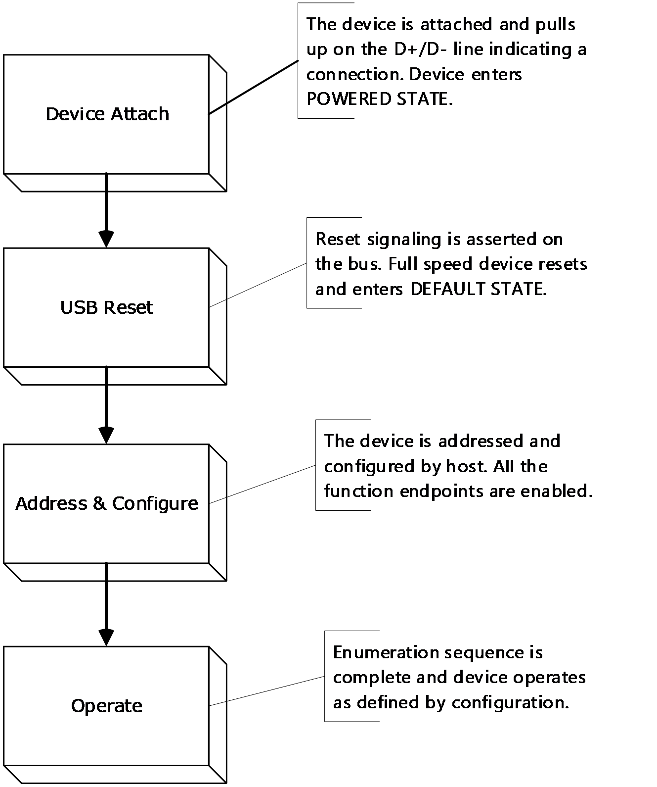

# [MS-XUSBI]: Xbox Universal Serial Bus Protocol (XUSB) Interface Extension

Table of Contents

1 Introduction

- [1 Introduction](#Section_1)
  - [1.1 Glossary](#Section_1.1)
  - [1.2 References](#Section_1.2)
    - [1.2.1 Normative References](#Section_1.2.1)
    - [1.2.2 Informative References](#Section_1.2.2)
  - [1.3 Overview](#Section_1.3)
    - [1.3.1 XUSB Device Interface General Specifications](#Section_1.3.1)
    - [1.3.2 XUSB Adapter USB Interface General Specifications](#Section_1.3.2)
    - [1.3.3 XUSB Transfers](#Section_1.3.3)
    - [1.3.4 Polling Interval and Idle Rate](#Section_1.3.4)
  - [1.4 Relationship to Other Protocols](#Section_1.4)
  - [1.5 Prerequisites/Preconditions](#Section_1.5)
  - [1.6 Applicability Statement](#Section_1.6)
  - [1.7 Versioning and Capability Negotiation](#Section_1.7)
  - [1.8 Vendor-Extensible Fields](#Section_1.8)
  - [1.9 Standards Assignments](#Section_1.9)

2 Messages

- [2 Messages](#Section_2)
  - [2.1 Transport](#Section_2.1)
  - [2.2 Message Syntax](#Section_2.2)
    - [2.2.1 USB Device Framework](#Section_2.2.1)
    - [2.2.2 XUSB High Level Interface](#Section_2.2.2)
      - [2.2.2.1 Device Types and Subtypes](#Section_2.2.2.1)
        - [2.2.2.1.1 XUSB Device Subtypes Definitions](#Section_2.2.2.1.1)
        - [2.2.2.1.2 Game Controller (0x01)](#Section_2.2.2.1.2)
        - [2.2.2.1.3 Racing Wheel](#Section_2.2.2.1.3)
        - [2.2.2.1.4 Arcade Stick/Pad](#Section_2.2.2.1.4)
        - [2.2.2.1.5 Flight Stick](#Section_2.2.2.1.5)
        - [2.2.2.1.6 Dance Pad](#Section_2.2.2.1.6)
        - [2.2.2.1.7 Guitar Standard/Alternate/Bass](#Section_2.2.2.1.7)
      - [2.2.2.2 Device Enumeration](#Section_2.2.2.2)
      - [2.2.2.3 XUSB Device Interfaces and Endpoints](#Section_2.2.2.3)
    - [2.2.3 XUSB Adapter USB High Level Interface](#Section_2.2.3)
      - [2.2.3.1 XUSB Adapter Interfaces and Endpoints](#Section_2.2.3.1)
    - [2.2.4 XUSB Descriptors](#Section_2.2.4)
      - [2.2.4.1 Standard Device Descriptor](#Section_2.2.4.1)
      - [2.2.4.2 Standard Configuration Descriptor](#Section_2.2.4.2)
      - [2.2.4.3 Standard Interface Descriptor](#Section_2.2.4.3)
      - [2.2.4.4 Standard Endpoint Report Descriptor](#Section_2.2.4.4)
      - [2.2.4.5 XUSB Interface Device Descriptor (Vendor Specific)](#Section_2.2.4.5)
      - [2.2.4.6 Microsoft OS Descriptor](#Section_2.2.4.6)
    - [2.2.5 XUSB Wireless Device Descriptors](#Section_2.2.5)
    - [2.2.6 Charge and Play Device Descriptors](#Section_2.2.6)
    - [2.2.7 XUSB Adapter USB Descriptors](#Section_2.2.7)
      - [2.2.7.1 Standard Device Descriptor](#Section_2.2.7.1)
      - [2.2.7.2 Standard Configuration Descriptor](#Section_2.2.7.2)
      - [2.2.7.3 Standard Interface Descriptor](#Section_2.2.7.3)
      - [2.2.7.4 Standard Endpoint Report Descriptor](#Section_2.2.7.4)
      - [2.2.7.5 XUSB Adapter Interface Descriptor (Vendor Specific)](#Section_2.2.7.5)
    - [2.2.8 XUSB Reports](#Section_2.2.8)
      - [2.2.8.1 XUSB Requests](#Section_2.2.8.1)
      - [2.2.8.2 Get_Report (Input)](#Section_2.2.8.2)
      - [2.2.8.3 Set_Report (Output)](#Section_2.2.8.3)
      - [2.2.8.4 Set_Control Request](#Section_2.2.8.4)
      - [2.2.8.5 Get_Device_ID (Input)](#Section_2.2.8.5)
      - [2.2.8.6 Set_Bind_Info (Output)](#Section_2.2.8.6)
      - [2.2.8.7 GET_CAPABILITIES Request](#Section_2.2.8.7)
    - [2.2.9 XUSB Adapter Reports](#Section_2.2.9)
      - [2.2.9.1 XUSB Adapter USB Requests](#Section_2.2.9.1)
      - [2.2.9.2 Get_Report (Input)](#Section_2.2.9.2)
      - [2.2.9.3 Set_Report (Output)](#Section_2.2.9.3)
      - [2.2.9.4 Get_Device_ID (Input)](#Section_2.2.9.4)
      - [2.2.9.5 Get_Bind_Info (Input)](#Section_2.2.9.5)

3 Protocol Details

- [3 Protocol Details](#Section_3)
  - [3.1 XUSB Interfaces Overview](#Section_3.1)
  - [3.2 Game Controller Interface (Interface 0) Details](#Section_3.2)
    - [3.2.1 Abstract Data Model](#Section_3.2.1)
      - [3.2.1.1 Game Controller Interface Descriptors](#Section_3.2.1.1)
        - [3.2.1.1.1 Interface Descriptor](#Section_3.2.1.1.1)
        - [3.2.1.1.2 XUSB Interface Device Descriptor](#Section_3.2.1.1.2)
        - [3.2.1.1.3 Endpoint Descriptor (IN 0x81)](#Section_3.2.1.1.3)
        - [3.2.1.1.4 Endpoint Descriptor (OUT 0x02)](#Section_3.2.1.1.4)
    - [3.2.2 Timers](#Section_3.2.2)
    - [3.2.3 Initialization](#Section_3.2.3)
    - [3.2.4 Higher-Layer Triggered Events](#Section_3.2.4)
    - [3.2.5 Message Processing Events and Sequencing Rules](#Section_3.2.5)
      - [3.2.5.1 Input Data Reports](#Section_3.2.5.1)
        - [3.2.5.1.1 Default Game Controller Input Report (Report ID 0x00)](#Section_3.2.5.1.1)
        - [3.2.5.1.2 Device Status Input Reports](#Section_3.2.5.1.2)
        - [3.2.5.1.3 LED State Report (Report ID 0x01)](#Section_3.2.5.1.3)
        - [3.2.5.1.4 Rumble Level Setting (Report ID 0x03)](#Section_3.2.5.1.4)
        - [3.2.5.1.5 Battery Level & Type (Report ID 0x04)](#Section_3.2.5.1.5)
        - [3.2.5.1.6 Device Connection Report (Report ID 0x08)](#Section_3.2.5.1.6)
      - [3.2.5.2 Output Data Reports](#Section_3.2.5.2)
        - [3.2.5.2.1 Game Pad Rumble Motor Control Report (Report ID 0x00)](#Section_3.2.5.2.1)
        - [3.2.5.2.2 LED Control Request Report (Report ID 0x01)](#Section_3.2.5.2.2)
        - [3.2.5.2.3 Master Rumble Level Control (Report ID 0x02)](#Section_3.2.5.2.3)
    - [3.2.6 Timer Events](#Section_3.2.6)
    - [3.2.7 Other Local Events](#Section_3.2.7)
  - [3.3 Voice Communicator Interface (Interface 1) Details](#Section_3.3)
    - [3.3.1 Abstract Data Model](#Section_3.3.1)
      - [3.3.1.1 Voice Communicator Interface Descriptors](#Section_3.3.1.1)
        - [3.3.1.1.1 Interface Descriptor](#Section_3.3.1.1.1)
        - [3.3.1.1.2 XUSB Interface Device Descriptor](#Section_3.3.1.1.2)
        - [3.3.1.1.3 Endpoint Descriptor (IN 0x83)](#Section_3.3.1.1.3)
        - [3.3.1.1.4 Endpoint Descriptor (IN 0x85)](#Section_3.3.1.1.4)
        - [3.3.1.1.5 Endpoint Descriptor (OUT 0x04)](#Section_3.3.1.1.5)
        - [3.3.1.1.6 Endpoint Descriptor (OUT 0x06)](#Section_3.3.1.1.6)
    - [3.3.2 Timers](#Section_3.3.2)
    - [3.3.3 Initialization](#Section_3.3.3)
    - [3.3.4 Higher-Layer Triggered Events](#Section_3.3.4)
    - [3.3.5 Message Processing Events and Sequencing Rules](#Section_3.3.5)
      - [3.3.5.1 Voice Interrupt IN Endpoint (0x83)](#Section_3.3.5.1)
      - [3.3.5.2 Voice Interrupt IN Endpoint 2 (0x85)](#Section_3.3.5.2)
        - [3.3.5.2.1 Headset Status Report](#Section_3.3.5.2.1)
        - [3.3.5.2.2 Microphone Status Report](#Section_3.3.5.2.2)
        - [3.3.5.2.3 Playback Volume Setting Report](#Section_3.3.5.2.3)
        - [3.3.5.2.4 Vox Setting Report](#Section_3.3.5.2.4)
        - [3.3.5.2.5 AGC Status Report](#Section_3.3.5.2.5)
        - [3.3.5.2.6 Voice Codec Report](#Section_3.3.5.2.6)
      - [3.3.5.3 Voice Interrupt OUT Endpoint (0x04)](#Section_3.3.5.3)
      - [3.3.5.4 Voice control Interrupt OUT Endpoint (0x06)](#Section_3.3.5.4)
        - [3.3.5.4.1 Voice Input Codec Selection](#Section_3.3.5.4.1)
        - [3.3.5.4.2 Microphone Mute Control](#Section_3.3.5.4.2)
        - [3.3.5.4.3 Playback Volume Setting Report](#Section_3.3.5.4.3)
        - [3.3.5.4.4 Vox Control](#Section_3.3.5.4.4)
        - [3.3.5.4.5 AGC Control](#Section_3.3.5.4.5)
    - [3.3.6 Timer Events](#Section_3.3.6)
    - [3.3.7 Other Local Events](#Section_3.3.7)
  - [3.4 Text Input Device Interface (Interface 2) Details](#Section_3.4)
    - [3.4.1 Abstract Data Model](#Section_3.4.1)
      - [3.4.1.1 Text Input Device Interface Descriptors](#Section_3.4.1.1)
        - [3.4.1.1.1 TID Interface Descriptor](#Section_3.4.1.1.1)
        - [3.4.1.1.2 XUSB Interface Device Descriptor](#Section_3.4.1.1.2)
        - [3.4.1.1.3 Endpoint Descriptor (IN 0x87)](#Section_3.4.1.1.3)
    - [3.4.2 Timers](#Section_3.4.2)
    - [3.4.3 Initialization](#Section_3.4.3)
    - [3.4.4 Higher-Layer Triggered Events](#Section_3.4.4)
    - [3.4.5 Message Processing Events and Sequencing Rules](#Section_3.4.5)
      - [3.4.5.1 Default TID Input Report (Report ID 0x00)](#Section_3.4.5.1)
        - [3.4.5.1.1 TID Backlight Status Report (Report ID 0x01)](#Section_3.4.5.1.1)
        - [3.4.5.1.2 TID Control Request](#Section_3.4.5.1.2)
    - [3.4.6 Timer Events](#Section_3.4.6)
    - [3.4.7 Other Local Events](#Section_3.4.7)
  - [3.5 XUSB Adapter USB Interfaces Structure](#Section_3.5)
    - [3.5.1 Abstract Data Model](#Section_3.5.1)
      - [3.5.1.1 XUSB Adapter Controller and Devices Control Interface](#Section_3.5.1.1)
        - [3.5.1.1.1 Interface Descriptor](#Section_3.5.1.1.1)
        - [3.5.1.1.2 XUSB Adapter Interface Device Descriptor](#Section_3.5.1.1.2)
        - [3.5.1.1.3 Endpoint Descriptor (IN 0x81)](#Section_3.5.1.1.3)
        - [3.5.1.1.4 Endpoint Descriptor (OUT 0x02)](#Section_3.5.1.1.4)
    - [3.5.2 Timers](#Section_3.5.2)
    - [3.5.3 Initialization](#Section_3.5.3)
    - [3.5.4 Higher-Layer Triggered Events](#Section_3.5.4)
    - [3.5.5 Message Processing Events and Sequencing Rules](#Section_3.5.5)
      - [3.5.5.1 Game Controller Input Data Transfer](#Section_3.5.5.1)
        - [3.5.5.1.1 Wireless Controller Data/Device Status Input Report (Report ID 0x00)](#Section_3.5.5.1.1)
          - [3.5.5.1.1.1 Header Only Report Type 0x00](#Section_3.5.5.1.1.1)
          - [3.5.5.1.1.2 Header and Controller Data Type 0x01](#Section_3.5.5.1.1.2)
          - [3.5.5.1.1.3 Header, Controller, and Plug-in Module Data Type 0x03](#Section_3.5.5.1.1.3)
          - [3.5.5.1.1.4 Link Control Packet Type 0x0F](#Section_3.5.5.1.1.4)
        - [3.5.5.1.2 Same Slot Voice Device Reports (Report ID 0x01)](#Section_3.5.5.1.2)
          - [3.5.5.1.2.1 Device ID and Link Control Type 0x00](#Section_3.5.5.1.2.1)
          - [3.5.5.1.2.2 Device Transport Packet Type 0x01](#Section_3.5.5.1.2.2)
          - [3.5.5.1.2.3 Voice Header Packet Type 0xFF](#Section_3.5.5.1.2.3)
        - [3.5.5.1.3 Wireless Devices Connection Status Report (Report ID 0x08)](#Section_3.5.5.1.3)
      - [3.5.5.2 Game Controller Output Requests](#Section_3.5.5.2)
        - [3.5.5.2.1 Wireless Controller Control Request (Request ID 0x00)](#Section_3.5.5.2.1)
          - [3.5.5.2.1.1 Header Only Request Type 0x00](#Section_3.5.5.2.1.1)
          - [3.5.5.2.1.2 Rumble/Force Feedback Data Request Type 0x01](#Section_3.5.5.2.1.2)
        - [3.5.5.2.2 Voice Device Control Request (Request ID 0x01)](#Section_3.5.5.2.2)
          - [3.5.5.2.2.1 Transport Packet Type 0x01](#Section_3.5.5.2.2.1)
          - [3.5.5.2.2.2 Voice Header Only Packet Type 0x03](#Section_3.5.5.2.2.2)
        - [3.5.5.2.3 Wireless Devices Connection Request (Request ID 0x08)](#Section_3.5.5.2.3)
    - [3.5.6 Timer Events](#Section_3.5.6)
    - [3.5.7 Other Local Events](#Section_3.5.7)
  - [3.6 XUSB Adapter Voice Communicator Interface](#Section_3.6)
    - [3.6.1 Abstract Data Model](#Section_3.6.1)
      - [3.6.1.1 XUSB Adapter Voice Communicator Descriptors](#Section_3.6.1.1)
        - [3.6.1.1.1 Interface Descriptor](#Section_3.6.1.1.1)
        - [3.6.1.1.2 XUSB Adapter Interface Device Descriptor](#Section_3.6.1.1.2)
        - [3.6.1.1.3 Endpoint Descriptor (IN 0x84)](#Section_3.6.1.1.3)
        - [3.6.1.1.4 Endpoint Descriptor (OUT 0x04)](#Section_3.6.1.1.4)
    - [3.6.2 Timers](#Section_3.6.2)
    - [3.6.3 Initialization](#Section_3.6.3)
    - [3.6.4 Higher-Layer Triggered Events](#Section_3.6.4)
    - [3.6.5 Message Processing Events and Sequencing Rules](#Section_3.6.5)
      - [3.6.5.1 Voice Communicator Data Transfer](#Section_3.6.5.1)
        - [3.6.5.1.1 Upstream Voice Data](#Section_3.6.5.1.1)
        - [3.6.5.1.2 Downstream Voice Data](#Section_3.6.5.1.2)
    - [3.6.6 Timer Events](#Section_3.6.6)
    - [3.6.7 Other Local Events](#Section_3.6.7)

4 Protocol Examples

- [4 Protocol Examples](#Section_4)

5 Security

- [5 Security](#Section_5)
  - [5.1 Security Considerations for Implementers](#Section_5.1)
  - [5.2 Index of Security Parameters](#Section_5.2)

6 Appendix A: Descriptor and Protocol Definitions

- [6 Appendix A: Descriptor and Protocol Definitions](#Section_6)
  - [6.1 MS Interface Descriptor Type](#Section_6.1)
  - [6.2 MS Special Interface Protocol definitions](#Section_6.2)
  - [6.3 XUSB Adapter Interface Descriptor (Vendor Specific)](#Section_6.3)

7 Appendix B: Product Behavior

- [7 Appendix B: Product Behavior](#Section_7)

8 Change Tracking

- [8 Change Tracking](#Section_8)

For the legal notice and IP terms, see [LEGAL.md](../LEGAL.md).
Last updated: 9/16/2024.
See [Revision History](#revision-history) for full version history.

# 1 Introduction

The Xbox Universal Serial Bus Protocol (XUSB) Interface Extension is a modified version of the USB 2.0 interface that provides extended semantics for interaction between game controller devices and a host. The high level interface of the XUSB specification includes enumeration of device capabilities, determining of device type and subtype, transfer of gamepad and voice data, and support for an expansion device on the controller.

Sections 1.5, 1.8, 1.9, 2, and 3 of this specification are normative. All other sections and examples in this specification are informative.

## 1.1 Glossary

This document uses the following terms:

**frequency-hopping spread spectrum (FHSS) polynomial**: The frequency-hopping spread spectrum is a method of transmitting radio signals by rapidly switching a carrier among many frequency channels, using a pseudorandom sequence known to both transmitter and receiver. The construction of new FHSSs is based on the polynomial theory over the finite field.

**INF file**: A file that provides setup information required to set up a device, such as a list of valid logical configurations for the device and the names of driver files associated with the device.

**milliamperes**: A milliampere (also milliamp or mA) is 1/1000 of an ampere. An ampere is the basic unit for measuring electrical current showing the rate, or how fast, electrons flow through an electrical wire. One ampere is the current in which one coulomb of charge travels across a given point in 1 second.

**USB wires**: USB requires a shielded cable containing 4 wires. Two of these, D+ and D-, form a twisted pair responsible for carrying a differential data signal, as well as some single-ended signal states. (For low speed the data lines may not be twisted.) The signals on these two wires are referenced to the (third) GND wire. The fourth wire is called VBUS, and carries a nominal 5V supply, which may be used by a device for power.

**VBUS**: The VBUS supplies the input voltage to the system voltage regulator (SYSREG). VBUS voltage is supplied by an AC wall adapter or a USB port. Some Nano boards that operate on 3.3 V power have a pin called VUSB or VBUS, that will output power directly from the USB connector. The pin will not receive any power if no power is being supplied to the USB port.

**MAY, SHOULD, MUST, SHOULD NOT, MUST NOT:** These terms (in all caps) are used as defined in [[RFC2119]](https://go.microsoft.com/fwlink/?LinkId=90317). All statements of optional behavior use either MAY, SHOULD, or SHOULD NOT.

## 1.2 References

Links to a document in the Microsoft Open Specifications library point to the correct section in the most recently published version of the referenced document. However, because individual documents in the library are not updated at the same time, the section numbers in the documents may not match. You can confirm the correct section numbering by checking the [Errata](https://go.microsoft.com/fwlink/?linkid=850906).

### 1.2.1 Normative References

We conduct frequent surveys of the normative references to assure their continued availability. If you have any issue with finding a normative reference, please contact [dochelp@microsoft.com](mailto:dochelp@microsoft.com). We will assist you in finding the relevant information.

[RFC2119] Bradner, S., "Key words for use in RFCs to Indicate Requirement Levels", BCP 14, RFC 2119, March 1997, [https://www.rfc-editor.org/info/rfc2119](https://go.microsoft.com/fwlink/?LinkId=90317)

[USB-SPC2.0] USB Implementers Forum, Inc., "Document Library", USB 2.0 Specification, October 2021, [https://www.usb.org/documents](https://go.microsoft.com/fwlink/?LinkId=207891)

**Note** Search for 2.0 and Technology USB 2.0

### 1.2.2 Informative References

[MSDN-INFS] Microsoft Corporation, "Overview of INF Files", [https://learn.microsoft.com/en-us/windows-hardware/drivers/install/overview-of-inf-files](https://go.microsoft.com/fwlink/?linkid=842371)

[MSLEARN-XINPUT] Microsoft Corporation, "XInput Game Controller APIs", [https://learn.microsoft.com/en-us/windows/win32/xinput/xinput-game-controller-apis-portal](https://go.microsoft.com/fwlink/?linkid=2279834)

## 1.3 Overview

The Xbox Universal Serial Bus Protocol (XUSB) Interface Extension (XUSBI) is a modified version of the Universal Serial Bus (USB) Core protocol, an external bus architecture for connecting USB-capable peripheral devices to a host computer. XUSBI is based on the revision 2.0 of the USB specification [[USB-SPC2.0]](https://go.microsoft.com/fwlink/?LinkId=207891).

There are two parts to this specification: the XUSB device protocol specification and the XUSB adapter protocol specification for XUSB wireless adapter devices.

The XUSB device specification allows hardware manufacturers to produce standardized input devices to be picked up by the Windows Input APIs. Note that XUSB is now deprecated and no longer the recommended input mechanism.<1>

XUSB Adapter is a USB class device designed as a hub between the host and its wireless input peripheral devices. The USB interface for XUSB Wireless Adapter devices specification defines a simple bridge interface between the wireless input devices and host USB interface.

For more information, see [[MSLEARN-XINPUT]](https://go.microsoft.com/fwlink/?linkid=2279834).

### 1.3.1 XUSB Device Interface General Specifications

The XUSB interface is a slightly modified version of the USB 2.0 interface. For the XUSB device side, it has the following general specifications:

- Supports both USB low speed and full speed, but only one mode at a time.
- All XUSB devices MUST support control and interrupt IN and OUT transfers.
- Supports suspend/resume and remote wakeup. The remote wakeup feature is by default enabled in all states (power/default/address/configured).
- The transceiver can drive up to 6-meter cable for both low and full speed operations. Device is electrically compatible with standard USB 2.0/2.0 host controller.
The following table shows the XUSB interface signaling. Note [**USB wires**](#gt_usb-wires) for definitions.

| Signal | Description |
| --- | --- |
| 1 – USBVcc | +5 V power |
| 2 – D- | Data minus line |
| 3 – D+ | Data plus line |
| 4 – GND | Ground |

Table 1: XUSB signals

### 1.3.2 XUSB Adapter USB Interface General Specifications

The XUSB Adapter USB interface is a standard USB 2.0 interface. It has the following general specifications:

- Is integrated with USB 2.0 full speed transceivers.
- Supports both input and output reports.
- Does not support device suspend/remote wakeup.
- Device follows USB 2.0 protocol but not electrically compatible with standard USB 2.0 host controller.
The following table shows the XUSB Adapter interface signaling. The USB interface uses the pin 1 to 4. Note [**USB wires**](#gt_usb-wires) for definitions.

| Signal | Description |
| --- | --- |
| 1 – VCC | 3.3v |
| 2 – D- | Data minus line |
| 3 – D+ | Data plus line |
| 4 – GND | GND |

Table 2: XUSB Adapter Host Interface Signal

### 1.3.3 XUSB Transfers

**XUSB Transfers**

Only control and interrupt transfers are supported by XUSBI. To minimize the transfer overhead, XUSBI transfers have some specific requirements. The following apply to both low speed mode and full speed mode.

**Control Transfer:** The data payload for XUSB control transfer is 8 bytes minimum.

**Interrupt Transfer:** XUSB supports interrupt IN and interrupt OUT transfers. Interrupt IN and interrupt OUT transfers that support polling rate from 2 ms to 255 ms.

### 1.3.4 Polling Interval and Idle Rate

The host system follows the standard USB protocol and honors the bInterval in the device endpoint descriptors. XUSB device is prepared to respond to IN requests at fixed interval. For the input data report, it always responds with the latest unreported state. If the state changes multiple times between IN requests, only the last state SHOULD be reported. If the state does not change between IN requests, the device SHOULD negatively acknowledge (NAK) the IN request, regardless of the time since the previous acknowledge (ACK).

## 1.4 Relationship to Other Protocols

Xbox Universal Serial Bus Protocol Interface Extension (XUSBI) uses the Universal Serial Bus (USB) 2.0 Core protocol, an external bus architecture for connecting USB-capable peripheral devices to a host computer. The USB 2.0 Core is maintained by the USB Implementers Forum in its USB 2.0 base specification. For information on the USB 2.0 Core interface, see [[USB-SPC2.0]](https://go.microsoft.com/fwlink/?LinkId=207891) .

## 1.5 Prerequisites/Preconditions

A USB-enabled gaming device. The Xbox Universal Serial Bus Protocol Interface Extension (XUSBI) is based on USB 2.0 specification. For details on the USB 2.0 Core interface, see [[USB-SPC2.0]](https://go.microsoft.com/fwlink/?LinkId=207891).

## 1.6 Applicability Statement

Applies to USB-enabled devices.

## 1.7 Versioning and Capability Negotiation

The Xbox Universal Serial Bus Protocol (XUSB) Interface Extension (XUSBI) is based on only version 2.0 of the USB Core protocol.

## 1.8 Vendor-Extensible Fields

None.

## 1.9 Standards Assignments

None.

# 2 Messages

## 2.1 Transport

The Xbox Universal Serial Bus Protocol (XUSB) Interface Extension (XUSBI) transports messages via the Universal Serial Bus (USB) Core protocol. USB Core is an external bus architecture for connecting USB-capable peripheral devices to a host computer. The USB Core is maintained by the USB Implementers Forum. XUSBI protocol is based on the Universal Serial Bus Revision 2.0 specification [[USB-SPC2.0]](https://go.microsoft.com/fwlink/?LinkId=207891).

## 2.2 Message Syntax

### 2.2.1 USB Device Framework

An XUSB device MAY be divided into three layers:

- The top layer is the functionality provided by the serial bus device such as game pad or steering wheel.
- The middle layer handles the routing of data between the bus interface and various endpoints on the device.
- The bottom layer is a bus interface that transmits and receives packets.
**XUSB middle layer**

An endpoint is the ultimate consumer or provider of data. It MAY be thought of as a source or sink for data. For the middle layer, XUSB interface differs from USB 2.0. See section [3.2.1](#Section_3.2.1) for device states.

**XUSB bottom layer**

**Low Speed Operation:** The XUSB low speed bus interface follows the USB 2.0 low speed bus interface except it supports suspend/resume/remote wakeup in all states.

**Full Speed Operation:** The XUSB full speed operation follows the USB 2.0 full speed bottom layer specification except it supports suspend/resume/remote wakeup in all states.

### 2.2.2 XUSB High Level Interface

The following subsections define device types, subtypes, enumeration, interfaces, and endpoints.

#### 2.2.2.1 Device Types and Subtypes

The device type defines the primary use of the device. If a device supports a device type, it supports all devices of that type. The number of reports, their direction (input or output), and their format (field offsets, sizes, default values, and ranges) are determined by the device type and version

The device subtype implies additional information about the device, such as form factor and specific mapping of controls to the report fields. For example, a wheel subtype of the game controller type indicates the position of the steering wheel in a field determined by the subtype. The published mappings are designed to ensure that games do not need to know about the subtype. The subtype is available to games mainly for fine-tuning game play or user interfaces. Only a minority of games take advantage of knowing the subtype.

##### 2.2.2.1.1 XUSB Device Subtypes Definitions

The XUSB driver supports the definition of arbitrary device subtypes. A title can then use this subtype to filter for relevant input devices. These are exposed to HID-based APIs as a Gamepad with some limited exceptions. The following table describes the different strongly typed device subtypes and their corresponding subtype value (byte 4 of the XUSB Interface Device Descriptor). You can create one of these devices through the replacement of the gamepad subclass (0x01) in section [3.2.1.1.2](#Section_3.2.1.1.2) with any of the values in the following table.

| Subtype Class | Description |
| --- | --- |
| 0x01 | Game Controller |
| 0x02 | Racing Wheel |
| 0x03 | Arcade Stick |
| 0x04 | Flight Stick |
| 0x05 | Dance Pad |
| 0x06 | Guitar Standard |
| 0x07 | Guitar Alternate |
| 0x08 | Drum Kit |
| 0x0B | Guitar Bass |
| 0x13 | Arcade Pad |

Table 3: XUSB device subtypes

The input report based on Wired Game Controller defined in Input Data Reports section [3.2.5.1.1](#Section_3.2.5.1.1) applies to all of these types and is re-interpreted by the title. When exposed in HID format, the mappings described in the next few sections apply. Other buttons are ignored.

##### 2.2.2.1.2 Game Controller (0x01)

Game Controller XUSB to HID Report Mapping values are in the following table.

| HID Usage | XUSB Button |
| --- | --- |
| X | Left Thumbstick X |
| Y | Left Thumbstick Y |
| Rx | Right Thumbstick X |
| Ry | Right Thumbstick Y |
| Z | Left Trigger - Right Trigger |
| Button 1 | A Button |
| Button 2 | B Button |
| Button 3 | X Button |
| Button 4 | Y Button |
| Button 5 | LB Button |
| Button 6 | RB Button |
| Button 7 | Back Button |
| Button 8 | Start Button |
| Button 9 | Left Thumbstick Button |
| Button 10 | Right Thumbstick Button |
| Hat Switch | D-Pad |

Table 4: Game Controller XUSB to HID report mapping

The left trigger and right trigger are combined in opposite directions to form the Z-axis. The value is shifted by 8 bits to account for the Z value being a word. The X, Y, Rx, Ry, and Z usages are defined from 0x0000 to 0xFFFF. As such, the thumbstick values are recentered around 0x8000.

##### 2.2.2.1.3 Racing Wheel

Racing Wheel XUSB to HID Report Mapping values are in the following table.

Note that the Z value calculation is inverted when compared to the standard gamepad usage.

| HID Usage | XUSB Button |
| --- | --- |
| X | Left Thumbstick X |
| Y | Left Thumbstick Y |
| Rx | Right Thumbstick X |
| Ry | Right Thumbstick Y |
| Z | Left Trigger - Right Trigger |
| Button 1 | A Button |
| Button 2 | B Button |
| Button 3 | X Button |
| Button 4 | Y Button |
| Button 5 | LB Button |
| Button 6 | RB Button |
| Button 7 | Back Button |
| Button 8 | Start Button |
| Button 9 | Left Thumbstick Button |
| Button 10 | Right Thumbstick Button |
| Hat Switch | D-Pad |

Table 5: Racing Wheel XUSB to HID report mapping

##### 2.2.2.1.4 Arcade Stick/Pad

Arcade Stick/Pad values are in the following table.

| HID Usage | XUSB Button |
| --- | --- |
| Button 1 | A Button |
| Button 2 | B Button |
| Button 3 | X Button |
| Button 4 | Y Button |
| Button 5 | LB Button |
| Button 6 | RB Button |
| Button 7 | Back Button |
| Button 8 | Start Button |
| Button 9 | Left Trigger (treated as button) |
| Button 10 | Right Trigger (treated as button) |
| Hat Switch | D-Pad |

Table 6: Arcade Stick/Pad XUSB to HID report mapping

##### 2.2.2.1.5 Flight Stick

Flight Stick values are in the following table.

| HID Usage | XUSB Button |
| --- | --- |
| X (Flight Stick) | Left Thumbstick X |
| Y (Flight Stick) | Left Thumbstick Y |
| Rx (POV) | Right Thumbstick X |
| Ry (POV) | Right Thumbstick Y |
| Z (Throttle Lever) | Right Trigger |
| Rz (Twist/Rocker) | Left Trigger |
| Button 1 | A Button |
| Button 2 | B Button |
| Button 3 | X Button |
| Button 4 | Y Button |
| Button 5 | LB Button |
| Button 6 | RB Button |
| Button 7 | Back Button |
| Button 8 | Start Button |
| Button 9 | Left Thumbstick Button |
| Button 10 | Right Thumbstick Button |
| Hat Switch | D-Pad |

Table 7: Flight Stick XUSB to HID report mapping

##### 2.2.2.1.6 Dance Pad

Dance Pad values are in the following table.

| HID Usage | XUSB Button |
| --- | --- |
| Button 1 | A Button |
| Button 2 | B Button |
| Button 3 | X Button |
| Button 4 | Y Button |
| Button 5 | LB Button |
| Button 6 | RB Button |
| Button 7 | Back Button |
| Button 8 | Start Button |
| Button 9 | Left Thumbstick Button |
| Button 10 | Right Thumbstick Button |
| Hat Switch | D-Pad |

Table 8: Dance Pad/Pad XUSB to HID report mapping

##### 2.2.2.1.7 Guitar Standard/Alternate/Bass

Guitar Standard/Alternate/Bass XUSB to HID report mappings are in the following table.

| HID Usage | XUSB Button |
| --- | --- |
| Rz (Orientation) | Right Thumbstick Y |
| Slider (Whammy) | Right Thumbstick X |
| Button 1 | A Button |
| Button 2 | B Button |
| Button 3 | X Button |
| Button 4 | Y Button |
| Button 5 | LB Button |
| Button 6 | RB Button |
| Button 7 | Back Button |
| Button 8 | Start Button |
| Button 9 | Left Thumbstick Button |
| Button 10 | Right Thumbstick Button |
| Hat Switch | D-Pad |
| Dial (Pickup Selector) | Left Trigger (excluded for Alternate) |

Table 9: Guitar Standard/Alternate/Bass XUSB to HID report mapping

#### 2.2.2.2 Device Enumeration

The device enumeration process follows the standard USB enumeration process with additional descriptors supported. After the device is enumerated, it supports operation mode switching. The following figure illustrates the enumeration process.

Figure 1: XUSB device enumeration process

#### 2.2.2.3 XUSB Device Interfaces and Endpoints

XSUB devices support the following interfaces and endpoints:

- Default control interface
- One control endpoint with 8-byte FIFO size
- Game Controller Interface
- One interrupt IN endpoint
- One interrupt OUT endpoint
- Voice Communicator Interface (optional)
- Two interrupt IN endpoints with 32-byte FIFO for each
- Two interrupt OUT endpoint with 32-byte FIFO
- Text Input Device Interface (optional)
- One interrupt IN endpoint with 32-byte FIFO
The following table summarizes the specifications for the XUSB endpoints.

| Bit Range | Field | Description |
| --- | --- | --- |
| Variable | - | - Min Max Min Max |
| Variable | Control Transfer | 1 8 - - - |
| Variable | Interrupt IN | 4 8 64 2 255 |
| Variable | Interrupt OUT | 3 8 64 4 255 |

Table 10: XUSB Endpoints

### 2.2.3 XUSB Adapter USB High Level Interface

The following subsection defines the XUSB adapter interfaces and endpoints.

#### 2.2.3.1 XUSB Adapter Interfaces and Endpoints

XUSB Adapter supports the following interfaces and endpoints:

- Default control interface
- Support one control endpoint
- Downstream game controller 1 interface
- One interrupt IN endpoint with 32-byte FIFO
- One Interrupt OUT with 32-byte FIFO
- Downstream game controller 2 interface
- One interrupt IN endpoint with 32-byte FIFO
- One Interrupt OUT with 32-byte FIFO
- Downstream game controller 3 interface
- One interrupt IN endpoint with 32-byte FIFO
- One Interrupt OUT with 32-byte FIFO
- Downstream game controller 4 interface
- One interrupt IN endpoint with 32-byte FIFO
- One Interrupt OUT with 32-byte FIFO
- Downstream voice device 1 interface
- One interrupt IN endpoint with 32-byte FIFO
- One Interrupt OUT with 32-byte FIFO
- Downstream voice device 2 interface
- One interrupt IN endpoint with 32-byte FIFO
- One Interrupt OUT with 32-byte FIFO
- Downstream voice device 3 interface
- One interrupt IN endpoint with 32-byte FIFO
- One Interrupt OUT with 32-byte FIFO
- Downstream voice device 4 interface
- One interrupt IN endpoint with 32-byte FIFO
- One Interrupt OUT with 32-byte FIFO
The following table summarizes the specifications for the XUSB Adapter transfers.

| Bit Range | Field | Description |
| --- | --- | --- |
| Variable | - | - Min Max Min Max |
| Variable | Control Transfer | 1 8 - - - |
| Variable | Interrupt IN | 8 - 32 1 32 |
| Variable | Interrupt OUT | 8 - 32 4 32 |

Table 11: XUSB Adapter USB Transfer Specification

XUSB adapter devices SHOULD associate gamepad data and voice data for the different devices to endpoints. The following table defines the association. In this table, a lower number for priority means a higher priority.

| Endpoint | Slot within RF Frame | Priority for Data Device | Priority for Voice Only Device |
| --- | --- | --- | --- |
| 0x81 – data in | Gamepad 1 data, Slot 0 | 1 | 4 |
| 0x01 – data out | Gamepad 1 data, Slot 10 | 1 | 4 |
| 0x82 – voice in | Gamepad 1 voice, Slot 1 | 1 | 4 |
| 0x02 – voice out | Gamepad 1 voice, Slot 8 | 1 | 4 |
| 0x83 – data in | Gamepad 2 data, Slot 2 | 2 | 3 |
| 0x03 – data out | Gamepad 2 data, Slot 10 | 2 | 3 |
| 0x84 – voice in | Gamepad 2 voice, Slot 3 | 2 | 3 |
| 0x04 – voice out | Gamepad 2 voice, Slot 9 | 2 | 3 |
| 0x85 – data in | Gamepad 3 data, Slot 4 | 3 | 2 |
| 0x05 – data out | Gamepad 3 data, Slot 10 | 3 | 2 |
| 0x86 – voice in | Gamepad 3 voice, Slot 5 | 3 | 2 |
| 0x06 – voice out | Gamepad 3 voice, Slot 11 | 3 | 2 |
| 0x87 – data in | Gamepad 4 data, Slot 6 | 4 | 1 |
| 0x07 – data out | Gamepad 4 data, Slot 10 | 4 | 1 |
| 0x88 – voice in | Gamepad 4 voice, Slot 7 | 4 | 1 |
| 0x08 – voice out | Gamepad 4 voice, Slot 12 | 4 | 1 |

Table 12: Endpoint to RF slot assignment

For an attaching data device, it is assigned the endpoints with the highest priority from the ones available. For a voice only device, it is assigned the endpoints with the highest priority from the available ones. Note that the assigned endpoint is completely independent of VPort assignment.

The voice endpoints, even numbered endpoints, contain only voice data. A voice only device MAY use the data endpoints, odd numbered endpoints, to handle reports and requests. For more details, see Same Slot Voice Device Reports (Report ID 0x01) section [3.5.5.1.2](#Section_3.5.5.1.2).

### 2.2.4 XUSB Descriptors

All XUSB devices MUST support the following descriptors:

- Standard USB device descriptor
- Standard USB Configuration descriptor
- Standard USB Interface descriptor
- Standard USB Endpoint descriptor
- XUSB interface descriptor (vendor specific)
- Microsoft OS Descriptor

#### 2.2.4.1 Standard Device Descriptor

This is the standard USB device descriptor, and the format is shown in the following table.

| Bit Range | Field | Description |
| --- | --- | --- |
| Variable | 0 | bLength 1 Number Size of the descriptor |
| Variable | 1 | bDescriptorType 1 0x01 Device descriptor |
| Variable | 2 | bcdUSB 2 0x0200 USB spec 2.0 |
| Variable | 4 | bDeviceClass 1 0xFF Vendor Specific |
| Variable | 5 | bDeviceSubclass 1 0xFF Vendor Specific |
| Variable | 6 | bDeviceProtocol 1 0xFF Vendor Specific |
| Variable | 7 | bMaxPacketSize 1 0x08 varies |
| Variable | 8 | idVendor 2 0x045E Microsoft |
| Variable | 10 | idProduct 2 ID Product ID |
| Variable | 12 | bcdDevice 2 BCD Device release version |
| Variable | 14 | iManufacturer 1 0x01 Support manufacturer string descriptor |
| Variable | 15 | iProduct 1 0x02 Support product string descriptor |
| Variable | 16 | iSerial 1 0x03 Support serial string descriptor |
| Variable | 17 | bNumConfigure 1 0x01 Number of configurations: 1 |

Table 13: USB device descriptor

The device type and subtype are defined in standard interface descriptor. XUSB device MUST support string descriptors.

#### 2.2.4.2 Standard Configuration Descriptor

This is the standard Configuration descriptor, and the format is shown in the following table.

| Bit Range | Field | Description |
| --- | --- | --- |
| Variable | 0 | bLength 1 Number Size of this descriptor in bytes. |
| Variable | 1 | bDescriptorType 1 Constant CONFIGURATION Descriptor Type. |
| Variable | 2 | wTotalLength 2 Number Total length of data returned for this configuration. This includes this descriptor, all the interface descriptors, and their endpoint descriptors. |
| Variable | 4 | bNumInterfaces 1 Number Number of interfaces associated with the configuration. The value is 4 for game pad with voice integrated. |
| Variable | 5 | bConfigurationValue 1 0x01 Value to use to set this configuration. This MUST be 1. |
| Variable | 6 | iConfiguration 1 0x00 No string descriptor for this configuration |
| Configuration characteristics: D7: Reserved (set to one) D6: Self-powered D5: 1, always support remote wakeup D4...0: Reserved (reset to zero) D7: Reserved and MUST be set to one for historical reasons | 7 | bmAttributes 1 Bitmap |
| Total peak current consumption in mA ([**milliamperes**](#gt_milliamperes)). See section [2.2.7.2](#Section_2.2.7.2) and section [2.2.7.3](#Section_2.2.7.3). | 8 | MaxPower 1 Number |

Table 14: Standard Configuration descriptor

#### 2.2.4.3 Standard Interface Descriptor

This is the standard Interface descriptor, and the format is shown in the following table.

| Bit Range | Field | Description |
| --- | --- | --- |
| Variable | 0 | bLength 1 Number Size of this descriptor in bytes |
| Variable | 1 | bDescriptorType 1 Constant INTERFACE descriptor type |
| Variable | 2 | bInterfaceNumber 1 Number Number of interface |
| Variable | 3 | bAlternateSetting 1 0x00 XUSB device does not support alternate setting |
| Variable | 4 | bNumEndpoints 1 Number Total endpoint number for this interface |
| Variable | 5 | bInterfaceClass 1 0xFF Vendor specific class |
| Variable | 6 | bInterfaceSubClass 1 0x5D MS USB devices |
| Variable | 7 | bInterfaceProtocol 1 Number Protocol code, such as, XUSB game pad, TID, voice communicator |
| Variable | 8 | iInterface 1 Number String descriptor for interface (optional) |

Table 15: Interface descriptor

#### 2.2.4.4 Standard Endpoint Report Descriptor

This is the standard Endpoint Report descriptor, and the format is shown in the following table.

| Bit Range | Field | Description |
| --- | --- | --- |
| Variable | 0 | bLength 1 Number Size of this descriptor in bytes. |
| Variable | 1 | bDescriptorType 1 Constant ENDPOINT Descriptor Type. |
| Bit 3..0 Endpoint Number Bit 6..4 Reserved MUST be 0 Bit 7 Direction: 1 = IN, 0=OUT | 2 | bEndpointAddress 1 Number |
| Variable | 3 | bmAttributes 1 Bitmap 3 = interrupt endpoint. XUSB has only interrupt endpoints aside from the default endpoint, which does not have a descriptor. |
| It is not necessary for the packet size to accommodate the largest report in a single packet. One report can be sent with two packets if it is defined that way in the identifier descriptor Bit 10 to 0 specifies the maximum packet size. | 4 | wMaxPacketSize 2 Number |
| Variable | 6 | bInterval 1 Number Polling interval in milliseconds. |

Table 16: Endpoint Report descriptor

#### 2.2.4.5 XUSB Interface Device Descriptor (Vendor Specific)

This vendor specific descriptor is to provide host additional information about the XUSB device itself. This is an interface level descriptor for each interface. It also contains the number of reports supported for each endpoint in this interface, as well as the size for each report.

This descriptor is returned to host as part of the configuration descriptor. It follows the interface descriptor and before the endpoint descriptor. This descriptor cannot be retrieved separately. The following table has device descriptors.

| Bit Range | Field | Description |
| --- | --- | --- |
| Variable | 0 | bLength 1 Number Size of the descriptor |
| Variable | 1 | bDescriptorType 1 0x21 XUSB interface descriptor |
| Variable | 2 | bcdXUSB 2 BCD XUSB protocol version |
| Variable | 4 | bDeviceSubtype 1 Number Subtype of the device, used together with the bInterfaceprotocol field in the interface descriptor |
| High byte: endpoint address Low byte: D7…D4: Endpoint type 0000: Data only endpoint 0001: Control/status only endpoint 0010: Data-control/status mix endpoint Rest: Reserved D3…D0: Number of report supported in this endpoint | 5 | wReports 2 Number |
| Variable | 7 | breportsize 1 Number Report size for the first report ID 0x00 |
| Variable | 8 | breportsize 1 Number Report size for additional reports, follow the sequential order of the ID |
| Variable | . . . | - - - - |
| Variable | - | wReport 2 Number Last endpoint address and number of report |
| Variable | - | bReportSize 1 Number Report size for the last endpoint |

Table 17: XUSB Device descriptor

#### 2.2.4.6 Microsoft OS Descriptor

When an operating system that supports the MS OS Descriptor identifies a XUSB device, it queries the device to check for the presence of a Microsoft OS String Descriptor – via a GET_DESCRIPTOR request to find out if it supports one or more of the MS OS Feature Descriptors. If the device supports the Extended Compatible ID Descriptor, Windows generates additional compatible IDs that can be matched on via an [**INF file**](#gt_inf-file). See [[MSDN-INFS]](https://go.microsoft.com/fwlink/?linkid=842371) for more information about INF files.

The MS OS String Descriptor is always stored at index 0xEE. Version 1.00 is always 18 bytes. It is retrieved with a standard GET_DESCRIPTOR request. The descriptor format is shown in the following table.

| Bit Range | Field | Description |
| --- | --- | --- |
| Variable | bLength | 1 0x12 Length of the descriptor |
| Variable | bDescriptorType | 1 0x03 String Descriptor |
| Variable | qwSignature | 14 'MSFT100' Signature field (4D00530046005400310030003000) |
| Variable | bMS_VendorCode | 1 Custom Vendor code to fetch OS Feature Descriptors |
| Variable | bPad | 1 0x00 Pad field |

Table 18: OS Descriptor format

The only non-fixed part of the request is bMS_VendorCode. This is the special request code that Windows retrieves from the MS OS String Descriptor and uses to retrieve the MS OS Feature Descriptors.

After retrieving the MS OS String Descriptor, Windows uses the bMS_VendorCode stored in the MS OS String Descriptor to send a second request. It MAY query for different types of MS OS Feature Descriptors. The wIndex field indicates the type requested.

All XUSB devices SHOULD support the Extended Compatible ID Descriptor (wIndex of 0x0004). Any other MS OS Feature Descriptor request can be failed (STALL). Extended Compatible ID Descriptor is shown in the following table.

| Bit Range | Field | Description |
| --- | --- | --- |
| Variable | 0 | dwLength 4 0x0028 Length of this descriptor, in bytes |
| Variable | 4 | bcdVersion 2 0x0100 Version 1.0 |
| Variable | 6 | wIndex 2 0x0004 Extended Configuration Descriptor |
| Variable | 8 | bCount 1 0x01 Total number of Function Sections that follow the Header Section. |
| Variable | 9 | RESERVED 7 0x00000000000000 Reserved |
| Variable | 16 | bFirstInterfaceNumber 1 0x00 Starting Interface Number for this function. |
| Variable | 17 | bNumInterfaces 1 Number This SHOULD be the same value returned as part of the configuration descriptor. |
| Variable | 18 | compatibleID 8 0x58, 0x55, 0x53, 0x42, 0x31, 0x30, 0x00, 0x00 'XUSB10'. Designates XBOX 1.0 (XUSB 1.0) Compatible device. |
| Variable | 26 | subCompatibleID 8 0x0000000000000000 Secondary compatible id (none). |
| Variable | 34 | RESERVED 6 0x000000000000 Reserved |

Table 19: Compatible ID descriptor

### 2.2.5 XUSB Wireless Device Descriptors

For wireless devices, the XUSB driver looks for a different bus type in the XUSB Interface Device Descriptor offset 1 section [2.2.4.5](#Section_2.2.4.5). The standard value of 0x21 defines USB devices. 0x22 serves to identify an XUSB adapter. The following table shows the descriptors.

| Descriptor ID | Description |
| --- | --- |
| 0x21 | XUSB Device Descriptor |
| 0x22 | XUSB Adapter Descriptor |

Table 20: XUSB Interface descriptor type

### 2.2.6 Charge and Play Device Descriptors

**Note:** This path is not recommended and is only relevant for devices that cannot communicate to the host directly over USB.

Some devices cannot communicate directly to the host via USB. The driver can automatically pair these devices to a wireless adapter when connected to the host via the use of special cable devices. To enumerate this, you SHOULD present an interface descriptor with value 0xFF. The following table shows the values.

| Bit Range | Field | Description |
| --- | --- | --- |
| Variable | 0 | bLength 1 0x09 Size of this descriptor in bytes |
| Variable | 1 | bDescriptorType 1 0x04 INTERFACE descriptor type |
| Variable | 2 | bInterfaceNumber 1 0x01 Number of interface |
| Variable | 3 | bAlternateSetting 1 0x00 No alternate setting |
| Variable | 4 | bNumEndpoints 1 0x01 Total endpoint number for this interfaces |
| Variable | 5 | bInterfaceClass 1 0xFF Vendor specific class |
| Variable | 6 | bInterfaceSubClass 1 0x5D XUSB device. |
| Variable | 7 | bInterfaceProtocol 1 0xFF 0xFF for Charge and Play protocol |
| Variable | 8 | bInterfaceString 1 0x00 No string descriptor |

Table 21: Charge and Play descriptors

The charge and play device then needs to implement the Get_Device_ID and Set_Bind_Info control requests, which the host uses to set the bind information it obtained from a separate wireless adapter. The Device ID for the Charge and Play device SHOULD be reported to be the same as the connecting device.

### 2.2.7 XUSB Adapter USB Descriptors

All XUSB Adapter USB devices MUST support the following descriptors:

- Standard USB device descriptor
- Standard USB configure descriptor
- Standard USB interface descriptor
- Standard USB endpoint descriptor
- XUSB Adapter Interface descriptor (vendor specific)
All XUSB Adapter USB Descriptors with this implementation are listed in section [6](#Section_6).

#### 2.2.7.1 Standard Device Descriptor

This is the standard USB device descriptor, and the format is shown in the following table.

| Bit Range | Field | Description |
| --- | --- | --- |
| Variable | 0 | bLength 1 Number Size of the descriptor |
| Variable | 1 | bDescriptorType 1 0x01 Device descriptor |
| Variable | 2 | bcdUSB 2 0x0200 USB spec 2.0 |
| Variable | 4 | bDeviceClass 1 0xFF Vendor Specific |
| Variable | 5 | bDeviceSubclass 1 0xFF Vendor Specific |
| Variable | 6 | bDeviceProtocol 1 0xFF Vendor Specific |
| 8-byte data payload size | 7 | bMaxPacketSize 1 0x08 |
| Variable | 8 | idVendor 2 0x045E Microsoft |
| Variable | 10 | idProduct 2 0x0291 MS Product ID |
| Variable | 12 | bcdDevice 2 BCD Device release version |
| Variable | 14 | iManufacturer 1 0x00 Manufacturer string descriptor |
| Variable | 15 | iProduct 1 0x00 Product string descriptor |
| Variable | 16 | iSerial 1 0x00 Serial string descriptor |
| Variable | 17 | bNumConfigure 1 0x01 Number of configurations: 1 |

Table 22: XUSB standard device descriptor

#### 2.2.7.2 Standard Configuration Descriptor

This is the standard Configuration descriptor, and the format is shown in the following table.

| Bit Range | Field | Description |
| --- | --- | --- |
| Variable | 0 | bLength 1 Number Size of this descriptor in bytes. |
| Variable | 1 | bDescriptorType 1 Constant CONFIGURATION Descriptor Type. |
| Variable | 2 | wTotalLength 2 Number Total length of data returned for this configuration. This includes this descriptor, all the interface descriptors, and their endpoint descriptors. |
| Variable | 4 | bNumInterfaces 1 0x08 Number of interfaces associated with the configuration. |
| Variable | 5 | bConfigurationValue 1 0x01 Value to use to set this configuration. This MUST be 1. |
| Variable | 6 | iConfiguration 1 0x00 Index of string descriptor describing this configuration. |
| Variable | 7 | bmAttributes 1 Bitmap Ignored. |
| Total peak current consumption 260 mA ([**milliamperes**](#gt_milliamperes)). | 8 | MaxPower 1 0x82 |

Table 23: Standard Configuration descriptor

#### 2.2.7.3 Standard Interface Descriptor

This is the standard Interface descriptor, and the format is shown in the following table.

| Bit Range | Field | Description |
| --- | --- | --- |
| Variable | 0 | bLength 1 Number Size of this descriptor in bytes. |
| Variable | 1 | bDescriptorType 1 Constant CONFIGURATION Descriptor Type. |
| Variable | 2 | wTotalLength 2 Number Total length of data returned for this configuration. This includes this descriptor, all the interface descriptors, and their endpoint descriptors. |
| Variable | 4 | bNumInterfaces 1 0x08 Number of interfaces associated with the configuration. |
| Variable | 5 | bConfigurationValue 1 0x01 Value to use to set this configuration. This MUST be 1. |
| Variable | 6 | iConfiguration 1 0x00 Index of string descriptor that describes this configuration. |
| Variable | 7 | bmAttributes 1 Bitmap Ignored. |
| Total peak current consumption 260 mA ([**milliamperes**](#gt_milliamperes)). | 8 | MaxPower 1 0x82 |

Table 24: Standard Interface descriptor

#### 2.2.7.4 Standard Endpoint Report Descriptor

This is the standard Endpoint Report descriptor, and the format is shown in the following table.

| Bit Range | Field | Description |
| --- | --- | --- |
| Variable | 0 | bLength 1 Number Size of this descriptor in bytes. |
| Variable | 1 | bDescriptorType 1 Constant ENDPOINT Descriptor Type. |
| Bit 3…0: Endpoint Number Bit 6…4: Reserved MUST Be 0 Bit 7 Direction: 1 = IN, 0=OUT | 2 | bEndpointAddress 1 Number |
| Variable | 3 | bmAttributes 1 Bitmap 3 = interrupt endpoint. XUSB Adapter has only interrupt endpoints aside from the default endpoint, which does not have a descriptor. |
| It is not necessary for the packet size to accommodate the largest report in a single packet. One report can be sent with two packets if it is defined that way in the identifier descriptor. Bit 10 to 0 specifies the maximum packet size. | 4 | wMaxPacketSize 2 Number |
| Variable | 6 | bInterval 1 Number Polling interval in milliseconds. |

Table 25: Standard Endpoint Report descriptor

#### 2.2.7.5 XUSB Adapter Interface Descriptor (Vendor Specific)

This is the XUSB Adapter Interface descriptor, and the format is shown in the following table.

| Bit Range | Field | Description |
| --- | --- | --- |
| Variable | 0 | bLength 1 Number Size of the descriptor |
| Variable | 1 | bDescriptorType 1 0x22 XUSB Adapter interface descriptor |
| Variable | 2 | bcdXUSB Adapter 2 0x0100 XUSB Adapter protocol version 1.00 |
| High byte: endpoint address Low byte: D7…D4: Endpoint type 0000: Data only endpoint 0001: Control data-control/status mix endpoint Rest: Reserved D3…D0: Number of report supported in this endpoint | 4 | wReports 2 Number |
| Report size for report ID High byte: Report ID Low byte: Report size | 6 | wReportsize 2 Number |
| Report size for report ID High byte: Report ID Low byte: Report size | 8 | wReportsize 2 Number |
| Variable | . . . | - - - - |
| Variable | - | wReport 2 Number Last endpoint address and number of report |
| Report size for report ID High byte: Report ID Low byte: Report size | - | wReportsize 2 Number |

Table 26: XUSB Adapter Interface Device Descriptor

### 2.2.8 XUSB Reports

For XUSB status reports, the device MUST report all pending status reports to the host based on the sequence in which the status reports are generated.

XUSB device uses USB interrupt transfers for its data reports. The following table summarizes the report types and the associated endpoints. This table assumes the device is a full speed device and supports all the optional transfers.

| Bit Range | Field | Description |
| --- | --- | --- |
| Variable | Control Transfer (EP0) | XUSB descriptors device control Varies - |
| Variable | Interrupt IN (EP1) | Game pad input data & reports 32 4 |
| Variable | Interrupt IN (EP2) | Voice input data 32 2 |
| Variable | Interrupt IN (EP3) | Voice communicator status 5 255 |
| Variable | Interrupt IN (EP4) | TID input data 7 16 |
| Variable | Interrupt OUT (EP1) | Game pad control data 8 8 |
| Variable | Interrupt OUT (EP2) | Voice playback data 32 4 |
| Variable | Interrupt OUT (EP3) | Voice control data 32 16 |

Table 27: USB reports and associated endpoints

#### 2.2.8.1 XUSB Requests

The XUSB request format follows the same format as USB 2.0 standard requests. The following table shows the request data format.

| Bit Range | Field | Description |
| --- | --- | --- |
| Variable | 0 | bmRequestType 1 Bitmap Characteristics of request: D7: Data transfer direction 0 = Host-to-device 1 = Device-to-host D6...5: Type 0 = Standard 1 = Class 2 = Vendor 3 = Reserved D4...0: Recipient 0 = Device 1 = Interface 2 = Endpoint 3 = Other 4...31 = Reserved |
| Variable | 1 | bRequest 1 Value Specific to the request |
| Variable | 2 | wValue 2 Value Word-sized field that varies according to request |
| Variable | 4 | wIndex 2 Index or offset Word-sized field that varies according to request; typically used to pass an index or offset |
| Variable | 6 | wLength 2 Count Number of bytes to transfer if there is a Data stage |

Table 28: XUSB request format

The following table summarizes the requests that are supported by XUSB device. In the following table, the USB States column headers are defined as Def means Default, Adr means Address, and Cfg means Configured. In the Def, Adr and Cfg columns, S means STALL, and V means Valid. The device MUST STALL the requests that are not listed in this table.

|  | SETUP Packet | USB State |  | Column 5 | Column 6 | Column 7 | Column 8 | Column 9 | Column 10 |
| --- | --- | --- | --- | --- | --- | --- | --- | --- | --- |
| Request Name | bType | bReq | wVal | wInd | wLen | Def | Adr | Cfg | Comments |
| **Standard Requests** | - | - | - | - | - | - | - | - | - |
| GET_STATUS (Device) | 0x80 | 0x00 | 0x0000 | 0x0000 | 0x0002 | S | V | V | Remote wakeup status does not indicate true status. Remote wakeup is always enabled, but bogus status is given to satisfy PCs |
| GET_STATUS (Interface) | 0x81 | 0x00 | 0x0000 | 0x0000 | 0x0002 | S | S | S | Do not support |
| GET_STATUS (Endpoint) | 0x82 | 0x00 | 0x0000 | bEndpointAddress | 0x0002 | S | V/S | V | Gets halt status. Valid for only endpoint 0 in addressed state |
| CLEAR_FEATURE (Device) | 0x00 | 0x01 | 0x0001 | 0x0000 | 0x0000 | S | V | V | Remote wakeup really cannot be cleared but acts as though it can |
| CLEAR_FEATURE (Interface) | 0x01 | 0x01 | 0x0001 | 0x0000 | 0x0000 | S | S | S | - |
| CLEAR_FEATURE (Endpoint) | 0x02 | 0x01 | 0x0001 | 0x0000 | 0x0000 | S | V/S | V | Valid for only endpoint 0 in addressed state |
| SET_FEATURE (Device) | 0x00 | 0x03 | 0x0001 | 0x0000 | 0x0000 | S | V | V | Remote wakeup cannot be set but acts as though it can. Remote wakeup is always ON. Note that this is initiated even if the device is in the POWERED state |
| SET_FEATURE (Interface) | 0x01 | 0x03 | 0x0001 | 0x0000 | 0x0000 | S | S | S | - |
| SET_FEATURE (Endpoint) | 0x02 | 0x03 | 0x0001 | 0x0000 | 0x0000 | S | V/S | V | Valid for only endpoint 0 in addressed state |
| SET_ADDRESS | 0x00 | 0x05 | Addr | 0x0000 | 0x0000 | V | V | **S** | - |
| GET_DESCRIPTOR (Device) | 0x80 | 0x06 | 0x0100 | 0x0000 | Length | V | V | V | Returns up to 18 bytes |
| GET_DESCRIPTOR (Config) | 0x80 | 0x06 | 0x0200 | 0x0000 | Length | V | V | V | Return Configure descriptor |
| GET_CONFIGURATION | 0x80 | 0x08 | 0x0000 | 0x0000 | 0x0001 | **S** | V | V | Returns configuration value |
| SET_CONFIGURATION | 0x00 | 0x09 | Configure | 0x0000 | 0x0000 | **S** | V | V | Valid for configure 0x00 and 0x01 |
| SET_DESCRIPTOR (All) | 0x00 0x01 0x02 | 0x07 | 0x0100 | 0x0000 | Length | **S** | **S** | **S** | Not supported |
| GET_INTERFACE | 0x81 | 0x0A | 0x0000 | 0x0000 | 0x0001 | **S** | **S** | **S** | Do not support alternate interfaces |
| SET_INTERFACE | 0x01 | 0x0B | 0x0000 | 0x0000 | 0x0000 | **S** | **S** | **S** | Do not support alternate interfaces |
| **Vendor Specific Requests** | - | - | - | - | - | - | - | - | - |
| SET_CONTROL | 0x41 | 0x00 | Control | bInterface # | 0x0000 | **S** | **S** | **S** | Set the vendor specific control |
| GET_DEVICE_ID | 0xC0 | 0x01 | 0x0000 | 0x0000 | 0x0004 | **S** | **S** | V | Get the Device serial number, up to 32 bits |
| SET_BIND_INFO | 0x40 | 0x01 | 0x0001 | 0x0000 | 0x0007 | S | S | V | Set the binding information to the device (wireless device only) |
| **HID Requests** | - | - | - | - | - | - | - | - | - |
| GET_REPORT (input) | 0xA1 | 0x01 | 0x01xx | bInterface # | wLength | **S** | **S** | V | wLength bytes of input report. |
| SET_REPORT (Output) | 0x21 | 0x09 | 0x0200 | bInterface# | wLength | **S** | **S** | V | Set wLength bytes of device output control data |
| GET_CAPABILITIES | 0x?? | 0x?? | 0x01xx | bInterface # | wLength | **S** | **S** | **S** | - |
| **OS Descriptor Request** | - | - | - | - | - | - | - | - | - |
| Get_MS_OS_Descriptor | 0x80 | 0x06 | 0x03EE | 0x0000 | 0x0012 | **S** | V | V | Get the 18-byte Microsoft OS descriptor |
| Get_Extended_Configuration_Descriptor | 0xC0 | bVC | 0x0000 | 0x0004 | 0x0028 | **S** | V | V | Get the extended configuration descriptor bVC is the MS vendor code |

Table 29: XUSB Request summary

#### 2.2.8.2 Get_Report (Input)

The Get_Report requests the device to send host the most recent input data packet. Depending on the report ID specified in the **wValueL** field, the input data can be game pad/TID data or other input data reports that are reported in the endpoint report descriptor.

The data packet may or may not have been sent to host already. The following table shows the request format.

| Bit Range | Field | Description |
| --- | --- | --- |
| Variable | 0 | bmRequestType 1 0xA1 From device to host |
| Variable | 1 | bRequest 1 0x01 Get_Report |
| Variable | 2 | wValue 2 0x01xx wValueL: Input report ID wValueH: 0x01 for input report |
| Variable | 4 | wIndex 2 value Interface number |
| Variable | 6 | wLength 2 Count Length of the report requested |

Table 30: Get_Report request

#### 2.2.8.3 Set_Report (Output)

The Set_Report (rumble) sends the rumble motor control data information to the device. The format is shown in the following table.

| Bit Range | Field | Description |
| --- | --- | --- |
| Variable | 0 | bmRequestType 1 0x21 From host to device |
| Variable | 1 | bRequest 1 0x09 Set_Report |
| Variable | 2 | wValue 2 0x0200 0x0200 for output report |
| Variable | 4 | wIndex 2 Interface# Interface# |
| Variable | 6 | wLength 2 Count Length of the report requested |

Table 31: XUSB_Set_Report (output) request

#### 2.2.8.4 Set_Control Request

This request is to set the vendor specific request for a specific interface. The following table shows the request format.

| Bit Range | Field | Description |
| --- | --- | --- |
| Variable | 0 | - bmRequestType 1 0x41 From host to device, interface level |
| Variable | 1 | - bRequest 1 0x00 Set_Control |
| Variable | 2 | - wValue 2 wControl The control value |
| Variable | 4 | - wIndex 2 Interface# The interface # |
| Variable | 6 | - wLength 2 0x0000 No data stage |

Table 32: SET_CONTROL request

#### 2.2.8.5 Get_Device_ID (Input)

The Get_Device_ID requests XUSB device to send host back its unique serial ID. The following table shows the format. Each XUSB device MUST have a unique serial ID.

| Bit Range | Field | Description |
| --- | --- | --- |
| Variable | 0 | bmRequestType 1 0xC0 From host to device, device level |
| Variable | 1 | bRequest 1 0x01 - |
| Variable | 2 | wValue 2 0x0000 - |
| Variable | 4 | wIndex 2 0x0000 - |
| 32-bit device ID. The packet 0x01 0x23 0x45 0x67 represents the device ID 0x01234567. The high nibble of the LSB is reserved and set as 0. | 6 | wLength 2 0x0004 |

Table 33: Get_Device_ID request

#### 2.2.8.6 Set_Bind_Info (Output)

The Set_Bind_Info requests the USB device (unique serial ID and the [**frequency-hopping spread spectrum (FHSS) polynomial**](#gt_frequency-hopping-spread-spectrum-fhss-polynomial)) from the host and to save the information into its electrically erasable programmable read-only memory (EEPROM). This request only applies to wireless devices that communicate with an XUSB adapter. The values are in the following table. See section [2.2.9.5](#Section_2.2.9.5).

| Bit Range | Field | Description |
| --- | --- | --- |
| Variable | 0 | bmRequestType 1 0x40 From host to device, device level |
| Variable | 1 | bRequest 1 0x01 - |
| Variable | 2 | wValue 2 0x0000 - |
| Variable | 4 | wIndex 2 0x0000 - |
| B0…B3: 28-bit device ID The packet 0x12 0x34 0x56 0x70 represents the device ID 0x1234567. The high nibble of the LSB is reserved and set as 0. B4…B6: FHSS polynomial 20 bits polynomial for FHSS D23…D20: Set as 0 D19…D0: Polynomial | 6 | wLength 2 0x0007 |

Table 34: Set_Bind_Info request

#### 2.2.8.7 GET_CAPABILITIES Request

**XUSB v1.10 NOT USED**. This command is unused, and the values returned are ignored by the system.

This request is for XUSB version 1.10 and is not supported by XUSB 1.00 devices. GET_CAPABILITIES returns the capabilities of the device with respect to a specific report. If the device does not support the specified Report Type and Report ID, it SHOULD STALL the request. This request is only defined for the Gamepad Default Input Report.

If the device supports one or more fields, it SHOULD return a packet of the same structure as the report with a bit set for every bit that is functional in the report. This does not include calculated bits. If a field is 8-bits wide and scaled from 0 to 255, but the device only has 6-bit resolution, the device SHOULD return 0xFC (1111 1100B) in that field.

A device need only return data up to the last bit that is to be set. In practice, USB requires whole bytes be returned. Fields after the last data returned are assumed to be unsupported. This is necessary to support future extensions of reports. Devices MUST support GET_CAPABILITIES for every report supported. The following table shows the report format.

| Bit Range | Field | Description |
| --- | --- | --- |
| Variable | 0 | bmRequestType 1 0x?? - |
| Variable | 1 | bRequest 1 0x?? GET_CAPABILITIES |
| Variable | 2 | wValue 2 0x01xx D15…8: bReportType 0x01: Input Report D7…0: bReportID. |
| Variable | 4 | wIndex 2 0x0000 Game Controller Interface (Interface 0) |
| Variable | 6 | wLength 2 Count Report length in bytes. |

Table 35: GET_CAPABILITIES request

### 2.2.9 XUSB Adapter Reports

For XUSB Adapter other data such as voice and control/status, devices MUST report all the data based on the timing sequence the reports are generated

XUSB Adapter uses USB interrupt transfers for its data reports. The following table summarizes the report types and the associated endpoints. Note that the endpoint number listed in the table is for reference only. The actual endpoint number each interface uses is defined in the endpoint descriptors for each interface.

| Bit Range | Field | Description |
| --- | --- | --- |
| Variable | Control Transfer (EP0) | USB descriptors & device controls Varies - |
| Variable | Interrupt IN (EP1) | Game pad 1 input data & reports - - |
| Variable | Plug-in Module device 1 input report | Varies 1 - |
| Variable | Interrupt IN (EP2) | Voice 1 input data 64 2 |
| Variable | Interrupt OUT (EP1) | Game pad 1 control data & voice 1 control 12 8 |
| Variable | Interrupt OUT (EP2) | Voice 1 playback data 32 4 |
| Variable | . . . | - - - |
| Variable | Interrupt IN (EP8) | Game pad 4 input data - - |
| Variable | Plug-in Module device 4 input report | Varies 1 - |
| Variable | Interrupt IN (EP8) | Voice 4 input data 64 2 |
| Variable | Interrupt OUT (EP8) | Game pad 4 & voice 4 control data 12 8 |
| Variable | Interrupt OUT (EP8) | Voice 4 playback data 32 4 |

Table 36: USB reports and associated endpoints

#### 2.2.9.1 XUSB Adapter USB Requests

Because XUSB Adapter USB follows the standard USB specification. The request format follows the same format as USB 2.0 standard requests. The following table shows the request data format.

| Bit Range | Field | Description |
| --- | --- | --- |
| Variable | 0 | bmRequestType 1 Bitmap Characteristics of request: D7: Data transfer direction 0 = Host-to-device 1 = Device-to-host D6...5: Type 0 = Standard 1 = Class 2 = Vendor 3 = Reserved D4...0: Recipient 0 = Device 1 = Interface 2 = Endpoint 3 = Other 4...31 = Reserved |
| Variable | 1 | bRequest 1 Value Specific to the request |
| Variable | 2 | wValue 2 Value Word-sized field that varies according to request |
| Variable | 4 | wIndex 2 Index or offset Word-sized field that varies according to request; typically used to pass an index or offset |
| Variable | 6 | wLength 2 Count Number of bytes to transfer if there is a Data stage |

Table 37: XUSB request format

The following table summarizes the requests that are supported by XUSB Adapter USB devices. In the following table, the USB States column headers are defined as Def means Default, Adr means Address, and Cfg means Configured. In the Def, Adr, and Cfg columns, S means STALL, and V means Valid.

|  | SETUP Packet | USB States |  | Column 5 | Column 6 | Column 7 | Column 8 | Column 9 | Column 10 |
| --- | --- | --- | --- | --- | --- | --- | --- | --- | --- |
| Request Name | bType | bReq | wVal | wInd | wLen | Def | Adr | Cfg | Comments |
| **Standard Requests** | - | - | - | - | - | - | - | - | - |
| GET_STATUS (ALL) | 0x80 0x81 0x82 | 0x00 | 0x0000 | 0x0000 | 0x0002 | **S** | **S** | **S** | Do not support |
| CLEAR_FEATURE (ALL) | 0x00 0x01 0x02 | 0x01 | 0x0001 | 0x0000 | 0x0000 | **S** | **S** | **S** | Remote wakeup cannot be cleared |
| SET_FEATURE (ALL) | 0x00 0x01 0x02 | 0x03 | 0x0001 | 0x0000 | 0x0000 | **S** | **S** | **S** | Support remote wakeup, but it is always ON |
| SET_ADDRESS | 0x00 | 0x05 | Addr | 0x0000 | 0x0000 | V | V | **S** | - |
| GET_DESCRIPTOR (Device) | 0x80 | 0x06 | 0x0100 | 0x0000 | Length | V | V | V | Returns 18 bytes |
| GET_DESCRIPTOR (Config) | 0x80 | 0x06 | 0x0200 | 0x0000 | Length | V | V | V | - |
| GET_DESCRIPTOR (String) | 0x80 | 0x06 | 0x03xx | xxxx | Length | V | V | V | Support multiple string descriptors |
| GET_CONFIGURATION | 0x80 | 0x08 | 0x0000 | 0x0000 | 0x0001 | **S** | V | V | Returns configuration value |
| SET_CONFIGURATION | 0x00 | 0x09 | Configure | 0x0000 | 0x0000 | **S** | V | V | Valid for configure 0x00 and 0x01 |
| SET_DESCRIPTOR (All) | 0x00 0x01 0x02 | 0x07 | 0x0100 | 0x0000 | Length | **S** | **S** | **S** | Not supported |
| GET_INTERFACE | 0x81 | 0x0A | 0x0000 | 0x0000 | 0x0001 | **S** | **S** | **S** | No alternate interfaces |
| SET_INTERFACE | 0x01 | 0x0B | 0x0000 | 0x0000 | 0x0000 | **S** | **S** | **S** | No alternate interfaces |
| **HID Request** | - | - | - | - | - | - | - | - | - |
| GET_REPORT (input) | 0xA1 | 0x01 | 0x01xx | bInterface # | Length | **S** | **S** | **S** | Length depends on report requested. |
| SET_REPORT (Output) | 0x21 | 0x09 | 0x0600 | bInterface# | Length | **S** | **S** | **S** | Length depends on report requested. |
| GET_DEVICE_ID | 0xC0 | 0x01 | 0x0000 | 0x0000 | 0x0004 | **S** | **S** | V | 4 bytes of XUSB Adapter host ID |
| GET_BIND_INFO | 0xC0 | 0x01 | 0x0001 | 0x0000 | 0x0007 | **S** | **S** | V | Gets XID and Hopping Polynomial. |

Table 38: XUSB Adapter USB request summary

#### 2.2.9.2 Get_Report (Input)

The Get_Report requests the device to send host the most recent input data packet. Depending on the report ID specified in the **wValueL** field, the input data can be game pad/TID data or other input data reports that are reported in the endpoint report descriptor.

The data packet might or might not have been sent to host already. The format is shown in the following table.

| Bit Range | Field | Description |
| --- | --- | --- |
| Variable | 0 | bmRequestType 1 0xA1 From device to host |
| Variable | 1 | bRequest 1 0x01 Get_Report |
| Variable | 2 | wValue 2 0x01xx wValueL: Low nibble: Input report ID High nibble: Report type wValueH: 0x01 for input report |
| Variable | 4 | wIndex 2 value Interface number |
| Variable | 6 | wLength 2 Count Length of the report requested |

Table 39: Get_Report request

This request cannot be used for getting the voice packet data. See Get_Report and Set_Report for implementation issues.

#### 2.2.9.3 Set_Report (Output)

The Set_Report (device) sends the control data packet to the device. The packet includes the LED controls, overall rumble level settings, and other device level settings. The following table shows the format.

| Bit Range | Field | Description |
| --- | --- | --- |
| Variable | 0 | bmRequestType 1 0x21 From host to device |
| Variable | 1 | bRequest 1 0x09 Set_Report |
| Variable | 2 | wValue 2 0x02xx wValueL: Low nibble: Input report ID High nibble: Report type wValueH: 0x02 for input report |
| Variable | 4 | wIndex 2 Interface# Interface number |
| Variable | 6 | wLength 2 Count Length of the report requested |

Table 40: Set_Report (Output) request

This request can NOT be used for sending the voice data. See Get_Report and Set_Report for implementation issues.

#### 2.2.9.4 Get_Device_ID (Input)

The Get_Device_ID requests XUSB Adapter to send host back its unique serial ID. The following table shows the format. Device ID in this case is the unique ID of the XUSB Adapter which is 28 bits, not the device ID of the gamepad or other wireless device that has a 32-bit ID.

| Bit Range | Field | Description |
| --- | --- | --- |
| Variable | 0 | bmRequestType 1 0xC0 From host to device, device level |
| Variable | 1 | bRequest 1 0x01 - |
| Variable | 2 | wValue 2 0x0000 - |
| Variable | 4 | wIndex 2 0x0000 - |
| Variable | 6 | wLength 2 0x0004 length of Host ID |

Table 41: Get_Device_ID request

The following table shows the format of the device ID.

| Bit Range | Field | Description |
| --- | --- | --- |
| 28-bit device ID The packet 0x12 0x34 0x56 0x70 represents the device ID 0x1234567. The low nibble of the LSB is reserved and set as 0. | 0 | 4 device ID |

Table 42: Device_ID format

See Get_Device_ID section [2.2.8.5](#Section_2.2.8.5) for implementation notes.

#### 2.2.9.5 Get_Bind_Info (Input)

The Get_Bind_Info requests XUSB Adapter to send host back its unique serial ID and the [**FHSS polynomial**](#gt_frequency-hopping-spread-spectrum-fhss-polynomial). The following table shows the format.

| Bit Range | Field | Description |
| --- | --- | --- |
| Variable | 0 | bmRequestType 1 0xC0 From host to device, device level |
| Variable | 1 | bRequest 1 0x01 - |
| Variable | 2 | wValue 2 0x0001 - |
| Variable | 4 | wIndex 2 0x0000 - |
| Variable | 6 | wLength 2 0x0007 Length of Bind Info |

Table 43: Get_Bind_Info request

The following table shows the format of the Bind Info.

| Bit Range | Field | Description |
| --- | --- | --- |
| 28-bit host ID The packet 0x12 0x34 0x56 0x70 represents the device ID 0x1234567. The low nibble of the LSB is reserved and set as 0. | 0 | 4 Host ID |
| Variable | 4 | 3 FHSS polynomial FHSS polynomial 20 bits polynomial for FHSS D23…D20: Set as 0 D19…D0: Polynomial |

Table 44: Bind Info format

# 3 Protocol Details

## 3.1 XUSB Interfaces Overview

XUSB device is a composite device that can integrate functions of game controller, text input device, and voice communicator. Each function is represented by a dedicated USB interface. Each interface has one or more endpoints associated with it. The following table lists the different interfaces and the endpoints associated with them.

| Interface | Function | Endpoints | Alternative interface |
| --- | --- | --- | --- |
| 0 | Game controller | 1 interrupt IN 1 interrupt OUT | No |
| 1 | Voice communicator | 2 interrupt IN 2 interrupt OUT | No |
| 2 | Text input device | 1 Interrupt IN | No |

Table 45: XUSB Interface/endpoints allocation

As shown in the previous table, each interface has a XUSB Interface Device Descriptor to provide additional information about the interface. One piece of important information in this descriptor is the maximum report size. The interface is allowed to have reports that are bigger than the maximum endpoint packet size.

For voice data transfer, its polling rate is set in such a way that one re-transmission is allowed for each voice data packet transfer in the event of bus error. For example, to support 64 Kbps voice upstream, device needs to send 32 bytes in every 4 ms. The polling rate is set as 2 ms. Device NAKs the second interrupt poll request if the first data transfer is successful.

No alternate interface is supported.

## 3.2 Game Controller Interface (Interface 0) Details

One interrupt IN and one interrupt OUT endpoints are associated with the game controller interface.

The interrupt IN endpoint is for game pad to send back its game controller data as well as the device status information.

The interrupt OUT endpoint is for host to send the motor control data to game pad and other settings such as LED control and so on.

Descriptors are specified in section [3.2.1.1](#Section_3.2.1.1).

### 3.2.1 Abstract Data Model

This section describes a conceptual model of possible data organization that an implementation can maintain to participate in this protocol. The organization is provided to help explain how the protocol works. This document does not require that implementations adhere to this model, provided their external behavior is consistent with that specified in this document.

The following elements are described by this protocol.

XUSB devices MUST support the following states:

- Powered
- Default
- Addressed
- Configured
- Suspend
XUSB Adapter does not support USB suspend.

The XUSB state flow diagram is shown in the following Figure.

Figure 2: XUSB State Diagram

**Powered State**

XUSB devices may obtain power from an external source (self-powered) or from the XUSB host controller (bus-powered). Self-powered devices may already be powered before they are attached to the USB, but they are not considered to be in the powered state until they are attached to the XUSB host and [**VBUS**](#gt_vbus) is applied to the device. See also [**USB wires**](#gt_usb-wires).

Devices report their power source capability through the XUSB device descriptor. The current power source is reported as part of a device’s status. XUSB devices MUST NOT change their power source at any time, for example, from self to bus-powered. If device does change the power source, device loses its configuration, detaches from the XUSB bus, and re-attaches to the bus. The host re-enumerates the device and the device modifies its XUSB device descriptor and reports the new power state change to the host. Suspend/resume/remote wake up is also enabled in this state.

**Default State**

After the device has been powered, it MUST NOT respond to any bus transactions until it has received a reset from the bus. After the device has received a reset, the device then accepts USB requests with default address 0.

**Address State**

All XUSB devices use the default address 0 when initially powered or after the device has been reset. Each XUSB device is assigned a unique address by the host. A XUSB device maintains its assigned address while suspended.

**Configured State**

Before a XUSB device’s function can be used, the device MUST be configured. From the device’s perspective, configuration involves the writing of a non-zero value to the device configuration register. XUSB device does not support multiple configurations.

Device functions are enabled after device is configured. Device can be de-configured by being assigned a 0 configuration value. De-configure the device causes all the status and configuration values associated with endpoints in the affected interfaces to be set to their default values. This includes setting the data toggle of any endpoint using data toggles to the value DATA0. De-configure also disables the device functions.

**Suspended State**

To conserve power, XUSB devices automatically enter the Suspended state with one of the following two conditions:

- Device has not received USB Reset signal 250 ms after it pulls its D-/D+ high in powered state
- Device has observed no bus traffic for a 3ms period after a USB reset.
When suspended, the USB device maintains any internal status, including its address and configuration. All devices MUST suspend if one of the previous two conditions is met.

A XUSB device exits suspend mode when there is bus activity. XUSB device MUST also support the remote wakeup capability and signal host to exit suspend mode through the use of electrical signaling to indicate remote wakeup. The remote wakeup function is enabled in all states, and the device MUST drive the upstream resume signal for 15 ms. The device does not support the ability of the host to enable and disable the remote wakeup capability.

#### 3.2.1.1 Game Controller Interface Descriptors

The following subsections define the Game Controller descriptors for interfaces and endpoints.

##### 3.2.1.1.1 Interface Descriptor

The interface descriptors for the game controller are listed in the following table.

| Bit Range | Field | Description |
| --- | --- | --- |
| Variable | 0 | bLength 1 0x09 Size of this descriptor in bytes |
| Variable | 1 | bDescriptorType 1 0x04 INTERFACE descriptor type |
| Variable | 2 | bInterfaceNumber 1 0x00 Number of interface |
| Variable | 3 | bAlternateSetting 1 0x00 No alternate setting |
| Variable | 4 | bNumEndpoints 1 0x02 Total endpoint number for this interface |
| Variable | 5 | bInterfaceClass 1 0xFF Vendor specific class |
| Variable | 6 | bInterfaceSubClass 1 0x5D XUSB device 0x5D |
| Variable | 7 | bInterfaceProtocol 1 0x01 0x01 for game controller protocol |
| Variable | 8 | bInterfaceString 1 0x01 String descriptor index |

Table 46: Interface descriptors for game controller interface

##### 3.2.1.1.2 XUSB Interface Device Descriptor

The XUSB interface device descriptor for game control interface is listed in the following table.

| Bit Range | Field | Description |
| --- | --- | --- |
| Variable | 0 | bLength 1 0x11 Size of the descriptor |
| Variable | 1 | bDescriptorType 1 0x21 XUSB interface descriptor |
| Variable | 2 | bcdXUSB 2 0x0100 XUSB protocol version 1.00 |
| Variable | 4 | bDeviceSubtype 1 0x01 Wired game controller |
| Variable | 5 | wReports 2 0x8125 Endpoint address 0x81 Data/status mix endpoint and support 5 reports |
| Variable | 7 | breportsize 1 0x14 20 bytes for report 0x00 |
| Variable | 8 | breportsize 1 0x00 Report size is variable but smaller than max packet size for report 0x01 |
| Variable | 9 | breportsize 1 0x00 Report size is variable but smaller than max packet size for report 0x02 |
| Variable | 10 | breportsize 1 0x00 Report size is variable but smaller than max packet size for report 0x03 |
| Variable | 11 | breportsize 1 0x00 Report size is variable but smaller than max packet size for report 0x04 |
| Variable | 12 | wReports 2 0x0213 Endpoint address 0x02 Device control endpoint and support 3 reports |
| Variable | 14 | breportsize 1 0x08 8 bytes for report 0x00 |
| Variable | 15 | breportsize 1 0x00 Report size is variable but smaller than max packet size for report 0x01 |
| Variable | 16 | breportsize 1 0x00 Report size is variable but smaller than max packet size for report 0x02 |

Table 47: XUSB Interface device descriptor for game control interface

##### 3.2.1.1.3 Endpoint Descriptor (IN 0x81)

The endpoint descriptor (IN 0x81) is listed in the following table. The endpoint address is determined by the individual chip design.

| Bit Range | Field | Description |
| --- | --- | --- |
| Variable | blength | 0x07 Length of this endpoint descriptor |
| Variable | bDescriptorType | 0x05 Endpoint descriptor type |
| Variable | bEndpointAddress | 0x81 IN endpoint address 1 |
| Variable | bmAttributes | 0x03 Interrupt endpoint type |
| Variable | wMaxPacketSize | 0x0020 Endpoint FIFO size (32 bytes) |
| Variable | bInterval | 0x04 Polling interval for this endpoint in milliseconds |

Table 48: Endpoint IN descriptor for game controller interface

##### 3.2.1.1.4 Endpoint Descriptor (OUT 0x02)

The endpoint descriptor (OUT 0x02) is listed in the following table. The endpoint address is determined by the individual chip design.

| Bit Range | Field | Description |
| --- | --- | --- |
| Variable | blength | 0x07 Length of this endpoint descriptor |
| Variable | bDescriptorType | 0x05 Endpoint descriptor type |
| Variable | bEndpointAddress | 0x02 OUT endpoint address 2 |
| Variable | bmAttributes | 0x03 Interrupt endpoint type |
| Variable | wMaxPacketSize | 0x0020 Endpoint FIFO size (32 bytes) |
| Variable | bInterval | 0x08 Polling interval for this endpoint in milliseconds |

Table 49: Endpoint OUT descriptor for game controller interface

### 3.2.2 Timers

XUSB device event timing follows standard USB device event timing specification except for those listed in the following table. For details, refer to [[USB-SPC2.0]](https://go.microsoft.com/fwlink/?LinkId=207891) USB 2.0 Specification for the rest of the timing specification.

| Parameter | Symbol | Min | Max | Units |
| --- | --- | --- | --- | --- |
| In powered state, device wait for host USB RESET before goes into suspend | TSTSUS | - | 1000 | ms |

Table 50: Device wait for host USB RESET

XUSB Adapter follows the standard USB 2.0 event timing except for the device suspend. It does not support USB suspend.

### 3.2.3 Initialization

All XUSB devices use the default address 0 when initially powered or after the device has been reset.

### 3.2.4 Higher-Layer Triggered Events

None.

### 3.2.5 Message Processing Events and Sequencing Rules

#### 3.2.5.1 Input Data Reports

The following table shows the structure of the interrupt IN transfer for game controller. All reports can be accessed by Get_Report request.

| Bit Range | Field | Description |
| --- | --- | --- |
| Variable | 0 | Report ID 1 Report ID indicates the type of the report |
| 1..31 | Report body | 31 Up to 31-byte report data |

Table 51: Game Controller Interrupt IN structure

Five reports are supported. Report ID indicates what type of report is in the packet. The default data input report has report ID 0x00. The following table shows the report ID definitions.

| Report ID | Description |
| --- | --- |
| 0x00 | Default game pad data input report |
| 0x01 | LED state report |
| 0x02 | Motor operation mode report |
| 0x03 | Current rumble level settings report |
| 0x04 | Battery charge state report |
| 0x08 | Device connection report |

Table 52: Game Controller Interrupt IN Transfer Report ID Definition

##### 3.2.5.1.1 Default Game Controller Input Report (Report ID 0x00)

The default report is the game controller input data and status report. The format is shown in the following table. This report can be accessed by host via Get_Report.

| Bit Range | Field | Description |
| --- | --- | --- |
| Variable | 0 | bReport ID 1 0x00 - - Report ID for the default controller input report |
| Variable | 1 | bSize 1 0x14 - - Size of this report 20 bytes |
| Bit array for digital buttons & ABXY | 2 | bmButtons 2 0 - - |
| Variable | 4 | bLeftTrigger 1 0 0 255 Left trigger |
| Variable | 5 | bRightTrigger 1 0 0 255 Right trigger |
| Variable | 6 | wThumbLeftX 2 0 -32768 32767 X position of left thumb stick |
| Variable | 8 | wThumbLeftY 2 0 -32768 32767 Y position of left thumb stick |
| Variable | 10 | wThumbRightX 2 0 -32768 32767 X position of right thumb stick |
| Variable | 12 | wThumbRightY 2 0 -32768 32767 Y position of right thumb stick |
| Variable | 14 | Reserved 6 0 0 0 Reserved and set as 0 |

Table 53: Game pad default input report

The bmButtons field is shown in the following table.

| Bit Range | Field | Description |
| --- | --- | --- |
| Variable | 0 | Dpad Up Dpad Up switch |
| Variable | 1 | Dpad Down Dpad Down switch |
| Variable | 2 | Dpad Left Dpad Left switch |
| Variable | 3 | Dpad Right Dpad Right switch |
| Variable | 4 | Start Start button |
| Variable | 5 | Back Back button |
| Variable | 6 | Left Thumbswitch Left Joystick switch |
| Variable | 7 | Right Thumbswitch Right Joystick switch |
| Variable | 8 | LeftShoulder Left Shoulder switch |
| Variable | 9 | RightShoulder Right Shoulder switch |
| Variable | 10 | Xe Xe Switch |
| Variable | 11 | Binding Binding Switch |
| Variable | 12 | A A button |
| Variable | 13 | B B button |
| Variable | 14 | X X button |
| Variable | 15 | Y Y button |

Table 54: bmButtons field definition

##### 3.2.5.1.2 Device Status Input Reports

The device status input reports contains the current device status, such as LED state, rumble level and so on. Some reports are optional depending on the feature set the device supports. For example, a game pad that does not have any LED on it does not support the report to indicate its LED pattern state. The device status reports can be accessed by host via Get_Report request. The format of the device status report is shown in the following table.

| Bit Range | Field | Description |
| --- | --- | --- |
| Variable | 0 | bReport ID 1 - - - Report ID |
| Variable | 1 | bSize 1 3 - - Size of this report |
| Variable | 2 | Status 1 - - - Status report message |

Table 55: Device status report

The report ID is the flags indicating host what type of status report this message contains. The following table shows the status ID definitions.

| Report ID | Description |
| --- | --- |
| 0x01 | LED state |
| 0x02 | reserved |
| 0x03 | Current rumble level settings |
| 0x04 | Battery charge state |

Table 56: Device status ID definition

##### 3.2.5.1.3 LED State Report (Report ID 0x01)

The LED state is value that represents the current operation model for the LEDs. The following table shows the LED pattern definitions. Device sends back this report whenever the LED pattern changes.

| LED Patterns | Definition |
| --- | --- |
| 0x00 | Led Pattern #0 |
| 0x01 | LED pattern #1 |
| 0x02 | LED pattern #2 |
| 0x03 | LED pattern #3 |
| . . . | . . . |
| 0x0F | LED pattern #15 |
| 0x10..0xFF | Reserved |

Table 57: LED pattern definitions

##### 3.2.5.1.4 Rumble Level Setting (Report ID 0x03)

The rumble setting field indicates the current rumble setting for the game pad rumble motors. Device sends back this report whenever the rumble level changes. The field is specified in the following table.

| Status Report | Description |
| --- | --- |
| 0x00 | Rumble is OFF |
| 0x03 | Full rumble setting |

Table 58: Rumble level field

##### 3.2.5.1.5 Battery Level & Type (Report ID 0x04)

The battery level & type report is for wireless devices only. This field contains the current status of the battery capacity, and reports host the type of the battery installed in the device. The level field can be used for battery level indicator and charging indicator. This report only applies to the wireless game pad that supports cable charging. The report in the following table contains 2 bytes in the status section.

| Bit Range | Field | Description |
| --- | --- | --- |
| Variable | 0 | bReport ID 1 0x04 Report ID 0x04 |
| Variable | 1 | bSize 1 4 Size of this report |
| High byte – battery type 0x00: MS battery pack 0x01: Alkaline battery 0x02: Reserved 0x03: Unrecognizable battery pack 0x0f: Bad battery pack Low byte – battery level 0x00: Battery empty (30 min left) 0x01: Battery low (2 hours left) 0x02: Battery level is medium 0x03: Battery level is full | 2 | Status 2 - |

Table 59: Battery level field

##### 3.2.5.1.6 Device Connection Report (Report ID 0x08)

This report sends the update on the current plug-in device and voice connection status. The report is sent to host whenever a device is attached or detached from the wireless network.

The format of the report is shown in the following table.

| Bit Range | Field | Description |
| --- | --- | --- |
| Variable | 0 | Report ID 1 0x08 Report ID 0x08 |
| Variable | 1 | bmConnection 1 - Connection status bitmap D0: TID is attached D1: Voice device is attached D2…D7: Reserved, set as 0 |

Table 60: Wireless device connection status

#### 3.2.5.2 Output Data Reports

##### 3.2.5.2.1 Game Pad Rumble Motor Control Report (Report ID 0x00)

This report is used for host to send the game pad rumble motor data. The following table shows the format for the motor operation.

| Bit Range | Field | Description |
| --- | --- | --- |
| Variable | 0 | bReport ID 1 0x00 - - Report ID |
| Variable | 1 | bSize 1 0x08 - - Size of this report |
| Variable | 2 | bType 1 0x00 - - MUST be 00 |
| Variable | 3 | Mcontrol-1 1 0 0 255 Big motor rumble magnitude |
| Variable | 4 | Mcontrol-2 1 0 0 255 Small motor rumble magnitude |
| Variable | 5…7 | Reserved 3 0 0 0 - |

Table 61: Game pad rumble motor control report

##### 3.2.5.2.2 LED Control Request Report (Report ID 0x01)

The LED state setting is a value that instructs the device to set its LEDs to a predefined pattern. This report is optional. The format of this device request report is shown in the following table.

| Bit Range | Field | Description |
| --- | --- | --- |
| Variable | 0 | bReport ID 1 0x01 - - Report ID |
| Variable | 1 | bSize 1 0x03 - - Size of this report = 3 |
| Variable | 2 | Request 1 - - - LED control report message |

Table 62: LED control report

##### 3.2.5.2.3 Master Rumble Level Control (Report ID 0x02)

The master rumble level setting field sets the master volume for the current rumble level. This report is optional. The format of this device request report is shown in the following table.

| Bit Range | Field | Description |
| --- | --- | --- |
| Variable | 0 | bReport ID 1 0x02 - - Report ID |
| Variable | 1 | bSize 1 0x03 - - Size of this report = 3 |
| Variable | 2 | Request 1 - - - Master rumble level setting report message |

Table 63: Rumble level control report

The Request field values are specified in the following table.

| Request Report | Description |
| --- | --- |
| 0x00 | Turn off rumble |
| 0x03 | Set to full rumble force |

Table 64: Rumble level field

### 3.2.6 Timer Events

None.

### 3.2.7 Other Local Events

None.

## 3.3 Voice Communicator Interface (Interface 1) Details

The voice communicator interface supports two interrupt IN endpoints and two interrupt OUT endpoints. The following table summarizes the report type and size.

| Bit Range | Field | Description |
| --- | --- | --- |
| Variable | IN 1 | 32 64 Voice upstream data from device to host |
| Variable | IN 2 | 32 Variable Voice device status report |
| Variable | OUT 1 | 32 32 Voice downstream from host to device |
| Variable | OUT 2 | 32 Variable Voice device control request |

Table 65: Voice data type and report size

See section [3.3.1.1](#Section_3.3.1.1) for Voice Communicator Interface descriptors and endpoints.

### 3.3.1 Abstract Data Model

See section [3.2.1](#Section_3.2.1) for device state.

#### 3.3.1.1 Voice Communicator Interface Descriptors

##### 3.3.1.1.1 Interface Descriptor

The descriptors for the voice communicator interface appear in the following table.

| Bit Range | Field | Description |
| --- | --- | --- |
| Variable | 0 | bLength 1 0x09 Size of this descriptor in bytes |
| Variable | 1 | bDescriptorType 1 0x04 INTERFACE descriptor type |
| Variable | 2 | bInterfaceNumber 1 0x01 Number of interface |
| Variable | 3 | bAlternateSetting 1 0x00 No alternate setting |
| Variable | 4 | bNumEndpoints 1 0x04 Total endpoint number for this interfaces |
| Variable | 5 | bInterfaceClass 1 0xFF Vendor specific class |
| Variable | 6 | bInterfaceSubClass 1 0x5D XUSB device |
| Variable | 7 | bInterfaceProtocol 1 0x03 0x03 for voice protocol |
| Variable | 8 | bInterfaceString 1 0x00 No string descriptor |

Table 66: Interface descriptor for voice communicator interface

##### 3.3.1.1.2 XUSB Interface Device Descriptor

The XUSB interface device descriptor for the voice communicator interface appears in the following table.

| Bit Range | Field | Description |
| --- | --- | --- |
| Variable | 0 | bLength 1 0x1B Size of the descriptor |
| Variable | 1 | bDescriptorType 1 0x21 XUSB interface descriptor |
| Variable | 2 | bcdXUSB 2 0x0100 XUSB protocol version 1.00 |
| Variable | 4 | bDeviceSubtype 1 0x01 Integrated voice device |
| Variable | 5 | wReports 2 0x8301 Endpoint address 0x83 Data only endpoint and support for 1 report (…01) |
| Variable | 7 | breportsize 1 0x40 64 bytes for report 0x00 |
| Variable | 8 | wReports 2 0x0401 Endpoint address 0x04 Data only endpoint and support for 1 report (…01) |
| Variable | 10 | breportsize 1 0x20 32 bytes for report 0x00 |
| Variable | 11 | wReports 2 0x8516 Endpoint address 0x85 Status only endpoint and support for 6 reports (…16) |
| Variable | 13 | bReportSize 1 0x00 Variable size but smaller than max packet size |
| Variable | 14 | bReportSize 1 0x00 Variable size but smaller than max packet size |
| Variable | 15 | bReportSize 1 0x00 Variable size but smaller than max packet size |
| Variable | 16 | bReportSize 1 0x00 Variable size but smaller than max packet size |
| Variable | 17 | bReportSize 1 0x00 Variable size but smaller than max packet size |
| Variable | 18 | bReportSize 1 0x00 Variable size but smaller than max packet size |
| Variable | 19 | wReports 2 0x0616 Endpoint address 0x06 Device control only endpoint and support for 6 reports (…16) |
| Variable | 21 | bReportSize 1 0x00 Variable size but smaller than max packet size for report ID 0 |
| Variable | 22 | bReportSize 1 0x00 Variable size but smaller than max packet size for report ID 1 |
| Variable | 23 | bReportSize 1 0x00 Variable size but smaller than max packet size for report ID 2 |
| Variable | 24 | bReportSize 1 0x00 Variable size but smaller than max packet size for report ID 3 |
| Variable | 25 | bReportSize 1 0x00 Variable size but smaller than max packet size for report ID 4 |
| Variable | 26 | bReportSize 1 0x00 Variable size but smaller than max packet size for report ID 5 |

Table 67: XUSB interface device descriptor for voice interface

##### 3.3.1.1.3 Endpoint Descriptor (IN 0x83)

The endpoint descriptor (IN 0x83) is listed in the following table. The endpoint address is determined by the individual chip design.

| Bit Range | Field | Description |
| --- | --- | --- |
| Variable | blength | 0x07 Length of this endpoint descriptor |
| Variable | bDescriptorType | 0x05 Endpoint descriptor type |
| Variable | bEndpointAddress | 0x83 IN endpoint address 0x83 |
| Variable | bmAttributes | 0x03 Interrupt endpoint type |
| Variable | wMaxPacketSize | 0x0020 Endpoint FIFO size (32 bytes) |
| Variable | bInterval | 0x02 Polling interval for this endpoint in milliseconds |

Table 68: Voice IN endpoint descriptor for voice interface

##### 3.3.1.1.4 Endpoint Descriptor (IN 0x85)

The endpoint descriptor (IN 0x85) is listed in the following table. The endpoint address is determined by the individual chip design.

| Bit Range | Field | Description |
| --- | --- | --- |
| Variable | blength | 0x07 Length of this endpoint descriptor |
| Variable | bDescriptorType | 0x05 Endpoint descriptor type |
| Variable | bEndpointAddress | 0x85 IN endpoint address 0x85 |
| Variable | bmAttributes | 0x03 Interrupt endpoint type |
| Variable | wMaxPacketSize | 0x0020 Endpoint FIFO size (32 bytes) |
| Variable | bInterval | 0x40 Polling interval for this endpoint in milliseconds |

Table 69: Voice status endpoint IN descriptor for voice interface

##### 3.3.1.1.5 Endpoint Descriptor (OUT 0x04)

The endpoint descriptor (OUT 0x04) is listed in the following table. The endpoint address is determined by the individual chip design.

| Bit Range | Field | Description |
| --- | --- | --- |
| Variable | blength | 0x07 Length of this endpoint descriptor |
| Variable | bDescriptorType | 0x05 Endpoint descriptor type |
| Variable | bEndpointAddress | 0x04 OUT endpoint address 0x04 |
| Variable | bmAttributes | 0x03 Interrupt endpoint type |
| Variable | wMaxPacketSize | 0x0020 Endpoint FIFO size (32 bytes) |
| Variable | bInterval | 0x04 Polling interval for this endpoint in milliseconds |

Table 70: Voice OUT endpoint OUT descriptor for voice interface

##### 3.3.1.1.6 Endpoint Descriptor (OUT 0x06)

The endpoint descriptor (OUT 0x06) is listed in the following table. The endpoint address is determined by the individual chip design.

| Bit Range | Field | Description |
| --- | --- | --- |
| Variable | blength | 0x07 Length of this endpoint descriptor |
| Variable | bDescriptorType | 0x05 Endpoint descriptor type |
| Variable | bEndpointAddress | 0x06 OUT endpoint address 0x06 |
| Variable | bmAttributes | 0x03 Interrupt endpoint type |
| Variable | wMaxPacketSize | 0x0020 Endpoint FIFO size (32 bytes) |
| Variable | bInterval | 0x10 Polling interval for this endpoint in milliseconds |

Table 71: Voice control endpoint OUT descriptor for voice interface

### 3.3.2 Timers

See section [3.2.2](#Section_3.2.2) for XUSB timers.

### 3.3.3 Initialization

All XUSB devices use the default address 0 when initially powered or after the device has been reset.

### 3.3.4 Higher-Layer Triggered Events

None.

### 3.3.5 Message Processing Events and Sequencing Rules

#### 3.3.5.1 Voice Interrupt IN Endpoint (0x83)

The Voice Interrupt IN endpoint (0x83) is for the device to transfer the voice upstream data (microphone input) to the host. The upstream voice data field contains 64 or 128 voice samples depending on the voice codec used.

For G.726 ADPCM encoded upstream voice, the report contains 64 samples, and each sample is 4 bit and is encoded by ITU G.726 ADPCM encoder at 16 KHz sampling rate. Two samples are packed in one byte and the byte ordering in the packet follows the time sequence. For example, the first byte represents the first two voice samples and is sent first.

In each byte, the low nibble of the voice data represents the first voice sample, and the high nibble represents the second sample. Since this is encoded at a 16 KHz sample rate, a new 32-byte report is available every 4 ms.

If u-law is used, the report contains 32 samples, and each byte represents a voice sample. Since this is encoded at an 8 KHz sample rate, a new 32-byte report is available every 4 ms.

There MUST be two interrupt IN transactions to complete one report for the upstream.

#### 3.3.5.2 Voice Interrupt IN Endpoint 2 (0x85)

The Voice Interrupt IN endpoint (0x85) is for the device to transfer the voice upstream data (microphone input) to the host. The format of the report is shown in the following table. All the reports in this endpoint can be queried by host via Get_Report request.

| Bit Range | Field | Description |
| --- | --- | --- |
| Variable | 0 | bReport ID 1 0x00 - - Report ID |
| Variable | 1 | bSize 1 - - - Size of this report |
| Variable | 2 | Status bSize-2 - - - Status report message |

Table 72: Voice Interrupt IN endpoint 2 report

The report ID defines the status report type that is sent back by the voice communicator. The definitions are shown in the following table.

| Report ID | Description |
| --- | --- |
| 0x00 | Headset status report |
| 0x01 | Microphone status report |
| 0x02 | Playback volume setting report |
| 0x03 | Vox Status |
| 0x04 | Mic AGC On/Off Status |
| 0x05 | Voice codec type report |

Table 73: Voice Communicator status ID definitions

##### 3.3.5.2.1 Headset Status Report

The headset plugged in report reports if user has plugged in the headset, and if the headset is the headset or microphone. The following table shows the report.

| Bit Range | Field | Description |
| --- | --- | --- |
| Variable | 0 | bReport ID 0x00 Report ID |
| Variable | 1 | bSize 0x04 Size of this report |
| Variable | 2 | Plug-in Status 0x00 0: Not plugged in 1: Voice device plugged in |
| Variable | 3 | bType 0x00/0x01 Headset is a microphone only or headset 0: Headset 1: Microphone only |

Table 74: Headset Status Report

##### 3.3.5.2.2 Microphone Status Report

The microphone status report reports the status of the microphone (muted or un-muted) and whether it supports muting. The report for the microphone status is shown in the following table.

| Bit Range | Field | Description |
| --- | --- | --- |
| Variable | 0 | bReport ID 0x01 Report ID |
| Variable | 1 | bSize 0x03 Size of this report |
| Variable | 2 | bStatus 0x00/0x01 Microphone mute state 0 – microphone is un-muted 1 – microphone is muted 0xFF – device does not support mute/un-mute microphone |

Table 75: Microphone status report

##### 3.3.5.2.3 Playback Volume Setting Report

The playback volume setting report reports the playback volume setting (muted, maximum volume, does not support volume setting). The playback volume setting report is shown in the following table.

| Bit Range | Field | Description |
| --- | --- | --- |
| Variable | 0 | bReport ID 0x02 Report ID |
| Variable | 1 | bSize 0x03 Size of this report |
| Variable | 2 | Volume setting 0x00 to 0x0F Playback volume setting 0x00: Playback is muted 0x0F: Max volume 0xFF: Device does not support playback volume setting control |

Table 76: Playback Volume settings

##### 3.3.5.2.4 Vox Setting Report

The Vox setting report returns the status of the Vox control. The status report is shown in the following table.

| Bit Range | Field | Description |
| --- | --- | --- |
| Variable | 0 | bReport ID 0x03 Report ID |
| Variable | 1 | bSize 0x05 Size of this report |
| Variable | 2 | Vox On/Off 0x00 Vox on/off statusl 0: Vox is on 1: Vox is off 0xFF: Device does not support Vox |
| Variable | 3 | Vox Attack Time - Vox attack time in ms |
| Variable | 4 | Vox decay time - Vox decay time in ms |

Table 77: Vox status

##### 3.3.5.2.5 AGC Status Report

The automatic gain control (AGC) on/off status report returns the AGC status. The AGC status report is shown in the following table.

| Bit Range | Field | Description |
| --- | --- | --- |
| Variable | 0 | bReport ID 0x04 Report ID |
| Variable | 1 | bSize 0x03 Size of this report |
| Variable | 2 | AGC On/Off 0x00 0x00: AGC is off 0x01: AGC is on 0xFF: Device does not support AGC |

Table 78: AGC On/Off control

##### 3.3.5.2.6 Voice Codec Report

The voice codec type report indicates the codec type at which the voice device is set. This report is sent back to host whenever the host changes the codec type. The default codec type is G.726. Voice Codec Report is shown in the following table.

| Bit Range | Field | Description |
| --- | --- | --- |
| Variable | 0 | bReport ID 0x05 Report ID |
| Variable | 1 | bSize 0x03 Size of this report |
| Variable | 2 | Codec type 0x00 0x00: G.726 0x01: u-law |

Table 79: Voice Codec report

#### 3.3.5.3 Voice Interrupt OUT Endpoint (0x04)

The voice interrupt endpoint (OUT 0x04) is supported for the host to send voice data to the device. The downstream report contains 64 voice samples. Each sample is 4 bit and encoded by ITU G.726 at 8 KHz sampling rate. The downstream report can be fitted into one interrupt OUT report.

#### 3.3.5.4 Voice control Interrupt OUT Endpoint (0x06)

The voice control interrupt endpoint (OUT 0x06) is used for the host to send voice device control requests. The format of the report is shown in the following table.

| Bit Range | Field | Description |
| --- | --- | --- |
| Variable | 0 | bReport ID 1 Report ID |
| Variable | 1 | bSize 1 Size of this report |
| Variable | 2 | Request bSize-2 Request report message |

Table 80: Voice Interrupt OUT Endpoint 2 report

The report ID defines the request type the host sends to the voice communicator. The definitions are shown in the following table.

| Report ID | Description |
| --- | --- |
| 0x00 | Voice Input Codec Selection |
| 0x01 | Microphone Mute On/Off |
| 0x02 | Playback Volume Setting |
| 0x03 | Vox Control |
| 0x04 | MIC AGC On/Off |

Table 81: Voice Communicator request ID definitions

Whenever device receives a control packet from host, it sends back a status report that reflects the change after it accepts the control. The device will not send back any status report if the control is not recognized.

All the control reports can also be sent to device via Set_Report request.

##### 3.3.5.4.1 Voice Input Codec Selection

The voice input codec selection request sets the code type for the voice input. The report is shown in the following table.

| Bit Range | Field | Description |
| --- | --- | --- |
| Variable | 0 | bReport ID 0x00 Report ID |
| Variable | 1 | bSize 0x03 Size of this report |
| Variable | 2 | Codec type 0x00 0x00: G.726 at 16 KHz 0x01: u-law at 64 Kbps |

Table 82: Codec Selection request

##### 3.3.5.4.2 Microphone Mute Control

The microphone mute control mutes or unmutes the the microphone. The microphone control request is shown in the following table.

| Bit Range | Field | Description |
| --- | --- | --- |
| Variable | 0 | bReport ID 0x01 Report ID |
| Variable | 1 | bSize 0x03 Size of this report |
| Variable | 2 | - 0x00 Microphone mute control 0: un-mute microphone 1: mute microphone |

Table 83: Microphone Mute control

##### 3.3.5.4.3 Playback Volume Setting Report

The playback volume setting report reports on the mute state and the playback volume. The playback volume setting report is shown in the following table.

| Bit Range | Field | Description |
| --- | --- | --- |
| Variable | 0 | bReport ID 0x02 Report ID |
| Variable | 1 | bSize 0x03 Size of this report |
| Variable | 2 | Volume setting 0x0F Playback volume setting |
| Variable | 0x00 – mute playback | - - - |
| Variable | 0x0F – set to max volume | - - - |

Table 84: Playback Volume settings

##### 3.3.5.4.4 Vox Control

The Vox control report turns Vox on or off, and set the attack and decay. The report for the Vox control is shown in the following table.

| Bit Range | Field | Description |
| --- | --- | --- |
| Variable | 0 | bReport ID 0x03 Report ID |
| Variable | 1 | bSize 0x05 Size of this report |
| Variable | 2 | Vox On/Off 0x00 Vox on/off control 0: Turn on Vox 1: Turn off Vox |
| Variable | 3 | Vox Attack Time - Vox attack time in ms |
| Variable | 4 | Vox decay time - Vox decay time in ms |

Table 85: Vox Control

##### 3.3.5.4.5 AGC Control

The AGC control report turns the AGC on or off. The AGC control report is shown in the following table.

| Bit Range | Field | Description |
| --- | --- | --- |
| Variable | 0 | bReport ID 0x04 Report ID |
| Variable | 1 | bSize 0x03 Size of this report |
| Variable | 2 | AGC On/Off 0x00 0x00: Turn off AGC 0x01: Turn on AGC |

Table 86: AGC On/Off control

### 3.3.6 Timer Events

None.

### 3.3.7 Other Local Events

None.

## 3.4 Text Input Device Interface (Interface 2) Details

This interface is for text input device and has one interrupt IN endpoint associated with it.

Two reports are supported. Report ID indicates what type of report is in the packet. The default data input report has report ID 0x00. The following table shows the report ID definitions.

| Report ID | Description |
| --- | --- |
| 0x00 | Default TID data input report |
| 0x01 | TID status report |

Table 87: Game Controller Interrupt IN transfer report ID definition

### 3.4.1 Abstract Data Model

See section [3.2.1](#Section_3.2.1) for state.

#### 3.4.1.1 Text Input Device Interface Descriptors

##### 3.4.1.1.1 TID Interface Descriptor

The TID interface descriptor is listed in the following table.

| Bit Range | Field | Description |
| --- | --- | --- |
| Variable | 0 | bLength 1 0x09 Size of this descriptor in bytes |
| Variable | 1 | bDescriptorType 1 0x04 INTERFACE descriptor type |
| Variable | 2 | bInterfaceNumber 1 0x02 Number of interface |
| Variable | 3 | bAlternateSetting 1 0x00 No alternate setting |
| Variable | 4 | bNumEndpoints 1 0x01 Total endpoint number for this interface |
| Variable | 5 | bInterfaceClass 1 0xFF Vendor specific class |
| Variable | 6 | bInterfaceSubClass 1 0x5D XUSB device. |
| Variable | 7 | bInterfaceProtocol 1 0x02 0x02 for TID protocol |
| Variable | 8 | bInterfaceString 1 0x00 No string descriptor |

Table 88: Interface descriptor for Voice Communicator Interface

##### 3.4.1.1.2 XUSB Interface Device Descriptor

The XUSB interface device descriptor is listed in the following table.

| Bit Range | Field | Description |
| --- | --- | --- |
| Variable | 0 | bLength 1 0x09 Size of the descriptor |
| Variable | 1 | bDescriptorType 1 0x21 XUSB interface descriptor |
| Variable | 2 | bcdXUSB 2 0x0100 XUSB protocol version 1.00 |
| Variable | 4 | bDeviceSubtype 1 0x01 Keypad type |
| Variable | 5 | wReports 2 0x8722 Endpoint address 0x87 Mix endpoint and support 2 reports |
| Variable | 7 | breportsize 1 0x07 07 bytes for report 0x00 |
| Variable | 8 | breportsize 1 0x00 Variable size |

Table 89: XUSB Interface Device descriptors for TID interface

##### 3.4.1.1.3 Endpoint Descriptor (IN 0x87)

The endpoint descriptor (IN 0x87) is listed in the following table. The endpoint address is determined by the individual chip design.

| Bit Range | Field | Description |
| --- | --- | --- |
| Variable | blength | 0x07 Length of this endpoint descriptor |
| Variable | bDescriptorType | 0x05 Endpoint descriptor type |
| Variable | bEndpointAddress | 0x87 IN endpoint address 0x87 |
| Variable | bmAttributes | 0x03 Interrupt endpoint type |
| Variable | wMaxPacketSize | 0x0020 Endpoint FIFO size (32 bytes) |
| Variable | bInterval | 0x10 Polling interval for this endpoint in milliseconds |

Table 90: Endpoint IN descriptor for TID interface

### 3.4.2 Timers

None.

### 3.4.3 Initialization

All XUSB devices use the default address 0 when initially powered or after the device has been reset.

### 3.4.4 Higher-Layer Triggered Events

None.

### 3.4.5 Message Processing Events and Sequencing Rules

#### 3.4.5.1 Default TID Input Report (Report ID 0x00)

The TID input data report is the default report. The format is shown in the following table. This report can be accessed by the host via Get_Report.

| Bit Range | Field | Description |
| --- | --- | --- |
| Variable | 0 | bReport ID 1 0x00 - - Report ID for the default controller input report |
| Variable | 1 | bSize 1 7 - - Size of this report |
| Bit map for the modifier keys | 2 | bmModifier 1 0 - - |
| Variable | 3 | bKeycode 1 1 0 0 255 Key code 1 |
| Variable | 4 | bKeycode 2 1 0 0 255 Key code 2 |
| Variable | 5 | Reserved 2 - - - Reserved |

Table 91: Game Pad default input report

##### 3.4.5.1.1 TID Backlight Status Report (Report ID 0x01)

The TID backlight status report contains the current TID backlight status. This report is optional. The format of the device status report is shown in the following table. This report can be accessed by the host via Get_Report.

| Bit Range | Field | Description |
| --- | --- | --- |
| Variable | 0 | bReport ID 1 0x01 Report ID for the default controller input report |
| Variable | 1 | bSize 1 0x03 Size of this report |
| Variable | 2 | Backlight Status 1 - Status report message 0x00: Backlight is off 0x01: Backlight is on |

Table 92: TID Backlight status report

##### 3.4.5.1.2 TID Control Request

The TID control is done by the host sending the vendor specific Set_ Control request. The request format is shown in the following table.

| Bit Range | Field | Description |
| --- | --- | --- |
| Variable | 0 | bmRequestType 1 0x41 From host to device, interface level |
| Variable | 1 | bRequest 1 0x00 Set_Control |
| Variable | 2 | wValue 2 controls Back Light on/off control 0x0000: Turn off the backlight 0x0001: Turn on the backlight |
| Variable | 4 | wIndex 2 0x0002 The TID interface |
| Variable | 6 | wLength 2 0x0000 No data stage |

Table 93: SET_TID_BACKLIGHT request

### 3.4.6 Timer Events

None.

### 3.4.7 Other Local Events

None.

## 3.5 XUSB Adapter USB Interfaces Structure

XUSB Adapter supports up to four wireless game controllers and four voice communicators. Total eight interrupt IN and eight interrupt OUT endpoints are implemented for data exchange between the host system and wireless devices.

Each function is represented by a dedicated USB interface. Each interface has two endpoints associated with it. The following table lists the different interfaces and the endpoints associated with them.

| Interface | Function | Endpoints |
| --- | --- | --- |
| 0 | Default Device Control interface | Control endpoint |
| 1 | Controller #1 and device control interface | 1 interrupt IN 1 interrupt OUT |
| 2 | Voice device #1data interface | 1 interrupt IN 1 interrupt OUT |
| . . . | - | - |
| 7 | Controller #4 and device control interface | 1 interrupt IN 1 interrupt OUT |
| 8 | Voice device #4 data interface | 1 interrupt IN 1 interrupt OUT |

Table 94: XUSB Adapter Interface/endpoints allocation

Note that the interface number listed in the previous table is for reference only. The host SHOULD decode the interface descriptor and decide what interface maps to what function.

For voice data transfer, its polling rate is set in such a way that one re-transmission is allowed for each voice data packet transfer in the event of bus error. For example, to support 64 Kbps voice upstream, the device needs to send 64 bytes in every 8 ms. The polling rate is set as 2 ms. Device NAKs the second interrupt poll request if the first data transfer is successful.

### 3.5.1 Abstract Data Model

This section describes a conceptual model of possible data organization that an implementation can maintain to participate in this protocol. The organization is provided to help explain how the protocol works. This document does not require that implementations adhere to this model, provided their external behavior is consistent with that specified in this document.

The following elements are described by this protocol.

XUSB Adapter supports all USB states except the USB state suspend:

- Powered
- Default
- Addressed
- Configured
**Powered State**

XUSB Adapter is a bus powered USB device, and it is in the powered state once it draws power from the standby power supply.

**Default State**

After the device has been powered, it MUST NOT respond to any bus transactions until it has received a reset from the bus. After receiving a reset, the device then accepts USB requests with default address 0.

**Address State**

XUSB Adapter uses the default address 0 when initially powered or after the device has been reset. XUSB Adapter is assigned a unique address by the host. XUSB Adapter maintains its address as long as it is powered.

**Configured State**

Before XUSB Adapter’s functions can be used, the device MUST be configured. From the device’s perspective, configuration involves writing a non-zero value to the device configuration register. XUSB Adapter does not support multiple configurations.

The device can be de-configured by being assigned a 0 configuration value. De-configure the device causes all the status and configuration values associated with endpoints in the affected interfaces to be set to their default values. This includes setting the data toggle of any endpoint using data toggles to the value DATA0.

#### 3.5.1.1 XUSB Adapter Controller and Devices Control Interface

This interface handles the data exchange between the host and one wireless controller, and the input data from a plug-in device such as TID. The interface also handles the control information and device state information for the game controller, plug-in device, and voice device associated with the game controller.

One interrupt IN and one interrupt OUT endpoints are associated with this interface. The IN endpoint is for game controller data input as well as the devices status reports, including the plug-in device and voice device. The OUT endpoint is designed for sending the motor control data and the control requests for all the devices.

##### 3.5.1.1.1 Interface Descriptor

The Game Controller interface descriptor is listed in the following table.

| Bit Range | Field | Description |
| --- | --- | --- |
| Variable | 0 | bLength 1 0x09 Size of this descriptor in bytes |
| Variable | 1 | bDescriptorType 1 0x04 INTERFACE descriptor type |
| Variable | 2 | bInterfaceNumber 1 number Number of interface |
| Variable | 3 | bAlternateSetting 1 0x00 No alternate setting |
| Variable | 4 | bNumEndpoints 1 0x02 Total endpoint number for this interface |
| Variable | 5 | bInterfaceClass 1 0xFF Vendor specific class |
| Variable | 6 | bInterfaceSubClass 1 0x5D XUSB device |
| Variable | 7 | bInterfaceProtocol 1 0x81 0x81 for XUSB Adapter game controller interface |
| Variable | 8 | bInterfaceString 1 0x00 No string descriptor |

Table 95: Interface Descriptor for Game Controller Interface

##### 3.5.1.1.2 XUSB Adapter Interface Device Descriptor

The XUSB interface device descriptor for Game Control interface is listed in the following table.

| Bit Range | Field | Description |
| --- | --- | --- |
| Variable | 0 | bLength 1 0x14 Size of the descriptor |
| Variable | 1 | bDescriptorType 1 0x22 XUSB Adapter interface descriptor |
| Variable | 2 | bcdXUSB Adapter 2 0x0100 XUSB Adapter protocol version 1.00 |
| Variable | 4 | wReports 2 0x8113 endpoint address 0x81 Data/status mix endpoint and support 3 reports. There is also a descriptor with 0x83, 0x85 and 0x87 for the other endpoints. |
| Variable | 6 | wReportsize 2 0x001D Report size is 29 bytes for report 0x00 |
| Variable | 8 | wReportsize 2 0x011C Report size is 28 bytes for report 0x01 |
| Variable | 10 | wReportsize 2 0x0802 Report size is 2 bytes for report 0x08 |
| Variable | 12 | wReports 2 0x0113 endpoint address 0x01 Data/status mix endpoint and support 3 reports. There is also a descriptor with 0x03, 0x05 and 0x07 for the other endpoints |
| Variable | 14 | wReportsize 2 0x000C Report size is 12 bytes for report 0x00 |
| Variable | 16 | wReportsize 2 0x010C Report size is 12 bytes for report 0x01 |
| Variable | 18 | wReportsize 2 0x0802 Report size is 2 bytes for report 0x08 |

Table 96: XUSB interface device descriptor for Game Control interface

##### 3.5.1.1.3 Endpoint Descriptor (IN 0x81)

The endpoint descriptor (IN 0x81) is described in the following table. The endpoint address is determined by the individual chip design.

| Bit Range | Field | Description |
| --- | --- | --- |
| Variable | bLength | 0x07 Length of this endpoint descriptor |
| Variable | bDescriptorType | 0x05 Endpoint descriptor type |
| Variable | bEndpointAddress | 0x81 IN endpoint address 1 |
| Variable | bmAttributes | 0x03 Interrupt endpoint type |
| Variable | wMaxPacketSize | 0x0020 Endpoint FIFO size (32 bytes) |
| Variable | intervals | 0x01 Polling interval for this endpoint in milliseconds |

Table 97: Endpoint IN Descriptor for Game Controller Interface

##### 3.5.1.1.4 Endpoint Descriptor (OUT 0x02)

The endpoint descriptor (OUT 0x02) is described in the following table. The endpoint address is determined by the individual chip design.

| Bit Range | Field | Description |
| --- | --- | --- |
| Variable | bLength | 0x07 Length of this endpoint descriptor |
| Variable | bDescriptorType | 0x05 Endpoint descriptor type |
| Variable | bEndpointAddress | 0x02 OUT endpoint address 2 |
| Variable | bmAttributes | 0x03 Interrupt endpoint type |
| Variable | wMaxPacketSize | 0x0020 Endpoint FIFO size (32 bytes) |
| Variable | bInterval | 0x08 Polling interval for this endpoint in milliseconds |

Table 98: Endpoint OUT descriptor for Game Controller interface

### 3.5.2 Timers

XUSB Adapter follows the standard USB 2.0 event timing except for the device suspend. It does not support USB suspend.

### 3.5.3 Initialization

All XUSB devices use the default address 0 when initially powered or after the device has been reset.

### 3.5.4 Higher-Layer Triggered Events

None.

### 3.5.5 Message Processing Events and Sequencing Rules

#### 3.5.5.1 Game Controller Input Data Transfer

The structure of the interrupt IN transfer for the game controller is shown in the following table.

| Bit Range | Field | Description |
| --- | --- | --- |
| Variable | 0 | Report ID 1 Report ID indicates the type of the report |
| 1..31 | Report body | 1 ..31 Up to 31 byte report data |

Table 99: Game Controller Interrupt IN structure

Multiple reports are supported by the device. Report ID indicates what type of report is in the transfer. The following table shows the report ID definition.

| Report ID | Description |
| --- | --- |
| 0x00 | Wireless controller data/device status reports |
| 0x01 | Same slot voice device reports |
| 0x08 | Device connection status report |

Table 100: Game Controller Interrupt IN transfer report ID definition

##### 3.5.5.1.1 Wireless Controller Data/Device Status Input Report (Report ID 0x00)

The wireless controller data/device status input report is the default input report. This report is fixed length report and contains 29 bytes. The report contains the header information about the wireless controller and the data report. The format of the report is shown in the following table.

| Bit Range | Field | Description |
| --- | --- | --- |
| Variable | 0 | Report ID 1 0x00 Report ID 0x00 for the controller inputs |
| Variable | 1 | bType 1 - Report type |
| Variable | 2 | Report 27 - Controller report, fixed 27 bytes |

Table 101: Wireless Controller header input report

The **bType** field specifies which kind of data is contained in this report. The following table shows what reports are supported.

| bType | Description | Receiver Operation |
| --- | --- | --- |
| 0x00 | Game pad header packet, data field is invalid | Only decodes the header field, discard data field |
| 0x01 | Controller data & header packet type | Packet contains only the controller data packet and header |
| 0x02 | Plug-in module data & header | Packet only contains plug-in module data and header |
| 0x03 | Controller, plug-in module data, and header | Packet contains both controller and plug-in module data and header |
| 0x04 | Data transport packet for security chip | Security transport packet |
| 0x05 | Data transport packet for UART port or generic use | Transport packet for UART port or generic use |
| 0x09 | Battery PID Packet | Packet for battery PID |
| 0x0A | Battery Copyright String Packet | Packet for battery copyright string |
| 0x0F | Link control ACK packet | Packet contains the link control information & device 28 bit ID and device reports |
| 0xF8 | Data Link RSSI Report | States RSSI strength of connected data link of a data device |
| 0xF9 | Voice Link RSSI Report | States RSSI strength of connected voice link |

Table 102: Wireless Report type definition

###### 3.5.5.1.1.1 Header Only Report Type 0x00

The header only report format is shown in the following table. It contains 17 bits of header information.

| Bit Range | Field | Description |
| --- | --- | --- |
| Variable | 0 | Report ID 1 0x00 Report ID 0x00 for the controller inputs |
| Variable | 1 | Type 1 0x00 Controller data and header |
| Variable | 2 | Reserved 1 - Set as 0 |
| Header MSB B7…B4: Report ID B3…B0: 4 MSb of the report | 3 | Header MSB 1 - |
| Header LSB B7…B0: 8 LSb of the report | 4 | Header LSB 1 - |
| Variable | 5 | Reserved 24 - Reserved |

Table 103: Type 0x01 report format

###### 3.5.5.1.1.2 Header and Controller Data Type 0x01

The controller data report is a 19-byte field received by the XUSB adapter which forwards it to the host. The XUSB adapter does not perform packet parsing or decoding. The following table shows the report format.

| Bit Range | Field | Description |
| --- | --- | --- |
| Variable | 0 | Report ID 1 0x00 Report ID 0x00 for the controller inputs |
| Variable | 1 | Type 1 0x01 Controller data and header |
| Variable | 2 | Reserved 1 - Set as 0 |
| Header MSB B7…B4: Report ID B3…B0: 4 MSb of the report | 3 | Header MSB 1 - |
| Header LSB B7…B0: 8 LSb of the report | 4 | Header LSB 1 - |
| Variable | 5 | Controller 19 - Controller data |
| Variable | 24 | Reserved 5 - Reserved |

Table 104: Type 0x01 Report Format

The first byte of the 19 bytes of the **Controller** field data determine what type of data is in the 19 bytes. The following table shows the **bReportTypes**.

| bReportType | Description |
| --- | --- |
| 0x00..0x01 | Reserved |
| 0x02 | FFB Controller Data Report |
| 0x03..0x12 | Reserved |
| 0x13 | Game Controller Input Data Report |
| 0x14..0xFF | Reserved |

Table 105: Controller Data 0x01 bReportTypes

The controller data format for device type 0, gamepad, is shown in the following table. Different device types MAY have a different format. See the specification related to the device in which you are interested.

| Bit Range | Field | Description |
| --- | --- | --- |
| Variable | 0 | bSize 1 0x13 - - Size of this report 19 bytes |
| Bit array for digital buttons & ABXY | 1 | bmButtons 2 0 0 1 |
| Variable | 3 | bLeftTrigger 1 0 0 255 Left trigger |
| Variable | 4 | bRightTrigger 1 0 0 255 Right trigger |
| Variable | 5 | wThumbLX 2 0 -32768 32767 X position of left thumb stick |
| Variable | 7 | wThumbLY 2 0 -32768 32767 Y position of left thumb stick |
| Variable | 9 | wThumbRX 2 0 -32768 32767 X position of right thumb stick |
| Variable | 11 | wThumbRY 2 0 -32768 32767 Y position of right thumb stick |
| Variable | 13 | Reserved 6 0 0 0 Reserved |

Table 106: Controller Data Format

The **bmButtons** field is shown in the following table.

| Bit Range | Field | Description |
| --- | --- | --- |
| Variable | 0 | Dpad Up Dpad Up switch |
| Variable | 1 | Dpad Down Dpad Down switch |
| Variable | 2 | Dpad Left Dpad Left switch |
| Variable | 3 | Dpad Right Dpad Right switch |
| Variable | 4 | Start Start button |
| Variable | 5 | Back Back button |
| Variable | 6 | Left Thumbswitch Left Joystick switch |
| Variable | 7 | Right Thumbswitch Right Joystick switch |
| Variable | 8 | LeftShoulder Left Shoulder switch |
| Variable | 9 | RightShoulder Right Shoulder switch |
| Variable | 10 | Xe Xe Switch |
| Variable | 11 | Binding Binding Switch |
| Variable | 12 | A A button |
| Variable | 13 | B B button |
| Variable | 14 | X X button |
| Variable | 15 | Y Y button |

Table 107: bmButtons field definitions

###### 3.5.5.1.1.3 Header, Controller, and Plug-in Module Data Type 0x03

The header, controller, and plug-in module data (type 0x03) contains the header, and both the controller data report as well as the plug-in module data report. The Plug-In data is ignored by the host. The format is shown in the following table.

| Bit Range | Field | Description |
| --- | --- | --- |
| Variable | 0 | Report ID 1 0x00 Report ID 0x00 for the controller inputs |
| Variable | 1 | Type 1 0x03 Controller data and header |
| Variable | 2 | Reserved 1 - Set to 0 |
| Variable | 3 | Header 2 - Header |
| Variable | 5 | Controller 19 - Controller data |
| Variable | 24 | Plug-in 5 - Plug-in data (Ignored) |

Table 108: Type 0x03 report format

###### 3.5.5.1.1.4 Link Control Packet Type 0x0F

The link control packet (type 0x0F) contains the necessary wireless link information for the discovery process. The XUSB Adapter decodes this packet and makes proper adjustment to its downstream packet structure. This packet is also forwarded to the host by the XUSB Adapter. The following table shows the type 0x0F report format.

| Bit Range | Field | Description |
| --- | --- | --- |
| Variable | 0 | bReport ID 1 0x00 Report ID 0x00 for the controller inputs |
| Variable | 1 | bType 1 0x0F Controller data and header |
| Variable | 2 | Reserved 1 - Set to 0 |
| Variable | 3 | Header 2 - Header |
| Variable | 5 | bLinkID 1 0xCC Link ACK packet ID |
| 28-bit host ID D0…D3: Reserved, set to 0 D4…D31: Host ID | 6 | Host ID 4 - |
| 32-bit device ID | 10 | Device ID 4 - |
| Variable | 14 | wReport 2 - Controller Device Type and version |
| Variable | 16 | wReport 2 - Controller Device State |
| Variable | 18 | wReport 2 - Controller Protocol Version |
| Variable | 20 | wReport 2 - Controller Supported Security Level |
| Variable | 22 | wReport 2 - Controller Vendor ID |
| Variable | 24 | wReport 2 - Controller Sub Type |
| Variable | 26 | Reserved 3 0xFFFFFF Reserved |

Table 109: Type 0x0F Report Format

##### 3.5.5.1.2 Same Slot Voice Device Reports (Report ID 0x01)

There are multiple reports supported by the report ID 0x01. The reports are the status/binding/transport reports from the same slot voice device. The report format is shown in the following table.

| Bit Range | Field | Description |
| --- | --- | --- |
| Variable | 0 | bReport ID 1 0x01 Report ID |
| Variable | 1 | bType 1 - Report Type |
| Variable | 2 | Header MSB 1 - Voice device header message MSB |
| Variable | 3 | Header LSB 1 - Voice device header message LSB |
| Variable | 4 | Report 24 - Report field |

Table 110: Wireless Controller Host Control request

The **Header** field contains the voice device header information. This is a 16-bit field and contains the information such as QoS, device request, and so on.

The **bType** field identifies what type of data packet the report contains. Each type of message has its own unique data structure. The report type definitions are shown in the following table.

| bType | Description |
| --- | --- |
| 0x00 | Device ID and Link Control |
| 0x01 | Transport Packet |
| 0x02…0xFF | Reserved |

Table 111: Message ID definitions

These reports are sent to the host via the even number data endpoints.

###### 3.5.5.1.2.1 Device ID and Link Control Type 0x00

The device ID and link control report (type 0x00) sends the host the device 32-bit serial ID and reports back the 28-bit host ID for the host to verify by matching. The format is shown in the following table.

| Bit Range | Field | Description |
| --- | --- | --- |
| Variable | 0 | bReport ID 1 0x01 Report ID |
| Variable | 1 | bType 1 0x00 Report Type 0x00 |
| Variable | 2 | Header 2 - Voice device header |
| Variable | 4 | LinkID 1 0x0C Link ACK ID |
| 28-bit host ID The packet 0x12 0x34 0x56 0x70 represents the host ID 0x1234567. The low nibble of the LSB is reserved and set as 0. | 5 | Host ID 4 - |
| 32-bit device ID. | 9 | Device ID 4 - |
| Vendor ID and device reports B31…B20: 12-bit vendor ID B19…B11: 9-bit device type report B10…B2: 9-bit playback volume report B0…B1: 0 | 12 | Report 4 - |
| Variable | 16 | Reserved 11 0x00 Reserved, set as 0 |

Table 112: Voice report type 0x00 report format

###### 3.5.5.1.2.2 Device Transport Packet Type 0x01

The Voice report (type 0x01) format is shown in the following table. The XUSB Adapter does not decode this packet and forward it to host once it receives this packet.

| Bit Range | Field | Description |
| --- | --- | --- |
| Variable | 0 | bReport ID 1 0x01 Report ID |
| Variable | 1 | bType 1 0x01 Report Type 0x01 |
| Variable | 2 | Header 2 - Voice device header |
| Variable | 4 | pType 1 - Device Dependent |
| Variable | 5 | Data 23 - Transport data. pType Dependent |

Table 113: Voice report type 0x01 report format

###### 3.5.5.1.2.3 Voice Header Packet Type 0xFF

The voice header packet (type 0xFF) report contains the 16-bit header info for the voice device. It has the following format.

| Bit Range | Field | Description |
| --- | --- | --- |
| Variable | 0 | bReport ID 1 0x01 Report ID |
| Variable | 1 | bType 1 0xFF Report Type 0xFF |
| Variable | 2 | Header 2 - Voice device header |
| Variable | 4 | Reserved 24 0 Set as 0 |

Table 114: Voice report Type 0x02 report format

##### 3.5.5.1.3 Wireless Devices Connection Status Report (Report ID 0x08)

The wireless devices connection status report (ID 0x08) sends the update on the current wireless device connection status. The report is sent to the host whenever a device is attached or detached from the wireless network.

This message is sent upstream for two reasons: in response to a Wireless Device Connection request or whenever there is a change in the connection status. This report is automatically sent to the host when a new data or voice connection is established or lost. The format of the report is shown in the following table.

| Bit Range | Field | Description |
| --- | --- | --- |
| Variable | 0 | Report ID 1 0x08 Report ID 0x08 |
| Variable | 1 | bmConnection 1 - B7: Data device connection 0: Detached 1: Attached B6: Voice device connection 0: Detached 1: Attached B5…B0: Reserved |

Table 115: Wireless Device connection status

#### 3.5.5.2 Game Controller Output Requests

The structure of the interrupt OUT transfer for the game controller is shown in the following table.

| Bit Range | Field | Description |
| --- | --- | --- |
| Variable | 0 | Request ID 1 Request ID indicates the type of the request |
| 1..31 | Request body | 31 Up to 31-byte request data |

Table 116: Game Controller interrupt OUT structure

Three output requests are supported by the device. Request ID indicates what type of request is in the transfer. The following table shows the request ID definition.

| Request ID | Description |
| --- | --- |
| 0x00 | Wireless controller control request |
| 0x01 | Same slot voice device control request |
| 0x08 | Device connection request |

Table 117: Game Controller Output transfer request ID definition

For the control Interrupt OUT requests, XUSB Adapter sends NAK to the host Interrupt OUT request if the previous received Interrupt OUT request is still pending for being sent to the downstream wireless devices (wireless controller, voice device, and so on). In other words, XUSB Adapter does not accept any new control Interrupt OUT requests from host unless it has processed the currently received one.

This will ensure the sequence of the host requests intact. The first control OUT request from host is sent to the downstream device first, and so on.

##### 3.5.5.2.1 Wireless Controller Control Request (Request ID 0x00)

The wireless controller control request is used by the host to send the game pad control data. The format of the request is shown in the following table.

| Bit Range | Field | Description |
| --- | --- | --- |
| Variable | 0 | bRequest ID 1 0x00 Request ID |
| Variable | 1 | bType 1 - Request Type |
| Controller header message MSB B7…B4: Reserved, set as 0 B3…B0: 4 most significant bits for Request ID B5…B0: Request Field | 2 | Header MSB 1 - |
| Controller header message LSB B7…B6: 2 least significant bits for Request ID B5…B0: Request Field | 3 | Header LSB 1 - |
| Variable | 4 | Control 8 - Control Field |

Table 118: Controller Output request format

The **bType** field specifies the request types supported. Reserved **bType** are not sent over the air to devices. They are discarded by the XUSB Adapter. If it is necessary to create a new **bType**, they are not sent out via the air. The following table lists the **bType** field definitions.

| bType | Description |
| --- | --- |
| 0x00 | No data, header field only |
| 0x01 | Rumble data |
| 0x02..0x0F | Reserved |

Table 119: Controller Output request bType field definitions

###### 3.5.5.2.1.1 Header Only Request Type 0x00

The header only request (type 0x00) contains only the header information that the host sends to the controller and its plug-in device. The request format is shown in the following table.

| Bit Range | Field | Description |
| --- | --- | --- |
| Variable | 0 | bRequestID 1 0x00 Request ID |
| Variable | 1 | bType 1 0x00 Header only |
| Variable | 2 | Header 2 - Controller header message B15…B12: Reserved B11…B6: Request ID B5…B0: Request Field |
| Variable | 4 | Request 8 - No request, set as 0 |

Table 120: Header Only request format

###### 3.5.5.2.1.2 Rumble/Force Feedback Data Request Type 0x01

The rumble/force feedback data request contains the control data for the rumble motors. The following table shows the request structure.

| Bit Range | Field | Description |
| --- | --- | --- |
| Variable | 0 | bRequest ID 1 0x00 Request ID |
| Variable | 1 | bType 1 0x01 Rumble motor/FFB request |
| Variable | 2 | Header 2 - Controller header message B15…B12: Reserved B11…B6: Request ID B5…B0: Request Field |
| Variable | 4 | bRequestType 1 - Single motor = 0x01 |
| Variable | 5 | Data 7 - Specific to bRequestType |

Table 121: Rumble/FFB data request

This downstream request is used for rumble data and force feedback. The field **bRequestType**, offset 4, determines the type of request as shown in the following table.

| bRequestType | Description |
| --- | --- |
| 0x00 | Dual Motor Vibration Command |
| 0x01 | Single Motor Vibration Command |

Table 122: bRequestType for Rumber/FFB

The following table shows the format for the dual motor operation request for a device type 0, gamepad.

| Bit Range | Field | Description |
| --- | --- | --- |
| Variable | 0 | bRequest ID 1 0x00 Request ID |
| Variable | 1 | bType 1 0x01 Rumble motor request |
| Variable | 2 | Header 2 - Controller header message B15…B12: Reserved B11…B6: Request ID B5…B0: Request Field |
| Variable | 4 | bMotorType 1 0x00 Dual motor = 0x00 |
| Variable | 5 | Mcontrol-1 1 0 Big motor rumble magnitude |
| Variable | 6 | Mcontrol-2 1 0 Small motor rumble magnitude |
| Variable | 7 | Reserved 5 0 - |

Table 123: Game Pad Rumble Motor Control request for Dual Motor operation

The following table shows the format for the single motor operation request for a device type 0, gamepad.

| Bit Range | Field | Description |
| --- | --- | --- |
| Variable | 0 | bRequest ID 1 0x00 Request ID |
| Variable | 1 | bType 1 0x01 Rumble motor request |
| Variable | 2 | Header 2 - Controller header message B15…B12: Reserved B11…B6: Request ID B5…B0: Request Field |
| Variable | 4 | bMotorType 1 0x01 Single motor = 0x01 |
| BYTE Value. 0 – 0xFFfor motor speed | 5 | bFrequency 1 0x00 |
| BYTE Value. 0 – 0xFF for motor speed | 6 | bAmplitude 1 0x00 |
| Byte Value. 0x80 - 0x7F for offset. | 7 | bOffset 1 0x00 |
| Variable | 8 | Reserved 4 0x00 Set as 0 |

Table 124: Game Pad Rumble Motor Control request for Single Motor operation

##### 3.5.5.2.2 Voice Device Control Request (Request ID 0x01)

The voice device control request contains the control information that the host sends to the voice device. The XUSB Adapter does not parse this request and forwards the request to the voice device after it removes the request ID, adds some bits in the header field for its link control, and re-packages the data.

The format of the request is shown in the following table.

| Bit Range | Field | Description |
| --- | --- | --- |
| Variable | 0 | bRequest ID 1 0x01 Request ID |
| Variable | 1 | bType 1 - Request Type |
| Variable | 2 | Header MSB 1 - Voice device header message MSB B7…B6: Reserved, set as 0 B5…B4: Voice format B3…B0: Request ID |
| Variable | 3 | Header LSB 1 - Voice device header message LSB B7: Reserved, set as 0 B6…B0: Voice request field |
| Variable | 4 | Request 8 - Request field |

Table 125: Wireless Controller Host Control request

The **Header** field contains the voice device header information. This is a 16-bit field and contains the request ID and the actual request that host sends to the voice device.

The **bType** field identifies what type of data packet the request contains. Each type of messages has its own unique data structure. The request type definitions are shown in the following table.

| bType | Description |
| --- | --- |
| 0x00 | Reserved |
| 0x01 | Transport packet |
| 0x03 | Header only |
| 0x04…0xFF | reserved |

Table 126: bType definitions

###### 3.5.5.2.2.1 Transport Packet Type 0x01

The transport packet (type 0x01) request contains the first 64 bits of the challenge code. The following table shows the request format.

| Bit Range | Field | Description |
| --- | --- | --- |
| Variable | 0 | bRequest ID 1 0x01 Request ID |
| Variable | 1 | bType 1 0x01 Request Type 0x01 |
| Variable | 2 | Header 2 - Voice header message D0…D7: Voice request D8…D11: Voice request ID D12…D15: Reserved for XUSB Adapter use, host sets them as 00 |
| Variable | 4 | pType 1 - Device dependent |
| Variable | 5 | Data 7 - Data to transport. pType dependent |

Table 127: Voice request Type 0x01 Request Format

###### 3.5.5.2.2.2 Voice Header Only Packet Type 0x03

The voice header only packet (type 0x03) request contains the 16 bit voice header information only. The following table contains the request format.

| Bit Range | Field | Description |
| --- | --- | --- |
| Variable | 0 | bRequest ID 1 0x01 Request ID |
| Variable | 1 | bType 1 0x03 Request Type 0x03 |
| Variable | 2 | Header 2 - Voice header message D0…D7: Voice request D8…D11: Voice request ID D12…D15: Reserved for XUSB Adapter use, host sets them as 00 |
| Variable | 4 | Reserved 0 - Set as 0 |

Table 128: Voice request Type 0x03 request format

##### 3.5.5.2.3 Wireless Devices Connection Request (Request ID 0x08)

The wireless devices connection request (Report ID 0x08) asks the XUSB Adapter to send back the current device connection status. Upon receiving this request, the XUSB Adapter sends the host back the device connection report and the link control report. For the upstream response, see Wireless Devices Connection Status Report (Report ID 0x08). The format of the request is shown in the following table.

| Bit Range | Field | Description |
| --- | --- | --- |
| Variable | 0 | bReqeust ID 1 0x08 Request ID 0x08 |
| Variable | 1 | bmConnection 1 0x00 0x00: Requesting connection status and Link Control Packet for data link 0x01: Requesting connection status and Link Control Packet for voice link 0x02…0xFF: Reserved |
| Variable | 3 | Reserved 10 - Reserved, set to 0x00 |

Table 129: Wireless Device connection request

### 3.5.6 Timer Events

None.

### 3.5.7 Other Local Events

None.

## 3.6 XUSB Adapter Voice Communicator Interface

The XUSB adapter voice communicator interface handles the voice data exchange between the host and one voice device. One interrupt IN and one interrupt OUT endpoints are dedicated for each voice device data. The interrupt IN transfer is for voice data input. The interrupt OUT transfer is for voice output data.

The following table summarizes the report type and size.

| Bit Range | Field | Description |
| --- | --- | --- |
| Variable | IN | 32 64 Voice upstream data from device to host |
| Variable | OUT | 32 32 Voice downstream from host to device |

Table 130: Voice Data Type and report size

### 3.6.1 Abstract Data Model

See section [3.5.1](#Section_3.5.1) for adapter state.

#### 3.6.1.1 XUSB Adapter Voice Communicator Descriptors

The following subsections define XUSB adapter interfaces and endpoints.

##### 3.6.1.1.1 Interface Descriptor

The interface descriptor for Game Controller interface is shown in the following table.

| Bit Range | Field | Description |
| --- | --- | --- |
| Variable | 0 | bLength 1 0x09 Size of this descriptor in bytes |
| Variable | 1 | bDescriptorType 1 0x04 INTERFACE descriptor type |
| Variable | 2 | bInterfaceNumber 1 number Number of interface |
| Variable | 3 | bAlternateSetting 1 0x00 No alternate setting |
| Variable | 4 | bNumEndpoints 1 0x02 Total endpoint number for this interface |
| Variable | 5 | bInterfaceClass 1 0xFF Vendor specific class |
| Variable | 6 | bInterfaceSubClass 1 0x5D Microsoft special class device 0x5D. |
| Variable | 7 | bInterfaceProtocol 1 0x82 0x82 for XUSB Adapter voice interface |
| Variable | 8 | bInterfaceString 1 0x00 No string descriptor |

Table 131: Interface Descriptor for Game Controller Interface

##### 3.6.1.1.2 XUSB Adapter Interface Device Descriptor

The XUSB Adapter Interface Descriptor for Voice Interface is shown in the following table.

| Bit Range | Field | Description |
| --- | --- | --- |
| Variable | 0 | bLength 1 0x0C Size of the descriptor |
| Variable | 1 | bDescriptorType 1 0x22 XUSB Adapter interface descriptor |
| Variable | 2 | bcdXUSB Adapter 2 0x0100 XUSB Adapter protocol version 1.00 |
| Variable | 4 | wReports 2 0x8301 endpoint address 0x83 Data only endpoint and support 1 report |
| Variable | 6 | wReportsize 2 0x0040 64 bytes for report 0x00 |
| Variable | 8 | wReports 2 0x0401 endpoint address 0x04 Data only endpoint and support 1 report |
| Variable | 10 | wReportsize 2 0x0020 32 bytes for report 0x00 |

Table 132: XUSB Adapter Interface Descriptor for Voice Interface

##### 3.6.1.1.3 Endpoint Descriptor (IN 0x84)

The Endpoint OUT Descriptor for Voice Interface is shown in the following table. The endpoint address is determined by the individual chip design.

| Bit Range | Field | Description |
| --- | --- | --- |
| Variable | bLength | 0x07 Length of this endpoint descriptor |
| Variable | bDescriptorType | 0x05 Endpoint descriptor type |
| Variable | bEndpointAddress | 0x04 OUT endpoint address 2 |
| Variable | bmAttributes | 0x03 Interrupt endpoint type |
| Variable | wMaxPacketSize | 0x0020 Endpoint FIFO size (32 bytes) |
| Variable | bInterval | 0x04 Polling interval for this endpoint in milliseconds |

Table 133: Endpoint OUT descriptor for Voice interface

##### 3.6.1.1.4 Endpoint Descriptor (OUT 0x04)

The Endpoint OUT descriptor for Voice Interface is in the following table. The endpoint address is determined by the individual chip design.

| Bit Range | Field | Description |
| --- | --- | --- |
| Variable | bLength | 0x07 Length of this endpoint descriptor |
| Variable | bDescriptorType | 0x05 Endpoint descriptor type |
| Variable | bEndpointAddress | 0x04 OUT endpoint address 2 |
| Variable | bmAttributes | 0x03 Interrupt endpoint type |
| Variable | wMaxPacketSize | 0x0020 Endpoint FIFO size (32 bytes) |
| Variable | bInterval | 0x04 Polling interval for this endpoint in milliseconds |

Table 134: Endpoint OUT descriptor for Voice interface

### 3.6.2 Timers

None.

### 3.6.3 Initialization

All XUSB devices use the default address 0 when initially powered or after the device has been reset.

### 3.6.4 Higher-Layer Triggered Events

None.

### 3.6.5 Message Processing Events and Sequencing Rules

#### 3.6.5.1 Voice Communicator Data Transfer

Each voice communicator has one dedicated interrupt IN endpoint and one dedicated interrupt OUT endpoint for its voice upstream and downstream data transfer. No report ID is used. The following table summarizes the report type and size.

| Bit Range | Field | Description |
| --- | --- | --- |
| Variable | IN | 32 64 Voice upstream data from device to host |
| Variable | OUT | 32 32 Voice downstream from host to device |

Table 135: Voice Data Type and Report Size

##### 3.6.5.1.1 Upstream Voice Data

The upstream voice data endpoint is for the device to transfer the voice upstream data (microphone input) to the host. The upstream voice data field contains 64 or 128 voice samples depending on the voice codec used.

For G.726 ADPCM encoded upstream voice, the report contains 128 samples, and each sample is 4 bits and is encoded by ITU G.726 ADPCM encoder at 16 KHz sampling rate. Two samples are packed in one byte and the byte ordering in the packet follows the time sequence. For example, the first byte represents the first two voice samples and is sent first.

In each byte, the low nibble of the voice data represents the first voice sample, and the high nibble represents the second sample.

If u-law is used, the report contains 64 samples, and each byte represents a voice sample.

There MUST be two interrupt IN transactions to complete one report for the upstream.

##### 3.6.5.1.2 Downstream Voice Data

The downstream voice data OUT endpoint is supported for the host to send the voice data to the device. The downstream report contains 64 voice samples. Each sample is 4 bit and encoded by ITU G.726 at 8 KHz sampling rate.

The downstream report can be fit into one interrupt OUT report.

### 3.6.6 Timer Events

None.

### 3.6.7 Other Local Events

None.

# 4 Protocol Examples

None.

# 5 Security

## 5.1 Security Considerations for Implementers

See section [3.5.5.1.1](#Section_3.5.5.1.1) for Data transport packet for security chip and section [3.5.5.1.1.4](#Section_3.5.5.1.1.4) for Controller Supported Security Level.

## 5.2 Index of Security Parameters

None.

# 6 Appendix A: Descriptor and Protocol Definitions

## 6.1 MS Interface Descriptor Type

The standard value of 0x21 defines USB devices. 0x22 serves to identify an XUSB adapter. The following table shows the descriptors.

| Descriptor ID | Description |
| --- | --- |
| 0x21 | XUSB Interface Descriptor |
| 0x22 | XUSB Adapter Interface Descriptor |

**Table A:** Microsoft **interface descriptor types**

## 6.2 MS Special Interface Protocol definitions

The following table lists Microsoft special interface protocol definitions.

| Protocol ID | Description |
| --- | --- |
| 0x01 | Wired Game Controller Protocol |
| 0x02 | Text Input Device protocol |
| 0x03 | Wired Voice Communicator Protocol |
| 0x81 | XUSB Adapter Game Controller Protocol |
| 0x82 | XUSB Adapter Voice Communicator Protocol |

**Table B:** Microsoft **special interface protocol definitions**

## 6.3 XUSB Adapter Interface Descriptor (Vendor Specific)

The following tables list the endpoints and descriptors for data and voice 1 through 4.

| Bit Range | Field | Description |
| --- | --- | --- |
| Variable | bLength | 8 0x14 0x14 Descriptor size is 20 bytes |
| Variable | bDescriptorType | 8 0x22 0x22 XUSB Adapter interface descriptor |
| Variable | bcdXUSB Adapter | 16 0x0100 0x0100 XUSB Adapter protocol version 1.0 |
| Variable | wReports | 16 0x8113 0x8113 Endpoint address 0x81 (Data 1 In). Data/status mix endpoint and supports 3 report types |
| Variable | wReportSize | 16 0x001D 0x001D Report size is 29 bytes for report ID 0x00, Wireless controller data/device status reports |
| Variable | wReportSize | 16 0x011C 0x011C Report size is 28 bytes for report ID 0x01, Same slot voice device reports |
| Variable | wReportSize | 16 0x0802 0x0802 Report size is 2 bytes for report ID 0x08, Device connection status report |
| Variable | wReportSize | 16 0x0113 0x0113 Endpoint address 0x01 (Data 1 Out). Data/status mix endpoint and supports 3 report types |
| Variable | wReportSize | 16 0x000C 0x000C Report size is 12 bytes for report ID 0x00, Wireless controller control request |
| Variable | wReportSize | 16 0x010C 0x010C Report size is 12 bytes for report ID 0x01, Voice Device Control request |
| Variable | wReportSize | 16 0x0802 0x0802 Report size is 2 bytes for report ID 0x08, Device connection request report |

**Table C: Endpoints 0x81 and 0x01 Descriptor – Data 1 In and Out**

| Bit Range | Field | Description |
| --- | --- | --- |
| Variable | bLength | 8 0x0C 0x0C Descriptor size is 12 bytes |
| Variable | bDescriptorType | 8 0x22 0x22 XUSB Adapter interface descriptor |
| Variable | bcdXUSB Adapter | 16 0x0100 0x0100 XUSB Adapter protocol version 1.0 |
| Variable | wReports | 16 0x8201 0x8201 Endpoint address 0x82 (Voice 1 In). Voice data only endpoint and supports 1 report type |
| Variable | wReportSize | 16 0x0040 0x0040 Report size is 64 bytes for report ID 0x00, voice data. |
| Variable | wReportSize | 16 0x0201 0x0201 Endpoint address 0x02 (Voice 1 Out). Voice data only endpoint and supports 1 report type |
| Variable | wReportSize | 16 0x0020 0x0020 Report size is 32 bytes for report ID 0x00, voice data |

**Table D: Endpoints 0x82 and 0x02 Descriptor – Voice 1 In and Out**

| Bit Range | Field | Description |
| --- | --- | --- |
| Variable | bLength | 8 0x14 0x14 Descriptor size is 20 bytes |
| Variable | bDescriptorType | 8 0x22 0x22 XUSB Adapter interface descriptor |
| Variable | bcdXUSB Adapter | 16 0x0100 0x0100 XUSB Adapter protocol version 1.0 |
| Variable | wReports | 16 0x8313 0x8313 Endpoint address 0x83 (Data 3 In). Data/status mix endpoint and supports 3 report types |
| Variable | wReportSize | 16 0x001D 0x001D Report size is 29 bytes for report ID 0x00, Wireless controller data/device status reports |
| Variable | wReportSize | 16 0x011C 0x011C Report size is 28 bytes for report ID 0x01, Same slot voice device reports. |
| Variable | wReportSize | 16 0x0802 0x0802 Report size is 2 bytes for report ID 0x08, Device connection status report |
| Variable | wReportSize | 16 0x0313 0x0313 Endpoint address 0x03 (Data 3 Out). Data/status mix endpoint and supports 3 report types |
| Variable | wReportSize | 16 0x000C 0x000C Report size is 12 bytes for report ID 0x00, Wireless controller control request |
| Variable | wReportSize | 16 0x010C 0x010C Report size is 12 bytes for report ID 0x01, Voice Device Control request |
| Variable | wReportSize | 16 0x0802 0x0802 Report size is 2 bytes for report ID 0x08, Device connection request report |

**Table E: Endpoints 0x83 and 0x03 Descriptor – Data 2 In and Out**

| Bit Range | Field | Description |
| --- | --- | --- |
| Variable | bLength | 8 0x0C 0x0C Descriptor size is 12 bytes |
| Variable | bDescriptorType | 8 0x22 0x22 XUSB Adapter interface descriptor |
| Variable | bcdXUSB Adapter | 16 0x0100 0x0100 XUSB Adapter protocol version 1.0 |
| Variable | wReports | 16 0x8401 0x8401 Endpoint address 0x84 (Voice 2 In). Voice data in endpoint and supports 1 report type |
| Variable | wReportSize | 16 0x0040 0x0040 Report size is 64 bytes for report ID 0x00, voice data. |
| Variable | wReportSize | 16 0x0401 0x0401 Endpoint address 0x04 (Voice 2 Out). Voice data only endpoint and supports 1 report type |
| Variable | wReportSize | 16 0x0020 0x0020 Report size is 32 bytes for report ID 0x00, voice data |

**Table F: Endpoints 0x84 and 0x04 Descriptor – Voice 2 In and Out**

| Bit Range | Field | Description |
| --- | --- | --- |
| Variable | bLength | 8 0x14 0x14 Descriptor size is 20 bytes |
| Variable | bDescriptorType | 8 0x22 0x22 XUSB Adapter interface descriptor |
| Variable | bcdXUSB Adapter | 16 0x0100 0x0100 XUSB Adapter protocol version 1.0 |
| Variable | wReports | 16 0x8513 0x8513 Endpoint address 0x85 (Data 3 In). Data/status mix endpoint and supports 3 report types |
| Variable | wReportSize | 16 0x001D 0x001D Report size is 29 bytes for report ID 0x00, Wireless controller data/device status reports |
| Variable | wReportSize | 16 0x011C 0x011C Report size is 28 bytes for report ID 0x01, Same slot voice device reports. |
| Variable | wReportSize | 16 0x0802 0x0802 Report size is 2 bytes for report ID 0x08, Device connection status report |
| Variable | wReportSize | 16 0x0513 0x0513 Endpoint address 0x05 (Data 3 Out). Data/status mix endpoint and supports 3 report types |
| Variable | wReportSize | 16 0x000C 0x000C Report size is 12 bytes for report ID 0x00, Wireless controller control request |
| Variable | wReportSize | 16 0x010C 0x010C Report size is 12 bytes for report ID 0x01, Voice Device Control request |
| Variable | wReportSize | 16 0x0802 0x0802 Report size is 2 bytes for report ID 0x08, Device connection request report |

**Table G: Endpoints 0x85 and 0x05 Descriptor – Data 3 In and Out**

| Bit Range | Field | Description |
| --- | --- | --- |
| Variable | bLength | 8 0x0C 0x0C Descriptor size is 12 bytes |
| Variable | bDescriptorType | 8 0x22 0x22 XUSB Adapter interface descriptor |
| Variable | bcdXUSB Adapter | 16 0x0100 0x0100 XUSB Adapter protocol version 1.0 |
| Variable | wReports | 16 0x8601 0x8601 Endpoint address 0x86 (Voice 3 In). Voice data in endpoint and supports 1 report type |
| Variable | wReportSize | 16 0x0040 0x0040 Report size is 64 bytes for report ID 0x00, voice data. |
| Variable | wReportSize | 16 0x0601 0x0601 Endpoint address 0x06 (Voice 3 Out). Voice data only endpoint and supports 1 report type |
| Variable | wReportSize | 16 0x0020 0x0020 Report size is 32 bytes for report ID 0x00, voice data |

**Table H: Endpoints 0x86 and 0x06 Descriptor – Voice 3 In and Out**

| Bit Range | Field | Description |
| --- | --- | --- |
| Variable | bLength | 8 0x14 0x14 Descriptor size is 20 bytes |
| Variable | bDescriptorType | 8 0x22 0x22 XUSB Adapter interface descriptor |
| Variable | bcdXUSB Adapter | 16 0x0100 0x0100 XUSB Adapter protocol version 1.0 |
| Variable | wReports | 16 0x8713 0x8713 Endpoint address 0x87 (Data 4 In). Data/status mix endpoint and supports 3 report types |
| Variable | wReportSize | 16 0x001D 0x001D Report size is 29 bytes for report ID 0x00, Wireless controller data/device status reports |
| Variable | wReportSize | 16 0x011C 0x011C Report size is 28 bytes for report ID 0x01, Same slot voice device reports. |
| Variable | wReportSize | 16 0x0802 0x0802 Report size is 2 bytes for report ID 0x08, Device connection status report |
| Variable | wReportSize | 16 0x0713 0x0713 Endpoint address 0x07 (Data 4 Out). Data/status mix endpoint and supports 3 report types |
| Variable | wReportSize | 16 0x000C 0x000C Report size is 12 bytes for report ID 0x00, Wireless controller control request |
| Variable | wReportSize | 16 0x010C 0x010C Report size is 12 bytes for report ID 0x01, Voice Device Control request |
| Variable | wReportSize | 16 0x0802 0x0802 Report size is 2 bytes for report ID 0x08, Device connection request report |

**Table I: Endpoints 0x87 and 0x07 Descriptor – Data 4 In and Out**

| Bit Range | Field | Description |
| --- | --- | --- |
| Variable | bLength | 8 0x0C 0x0C Descriptor size is 12 bytes |
| Variable | bDescriptorType | 8 0x22 0x22 XUSB Adapter interface descriptor |
| Variable | bcdXUSB Adapter | 16 0x0100 0x0100 XUSB Adapter protocol version 1.0 |
| Variable | wReports | 16 0x8801 0x8801 Endpoint address 0x88 (Voice 4 In). Voice data in endpoint and supports 1 report type |
| Variable | wReportSize | 16 0x0040 0x0040 Report size is 64 bytes for report ID 0x00, voice data. |
| Variable | wReportSize | 16 0x0801 0x0801 Endpoint address 0x08 (Voice 5 Out). Voice data only endpoint and supports 1 report type |
| Variable | wReportSize | 16 0x0020 0x0020 Report size is 32 bytes for report ID 0x00, voice data |

**Table J: Endpoints 0x88 and 0x08 Descriptor – Voice 4 In and Out**

# 7 Appendix B: Product Behavior

The information in this specification is applicable to the following Microsoft products or supplemental software. References to product versions include updates to those products.

- Windows XP operating system
- Windows Vista operating system
Exceptions, if any, are noted in this section. If an update version, service pack or Knowledge Base (KB) number appears with a product name, the behavior changed in that update. The new behavior also applies to subsequent updates unless otherwise specified. If a product edition appears with the product version, behavior is different in that product edition.

Unless otherwise specified, any statement of optional behavior in this specification that is prescribed using the terms "SHOULD" or "SHOULD NOT" implies product behavior in accordance with the SHOULD or SHOULD NOT prescription. Unless otherwise specified, the term "MAY" implies that the product does not follow the prescription.

<1> Section 1.3: Xbox USB Protocol Interface Extension was added to Windows XP, unchanged in Windows Vista and removed in Windows 7 operating system.

# 8 Change Tracking

No table of changes is available. The document is either new or has had no changes since its last release.

## Revision History

| Date | Version | Revision Class | Comments |
| --- | --- | --- | --- |
| 9/16/2024 | 1.0 | New | Released new document. |
